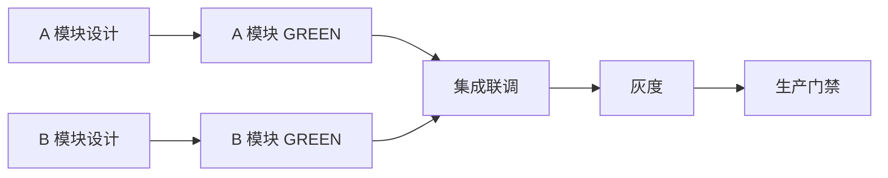

# Dream Eng Mgmt Workflow — 工程管理工作流 SKILL

> 把"需求拆解（WBS）→ 里程碑规划（M1-M4）→ 依赖关系图（DAG）→ 排期+估时 → 风险预案 → hermes 反思"的工程管理流程固化为可复用编排，元 SKILL 为 `dream-qwen-eval-collab`，结尾执行 hermes 反思决定是否再衍生新 SKILL。

> **双位置存储**：本 SKILL 同时存在于：
> - `.trae/skills/dream-eng-mgmt-workflow/SKILL.md`（TRAE 调用入口）
> - `1-ARCHITECTURE/skills/dream-eng-mgmt-workflow/SKILL.md`（项目级索引发现，本文件）

---

## 一、何时调用（触发条件）

满足以下任一条件即应调用本 SKILL：

1. **工程管理**：用户需要对一个项目/阶段做工程化拆解、排期、里程碑规划
   - 触发词：「工程管理」「排期」「里程碑」「依赖关系」
2. **多模块协同**：一个目标涉及 ≥ 3 个模块/团队，需要 DAG 依赖图避免并行冲突
3. **spec 落地排期**：`dream-qwen-eval-collab` 产出的 spec 需要转化为可执行排期
4. **hermes 反思**：排期/里程碑结束后，用户希望反思是否形成/衍生新 SKILL
   - 触发词：「形成 SKILL」「反思」「hermes」「可复用经验」

**与 `dream-operation-director` 的边界**：`dream-operation-director` 是运营总监（流程优化、协调），偏日常运营；本 SKILL 用于"新项目/新阶段的工程化排期"，产出是 WBS + 里程碑 + DAG + 排期表。

---

## 二、5 步标准流程

### 步骤 1：需求拆解（WBS 工作分解）

**输入**：项目目标文本（或来自 `dream-strategy-research` / `dream-qwen-eval-collab` 的 spec）

**处理**：
1. 把项目目标拆为 3 层 WBS：项目 → 阶段 → 工作包（work package）
2. 每个工作包必须满足 8/80 原则（工时 8h-80h，过粗则拆，过细则合）
3. 每个工作包标注：负责人占位 / 验收标准 / 工程约束（HC-1a/HC-9/FAIL-OPEN/零回归）
4. 识别可并行 vs 必须串行的工作包

**输出**：WBS 表（markdown）

```markdown
## WBS — <项目名>

| WBS ID | 工作包 | 负责人 | 验收标准 | 约束 | 并行性 |
|--------|--------|--------|---------|------|--------|
| 1.1.1 | <工作包 A> | <占位> | <判据> | HC-1a/零回归 | 可并行 |
| 1.1.2 | <工作包 B> | <占位> | <判据> | FAIL-OPEN | 依赖 1.1.1 |
| 1.2.1 | <工作包 C> | <占位> | <判据> | HC-9 | 可并行 |
```

**8/80 原则校验**：每个工作包估时若 < 8h，合并到父包；若 > 80h，继续拆分。

### 步骤 2：里程碑规划（M1-M4 框架）

**输入**：WBS 表

**处理**：把 WBS 阶段映射到 4 个里程碑（M1-M4 是 dreambuddy-v2 的标准框架，可按项目调整）：

| 里程碑 | 定位 | 退出准则（必须可验证） |
|--------|------|----------------------|
| M1 调研/设计冻结 | 命题+方案+spec 锁定 | spec 评审通过 + 5 维评分 ≥ 9.0 |
| M2 核心模块 GREEN | 关键路径模块 TDD 全绿 | 核心模块单元测试 100% pass + 零回归 |
| M3 集成/灰度 | 模块联调 + 灰度验证 | E2E 验收全过 + 灰度 N 天无 P0 |
| M4 生产准入门禁 | Live Trading 前全绿 | 门禁清单全绿 + 认知 verify 通过 |

**里程碑规划模板**：

```markdown
## 里程碑规划 — <项目名>

### M1 调研/设计冻结（目标 <日期>）
- 包含 WBS：1.1.x
- 退出准则：spec 评审通过 + 5 维评分 ≥ 9.0
- 关键风险：<描述>

### M2 核心模块 GREEN（目标 <日期>）
- 包含 WBS：1.2.x, 1.3.x
- 退出准则：核心模块 TDD 全绿 + 零回归
- 关键风险：<描述>

### M3 集成/灰度（目标 <日期>）
- 包含 WBS：2.1.x
- 退出准则：E2E 全过 + 灰度 N 天无 P0
- 关键风险：<描述>

### M4 生产准入门禁（目标 <日期>）
- 包含 WBS：2.2.x
- 退出准则：门禁清单全绿 + 认知 verify
- 关键风险：<描述>
```

**输出**：里程碑规划文档（含退出准则 + 关键风险）

### 步骤 3：依赖关系图（DAG，避免并行冲突）

**输入**：WBS 表 + 里程碑规划

**处理**：
1. 把工作包之间的依赖关系建模为 **DAG**（有向无环图）
2. 检测环路依赖（环路 = 工程设计缺陷，必须消除）
3. 识别**关键路径**（最长依赖链，决定项目最短工期）
4. 识别**可并行工作包**（无依赖关系，可同时推进）
5. 标注**资源冲突**（多个并行包争同一资源/人）

**DAG 表示模板**（mermaid）：



**关键路径分析**：
- 关键路径：1.1.1 → 1.1.2 → 2.1.1 → 2.2.1 → 2.2.2（总工期 = 路径上工作包估时之和）
- 缓冲建议：关键路径上每个工作包加 20% 缓冲，非关键路径加 10%

**已知坑**（必须遵守）：

| 坑 | 现象 | 解决 |
|----|------|------|
| 环路依赖 | DAG 出现环 | 必须消除，通常意味着工作包拆分边界不清，回到步骤 1 重新拆 |
| 隐性依赖没画 | A 实际依赖 B 但 DAG 没画 | 把"共享文件/共享配置/共享人"都画成依赖 |
| 关键路径太长 | 单链 N 个串行包 | 评估能否拆并行，或重排顺序缩短关键路径 |
| 资源冲突被忽略 | 两个并行包都要同一人 | 标注资源冲突，排期时错开 |

**输出**：DAG（mermaid） + 关键路径 + 并行包清单 + 资源冲突清单

### 步骤 4：排期 + 估时（人天 + 缓冲）

**输入**：DAG + 关键路径 + WBS 估时

**处理**：
1. 对每个工作包做三点估时：乐观 O / 最可能 M / 悲观 P，期望 = (O+4M+P)/6
2. 关键路径工作包加 20% 缓冲，非关键路径加 10%
3. 按里程碑归集排期，标注开始/结束日期
4. 资源冲突的工作包错开排
5. 复用 `dream-cost-control` 评估总人天成本 + ROI
6. 复用 `dream-task-creator` 把每个工作包创建为可跟踪任务

**排期表模板**：

```markdown
## 排期表 — <项目名>

| WBS ID | 工作包 | 估时(人天) | 缓冲 | 开始 | 结束 | 里程碑 | 依赖 |
|--------|--------|-----------|------|------|------|--------|------|
| 1.1.1 | A 设计 | 3 (O2/M3/P6) | +20% | M/D | M/D | M1 | - |
| 1.1.2 | A GREEN | 5 (O4/M5/P8) | +20% | M/D | M/D | M2 | 1.1.1 |
| 1.2.1 | B 设计 | 2 (O1/M2/P4) | +10% | M/D | M/D | M1 | - |
| ... | ... | ... | ... | ... | ... | ... | ... |

**总人天**：<N> 人天（含缓冲）
**关键路径工期**：<N> 天
**预计 M4 完工**：<日期>
```

**输出**：排期表（含三点估时 + 缓冲 + 日期） + 任务清单（`dream-task-creator` 产物）

### 步骤 5：风险预案 + hermes 反思

**输入**：排期表 + DAG + 关键风险清单

**处理**：
1. 汇总各里程碑的关键风险，按"概率 × 影响"排序
2. 每个高优风险制定预案：规避 / 缓解 / 转移 / 接受
3. 设定**风险触发器**（什么信号出现就启动预案）
4. 输出工程管理报告给用户审阅
5. 用户确认后，调用认知系统 `record` 记录经验
6. **hermes 反思**：评估本次流程是否值得形成/衍生新 SKILL（决策树见第五节）

**风险预案模板**：

```markdown
## 风险预案 — <项目名>

| 风险 ID | 风险描述 | 概率 | 影响 | 优先级 | 预案 | 触发器 |
|---------|---------|------|------|--------|------|--------|
| R1 | <描述> | 高/中/低 | 高/中/低 | P0/P1/P2 | 规避/缓解/转移/接受：<措施> | <信号> |
```

**工程管理报告模板**：

```markdown
# <项目名> — 工程管理报告

> 日期：YYYY-MM-DD
> 来源：WBS + 里程碑 + DAG + 排期 + 风险
> 总人天：<N>（含缓冲）
> 预计 M4 完工：<日期>

## 一、WBS
（步骤 1 表格）

## 二、里程碑（M1-M4）
（步骤 2 规划）

## 三、依赖关系图（DAG）
（步骤 3 mermaid + 关键路径）

## 四、排期表
（步骤 4 表格 + 总人天 + 完工日期）

## 五、风险预案
（步骤 5 风险表）

## 六、落地执行原则
TDD 红-绿-重构 + HC 合规 + FAIL-OPEN + 模块化开关 + 认知闭环
```

**输出**：工程管理报告路径（建议 `.trae/documents/<project>-eng-mgmt.md`） + 任务清单

**record 模板**：

```
record(
  content="[工程管理] <项目一句话> | WBS <N>包 | 里程碑 M1-M4 | 关键路径 <N>天 | 总人天 <N> | 风险 P0<P0数> P1<P1数>",
  quality_level="B",
  tags="工程管理,协作流程,WBS,里程碑,DAG,hermes反思,可复用,<域标签>"
)
```

---

## 三、输入输出契约

| 阶段 | 输入 | 输出 |
|------|------|------|
| 步骤 1 | 项目目标 / spec | WBS 表（8/80 校验） |
| 步骤 2 | WBS 表 | 里程碑规划（M1-M4 + 退出准则） |
| 步骤 3 | WBS + 里程碑 | DAG（mermaid） + 关键路径 + 并行包 + 资源冲突 |
| 步骤 4 | DAG + 关键路径 | 排期表（三点估时 + 缓冲 + 日期） + 任务清单 |
| 步骤 5 | 排期表 + 风险清单 | 工程管理报告 + 风险预案 + 认知 record |

---

## 四、相关 SKILL 与文档

| 类型 | 名称 | 用途 |
|------|------|------|
| 元 | `dream-qwen-eval-collab` | 本 SKILL 的元编排，hermes 反思决策树来源 |
| 上游 | `dream-strategy-research` | A1 深度调研（项目目标的前置调研） |
| 上游 | `dream-qwen-eval-collab` | spec 来源（步骤 1 可选输入） |
| 工具 | `dream-operation-director` | 运营协调（资源调度、流程优化） |
| 工具 | `dream-cost-control` | 成本控制（总人天成本 + ROI 评估） |
| 工具 | `dream-task-creator` | 任务创建（工作包转为可跟踪任务） |
| 下游 | `dream-tdd-dev-workflow` | 工作包落地为 TDD 开发 |
| 下游 | `dream-bugfix-workflow` | 排期执行中出 bug 转修复流程 |
| 元 | `skill-creator` | hermes 反思后创建新 SKILL |
| 认知 | `recall`/`record`/`verify` | 认知闭环 |

---

## 五、hermes 反思决策树

> 引用元 SKILL `dream-qwen-eval-collab` 第五节决策树（来源记忆 `VM-1790001702811-24bffe86`，B 级硬约束）。

```
本次工程管理流程是否值得形成/衍生 SKILL？
├── 是（满足以下任一）：
│   ├── 流程被复用 ≥ 2 次
│   ├── 涉及多步编排（≥ 3 步，本 SKILL 5 步满足）
│   ├── 涉及多团队/多模块协同（≥ 3 个并行工作包）
│   └── 用户明确要求「形成 SKILL」
│   → 调用 skill-creator 创建新 SKILL
│   → record 经验，tags 含「SKILL,hermes反思」
│
└── 否（满足以下全部）：
    ├── 单人小项目
    ├── 无并行/无依赖
    └── 无复用价值
    → 仅 record 经验
    → tags 不含「SKILL」
```

**工程管理特有反思**：DAG 中出现的"资源冲突模式"或"关键路径反复超期模式"是否值得沉淀为新的检查清单 SKILL？若是，优先衍生。

---

## 六、认知闭环（recall + record + verify）

**任务开始前**（硬约束，不可跳过）：

```
recall(context="工程管理 <项目/排期关键词>", top_k=5, min_quality="C")
```

**任务完成后**：

```
record(content="<本次工程管理摘要> | WBS <N>包 | 关键路径 <N>天 | 总人天 <N> | 风险 P0<P0数>",
       quality_level="B",
       tags="工程管理,协作流程,WBS,里程碑,DAG,hermes反思,可复用,<域标签>")

# 如已验证某条已有记忆
verify(memory_id="VM-xxx", success=true)
```

**已沉淀的认知记忆**（可 recall 复用）：

| Memory ID | 等级 | 内容摘要 |
|-----------|------|---------|
| `VM-1790001702811-24bffe86` | B | hermes 反思决策树硬约束（4 延伸 SKILL 配套） |
| `VM-1789993099772-45aec081` | B | 风控表达增强落地（含 N 周里程碑 + P0/P1/P2 三阶段排期实践） |
| `VM-1789992719715-f884f70b` | B | 背压舱壁隔离落地（独立模块零回归 + 21/21 GREEN，排期估算参考） |
| 本 SKILL 创建后新增 | B | 工程管理落地经验，tags 含「SKILL,工程管理,hermes反思」 |

---

## 七、版本历史

| 版本 | 日期 | 变更 |
|------|------|------|
| 1.0.0 | 2026-09-21 | 初始版本，5 步流程 + WBS/里程碑/DAG/排期/风险预案 + hermes 反思决策树 |
