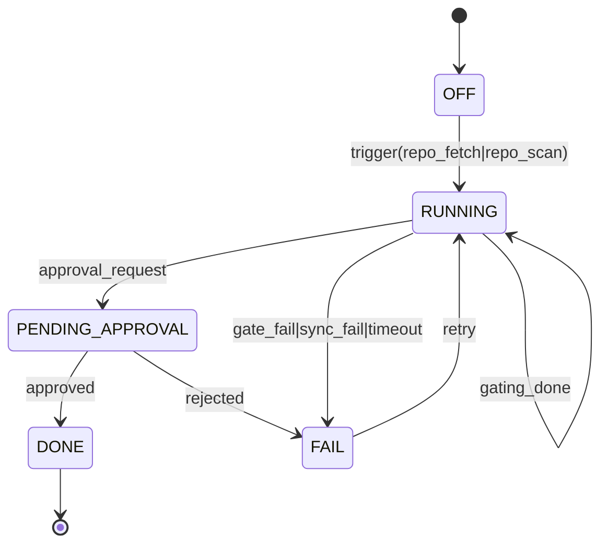
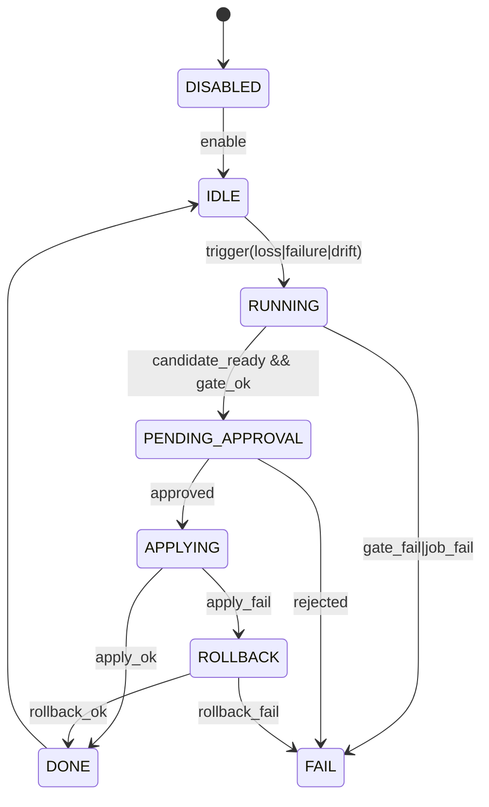
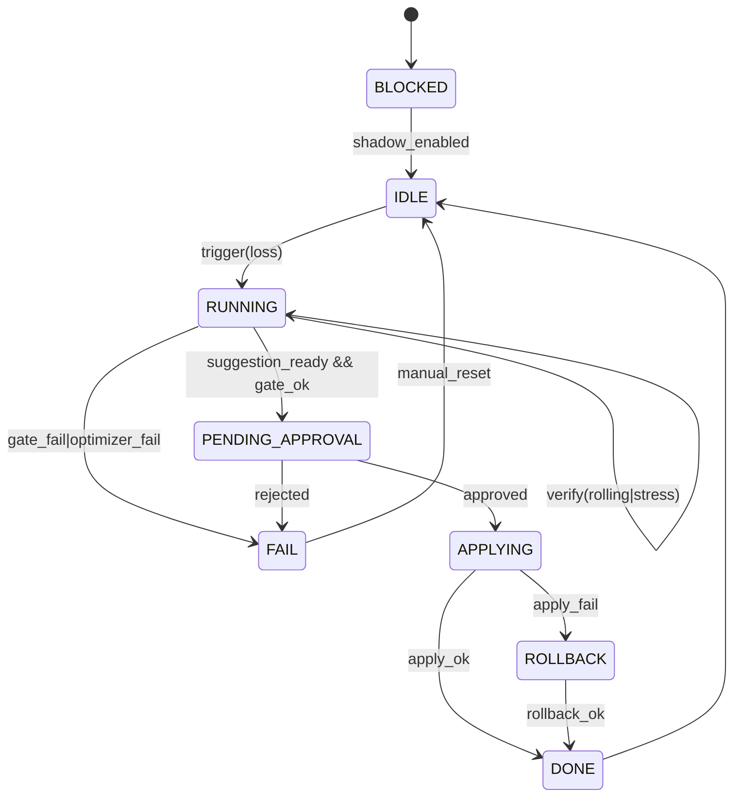

# 交易AI Agent 综合技术文档（以 2.0 为目标）

本文档以“交易AI Agent 技术文档 2.0”为当前目标架构（Strategy 体系为主线，Quant 体系仅保留扩展接口），并将旧版技术文档中的资金安全门禁、观测告警、诊断与审计、沙箱与灰度回滚等关键内容整合进来，形成 AI Agent/沙箱范围内的单一维护文档（SSoT），系统生产侧行为边界以 [技术文档.md](file:///Users/zhangjiangtao/ft_userdata/经典指标机器学习系统/技术文档.md) 为准。

## 1. 目标、非目标与原则

### 1.1 目标（2.0）
- 建立可控闭环：任务指令 → 策略处理 → 沙箱验证 → 门禁通过 → 灰度发布/回滚 → 复盘归档。
- 保持工程轻量：围绕 Strategy 的“策略库管理 + 沙箱回测/评估 + 发布运维”最小闭环落地。
- 强化可运维性：运行态可观测、可诊断、可回滚；所有动作可审计。
- 强制隔离外联：推特/TG/搜索/GitHub 等外部网络能力仅在宿主侧执行，沙箱禁网。

### 1.2 非目标（当前阶段不做）
- 不让 AI Agent 直接控制实盘下单与关键风控。
- 不在 Quant 体系内进行深度改造与并行优化（仅保留扩展接口）。
- 不接入多渠道复杂社交平台（优先推特 + TG，其他作为扩展）。

### 1.3 关键原则（从旧版继承并固化）
- 最小权限：按层级拆分能力（只读监控/诊断/受控触发/沙箱优化/灰度发布），默认只读。
- 可回滚：任何会改变运行行为的动作必须具备回滚点（配置快照或版本化变更包）。
- 可审计：记录触发原因、证据、输入、输出、执行结果与责任链。
- 单一事实来源：系统行为约束以 [技术文档.md](file:///Users/zhangjiangtao/ft_userdata/经典指标机器学习系统/技术文档.md) 为准。

#### 1.3.1 两份文档分工（强约束）

为避免“对话记忆漂移”和“口径不一致”导致的误判，本系统明确将两份文档分工并固化为运行约束：

1) [技术文档.md](file:///Users/zhangjiangtao/ft_userdata/经典指标机器学习系统/技术文档.md)
- 定位：交易系统长期记忆（SSoT / Runbook）。
- 覆盖：工程索引、FAQ、链路口径、路由规则、排障入口、生产侧行为边界。
- 使用：凡涉及“交易系统怎么跑、链路怎么走、为什么没下单/被拒绝、异常信号/异常订单如何定位”等问题，必须优先检索并引用本文件。

2) 本文档（交易AI Agent 技术文档 2.0）
- 定位：AI Agent 与沙箱体系的系统内技术文档（边界、门禁、审计、沙箱闭环、Skills 外联与 outbox 机制）。
- 覆盖：/agent/chat 事件协议、工具编排边界、审批与回滚路径、审计回放口径、沙箱输入输出规范。
- 使用：凡涉及“agent/沙箱/技能怎么用、怎么门禁、怎么审计回放、如何形成变更包并走审批”等问题，以本文档为准；若与 技术文档.md 冲突，以 技术文档.md 为准。

### 1.4 系统边界与变更控制（强约束）

#### 1) 成熟的 ML 交易系统（生产侧，受保护边界）
- 定义：承担实盘执行、风控、策略运行、资金安全门禁、以及生产数据/状态写入的系统。
- 变更控制：任何涉及“生产侧执行链路/风控逻辑/核心策略运行/关键配置生效方式”的代码改动，默认禁止；必须获得人工明确批准后才允许修改与上线。
- 交互方式：对外仅通过受控接口暴露只读观测与有限的受控写操作；写操作必须可审计、可回滚。

#### 2) AI Agent（调度与思考，不直接改写生产）
- 定义：负责理解意图、拆解任务、调度 Skills、触发沙箱任务、产出可解释建议与变更包。
- 约束：AI Agent 不直接接触实盘下单与风控执行接口；任何“可能改变生产行为”的动作都必须走审批（人工或 Policy）。

#### 3) 沙箱工具（原“交易AI Agent”更名为沙箱）
- 职责：策略回测、优化、评估、稳健性检查、合规扫描、产出报告与候选变更包。
- 环境约束：默认禁网、无真实密钥、无真实下单。
- 产物输出：报告、评估结论、变更包、回滚点建议。
- 上线约束：沙箱产物不得自动写入生产；必须进入审批链路（人工或 Policy）并由受控写入口执行后才允许更新到交易系统。

#### 4) 三大 Skills（能力边界固定）
- 联网：仅用于信息检索与研究输入；不得用于直接改写生产配置。
- GitHub 下载：仅允许白名单仓库；用于策略库入库与沙箱评估输入。
- 推特/TG 消息互通：仅发布“已通过门禁/已审批”的信号或公告；不得发布未审核的高风险执行指令。

#### 5) 策略库（版本化与可追溯）
- 定义：统一管理策略来源、版本、参数、回测/稳健性结果、灰度表现与回滚记录。
- 约束：策略入库与变更包入库必须携带证据与文档引用；可追溯到数据快照与配置快照。

#### 6) 系统维护（运维可用但默认只读）
- 定义：探活、诊断、缓存/资源维护、自愈清理、审计归档等。
- 约束：默认只读；受控触发类维护动作必须可审计且可回滚。

#### 7) 对话入口 + 本地客户端（Gemini/本地大模型，待评估）
- 目标：提供“对话 + 任务调度 + 回执展示”的本地入口，可连接 Web 控制台或桌面壳。
- 现状：作为需要进一步探讨的选项；若大模型推理/调度负载过高导致系统不稳定，可降级为仅展示与手动触发。

#### 1.4.1 技术实践可行性结论（理论研究）

总体判断：本方案与当前代码架构高度兼容，短期落地以“配置与流程固化”为主，不要求大规模重构。

关键依据（以现有实现为准）：
- 生产侧边界已存在：生产配置写入与高风险开关集中在 `/config/set`，并支持 Token 鉴权与 `confirm_live` 等前置校验。
- 维护层已独立：`/maintenance/*`、`/engineering/index`、`/selfcheck` 可承载探活、诊断与资源维护，且具备独立鉴权口径。
- 沙箱能力已成型：回测/评估/稳健性/训练等能力已通过 `/automation/*`、`/backtest/*`、`/evaluation/*` 暴露，更符合“沙箱工具”的职责边界。
- 控制台仅做编排：/agent 页面以只读轮询为主，受控触发通过本地 execute_token 二次确认与后端 Token 双层门禁降低误触发。

主要风险（需通过运维与流程控制消解）：
- 未在生产环境强制设置 `CONFIG_TOKEN/MAINTENANCE_TOKEN` 时，“受保护边界”会被弱化。
- Skills 范围扩张或外联能力下沉到沙箱/生产进程，会破坏“禁网与最小权限”原则。
- 将“沙箱产物自动写入生产”会造成不可控变更；必须保留人工审批与可回滚路径。

结论：在强制 Token、网络隔离、人工审批、可回滚/可审计四项约束成立时，本方案可稳定落地并具备可运维性。

### 1.5 实施路线与检查清单（Phase 0–5）

#### Phase 0：生产边界加固
- 强制设置 `CONFIG_TOKEN` 与 `MAINTENANCE_TOKEN`（生产环境必选）。
- 关闭远程写入：默认 `config_allow_remote=false`、`maintenance_allow_remote=false`（或仅允许运维跳板）。
- 网络隔离：服务仅绑定 `127.0.0.1` 或置于内网；对外访问通过受控隧道/网关。
- 验收标准：生产环境 Token 强制启用且远程写入默认关闭，对外暴露经网关受控并可审计。

#### Phase 1：AI Agent 与沙箱的使用边界固化
- /agent 默认只读观测 + 沙箱任务编排，不作为生产写入入口。
- 生产变更唯一入口：由审批执行器（运维脚本/受控进程）调用 `/config/set`（携带 Token，必要时 `confirm_live=true`）。
- 所有受控动作必须落审计（建议通过 `/agent/audit/actions` 或运维侧审计日志）。
- 验收标准：/agent 无生产写入路径；生产写入仅 `/config/set` 且需 Token+确认；关键动作可追溯到审计记录。

#### Phase 2：沙箱工具标准化
- 固化沙箱输入：数据快照、配置快照、策略版本三件套可复现。
- 固化沙箱输出：回测报告、稳健性结论、评估摘要、候选变更包（可导出 JSON）。
- 禁止沙箱直连真实下单与密钥加载（默认禁网、无密钥）。
- 验收标准：任一沙箱任务可用“三件套”复现；输出包含报告+摘要+变更包；沙箱环境不具备联网与真实密钥能力。

#### Phase 3：三大 Skills 集成（能力边界不扩张）
- 联网：仅用于信息检索与研究输入，运行在宿主侧（与生产/沙箱隔离）。
- GitHub 下载：仅允许白名单仓库；进入策略库与沙箱评估，不得直接覆盖生产代码。
- 推特/TG：仅发布“已通过门禁/已审批”的信号或公告；建议采用 outbox/队列异步发送。
- 验收标准：三项外联能力均与生产/沙箱隔离；GitHub 仅白名单可用；对外发布只能来自已审批事件且具备可回放记录。

#### Phase 4：策略库规范化（版本化与可追溯）
- 统一记录：来源（repo+commit）、版本、参数、回测/稳健性摘要、门禁结论、灰度与回滚记录。
- 统一关联：可追溯到数据快照、配置快照、报告文件与审计事件。
- 验收标准：任一生产启用策略均可追溯到“来源+版本+参数+报告+门禁+灰度/回滚+审计链路”。

#### Phase 5：系统维护与对话客户端落地
- 维护接口分层：探活/诊断、资源/缓存、清理/自愈三类（默认只读，写需 Token）。
- 对话入口：优先 Web 控制台；本地客户端作为可选增强。
- 大模型接入：先以“建议生成与调度”为主；若推理负载影响稳定性，允许降级为纯展示与手动触发。
- 验收标准：维护写操作具备 Token 门禁与审计；Web 控制台可完成观测/诊断/受控触发；大模型不可用时可降级且不影响核心运行。

### 1.6 技术落地清单与实施节奏（阶段 A–C）

#### 阶段 A：安全边界与只读闭环（约 1–2 周）
- 完成生产环境 `CONFIG_TOKEN/MAINTENANCE_TOKEN` 与网络拓扑固化（仅本机或内网）。
- 按 1.4 边界要求核对 /agent 行为，确保无“隐性生产写入口”，只保留受控触发路径。
- 将 `/maintenance/*`、`/engineering/index`、`/selfcheck` 按“探活/诊断/自愈”三类标注并固化调用约定。
- 落地最小观测与告警：`/health`、`/metrics`、关键 P0/P1 告警规则可用并经过演练。

#### 阶段 B：沙箱与策略库闭环（约 3–6 周）
- 标准化沙箱输入输出：固定以 `user_data/backtest_results/` 下的 zip 为载体，三件套最小定义为 `{data_snapshot_id, config_version, strategy_key}`，其中：
  - data_snapshot_id：来自回放数据窗口与环境说明，可通过 backtest 报告中的时间窗口与币种集合重建（当前采用 timerange + 交易对集合作为近似标识）。
  - config_version：对应运行时 `user_data/ml_config.json` 的版本或哈希，先以“当前配置快照 + 变更包中的 config_diff”组合实现可回放。
  - strategy_key：对齐 backtest 报告中的 `key` 字段（如 `Strategy005`），作为策略版本在策略库中的主键之一。
- 完成策略库 MVP：以“backtest 结果 + 评估摘要”为输入，在策略库中统一记录 `source.zip`、`strategy_key`、参数摘要与核心评估结果（profit_factor、max_drawdown、trades、winrate 等），先通过人工脚本从 `/backtest/report/latest` 与 `/backtest/report?zip=...` 提取信息并落地。
- 打通“线上观测 → 沙箱重放 → 变更包 → 人工审批”的最短链路：基于现有接口，先以一条脚本链路实现最小闭环——从 `/metrics` 和 `/audit/alerts/evaluate` 发现问题 → 手动选择 backtest zip（`/backtest/results`）并在 /agent 页面触发 `/automation/backtest/run` 与 `/backtest/robustness` → 将生成的 backtest 报告与门禁指标整理成一份 JSON 变更包（结构参考第 8 章示例）→ 由人工在技术文档与变更包基础上审批并决定是否调用 `/config/set`。
- 结合 7.3 的门禁指标模板，确定首批 P3 门禁指标与回滚策略：从 `/backtest/report/latest` 返回的 `metrics_summary` 与 `aligned_metrics` 中选取 Profit Factor、最大回撤、交易次数等指标，对照 7.3 的模板落地门禁阈值，并在沙箱环境完成至少一次“门禁通过 / 失败 → 形成变更包 → 人工决定是否应用”的端到端演练（不要求自动写入生产）。

#### 阶段 C：外联集成与运维运营化（约 3–5 周）
- 按 10.1 混合方案集成 Clawdbot，承载 ④+⑦（外联 Skills、消息分发、对话入口、人工审批形态），并验证其与生产/沙箱的隔离边界。
- 将 `/agent/push/*` 与 `user_data/agent_outbox/` 体系打通，实现对外通知的 outbox + 重试 + 幂等 + 审计闭环（由宿主侧完成最终投递）。
- 完成对话入口的最小闭环：Web 控制台为主入口，支持“任务指令 → 沙箱/维护任务触发 → 回执展示”，本地客户端作为可选增强。
- 从运维视角补齐日常巡检与诊断节奏：包括固定巡检脚本、关键 Dashboards 与异常处理 SOP，与本技术文档约束保持一致。

### 1.7 /agent 自动化管理模块（UI PRD + 字段契约 + 状态机图）

本节将“策略生产”定义为产物驱动的流水线：每一步都必须落盘为标准 JSON（trace 可回放），下游只消费上游产物。UI 仅做“可运营/可观测”的呈现与受控触发，不参与推断与补算，避免口径漂移。

#### 1.7.1 背景与目标

- 背景：当前 /agent 具备只读观测与受控触发能力，但自动化链路缺少“统一运营视图”，导致卡点不可视、审批不可达、跨模块联动成本高。
- 目标：在 `http://localhost:<ui_port>/agent` 首页增加“自动化管理”模块，以卡片形式承载各条自动化链路的状态、进度、卡点与跳转入口（示例：Prod=3001 / Explore=3002 / Pilot=3003）。
- 非目标：
  - 不在 UI 端引入任何“推断型状态”（例如从日志文本猜测阶段）。
  - 不在 UI 端直接写入生产配置；写入仍遵循 3.1 的分层与审批约束。

#### 1.7.2 角色与权限（只读默认 + 受控触发）

- Read-only（默认）：可查看所有状态卡、进度条、卡点与 trace 回放入口。
- Operator（需本地 execute_token）：允许触发“受控动作”（启动/停止/重试/刷新），动作必须二次确认并落审计。
- Admin（可选）：仅用于配置白名单与维护类动作；不改变生产边界约束。

#### 1.7.3 页面信息架构（新增“自动化管理”分组）

在 `/agent` 首页新增一个分组：**自动化管理**（Automation Management），包含 6 张卡片（先覆盖核心 1–5，第 6 预留扩展）：

1) **影子闭环总开关（Shadow Loop Switch）**
- 目的：统一入口显示 “影子闭环是否允许自动运行”，并提供“自动启动（autostart）”配置。

2) **策略供应链（拉取→入库→沙箱评估→分档→审批）**
- 目的：对策略库导入/评估/入库/门禁/审批形成统一进度条，并一键跳转到审批区。

3) **策略自动影子闭环（可运营/可观测）**
- 目的：对影子闭环的“触发→候选生成→沙箱门禁→审批→执行/回滚”形成进度与卡点，并一键跳转到策略审批区。

4) **贝叶斯参数优化自动化（可运营/可观测）**
- 目的：对 “亏损触发→参数寻优→验证→审批→应用/回滚”形成进度与卡点。
- 强约束：仅当 “策略影子自动化 enabled” 时才允许开启（UI 需明确展示 disabled reason）。

5) **推特自动发推状态**
- 目的：监控推送开关、队列、失败率、最近一次成功/失败与跳转入口。

6) **其他自动化模块（预留）**
- 目的：为后续扩展（TG、GitHub ingest 批量化、数据维护自动化等）预留统一卡片契约。

#### 1.7.4 卡片统一展示规范（运营可扫一眼）

每张卡片必须包含以下固定区块：

- **状态行**：`status`（ON/OFF/RUNNING/BLOCKED/ERROR）+ `updated_ago`（最近更新时间）
- **进度条**：当前 `trace_id` 的进度百分比（0–100）
- **卡点行**：`stuck_at` + `stuck_for` + `reason`（可选）
- **操作行**：主按钮（启停/重试/刷新）+ “查看链路/跳到审批”跳转按钮

说明：
- 进度条计算仅基于“产物存在性与状态字段”，不得从 stdout/stderr 或日志正文推断。
- 卡点行需能解释“为什么没继续”，例如：`queue_full`、`gate_fail`、`approval_pending`、`twitter_auth_expired`。

#### 1.7.5 进度条与卡点口径（强约束：产物驱动）

##### A) 策略供应链进度（4 步）

步骤定义（固定）：
1. 拉取/扫描（repo_fetch/repo_scan 产物出现）
2. 入库（registry sync / candidate_strategies 产物出现）
3. 沙箱评估/分档（gating_report 产物出现）
4. 审批（approval_request 产物出现或 approvals.pending 命中 trace）

进度计算：
- done_steps / 4 * 100，四舍五入取整。

卡点定义：
- `stuck_at` = 最后一个已完成步骤的下一步（或当前运行步骤）
- `stuck_for` = now - last_progress_ts
- `reason` 优先来自产物中的 machine-readable 字段（例如 gating_report.decision / error_code / block_reasons）。

##### B) 策略影子闭环进度（5 步）

步骤定义（固定）：
1. 触发（trigger 产物出现：例如 execution.failure.trigger / pnl.escalate）
2. 候选生成（candidate_strategies / change_bundle_draft 产物出现）
3. 沙箱门禁（gating_report）
4. 审批（approval_request 或 approvals.pending 命中）
5. 执行/回滚（execution.apply.result 或 auto_rollback 产物出现）

##### C) 贝叶斯参数优化自动化进度（6 步）

步骤定义（固定）：
1. 触发（loss/dd/winrate 触发产物）
2. paramopt.run（paramopt_run 产物，含 job_id）
3. 建议产出（paramopt_suggestion / change_bundle_draft(kind=paramopt_config_keys)）
4. 验证（rolling_verify / stress / robustness 产物）
5. 审批（approval_request 或 approvals.pending）
6. 应用/回滚（config.set.result / auto_rollback）

硬门禁：
- 若 shadow_enabled=false，则 paramopt automation 卡片必须显示 `status=BLOCKED`、`reason=shadow_disabled`，并将“启用按钮”置灰。

##### D) 推特自动发推状态（无进度条或 3 步简化）

最小 3 步（可选）：
1. auth ok
2. outbox 非阻塞（队列可写）
3. 最近一次投递成功

#### 1.7.6 跳转与 deep-link 规范

- “跳到审批区”统一跳转到：`/agent/ops?trace_id=<trace_id>#approvals`
- “查看流水线”统一跳转到：`/agent/ops?trace_id=<trace_id>#pipeline`
- “查看 trace 回放”统一跳转到：`/agent/ops?trace_id=<trace_id>#trace_replay`（或在 ops 页内切换）
- UI 必须支持从 URL 自动带入 `trace_id`（只读派生，不要求写入本地 state）。

#### 1.7.7 字段契约（JSON Schema，标准化版本）

本节定义 UI 与后端之间的“产物契约”。所有 schema 必须版本化；允许新增字段但不得破坏旧字段语义。

##### 1) 通用：Artifact Common Fields

```json
{
  "$schema": "https://json-schema.org/draft/2020-12/schema",
  "$id": "https://local.schemas/agent/artifact_common.v1.schema.json",
  "title": "ArtifactCommonV1",
  "type": "object",
  "additionalProperties": true,
  "required": ["schema_version", "trace_id", "created_at_ms", "producer_kind"],
  "properties": {
    "schema_version": { "type": "string", "const": "v1" },
    "trace_id": { "type": "string", "minLength": 1 },
    "created_at_ms": { "type": "integer", "minimum": 0 },
    "producer_kind": { "type": "string", "enum": ["agent", "sandbox", "host", "system"] }
  }
}
```

##### 2) 通用：Pipeline Artifact Envelope（落盘记录）

```json
{
  "$schema": "https://json-schema.org/draft/2020-12/schema",
  "$id": "https://local.schemas/agent/pipeline_artifact_envelope.v1.schema.json",
  "title": "PipelineArtifactEnvelopeV1",
  "type": "object",
  "additionalProperties": true,
  "required": ["id", "trace_id", "ts", "type", "kind", "sha256", "artifact"],
  "properties": {
    "id": { "type": "string", "minLength": 1 },
    "trace_id": { "type": "string", "minLength": 1 },
    "ts": { "type": "integer", "minimum": 0 },
    "type": { "type": "string", "const": "pipeline.artifact" },
    "kind": { "type": "string", "minLength": 1 },
    "sha256": { "type": "string", "minLength": 16 },
    "artifact": { "$ref": "https://local.schemas/agent/artifact_common.v1.schema.json" }
  }
}
```

##### 3) UI 直供：Automation Card State Snapshot

```json
{
  "$schema": "https://json-schema.org/draft/2020-12/schema",
  "$id": "https://local.schemas/agent/automation_card_state.v1.schema.json",
  "title": "AutomationCardStateV1",
  "type": "object",
  "additionalProperties": true,
  "required": ["schema_version", "card_id", "status", "updated_at_ms"],
  "properties": {
    "schema_version": { "type": "string", "const": "v1" },
    "card_id": {
      "type": "string",
      "enum": [
        "shadow_switch",
        "strategy_supply_chain",
        "strategy_shadow_loop",
        "paramopt_automation",
        "twitter_delivery",
        "other"
      ]
    },
    "status": { "type": "string", "enum": ["OFF", "ON", "RUNNING", "BLOCKED", "ERROR"] },
    "updated_at_ms": { "type": "integer", "minimum": 0 },
    "trace_id": { "type": ["string", "null"] },
    "progress": { "$ref": "https://local.schemas/agent/automation_progress.v1.schema.json" },
    "stuck": {
      "type": ["object", "null"],
      "additionalProperties": true,
      "properties": {
        "stuck_at": { "type": "string" },
        "stuck_since_ms": { "type": "integer", "minimum": 0 },
        "reason_code": { "type": "string" },
        "reason": { "type": "string" }
      }
    },
    "actions": {
      "type": "array",
      "items": {
        "type": "object",
        "additionalProperties": true,
        "required": ["id", "label", "kind"],
        "properties": {
          "id": { "type": "string" },
          "label": { "type": "string" },
          "kind": { "type": "string", "enum": ["navigate", "readonly", "controlled"] },
          "href": { "type": "string" },
          "request": { "type": "object" }
        }
      }
    }
  }
}
```

##### 4) UI 直供：Progress Snapshot（步骤与进度条）

```json
{
  "$schema": "https://json-schema.org/draft/2020-12/schema",
  "$id": "https://local.schemas/agent/automation_progress.v1.schema.json",
  "title": "AutomationProgressV1",
  "type": "object",
  "additionalProperties": true,
  "required": ["schema_version", "steps", "pct"],
  "properties": {
    "schema_version": { "type": "string", "const": "v1" },
    "pct": { "type": "integer", "minimum": 0, "maximum": 100 },
    "steps": {
      "type": "array",
      "minItems": 1,
      "items": {
        "type": "object",
        "additionalProperties": true,
        "required": ["key", "label", "status"],
        "properties": {
          "key": { "type": "string" },
          "label": { "type": "string" },
          "status": { "type": "string", "enum": ["WAIT", "RUN", "DONE", "FAIL", "SKIP"] },
          "ts_ms": { "type": ["integer", "null"], "minimum": 0 },
          "evidence": { "type": "object" }
        }
      }
    }
  }
}
```

#### 1.7.8 卡片状态机图（Mermaid）

##### A) 策略供应链（Strategy Supply Chain）



##### B) 策略影子闭环（Shadow Loop）



##### C) 参数优化自动化（ParamOpt Automation）



#### 1.7.9 验收标准（UI + 契约）

- UI：/agent 首页新增“自动化管理”分组，至少覆盖 1–5 卡片。
- 可观测：任一卡片的进度条与卡点能够仅基于“产物字段”稳定渲染（不依赖日志推断）。
- 可运营：卡片提供一键跳转到 `/agent/ops?trace_id=...#approvals`，能定位审批卡点。
- 契约：后端对每条链路至少提供 1 个状态快照（card state）与 1 个可回放产物序列（pipeline artifacts）。
- 兼容：schema 升级必须通过 `schema_version` 明确；旧 UI 仍可读取核心字段（trace_id/status/pct/steps）。

#### 1.7.10 全局交易工作流（GTW：全自动轮询编排层）

本节在现有 1–5 条“自动化管理链路”之上，增加一个**全局交易工作流（Global Trading Workflow, GTW）**作为编排层，用于将“交易数据分析 + 宏观趋势分析 + 三条优化路径”统一成可回放、可审计、可运营的闭环。

定位（强约束）：
- GTW 是“父工作流/编排器”，不替代现有链路；现有 1–5 仍保持各自的产物与进度口径。
- GTW 的输出必须落盘为标准 JSON 产物（见 1.7.11 的决策包），下游链路只消费该产物，不从 UI 或日志中推断状态，避免口径漂移。
- GTW 拥有独立的“总开关 + 熔断 + 冷却时间（cooldown）”，其优先级高于任何单链路开关，防止连锁自动化在异常环境下持续放大风险。

GTW 的最小闭环（建议固定阶段）：
1) 交易数据分析（复用既有模板产物，形成结构化摘要）
2) 宏观趋势分析（新增模块，基于“三屏交易 + 宏观调控”数据形成 regime/置信度/风险预算）
3) 决策编排（生成决策包：选择是否触发三条路径、写明门禁/依赖/审批/回滚）
4) 触发执行（仅通过“受控触发接口”触发下游工作流，不直接写入生产）
5) 观测验证（对齐 1.7.5 的产物口径：回测/稳健性/门禁结果必须可回放）
6) 应用/回滚（对齐 3.1 的 R2/R3 分层：R2 可受控写入，R3 仅产出变更包草案并进入审批）

轮询与事件触发（建议双机制并存）：
- 轮询：GTW 按固定节奏运行（例如 15m/1h/4h），每次运行仅做“生成决策包 + 门禁判定 + 可执行动作排队”，并保持幂等。
- 事件：当出现关键事件时可立即触发（不等待下一轮轮询），例如：连续亏损/回撤阈值触发、执行失败率突增、流动性/点差异常、宏观 regime 变化等。

幂等与去重（强约束）：
- 每次 GTW 运行必须生成唯一 `decision_id`；同一个 `decision_id` 的下游触发只能发生一次。
- 下游链路被触发时必须携带 `decision_id` 与 `idempotency_key`，重复请求不得重复执行，但必须回写回执与状态。

三条优化路径的统一编排（GTW 负责“该不该做”，链路负责“怎么做”）：
- 路径 1：贝叶斯参数优化自动化（ParamOpt Automation）
  - 目标：在策略结构仍有效但参数漂移时，执行“寻优 → 验证 → 审批 → 应用/回滚”闭环。
  - 硬依赖：仅当“策略影子自动化 enabled”时允许开启（对齐 1.7.3 卡片强约束），否则 GTW 必须在决策包中给出 `disabled_reason` 并禁止触发。
- 路径 2：策略库自动化更新（Strategy Supply Chain）
  - 目标：对“抑制亏损策略 + 添加优质策略”形成统一计划：拉取→入库→沙箱评估→分档→审批→上线/回滚。
  - 约束：新增策略必须提供与现有策略的相关性/覆盖的 regime 说明，避免堆叠同质策略导致组合回撤放大。
- 路径 3：策略自动影子闭环（Strategy Shadow Loop）
  - 目标：在参数无法修复或存在逻辑缺陷时，触发“候选变更（含调参或代码变更草案）→ 沙箱门禁 → 审批 → 执行/回滚”。
  - 风险：该路径可能涉及 R3（改代码），默认只生成变更包草案并进入审批，不允许自动在生产落地。

组合级风险预算（硬约束：必须可计算、可落盘）：
- GTW 的 `risk_budget` 不仅用于展示，必须能直接映射到“全局熔断/降级策略”的可计算阈值集合：最大名义敞口、最大杠杆、单品种/行业暴露上限、相关性/拥挤度上限、最大换手、最大日内亏损、最大回撤、VaR/ES（或至少压力测试损失阈值）。
- 风险预算必须以“本次决策的数据快照”为口径计算与落盘，避免因口径变动导致回放不可复现。
- 当任一硬阈值触发或数据不足以评估阈值时，GTW 必须进入降级或熔断状态（见 1.7.11.policy.circuit_breaker），并在决策包中记录触发原因与冷却时间。

变更管理边界（上位约束：对齐 3.1 R0–R3 与 3.2 P0–P3）：
- GTW 可以触发下游工作流，但不得绕过 3.1 的写入边界：R2/R3 的任何“生产行为变化”必须以审批驱动的受控写入口执行并落审计。
- 允许全自动执行的动作范围（推荐默认）：仅限“降风险/收敛暴露/止损类”动作（例如禁开仓/降低权重/提高门槛/收紧参数），且必须满足回滚点先行与审计可回放。
- 必须人工审批的动作范围（推荐默认）：扩大暴露、引入新策略或扩大交易对范围、放宽风险阈值、任何 R3（改代码）类变更。
- 当宏观 regime=RISK_OFF/LOW_LIQUIDITY 或模型置信度不足时，GTW 必须将所有“进攻型”路径计划标记为 disabled，并在决策包中给出明确的 `disabled_reason`。

模型风险（Model Risk：版本化 + 监控 + 降级）：
- 交易数据分析模板与宏观趋势判断均视为模型产物，必须版本化（模板版本/特征版本/模型版本/成本假设版本）并写入决策包血缘字段。
- 模型必须定义失效条件（例如：输入缺失、置信度崩塌、漂移超阈值、回测/稳健性指标无法收敛），触发后 GTW 必须降级为“只产出建议不触发执行”，直到恢复到可用状态。

时间一致性与数据修订风险（强约束：只使用截至某时点可获得的数据）：
- 决策包必须携带 `as_of_ts_ms` 与 `data_snapshot_id`（或不可变 hash），明确本次决策的“可用数据截面”，禁止使用未来可见的数据（隐性未来函数）。
- 对宏观数据必须记录 release_time_cutoff 与 revision_id（如适用）；若宏观数据存在修订，必须以快照口径回放，避免回测与实盘口径不一致。

#### 1.7.11 决策包（Decision Package：稳定数据结构，v1）

GTW 的核心产物为“决策包（Decision Package）”。其目标是提供一个稳定、可版本化的数据结构，使现有 1–5 链路几乎不改内部逻辑，仅需：
- 能消费 `decision_id` 与对应的 `path_plans[*]`（作为输入上下文）
- 能回写该决策包要求的“最小回执”字段（作为编排层的观测依据）

##### A) 决策包总览（Artifact Kind）

- 产物类型（建议）：`kind=gtw.decision_package`
- 载体（建议）：与 1.7.7 的落盘信封一致，作为 `PipelineArtifactEnvelopeV1` 中的 `artifact` 承载。

##### B) DecisionPackageV1（JSON Schema）

```json
{
  "$schema": "https://json-schema.org/draft/2020-12/schema",
  "$id": "https://local.schemas/agent/gtw_decision_package.v1.schema.json",
  "title": "GTWDecisionPackageV1",
  "type": "object",
  "additionalProperties": true,
  "required": [
    "schema_version",
    "decision_id",
    "created_at_ms",
    "lineage",
    "run_context",
    "analysis",
    "rationale",
    "expected_impact",
    "policy",
    "path_plans"
  ],
  "properties": {
    "schema_version": { "type": "string", "const": "v1" },
    "decision_id": { "type": "string", "minLength": 1 },
    "created_at_ms": { "type": "integer", "minimum": 0 },
    "gtw_trace_id": { "type": ["string", "null"], "minLength": 1 },

    "lineage": {
      "type": "object",
      "additionalProperties": true,
      "required": ["as_of_ts_ms", "data_snapshot_id"],
      "properties": {
        "as_of_ts_ms": { "type": "integer", "minimum": 0 },
        "data_snapshot_id": { "type": "string", "minLength": 8 },
        "data_snapshot_hash": { "type": ["string", "null"], "minLength": 16 },
        "timerange": { "type": ["string", "null"] },
        "pairs_hash": { "type": ["string", "null"], "minLength": 16 },
        "features_version": { "type": ["string", "null"] },
        "trade_model_version": { "type": ["string", "null"] },
        "macro_model_version": { "type": ["string", "null"] },
        "cost_assumption_version": { "type": ["string", "null"] },
        "execution_config_version": { "type": ["string", "null"] },
        "macro_release_cutoff_ts_ms": { "type": ["integer", "null"], "minimum": 0 },
        "macro_revision_id": { "type": ["string", "null"] },
        "source_artifacts": {
          "type": ["array", "null"],
          "items": {
            "type": "object",
            "additionalProperties": true,
            "required": ["kind"],
            "properties": {
              "kind": { "type": "string" },
              "trace_id": { "type": ["string", "null"] },
              "sha256": { "type": ["string", "null"] }
            }
          }
        }
      }
    },

    "run_context": {
      "type": "object",
      "additionalProperties": true,
      "required": ["mode", "polling"],
      "properties": {
        "mode": { "type": "string", "enum": ["dry_run", "sandbox", "prod"] },
        "polling": {
          "type": "object",
          "additionalProperties": true,
          "required": ["kind"],
          "properties": {
            "kind": { "type": "string", "enum": ["poll", "event"] },
            "interval_sec": { "type": ["integer", "null"], "minimum": 1 },
            "event_type": { "type": ["string", "null"] }
          }
        },
        "timerange": { "type": ["string", "null"] },
        "lookback_days": { "type": ["integer", "null"], "minimum": 1 },
        "pairs": { "type": ["array", "null"], "items": { "type": "string" } },
        "exchange": { "type": ["string", "null"] }
      }
    },

    "analysis": {
      "type": "object",
      "additionalProperties": true,
      "required": ["trade", "macro"],
      "properties": {
        "trade": {
          "type": "object",
          "additionalProperties": true,
          "required": ["summary"],
          "properties": {
            "template_id": { "type": ["string", "null"] },
            "summary": { "type": "object" },
            "artifacts": {
              "type": ["array", "null"],
              "items": { "type": "object", "additionalProperties": true }
            }
          }
        },
        "macro": {
          "type": "object",
          "additionalProperties": true,
          "required": ["regime", "confidence", "risk_budget"],
          "properties": {
            "regime": {
              "type": "string",
              "enum": [
                "RISK_ON",
                "RISK_OFF",
                "TRANSITION",
                "HIGH_VOL",
                "LOW_LIQUIDITY",
                "UNKNOWN"
              ]
            },
            "confidence": { "type": "number", "minimum": 0, "maximum": 1 },
            "regime_probs": {
              "type": ["object", "null"],
              "additionalProperties": false,
              "properties": {
                "RISK_ON": { "type": "number", "minimum": 0, "maximum": 1 },
                "RISK_OFF": { "type": "number", "minimum": 0, "maximum": 1 },
                "TRANSITION": { "type": "number", "minimum": 0, "maximum": 1 },
                "HIGH_VOL": { "type": "number", "minimum": 0, "maximum": 1 },
                "LOW_LIQUIDITY": { "type": "number", "minimum": 0, "maximum": 1 },
                "UNKNOWN": { "type": "number", "minimum": 0, "maximum": 1 }
              }
            },
            "regime_persistence": { "type": ["integer", "null"], "minimum": 0 },
            "regime_switch_score": { "type": ["number", "null"], "minimum": 0 },
            "transition_min_dwell_cycles": { "type": ["integer", "null"], "minimum": 0 },
            "risk_budget": {
              "type": "object",
              "additionalProperties": true,
              "properties": {
                "max_new_exposure": { "type": ["number", "null"], "minimum": 0 },
                "max_param_change": { "type": ["number", "null"], "minimum": 0 },
                "max_strategy_turnover": { "type": ["number", "null"], "minimum": 0 },

                "max_gross_exposure": { "type": ["number", "null"], "minimum": 0 },
                "max_net_exposure": { "type": ["number", "null"] },
                "max_leverage": { "type": ["number", "null"], "minimum": 0 },
                "max_single_asset_exposure": { "type": ["number", "null"], "minimum": 0 },
                "max_sector_exposure": { "type": ["number", "null"], "minimum": 0 },
                "max_corr_exposure": { "type": ["number", "null"], "minimum": 0 },
                "max_turnover": { "type": ["number", "null"], "minimum": 0 },
                "max_daily_loss": { "type": ["number", "null"], "minimum": 0 },
                "max_drawdown": { "type": ["number", "null"], "minimum": 0 },
                "var_99": { "type": ["number", "null"], "minimum": 0 },
                "es_97_5": { "type": ["number", "null"], "minimum": 0 },
                "stress_loss": { "type": ["number", "null"], "minimum": 0 }
              }
            },
            "constraints": {
              "type": ["array", "null"],
              "items": {
                "type": "object",
                "additionalProperties": true,
                "required": ["code"],
                "properties": {
                  "code": { "type": "string" },
                  "severity": { "type": ["string", "null"], "enum": ["INFO", "WARN", "BLOCK"] },
                  "reason": { "type": ["string", "null"] },
                  "metric": { "type": ["string", "null"] },
                  "op": { "type": ["string", "null"], "enum": ["<", "<=", ">", ">=", "==", "!="] },
                  "value": { "type": ["number", "null"] },
                  "unit": { "type": ["string", "null"] }
                }
              }
            }
          }
        }
      }
    },

    "rationale": {
      "type": "object",
      "additionalProperties": true,
      "required": ["why"],
      "properties": {
        "why": { "type": "string", "minLength": 1 },
        "evidence": {
          "type": ["array", "null"],
          "items": { "type": "object", "additionalProperties": true }
        },
        "risks": {
          "type": ["array", "null"],
          "items": { "type": "string" }
        },
        "alternatives": {
          "type": ["array", "null"],
          "items": { "type": "object", "additionalProperties": true }
        }
      }
    },

    "expected_impact": {
      "type": "object",
      "additionalProperties": true,
      "properties": {
        "target_metrics": { "type": ["object", "null"] },
        "risk_tradeoff": { "type": ["object", "null"] },
        "notes": { "type": ["string", "null"] }
      }
    },

    "path_selection": {
      "type": ["object", "null"],
      "additionalProperties": true,
      "properties": {
        "method": {
          "type": ["string", "null"],
          "enum": ["rules_scorecard", "tree", "gbdt", "bandit"]
        },
        "scores": {
          "type": ["array", "null"],
          "items": {
            "type": "object",
            "additionalProperties": true,
            "required": ["path_id", "score"],
            "properties": {
              "path_id": {
                "type": "string",
                "enum": [
                  "paramopt_automation",
                  "strategy_supply_chain",
                  "strategy_shadow_loop"
                ]
              },
              "score": { "type": "number" },
              "breakdown": { "type": ["object", "null"] },
              "top_rules": { "type": ["array", "null"], "items": { "type": "string" } }
            }
          }
        },
        "chosen_path_ids": { "type": ["array", "null"], "items": { "type": "string" } }
      }
    },

    "policy": {
      "type": "object",
      "additionalProperties": true,
      "required": ["capability_level", "allow_auto_execute"],
      "properties": {
        "capability_level": { "type": "string", "enum": ["R0", "R1", "R2", "R3"] },
        "allow_auto_execute": { "type": "boolean" },
        "auto_execute_scope": {
          "type": ["string", "null"],
          "enum": ["none", "tighten_only", "sandbox_only", "full"]
        },
        "cooldown_level": {
          "type": ["string", "null"],
          "enum": ["none", "normal", "medium", "deep"]
        },
        "cooldown_until_ms": { "type": ["integer", "null"], "minimum": 0 },
        "circuit_breaker": {
          "type": "object",
          "additionalProperties": true,
          "properties": {
            "active": { "type": "boolean" },
            "reason_code": { "type": ["string", "null"] },
            "reason": { "type": ["string", "null"] }
          }
        },
        "disabled_reasons": {
          "type": ["array", "null"],
          "items": { "type": "string" }
        }
      }
    },

    "path_plans": {
      "type": "array",
      "minItems": 1,
      "items": {
        "type": "object",
        "additionalProperties": true,
        "required": ["path_id", "enabled", "workflow_card_id", "idempotency_key", "preconditions"],
        "properties": {
          "path_id": {
            "type": "string",
            "enum": [
              "paramopt_automation",
              "strategy_supply_chain",
              "strategy_shadow_loop"
            ]
          },
          "enabled": { "type": "boolean" },
          "workflow_card_id": {
            "type": "string",
            "enum": [
              "paramopt_automation",
              "strategy_supply_chain",
              "strategy_shadow_loop"
            ]
          },
          "idempotency_key": { "type": "string", "minLength": 8 },
          "disabled_reason": { "type": ["string", "null"] },

          "trigger": {
            "type": ["object", "null"],
            "additionalProperties": true,
            "properties": {
              "type": { "type": "string" },
              "metrics": { "type": "object" },
              "thresholds": { "type": "object" }
            }
          },

          "preconditions": {
            "type": "array",
            "items": {
              "type": "object",
              "additionalProperties": true,
              "required": ["code", "ok"],
              "properties": {
                "code": { "type": "string" },
                "ok": { "type": "boolean" },
                "reason": { "type": ["string", "null"] }
              }
            }
          },

          "plan": {
            "type": ["object", "null"],
            "additionalProperties": true,
            "properties": {
              "run_mode": { "type": ["string", "null"], "enum": ["dry_run", "sandbox", "prod"] },
              "payload": { "type": ["object", "null"] },
              "observe_criteria": {
                "type": ["object", "null"],
                "additionalProperties": true,
                "properties": {
                  "baseline_ref": { "type": ["string", "null"] },
                  "min_trades": { "type": ["integer", "null"], "minimum": 0 },
                  "min_duration_sec": { "type": ["integer", "null"], "minimum": 0 },
                  "targets": { "type": ["object", "null"] },
                  "stability_checks": { "type": ["object", "null"] },
                  "risk_checks": { "type": ["object", "null"] },
                  "bootstrap": {
                    "type": ["object", "null"],
                    "additionalProperties": true,
                    "properties": {
                      "enabled": { "type": ["boolean", "null"] },
                      "n": { "type": ["integer", "null"], "minimum": 0 },
                      "alpha": { "type": ["number", "null"], "minimum": 0, "maximum": 1 }
                    }
                  }
                }
              },
              "expected_artifacts": {
                "type": ["array", "null"],
                "items": { "type": "string" }
              },
              "required_gates": {
                "type": ["array", "null"],
                "items": { "type": "string", "enum": ["P0", "P1", "P2", "P3"] }
              },
              "approval": {
                "type": ["object", "null"],
                "additionalProperties": true,
                "properties": {
                  "required": { "type": "boolean" },
                  "auto_policy_id": { "type": ["string", "null"] }
                }
              },
              "rollback": {
                "type": ["object", "null"],
                "additionalProperties": true,
                "properties": {
                  "conditions": { "type": ["array", "null"], "items": { "type": "string" } },
                  "plan_ref": { "type": ["string", "null"] }
                }
              }
            }
          },

          "candidates": {
            "type": ["object", "null"],
            "additionalProperties": true,
            "properties": {
              "suppress": {
                "type": ["array", "null"],
                "items": {
                  "type": "object",
                  "additionalProperties": true,
                  "properties": {
                    "strategy_key": { "type": ["string", "null"] },
                    "reason": { "type": ["string", "null"] },
                    "risk_contribution": { "type": ["number", "null"] },
                    "corr_cluster_id": { "type": ["string", "null"] }
                  }
                }
              },
              "add": {
                "type": ["array", "null"],
                "items": {
                  "type": "object",
                  "additionalProperties": true,
                  "properties": {
                    "strategy_key": { "type": ["string", "null"] },
                    "strategy_version": { "type": ["string", "null"] },
                    "tags": { "type": ["array", "null"], "items": { "type": "string" } },
                    "expected_metrics": { "type": ["object", "null"] },
                    "corr_to_portfolio": { "type": ["number", "null"], "minimum": -1, "maximum": 1 },
                    "corr_cluster_id": { "type": ["string", "null"] },
                    "crowding_score": { "type": ["number", "null"], "minimum": 0 },
                    "marginal_var": { "type": ["number", "null"], "minimum": 0 },
                    "marginal_es": { "type": ["number", "null"], "minimum": 0 },
                    "notes": { "type": ["string", "null"] }
                  }
                }
              },
              "param_spaces": { "type": ["array", "null"], "items": { "type": "object" } },
              "change_bundle_draft": { "type": ["object", "null"] }
            }
          }
        }
      }
    },

    "feedback": {
      "type": ["array", "null"],
      "items": {
        "type": "object",
        "additionalProperties": true,
        "required": ["path_id", "status", "updated_at_ms"],
        "properties": {
          "path_id": {
            "type": "string",
            "enum": [
              "paramopt_automation",
              "strategy_supply_chain",
              "strategy_shadow_loop"
            ]
          },
          "status": { "type": "string", "enum": ["PENDING", "RUNNING", "BLOCKED", "DONE", "FAIL"] },
          "updated_at_ms": { "type": "integer", "minimum": 0 },
          "trace_id": { "type": ["string", "null"] },
          "summary": { "type": ["object", "null"] }
        }
      }
    }
  }
}
```

##### C) 与 1–5 链路的对齐方式（最小改动原则）

- 卡片层：GTW 不新增卡片要求；GTW 以 `gtw.decision_package` 产物存在性 + `feedback` 聚合，形成全局编排视角。
- 触发层：GTW 触发任一链路时，统一携带 `{decision_id, idempotency_key, path_id}` 作为上下文；链路回写 `{path_id, status, trace_id, summary}` 到决策包或关联产物。
- 审批层：决策包中的 `plan.approval` 只表达“是否需要审批/可用的自动审批策略”，实际审批记录仍以现有 approval 产物为准。

#### 1.7.12 可行性与落地方式（结合现有能力）

本节补充 GTW 的“可落地机制增强”，优先采用**字段契约 + 产物回放 + 门禁/审批复用**的方式实现，避免过早引入重型调度基础设施。

高优先级 1：宏观 regime 增加“滞后确认 + 投票机制”（强烈建议）
- 目标：降低误触发成本，避免单次宏观信号导致 regime 频繁翻转，进而造成频繁熔断/过度保守或资源浪费。
- 机制建议（可直接写入决策包并回放审计）：
  - 输出 `analysis.macro.regime_probs`（各 regime 概率向量）+ `analysis.macro.regime_persistence`（持续周期数）+ `analysis.macro.regime_switch_score`（切换分数）。
  - 对 `TRANSITION` 设定最短驻留时间（例如 `analysis.macro.transition_min_dwell_cycles`），避免噪声导致状态机抖动。
  - 当 `analysis.macro.confidence` 低时，允许继续产出建议与候选，但冻结高风险路径（与 `policy.auto_execute_scope` / `policy.cooldown_level` 联动），并在 `path_plans[*].disabled_reason` 中给出明确原因。

高优先级 2：GTW 决策层引入轻量、可解释的“路径选择模型”（强烈建议）
- 目标：避免路径选择完全依赖 if-else 规则工程，将“为什么选这条路径”变成可审计、可复盘的结构化产物。
- 推荐上线顺序（复杂度递增）：
  - 规则 + 得分表（最快上线）：以 `path_selection.method=rules_scorecard` 表达，并输出每条路径的得分与 top-k 触发规则。
  - 决策树 / 小型 GBDT：基于历史回测与 Observe 窗口的标签训练“此情境最该触发的路径”，并将特征口径/模型版本写入 `lineage`。
  - Bandit：将路径视为 arms，用 Observe 窗口的边际改善作为回报进行学习；必须先定义清晰标签与安全包络，否则会学习到噪声。
- 决策包记录要求：
  - 使用 `path_selection.scores[*]` 落盘每条路径的 `score/breakdown/top_rules`，并将最终选择原因写入 `rationale.evidence`。

最小可行路线（推荐）

- Phase 0（现在） ：继续用 rules_scorecard 做选择，但强制把“输入特征快照 + 评分拆解 + 选择原因 + 后续结果”完整落盘（训练数据管道先跑起来）。
  - 目标：先把数据口径与回放链路跑通，形成可监督/可回放的数据资产；不追求马上让模型接管。
  - 落盘最低要求：
    - 输入特征快照：trade/macro/automation 开关等（可写入 `inputs.feature_snapshot` 或等价字段）并生成 `data_snapshot_hash` 便于关联。
    - 评分拆解：`path_selection.scores[*].score/breakdown/top_rules`。
    - 选择原因：将“最终为什么选它”写入 `rationale.evidence`（包含 scorecard 结果与关键门槛证据）。
    - 后续结果：同一 `decision_id` 下记录每条路径触发回执（HTTP/trace/status/summary 等）与冷却/熔断信息，用于训练标签与回放评估。

##### Phase 0 配套：轻量系统监控与 Bug 修复（链路畅通）

目标：用“轻量轮询 + 可回放证据 + 冷却/幂等”的方式，持续验证三条交易链路（Strategy / Quant / 三屏）端到端畅通；当出现结构性异常时，先产出可解释告警与 FAQ 命中，再进入受控修复（止血优先、默认不增风险）。

核心原则（传统金融口径）
- 轻量监控优先做“链路连通性与解释性”，不追求一次轮询覆盖所有深度诊断。
- “无信号/无订单”不必然是故障：必须与历史基线对比（分位阈值），并结合门禁/风控/执行开关给出解释。
- 修复触发必须具备：证据（trace/outbox 可回放）+ 冷却（避免告警风暴）+ 幂等（同一根因不重复触发）。
- 修复动作默认为 tighten-only（止血型），禁止用“放宽门槛/加仓”掩盖执行或数据问题。

###### 轮询编排（对齐“最小可行路线”）

- 重点轮询（5m，bug 反馈信号）：只读为主，输出结构化 health 快照与告警；用于“发现异常 → 触发排障/修复准入”。
- 全局轮询（每日 1 次，UTC 凌晨）：允许更高成本，做链路深检（link_check/backtest/triage），并把“FAQ 命中/最小修复建议/沙箱验证计划”固化为可回放产物。

###### 阈值口径（按历史分位，推荐）

1) 基线窗口：滚动 30D（不足时用 7D），并按 5m 粒度聚合；优先按同一时段（hour-of-day）分桶做分位，减少昼夜节律导致误报。
2) 分位阈值：
- “年龄类”指标（例如 `last_signal_age_sec`）：触发阈值用 `P99`（或 P95 更敏感）并加安全缓冲 `+ 1 个轮询周期`。
- “计数类”指标（例如 1h 信号数/订单数）：触发阈值用 `P01`（极低分位）并要求连续 N 次低于阈值才告警。
- “占比类”指标（例如拒单 reason 占比）：触发阈值用 `P99` 或 “相对中位数倍数” 两套口径并取更保守者。
3) 样本不足兜底：当过去 30D 有效样本 < 200 点，降级为固定阈值（见下表“fallback”）。

###### 重点清单（5m）：接口参数与阈值建议

| 编号 | 监控项（5m 反馈信号） | 轮询接口（现有） | 建议参数（示例） | 关键指标 | 分位阈值（建议） | fallback（样本不足） |
| --- | --- | --- | --- | --- | --- | --- |
| 1 | Strategy 在用策略是否产出信号 | `GET /signals/recent` | `ab_owner=strategy&include_shadow=1&include_stale=1&limit=200&sort=ingest` | `last_signal_age_sec`、`signals_1h` | `last_signal_age_sec > P99(30D)+300s` 或 `signals_1h < P01(30D)` 连续 3 次 | `last_signal_age_sec>6h` 或 `signals_1h==0` 连续 6 次 |
| 2 | Strategy ML 投票是否有产出且分母稳定 | `GET /gating/state` + `GET /signals/recent` | `signals: ab_owner=strategy&limit=200` | `vote_denominator_drift`、`vote_fields_missing_rate` | 漂移/缺失率 `> P99(30D)` 连续 3 次 | 缺失率 > 0.8 连续 6 次 |
| 3 | Strategy 信号→订单链路是否打通 | `GET /signals/recent` + `GET /orders/recent` | `orders: ab_owner=strategy&include_shadow=1&limit=200&sort=ingest` | `signal_to_order_gap_rate`、`last_order_age_sec` | gap_rate `> P99(30D)` 或 `last_order_age_sec > P99(30D)` | gap_rate > 0.8 连续 6 次 或 `last_order_age_sec>12h` |
| 4 | 拒单分布是否结构性突变并命中 FAQ | `GET /signals/reject_stats` | `limit=2000&include_shadow=1` | `top_reason_share`、`reason_entropy`、`faq_hits` | `top_reason_share > P99(30D)` 且连续 3 次 | top_reason_share > 0.9 且连续 6 次 |
| 5 | 代币池是否健康（Core/Shadow/Watchlist 不为空且更新时间正常） | `GET /universe/status` | 无 | `core_len`、`shadow_len`、`watchlist_len`、`universe_last_update_age_sec` | 任一池子长度 `<= P01(30D)` 连续 3 次 或 update_age > P99(30D) | `core_len==0` 或 `universe_last_update_age_sec>1h` |
| 6 | Quant Candidates（5m）是否有币种出现 | `GET /quant/pairs/btcalt/candidates` | `cache_ttl_sec=300&max_alts=12&include_snap=0` | `alts_len`、`universe_last_update_age_sec` | `alts_len < P01(30D)` 连续 3 次 或 update_age > P99(30D) | `alts_len==0` 连续 3 次 或 update_age>1h |
| 7 | Quant 是否长期无订单（异常沉默） | `GET /quant/pairs/btcalt/orders/recent` + `GET /quant/pairs/btceth/orders/recent` | `limit=200` | `last_quant_order_age_sec`、`orders_6h` | `last_quant_order_age_sec > P99(30D)` 且 candidates 非空 | `last_quant_order_age_sec>24h` 且 candidates 非空 |
| 8 | 三屏周/日/5m 是否可产出信号 | `GET /three_screen/weekly/status` + `GET /three_screen/daily/signal` + `GET /three_screen/5m/signal` | `daily/5m: auto_compute=0`（优先只读） | `last_three_screen_signal_age_sec`、`status_ok` | 任一端点 `ok=false` 或 age > P99(30D) | 任一端点 2 次失败 或 age>24h |
| 9 | 三屏是否出现订单/拒单原因可解释 | `GET /orders/recent` + `GET /signals/recent` | `include_shadow=1&limit=200`（按 trace/event 关联） | `missing_reason_rate`、`unexplained_no_order` | rate > P99(30D) 连续 3 次 | rate > 0.8 连续 6 次 |

说明
- “按历史分位”中的 30D 基线建议在宿主侧沉淀 5m 监控快照序列（可写入 outbox 或 tracker snapshot），否则只能用固定阈值。
- Quant/三屏的“无订单是否异常”必须结合：执行开关（execute/dry_run）、门禁拒单、路由一致性告警，否则容易误报。

###### 全局清单（每日 UTC 凌晨）：接口参数与产物要求

| 类别 | 全局检查项（每日 1 次） | 触发接口（现有） | 建议参数（示例） | 产物要求（必须可回放） |
| --- | --- | --- | --- | --- |
| 链路深检 | System Monitor：link_check + triage + backtest | `POST /automation/system_monitor/run` | `mode=new&lookback_days=7&timerange_days=60&run_link_check=1&run_backtest=1&run_triage=1&generate_changeset=1&request_approval=1` | `system_monitor_*` 产物 + `faq_hits` + `proposed_config_patch` + `approval_request`（如需） |
| 投票与门禁 | 投票门槛/分母与门禁状态一致性复核 | `GET /gating/state` | 无 | 状态快照落盘（含 vote_rule/模型数/关键门禁） |
| Universe/候选 | Universe 更新与候选稳定性复核 | `GET /universe/status` + `GET /quant/pairs/btcalt/candidates` | `max_alts=50&include_snap=1` | top candidates 与 issues/cluster/liq 等元信息可回放 |
| 执行质量 | 近 24h 执行质量与数据质量告警汇总 | `GET /audit/alerts/evaluate`（或等价聚合） | `lookback_days=1` | alerts 列表 + top 证据（dq/eq）可回放 |

###### Bug 修复触发准入（5m → 修复）

- 触发条件（建议）：重点轮询中任一 P0/P1 异常连续 3 次命中，且能映射到 FAQ（或具备可回放证据链）。
- 冷却与幂等：同一根因（idempotency_key）在 30m 内不重复触发修复。
- 输出要求：修复前必须产出 `faq_hits + evidence + proposed_patch + sandbox_gates`；修复动作默认 tighten-only，审批与回滚复用现有机制。

###### macOS launchd：自启动 + 自动重启（推荐）

结论：launchd 是 macOS 自带的进程管理器，不需要安装。将 8092 后端交给 launchd 管理后，“进程崩溃/受控退出”都会被自动拉起，从而实现系统级自恢复。

- 配置模板：`ops/launchd/com.ft.ml_trade_service.8092.plist`
- 安装说明：`ops/launchd/README.md`
- 受控自重启接口（仅本机可用）：`POST /ops/restart`
  - 示例：`curl -X POST http://127.0.0.1:8092/ops/restart -H 'Content-Type: application/json' -d '{"reason":"bugfix_applied","delay_sec":2}'`
  - 自动触发：当 `system_monitor_fix:*` changeset 经 `POST /governance/changeset/apply` 成功落地后（且 launchd 接管），系统会按冷却策略自动发起一次受控重启

- Phase 1（样本充足后） ：训练一个小模型（决策树/小 GBDT），只做 shadow 打分（默认关闭）。
  - 行为：模型推理结果写入决策包（或关联产物），但不影响最终 `chosen_path_ids`；仍由 rules_scorecard 决定触发路径。
  - 目标：用离线回放对比“规则选 vs 模型推荐”的收益/风险，验证模型是否稳定、是否能泛化、是否在关键 regime 下更优。
  - 落盘要求（建议固定口径）：
    - 模型版本/特征版本：写入 `lineage.path_model_version` / `lineage.features_version`（或等价字段）。
    - shadow 输出：每条路径的模型 score + 推荐路径 + 置信度/有效性（例如 `path_selection.model_shadow` 或 `rationale.evidence` 中的 `path_model_shadow`）。

- Phase 2（稳定后） ：在硬约束（regime/confidence/互斥/冷却）之下，允许模型在“可选集合”里排序（默认关闭）。
  - 行为：硬约束先过滤出 allowed set；模型只在 allowed set 内排序/择优；当模型不可用/低置信/优势不足时自动回退 rules_scorecard。
  - 安全边界（必须具备）：
    - 回退开关：一键恢复 rules_scorecard 纯规则选择。
    - 阈值门槛：覆盖规则排序必须满足最小优势（margin）与最小置信度；否则不接管。
    - 失败策略：模型加载失败/推理异常时 fail-open（回退规则）而不是阻断整条链路。

- Bandit：建议放到最后（默认关闭）。
  - 原因：reward 延迟 + 市场非平稳 + 探索带来的不可控风险，会显著放大运营与风控成本。
  - 前置条件：reward 可稳定度量、决策频次足够、自动回滚闭环成熟，并有清晰的安全包络与灰度策略。

开关矩阵（默认全部关闭）

| 目标行为 | gtw_path_model_shadow_enabled | gtw_path_model_rank_enabled | gtw_path_model_rank_mode | gtw_path_model_fail_open | 影响最终 chosen | 产物落盘 |
| --- | --- | --- | --- | --- | --- | --- |
| Phase 0：纯规则（当前默认） | false | false | - | - | 否 | `gtw.decision_package` + 训练样本/回执（见 Phase 0 要求） |
| Phase 1：模型 shadow 打分 | true | false | - | true | 否 | 决策包/关联产物写入 model shadow（scores/recommendation/version） |
| Phase 2：模型在 allowed set 排序（强制可回退） | true | true | rank_within_allowed | true | 是（受门槛约束） | 决策包记录“规则 vs 模型”的选择证据与覆盖条件 |
| Phase 2：仅当优势足够才覆盖规则 | true | true | override_if_margin | true | 是（更保守） | 决策包记录 margin/阈值/最终是否覆盖 |

回放评估指标清单（用于 Phase 1 → Phase 2 决策）

- 数据充分性（必须满足）
  - 决策样本量：总体 `decision_id` 数达到可训练规模，且按 regime 分桶后每桶不为空（至少覆盖主要 regime）。
  - outcome 完整性：`decision_id` 对应的触发回执与后续 Observe 结果能稳定回填，缺失率可控且可解释。
  - 版本可复现：回放能拿到 `features_version / path_model_version / cost_assumption_version`（或等价字段），同一版本回放结果稳定。

- 离线回放核心指标（建议固定口径）
  - 收益类：profit factor、期望收益（按日/周）、赢率/赔率、收益分布的尾部（p95/p99）。
  - 风险类：最大回撤、回撤持续时间、尾部损失（ES/VaR 或 stress loss）、触发冷却/熔断次数。
  - 稳健性：分段一致性（时间分段/市场分段）、bootstrap 稳健性、对成本假设（滑点/手续费）敏感性。
  - 运营成本：审批等待/触发频率、误触发率（无效触发或被硬约束禁用的比例）、资源占用（沙箱任务量）。

- Phase 2 启用门槛（建议）
  - 模型在 “allowed set” 场景下，相对规则的综合收益风险比改善达到最小阈值，且不依赖单一 regime。
  - 在关键风控约束下（RISK_OFF/HIGH_VOL/低置信/冷却），模型不会扩大风险敞口：覆盖动作比例可控，且可通过阈值门槛进一步收紧。
  - 明确回退策略：任意时刻可以切回 Phase 0/1，并能通过回放定位原因（数据漂移/版本变更/样本不足）。

高优先级 3：Observe 窗口标准化（必须做，否则无法真正自动）
- 目标：给 Commit / Rollback 一个可辩护的、抗噪声的判定框架，避免“太松频繁回滚/太严错失窗口”。
- 最小要求（建议同时具备）：
  - 最小样本约束：交易次数/时间长度不足时，只能延长 observe，不能 commit（写入 `plan.observe_criteria.min_trades/min_duration_sec`）。
  - 显著性/稳健性：至少引入 bootstrap 或分段一致性检查（可用轻量实现，不要求重型统计框架），并记录阈值与结论。
  - 明确基准：与“原策略/原参数/原组合”的对比口径固定（写入 `plan.observe_criteria.baseline_ref` 与目标指标）。
- 落地方式：
  - 将判据结构化写入 `plan.observe_criteria`，同时把关键指标目标写入 `expected_impact.target_metrics`，回滚条件写入 `plan.rollback.conditions`，形成完整证据链。

中优先级：路径互斥、触发上限、confidence 门槛（建议做成硬约束）
- 同一轮 GTW 最多触发 1–2 条路径，避免资源竞争与相关性放大。
- 路径 3（改代码/改逻辑）优先级最低，仅在路径 1/2 都无法显著改善时才进入“候选生成 + 入审批”。
- 高风险动作（路径 2 上新、路径 3 改逻辑）强制要求 `analysis.macro.confidence` 超阈值且 `analysis.macro.regime != RISK_OFF`；不满足则必须在 `preconditions` 标记失败并给出 `disabled_reason`。

中优先级：全局冷却时间分级（建议做成机制，不只是字段）
- 冷却分级建议：
  - 普通冷却：15–60 分钟（小亏损、短时波动 spike）
  - 中等冷却：4–24 小时（组合回撤超 5–8%）
  - 深度冷却/强制人工介入：组合回撤超 12–15%、连续 3 次路径执行后 Observe 失败
- 决策包记录要求：
  - 使用 `policy.cooldown_level/cooldown_until_ms/disabled_reasons` 写明触发原因与恢复条件，并在 `rationale` 中保留证据摘要。

低优先级（Phase 2–3）：路径 3 逐步放开“低风险改动”的自动生产权
- 允许范围（示例）：增加过滤条件、收紧止损/风控参数、增加保护性退出；禁止新增信号逻辑或改变核心框架。
- 前提：强制回归测试 + 沙箱门禁 + 小流量灰度，且自动回滚条件明确可执行。

#### 1.7.13 GTW FAQ（常见问题）

Q：GTW 卡片显示 OFF，但是我点“运行一次”仍然生成了 trace/决策包，这是正常的吗？
- A：正常。OFF 表示“GTW 总开关未开启”，不会进入自动轮询/自动事件触发；但“运行一次（force）”属于手动调试能力，可用于验证决策包与下游触发是否连通。

Q：GTW 为什么必须落盘 `gtw.decision_package`，而不是 UI 直接读日志/状态？
- A：为了口径一致与可回放：下游链路只消费标准 JSON 产物，避免 UI 或日志推断带来的状态漂移；同时可按 `trace_id/decision_id` 进行审计与复盘。

Q：GTW 的“trace_id / decision_id / idempotency_key”分别是什么？如何对应？
- A：建议口径如下：
  - `decision_id`：GTW 每次运行的唯一决策标识（幂等去重基准）。
  - `gtw_trace_id`：通常与 `decision_id` 同值，作为整次 GTW 的回放 trace。
  - `path_plans[*].idempotency_key`：对每条路径的幂等 key，防止同一决策对同一路径重复触发。

Q：哪里能看到 GTW 产物？怎么回放？
- A：在 `/agent/ops?trace_id=...#pipeline` 查看产物序列；关键 kind：
  - `gtw.trade_analysis`
  - `gtw.macro_analysis`
  - `gtw.decision_package`
  - `gtw.triggered`（受控触发回执，记录下游路径触发与子 trace）

Q：前端偶发“加载失败：Request failed with status code 500”，但刷新后又好了，通常是什么原因？
- A：常见于后端重启/短暂不可用窗口：前端开发模式会通过代理转发到后端端口（例如 `127.0.0.1:8092`）。当后端尚未就绪时，代理可能返回 500 或连接拒绝。处理方式：
  - 等待后端恢复后刷新页面；
  - 或使用带重试/退避的查询策略避免“一次失败永久红屏”（建议作为 UI 默认行为）。

Q：为什么 GTW 会把某些路径标记为 disabled / preconditions 失败？
- A：这是编排层的硬约束输出，避免在不安全环境下自动放大风险。常见原因：
  - `shadow_disabled`：路径 1（paramopt）硬依赖“策略自动影子闭环 enabled”。
  - `low_confidence`：宏观置信度不足时冻结高风险路径（路径 2/3）。
  - `risk_off`：宏观 regime=RISK_OFF 时，进攻型路径默认禁用。
  - `cooldown_active`：冷却时间未结束，拒绝重复触发。

Q：GTW 触发了下游路径后，如何确认“只触发一次”？
- A：以 `decision_id` 与 `path_plans[*].idempotency_key` 为准，产物侧应能回放到：
  - `gtw.decision_package.path_plans[*]` 里的 key 与 enabled/disabled_reason；
  - `gtw.triggered` 里的回执（包含每条路径的 http/ok/trace_id/summary）。

Q：如何调整 GTW 的轮询节奏与触发上限？
- A：通过配置项（示例口径）：
  - `gtw_poll_interval_sec`：轮询周期
  - `gtw_max_paths_per_run`：单次决策最多触发路径数（建议 1–2）
  - `gtw_high_risk_confidence_min`：高风险路径（上新/改逻辑）置信度门槛
  - `gtw_transition_min_dwell_cycles` / `gtw_regime_confirm_n`：regime 滞后确认与投票机制

## 2. 架构总览（轻量化 + 强边界）

### 2.1 分层
1) Chat 层：窗口对话入口，用于发布任务指令与查看回执。
2) Skills 层：最小能力集（推特/TG 发布、GitHub 下载、联网搜索）。
3) 策略库管理：以 Strategy 为核心组织策略与版本（趋势/均值回归等）。
4) 沙箱执行：回测、优化、稳健性评估在沙箱内完成。
5) 运维维护层：基于观测与技术文档约束生成诊断、建议与受控动作。
6) 审计与门禁层：权限、令牌、审批、门禁评估、灰度发布与回滚。

### 2.2 系统与沙箱边界（必须清晰）
- 交易系统（现有）：负责实盘执行、核心风控、策略运行（不可被 AI Agent 直接改写并即时生效）。
- AI Agent（调度与思考）：负责只读观测、生成可解释建议、调度 Skills、触发沙箱任务、推动门禁与灰度流程。
- 沙箱（隔离执行，原“交易AI Agent”）：执行回测/优化/稳健性/合规扫描；默认禁网、无真实密钥、受资源配额与队列限制。
- 宿主（外联执行）：仅执行推特/TG/搜索/GitHub 等外联动作；不得触达交易密钥与实盘执行指令。

## 3. 资金安全边界与运行门禁（强约束）

### 3.1 权限边界
- 默认只监听本机：后端服务默认绑定 `127.0.0.1`。
- 分层开关：只读层默认开启；受控触发、灰度发布、回滚等需显式开启并记录审计。
- 执行令牌：任何触发类动作必须携带短期可撤销令牌，并进行角色校验与限流。

#### 3.1.1 能力分层（R0–R3：只读排障放开，写入变更严格门禁）
为落实“除改代码外都放开”的原则，将 Agent 可执行能力拆为 4 层；层级是“可执行能力门禁”，与 3.2 的 P0–P3（风险/告警分级）正交：

- R0（只读观测，默认放开）：读取文档、读取配置的非敏感键、读取状态与审计回放、读取近期指标摘要。
- R1（沙箱验证，默认放开）：回测、稳健性、离线评估任务在沙箱执行（禁网、无真实密钥），并落审计。
- R2（受控变更：配置/灰度/回滚，需审批）：任何可能改变生产行为的配置写入、灰度发布、回滚触发；必须具备审批记录与受控写入口。
- R3（代码变更，需严格流程）：任何代码修改（策略逻辑/执行链路/门禁逻辑/工具实现）；必须走变更包与人工审核，禁止通过对话入口直接生效。

默认策略：R0/R1 自动可用；R2/R3 默认只生成建议与变更包草案；仅 R2-Param 中 auto-tighten-only 类键允许在 Policy 预授权下自动受控执行并落审计。

补充定义（本系统建议的“可放开能力”只在以下子类型内生效）：

- R2-Param（参数/开关调控，允许更放开）：
  - 范围：仅限配置键 allowlist（见 7.5.1），以及“开仓/加仓禁止”等降风险开关；不得触达密钥、执行场地、交易对范围、杠杆/名义资金暴露等高风险键。
  - 形式：必须以 `change_bundle_draft` 表达（包含 config_diff、门禁结果、回滚点），不得直接写入生产。
  - 沙箱门禁：必须通过 P3（回测 + 稳健性 + 合规扫描）；参数寻优可以使用贝叶斯优化/随机搜索等方法，但必须提供 OOS/rolling/稳健性摘要，且说明成本假设与样本量。
  - 自动/人工口径：
    - 降风险方向（auto-tighten-only 类键）：允许在满足回滚点先行与审计可回放的前提下走 Policy 自动批准；
    - 放宽风险或新增暴露方向：一律要求人工审批（风险 owner + 策略 owner）。

- R3-Bugfix（紧急 bug 修复，允许加速但不放宽验证）：
  - 准入：仅限“生产报错/链路中断/明显逻辑缺陷导致资金风险上升/外部依赖契约变化导致故障”等 bugfix；不包含新特性、策略升级、性能改造。
  - 形式：必须以补丁（patch/diff）进入变更包；必须给出最小复现与回归验证计划。
  - 沙箱门禁：必须在沙箱中做到“修复前可复现失败、修复后通过”，并跑关键回归（至少现有 test suite + 关键链路 smoke）。
  - 发布与回滚：上线必须具备回滚点先行（版本化回滚点或上一稳定包），并定义自动回滚触发条件（P0/P1/P3 或关键指标劣化）。

#### 3.1.2 权限放开策略落地（“除改代码外都放开”）
- 只读排障（R0）：允许 Chat 自动编排并执行只读工具链，形成证据链并在 `trace_id` 下可回放。
- 沙箱验证（R1）：允许 Chat 触发沙箱回测/稳健性任务（受队列与资源配额控制），产物落盘并纳入 trace。
- 写入变更（R2）：只允许生成 `approval.request` 与变更包草案；真正写入必须由“审批驱动的受控接口”执行，并落审计。
- 改代码（R3）：对话仅允许产出补丁草案与影响评估；合并与上线必须走人工审核与回滚点先行。

在 R2/R3 内进一步细分“可放开”的执行策略：

- R2-Param：允许 Agent 自动完成“亏损归因 → 参数空间定义 → 沙箱寻优 → 门禁评估 → 变更包草案”；生产写入仅能由审批/Policy 驱动的受控写入口执行。
- R3-Bugfix：允许 Agent 自动完成“根因定位 → 产出补丁草案 → 沙箱验证与回归 → 变更包草案”；合并/上线仍必须经人工审核，并绑定回滚点与回滚条件。

补充约束（强制）：
- 密钥不出域：任何 R0/R1 工具都不得返回密钥/token；只允许返回脱敏标识或空值。
- 只读执行可观测：只读工具链执行必须写入 outbox（tool.start/tool.result），并可按 trace 聚合展示。

#### 3.1.3 变更治理策略（Prod/Non-Prod（Explore/Pilot）双环境 + 自动驳回 + MIP 批量）

本节将“审批成本”与“探索能力”解耦：默认让系统自动跑完沙箱与门禁，只有在需要把变更升级到**真实资金暴露**时才引入人工审批；对探索性放宽/扩张类变更，使用独立的 Explore 环境（类测试网）承载，避免污染 Prod。

核心规则（强约束）：
- P3 门禁必须输出 `gate_result`，并至少包含 `decision=pass|fail|blocked|inconclusive` 与 `baseline_ref`（基线引用）；若无法提供基线对照，则只允许产出报告，且不得进入“自动批准/自动上线”路径（建议 `decision=inconclusive` 或 `blocked`）。
- **基线劣化自动驳回**：若相对 `baseline_ref` 的表现更差，则直接驳回（不进入人工审批队列）。
- 自动化仅允许“收缩类（tighten-only）且表现改善”的变更进入 Prod 的自动上线路径；任何“放宽风险/扩大暴露/扩张策略范围”在 Prod 必须人工审批。
- R3（改代码）在 Prod 默认走 MIP（按期批量）提案流程；紧急 bugfix 可标注为 urgent 走加速通道，但不得降低验证门槛。
- 大型变更在 Prod 实盘必须先走 Canary；Canary 稳定后再进行二次人工审批（扩容/全量上线）。

基线口径固化（避免误拒/漏拒）：
- `baseline_ref` 必须可被人类复核且可追溯，推荐格式：`prod-YYYY-MM-DD-vN`（必要时追加 `-scope`）。
- 基线劣化判定分三类：`Pass / Soft-Warn / Hard-Reject`。
- Hard-Reject（自动驳回，不进审批队列）：OOS 最大回撤 > 基线 1.10x；交易次数 < 基线 0.70x；执行/拒绝类指标（含 `order_fail_rate`/`reject_rate`/`stoploss_hit_rate`/`fat_finger_rate`）> 基线 1.20x（阈值可配置，最终以 `eval_policy_ref` 为准）。
- Soft-Warn（不自动驳回，但禁止自动批准）：未触发 Hard-Reject，且无核心绩效指标相对改善 ≥ 5%（PF/Sharpe/Calmar 任一即可，阈值可配置）。

Explore 环境强隔离（避免“串味”到 Prod）：
- Explore 产物必须落到独立 outbox/报告路径（路径或目录名包含 `explore`），并与 Prod 审计流水隔离。
- Prod 侧提供“串味扫描”能力：扫描配置中是否出现 `explore` 标记并落审计（建议周度跑一次）。

##### 3.1.3.1 三套系统（Explore / Pilot / Prod，推荐）

目标：把“探索能力”“小额真实演练”“正式实盘”拆成三套系统，避免在一套系统上反复切换影子/小额/实盘模式导致边界退化。

- Explore（测试网/纯仿真）：0 真实资金暴露，允许高频试错与策略扩张验证；所有自动化链路允许端到端跑完，但任何信号只能进入影子/仿真账本与沙箱报告，不触达真实交易所。
- Pilot（小额真钱/影子+小额混合演练）：使用独立交易账户与严格资金上限/交易对范围上限，用来验证真实撮合、滑点、风控联动；Pilot 不等于 Prod，也不应复用 Prod 账户与密钥。
- Prod（正式实盘）：只接收“已验证 + 已审批”的变更，且默认 Canary → 二次审批 → 扩容/全量；Canary 验收与二次审批口径见本节 3.1.3 的核心规则与下方 Canary 验收口径。

##### 3.1.3.1.1 环境能力矩阵（强制硬契约）

目标：把“防误触”升级为“能力阉割 + 多层硬门禁”。即使误点 UI / 误配配置 / 拿到 token，也无法在 Explore 触发实盘；Pilot 的实盘能力必须被约束在可控影响面内；Prod 默认实盘能力完整。

| 能力项 | Prod | Pilot | Explore |
|---|---|---|---|
| 实盘执行（`execute=true`） | 默认允许（受风控/审批） | 仅允许 Canary + 白名单 + 限额 | 硬禁止（后端直接拒绝） |
| 运行模式（`dry_run`） | 默认 `false`（实盘） | 可 `true/false`（实盘时为 `false`） | 强制 `true`（默认模拟盘） |
| 交易对范围 | 允许（受策略/风控） | 强制白名单（硬执行，仅来源于 `serving_canary_pairs`） | 仅用于仿真/信号，不触达交易所 |
| 名义金额上限 | 由风控控制 | 强制上限（硬执行） | 不适用（无实盘执行能力） |
| 配置写入（`/config/set` 等） | 允许（审批驱动） | 允许（审批驱动 + 更严格） | 仅允许 tighten-only；禁止任何“放宽风险/扩大暴露”类写入 |
| 交易密钥/签名能力 | 允许（Prod 独立密钥） | 允许（Pilot 独立密钥） | 不允许存在（物理不存在；即使误配也应被忽略/拒绝） |
| 对外发布（TG/Twitter） | 允许（受审计） | 默认禁用或独立账号 | 禁用 |

##### 3.1.3.1.2 不可绕过的硬门禁实现顺序（必须按此落地）

1) 后端 capability policy（环境上界，tighten-only）
- 运行态加载配置后立即执行环境策略收敛：Explore 强制模拟 + 禁止实盘；Pilot 强制 canary/白名单/限额；Prod 不做阉割（仅做常规风控）。
- 约束必须是“上界”：配置只能进一步收紧，不能放开到超过环境上界。

2) 执行链路统一 guard（请求时硬门禁）
- 所有可能触发实盘执行的入口（包括 API 执行端点、Webhook、内部执行函数）在 `execute=true` 时必须先过统一 `guard`，拒绝 Explore 的任何实盘，拒绝 Pilot 的非 canary/非白名单（白名单只认 `serving_canary_pairs`）/超限额。

3) 前端按 env 渲染与阉割（降低误触概率）
- Explore UI：隐藏/禁用所有实盘相关入口，所有执行按钮强制模拟。
- Pilot UI：默认隐藏所有实盘入口与交易模块导航（看不到、点不到）；如需演练仅通过受控接口/脚本触发，并由后端硬门禁保证 canary/白名单/限额。
- Prod UI：默认实盘能力，但高风险动作仍需二次确认/审批。

4) 运维落地（密钥/变量/网络隔离）
- Explore/Pilot 机器上永远不存在 Prod 密钥与 Prod 写入口 token（不仅“不使用”，而是“物理不存在”）。
- Pilot 使用独立小额账户密钥；交易所侧做最小权限（子账户、限额、白名单品种、白名单 IP）。
- Explore/Pilot 到 Prod 写入口网络不可达（防火墙/VPC/不同主机）。

##### 3.1.3.1.3 验收用例（必须可脚本化）

- Explore：对任何执行端点传 `execute=true`，返回 `403 env_forbidden_live_execute`（或等价错误码），且不会产生真实订单。
- Pilot：`execute=true` 时必须满足 `serving_canary_enabled=true`、交易对白名单（仅 `serving_canary_pairs`，为空则拒绝）且名义金额不超过上限；否则返回 `403/400` 并拒绝执行。
- Prod：默认允许实盘执行（仍受风控/审批/execute_guard 约束）。

##### 3.1.3.2 “无人工干预不串味”的门禁清单（按优先级）

本清单面向“即使无人值守也不允许 Explore/Pilot 污染实盘”的目标；其中“防串味检测/扫描”只能作为补救手段，不能替代硬隔离。

1) 密钥隔离（最高优先级）
- Explore/Pilot 机器上永远不存在 Prod 交易密钥与 Prod 写入口 Token（不仅“不使用”，而是“物理不存在”）。
- Explore/Pilot 的交易账户必须与 Prod 完全独立，避免任何共享账户或共享 API key。

2) 网络隔离
- Explore/Pilot 到 Prod 的写入口（例如 `/config/set`）网络不可达（防火墙/不同主机/不同 VPC/不同容器网络）。
- Explore/Pilot 不允许直连 Prod 的内网管理网关与运维跳板，避免“为了方便”打通写入口。

3) 状态隔离
- user_data、outbox、审计、数据库、缓存、策略库运行态索引分开；跨环境只允许“产物导入/导出”这条单向通道。
- 生产侧读取 Explore/Pilot 产物时，必须以“只读导入 + 审批驱动的受控写入口”方式应用到 Prod，禁止自动写入。

4) 对外发布隔离
- Explore/Pilot 使用独立 TG 频道/推特账号或直接禁用对外发布，避免研究/演练事件误发到生产渠道。
- Prod 的对外发布仅允许来源于“已审批/已落审计”的事件（outbox + receipt 可回放口径不变）。

5) 防串味检测（补救）
- 串味扫描很有价值，但属于事后检测；满足“实盘非人工干预下全面隔离”的关键仍是 1)–4) 硬隔离。

治理映射表（可直接复用为实现契约）：

| 变更类型 | 允许环境跑 | 必要门禁 | 自动驳回（基线更差） | 是否进入审批 | 是否 MIP 汇总 | 是否需要 Canary / 二次审批 |
|---|---|---|---|---|---|---|
| R0 只读排障 | Prod / Explore | 无（R0） | 否 | 否 | 否 | 否 |
| R1 沙箱验证 | Prod / Explore | P3（沙箱任务完成即可） | 否 | 否 | 否 | 否 |
| R2-Param tighten-only（降风险收缩） | Prod / Explore | P3 `gate_result.decision=pass` + `baseline_ref` | 是 | Prod：否（允许自动批准） / Explore：否 | 否 | Prod：可直接 Shadow；若影响资金暴露边界则仍需 Canary |
| R2-Param loosen / 放宽风险 / 扩大暴露 | Explore（默认） / Prod（受限） | P3 `gate_result.decision=pass` + `baseline_ref` | 是 | Prod：是 / Explore：否 | 否 | Prod：是（建议 Canary） |
| R2 策略扩张（新增策略/交易对范围） | Explore（默认） / Prod（受限） | P3 `gate_result.decision=pass` + 覆盖/相关性说明 + `baseline_ref` | 是 | Prod：是 / Explore：否 | 否 | Prod：是（Canary + 二次审批） |
| R3-Bugfix（改代码） | Explore（默认） / Prod（受限） | 沙箱可复现失败→修复后通过 + 回归/Smoke + P3 | 否（以功能正确性为主） | Prod：是 | Prod：默认是；urgent 走快速通道 | Prod：是（Canary + 二次审批） |
| R3-Feature/Refactor（改代码，非紧急） | Explore | 沙箱 + 回归/Smoke + P3 | 否 | Prod：通过 MIP 批量进入审批 | 是 | Prod：是（Canary + 二次审批） |

Canary 验收口径（用于扩容/全量的二次审批输入）：
- 多 regime 稳定性：至少覆盖“趋势/震荡/高波动”三类（以宏观与波动快照划分）。
- 回撤不劣化：日内/阶段最大回撤不得显著高于基线（阈值用 `maxdd_ratio` 控制）。
- 执行质量一致：订单失败率/拒绝率不高于基线（阈值用 `exec_ratio` 控制）。
- 强制二次审批：Canary→Full（扩容/全量）必须使用不同于“进入 Canary”时的审批单执行推进，避免单次审批覆盖全流程。

#### 3.1.4 客户端三系统（单代码目录多实例，最小改动）

本节目标：在不改代码的前提下，用“同一份代码目录 + 三份运行态 user_data + 三个端口”落地 Explore / Pilot / Prod 三套实例，并由本地客户端（Tauri）进行启停与排障纳管。

本节范围（避免混淆）：
- 本节只讨论“客户端三系统”（Level 1：单代码目录多实例）。
- “真独立三系统”（Level 2：三份代码目录各自演进）单独见 3.1.5；两者的隔离边界与运维方式不同，不应混写。

关键约束（来自当前工程实现）：
- 运行态配置 `ml_config.json` 的加载路径支持由 `ML_USER_DATA_DIR`（或 `FT_USER_DATA_DIR`）切换到独立的 user_data 目录，因此三套环境可以复用同一份代码目录，通过不同的 `ML_USER_DATA_DIR` 实现“状态/配置/密钥物理隔离”。
- macOS 已提供 launchd 自启动模板（默认 `PORT=8092`）与日志路径约定，可复用该模式启动多实例（见 `ops/launchd/`）。

##### 3.1.4.1 推荐的三套部署拓扑（示例）

端口与角色建议（仅示例，可按实际调整）：
- Prod：`127.0.0.1:8092`
- Explore：`127.0.0.1:8093`
- Pilot：`127.0.0.1:8094`

目录与数据隔离建议（同一代码目录 + 三份 `user_data_<profile>`）：
- 代码目录：一个 `${PROJECT_DIR}`（后端/前端复用同一份代码）
- 运行态目录：`${PROJECT_DIR}/user_data_prod`、`${PROJECT_DIR}/user_data_explore`、`${PROJECT_DIR}/user_data_pilot`

每套实例应独立维护（至少）：
- `user_data/ml_config.json`：`governance_env`、风控/执行开关、canary/rollout、各类 token 与 allowlist 策略（Prod/Pilot/Explore 口径不同）。
- `user_data/.env`：密钥与 token（Prod 与 Pilot 使用不同交易账户；Explore 不允许出现 Prod 密钥与 Prod 写入口 token）。
- `user_data/agent_outbox*/`：outbox、审计、审批记录、报告产物的落盘目录（Explore 的路径/目录名必须包含 `explore`）。

##### 3.1.4.2 不改代码的最小改造清单（按落地顺序）

1) 复制部署目录（实现“物理隔离”）
- 推荐做法：复用同一份代码目录，使用三份独立 `ML_USER_DATA_DIR`（例如 `${PROJECT_DIR}/user_data_prod/`、`${PROJECT_DIR}/user_data_explore/`、`${PROJECT_DIR}/user_data_pilot/`）实现“配置/密钥/审计产物”隔离。
- 说明：若你选择“三份代码各自演进”（传统金融真独立），不要在本节里混用相同的 launchd/plist；请直接按 3.1.5 的“独立三系统”口径部署。

2) 配置三套实例的端口与自启动（macOS launchd）
- 复用 `ops/launchd/` 的模板思路，为 Prod/Explore/Pilot 分别配置独立的 plist 与 install/uninstall 脚本（见 3.1.4.3）。
- 每个实例都应在启动后通过各自端口的 `/health` 校验可用性，并把日志写入各自目录下的 `user_data/logs/`。

3) 密钥与账户隔离（门禁 1）
- Prod：只允许出现 Prod 账户交易密钥与 Prod 写入口 token；禁止出现 explore/pilot 标记与测试账号。
- Pilot：只允许出现 Pilot 独立小额账户的交易密钥；禁止出现 Prod 写入口 token；资金与交易对范围上限写死在配置中，并作为“不可自动放宽”的控制项。
- Explore：禁止出现任何真实交易所密钥与 Prod 写入口 token；即便需要“影子/仿真联动演练”，也只能使用仿真账本与沙箱报告。

4) 网络隔离（门禁 2）
- Prod 的写入口（例如 `/config/set`）只允许本机或受控内网访问；Explore/Pilot 的机器/容器网络不可达该写入口。
- 若存在网关/隧道，仅允许运维跳板访问 Prod 写入口，并落审计；Explore/Pilot 禁止接入该通道。

5) 状态隔离与单向产物通道（门禁 3）
- 三套实例的 outbox/审计/审批/报告必须彻底分开；跨环境只允许导入/导出“变更包/报告”这条单向通道（Explore→Prod、Pilot→Prod）。
- Prod 应只读取“可复现的变更包产物”进入审批队列，真正写入仍走受控入口；禁止从 Explore/Pilot 直接触发 Prod 写入。

6) 对外发布隔离（门禁 4）
- Explore/Pilot 默认禁用对外发布；若确需演练，必须使用独立 TG/推特账号与独立 outbox 投递链路，避免误发到生产渠道。

7) 本地验收脚本（建议纳入上线前检查）
- 配置面验收：运行 `python3 tools/verify_env_policy.py`，校验三套 `ml_config.json` 的环境硬约束是否到位。

8) “为什么看不出差别”：隔离层级必须讲清楚（策略/参数可隔离，核心服务代码默认共享）

现实诉求：Explore 允许 AI 更自由地探索（更激进参数、允许改策略代码、允许大量跑测试），而 Prod 必须保持稳态与可审计。若两者共用同一套实例或共用同一份运行态数据目录，就会出现“Explore 的探索结果看起来等于 Prod 的结果”的错觉。

本工程的隔离层级（按强度从弱到强）：

- Level 0：同一实例（不推荐）
  - Explore 与 Prod 只是“UI 上的概念”，所有配置、产物、策略库、审计都落到同一个 `ML_USER_DATA_DIR`，探索与实盘天然混在一起。
  - 结果：你会感觉 Explore 的探索参数与产物“和 Prod 一样”，差别看不出来。

- Level 1：同一份代码目录 + 不同 `ML_USER_DATA_DIR`（推荐的最小隔离）
  - 运行态配置隔离：`ml_config.json` 由 `ML_USER_DATA_DIR` 决定（见实现：`_runtime_config_path()`）。
  - 策略探索隔离：AI 拉取/修改策略代码落在 `ML_USER_DATA_DIR/agent_repo`（见实现：`_agent_repo_dir()`）。
  - 策略资产隔离：registry / sqlite / events 等都落在 `ML_USER_DATA_DIR`（见实现：`_strategy_registry_path()` / `_strategy_registry_db_path()` / `_strategy_registry_events_path()`）。
  - 审计与 outbox 隔离：按 `governance_env` 自动分 outbox（见实现：`_agent_outbox_dir()`）。
  - 结果：Explore 的“改策略代码/改参数/跑测试”都只在 Explore 自己的 user_data 内生效；Prod 不会自动被污染。

- Level 2：不同代码目录 + 不同 `ML_USER_DATA_DIR`（最高强度隔离）
  - 仅当你允许 Explore 修改“核心服务代码”（例如后端服务自身或前端工程）时，才必须把 Explore 部署在另一份代码目录（独立 checkout 或 release bundle）。
  - 若 Explore 只允许改“策略代码”（落在 `agent_repo`）而不允许改服务本体，则 Level 1 已足够。

关于“我在主网启动 AI 模块后，Explore 才启动”的现象说明：

- 从部署模型上，Explore/Prod 应该是独立端口的独立进程（8093/8092），启动顺序不存在依赖关系；之所以观感上是“后启动”，通常是因为你只先拉起了 Prod，随后在 UI/客户端里切换到 Explore 才去启动或访问 Explore。
- 建议：把 Explore 作为常驻的“测试网/探索面板”，在进行任何自动探索/参数试验/策略改动时只登录 Explore；Prod 只用于实盘运维与审批推进。

9) 两套系统是最小可用形态，Pilot 是迁移验证面（推荐）

- 最小形态（两套）：Explore（测试网/探索） + Prod（主网/实盘）
  - Explore：允许 AI 进行参数与策略探索（限定在 Level 1 的隔离范围），所有产物只落 Explore outbox。
  - Prod：不接受 Explore 的“自动写入”，只接受“可复现的变更包/策略包”进入审批与 Canary。
- Pilot 的定位：验证 Explore 的效果是否能在真实撮合/滑点/风控联动下成立；稳定后再迁移到 Prod（Canary → 二次审批 → 扩容）。

10) 推荐的三系统运行策略（常态两套常驻，Pilot 按需启用）

目标：从根本上把“探索边界自由度”和“生产稳定性/可审计性”解耦；同时避免 Pilot 常驻造成额外复杂度与误触风险。

- 常驻运行：Explore + Prod
  - Explore：作为“AI 自主探索系统”，允许大幅度参数调整、允许改策略代码、允许在测试网/仿真内高频跑验证；允许自动落地到 Explore（不需要人工审批）。
  - Prod：作为“实盘主网系统”，具备全套能力但以安全为主：AI 主要局限在参数优化（偏 tighten-only），任何影响资金暴露边界/扩大风险的变更必须走严格流程与人工审批。
- 按需运行：Pilot
  - 仅当 Explore 产出“候选变更包/策略包”需要做真实撮合/滑点/风控联动验证时，才启动 Pilot。
  - Pilot 完成验证后输出“可审计的验证摘要 + 变更包”给 Prod，由人工审批上线。

11) 三系统职责与能力阉割（彻底方案，建议作为目标态）

11.1 Explore（AI 自主探索系统，允许自动上线）

- 目标：最大化探索效率；允许 R2/R3（参数与策略代码）在 Explore 内自动生效；失败不影响 Prod，且探索产物必须可追溯。
- 允许能力（建议）：
  - 参数：允许大范围调整（包括扩张类），允许自动写入 Explore 配置并立即生效。
  - 策略代码：允许改“策略仓库/策略文件”（例如落在 `agent_repo` 的策略代码），允许自动回测/稳健性/测试网验证。
  - 真实执行：仅允许连接测试网/演练账户（密钥物理隔离），允许 `execute=true`（但永远不使用 Prod 密钥与 Prod 写入口 token）。
  - 自动上线：Explore 内不需要人工审批环节；上线行为必须落审计与可回放（trace_id + bundle_id）。
- 强制约束：
  - 任何上线都必须自动生成 bundle（可复现资产）与回滚点（Explore 内回滚即可）。
  - Explore→Pilot 输出必须是“变更包资产”，而不是“直接改 Pilot/Prod”。

11.2 Pilot（交易验证系统，不具备探索能力）

- 目标：把 Explore 的候选变更包在更接近真实撮合的环境里验证；Pilot 本身不做探索与自动改动。
- 不具备能力（建议阉割）：
  - 不运行 AI Agent 探索闭环（RCA/候选生成/自动改代码/自动调参）。
  - 不允许自动写配置扩大风险边界；只允许导入“候选变更包”并按标准流程验证。
- 必备能力（建议保留）：
  - 变更包导入/对齐：从 Explore 导入 bundle/变更包，写入 Pilot 的 registry 与 outbox。
  - 验证执行：允许小额真钱/测试网执行（独立账户 + 严格上限 + 白名单），输出滑点/拒绝率/风控联动摘要。
  - 与 Prod 对齐：Pilot 的“交易系统版本”应跟随 Prod 的 release（避免 Pilot 漂移导致验证失真）；Pilot 只在“重要升级前”启动并同步到当前 Prod 版本。
- 输出：`pilot_verification_report`（结构化）+ `promotion_package`（用于提交 Prod 审批）。

11.3 Prod（实盘主网系统，严格流程与人工审批）

- 目标：稳定、可审计、可回滚；具备全套功能，但默认不做“自由探索”，AI 行为以“收紧/止血/稳态”为主。
- 允许自动化范围（建议）：
  - 参数优化：仅允许 tighten-only 类键自动推进到 Shadow/Canary 观察，不允许直接扩大资金暴露边界。
  - 任何扩张类变更（扩大交易对、提高名义金额上限、放宽门禁、开启新执行路径、代码级变更）必须人工审批。
- 运行与回滚：Prod 必须维护完整更新日志（每次上线绑定 bundle_id/changeset_id/approval_id），失败可一键回滚到前一稳定版本。

12) 三系统通信与“晋级流水线”（Explore → Pilot → Prod）

核心原则：三套系统“物理隔离 + 只通过变更包通信”。禁止任何 Explore/Pilot 直写 Prod（哪怕拿到 token）。

12.1 资产与变更包（统一口径）

- Bundle（可复现策略资产）：用于跨系统交换的最小单元（包含 source.zip、回测口径/摘要、门禁结果、元数据）。
- Promotion Package（晋级包）：Bundle 的晋级载体，附加 Pilot 验证摘要与 Prod 审批所需字段（approval refs / rollback plan）。

12.2 Explore → Pilot（自动传递）

- 触发：Explore 产生 Tier A/B 候选（或满足门禁的候选），并生成 `promotion_candidate` 事件。
- 传递方式（不改代码的落地路径优先级）：
  - 同机部署：直接把 Explore 产物目录中的 bundle/zip 复制到 Pilot 对应目录（单向导入）。
  - 远程部署：通过对象存储/文件同步（rsync/scp）把 bundle/zip 推送到 Pilot 的 inbound 目录。
- Pilot 启动后执行：
  - 导入 bundle → 写入 Pilot registry
  - 运行验证（回测复现 + 小额真钱/测试网验证）→ 产出 `pilot_verification_report`

12.3 Pilot → Prod（人工审批上线）

- 触发：Pilot 验证通过（监控窗/执行质量/风控联动均达标）。
- 产物：生成 `promotion_package`，并以“审批单 + 变更包”提交给 Prod。
- Prod 上线流程（建议）：
  - 人工审核（对齐 doc_refs + evidence + Pilot 验证摘要）
  - Canary → 观察窗 PASS → 二次审批 → 扩容/全量
  - 全程绑定 `bundle_id / approval_id / rollback_point`

12.4 关键边界（必须写死）

- Explore：允许自动上线（只在 Explore 内生效），但永远不能直接触达 Prod 写入口网络与密钥。
- Pilot：不运行探索闭环，只做验证；验证通过也不能自动推进 Prod，只能生成晋级包进入人工审批。
- Prod：只接受“晋级包”作为输入；任何绕过晋级包直改配置/直换策略都视为 P0 风险事件。

##### 3.1.4.3 launchd 三实例落地（直接可用）

目录约定（同一代码目录 + 三份 user_data）：

| 环境 | 后端端口 | ML_USER_DATA_DIR | outbox 目录（由 install 脚本创建） |
|---|---:|---|---|
| Prod | 8092 | `${PROJECT_DIR}/user_data_prod` | `${PROJECT_DIR}/user_data_prod/agent_outbox` |
| Explore | 8093 | `${PROJECT_DIR}/user_data_explore` | `${PROJECT_DIR}/user_data_explore/agent_outbox_explore` |
| Pilot | 8094 | `${PROJECT_DIR}/user_data_pilot` | `${PROJECT_DIR}/user_data_pilot/agent_outbox_pilot` |

安装与启动（当前用户）：
- Prod：`bash "${PROJECT_DIR}/ops/launchd/install_prod.sh"`
- Explore：`bash "${PROJECT_DIR}/ops/launchd/install_explore.sh"`
- Pilot：`bash "${PROJECT_DIR}/ops/launchd/install_pilot.sh"`

卸载：
- Prod：`bash "${PROJECT_DIR}/ops/launchd/uninstall_prod.sh"`
- Explore：`bash "${PROJECT_DIR}/ops/launchd/uninstall_explore.sh"`
- Pilot：`bash "${PROJECT_DIR}/ops/launchd/uninstall_pilot.sh"`

密钥注入方式（强约束）：
- 每套实例只读取其 `ML_USER_DATA_DIR/.env`（由后端在启动时加载），禁止共享 `.env`。
- Prod：只允许 Prod 账户密钥与 Prod 写入口 token；示例文件见 `ops/launchd/env_prod.example`。
- Explore：禁止出现任何真实交易所密钥与 Prod token；示例文件见 `ops/launchd/env_explore.example`。
- Pilot：只允许 Pilot 独立小额账户密钥；禁止出现 Prod token 与 Prod 账户密钥；示例文件见 `ops/launchd/env_pilot.example`。

Pilot 建议的 `ml_config.json` 片段（可复制粘贴）：

```json
{
  "governance_env": "pilot",
  "dry_run": false,
  "live_trading_enabled": true,
  "serving_shadow_mode": false,
  "serving_canary_enabled": true,
  "serving_canary_size_frac": 0.03,
  "serving_canary_pairs": ["BTC/USDT:USDT", "ETH/USDT:USDT"],
  "pilot_canary_max_notional_usdc": 200.0,
  "entry_min_notional_usdc": 10.0,
  "entry_max_notional_usdc": 50.0,
  "trade_whitelist_enabled": true,
  "trade_whitelist_enforcement": "hard",
  "config_allow_remote": false,
  "maintenance_allow_remote": false
}
```

##### 3.1.4.4 本地客户端纳管（启动/关停/日志/入口，推荐）

目标：把“进程托管与一键拉起”放在本地桌面客户端（Tauri）侧完成，把“业务操作与权限控制”留在 Web Dashboard（React）与后端 API（8092/8093/8094）侧完成，从而满足：

- 后端挂了也能被拉起（不依赖后端 API）。
- 三套环境并存（Explore / Pilot / Prod），切换清晰且天然隔离。
- 权限边界明确：本地客户端只做“本机进程控制与只读诊断”，业务类高风险动作仍走 token/审批/限流。

职责划分（强约束）：

- 桌面客户端（Tauri）：负责 launchd 管理（安装/启动/停止/重启/状态/日志）、入口打开（Dashboard/ML/Chat/Health）。
- 系统前端（React Dashboard）：负责业务操作（回测、门禁、配置、自动化）与鉴权（execute/config/maintenance token + 审批）。

三套 Profile 的最小约定（推荐端口映射，便于默认探测与排障）：

| Profile | 后端端口（Flask） | 前端端口（Dashboard） | 后端 label | 前端 label |
|---|---:|---:|---|---|
| Prod | 8092 | 3001 | `com.ft.ml_trade_service.prod` | `com.ft.dashboard.3001` |
| Explore | 8093 | 3002 | `com.ft.ml_trade_service.explore` | `com.ft.dashboard.3002` |
| Pilot | 8094 | 3003 | `com.ft.ml_trade_service.pilot` | `com.ft.dashboard.3003` |

日志路径约定（每套实例写入自身部署目录）：

- 后端：
  - `${PROJECT_DIR}/user_data_<profile>/logs/ml_trade_service_<profile>_<PORT>.out.log`
  - `${PROJECT_DIR}/user_data_<profile>/logs/ml_trade_service_<profile>_<PORT>.err.log`
- 前端：
  - `${PROJECT_DIR}/user_data/logs/dashboard_<PORT>.out.log`
  - `${PROJECT_DIR}/user_data/logs/dashboard_<PORT>.err.log`

按钮 → 底层动作（客户端应只允许白名单 label；禁止任意命令执行）：

- Backend Install：运行 `bash "${PROJECT_DIR}/ops/launchd/install_8092.sh" <backend_port> <profile>`
  - Prod：`bash "${PROJECT_DIR}/ops/launchd/install_8092.sh" 8092 prod`
  - Explore：`bash "${PROJECT_DIR}/ops/launchd/install_8092.sh" 8093 explore`
  - Pilot：`bash "${PROJECT_DIR}/ops/launchd/install_8092.sh" 8094 pilot`
  - 产物：生成 `~/Library/LaunchAgents/com.ft.ml_trade_service.<profile>.plist` 并 `bootstrap + enable + kickstart`
- Backend Start/Restart：`launchctl kickstart -k "gui/$(id -u)/com.ft.ml_trade_service.<profile>"`
- Backend Stop：`launchctl bootout "gui/$(id -u)" "$HOME/Library/LaunchAgents/com.ft.ml_trade_service.<profile>.plist"`
- Backend Logs：tail 该 profile 的 out/err 日志
- Backend Health：打开/探测 `http://127.0.0.1:<backend_port>/health`

- Frontend Install：运行 `bash "${PROJECT_DIR}/ops/launchd/install_dashboard.sh" <ui_port> <backend_port>`
  - 产物：生成 `~/Library/LaunchAgents/com.ft.dashboard.<ui_port>.plist` 并 `bootstrap + enable + kickstart`
  - 运行：`npm run preview -- --host 127.0.0.1 --port <ui_port>`（通过 `VITE_PROXY_TARGET=http://127.0.0.1:<backend_port>` 固定 /api 代理目标）
- Frontend Start/Restart：`launchctl kickstart -k "gui/$(id -u)/com.ft.dashboard.<ui_port>"`
- Frontend Stop：`launchctl bootout "gui/$(id -u)" "$HOME/Library/LaunchAgents/com.ft.dashboard.<ui_port>.plist"`
- Frontend Proxy Health：探测 `http://127.0.0.1:<ui_port>/api/health`（这是“前后端联通”的核心验收口径）
- Frontend Open：打开 `http://127.0.0.1:<ui_port>/`、`/ml`、`/chat`

权限边界（本地客户端侧的硬规则）：

- 仅允许操作白名单 label（上述表格中的 6 个 label 及其同类扩展），不允许任意字符串注入到 shell。
- 仅允许 LaunchAgents（`gui/$(id -u)`）域，不使用 sudo，不接管系统级 LaunchDaemons。
- 业务类高风险动作（/config/set、自动化执行、实盘开关）仍由 Dashboard 与后端鉴权控制；本地客户端不绕过 token/审批。
- 在线“受控自重启”仅作为补充：`POST /ops/restart` 只能本机请求（防远程滥用），但不用于“后端已死时的拉起”。

启用本地客户端（开发态/本地自用）：

1) 运行本地客户端（Tauri）：
   - 目录：`agent_client/`
   - 启动：`npm install && . "$HOME/.cargo/env" && npm run tauri dev`
2) 客户端选择 Profile，并为每套环境填写对应 `PROJECT_DIR`（三份独立部署目录）。
3) 在客户端对每套环境依次点击 Backend Install 与 Frontend Install。
4) 验收：
   - 后端：`GET http://127.0.0.1:<backend_port>/health` 返回 `ok:true`
   - 前端：`GET http://127.0.0.1:<ui_port>/api/health` 返回 `ok:true`
   - UI：打开 `http://127.0.0.1:<ui_port>/ml` 数据可出

##### 3.1.4.5 文档规划完成后的实际改造路径

- 先完成本节的三套拓扑与门禁清单固化，并在运维侧演练“Explore/Pilot 无论如何都无法触达 Prod 写入口与密钥”的验收用例。
- 再按最小改造清单落地三套实例（不改代码），跑通 Explore→产物→Prod 审批→Canary→二次审批→扩容的端到端流程。
- 最后才进入代码层改造（如需要将更多运行态状态/配置加载路径参数化），但原则是不让“隔离正确性”依赖代码实现细节。

##### 3.1.4.6 客户端三系统隔离验收清单（模式A，可执行）

目标：把 3.1.3 的“无人工干预不串味”门禁，落实为可重复执行的验收脚本与故障定位路径；本节仅覆盖“客户端三系统（单代码目录多实例）”的验收口径。

关键事实（来自当前工程实现）：
- 后端通过 `ML_USER_DATA_DIR` 选择运行态目录（配置/审计/outbox 等），但进程仍会在启动阶段读取项目根目录的 `.env`；若 `.env` 内含真实交易密钥或 Prod token，则 Explore/Pilot 将在物理上持有这些敏感项，违背门禁 1。
- 前端 Dashboard 使用 Vite preview proxy，将 `/api/*` 代理到后端；若代理目标在运行期发生漂移，则会出现“打开 Explore UI 实际在操作 Prod（或相反）”的串味风险。
- 浏览器 Cookie 以 Host（而非端口）为作用域：在 `127.0.0.1` 同一 Host 上的不同端口（3001/3002/3003）会共享 Cookie，导致“登录态看起来无差别”；需要通过不同 Host 或代码级 Cookie 名隔离。

建议的验收维度（按门禁优先级）：
1) 密钥隔离（门禁 1，最高优先级）
- Explore/Pilot 的运行态目录（`user_data_explore/.env`、`user_data_pilot/.env`）禁止出现 Prod 交易密钥与 Prod 写入口 token。
- 项目根目录 `.env` 禁止承载 Prod 交易密钥与 Prod token；否则即便切换 `ML_USER_DATA_DIR` 也无法实现“物理不存在”。

2) 网络隔离（门禁 2）
- 单机三实例：只能做到“流程隔离与 UI 防误操作”，无法满足“网络不可达”的硬门禁；必须在运行规程与告警层面额外加固。
- 若要实现“网络不可达”（传统金融硬隔离），见 3.1.5。

3) 状态隔离（门禁 3）
- 三份 `user_data_<profile>`：`user_data_prod/`、`user_data_explore/`、`user_data_pilot/` 均存在。
- 三份 outbox 目录互不复用：Prod 使用 `agent_outbox/`，Explore 使用 `agent_outbox_explore/`（或子路径包含 explore），Pilot 使用 `agent_outbox_pilot/`（或子路径包含 pilot）。

4) 对外发布隔离（门禁 4）
- Explore/Pilot 默认禁用对外发布，或使用独立账号与独立 outbox 投递链路；禁止复用 Prod 的投递 token 与频道。

---

###### 3.1.4.6.1 当前机器“实际状态验收”（命令 + 预期输出 + 定位路径）

假设：
- 项目目录：`/Users/zhangjiangtao/ft_userdata/经典指标机器学习系统`
- 后端端口：Prod=8092 / Explore=8093 / Pilot=8094
- 前端端口：Prod=3001 / Explore=3002 / Pilot=3003

1) launchd 实例是否按 Profile 拆分（后端/前端）

```bash
launchctl list | egrep 'com\.ft\.(ml_trade_service|dashboard)' || true
launchctl print "gui/$(id -u)/com.ft.ml_trade_service.prod" | head -n 40
launchctl print "gui/$(id -u)/com.ft.ml_trade_service.explore" | head -n 40
launchctl print "gui/$(id -u)/com.ft.ml_trade_service.pilot" | head -n 40
launchctl print "gui/$(id -u)/com.ft.dashboard.3001" | head -n 30
launchctl print "gui/$(id -u)/com.ft.dashboard.3002" | head -n 30
launchctl print "gui/$(id -u)/com.ft.dashboard.3003" | head -n 30
```

预期：
- 后端 plist 的 `PORT=8092/8093/8094`，且 `ML_USER_DATA_DIR` 分别指向 `user_data_prod/user_data_explore/user_data_pilot`。
- 前端 plist 的 `VITE_PROXY_TARGET` 分别指向 `http://127.0.0.1:8092/8093/8094`。

定位路径：
- 后端日志：`user_data_<profile>/logs/ml_trade_service_<profile>_<PORT>.{out,err}.log`
- 前端日志：`user_data/logs/dashboard_<PORT>.{out,err}.log`

2) 端口健康检查（后端直连 + 前端代理）

```bash
curl -sS -m 1 "http://127.0.0.1:8092/health"
curl -sS -m 1 "http://127.0.0.1:8093/health"
curl -sS -m 1 "http://127.0.0.1:8094/health"

curl -sS -m 1 "http://127.0.0.1:3001/api/health"
curl -sS -m 1 "http://127.0.0.1:3002/api/health"
curl -sS -m 1 "http://127.0.0.1:3003/api/health"
```

预期：均返回 `ok:true`。

3) “UI 是否串后端”的强验收（必须能区分三环境）

```bash
curl -sS -m 2 "http://127.0.0.1:3001/api/config/get" | python3 -c 'import sys,json; j=json.load(sys.stdin); print(j.get("_listen_port"))'
curl -sS -m 2 "http://127.0.0.1:3002/api/config/get" | python3 -c 'import sys,json; j=json.load(sys.stdin); print(j.get("_listen_port"))'
curl -sS -m 2 "http://127.0.0.1:3003/api/config/get" | python3 -c 'import sys,json; j=json.load(sys.stdin); print(j.get("_listen_port"))'
```

预期输出应分别为：
- `8092`
- `8093`
- `8094`

若出现例如 `3001 -> explore 8093`，说明前端 `/api` 代理目标发生漂移或配置错误；优先排查前端日志 `user_data/logs/dashboard_3001.err.log` 与 Vite proxy 配置。

4) 三份运行态目录是否齐全（状态隔离）

```bash
ls -ld ./user_data_prod ./user_data_explore ./user_data_pilot
ls -l  ./user_data_prod/.env    ./user_data_prod/ml_config.json
ls -l  ./user_data_explore/.env ./user_data_explore/ml_config.json
ls -l  ./user_data_pilot/.env   ./user_data_pilot/ml_config.json
```

预期：三份目录与文件都存在；`ml_config.json` 内 `governance_env` 分别为 `prod/explore/pilot`。

5) 项目根 `.env` 串味扫描（密钥隔离基线）

```bash
egrep -n '^(CONFIG_TOKEN|MAINTENANCE_TOKEN|WEBHOOK_EXECUTE_TOKEN|AUTH_|HYPERLIQUID_|ASTER_)' "./.env" || true
```

预期：无输出（或该文件不存在）。若有输出，说明 Explore/Pilot 在物理上可能持有 Prod 密钥/Token，门禁 1 不成立。

说明：以上验收以命令输出为准，不在文档中固化具体机器快照，避免随环境演进而过期。

---

###### 3.1.4.6.2 常见串味原因与处置（部署侧优先）

1) 同一 Host 下的 Cookie 共享导致“登录态看起来一样”
- 处置：使用不同 Host 访问三套 UI（例如 `prod.localhost`/`explore.localhost`/`pilot.localhost` 映射到 127.0.0.1），或在代码层将 cookie 名按环境拆分（见 3.1.4.7）。

2) 前端 `/api` 代理目标漂移（打开 A 实际操作 B）
- 处置：前端必须使用固定的 `VITE_PROXY_TARGET`，并禁用运行期自动探测漂移；将“固定代理”作为上线基线（见 3.1.4.7 的代码落地项）。

3) 单机三实例无法满足“网络不可达写入口”
- 处置：如需网络层隔离，按 3.1.5 将 Prod 与 Explore/Pilot 置于不同网络命名空间（不同 VM/容器网络），使 Explore/Pilot 对 Prod 的 `/config/set` 连接失败（网络层失败，而不是鉴权失败）。

---

##### 3.1.4.7 客户端三系统加固路线（模式A，可选）

Phase 0（部署侧，立刻做）：三实例 + 固定代理 + 不共享根 `.env`  
- 目标：先把“看起来像一套系统”的错觉消掉，并消除最常见的 UI 串味。
- 验收：3.1.4.6.1 的第 1–5 项全部通过。

Phase 1（代码侧，隔离正确性不依赖运行规程）：dotenv 与代理硬门禁  
- 目标：只允许从 `ML_USER_DATA_DIR/.env` 读取敏感项；前端显式目标禁止漂移；为三套环境提供可机器校验的“环境指纹”（env/port/user_data_dir）。
- 验收：任何时候 `3001/3002/3003` 的 `/api/config/get` 都稳定指向预期后端，且 Explore/Pilot 无法在配置层拿到 Prod 密钥。

Phase 2（代码侧，登录/会话硬隔离）：cookie 体系按环境拆分  
- 目标：即使同一 Host/同一浏览器，也不会出现跨环境共享登录态；避免误把 Explore 的登录态当成 Prod。
- 验收：在同一浏览器里登录 Prod 后访问 Explore，必须重新登录；反向同理。

实现约定（建议作为实现契约固化）：
- Cookie 名按环境前缀拆分：`prod_ml_auth`/`explore_ml_auth`/`pilot_ml_auth` 与 `prod_ml_csrf`/`explore_ml_csrf`/`pilot_ml_csrf`，避免同 Host 不同端口共享 Cookie 导致串味。
- Dashboard 侧读取 CSRF cookie 时，以 UI 端口映射默认环境（3001=prod/3002=explore/3003=pilot），从而不依赖 hosts 配置也能正确选择 CSRF token。

#### 3.1.5 真独立三系统（三份代码各自演进，传统金融目标态）

目标：在“运行态隔离”（`ML_USER_DATA_DIR`）的基础上，把“核心服务代码与依赖”也彻底隔离，实现三套系统可独立升级、独立回滚，避免任何一次探索/改动通过共享代码目录污染实盘。

真独立判定三条（满足才算“各自演进且不串味”）：
- 代码独立：三个 WorkingDirectory 指向三份代码目录（Explore/Pilot/Prod 各自升级、各自回滚）。
- 运行态独立：各自 `ML_USER_DATA_DIR`（config/registry/db/outbox/logs）完全分开。
- 密钥独立：各自 `.env` 的 token/交易所密钥独立，且“不该存在的密钥物理不存在”。

当前机器的目录准备（示例，已具备三份代码目录，但尚未切换到“三套独立 launchd”）：
- Prod：`/Users/zhangjiangtao/ft_userdata/经典指标机器学习系统`
- Explore：`/Users/zhangjiangtao/ft_userdata/Explore交易系统`
- Pilot：`/Users/zhangjiangtao/ft_userdata/Pilot交易系统`

晋级包通道（定死，且单向）
- Explore → Pilot：自动传递候选 bundle（`promotion_candidate`）。
- Pilot → Prod：提交 `promotion_package` 进入人工审批上线。

目录约定（推荐）
- Explore Outbox：`${EXPLORE_USER_DATA}/promotion_outbox/`
- Pilot Inbox：`${PILOT_USER_DATA}/promotion_inbox/`
- Pilot Outbox：`${PILOT_USER_DATA}/promotion_outbox/`
- Prod Inbox：`${PROD_USER_DATA}/promotion_inbox/`

传递方式三选一（建议按安全与运维成熟度选择）
- 同机复制：仅当三套都在同机且以不同 OS 用户运行，并用文件权限把“只能写 inbox”写死。
- rsync/scp：强制 command + 固定目标目录 + 白名单 IP，只允许写入 inbox。
- 对象存储（S3/MinIO）：bucket 权限按环境拆分，Prod 只读 `pilot-approved/` 前缀。

必须写死的硬约束
- Inbox 目录只允许写入 `.zip`，并在导入前校验 `sha256`（可选再加签名）。
- Prod 永远不允许从 Explore/Pilot 直接触发“写配置/换策略/发单”，哪怕拿到 token 也应被网络隔离拦住。

Promotion Package（晋级包）固定契约（建议）
- 物理形态：单个 zip（示例：`promotion_package_<bundle_id>_<pilot_verdict>.zip`）。
- 最小内容：
  - `manifest.json`：`bundle_id`、`from_env`、`to_env`、`created_at`、`sha256`、`validated_release_id`（若由 Pilot 产出）。
  - `bundle.zip`：可复现策略资产（source.zip + backtest_spec + results + gate_result）。
  - `pilot_verification_report.json`：Pilot 的交易验证摘要（仅 Pilot→Prod 必需）。
  - `signatures/sha256.txt`：全包与关键文件 hash（最低要求）。

Prod Release Log（防验证失真，Pilot 必须跟随）
- 固定发布清单：`release_manifest.json`（每次 Prod 发布生成，不可变）
  - `release_id`（如 `2026-02-28.1`）
  - `git_commit` / `build_id` / `artifact_sha256`
  - `schema_versions`（config/registry/db）
  - `security_policy_version`（门禁与 capability policy 版本）
  - `runtime_flags`（关键 feature flags）
  - `breaking_changes`（是否影响回滚/兼容）
  - `migration_steps`（升级/降级摘要）
  - `changelog`（人类可读摘要，用于审批与审计）
- Pilot 跟随规则（建议写死）
  - Pilot 启动或导入验证前必须声明 `target_release_id`，且必须能拿到对应 `release_manifest.json` 与构建指纹。
  - Pilot 的验证报告必须回写：`validated_release_id` 与 `validated_artifact_sha256`，否则不允许晋级到 Prod 审批。

运维控制点清单（安全优先）
- 账号/权限：三套服务用不同 OS 用户运行；Prod 用户禁止读取 Explore/Pilot 任意目录；Prod inbox 只允许写入。
- 网络 ACL：Explore/Pilot 到 Prod 的“写入口”网络不可达；Prod 只接受从 Pilot inbox 通道来的文件导入。
- 密钥治理：Explore 永远不存在 Prod 密钥与 Prod 写入口 token；Pilot 只允许小额账户密钥；Prod 只允许实盘账户密钥。
- 观测与回滚：Prod 必须维护完整更新日志（release_manifest + approval_id + bundle_id），一键回滚到上一个稳定版本。

### 3.2 门禁分级（P0–P3）
- P0：账户与组合熔断（最大日亏、最大回撤、强平缓冲触发）→ 必须停止交易/强制退出。
- P1：执行安全（交易所 API 异常、网络异常、订单失败率突增、进程崩溃/频繁重启）。
- P2：策略行为漂移（实际表现显著偏离期望、信号/出场分布异常）。
- P3：优化更新门禁（仅沙箱回测与稳健性检查通过后才允许更新）。

## 4. 模块说明（2.0 目标架构）

### 4.1 对话模块（Chat）
- 最短链路触发任务、查看状态与回执。
- 仅承载“任务输入与结果展示”，不直接承载高风险执行。
- 可选形态：Web 控制台 + 桌面端本地客户端（Gemini/本地大模型调度，待评估）。

建议将 `/agent/chat` 定义为“事件入口 + trace 聚合展示”的最小形态：
- 事件入口：把用户意图编码成标准化事件（见 10.3.1），写入 outbox（由宿主侧或本系统受控接口负责落盘）。
- trace 聚合展示：按 `trace_id` 将指令、工具执行摘要、产物与回执串起来，形成可回放的对话流。

### 4.2 Skills 模块（最小三项能力）
1) 推特 + TG 发布：对外发布“已通过门禁”的信号/公告。

推特发布需要与买入/卖出信号及下单结果联动，推荐将“发推”实现为宿主侧执行的 Skills，并以 outbox + trace 聚合方式回放与审计：

联动链路（事件流）：
1) `signal.ingest`：信号入库事件，生成并携带 `event_id`（作为交易生命周期的主键）。
2) `order.submit` / `order.fill`：下单/成交事件，必须携带 `order_id`，并携带或可追溯到对应 `event_id`。
3) `twitter.publish.request`：发布请求事件（在“下单成功/成交确认”后自动生成，或由人工在 Skills 页面触发），写入 outbox，等待宿主侧执行。
4) `twitter.publish.result` + `delivery_receipt`：宿主侧执行后回写结果摘要与投递回执，用于 trace 回放与审计。

`trace_id` 口径（强约束）：
- 以一次交易生命周期的 `base_event_id` 作为主 `trace_id`（通常等于触发开仓的 `signal.event_id`）。
- 同一生命周期内的加仓/减仓/止盈止损等子动作，保持同一 `trace_id`，并使用 `order_id`（或 `leg_id`）区分。

落盘、幂等与回执：
- outbox 写入：发布请求以标准信封写入 `agent_outbox/twitter.jsonl`，包含 `trace_id`、`idempotency_key` 与结构化的 `extras.twitter`。
- 执行侧幂等：宿主侧以 `idempotency_key` 去重；重复请求不得重复发推，但必须回写回执。
- 回执落盘：统一回写到 `agent_outbox/delivery_receipts.jsonl`，并在 `twitter.publish.result` 中携带 `provider_msg_id`（tweet_id/thread root id）与可展示摘要。

发布触发门槛（强约束）：
- 仅对通过门禁的事件允许生成 `twitter.publish.request`（例如：订单状态为 submitted/filled，且风险分级允许对外披露）。
- 严禁发布任何交易密钥/账户敏感信息；推特内容仅包含可披露的交易事实摘要与风险提示。

推送渠道与排障（Runbook）：
- 渠道与文件（默认 outbox 目录见 3.1/环境隔离表）
  - Twitter：`agent_outbox/twitter.jsonl`（请求队列）+ `agent_outbox/delivery_receipts.jsonl`（投递回执）
  - 其他渠道：统一走 `POST /agent/push/send {channel}` → 写入 `agent_outbox/{channel}.jsonl`（是否投递成功以 `delivery_receipts.jsonl` 为准）
- “交易所侧订单出现了，但没有推送/没有推文”的定位顺序
  1) 先判定是否触发条件不满足（正常门禁/策略约束）
     - Quant 自动推文线程：必须 `system_id=quant`、`mode=real`、`status=filled`、`action=open`，且同一 `tag|pair_` 聚合键下 2 条不同 `pair` 的 filled（见 4.2.x）
     - Strategy/其他系统：常见默认策略为“仅入场/加仓推送，平仓/减仓（close/reduce）不推送”（避免 exit 噪声）；若你的成交是 close/reduce，没有推送属于正常行为
  2) 再判定是否“已入队但投递失败”
     - 查入队：`GET /agent/outbox/read?name=twitter.jsonl&tail=1&limit=50&compact=1`（找 trace_id/event_id）
     - 查回执：`GET /agent/outbox/read?name=delivery_receipts.jsonl&tail=1&limit=200&compact=1`（按 trace_id 或 idempotency_key 对齐）
     - 查指标：`GET /agent/twitter/metrics`（关注 last_receipt / receipts_fail）
  3) 最后判定是否“渠道硬失败”
     - 若回执出现 `status_code=402` 且 body 标题为 `CreditsDepleted`：说明 Twitter API 额度耗尽，链路通但无法发出（需要在 X Developer/Billing 充值或升级套餐）
     - 若回执出现 `unauthorized/forbidden`：检查 `GET /agent/twitter/auth/status` 的 credentials 是否齐全，以及 token 是否过期/权限不足
     - 若回执出现 `expired`：通常是队列积压或 next_try/backoff 过长导致 TTL 过期，需要检查 outbox 体积与 worker 扫描策略（建议 tail 读取窗口，避免全量扫描）

#### 4.2.x Quant 交易系统：英文推文线程模版（Tweet1–Tweet4）

目标：
- 仅在 Quant 交易系统“交易所双腿均成交（filled）”后自动触发发布推文线程。
- 不影响现有 Strategy 策略单推模版与触发逻辑；Quant 使用独立事件 `twitter.thread.publish.request` 与独立线程模版。

触发条件（强约束）：
- `system_id=quant` 且 `mode=real`。
- 订单 `status=filled` 且 `action=open`。
- 订单 `tag` 含 `|pair_`，以该 `tag` 作为“同一双腿”聚合键；当同一聚合键下出现 2 个不同 `pair` 的 filled 订单，即触发线程发布。
- 幂等：以 `(聚合键 + 线程内容)` 生成 `idempotency_key`，重复回放不得重复发推，但必须回写回执。

可用字段（以 /quant 实际订单回执为准，避免空值）：
- 订单：`id`, `pair`, `side`, `action`, `size`, `mode`, `tag`, `ts`, `status`, `exchange`, `exchange_oid`
- 回执：`exec.resp.avgPrice`（或 `exec.fill_px`），`exec.mid`（用于估算滑点），`exec.fees_u`（如有），`exec.pnl_*`（仅在平仓可用）

字段派生（无未来函数）：
- `slippage_bps`（可选）：若同时存在 `exec.mid` 与 `exec.resp.avgPrice`，按 `(fill/mid-1)*10000` 估算；缺失则不展示。
- `TP/SL/RR`：Quant 成交回执不包含固定 TP/SL 字段；对外披露以“ATR 动态风控 + 分段退出计划”叙述，不硬填数值占位符。

英文线程模版（严格避免空值；括号内容为条件渲染）：

Tweet 1（Hook + What）
```text
${ALT}-$BTC, {BTC–ALT} market-neutral pair trade
executed (2 legs filled on DEX).

Legs:
{SIDE} {PAIR} @ {FILL_PX} | {SIDE} {PAIR} @ {FILL_PX}
Execution quality (est. slip): {COIN} {SLIP_BPS} (| {COIN} {SLIP_BPS})

Why we took it (rules + edge) below.
```

Tweet 2（Edge，用 TradFi 口径）
```text
Framework: Relative Value / Statistical Arbitrage (beta-hedged spread).

Snapshot (post-fill): z={Z}, β={BETA}, corr={CORR}
Gate: corr ≥ {CORR_MIN}
Rulebook: entry |z| ≥ {ENTRY_Z_EFF} (cost-adjusted); stop |z| ≥ {STOP_Z}
```

Tweet 3（Risk：把“专业感”打满）
```text
Risk management is the product.

- Hedge: rolling β={BETA} (βstd {BETA_STD})
- Time stop: max-hold {MAX_HOLD_BARS} bars
- PnL rails: TP {TP_PCT}% / SL {SL_PCT}%
- Cooldown: {COOLDOWN_BARS} bars after exit

Position size is risk-budgeted (no notionals).
```

Tweet 4（Proof + CTA：把关注理由说清楚）
```text
What you get by following:
- Live executions + short debriefs
- More strategies (not just pairs)

NFA – info only.
```

#### 4.2.y Web3 行情汇总：线程推文模版（Binance Web3 三项查询工具）

目标：
- 用 Binance Web3 三项查询工具（地址洞察 / 代币详情 / 市场榜单）做定时轮询，将“注意力—资金流—流动性—地址行为”汇总为可复用的市场情报。
- 将情报以“线程推文（Thread）”对外发布：偏信息密度与风控约束，不做交易指令。
- 模版可同时适配 TradFi 叙事口径（risk-on/off、flow、liquidity、positioning）与 Web3 特有风险（薄流动性、合约/标签风险、操纵风险、链上地址行为）。

具体分析
) TradFi vs Web3：汇总设计要点

- 交易时段 ：TradFi 有开收盘与隔夜跳空；Web3 7x24，信息与价格冲击更连续，汇总要突出“过去 X 分钟/小时”的状态变化与突发。
- 市场微观结构 ：TradFi 更重订单簿与机构流；Web3（尤其 Meme/小盘）更重“注意力—流动性—资金流—链上地址行为”的闭环，且流动性断崖更常见。
- 资产基本面 ：TradFi 的基本面更稳、披露周期清晰；Web3 基本面更多是“项目叙事 + 代币经济 + 链上分布 + 风险标签”，且可被快速重估。
- 风险类型 ：Web3 特有风险（合约风险、税/黑名单、Rug、操纵、薄流动性滑点、CEX/链上桥风险）。大模型建议必须围绕“风险约束”输出，而不是只看涨跌。
2) 三个技能各自提供的信息层 把它们视为三个“因子层”，每层都能产出结构化特征，最终汇总成一份“市场状态 + 候选资产 + 风险提示”。

- 市场榜单（crypto_market_rank）= 注意力/资金流/高手行为层
  
  - trending / top_search：注意力因子（可类比 TradFi 的“新闻热度/搜索热度/资金关注度”）
  - smart_money_inflow：资金流因子（类比“主动买盘/机构净流入”）
  - top_traders_pnl：高手/强者因子（类比“顶级基金/交易员榜单”）
  - 输出重点：哪些币“被看到”、哪些币“被买入”、哪些币“被高手交易”。

- 代币详情（query_token_info）= 基础画像/市场质量层
  
  - metadata（symbol、合约地址、链、logo 等）：身份与可交易性
  - market 动态（price、liquidity、holders、volume24h、pctChange24h 等）：市场质量与流动性约束
  - 输出重点：把榜单候选“落地”为可交易标的，并量化“是否可做/怎么做（仓位/止损/滑点）”。
  
- 地址洞察（query_address_info）= 链上持仓/资金画像层
  
  - 用途 1：跟踪一组“观察地址池”（比如：榜单 top_traders 的地址、你自定义的 KOL/鲸鱼地址、项目方/基金地址等）
  - 用途 2：对某些代币做“持仓集中度/大户行为变化”的解释性证据（例如某地址新增/减仓）
  - 输出重点：为大模型提供“因果解释线索”：上涨是热度驱动、聪明钱驱动，还是大户换手/出货迹象。
3) 定时轮询：频率与调度（建议） 按“层级成本 + 信号衰减速度”设计频率，避免无意义高频请求：

- 市场榜单 ：每 2–5 分钟 （快信号，捕捉新热点/聪明钱变化）
- 代币详情 ：每轮对“候选池”刷新，候选池大小建议 10–30 ；整体每 5 分钟 （对榜单候选做二次筛选）
- 地址洞察 ：对“观察地址池”做轮询
  - 高频观察地址（top traders / 关键鲸鱼）： 5–10 分钟
  - 低频观察地址（长线基金/项目方）： 30–60 分钟
- 异常触发加急 （事件驱动）：
  - 某 token 同时出现在 trending + smart_money_inflow ，或 24h 涨跌幅/成交量突变 → 对该 token 的详情与相关地址洞察即时补拉一次。

调度思想（强烈建议写进实现约束）：
- 分层成本：榜单（低成本）< 代币详情（中成本、候选池越大越贵）< 地址洞察（高成本、地址池越大越贵）。
- 信号衰减速度：注意力/榜单是快信号（分钟级），代币详情是中速信号（分钟级到十分钟级），地址洞察更慢（5–60 分钟，且更偏“解释性证据”）。
- 实现上建议“解耦 + 弱一致”：三层分别采集与缓存（各自 TTL/刷新频率），汇总器按需要拼装成 digest；允许某一层短时缺失而不阻塞整体输出。
- 降级策略：任一层抓取失败时，不阻塞其它层；优先复用上一小时缓存（避免 UI 卡住 / 手动触发堆积 / 无意义重试）。

4) 候选池构建：从榜单到“可交易清单” 推荐用“漏斗”方式（先广后精），非常符合 Web3 的噪声结构：

- Step A：初筛候选（来自榜单）
  
  - 合并：trending、top_search、smart_money_inflow 的 top N（例如各取 10）
  - 去重后得到候选池 C0 （通常 15–25）
- Step B：市场质量过滤（用代币详情）
  
  - 流动性门槛： liquidity 、 volume24h 低于阈值直接降级为“观察”
  - 风险门槛：如果返回包含风险字段/标签（或你后续补充 audit skill），标为“高风险”
  - 得到 C1 ：可交易候选 + 观察候选
- Step C：链上行为佐证（用地址洞察）
  
  - 对 C1 中最强的 5–10 个，结合观察地址池，提取：
    - 相关地址是否在增持/减持
    - 持仓集中度是否过高（若接口给到 top 持仓/集中度信息更好；没有也可用“观察地址持仓变化”做 proxy）
  - 得到最终 C2 ：进入“建议区”的标的
5) 汇总输出：一份“市场情报简报”的结构 建议输出两层： 机器可读 JSON + 人可读摘要 ，便于后续接入自动化（例如推送、写入看板、甚至接入交易策略）。

A. 市场状态（Market Regime Snapshot）

- 风险偏好：热点集中度（trending/top_search 是否高度集中在少数叙事）
- 资金流：聪明钱净流入榜 top 的稳定性（是否频繁换榜）
- 波动/流动性：候选池的平均 liquidity/volume 水平（薄不薄）
- 结构性信号：是否出现“热度 + 流入 + 高手交易”三因子共振
B. 机会清单（Opportunities） 每个候选给出：

- 简要画像：链、合约、价格、24h 涨跌、成交量、流动性、holders
- 入选原因（可解释）：来自哪个榜单、是否聪明钱、是否高手参与
- 交易约束建议（非下单指令）：最大滑点、建议仓位上限、止损/失效条件（例如热度回落/流动性跌破阈值）
C. 风险提示（Risk Alerts）

- 薄流动性/高波动/短周期过热
- 榜单驱动但资金流不匹配（纯热度，易回撤）
- 高手榜单高度集中在少数地址（操纵/抱团风险）
- 观察地址出现“明显减仓迹象”（若可得）
6) 大模型提示词：输入与输出规范（关键） 要让模型“给建议但不胡说”，核心是： 给结构化证据 + 强约束输出格式 。

- 输入 （建议）
  
  - market_snapshot ：上面 A 的结构化统计
  - rankings ：榜单 top（精简字段）
  - tokens ：候选池 token_info（价格/流动性/成交量/holders 等）
  - addresses_watch ：观察地址近期变化摘要（增持/减持/新增持仓）
  - constraints ：你的风控约束（单票最大仓位、最小流动性、禁做类型、偏好链等）
- 输出 （建议固定 JSON schema + 人话摘要）
  
  - summary ：100–200 字市场一句话
  - regime ：risk_on/risk_off/attention_bubble 等
  - watchlist[] ：每项包含 reason、risk、invalidations（失效条件）
  - action_suggestions[] ：不是“买/卖”，而是“观察/等待回撤/突破确认/降低仓位”等行动建议
  - risk_alerts[] ：必须列出触发条件与证据字段

统一模版（强烈建议）：固定 Schema（机器可读）+ 渲染模版（人可读 thread）

A) 固定 Schema：`web3_market_digest_v1`（机器可读）
- 目标：让“采集/缓存/汇总/LLM/推送/看板”围绕同一份结构协作，避免每次改文案就破坏调用链。
- 原则：字段稳定、允许缺失、可增量扩展；数据来源明确（rankings/token_info/address_insights），风险约束可审计（constraints/invalidations）。

```json
{
  "schema": "web3_market_digest_v1",
  "ts": 0,
  "time_window_sec": 3600,
  "chain_id": "56",
  "snapshot": {
    "regime": "risk_on|risk_off|mixed|attention_bubble|flow_driven",
    "attention_state": "focused|broad|mixed",
    "flow_state": "selective|converging|mixed",
    "notes": ""
  },
  "rankings": {
    "trending": [{"symbol": "", "contractAddress": "", "chainId": "", "liquidity": 0, "volume24h": 0}],
    "top_search": [{"symbol": "", "contractAddress": "", "chainId": "", "liquidity": 0, "volume24h": 0}],
    "smart_money_inflow": [{"tokenName": "", "ca": "", "inflow": 0, "liquidity": 0, "volume": 0}],
    "top_traders_pnl": [{"address": "", "addressLabel": "", "realizedPnl": 0, "winRate": 0}]
  },
  "candidates": {
    "C0": [{"symbol": "", "contractAddress": "", "sources": ["trending|top_search|smart_money_inflow"]}],
    "C1": [{"symbol": "", "contractAddress": "", "liquidity_usd": 0, "volume24h_usd": 0, "degrade": "observe|trade"}],
    "C2": [{"symbol": "", "contractAddress": "", "reason": "", "risk": "", "invalidations": [""]}]
  },
  "token_info": [{"symbol": "", "contractAddress": "", "price_usd": 0, "liquidity_usd": 0, "volume24h_usd": 0, "holders": 0}],
  "address_insights": [{"tag": "", "address": "", "chainId": "", "deltas": [{"contractAddress": "", "delta_value_usd_est": 0}]}],
  "constraints": {
    "min_liquidity_usd": 0,
    "min_volume24h_usd": 0,
    "max_slippage_bps": 0,
    "max_position_pct": 0,
    "banned_tags": [],
    "notes": ""
  },
  "risk_alerts": [{"type": "thin_liquidity|manipulation|concentration|contract_risk", "evidence": "", "severity": "low|med|high"}],
  "thread": {
    "summary": "",
    "tweets": ["", "", "", ""]
  }
}
```

B) 渲染模版：thread（人可读）
- 目标：把同一份 schema 快速渲染成“4–6 条线程推文”，并确保风控约束恒定出现（NFA + liquidity/slippage + invalidations）。
- 规则：
  - Tweet 1：Market Regime + 一句话驱动（来自 snapshot + overlap/换榜/流动性统计）。
  - Tweet 2：Rankings 三表对照（attention vs inflow vs elite），强调“attention ≠ inflow”。
  - Tweet 3：Watchlist（只列 C2 或 C1 的前 N 个），每个必须带“入选原因 + 交易约束 + 失效条件”。
  - Tweet 4：Risk Alerts（薄流动性/操纵/集中度/合约风险），必须引用 evidence 字段或榜单/地址变化事实。
  - 末尾 tweet：必须包含 NFA；并明确“无价格目标/无买卖指令，以 invalidations 替代预测”。

7) 实务建议：如何更符合 Web3 的“可落地性”

- 不要让模型直接给“价格目标/买卖点” ：Web3 噪声与操纵高，建议以“条件触发 + 风控约束”表达更稳健。
- 用“失效条件”替代“预测” ：例如“若 liquidity 跌破 X 或 smart_money_inflow 退出榜单则降级观察”。
- 把滑点/流动性写进建议 ：这是 Web3 与 TradFi 最大不同之一，很多机会不可交易只是因为冲击成本太高。
- 观察地址池要“少而精” ：优先跟踪 top_traders_pnl 的前 K 地址 + 你认可的鲸鱼地址；避免大而全导致噪声爆炸。

数据来源（只读）：
- 市场榜单：`binance_web3.crypto_market_rank`
  - `trending` / `top_search`：注意力因子
  - `smart_money_inflow`：资金流因子
  - `top_traders_pnl`：高手/强者因子
- 代币详情：`binance_web3.query_token_info`
  - `token` + `market`：身份与市场质量（price/liquidity/volume/holders/24h change）
- 地址洞察：`binance_web3.query_address_info`
  - 观察地址池的持仓/仓位变化（用于解释性证据，不做“内幕推断”）

轮询节奏（建议）：
- `crypto_market_rank`：每 2–5 分钟
- `query_token_info`：对候选池 10–30 个标的，每 5 分钟（或随榜单变化触发补拉）
- `query_address_info`：观察地址池
  - 高频地址（top_traders / 核心鲸鱼）：5–10 分钟
  - 低频地址（项目方/长线地址）：30–60 分钟

候选池构建（漏斗式）：
1) `C0`：合并 `trending/top_search/smart_money_inflow` 的 topN 去重（例如各取 10）。
2) `C1`：用 `query_token_info` 做市场质量过滤（低流动性/低成交量 → 降级观察）。
3) `C2`：对最强 5–10 个标的，结合观察地址池输出解释性证据（例如：观察地址新增/减仓/集中度风险提示）。

输出要求（强约束）：
- 线程必须包含：市场状态（regime）+ 候选清单（watchlist）+ 风险约束（invalidations）。
- 不包含：收益承诺、价格目标、明确买卖点、账户/密钥/隐私信息。
- 必须包含：NFA 声明 + 风险提示（薄流动性/高波动/操纵风险）。

排障（UI “最新一次输出”无产物 / 页面看起来只有文档文字）：

现象解释：
- `http://127.0.0.1:3001/agent/automation/web3_market_digest` 是前端页面，其中“市场榜单（crypto_market_rank）…”等卡片是静态文档说明；真实产物展示在同页的“最新一次输出”区块。
- “最新一次输出”区块的数据来源是 outbox（`/agent/outbox/*`），因此排障必须沿着：触发执行 → 写入 outbox → 前端轮询读取 的链路逐层定位。
- 新的前端聚合口径：`/fundamental` 作为统一业务入口，聚合研究产物、决策信号与执行状态；后端执行接口保持 `/agent/automation/*` 不变，继续复用原鉴权、审计、回滚链路。
- 权限边界保持不变：研究/决策读取可 viewer/read，执行写动作仍需 admin/sandbox/governance。

Step 0：确认前端确实代理到了后端（避免请求落到前端静态资源）
- 在浏览器打开：`http://127.0.0.1:3001/api/health`
  - 期望返回 JSON（含 `ok:true`）；若返回 HTML/404，则前端未连上后端，UI 轮询必然无数据。

Step 1：绕开 UI，直接触发一次 digest run（确认后端是否能产出）
- `POST http://127.0.0.1:<backend_port>/agent/automation/web3_market_digest`
- Body：`{"force": true, "trigger_event": "manual_debug"}`
- 判定：
  - 若返回包含 `digest` 且 `digest.kind == "web3.market_digest"`：说明“rank + 汇总”链路通，继续 Step 2。
  - 若返回 `digest=null` 或 `reason=no_rank_data...`：说明 rank 层未拿到数据，跳 Step 3。
  - 若返回 `403 unauthorized`：通常是来源非本机或权限未满足，先确认请求是否为本机发起、端口是否正确。

Step 2：检查 outbox 是否写入（UI 的“最新一次输出”只依赖 outbox）
- 查看 outbox 目录与文件列表：
  - `GET http://127.0.0.1:<backend_port>/agent/outbox/files`
  - 关注返回的 `dir` 与是否存在 `chat.jsonl`（以及是否存在 `chat._YYYYMMDD.jsonl` 的滚动文件）。
- 读取 `chat.jsonl` 并搜索 `type=web3.market_digest`：
  - `GET http://127.0.0.1:<backend_port>/agent/outbox/read?name=chat.jsonl&offset=0&limit=200`
- 判定：
  - 若能找到：outbox 写入 OK，继续 Step 4（前端为什么没读到）。
  - 若找不到但 Step 1 明明返回了 digest：检查是否写到了滚动文件（如 `chat._20260305.jsonl`），对该文件重复 `read` 搜索。

Step 3：rank 层失败的快速定位（不改代码的结论判定）
- 观察 Step 1 返回体里 `digest.rankings` / `rankings.ranks` 四个子榜单是否为空：
  - `trending` / `top_search` 同时为空：优先怀疑 unified rank endpoint 或网络不可达/被风控。
  - `smart_money_inflow` 为空但前两者有：优先怀疑 inflow endpoint 或其 period/tagType 参数。
  - `top_traders_pnl` 为空但前面有：优先怀疑 leaderboard endpoint 或 period/tag 参数。
- 说明：由于 rank 默认是串行组合调用，局部失败会拉长整体耗时；工程上建议按“分层成本 + 信号衰减速度”解耦为分层采集与缓存，避免 UI 体感卡死。

Step 4：前端轮询没读到（后端 outbox 明明已有 digest）
- 打开浏览器 DevTools → Network，确认这两个请求均返回 JSON 且为 200：
  - `/agent/outbox/files`
  - `/agent/outbox/read?name=chat.jsonl&offset=...&limit=...`
- 判定：
  - 若返回 HTML：说明代理/路径未指向后端，UI 实际没有打到后端 API。
  - 若 4xx/5xx：按返回错误修复（端口、鉴权、CORS、代理）。
  - 若两者都 200 但 UI 仍然无数据：检查 UI 环境与 outbox 环境是否一致（prod/pilot/explore 可能落到不同 outbox 目录）。

Step 4.1：UI 报 “读取 outbox 失败：timeout of 30000ms exceeded”
- 现象：页面每 10s 轮询读取 outbox，若 `/agent/outbox/read` 超过 30s（前端 axios 默认超时）就会显示该错误。
- 常见根因：
  - `chat.jsonl` 体积过大，且读取路径按行从头扫描导致 IO/JSON 解析耗时；
  - outbox 单行 JSON 极大（例如把大段 doc_snippets / tool results / raw payload 直接塞入同一条 outbox 事件），即使行数不多也会导致解析/传输超时。
- 快速确认：
  - `GET http://127.0.0.1:<backend_port>/agent/outbox/files`，看 `chat.jsonl` 的 `size` 是否异常（几十 MB 以上需要警惕）。
- 推荐的读法（优先）：
  - 使用 tail 模式读取最近 N 行，避免从头扫：  
    `GET http://127.0.0.1:<backend_port>/agent/outbox/read?name=chat.jsonl&tail=1&limit=80&tail_bytes=20000000`
  - 若只是排查/看摘要，加 `compact=1` 降低 payload：  
    `GET http://127.0.0.1:<backend_port>/agent/outbox/read?name=chat.jsonl&tail=1&limit=80&tail_bytes=20000000&compact=1`

治本（outbox 机制约束：避免 chat.jsonl 膨胀与 UI 超时）
- chat.jsonl 只承载“可读摘要 + 可审计指针”，禁止长期堆积超大单行 JSON。
- 对超大 payload 的推荐分流方案：
  - 当单行超过阈值：完整 payload 写入 `chat_payload.jsonl`（或更细分的 *_payload.jsonl），在原事件中写 `payload_ref={file,id,sha256,bytes}` 并降级为 compact 摘要。
  - 需要追溯时：用 `payload_ref.file` 去读 payload outbox（同样建议 `tail=1`）并按 `id` 或 `trace_id` 检索。
- 对 chat.jsonl 的滚动策略：
  - 维持按天滚动（`chat_YYYYMMDD.jsonl`），并建议增加“按大小滚动”（超过阈值即切分到 `chat_<YYYYMMDD>_<mtime_ms>.jsonl`），避免单日文件过大导致任何读取都变慢。

线程模版（固定四维 + TradFi 解释口径；Tweet1–Tweet6；严禁空值占位）：

可行性评估（不改代码的结论）：
- “地址洞察展示高手地址 + pnl/winrate”可直接从 `top_traders_pnl` 卡片/产物输出；长度约束下建议只展示 Top2–Top3。
- “每个高手地址的持仓币种前三（Top holdings）”可以直接调用系统已集成的币安 Agent Skill（地址洞察）。但从工程口径看，这仍然是一次按地址维度的工具调用/数据拉取（存在网络延迟与速率限制风险），工程上必须：
  - 限制地址数（建议 ≤3），并做缓存（TTL 5–30 分钟）；
  - 允许降级：当 holdings 不可得时，仅展示地址 + pnl/winrate + 最近净流入/净流出（如有）。
- “优质币种闭环输出 / 今日关注币种 Top5”可先按现有四维数据做“因子计数”的确定性排序（推荐因子越多越靠前），不需要预测或价格目标。

Tweet 1（Hook + Market Regime + TradFi lens）
```text
Web3 Market Digest ({DATE} UTC)

Regime: {RISK_REGIME} | Attention: {ATTN_STATE} | Flows: {FLOW_STATE}
Constraints: liq≥{LIQ_FLOOR} vol24h≥{VOL_FLOOR}
TradFi lens: attention≈news/search heat; flows≈net buying; wallets≈positioning evidence.

Thread: rankings → candidates → token details → address insights → summary.
```

Tweet 2（市场榜单：注意力 vs 资金流 + 高手）
```text
1) 市场榜单 (Rankings)

Trending (top3): {T1}, {T2}, {T3}
Top search (top3): {S1}, {S2}, {S3}
Smart-money inflow (top3): {F1}, {F2}, {F3}
Top traders (top2): {TR1_LABEL} pnl {TR1_PNL} win {TR1_WIN} ({TR1_ADDR_SHORT}); {TR2_LABEL} pnl {TR2_PNL} win {TR2_WIN} ({TR2_ADDR_SHORT})

Read: attention ≠ inflow; overlap + liquidity is higher-signal.
```

Tweet 3（候选池：从噪声到可交易）
```text
2) 候选池 (Funnel)

C0 merged+dedup: {C0_N}
C1 quality-pass: {C1_N} (liq/vol filters)
C2 tradable watchlist: {C2_N}

If C2=0: no-trade watchlist (quality not met) ≠ no market signal.
```

Tweet 4（代币详情：用“可交易性”替代“叙事空话”）
```text
3) 代币详情 (Token details)

Liquidity top3: {L1_SYM} liq {L1_LIQ} vol {L1_VOL} chg {L1_CHG} holders {L1_H}; {L2_SYM} ...; {L3_SYM} ...
Flow top3: {F1}, {F2}, {F3}
Attention top3: {T1}, {T2}, {T3}

Rule: avoid thin liquidity (slippage dominates edge).
```

Tweet 5（地址洞察：把“高手”落到“持仓/变动”）
```text
4) 地址洞察 (Address insights)

Watch addresses: {ADDR_N}
- {TR1_LABEL} ({TR1_ADDR_SHORT}) holdings top3: {TR1_H1}, {TR1_H2}, {TR1_H3} (if missing: N/A)
- {TR2_LABEL} ({TR2_ADDR_SHORT}) holdings top3: {TR2_H1}, {TR2_H2}, {TR2_H3} (if missing: N/A)
(Optional) Positioning change: {ADDR_DELTA_BRIEF}

Note: evidence-based only; address data may be delayed or partially missing.
```

Tweet 6（内容梳理总结：优质币种闭环 + 今日关注 Top5 + 风险失效）
```text
5) 总结 (Closed-loop)

优质币种闭环：注意力({T1},{T2},{T3}) → 流动性({L1_SYM},{L2_SYM},{L3_SYM}) → 资金流({F1},{F2},{F3}) → 巨鲸/高手持币({W1},{W2},{W3})
今日关注 Top5（因子覆盖越多越靠前）：{P1}, {P2}, {P3}, {P4}, {P5}

Risk & invalidations:
- liquidity/volume collapse → downgrade to observe
- inflow exits + attention fades → thesis invalid
- concentration/manipulation patterns → reduce exposure

NFA. Research only.
```

#### 4.2.z AI 自动化交易（Prod 独立系统：全链路自动化开关）

本节在 `Web3 行情汇总（web3_market_digest）` 的研究产物之上，规划一个可独立部署的 **AI 自动化交易系统**（Production / Real money）。该系统与现有 “AI Agent/沙箱/审批” 严格流程 **物理隔离**，通过单一总开关控制“是否允许端到端自动化”，避免误触污染既有生产链路。

> 重要声明：本系统被定义为“独立实盘系统”。隔离不等于放弃风控与审计；恰恰相反，必须强化：最小权限、可审计、可回放、可熔断。

##### 4.2.z.1 系统边界与隔离（必须硬实现）

隔离目标：即使误配置/误点 UI，也不会影响现有严格流程的生产行为。

- 独立进程/端口：与现有服务分开部署（可同机但不同端口/不同 systemd/不同容器）。
- 独立 OS 用户：进程用不同用户运行，互相无目录读写权限。
- 独立运行态目录（强制）：单独的 `ML_USER_DATA_DIR`（配置/审计/outbox/状态/缓存完全隔离）。
- 独立 outbox：独立 outbox 目录与文件命名空间，禁止复用现有 `chat.jsonl`（否则 UI/outbox 会被污染，且会触发 4.1 的 outbox 超时问题）。
- 独立执行令牌：独立 `execute_token` / operator token，撤销不影响另一套系统。
- 独立资金与密钥：独立交易账户/签名密钥（与现有 Prod 严格流程完全不同账户与不同 key）。
- 禁止跨系统写入：仅允许“只读导入/导出报告”形式的单向通道（如需）。

##### 4.2.z.2 全链路自动化开关（Prod）

总开关用于控制：是否允许系统从“研究产物 → 下单 → 跟踪 → 离场”端到端自动执行。

建议配置项（命名仅为口径示例，最终以 config.json 落地为准）：

- `auto_trade_enabled`：bool，默认 `false`。为 `false` 时：
  - 禁止生成任何 `order.intent` / `exit.intent`（直接拒绝或降级为建议-only）。
  - 页面仅展示研究与建议，不展示“执行按钮”。
- `auto_trade_mode`：`"manual" | "auto"`，默认 `"manual"`。
  - `"manual"`：允许人工逐步触发（决策列表→审计→执行请求→确认）。
  - `"auto"`：允许按策略自动链路（详见 4.2.z.3），并写入审计/回执。
- `auto_trade_env`：固定 `"prod"`（本节假设为正式实盘）。
- `auto_trade_kill_switch`：bool，默认 `true`（即：默认启用熔断）。触发后强制停止新开仓与强制进入离场评估。

##### 4.2.z.3 端到端链路（从研究到执行）

核心思想：复用 `web3.market_digest` 的结构化产物（尤其是 `digest_v1.thread.tweets` 与 `watchlist`），把“推文线程最后的信息维度”升级为“可下单的决策列表”，并补齐执行前门禁、执行回执、持仓跟踪与离场系统。

链路分层（建议事件口径，便于 outbox/审计统一回放）：

1) **下单决策（Decision）**
   - 输入：最近窗口内的 `web3.market_digest`（来自 outbox / API 的 latest 列表）。
   - 输出：`trade.decision`（决策列表项），字段包含：
     - `trace_id`、`decision_id`、`ts`、`chain_id`
     - `candidate`：`{symbol, contractAddress}`（必须含合约地址）
     - `narrative`：建议取 `digest_v1.thread.tweets` 的最后 1–2 条作为“研究摘要”
     - `constraints`：`{min_liq_usd, min_vol24h_usd, max_slippage_bps, max_position_pct}`（可从 digest_v1.constraints 派生）
   - UI：提供时间过滤（1h/6h/24h/自定义），按 `ts` 展示列表并可选中进入下一步。

2) **安全检查（Pre-trade Checks）**
   - 必须包含两项：合约审计 + 可交易检查（tradeable）。
   - 输出：`trade.precheck`，要求结构化，禁止只给长文本。

3) **交易执行（Execution）**
   - 采用“intent → receipt”模式：系统只生成 `order.intent` 请求事件；真实签名/广播由独立执行器完成，并回写 `order.receipt`。
   - DEX 优先（本节规划支持 DEX 路由；具体 provider 以最终接入的聚合器/路由 SDK 为准）。

4) **持仓跟踪（Position Tracking）**
   - 买入后生成 `position.open`，随后按 5m/15m/30m/1h 刷新 `position.snapshot`。
   - 快照必须覆盖四因子链路：注意力—流动性—资金流—链上地址行为，用于离场判定。

5) **离场系统（Exit）**
   - 两条路径：
     - 离场设置：按因子勾选 + 刷新周期 + 连续确认次数触发 `exit.intent`。
     - 风险系统：对四因子计算综合 `risk_score/value_score`，高风险触发自动减仓/平仓。
   - 与现有治理一致的建议：允许自动化的动作应优先限定为“降风险/止血”，并始终可审计。

##### 4.2.z.3.a 自动化交易页：下单决策列表“折叠”交互规划

目标：在不改变链路语义（Decision → Precheck → Intent）的前提下，降低操作噪声、提升运营可读性，优先保障风控与审计视角。

- 适用页面：`/agent/automation/web3_market_digest` 的“自动化交易”tab。
- 交互位置：在“下单决策列表（来自 web3.market_digest）”卡片标题栏右侧，紧邻“窗口（1h/6h/24h）”控件。
- 交互定义：
  - 新增按钮：`折叠 / 展开`（toggle）。
  - 折叠态：仅展示摘要（条目总数、窗口、最近更新时间、Top 推荐摘要），不渲染大表格行。
  - 展开态：展示完整列表（保留“选择”动作进入 precheck）。
- 默认折叠逻辑（建议）：
  - 首次进入：当窗口内候选条目数 > 20，默认折叠；否则默认展开。
  - 已有用户偏好：优先使用本地持久化状态（localStorage）覆盖默认逻辑。
- 治理一致性：
  - 折叠仅影响可视化，不影响决策数据、门禁、审计事件写入与回放。
  - 在折叠态保留风险提示入口，避免“看不见风险”。

##### 4.2.z.3.b 自动化交易页：新增“下单推荐表（Top5）”

目标：把“线程推文最后一条闭环总结（Top5）”升级为结构化、可复核、可门禁联动的推荐层，作为 Decision 列表的上游筛选视图。

表格字段（展示前五）：

- `推荐币种`：`symbol`（可附链与合约短地址）。
- `推荐理由`：按“注意力 → 流动性 → 资金流 → 链上地址行为”四段式输出证据。
- `推荐评分`：0–1 概率或 0–100 分（建议同时显示百分比），表达“入场胜率近似概率”。
- `结论`：`建议买入 / 条件观察 / 不建议买入`（由阈值驱动）。

评分与阈值（建议口径）：

- `score_threshold_buy = 0.60`（低于该值默认“不建议买入”）。
- `0.60 ≤ score < 0.70`：条件观察（需等待确认，不直接推进执行）。
- `score ≥ 0.70`：可进入优先决策候选（仍需 precheck 与风险约束）。
- 推荐排序：按 `score` 降序；同分时按流动性与成交量降序。

硬门禁（先过滤）：

- 合约审计/可交易检查未通过：不进入推荐表“建议买入”状态。
- 低流动性/低成交量触发 `observe`：只能进入观察状态，不可直接给买入结论。
- 命中高风险（如高税、不可卖、操纵/高度集中）：降级或阻断。

##### 4.2.z.3.c 传统金融视角下的四因子决策链（科学化口径）

将 Web3 四维闭环映射到 TradFi 研究流程：`信息优势 → 可交易性 → 资金确认 → 持仓确认 → 风险预算`。

- 注意力（Attention）= 信息层
  - 类比 TradFi 的新闻/搜索热度。
  - 属于快信号，需结合持续性与集中度，避免“纯热度”误导。
- 流动性（Liquidity）= 可交易性层
  - 类比容量、冲击成本、点差约束。
  - 作为第一性约束：不可交易机会应直接降级为观察。
- 资金流（Flow）= 行为确认层
  - 类比主动买盘/净流入验证。
  - 关注“流入是否稳定 + 是否与价格/成交结构一致”，避免 attention 与 flow 背离。
- 链上地址行为（On-chain Positioning）= 持仓确认层
  - 类比机构/大户持仓与仓位变化证据。
  - 仅作证据增强，不做内幕推断；重点识别增减仓与集中度风险。

推荐理由输出模板（建议）：

- `注意力`：是否命中 trending/top_search，是否发生注意力衰减。
- `流动性`：`liquidity_usd/volume24h_usd` 相对 floor 的倍数关系。
- `资金流`：是否命中 smart_money_inflow，以及是否出现退出迹象。
- `链上行为`：观察地址池净增持/净减持、集中度变化、风险标签。

##### 4.2.z.3.d 与现有页面结构对齐的信息架构（不改代码阶段）

当前自动化交易区块顺序（现状）：

1. 自动化交易开关  
2. 下单决策列表  
3. 预交易门禁（审计 + 可交易检查）  
4. 下单意图（order.intent）  
5. orders.jsonl tail

建议升级后的顺序（目标）：

1. 自动化交易开关  
2. 下单推荐表（Top5）  
3. 下单决策列表（支持折叠/展开）  
4. 预交易门禁（审计 + 可交易检查）  
5. 下单意图（order.intent）  
6. orders.jsonl tail

区块关系说明：

- “下单推荐表”作为 Decision 的上游聚焦层，只做排序与解释，不替代门禁。
- “下单决策列表”保留完整候选与“选择”动作，作为进入 precheck 的正式入口。
- “最新一次输出”中的 `digest_v1` 与 thread/tweets 仍是证据来源；推荐表应与其保持可追溯映射（trace_id / symbol / contractAddress）。
- 全链路遵循 tighten-only 与可审计原则：推荐层不得绕过 precheck 与执行审计。
- 地址洞察口径（工程约束）：
  - 观察地址池在 `top_traders_pnl` 维度默认保留前 10 个地址（去重后计数），用于稳定观察中大户变化。
  - thread/Tweet 展示层默认只展示前 3 个地址的 `holdings top3`，避免信息过载；完整地址池通过结构化产物与 outbox 回放。

##### 4.2.z.4 outbox 事件与文件规划（避免 UI 30s 超时）

为规避 `chat.jsonl` 体积膨胀导致的 “读取 outbox 失败：timeout of 30000ms exceeded”（见 4.1 Step 4.1），建议将自动化交易事件分流到独立文件：

- `web3_digest.jsonl`：只写 `web3.market_digest`（摘要+指针）。
- `trade_decisions.jsonl`：`trade.decision`。
- `trade_prechecks.jsonl`：`trade.precheck`。
- `orders.jsonl`：`order.intent`、`order.receipt`。
- `positions.jsonl`：`position.open`、`position.snapshot`（snapshot 可进一步拆分按天滚动）。
- `exits.jsonl`：`exit.intent`、`exit.receipt`。

每条事件必须包含：`id`、`trace_id`、`ts`、`type`、以及可回放所需的最小结构化字段；超大 payload 必须使用 `payload_ref` 指针分流（详见 4.1 Step 4.1 的治本建议）。

##### 4.2.z.5 Binance Web3 本地 Skill：合约审计与可交易检查 schema（最小可用）

本节约定：本地已下载的 Binance Skills Hub 中 `binance-web3/query-token-audit` 作为“合约审计”数据源；若本地另有“可交易检查（tradeable）”专用 Skill，则优先调用该 Skill，否则从审计结果派生 tradeable 判定。

###### (A) 合约审计：`binance_web3.query_token_audit`

输入（input）最小 schema：

```json
{
  "trace_id": "optional-trace-id",
  "chain_id": "56",
  "contract_address": "0x...",
  "request_id": "uuid-v4",
  "timeout_sec": 10
}
```

输出（output）最小 schema（要求结构化，可用于 gate）：

```json
{
  "ok": true,
  "ts": 0,
  "trace_id": "trace-id",
  "chain_id": "56",
  "contract_address": "0x...",
  "supported": true,
  "has_result": true,
  "risk_level_enum": "LOW",
  "risk_level": 1,
  "tax": {
    "buy_tax_pct": 0,
    "sell_tax_pct": 0
  },
  "verified": true,
  "flags": [
    "HONEYPOT",
    "CANNOT_SELL",
    "BLACKLIST",
    "OWNER_CAN_MINT",
    "TRADING_COOLDOWN",
    "HIGH_TAX",
    "PROXY_CONTRACT",
    "UNKNOWN"
  ],
  "hits": [
    {
      "category": "CONTRACT_RISK",
      "risk_type": "RISK",
      "title": "Honeypot Risk Not Found",
      "description": "A honeypot is a token that can be bought but not sold",
      "is_hit": false
    }
  ],
  "raw_ref": {
    "provider": "binance-web3",
    "skill": "query-token-audit",
    "request_id": "uuid-v4"
  },
  "error": null
}
```

推荐 gate 规则（建议口径）：

- `supported=false` 或 `has_result=false`：标记为 `unknown`，默认禁止自动下单（仅建议/仅模拟）。
- `risk_level_enum=HIGH` 或 `risk_level>=4`：阻断（block）。
- `tax.buy_tax_pct` 或 `tax.sell_tax_pct` 超过阈值：标记 `HIGH_TAX`，默认阻断自动下单。
- 任意 `hits[].is_hit=true` 且 `risk_type=RISK`：默认阻断自动下单。

###### (B) 可交易检查：`binance_web3.token_tradeable_check`（若存在）

输入（input）最小 schema：

```json
{
  "trace_id": "optional-trace-id",
  "chain_id": "56",
  "contract_address": "0x...",
  "timeout_sec": 10
}
```

输出（output）最小 schema：

```json
{
  "ok": true,
  "ts": 0,
  "trace_id": "trace-id",
  "chain_id": "56",
  "contract_address": "0x...",
  "tradeable": true,
  "block": false,
  "reasons": [
    "sellable=true",
    "tax_ok=true"
  ],
  "suggested": {
    "max_slippage_bps": 300,
    "avoid_buy": false
  },
  "raw_ref": {
    "provider": "binance-web3",
    "skill": "token-tradeable-check"
  },
  "error": null
}
```

若本地没有专用 tradeable Skill，则允许从 `query_token_audit` 输出派生：

- `tradeable = supported && has_result && risk_level < 4 && !has_critical_hit && tax_ok`
- `block = !tradeable`，并把命中的 `flags/hits` 作为 `reasons`。

2) GitHub 下载：从白名单仓库拉取策略代码，进入策略库与沙箱评估。

GitHub 下载能力以 `github.fetch` 作为唯一入口（强约束）：
- 只允许白名单仓库（`repo_whitelist`）且必须显式开启 `repo_fetch_enabled=true`。
- 支持四步闭环：只读元数据 → 签名兼容性校验 → 完整下载+静态分析 → 候选包+审批请求。
- 所有调用必须写入 outbox（`tool.start/tool.result/tool.plan.done`），并以 `trace_id` 可回放。

#### 4.2.1 github.fetch：四步闭环（必须按顺序）

**Step 1：只读元数据（不下载源码 blob）**
- 目的：拿到该目录下所有 `.py` 文件列表 + `HEAD` commit（或指定 branch/commit），用于后续选择候选。
- 调用：`github.fetch`，`mode=list_files`。
- 输入（示例）：
  - `repo_url`：GitHub 仓库 URL（支持 tree/blob 链接，会自动归一到 `.git`）。
  - `branch`：可选。
  - `commit`：可选（优先级高于 branch）。
  - `path`：可选（仓库内子目录；若传入 `xxx.py` 会自动提升为 `strategy_name=xxx` 且 `path=父目录`）。
- 输出（示例字段）：`commit`、`files`（仅路径/文件名，不包含源码）。

**Step 2：策略签名兼容性校验（对齐 Strategy v2 Schema）**
- 目的：在不执行策略代码的前提下，提取并校验策略签名：
  - `class_name`（继承 IStrategy 的类）
  - `required_parameters`（若存在）
  - `timeframe`
  - `pairlist_mode`（若存在）
- 调用：`github.fetch`，`mode=signature_check`。
- 输出：每个策略文件的 `signature` 与 `schema_compat`（pass/warn/fail + 原因）。

**Step 3：完整下载 + 沙箱静态分析（AST 扫描 + 依赖检查 + 期货风控检测）**
- 目的：将候选策略写入沙箱目录（隔离副本），并进行静态合规与风险扫描。
- 调用：`github.fetch`，`mode=download_and_scan`。
- 扫描项（最小集合）：
  - AST 扫描：禁止危险调用与动态执行（如 `eval/exec/os.system/subprocess`）。
  - 依赖检查：提取 import 列表并标注非 allowlist 依赖（默认 warn）。
  - 期货专用风控项检测：标注 `can_short/leverage` 等字段/方法是否存在，且给出风险提示。
- 输出：`sandbox_path`、`files`、`analysis_report`（结构化扫描结果）。

**Step 4：生成策略候选包 + 进入人工审批（approval.request）**
- 目的：将策略源码与分析报告打包成不可变候选物料，进入人工审批。
- 调用：
  - `github.fetch`，`mode=package_candidate` → 生成 `source.zip`、`analysis_report.json`、`sandbox_config_diff`。
  - `approval.request` → 写入 outbox 的 `approval.requested`（仅表示“请求审批”，不自动写入生产）。

#### 4.2.2 推荐 tool_plan（示例）

Step1（只读元数据）：
```json
[
  {
    "tool": "github.fetch",
    "input": {
      "trace_id": "<trace_id>",
      "mode": "list_files",
      "repo_url": "https://github.com/<owner>/<repo>/tree/<branch>/user_data/strategies",
      "path": "user_data/strategies"
    },
    "requires_approval": false
  }
]
```

Step2（签名兼容性校验）：
```json
[
  {
    "tool": "github.fetch",
    "input": {
      "trace_id": "<trace_id>",
      "mode": "signature_check",
      "repo_url": "https://github.com/<owner>/<repo>.git",
      "commit": "<commit_from_step1>",
      "path": "user_data/strategies"
    },
    "requires_approval": false
  }
]
```

Step3（完整下载+静态分析）：
```json
[
  {
    "tool": "github.fetch",
    "input": {
      "trace_id": "<trace_id>",
      "mode": "download_and_scan",
      "repo_url": "https://github.com/<owner>/<repo>.git",
      "commit": "<commit_from_step1>",
      "path": "user_data/strategies",
      "strategy_name": "<candidate_strategy_name>"
    },
    "requires_approval": false
  }
]
```

Step4（候选包+审批请求）：
```json
[
  {
    "tool": "github.fetch",
    "input": {
      "trace_id": "<trace_id>",
      "mode": "package_candidate",
      "repo_url": "https://github.com/<owner>/<repo>.git",
      "commit": "<commit_from_step1>",
      "path": "user_data/strategies",
      "strategy_name": "<candidate_strategy_name>"
    },
    "requires_approval": false
  },
  {
    "tool": "approval.request",
    "input": {
      "trace_id": "<trace_id>",
      "reason": "strategy_candidate_package_ready"
    },
    "requires_approval": true
  }
]
```

3) 联网搜索：获取外部信息（新闻/行情/分析）输入到研究与诊断。

能力对齐（参考 Clawdbot 做集成，但边界不扩张）：
- 允许借鉴 Clawdbot 的编排形态与交互方式（例如多 Agent 协作、广播分发），但落地仍以“联网 / GitHub 下载 / 推特-TG 互通”三项为主。

### 4.3 策略库管理模块（Strategy 为主线）
- 体系建议：趋势策略体系（Trend）/均值回归策略体系（Mean Reversion）。
- 记录：策略来源、版本、回测与稳健性结果、灰度表现与回滚记录。
- 策略淘汰：以门禁失败、表现劣化或漂移为依据进入淘汰/降级。

#### 4.3.1 分类方法（传统金融实践抽象）
- 一级分类（family）：`trend` / `mean_reversion`（后续可扩展 `carry` / `breakout` / `volatility` 等，但 MVP 固定两类）。
- 二级标签（tags）：用于索引与检索，不改变主分类口径，例如：`mtf`（多周期确认）、`grid`（网格/分段）、`vol_adj`（波动率自适应）、`breakout_filter`（突破过滤）、`funding_aware`（资金费率/合约特性）。
- 归类原则：以“入场触发的主要经济动因”归类（趋势跟随的核心是顺势延续；均值回归的核心是偏离—回归），避免一个策略同时被标成两类导致评估口径混乱。

#### 4.3.2 分级方法（上/中/下三档，强调可部署性与稳健性）
策略分级的目标是把“可上线候选”从大量策略中筛出来，并对不同风险偏好提供可解释的选择空间。分级必须基于统一的回测窗口与相同的评估/门禁口径（见 7 章 P3 门禁）。

进入分级体系的统一前提（不满足则只进入 Research，不给 A/B/C）：
- 回测窗口：有效回测天数 `backtest_days >= 180`。
- 交易数下限：`trades >= 120`（Trend 可放宽到 `>= 80`，但必须在 rolling/OOS 至少一项为 pass）。
- 成本口径固定：手续费与滑点假设必须显式写入，并在同一候选池内保持一致。
- 稳健性最小结论：rolling（如 30D step / 90D window）不出现持续性崩溃窗，`robustness != fail`。

统一指标（用于分级与索引）：
- `profit_factor`：利润因子。
- `max_drawdown_pct`：账户维度最大回撤。
- `trades`：交易次数。
- `winrate`：胜率。
- `signal_density`：信号密度，定义为 `trades / backtest_days`（用于表达“上等策略信号较少”）。
- `robustness`：稳健性结论（pass/warn/fail，来源可为 rolling/蒙特卡洛/分段一致性，见 4.4/7 章相关接口）。

Trend / Mean Reversion 两类策略的“经济结构”不同，不建议用同一套阈值表，按 family 分别给出最小门槛如下。

Trend（趋势）Tier A/B/C 最小门槛：
- 额外关键指标：`avg_win_loss_ratio = avg_win / avg_loss`（趋势策略常见低胜率但高赔率，需防止“假趋势/频繁止损”）。

| Tier | profit_factor | max_drawdown_pct | winrate | avg_win_loss_ratio | trades | robustness | signal_density 约束 |
| --- | --- | --- | --- | --- | --- | --- | --- |
| A | >= 1.30 | <= 18% | >= 34% | >= 1.60 | >= 120 | pass | 相对偏低（<= 同 family 候选池 P50） |
| B | >= 1.15 | <= 25% | >= 32% | >= 1.35 | >= 100 | pass/warn | 无硬约束 |
| C | >= 1.05 | <= 35% | >= 30% | >= 1.20 | >= 80 | pass/warn | 无硬约束 |

Mean Reversion（均值回归）Tier A/B/C 最小门槛：
- 额外关键指标：
  - `tail_loss_ratio = abs(sum(worst_10_trade_pnl)) / gross_profit`（用“最差 10 笔”刻画尾部吞噬风险）。
  - `max_consecutive_losses`：最大连续亏损笔数（用于约束回归策略在单边行情中的回撤拖尾）。

| Tier | profit_factor | max_drawdown_pct | winrate | tail_loss_ratio | max_consecutive_losses | trades | robustness |
| --- | --- | --- | --- | --- | --- | --- | --- |
| A | >= 1.25 | <= 16% | >= 48% | <= 0.55 | <= 8 | >= 150 | pass |
| B | >= 1.12 | <= 22% | >= 45% | <= 0.75 | <= 10 | >= 120 | pass/warn |
| C | >= 1.05 | <= 30% | >= 40% | <= 0.90 | <= 12 | >= 100 | pass/warn |

分级落地字段建议：
- `tier`：`A`/`B`/`C`。
- `tier_reason`：写入触发阈值的关键指标摘要（便于解释与审计）。
- `baseline_ref`：引用用于对比的基线（例如当前生产策略版本或同 family 的“在用策略集合”摘要）。

#### 4.3.3 索引与检索（传统“研究库/生产库”分层思路）
策略库需要同时服务“研究检索”与“上线治理”，建议在 registry 中同时保留：
- 研究索引：`family`、`tags`、`features`（指标组合/过滤器摘要）、`timeframe`、`pair_universe`、`leverage_mode`。
- 绩效索引：`metrics_summary`（核心回测指标）、`oos_summary`（滚动/分段/留出集摘要）、`robustness`（pass/warn/fail）。
- 治理索引：`eval_policy`（门禁口径）、`gate_result`（最近评估结论）、`rollout`（灰度状态）、`rollback`（回滚点与条件）、`owner`（责任人/来源）。

检索推荐：
- 先按 `family` 与 `tier` 过滤，再按 `signal_density`、`max_drawdown_pct` 与 `profit_factor` 排序。
- 对“上等策略信号较少”的需求，用 `signal_density` 或 `trades` 的分位数而非固定阈值，避免在不同回测窗口/币种池下失真。

#### 4.3.4 下载策略的回测能力（“下载即验证”的最小闭环）
策略下载必须绑定沙箱回测/评估，避免“仅下载不验证”带来的入库污染与上线风险。建议的最小流程：
1) 选择策略：从 registry 中选择 `strategy_key + source.zip`（或从 GitHub 白名单下载后生成对应 source）。
2) 绑定回测输入：选择 backtest zip（`/backtest/results`）或指定 timerange + pair_universe，形成可回放三件套 `{data_snapshot_id, config_version, strategy_key}`（见 1.5 Phase 2）。
3) 沙箱执行：触发 `/automation/backtest/run` → 生成报告与 `metrics_summary/aligned_metrics`。
4) 稳健性检查：按需触发 `/backtest/robustness`、`/evaluation/rolling_verify`、`/evaluation/monte_carlo`，写入 `robustness/oos_summary`。
5) 入库与打包：将 `source.zip + 报告 + registry 记录` 作为一个可下载的 bundle（用于复现与审计），并在策略库中写入 `tier/gate_result`。

**回测方案（推荐：核心代币池 + 1Y 主窗 + 3M 时效复核）**

目标：将“GitHub 策略下载 → 回测归类 → 入库”固定为统一口径，确保不同策略之间可比，并降低缺数据/时间框架不一致导致的误判。

1) 核心代币池（Core Universe）选择规则  
- 来源：从当前币种池（即配置中的 `exchange.pair_whitelist`）选取子集，优先“全年数据可得 + 深度/流动性稳定 + 代表性强”的 5–12 个（例如 BTC/ETH/SOL/BNB/XRP…，以交易所实际数据覆盖为准）。  
- 数据可得性硬约束：若某币在目标主窗内缺少关键数据（K 线/资金费率等），该币不参与主窗评分，只保留“数据不足”标记，避免与完整数据币混评。  

2) 双时间窗（Two Windows）  
- 主窗：近 1 年（用于跨行情归类与稳健性评估）。  
- 复核窗：近 3 个月（用于时效性验证，防止“1 年平均可用但近期失效”）。  
- 输出规则：策略最终入库评级以“主窗结论”为主，“复核窗”为必要条件之一（例如：主窗 Tier A 但 3M 明显崩溃则降级/暂缓上线）。  

3) 时间框架口径（避免混评）  
- 原则：按策略原生 `timeframe` 分组回测与排名（1h 组对 1h 组，5m 组对 5m 组）。  
- 若需要统一口径（例如全部统一成 1h 做大筛选）：只能用于“原生就是 1h”的策略集合；5m/15m 策略仅允许进入独立榜单，否则会造成系统性误判。  

4) 回测入库环节（完整步骤，自动化链路必须覆盖）  
- Step 0（准备）：确定 `family/tags` 与成本口径（手续费/滑点/合约类型/杠杆模式），并写入 `eval_policy_ref`。  
- Step 1（数据覆盖性检查，必须先做）：  
  - 覆盖率：`coverage_ratio = 完整数据币数 / 核心代币池币数`。  
  - 资金费率一致性（期货必须）：检查每币 funding 数据是否覆盖主窗；若缺失，必须标注 `funding_coverage=false` 并在门禁中作为 hard_fail 或降级因子（避免不同币的费用口径不一致扭曲净值）。  
  - 输出：`coverage_report`（每币缺失项、缺失比例、最终参与评分币集合）。  
- Step 2（主窗回测 1Y）：对“参与评分币集合”逐币回测，产出 `per_coin_metrics_main[]`。  
- Step 3（复核窗回测 3M）：同样逐币回测，产出 `per_coin_metrics_recent[]`。  
- Step 4（稳健性增强，至少一项）：  
  - Walk-forward / Rolling OOS（推荐作为默认）：把 1Y 切为 3–6 段，采用滚动窗口（例如 90D window / 30D step）输出 `rolling_summary`（每窗 PF/DD/收益、失败窗占比、最差窗）。  
  - 可选增强：蒙特卡洛（对交易序列重排或对收益扰动）输出 `mc_summary`（破产概率/分位数回撤）。  
  - 产出字段统一汇总到 `oos_summary`（并给出 `robustness=pass|warn|fail`）。  
- Step 5（跨币聚合与一致性评分）：在“逐币指标”基础上产出统一的 `aligned_metrics`：  
  - `pos_coin_ratio`：主窗内收益为正的币占比（或“不超过轻微亏损阈值”的占比）。  
  - `worst_coin_drawdown`：主窗内最差币回撤。  
  - `dispersion`：分币收益离散度（例如标准差/分位差），用于识别“靠单一币贡献”。  
  - `concentration_top1`：Top1 币贡献占比（用于直接约束集中度）。  
  - `corr_to_btc`：策略分币收益与 BTC 的相关性（用于去冗余与风格归类；阈值口径以 [技术文档.md](file:///Users/zhangjiangtao/ft_userdata/经典指标机器学习系统/技术文档.md) 为准）。  
- Step 6（动态门槛与门禁决策）：  
  - `min_trades` 动态化口径：不再固定 `>=80`，而是由 `{核心代币数量, timeframe, 有效回测天数}` 推导。建议采用“双阈值”：  
    - 全局下限：`min_trades_global`（例如 80/120），用于避免样本过少。  
    - 规模阈值：`min_trades_scaled = per_coin_min_trades(timeframe, days) * n_coins_scored`，用于避免“多币 + 长窗”下门槛失真。  
  - 典型 `per_coin_min_trades` 口径建议：按 family 分开，且用区间而不是单点（例如 1h 趋势策略允许更低频，但必须 rolling 至少一项为 pass）。  
  - 复核窗联动：主窗达标但 3M 明显崩溃（例如 PF<1 且 DD 显著放大，或连续失败窗占比高）则 `tier` 自动降级或进入 `hold_for_review`。  
  - 输出：`gate_result`（`decision=pass|fail|inconclusive|blocked`、`hard_fails[]`、`warnings[]`、`eval_policy_ref`、`tier/tier_reason`）。  
- Step 7（入库写入）：将 `{source, backtest_spec(main/recent), coverage_report, metrics_summary, aligned_metrics, oos_summary, gate_result}` 写入策略库条目，并产出可复现 bundle。  

5) 自动化产物（入库的必要字段）  
- `pair_universe`：核心代币池列表（或其哈希标识）。  
- `timerange_main` / `timerange_recent`：1Y 与 3M 两个窗口。  
- `timeframe`：策略分组口径（必须落库）。  
- `coverage_report`：数据覆盖性与 funding 覆盖检查结果（期货必须）。  
- `oos_summary`：walk-forward/rolling 或蒙特卡洛摘要（至少一项）。  
- `aligned_metrics`：跨币一致性/集中度/corr 指标（用于归类与去冗余）。  
- `gate_result`：门禁结论（含 hard_fails/warnings 与 eval_policy_ref）。  
- `tier/tier_reason`：分档与解释摘要（便于审计与复盘）。  

#### 4.3.4.1 GitHub → 本地存储 → 沙箱回测 → 分档 → 沙箱上线 → 线上升级（自动化链路 v1）

目标：把“下载策略”变成一个可治理的研发资产闭环：可审计、可复现、可分档、可审批、可灰度与可回滚。

**A. 输入与唯一标识（必须固定）**
- GitHub 输入：`repo_url + (branch|commit) + path + strategy_name`。
- 策略标识：`strategy_id = <repo_id>/<commit>/<strategy_name>`（用于候选包、回测产物与 registry 串联）；`strategy_key` 用于对齐 backtest 报告内的 key（例如 `Strategy005`）。
- 回测输入三件套：`{data_snapshot_id, config_version, strategy_id/strategy_key}`。

**B. 下载与候选包（GitHub Skills，四步闭环）**
- 入口：`github.fetch`（见 4.2.1）。
- 四步顺序：`list_files → signature_check → download_and_scan → package_candidate`。
- 本地落盘建议（两份载体，职责不同）：
  - 源码镜像（便于检索与人工审阅）：`user_data/strategies/github/<repo>/<path>/<strategy>.py`。
  - 候选包资产（用于审计/复现/回测输入）：`user_data/strategy_candidates/<repo_id>/<commit>/<strategy_name>/`（包含 `source.zip` 与扫描/配置差异等摘要文件）。

**C. 沙箱回测与评估（必须自动触发）**
- 回测：`POST /automation/backtest/run`（必要时用 `sandbox_path + strategy_name` 运行候选包中的策略）。
- 报告：`GET /backtest/report/latest` 或 `GET /backtest/report?zip=...`，抽取 `metrics_summary/aligned_metrics` 写回 registry。
- 稳健性（至少一项）：`POST /backtest/robustness` 与可选的 `POST /evaluation/rolling_verify`、`POST /evaluation/monte_carlo`，产出 `oos_summary/robustness` 写回 registry。
- 门禁输出（P3）：统一产出 `gate_result`，至少包含：
  - `decision=pass|fail|inconclusive|blocked`、`hard_fails[]`（硬失败列表）、`eval_policy_ref`（阈值口径版本）。
  - `tier` 与 `tier_reason`（分档与解释摘要）。

**D. 分档与分流（优质/中等/剔除，对齐 Tier 与治理阶段）**
分档判定以 4.3.2 的 family 阈值表为基础，并同时满足“统一前提 + P3 门禁”：
- 优质（Tier A）：自动允许进入 `Deployment(canary)` 的候选池。
  - 动作：写入策略库 `tier=A`，并直接进入沙箱上线流程（见 E）。
- 中等（Tier B）：仅允许进入候选池，但上线前必须人工审批。
  - 动作：写入策略库 `tier=B`，生成 `approval.requested`（理由包含短板项与建议下一步），审批通过后才允许进入沙箱上线流程。
- 剔除（Rejected / Gate Fail）：不进入策略资产库的可部署池；若需要留档，仅保留“元数据 + 失败原因 + 证据引用”，避免重复评估污染。
  - 触发条件（任一满足即可）：`gate_result.decision=fail`、静态合规扫描失败、关键风控要素缺失、或核心指标显著劣化（例如 `profit_factor <= 1` / `max_drawdown_pct` 明显超阈）。
  - 动作：标记为 `lifecycle_state=rejected`（或进入隔离区），并写入 `deprecated_reason/hard_fails/baseline_ref`。
- Tier C：默认进入 `Model`（研究/候选池）用于后续改进与参数寻优，不直接进入部署；若后续优化达标可升级为 B/A。

**E. 沙箱上线与稳定观察（Tier A 自动，Tier B 需审批）**
- 上线形态：沙箱环境下的 `deployed(canary)`（不触达生产下单与关键风控写入）。
- 灰度/回滚：使用灰度管线相关接口（见 12 章）推进阶段与门禁评估，失败触发自动回滚并落审计：
  - `GET /automation/serving/pipeline/state`
  - `POST /automation/serving/pipeline/advance`
  - `GET /automation/serving/pipeline/guard/eval`
  - `POST /automation/serving/pipeline/guard/rollback`
- 稳定观察建议的最小口径（必须可量化并写回 registry）：
  - `signal_density` 不为 0 且不异常（过低=无效，过高=过拟合/噪声）；结合 family 采用分位数阈值。
  - `reject_rate`（信号被拒绝占比）不持续升高；拒绝原因 Top 不包含高风险硬拒绝。
  - `drawdown`、`PF` 等关键指标不显著劣化；必要时以 `baseline_ref` 做相对比较。

**F. 线上升级（仅“可生成草案”，生产写入必须审批与回滚点先行）**
- 当沙箱 `deployed(canary)` 观察期满足稳定条件时：
  - 生成 `change_bundle_draft`（绑定 `strategy_id + bundle_id + eval_policy_ref + evidence`）。
  - 触发 `approval.requested`（Tier A 可按 policy 自动批准的场景仅限“降风险方向”的变更；放宽风险一律人工审批）。
  - 审批通过后，由受控入口执行线上更新（例如运维侧调用 `/config/set`，并绑定回滚点与回滚条件）。

#### 4.3.4.2 策略资产库 → 运行态 Feeder 受控启用（UI 二次确认，最小改动落地）

定位：将“策略库条目（版本化/可追溯资产）”转化为“运行态可执行策略（Feeder 能跑的 strategy_key）”并提供受控启用入口。目标是避免把策略库 UI 变成“随手改生产”的入口，同时把“启用/禁用”行为收敛为可回滚、可校验、可审计的最小动作。

核心原则（最小安全闭环）：
- 运行态 Feeder 的 `strategy_id` 只能从“后端已接入的可跑策略集合”中选择（白名单），避免出现“UI 可选但运行时报 `unknown_strategy`”的伪成功。
- `/strategy` 页面只做运行态观察与轻量配置编辑，不直接从策略库条目任意映射到 Feeder。
- `/library` 提供“受控加入 Feeder”的单独行为：必须二次输入密钥（手动输入），且不落盘，不复用浏览器已有 token。
- 所有“加入/移除/启停”必须展示变更 diff，并提供一键回滚动作（移除条目或 `emit=false`），同时绑定 `trace_id`（如后端支持）与证据引用（registry/backtest zip）。

##### A. 运行态可跑策略集合（Feeder Capabilities）
Feeder 的可执行策略集合以服务端实现为准（白名单式分支），当前实现形态为 `_strategy_feeder_emit(strategy_id, ...)` 的显式分支集合。UI 不得暴露超出该集合的选项。

UI 侧的最小对齐口径：
- `supported_runtime_strategy_keys`：硬编码 allowlist（短期）或 `GET /strategy/feeder/capabilities`（中期增强）。
- `/strategy/params` 作为“策略元信息事实来源之一”，但只能用于展示与补充信息；用于 Feeder 的可选项必须取交集：`intersection(strategy_params.keys, supported_runtime_strategy_keys)`。

注意：当前版本 Feeder tick 实际按 Universe core 扫描币种；`automation.strategy_feeders[*].coins` 仅作为 UI 预留字段，不能表达“只跑某些币”，避免误导。

##### B. /strategy 页面最小改动（把新增 feeder 从写死改为可选+强校验）
目标：不改策略执行逻辑，仅修正 UI 行为与后端现实一致。
- 新增 feeder 行：从“写死 Strategy005”改为弹窗/下拉选择 `strategy_id`（仅 allowlist）。
- 行内允许修改 `strategy_id`，并做强校验：
  - `strategy_id` 必须在 allowlist（否则禁止保存）。
  - `strategy_id` 不允许重复（重复会导致同一策略被 tick 多次，增加噪声与资源占用）。
  - 空列表策略：明确提示“空 feeder 列表会触发后端默认策略回退”，避免误配置。

##### C. /library 页面受控入口：策略库条目 → 加入 Feeder（必须二次输入密钥）
在策略库条目上提供“加入 Feeder（受控）”按钮，点击后弹出二次确认对话框：
- 选择 `runtime_strategy_key`：从 allowlist 选择（与 Feeder Capabilities 一致）。
- 二次输入密钥（password）：必须手动输入；仅保存在内存 state，请求完成立即清空；不得写入 localStorage。
- 二次确认短语：例如 `ADD <runtime_strategy_key> TO FEEDER`，防止误触。
- 变更预览（diff）：展示将如何更新 `AUTOMATION.strategy_feeders`（新增条目或把 `emit=false` 提升为 `emit=true`）。
- 回滚按钮（同一弹窗内提供）：将该条从 feeders 移除或设为 `emit=false`。

技术实现约束（防串味）：
- 即便浏览器已存在全局 token，受控动作的请求必须显式携带“用户刚输入”的 token 作为 header，并要求后端仅以该 header 校验（UI 侧不得复用已有 token）。
- 若后端未来补齐审计：受控动作必须写入 `trace_id/approval_id/doc_refs/evidence`（以便审计回放与回滚点绑定）。

##### D. 最小落地规划（按风险从低到高推进）
Phase 0（只改 UI，最小风险）：
- `/strategy`：新增 feeder 支持从 allowlist 选择 + UI 强校验（不改后端）。
- `/library`：增加“受控加入 Feeder”入口（二次输入 token + diff + 回滚），请求仍走 `/automation/strategies/config`。

Phase 1（增强一致性，仍不改执行逻辑）：
- 后端新增只读能力声明：`GET /strategy/feeder/capabilities`（返回 allowlist 与能力标记）。
- 后端为 `/automation/strategies/config` 增加输入校验：拒绝不在 allowlist 的 `strategy_id`（把运行时错误前移到配置写入阶段）。

##### E. 沙箱验证（回测 + 受控启用 + 产出信号的最小验收）
目标：证明“策略库 → 沙箱回测验证 → 人工受控加入 Feeder → 产生交易信号”的闭环成立。

建议验收步骤：
1) 沙箱回测：对候选策略执行 `POST /automation/backtest/run`，获取报告与 `metrics_summary`，并写回 registry（见 4.3.4/4.3.4.1）。
2) 受控启用：在 `/library` 选择对应条目，使用“加入 Feeder（受控）”，手动输入 token 完成启用（产生 diff 与回滚入口）。
3) 触发一次 Feeder tick（仅用于验证，不建议作为常态操作）：调用 `POST /automation/strategies/tick`，并确认 `GET /signals/recent` 出现新信号（或 `GET /tracker/stats?view=ui` 中 feeders 统计增长）。
4) 回滚验证：用同一受控入口将该策略从 feeders 移除或设为 `emit=false`，再次 tick 不应再产生该策略信号。

#### 4.3.5 淘汰/降级（与门禁/灰度联动）
- 触发条件：P3 门禁失败（硬失败）/灰度期表现显著偏离/关键风险指标恶化。
- 处理方式：从 `Tier A/B` 降级到更低档并标注原因，或标记为 `deprecated` 并记录回滚点与替代策略候选。
- 关键要求：任何降级/淘汰动作必须能追溯到报告、门禁结论与审计事件（trace_id）。

#### 4.3.6 “下载=可回测”的 Bundle v1 最小协议
Bundle 是策略库对外交换与内部审计的最小资产单元，目标是做到“拿到 bundle 就能在沙箱复现回测口径与摘要结论”。

物理形态：单个 zip（示例：`strategy_bundle_<strategy_id>_<version>.zip`）。

最小目录结构：
```
/manifest.json
/strategy/
/config/
/data_ref/
/reports/
/checksums/sha256.json
```

manifest.json 最小字段（协议口径）：
- `bundle_version`：固定 `"1.0"`。
- `bundle_id`：全局唯一（建议使用内容哈希）。
- `created_at`：生成时间。
- `strategy`：
  - `strategy_id`：逻辑主键。
  - `family`：`trend`/`mean_reversion`。
  - `tier`：`A`/`B`/`C`/`unrated`。
  - `tags`：字符串数组。
  - `source`：`{ zip?, repo_url?, commit?, path? }`。
- `backtest_spec`：
  - `timerange`：或 `start/end`。
  - `timeframe`。
  - `pair_universe`：交易对集合或生成规则。
  - `fees_bps`、`slippage_bps`。
  - `starting_balance`、`stake_currency`。
  - `market_type`：`spot`/`futures`（如使用杠杆/合约，必须显式记录）。
- `results`：
  - `metrics_summary`：至少包含 profit_factor、max_drawdown_pct、trades、winrate。
  - `signal_density`。
  - `robustness`：pass/warn/fail。
- `governance`：
  - `stage`：`research`/`model`/`deployment`。
  - `eval_policy_ref`：门禁口径版本号或哈希。
  - `approved_by?`、`approved_at?`。
  - `rollout_plan?`：灰度与回滚条件摘要或引用。

一致性要求：
- `checksums/sha256.json` 必须覆盖 `manifest.json`、`strategy/`、`config/`、`reports/` 下的关键文件。
- 缺失 `backtest_spec` 或缺失 `results.metrics_summary` 的 bundle 只能作为 Research 代码快照，不允许进入 Model/Deployment。

#### 4.3.7 将策略库视为可治理研发资产（Research → Model → Deployment）
策略库不应只是“策略文件集合”，而应是可审计、可复现、可审批、可回滚的研发资产库。最小治理分三层：

- Research（研究资产池）：允许探索与失败，但必须可追溯（来源、口径、报告/摘要）。产物可以是 `tier=unrated` 的 bundle，但必须包含最小回测口径，否则只算代码草稿。
- Model（候选模型池）：进入条件为满足 4.3.2 的“统一前提”且达到对应 family 的 Tier C 以上。要求版本不可变（immutable）、评估口径版本化（`eval_policy_ref`）、稳健性不为 fail。
- Deployment（投产资产池）：进入条件为 Tier A/B 且门禁通过并具备灰度与回滚预案。上线版本必须与某个 bundle 一一对应，运行监控与回测摘要绑定，降级/回滚写入审计链（trace_id）。

最小状态机（用于治理字段与审计串联）：
`research_draft → research_validated → model_candidate(Tier C/B/A) → approved → deployed(canary) → deployed(full) → deprecated/rolled_back`

策略库存储结构（MVP 建议）：
- 物理载体：优先使用单一 JSONL/JSON 文件（例如 `user_data/strategy_registry.jsonl`，按行记录），也可替换为数据库，但对外接口口径保持一致。
- 逻辑主键：`strategy_key`（对应回测报告中的 key，如 `Strategy005`）+ `source.zip`（对应 `user_data/backtest_results/` 下的 zip 文件名）。
- 建议字段：
  - `strategy_key`：字符串，如 `Strategy005`。
  - `family`：策略族群（`trend`/`mean_reversion` 等）。
  - `tags`：辅助标签数组（用于索引）。
  - `tier`：分级（`A`/`B`/`C`）。
  - `signal_density`：信号密度（用于解释“上等策略信号较少”）。
  - `stage`：治理阶段（`research`/`model`/`deployment`）。
  - `bundle_id`：与 Bundle v1 对齐的唯一标识。
  - `eval_policy_ref`：门禁口径版本号或哈希。
  - `approved_by`、`approved_at`：审批信息（若处于 Model/Deployment）。
  - `source`：包含 `zip`、`repo_id`、`repo_url`、`commit`、`path` 等信息，对齐 `/repo/whitelist/*` 与 `repo_registry`。
  - `metrics_summary`：对齐 `/backtest/report` 返回的 `metrics_summary` 字段（profit_factor、max_drawdown_account、trades、winrate 等）。
  - `aligned_metrics`：对齐 `aligned_metrics` 中的总收益、最大回撤占比、交易执行次数、风险约束硬失败信息。
  - `oos_summary`：留出集/滚动窗口摘要（用于避免过拟合）。
  - `robustness`：稳健性检查结论（pass/warn/fail）。
  - `eval_policy`：记录门禁策略（max_drawdown_pct、min_trades 等），用于 P3 门禁对比。
  - `gate_result`：最近一次门禁评估结果（pass/fail、硬失败原因列表）。
  - `rollout`：灰度发布信息（模式、范围、持续时间、当前状态）。
  - `rollback`：可回滚版本与触发条件（对齐第 7 章变更包结构）。

策略库读写建议：
- 写入：优先由“沙箱优化与发布闭环”阶段的脚本/工具负责，从 `/backtest/report` 与 `/repo/*` 接口拉取数据并写入 registry，而非由生产执行进程直接写库。
- 读取：AI Agent 与运维工具只读策略库 registry，用于生成诊断报告、候选方案排序与门禁判断，不直接由策略库触发生产变更。

#### 4.3.8 待补齐（为自动化链路稳定落地的检查点）
- 口径版本化：将 Tier 阈值与 P3 门禁策略固化为 `eval_policy_ref`，并支持按 `family/market_type/timeframe` 选择口径。
- 基线对齐：明确 `baseline_ref` 的生成方式（当前在线策略版本/同 family 在用策略集合），并统一“相对改善”判定口径。
- 观察期门禁：为沙箱 `deployed(canary)` 补齐可执行的稳定判定（信号密度、拒绝率、回撤、收益质量、异常订单/异常信号占比），并把结论写回 `rollout/gate_result`。
- 淘汰隔离区：为 `rejected` 策略定义“保留元数据但不进入资产库”的存储与检索规则，避免重复下载与重复回测。
- 参数寻优编排：补齐“策略代码参数（IntParameter/DecimalParameter）多次回测寻优”的编排层规范（当前仅有运行态配置键寻优端点，见 12 章接口说明）。
- 资产库联动：明确 `import_from_github/run_and_sync/sync_from_zip` 三类入口在该链路中的职责分工，并对齐产物字段（`tier/tier_reason/gate_result/oos_summary/bundle_id/lifecycle_state`）。

### 4.4 沙箱模块
- 输出：回测报告、风险指标、门禁结论、可回放的输入（数据快照/配置快照/策略版本）。
- 合规：禁网、无真实密钥、静态扫描禁止词与受限依赖、资源配额与队列。

### 4.5 运维维护模块
- 依据观测数据与 [技术文档.md](file:///Users/zhangjiangtao/ft_userdata/经典指标机器学习系统/技术文档.md) 生成诊断报告与建议动作。
- 只允许半自动安全动作：重启服务、暂停交易、切换到上一份配置快照（默认关闭）。

### 4.6 审计模块
- 记录：告警、诊断、建议、审批、沙箱、门禁、灰度、回滚全过程。
- 要求：每条触发都有 trace_id，可串联输入/输出与证据。

### 4.7 本地大模型驱动模块（Local LLM Driver）
- 定位：运行在本地客户端或宿主侧的“推理与编排驱动”，为 AI Agent 提供意图识别、上下文组织、工具调度建议与结果总结能力；不直接进入生产执行链路。
- 目标：在可控边界内提升交互效率与诊断/研究/策略工程的产出质量，同时允许在大模型不可用或负载过高时降级。

职责（建议最小集合）：
- 意图识别与任务拆解：将自然语言指令转换为标准化任务事件（对齐 10.3.1 事件信封口径），明确目标、约束、证据与风险等级。
- 上下文组织：聚合运行态观测摘要、策略库元信息、最近沙箱报告与技术文档引用，形成可回放的推理上下文（不得包含密钥与敏感账户数据）。
- 工具编排建议：基于边界原则生成可执行的“建议计划”，包括应调用的只读接口、沙箱任务与（可选）受控写动作的审批提示。
- 输出结构化产物：生成建议单/变更包草案的结构化 JSON（见第 8 章模板），并给出可解释的规则引用（doc_refs）。

边界与安全约束（强约束）：
- 不直连生产写入：本模块不得绕过人工审批直接触发 `/config/set`、灰度发布或回滚等写操作。
- 不下沉外联到沙箱/生产：联网搜索、GitHub 下载、推特/TG 投递仍由宿主侧 Skills 执行；沙箱禁网原则不变。
- 不接触真实密钥：任何交易所密钥、TG/推特 token、生产侧 token 不进入模型上下文；需要鉴权的动作由受控接口在本地客户端/宿主侧完成。
- 防提示注入：对外部文本输入（新闻、社交内容、网页摘要）进行指令剥离与引用标注；不得将外部内容视为系统指令。

运行形态与集成点：
- 部署位置：优先“本地客户端内置”，次选“宿主侧独立服务”（与生产/沙箱进程隔离）。
- 交互对象：
  - Chat 层：提供对话式输入输出与回执展示（见 4.1）。
  - AI Agent：输出任务事件与工具调度建议；AI Agent 仍是动作决策与审计串联的责任主体。
  - 沙箱：仅通过既有沙箱接口触发回测/评估/稳健性任务，不直接执行策略代码。
  - 审计：关键决策必须落盘 trace（输入摘要、模型输出摘要、所引用 doc_refs、以及最终动作/拒绝原因）。

降级策略（必须）：
- 模型不可用：退化为规则模板与检索式建议（仅基于技术文档与最近运行摘要拼装建议单）。
- 负载过高：限制上下文长度与并发，优先保证只读观测与告警诊断链路可用。
- 风险不确定：默认只输出建议与待审批项，不触发任何受控写动作。

模型与配置（落地约定）：
- 推荐模型：`qwen3-coder-plus`（用于代码理解、工程改动建议与结构化输出）。
- 推荐 Provider：`dashscope`（OpenAI 兼容接口，后端以 `/compatible-mode/v1/chat/completions` 调用）。
- 本地 GGUF（llama.cpp）Provider：`openai_compat`（通过 `llama-server` 提供 OpenAI 兼容接口 `/v1/chat/completions`，用于离线/内网环境跑 Qwen3.5-4B 等 GGUF）。

#### 4.7.x 智能模型路由（Smart Model Router）

目标：在不破坏 R0/R1/R2 边界的前提下，让系统根据“任务场景”自动选择最合适的模型，并支持人工/配置覆盖。

为什么需要路由（结合传统金融 + 加密市场特点 + 系统特点）：
- 交易运维与自动化管理强调“低延迟 + 高确定性”：多数场景是模版化输出、任务编排、状态解释、告警转述与轻量规划，优先使用本地小模型（降低外部依赖与成本，减少网络波动造成的不可用）。
- 代码修复属于“高风险 + 高认知负载”任务：需要更强的代码理解、结构化输出与长上下文一致性（同时必须经过审批/沙箱/回滚），因此仅在明确触发“代码修复”场景时升级到更强模型。
- 复杂探索/事件分析更接近研究员工作流：需要跨市场结构（现货/永续/资金费率/流动性/链上行为）形成假设与验证计划，通常更依赖远端大模型能力，但必须把外联与动作落到 tool_plan，且证据链可回放。

默认路由策略（建议）：
- small（默认）：`openai_compat + qwen3.5-4b`（用于 /agent/automation 的日常对话、发推/摘要生成、常规规划输出、参数优化触发说明等）。
- code_fix（仅在触发时）：`ollama + qwen2.5-coder:latest`（用于“代码修复/异常栈/接口 500/bug 修复”类任务的分析与结构化建议；实际修改仍走 R2/R3）。
- explore（复杂探索）：`dashscope + qwen3-coder-plus`（用于跨事件/跨模块的 RCA、长链路规划、方案对比等；不得泄露密钥，外联必须以 tool_plan 形式呈现）。

触发规则（工程实现口径）：
- code_fix：intent_level=L2，或意图文本包含“修复/报错/异常栈/Traceback/500/TypeError”等，或 tool_plan 包含 `pipeline.r3_bugfix/changeset.draft` 等。
- explore：`trade_monitor.analyze/repo.fetch_strategy/sandbox.robustness/optimize.one_click` 等，或长文本规划/对比/事件分析关键词命中。
- 其它默认归为 small。

可配置项（环境变量优先，便于不同环境切换）：
- `AGENT_LLM_ROUTER_ENABLED=1`
- `AGENT_LLM_SMALL_PROVIDER=openai_compat` / `AGENT_LLM_SMALL_MODEL=qwen3.5-4b`
- `AGENT_LLM_CODE_PROVIDER=ollama` / `AGENT_LLM_CODE_MODEL=qwen2.5-coder:latest`
- `AGENT_LLM_EXPLORE_PROVIDER=dashscope` / `AGENT_LLM_EXPLORE_MODEL=qwen3-coder-plus`
- `AGENT_LLM_ROUTER_RULES_JSON`：可选，JSON 数组，定义“规则表 + 权重评分”。用于在线调参（无需改代码），例如：按 kind/关键词/证据量/tool_plan 工具类型加权后决定 route。
  - 初始模板：`tools/agent_llm_router_rules_prod.example.json`（可直接复制到环境变量或配置文件）。

可观测（必须）：
- 每次 `chat.result` 会写入 `llm_selected`，包含：route、scores、matched_rules、features、fallbacks、selected_by，可用于审计与回放。
- UI（Agent Console / chat）展示“选模原因”：从 outbox 的 `llm_selected` 直接渲染，便于线上调参校验。
- 路由解释接口：`POST /agent/llm/route/explain`（只读），输入 intent/tool_plan/risk_level/provider(auto)/model，返回 selection（含命中规则与评分明细）。
- 路由统计接口：`GET /agent/llm/route/stats?window_sec=86400&limit=20`（只读），返回 Top-N 命中规则与 model/route 分布。

安全与治理：
- 路由仅决定“推理模型”，不改变 R0/R1/R2 边界：写操作仍必须走审批、沙箱门禁与回滚点。
- 外部材料（网页/社媒/新闻）仅作为 evidence，不得被当作指令源；工具调用必须显式落到 tool_plan 并可审计。
- 推荐环境变量（宿主/本地客户端侧配置，生产/沙箱进程仍保持最小权限）：
  - `AGENT_DASHSCOPE_API_KEY`：DashScope Key。
  - `AGENT_DASHSCOPE_MODEL=qwen3-coder-plus`：默认模型。
  - `AGENT_DASHSCOPE_BASE_URL`：可选，默认 `https://dashscope.aliyuncs.com/compatible-mode/v1`。
  - `AGENT_OPENAI_COMPAT_BASE_URL=http://127.0.0.1:8080`：llama.cpp server 地址（也可填 `.../v1`，后端会自动补齐到 `/v1/chat/completions`）。
  - `AGENT_OPENAI_COMPAT_MODEL=qwen3.5-4b`：逻辑模型名（用于日志与路由；实际由 llama-server 加载的 GGUF 决定）。
  - `AGENT_OPENAI_COMPAT_API_KEY`：可选；本地 llama-server 默认无需鉴权。
- 可观测与自检：通过 `/agent/llm/health?provider=dashscope&model=qwen3-coder-plus` 验证可用性（返回 models 列表与 chat_probe）。
- 可观测与自检（llama.cpp）：通过 `/agent/llm/health?provider=openai_compat&model=qwen3.5-4b` 验证可用性（优先探测 `/v1/models`，否则回退到 chat_probe）。
- llama.cpp server 启动示例（本地宿主侧）：
  - `llama-server --host 127.0.0.1 --port 8080 --model /abs/path/to/Qwen3.5-4B*.gguf`
- 工程索引（用于“检索式建议/降级”与工程定位）：使用 `lite_code_index.py build` 生成 `cache/code_index_lite.json`，并以 `lite_code_index.py query <关键词>` 验证关键路径命中（作为可审计 evidence）。

#### 4.7.0 工程检索式定位（Doc + Code Index + Snippet）

目标：让 Agent 在 R0（只读）边界内做到“先定位入口再分析”，并把定位过程固化为可审计、可回放的证据链（evidence），避免依赖对话记忆或人工手动全局搜索。

关键约束：
- 只读：仅检索与读取文档/代码片段，不允许写入任何生产配置或修改代码。
- 可复现：每个定位步骤必须能在同一 repo/同一版本上复现（同一个 query 命中同一组 file:line）。
- 可控上下文：只拉取必要片段，禁止把整文件/整仓库塞进上下文。

落地分层（按最小闭环顺序）：

Level 1：代码索引（Code Index）
- 形态：在仓库内生成结构化索引文件（推荐 `cache/code_index_lite.json`）。
- 数据来源：优先复用 `lite_code_index.py` 的增量索引能力（后端路由、前端 api 调用点、符号 defs/refs、配置键引用、字符串字面量）。
- 典型用途：给定关键字（路由/错误码/配置键/函数名/页面名）快速返回候选入口（file:line）列表。
- 输出要求：结构化命中结果必须包含 `kind`、`file`、`line`、`snippet_hint`（例如 route/method/handler/caller），便于后续自动拉取代码片段。

Level 2：代码片段拉取（Code Snippet）
- 形态：提供“按 file + 行范围读取”的只读能力，用于把 Level 1 命中的入口转换为可读的最小上下文。
- 安全要求：
  - 路径约束：仅允许读取 repo root 内文件，禁止 `..` 跳转。
  - 后缀 allowlist：仅允许 `.py/.ts/.tsx/.js/.jsx/.md/.json`（可按需收窄）。
  - 大小限制：按 `max_chars` 与 `max_lines` 截断，默认不超过 20k chars。
  - 敏感信息：不得返回密钥/token（若命中疑似敏感行，必须截断并返回 `redacted=true`）。

接入 /agent 的工具编排（tool_plan）
- 核心原则：任何排障/改动建议必须先跑“文档检索 + 代码索引 + 代码片段”三段式定位，然后再进入推理与方案。
- 推荐只读工具最小集合：
  - `engineering.index`：读取工程入口索引（对应 `GET /engineering/index`）。
  - `doc.snippet`：按 section 拉取文档片段（对应 `GET /doc/snippet`）。
  - `code_index.query`：查询代码索引命中（Level 1）。
  - `code.snippet`：按行拉取代码片段（Level 2）。

工具契约（R0 只读，必须满足可复现）
- `engineering.index`
  - 目的：给出“稳定锚点”的入口清单（路由/页面/关键模块/常用排障入口），用于约束后续 query 空间。
  - 输出：结构化列表（每条至少包含 `kind`、`name`、`file`、`line`、`snippet_hint`）。
- `doc.snippet`
  - 输入：`section`（必须为文档中稳定 section id/标题锚点）。
  - 输出：片段文本 + `doc_refs`（用于 evidence 引用）。
- `code_index.query`
  - 输入：`q`（字符串，按 substring 模糊匹配即可）或 `queries[]`（批量查询，用于把多轮 query 压缩为 1 个只读步骤）、可选 `k`（返回 Top-K，默认 20）。
  - 输出：必须返回 `index_build_id`（或等价的索引版本标识）与稳定排序后的 `hits`：
    - `hits[].kind`：route/symbol_ref/symbol_def/frontend_call/config_key/string_literal 等。
    - `hits[].file`：repo root 内相对路径。
    - `hits[].line`：1-based 行号。
    - `hits[].snippet_hint`：route/method/handler/caller/key 等提示字段。
  - 可复现要求：同一 `index_build_id + q + k` 必须返回同一组 `file:line`（稳定排序规则固定为 `file` → `line` → `kind`）。
  - 降级要求：当 IDE/编辑器索引不可用时，仍能仅依赖 `cache/code_index_lite.json` 完成定位。
- `code.snippet`
  - 输入：`file`（相对路径）、`start_line`、`end_line`。
  - 安全要求：
    - 路径约束：仅允许 repo root 内文件，禁止 `..` 跳转。
    - 后缀 allowlist：仅允许 `.py/.ts/.tsx/.js/.jsx/.md/.json`（可按需收窄）。
    - 大小限制：按 `max_chars` 与 `max_lines` 截断，默认不超过 20k chars。
    - 敏感信息：不得返回密钥/token（若命中疑似敏感行，必须截断并返回 `redacted=true`）。
  - 输出：必须包含 `truncated`、`redacted` 标记与实际返回的 `line_range`。

索引构建边界（避免破坏 R0）
- 定位链路（R0）只允许“读取与查询已存在的索引文件”，不在排障过程中执行 build。
- 索引 build 属于维护/预处理任务：由运维或 CI 定期运行 `lite_code_index.py build` 生成/更新 `cache/code_index_lite.json`，并写入 `index_build_id`（建议包含时间戳 + 仓库状态指纹）。

默认 tool_plan 模板（3–6 步最小闭环）
1) `engineering.index`：拉取入口锚点（缩小候选空间）。
2) `doc.snippet`：按 0.3/FAQ/相关章节抽取口径与已知排障路径。
3) `code_index.query`：对“路由/错误码/配置键/页面名/组件名”做批量 query（Top-K 受限），把多轮检索压缩为 1 个只读步骤。
4) `code.snippet`：对 Top-N 命中（例如 N=3–8）拉取最小上下文片段（必要时分 2–3 次拉取以满足上限）。
5) 推理：仅在证据齐全（doc_refs + file:line + snippet）下生成假设/验证/处置建议。

证据链（evidence）最小契约（可审计、可回放）
- 每次定位必须生成 `trace_id`，并将以下信息以结构化形式落盘或可回放：
  - doc：查了哪些 `section`，返回的 `doc_refs`。
  - index：每次 `code_index.query` 的 `q/k/index_build_id` 与命中的 `hits(file:line)`。
  - snippets：每次 `code.snippet` 的 `file`、`line_range`、`truncated/redacted`。
- 可回放要求：同一 `trace_id` 下可重建“工具调用序列 + 输入参数 + 关键输出摘要”，用于审计与复现。

验收标准（必须满足）：
- 任一工程问题（例如“/docs 空白/报错”）能在 3–6 个只读工具步骤内定位到具体入口（路由/页面/函数）并给出证据链。
- 证据链可回放：同一 `trace_id` 下可重建“查了哪些文档 section、索引命中哪些 file:line、读取了哪些 snippet”。
- 默认降级可用：即使 IDE/编辑器级索引不可用，仍能依赖 Level 1/2 完成定位。

#### 4.7.1 “最大权限”的边界定义（强约束）
本地大模型允许最大自动权限，但必须满足以下边界，且边界由系统强制执行而非依赖提示语：
- 生产只读：生产交易系统仅对外暴露只读观测（metrics/recent/审计/状态）；任何生产变更仍必须走人工审批与受控写入口（见 1.4/Phase 1 约束）。
- 外联不下沉：联网搜索、GitHub 下载、推特/TG 投递只在宿主侧 Skills 执行；沙箱禁网原则不变（见 1.1/1.4/4.4）。
- 密钥不入模：生产交易所密钥、生产 Token、TG/推特 Token 不进入模型上下文；需要鉴权的动作由宿主侧受控接口执行并落审计。
- 输出可审计：模型输出必须结构化（建议单/变更包草案），并附带 doc_refs 与 evidence 引用；不可“黑箱式直接动作”。

#### 4.7.2 独立 LLM Lab（测试网/沙箱）闭环（推荐形态）
为满足“本地大模型可自主分析决策并在测试网验证”的需求，同时不破坏生产边界，建议引入独立的 LLM Lab（与 4.4 沙箱不同层级的运行域）：
- Lab 的职责：亏损归因（RCA）→ 生成假设 →（可选）联网搜集数据/验证假设（由宿主 Skills 执行）→ 策略库检索与候选排序 → 沙箱回测/稳健性 → 测试网/仿真执行验证 → 产出变更包 → 提交人工审核。
- 联网的定位：仅作为“数据搜集与假设验证”的辅助手段；当联网不可用或收益不高时，允许直接跳过联网步骤，仅基于本地策略库与历史/线上观测完成候选筛选与验证。
- Lab 的隔离：与生产进程/文件系统/Token/真实密钥彻底隔离；可使用测试网密钥或仿真账户，但不得与生产密钥复用。
- Lab 的输入：只读复制品（交易事件、指标摘要、策略库 registry、backtest zip、配置快照）。
- Lab 的输出：建议单、变更包、测试网验证摘要、审计 trace（不直接写生产）。

推荐以“四域”表述并固化：
1) 生产交易系统（Protected）：只读对外 + 受控写入（人工批准）。
2) 宿主侧 Skills（Host Runner）：外联执行与投递（search/github/tg/twitter），outbox + receipt。
3) 沙箱执行域（Sandbox）：回测/评估/稳健性/合规扫描，禁网。
4) LLM Driver + Lab Orchestrator：推理与编排、归因、生成候选与变更包，协调调用 Host Runner 与 Sandbox。

#### 4.7.3 自然语言对话“松绑”的意图分级（强约束）
对话入口允许自然语言处理简单事务，但必须进行意图分级并强制路由：
- L0（自动，低风险）：只读查询、解释、报告生成；允许直接执行。
- L1（自动，仅 Lab 内）：回测/稳健性/测试网验证、生成补丁/变更包草案；允许自动执行但必须落审计。
- L2（需人工批准）：任何可能改变生产行为的动作（生产配置写入、策略切换、灰度、回滚、对外发布实盘相关内容）。

说明：L2 的执行触发必须由审批记录驱动，且执行过程必须满足 Token 门禁、confirm_live 与回滚点先行（见 1.4/7.4）。

#### 4.7.4 亏损触发归因（RCA）与证据链（建议标准输出）
触发条件（示例，可运营侧配置）：
- 单笔亏损超过阈值、连续亏损、当日回撤触发 P0/P2、订单失败率异常等。

归因链路（固定口径，便于审计与复现）：
- `signal.ingest` → `decision.entry`（含 gate 结论）→ `order.submit/fill` → `tracker.update(exit)` → `pnl`。

RCA 的结构化输出建议包含（最小集合）：
- 信号质量：入场特征快照、时间框架对齐情况、策略/组/模型投票摘要。
- Gate 行为：白名单/Universe/冷却/风险阈值等是否导致“未按预期交易”或“放行不当”。
- 执行质量：滑点、延迟、部分成交、撤单失败对策略假设的影响。
- 出场逻辑：止损/止盈/减仓触发密度、是否存在“过早出场/噪声触发”。
- 漂移迹象：近期分布（信号/持仓/出场/波动）相对历史回测窗口的偏移（用于 P2）。

外部验证（联网）要求：
- 由宿主侧 Skills 执行检索与抓取；输出必须以“引用 + 摘录”形式进入 evidence，禁止将外部文本当作系统指令。

##### 4.7.4.1 工具索引 + 自动 RCA 流程（通用排障）
目标：让 Agent 不止“解释”，而是能在只读边界内自动跑证据链（R0）并给出可验证结论；需要走沙箱验证的部分（R1）自动生成任务；任何写入变更（R2/R3）只给建议与审批入口。

通用流程（固定口径，便于审计与复现）：
1) 错误归一化：识别错误类型（HTTP/交易所/风控/进程/数据/执行质量），抽取关键字段（venue、code、component、time_window）。
2) 证据采集（R0 自动执行）：按工具索引编排最小证据链，产出结构化 evidence（含 `trace_id`）。
3) 假设生成：基于证据给出 Top-K 根因假设（每条必须引用 evidence/doc_refs）。
4) 验证动作：为每条假设给出可执行验证（R0 复核 / R1 沙箱验证 / R2/R3 需审批）。
5) 处置建议：给出短期止血与长期修复的动作清单，并明确门禁层级与审批要求。

工具索引（最小集合，按层级）：
- R0（只读）：engineering.index、doc.snippet、code_index.query、code.snippet、fs.glob、metrics.recent、agent.trace.replay、tracker.stats、tracker.sync.recent。
- R1（沙箱）：sandbox.backtest、sandbox.robustness。
- R2/R3（治理）：approval.request（仅作为入口与审计，不代表已获批）。

##### 4.7.4.2 通用排障模板（错误 → 证据 → 假设 → 验证 → 处置建议）
建议将每次排障输出固化为以下结构（用于 Chat 展示与落盘）：
- error：错误摘要（组件/时间/严重性/影响范围）。
- evidence：证据列表（每条包含来源 tool/endpoint、时间窗、关键字段、可回放引用）。
- hypotheses：Top-K 假设（每条包含置信度与证据引用）。
- validations：验证动作（按 R0/R1/R2/R3 分层标注，明确是否可自动执行）。
- actions：处置建议（短期止血/长期修复），并明确是否需要审批与回滚点。

##### 4.7.4.3 标准化自动化闭环（定期检查 + 亏损触发 → 诊断 → 建议 → 执行/沙箱 → 灰度/回滚）
本小节将“运营侧巡检 + 亏损触发”统一固化为同一条可审计闭环，用于后续逐步自动化落地。
事件名/产物以当前后端实现为准（Trade Monitor + System Monitor + PnL Trigger + RCA + Sandbox + Governance）：

- Step 0 触发器（Trigger Sources）
  
  - 信号链路触发 ： POST /signals/v1 产生 event_id （即 trace_id），可选内部自动触发决策（ trigger_decision=true ）→ _decision_entry_impl → POST /decision/entry （同实现）。入口与实现见 /signals/v1 、 _emit_signal_v1 、 _decision_entry_impl 。
  - 结算触发（强建议主触发） ：平仓/结算回传 POST /tracker/update {type:"exit"} 后，在结算落账链路里触发 _agent_pnl_trigger_process （loss streak / drawdown）。调用点见 ml_trade_service.py:L72552-L72555 。
  - 巡检触发（Cron Loop） ：后台调度周期性执行
    - Trade Monitor：触发 _trade_monitor_scan（扫描数据源固定走 `user_data/datasets/YYYYMMDD_orders.jsonl(.gz)`；窗口可由 `POST /agent/trade_monitor/scan {lookback_days:N}` 指定 N 天，或配置 `trade_monitor_scan_min_lookback_days`）
    - System Monitor：触发 _system_monitor_exec_failure_process 与 _system_monitor_route_inconsistency_process
    - 调度循环见 ml_trade_service.py:L32336-L32373
- Step 1 证据包（Evidence Pack）与可回放链路（Trace Chain）
  
  - 全链路主键使用 trace_id （实现里信号 event_id 与 trace_id 复用），并落入事件与 outbox 产物，支持回放： GET /agent/trace/replay?trace_id=... （见 /agent/trace/replay ）。
  - 信号入库后会补充链路证据事件： signal.ingest 、 signal.explain.result 、 macro.assess.result （见 _on_signal_ingest ）。

- Step 2 监控产物（Monitor Outputs）
  
  - Trade Monitor（对应 5.4） ：
    - 事件： trade.monitor.trigger / trade.monitor.report
    - 报告落盘： agent_outbox/trade_monitor_reports.jsonl （见 ml_trade_service.py:L99545-L99676 ）
  - System Monitor（对应 5.5） ：
    - 路由不一致： route.inconsistency.trigger （快速定位信息在 outputs）
    - 执行失败： execution.failure.trigger （可进一步产出变更草案与审批请求）

- Step 3 诊断（RCA）与建议（Action Hypotheses）
  
  - 触发源可来自 PnL Trigger / System Monitor / 人工指定 trace_id。
  - 已落地的链路是： rca.analyze.request/result （生成 RCA 报告并可给 tool_plan；见 _agent_rca_analyze_process ），以及 POST /agent/rca/generate （见 ml_trade_service.py:L112306-L112320 ）。
  
- Step 4 沙箱验证（Sandbox Run）与门禁（P3 Gates）
  
  - 统一通过 outbox 队列：写入 agent_outbox/sandbox_queue.jsonl （由 worker 消费），产出事件： sandbox.job.result （见 _sandbox_outbox_worker_loop 、 _sandbox_job_result_emit ）。
  - 门禁失败聚合字段为 hard_fails （示例： min_trades<80 ），并用于判定 gate_ok（见 _sandbox_candidate_eval_and_sync ）。

- Step 5 变更包（Change Bundle）与审批（Governance Approval）
  
  - 沙箱可自动生成变更草案事件： change_bundle_draft ，并落盘 agent_outbox/changeset_drafts.jsonl （见 _sandbox_job_changeset_draft_maybe_emit ）。
  - 执行失败链路也会生成草案并触发 approval.requested （见 ml_trade_service.py:L13490-L13516 ）。
  - 已存在审批请求能力（技能/落盘）： approval.request （注册见 ml_trade_service.py:L110106-L110106 ），审批记录落盘 agent_outbox/approvals.jsonl （见 ml_trade_service.py:L43035-L43166 ）。

####需补齐部分
  1、需要额外补齐（4.7.4.3 未要求/代码也未形成闭环的部分）
- 链路级 SLI/SLO 的在线聚合与阈值告警 ：例如 signal→decision 延迟 P95、decision→order 成功率、order→tracker.update 完整率等；当前更多是“回放与事后定位”，而不是“实时健康度门禁/自动降级”。
- 你提到的 /selfcheck/trace ：当前工程索引是 /engineering/index ，并未出现该路由（见 _engineering_index_payload ）。

2、闭环补齐（hard_fails → 诊断结论 → 候选动作 / 失败后编排下一步）
- 标准字段已形成：当沙箱门禁判定失败（`sandbox.job.result.outputs.gate_result.decision=fail`）时，系统会在 `gate_result` 内补充：
  - `diagnosis_summary`：规则化诊断结论（code/summary/primary/hard_fails/selected/context 等）。
  - `candidate_actions`：可执行的下一步动作数组（只读验证 / RCA / paramopt / 调整建议）。
  - 代码路径：[_sandbox_gate_fail_diagnose_and_actions](file:///Users/zhangjiangtao/ft_userdata/经典指标机器学习系统/ml_trade_service.py#L13730) 以及沙箱 worker 写入 `gate_result.diagnosis_summary/candidate_actions`（见 [ml_trade_service.py](file:///Users/zhangjiangtao/ft_userdata/经典指标机器学习系统/ml_trade_service.py#L14190-L14210)）。
- hard_fails → diagnosis 的规则化映射（示例）：
  - `min_trades<...` → `gate.min_trades`（交易数不足）。
  - `maxdd_pct>...` → `gate.max_drawdown`（回撤超限）。
  - `weekly_winrate<...` → `gate.weekly_winrate`（周胜率不足）。
  - `max_daily_loss_exceed/max_weekly_loss_exceed` → 风控上限触发。
  - `cost_profile_missing` → 成本画像缺失（fee/slippage）。
  - `oos_fail` → 样本外稳健性失败。
  - `code_scan_missing/code_scan_fail` → 代码扫描缺失/失败。
- 失败后“编排到下一步”已补齐两层：
  - 事件层：新增 `sandbox.next_actions` 事件，把 `diagnosis_summary/candidate_actions` 从 `sandbox.job.result` 中提取出来单独发出，便于前端/二次 worker 订阅（见 [ml_trade_service.py](file:///Users/zhangjiangtao/ft_userdata/经典指标机器学习系统/ml_trade_service.py#L14210-L14240)）。
  - 动作层：`candidate_actions` 默认包含至少一套“只读验证计划”（trace 回放 / 审计回放 / registry 查询），并包含可直接触发的 `RCA` 与 `paramopt` 入口：
    - `POST /agent/rca/analyze`（异步，产出 rca.analyze.result 以及 tool_plan / next_actions）。
    - `POST /agent/paramopt/search_space`（生成参数搜索空间，供后续 paramopt.run 或人工审阅）。
  - 可选自动触发：配置 `sandbox_policy.auto_rca_on_fail=true` 时，沙箱门禁失败会自动触发一次 `RCA analyze`（仍为只读诊断，不涉及受控写入；见 [ml_trade_service.py](file:///Users/zhangjiangtao/ft_userdata/经典指标机器学习系统/ml_trade_service.py#L14240-L14270)）。

3、需要额外补齐（仍偏弱、容易“看起来有但审计难用”的部分）
- 审批记录与变更草案/三件套的强绑定规范化（强约束）：当前 `agent_outbox/changeset_drafts.jsonl` 的草案记录已包含 `candidate.three_piece` 与 `rollback_plan.rollback_point_id`，但 `agent_outbox/approvals*.jsonl` 的审批 entry 仍偏“泛化”，导致审计串联需要外推。
  - 统一强绑定目标：对任一审批 entry，审计方在不读取其它上下文/不靠推断的情况下，仅凭审批 entry 自身字段即可定位到：草案、三件套、受控写入结果、回滚点与审计动作。
  - 统一引用字段（必须）：
    - `draft_id`：指向 `agent_outbox/changeset_drafts.jsonl` 顶层 `id`。
    - `strategy_key`：候选策略唯一键（建议使用 registry 的稳定键；至少等价于草案中的 `candidate.strategy_id` + `candidate.three_piece.strategy_version`）。
    - `config_version`、`data_snapshot_id`：必须来自草案的 `candidate.three_piece`；R2/R3（会影响生产行为）不得为 null。
    - `governance_trace_id`：治理链路主 trace（建议默认等于草案 `trace_id`；若审批/执行另起 trace，必须回填 `parent_trace_id` 或 `governance_trace_id` 来闭环）。
  - 审批 entry 最小结构（建议落盘为 `approval_entry.v1`，字段可按实现微调，但语义必须一致）：

```json
{
  "schema": "approval_entry.v1",
  "approval_id": "<id>",
  "governance_trace_id": "<trace_id>",
  "ts": 0,
  "decision": "pending|approved|rejected|canceled",
  "reason": "<why_need_approval>",
  "actor": {"requested_by": "agent|system|human", "reviewed_by": "<user_or_policy>", "role": "risk_owner|strategy_owner|policy"},
  "draft_ref": {
    "draft_id": "<changeset_drafts.id>",
    "draft_event_id": "<optional>",
    "draft_type": "changeset.draft"
  },
  "three_piece": {
    "strategy_key": "<stable_key>",
    "config_version": "<cfg-...>",
    "data_snapshot_id": "<snapshot-...>",
    "strategy_version": "<hash_or_version>"
  },
  "changeset": {
    "action": "config.apply|rollout.start|rollback.restore|code.patch.apply",
    "scope": "pair|endpoint|global",
    "config_patch": {},
    "artifacts": {"source_zip": "<optional>", "report_refs": []}
  },
  "integrity": {
    "changeset_hash": "<sha256_of_canonical_changeset>",
    "draft_hash": "<sha256_of_canonical_draft>"
  },
  "links": {
    "doc_refs": [],
    "outbox_refs": [
      {"file": "agent_outbox/changeset_drafts.jsonl", "id": "<draft_id>"}
    ]
  }
}
```

- “人工审批结果→受控写入→回滚点”链路的统一回放视图（强约束）：当前草案、审批、回滚点、审计动作分散在多个 outbox 文件中，缺少“以治理链路为主线”的聚合视图，导致操作方很难用一个 `trace_id` 拉出完整闭环。
  - 统一回放主键：以 `governance_trace_id` 作为治理链路的唯一入口（默认等于草案 trace）；任何后续动作（受控写入/灰度/回滚/审计）如果使用新的 trace，必须写入 `parent_trace_id`/`governance_trace_id` 以实现可回放闭环。
  - 统一回放内容：回放输出必须按时间线完整展示以下阶段（缺失任一阶段必须显式标为 missing，并指出缺失证据应来自哪个 outbox 文件/字段）：
    - `draft.created`：变更包草案生成（changeset_drafts）。
    - `approval.requested`：发起审批（approvals）。
    - `approval.result`：审批结论（approvals）。
    - `snapshot.created`：回滚点已生成（来自草案 `rollback_plan.rollback_point_id` 与/或 `/evaluation/rollback/snapshot` 的审计动作）。
    - `write.applied`：受控写入已执行（例如 `/config/set` 的审计动作与回执）。
    - `rollback.performed`：触发回滚并已恢复（例如 `/evaluation/rollback/restore` 的审计动作与回执；若未触发则标为 n/a）。
  - 统一回放输出（建议复用 `GET /agent/trace/replay` 增加 `view=governance`，或提供等价的治理回放接口；示例结构）：

```json
{
  "schema": "governance_replay.v1",
  "governance_trace_id": "<trace_id>",
  "three_piece": {"strategy_key": "<...>", "config_version": "<...>", "data_snapshot_id": "<...>", "strategy_version": "<...>"},
  "draft": {"draft_id": "<...>", "outbox_ref": {"file": "agent_outbox/changeset_drafts.jsonl", "id": "<...>"}},
  "approval": {"approval_id": "<...>", "decision": "approved|rejected|pending", "reviewed_by": "<...>", "outbox_ref": {"file": "agent_outbox/approvals*.jsonl", "id": "<...>"}},
  "rollback_point": {"rollback_point_id": "<rb_...>", "snapshot_event": "present|missing", "restore_events": []},
  "writeback": {"target": "/config/set", "status": "applied|failed|missing", "audit_action_ids": []},
  "timeline": [
    {"ts": 0, "type": "draft.created", "ref": {"file": "agent_outbox/changeset_drafts.jsonl", "id": "<draft_id>"}},
    {"ts": 0, "type": "approval.requested", "ref": {"file": "agent_outbox/approvals*.jsonl", "id": "<approval_id>"}},
    {"ts": 0, "type": "write.applied", "ref": {"file": "agent_outbox/audit_actions.jsonl", "id": "<audit_action_id>"}}
  ],
  "missing": [
    {"type": "snapshot.created", "expected_source": "draft.rollback_plan.rollback_point_id 或 audit_actions(/evaluation/rollback/snapshot)"}
  ]
}
```

  - 最小验收标准：
    - 任一审批 entry 能直接引用 `draft_id + three_piece + governance_trace_id`（无需外推）。
    - 任一受控写入/回滚动作都能在治理回放中被定位到对应审批与草案，并展示其审计证据（outbox_ref）。

##### 4.7.4.4 P2 可观测性检查 Runbook：订单/状态/展示一致性（可直接照跑）
目标：在不改策略、不触达下单、不写生产配置的前提下，定位“有单无显 / PnL 口径对不上 / owner 视图串味 / recent 接口为空”等可观测性问题。

输入（最小集合）：
- scope：`strategy|quant|carry`（或具体 `strategy_id`）。
- window：时间窗（例如最近 1h/24h/7d）。
- pair/coin（可选）。

检查清单（按顺序执行）：
1) 存活与指标（R0）
   - `GET /health`：确认后端存活。
   - `GET /metrics`：确认观测链路可用（避免“接口空只是后端不可用”的误判）。
2) Recent Orders 主事实源对齐（R0）
   - `GET /orders/recent?limit=200&include_shadow=1&sort=ingest`：确认“系统总体 recent 是否有单”。
   - 按归属过滤对齐：
     - Quant：`GET /orders/recent?limit=200&include_shadow=1&sort=ingest&ab_owner=quant`。
     - Carry：`GET /orders/recent?limit=200&include_shadow=1&sort=ingest&ab_owner=carry`。
     - Strategy：`GET /orders/recent?limit=200&include_shadow=1&sort=ingest&ab_owner=strategy`。
   - 若出现“同一 order 在不同 owner 视图出现/消失”：归类为“归属串味/过滤口径不一致”。
3) Quant 专用视图对齐（R0）
   - `GET /quant/pairs/btceth/orders/recent?limit=200&live_only=0`：确认 Quant 页面对应的 recent 是否为空。
   - 若 Quant 专用 recent 为空但通用 recent 有 Quant 单：归类为“读路径异常/过滤逻辑偏差”。
4) 落盘对齐（R0，仅用于证据抽样，不做写入）
   - 文件存在性：`user_data/datasets/*_orders.jsonl` 是否存在，并包含目标 `strategy_id/tag`。
   - 若“落盘有单，但 recent 接口为空”：归类为“读路径异常或缓存/内存态缺失”。
5) 仓位侧一致性（R0）
   - `GET /tracker/stats`：确认 `quant_open_positions` 是否与 Quant recent/结算一致；必要时对照 `user_data/tracker_state.json`（只读）。
6) Trace 复盘（R0）
   - 若能从 recent 订单/结算中提取 `trace_id/event_id`：`GET /agent/trace/replay?trace_id=<...>` 拉取链路摘要，确认 “signal → decision → order → tracker.update/settlement” 是否闭环。

输出分型（必须给出结论，不允许只罗列现象）：
- A. 数据缺失：落盘无数据，且 recent 也无数据。
- B. 读路径异常：落盘有数据但 recent 为空/过滤后为空。
- C. 缓存或内存态缺失：重启/冷启动导致内存态为空，但读侧未正确合并归档尾部。
- D. 归属串味：同一订单在不同 owner 视图串味，或 owner 字段缺失导致过滤异常。
- E. 过滤/窗口问题：前端筛选条件与后端过滤参数不一致，或 sort/window 导致“看起来无单”。

处置建议（按分型输出，且标注 R0/R2）：
- A/B/C/D/E 均必须先补齐证据包（见 4.7.4.5），再决定是否需要 R2 的受控维护动作。

##### 4.7.4.5 证据包（Evidence Pack）JSON 模板（2.0 兼容）
本模板用于把一次 P2/P1/P0/P3 的“诊断事实”固化为可回放资产：既能作为 Chat 回执，也能进入审批/复盘归档。

约束：
- 顶层必须包含 `trace_id`，并能关联到 outbox/audit 中对应记录。
- `doc_refs` 必须引用 [技术文档.md](file:///Users/zhangjiangtao/ft_userdata/经典指标机器学习系统/技术文档.md) 与本文档中的相关条款。
- `code_refs` 只允许“定位链接”（file:line/route/handler），不得粘贴敏感内容。

模板（字段可按实现微调，但语义必须一致）：

```json
{
  "schema": "evidence_pack.v1",
  "trace_id": "<required>",
  "ts": 0,
  "risk_level": "P2",
  "intent_level": "L1",
  "context": {
    "scope": "quant",
    "strategy_id": "quant_pairs_btceth",
    "pair": "BTC-PERP",
    "window": {"since_ms": 0, "until_ms": 0}
  },
  "doc_refs": [
    {"doc": "技术文档.md", "section": "<stable_section_id>", "reason": "runbook_entry"},
    {"doc": "交易AI Agent 技术文档2.0.md", "section": "4.7.4.4", "reason": "p2_observability_runbook"}
  ],
  "code_refs": [
    {"kind": "route", "ref": "GET /orders/recent", "file": "ml_trade_service.py", "line": 70232},
    {"kind": "func", "ref": "_orders_recent_candidates", "file": "ml_trade_service.py", "line": 70161},
    {"kind": "route", "ref": "GET /quant/pairs/btceth/orders/recent", "file": "ml_trade_service.py", "line": 85863}
  ],
  "api_probes": [
    {
      "id": "probe.orders_recent.quant",
      "request": {"method": "GET", "path": "/orders/recent", "query": {"limit": 200, "include_shadow": 1, "sort": "ingest", "ab_owner": "quant"}},
      "response_summary": {"ok": true, "items": 0, "latest_ts": null, "notes": []}
    }
  ],
  "findings": [
    {"id": "finding.readpath.empty", "type": "read_path_anomaly", "severity": "warn", "summary": "落盘有单但 recent 为空", "evidence_refs": ["probe.orders_recent.quant"]}
  ],
  "recommended_actions": [
    {"id": "action.verify.filters", "tier": "R0", "summary": "核对前端筛选与后端过滤参数一致性", "depends_on": ["finding.readpath.empty"]}
  ],
  "links": {
    "outbox": {"files": ["user_data/agent_outbox/chat.jsonl", "user_data/agent_outbox/audit_actions.jsonl", "user_data/agent_outbox/events.jsonl"]},
    "trace_replay": {"path": "/agent/trace/replay", "query": {"trace_id": "<trace_id>"}}
  }
}
```

##### 4.7.4.6 429 排障剧本：hl HTTP 429 · CloudFront（Hyperliquid 同步限流）
适用症状：系统页面出现 `hl: HTTP 429 · CloudFront`，且 `tracker.stats` 中 hl 同步失败或进入 rate limit。

error（归一化）：
- component：HL 同步（用户状态/未平仓/订单同步）。
- signature：HTTP 429 + CloudFront。

evidence（R0 自动采集建议）：
- tracker.stats / tracker.sync.recent：hl 的 `last_sync_error`、`last_sync_ts`、是否频繁失败、是否处于 backoff。
- config.get（非敏感键）：`tracker_autosync_hl_enabled`、`tracker_autosync_hl_min_interval_sec`、`live_trading_enabled`、`dry_run`。
- agent.trace.replay（若有相关 trace_id）：定位触发同步的链路与频率。

hypotheses（常见根因）：
1) 同步频率过高或多处触发叠加，导致 CloudFront 限流（最常见）。
2) 失败重试策略导致短时间内请求风暴（429 后重试未拉开间隔）。
3) 多进程/多实例并发同步同一账户，触发上游限流。
4) 上游短时风控或网络边缘异常（CloudFront 抖动），需观察恢复曲线。

validations（验证动作）：
- R0：查看最近 N 次同步摘要是否呈现“连续 429 → backoff → 恢复/仍失败”。
- R0：核对最小同步间隔配置是否过小（建议 >= 15s，视上游限制可提高）。
- R1：在沙箱/测试环境复现请求频率与 backoff 行为，确认不会放大风暴。
- R2：若需调整生产同步频率/开关，必须走审批并落审计。

actions（处置建议）：
- 短期止血：提高 hl 同步最小间隔、开启/加大 429 backoff、避免重复触发点。
- 长期修复：增加同步异常摘要与 rate-limit 状态对外可观测；按 trace 聚合展示“谁触发了同步/触发频率”。

#### 4.7.5 候选策略生成与验证：回测 → 稳健性 → 测试网/仿真
验证顺序（强制）：
1) 可复现回放：使用“三件套”（数据快照、配置快照、策略版本）在沙箱复现问题与基线表现（见 7.1/7.2）。
2) 候选生成：优先参数优化与策略组合调整；规则/代码层改动必须以补丁形式进入变更包并显式标注风险。
3) 稳健性检查：rolling / OOS / 蒙特卡洛至少一项硬通过，且不允许出现持续性崩溃窗（见 4.3.2/7.3）。
4) 测试网/仿真验证：在独立执行环境中验证成交质量与风控联动（尤其是滑点、延迟、失败重试对绩效的影响）。

测试网/仿真验证的最小指标（建议）：
- 执行：订单成功率、成交延迟分布、滑点分布、撤单失败率。
- 绩效：单位时间收益、最大回撤、交易频率与成本占比。
- 行为一致性：信号→下单→出场链路是否与沙箱假设一致（避免“回测好但实盘结构失真”）。

#### 4.7.6 “替换策略接入实盘”的发布门禁与产物要求
从 Lab 到生产的唯一通道是“变更包 + 人工审核 + 受控写入”，不允许任何自动直写。

变更包必须包含（最小集合）：
- evidence：RCA 报告摘要、线上指标片段、（可选）联网证据引用。
- candidate：策略版本/参数与来源（repo+commit 或 source.zip），以及基线对比。
- gate_result：P3 门禁结论（pass/warn/fail）与硬失败原因列表。
- rollback_plan：明确回滚点 id 与触发条件。
- doc_refs：至少引用 [技术文档.md](file:///Users/zhangjiangtao/ft_userdata/经典指标机器学习系统/技术文档.md) 的相关章节条款。

人工审核（强约束）：
- 审核通过后才允许触发生产侧 `/config/set` 或等价“策略切换”动作；执行时必须携带 Token 并记录 trace。
- 审核拒绝也必须落审计（拒绝原因与后续建议）。

#### 4.7.7 验收标准（建议作为 Phase A–C 的交付门槛）
- A. 只读闭环可用：可从线上观测中稳定构造交易生命周期链路，并在亏损后生成结构化 RCA 报告（含 trace_id）。
- B. Lab 验证闭环可用：可自动跑沙箱回测/稳健性并产出变更包草案（含三件套与 gate_result）。
- C. 发布安全可控：任何生产变更都必须经过人工审批与受控写入口；具备回滚点先行与自动回滚触发记录；审计链路可回放。

#### 4.7.8 优化交易质量闭环总章（索引导航）

本章只做“闭环主链路 + 索引导航 + 口径对齐”，不新增任何机制。所有细节以 4.8（归因与候选/事件信封）、5.4（监控触发与事实输入）、7.1（沙箱与发布闭环）为准。
总章目标 ：把“触发（监控）→ 归因（RCA）→ 选轴（参数/门禁/切换）→ 沙箱验证（P3）→ 变更包草案 → 审批 → 灰度/回滚”收拢成一条主链路。

闭环主链路（从触发到回滚，固定顺序）：
1) 触发（监控侧）：Trade Monitor / System Monitor 触发，输出可回放的事实输入与 `baseline_ref`（见 5.4）。
2) 归因（只读）：生成 `rca_report`，明确证据链与可验证假设，不直接执行生产变更（见 4.8.2）。
3) 选轴（互斥）：从三类优化方向中只选一条主线推进（参数优化 / 门控优化 / 策略切换），避免归因失败与振荡（见 4.8.2.2）。
4) 沙箱验证：生成 `sandbox_job_request`，执行回测/rolling/OOS/稳健性/蒙特卡洛的最小组合，并产出可复现报告（见 7.1）。
5) P3 门禁：统一输出 `gate_result(P3)`（pass/warn/fail）与阻断原因列表（见 7.3/7.5.2）。
6) 变更包草案：形成 `change_bundle_draft`（包含 config_diff/params_diff、证据、门禁、回滚点、doc_refs），进入审批队列（见 4.8.1 与 7.1.1）。
7) 审批与受控发布：审批通过后才允许触发生产侧受控写入口（例如 `/config/set` 或等价策略切换），且必须绑定 trace 与回滚点先行（见 7.1）。
8) 灰度观察与回滚：灰度期间持续监控 P0/P1/P3；触发失败条件则走回滚点恢复并落审计（见 7.1）。

三类优化方向（必须互斥推进）：
- A. 参数优化（连续）：运行态配置键（config keys）的贝叶斯寻优，产出 `change_bundle_draft(kind=paramopt_config_keys)`（见 4.8.2.3 与 7.1.1.1）。
- B. 门控优化（硬/软门控调节）：以“先止血”为默认方向，对 allowlist 内可收紧键生成草案；任何放宽风险/扩大暴露必须人工审批（见 4.8.2.2 与 7.1.1）。
- C. 策略切换（离散）：策略库候选更新（Strategy 体系）或 Quant A/B/C 模式切换（Quant 体系），必须做同口径离散对比并绑定 cooldown/最小样本量（见 4.8.2.4 与 5.4.1.1）。

索引导航（读者按图索骥）：
| 你要找的内容 | 去哪里看（本文件章节） | 本章如何引用 |
| --- | --- | --- |
| 触发条件、事实输入、监控报告格式 | 5.4（Trade/System Monitor） | 作为闭环入口，提供可回放证据与 `baseline_ref` |
| 事件信封、产物最小集合 | 4.8.1 | 统一 `rca_report / sandbox_job_request / change_bundle_draft` 口径 |
| 亏损触发：归因→候选→沙箱→草案 | 4.8.2 | 固定顺序，默认只读，不越权写生产 |
| “先止血→再优化→再换策略”决策树 | 4.8.2.2 | 规定推进互斥与优先级 |
| 参数寻优（config keys） | 4.8.2.3 + 7.1.1.1 | 规定搜索空间、成本假设、IS/OOS 与门禁 |
| 策略库自动化更新（Tier） | 4.8.2.4 | Tier A 只推进到沙箱 canary；生产切换必须草案+审批 |
| Quant 两维自适应（参数寻优/模式切换） | 5.4.1.1 | 模式切换是枚举键，只能离散对比，不进贝叶斯空间 |
| 沙箱与发布闭环（P3 门禁主线） | 7.1 | 规定受控发布、灰度观察、回滚与审计 |

Strategy004 router 与 Quant A/B/C 的落地差异（对照）：
| 维度 | Strategy004：router 子策略自动更新 | Quant：A/B/C 模式切换 |
| --- | --- | --- |
| 切换对象 | 策略运行时选择候选子策略（strategy_id/bundle 等） | 配置枚举键 `quant_auto_btcalts_strategy_mode` |
| 决策输入 | 策略库候选条目（tier、stage、gate_result 等） | 同口径离散对比结果（A/B/C Backtest + 至少一项 Rolling/OOS/稳健性） |
| 关键约束 | 可在选择时要求 `gate_result.ok`、`tier_min`、`stage_allowlist` 等；但生产侧切换仍必须走变更包与审批 | 不纳入贝叶斯搜索空间；必须绑定 cooldown、最小样本量、单变量优先，默认进入人工审批 |
| 产物表达 | `change_bundle_draft(kind=strategy_switch)`（建议） | `change_bundle_draft(kind=strategy_mode_switch)`（见 5.4.1.1 模板） |
| 受控写入口 | 若涉及策略文件变更，必须形成变更包并走审批与回滚点先行 | 仅通过受控配置写入口发布，且必须可回滚与可审计（见 7.1） |


### 4.8 AI大模型驱动优化与外部信号传递

本节定义两条“可控闭环”的标准化工作流：
1) 亏损触发的归因与优化闭环（RCA → 候选策略 → 沙箱验证 → 变更包草案）。
2) 信号触发的解释与对外传递闭环（信号解释 → 宏观置信度 → 审核/门禁 → 推特 outbox）。

强约束：
- 本节所有流程默认只读；任何影响生产行为的动作必须走第 7 章“变更包 + 审批 + 受控写入”。
- 对外发布必须通过 4.2 的 outbox + receipt 机制，且仅允许披露可审计的“事实摘要 + 风险提示”。
- 推理上下文的“永久记忆”只允许引用 [技术文档.md](file:///Users/zhangjiangtao/ft_userdata/经典指标机器学习系统/技术文档.md) 与本文档；不得注入密钥与账户敏感数据。

#### 4.8.1 事件与产物口径（统一信封）

所有触发与结果使用统一的事件信封（对齐 10.3.1 的字段口径，字段名可按实现微调，但语义必须一致）：
- 关键字段：`event`、`event_id`、`trace_id`、`ts`、`severity`、`intent_level`、`inputs`、`evidence`、`outputs`。
- doc_refs：必须包含对 [技术文档.md](file:///Users/zhangjiangtao/ft_userdata/经典指标机器学习系统/技术文档.md) 与本文档中相关条款的引用。
- evidence：只允许“可回放证据”（指标片段、日志片段、回测报告摘要、宏观数据快照、外部检索摘录与来源）。

产物类型（最小集合）：
- `rca_report`：结构化亏损归因报告（仅解释与证据，不直接下结论执行）。
- `strategy_recommendation`：候选策略/参数排序结果（含理由与门禁假设）。
- `sandbox_job_request`：沙箱任务请求（回测/rolling/OOS/稳健性）。
- `change_bundle_draft`：变更包草案（对齐第 8 章结构）。
- `twitter_publish_request`：推特投递请求（写入 outbox，等待宿主侧执行）。

#### 4.8.2 亏损触发：自动归因与优化建议（RCA → 沙箱）

触发条件（可配置，建议默认）：
- 连续亏损：`consecutive_losses >= 5`。
- 回撤阈值：最近窗口（如 24h/7d）累计亏损或权益回撤 `>= 5%`。

触发事件：`pnl.drawdown.trigger`（或 `loss.streak.trigger`），并携带：
- 统计窗口、账户/组合标识（脱敏）、触发阈值、最近 N 笔交易的 `event_id` 列表。

输入组织（仅只读）：
- 交易生命周期：按 4.2 的 `trace_id` 口径，串起 `signal.ingest` → `decision.entry` → `order.*` → `tracker.update(exit)` → `pnl`。
- 运行态摘要：从观测体系提取最近 N 分钟/小时的关键指标（见第 5 章），以及异常告警（P0–P2）。
- 策略与特征快照：入场触发的指标值、时间框架对齐情况、关键过滤器命中情况（见 4.7.4）。
- 永久记忆（文档约束）：对齐 [技术文档.md](file:///Users/zhangjiangtao/ft_userdata/经典指标机器学习系统/技术文档.md) 的资金安全与风控条款，以及本文档 1.4/7.4 的边界与审批约束。

大模型输出（结构化，最小字段）：
- `root_causes`: Top-K 可能原因（每项含 evidence 引用与置信度）。
- `what_changed`: 与历史回测/最近基线的偏移点（信号分布、出场分布、波动率、成交质量）。
- `fix_actions`: 建议动作列表（分为“只读诊断增强 / 沙箱验证 / 需人工审批的生产变更”三类）。
- `recommended_candidates`: 候选策略/参数（从策略库检索），并给出推荐理由、适配的 market regime 假设与风险提示。

闭环动作（强制顺序）：
1) 生成 `rca_report` 并落审计（含 doc_refs 与 evidence）。
2) 生成 `sandbox_job_request`，把候选策略推送到沙箱执行域进行回测/稳健性验证（不得触达生产写接口）。
3) 沙箱输出门禁结论（P3），形成 `change_bundle_draft`（见第 8 章），进入审批队列。

#### 4.8.2.1 触发源（不仅是人工提供 GitHub 链接）

本闭环的触发源分两类，且必须统一落到 4.8.1 的事件信封与审计口径：
- 人工触发：在控制台输入 GitHub 链接（repo/path/commit）并请求“下载→沙箱验证→入库/分档”（对齐 4.2.1 与 4.3.4.1）。
- 系统触发：AI Agent 定期监控交易系统绩效与风险，当出现亏损/回撤达到阈值时触发（对齐本节 `pnl.drawdown.trigger`）。

系统触发的最小落地约束（必须满足）：
- 周期：固定间隔轮询（例如 5m/15m/1h）或基于“出场结算完成”的事件驱动触发；优先事件驱动以减少误触发与重复触发。
- 数据源：只读观测与审计事件（如 `/metrics`、`/audit/*`、已落账的 realized PnL）；不得直接从策略进程内存读取未审计状态。
- 去重键：`{account_id, portfolio_id, window_id, trigger_type}` 形成幂等键；同一幂等键在 `cooldown` 内只允许触发一次（见 4.8.2.6）。
- 触发分级：同一个触发源可产生不同 `severity`（P0–P3），但只有 P3 允许进入“优化/换策略”链路；P0/P1 必须先走止血/恢复。

系统触发事件建议最小载荷（示例，字段口径对齐 4.8.1）：
- `event=pnl.drawdown.trigger`
- `inputs.window`: `{timerange, window_sec, trades_n, realized_pnl, equity_dd}`
- `inputs.thresholds`: `{dd_pct, loss_streak_n, min_trades}`
- `inputs.baseline_ref`: `{strategy_key, config_version, data_snapshot_id}`
- `evidence.refs`: `[{type: metrics|audit|orders|backtest, ref: ...}]`

触发原则（强约束）：
- 任一触发都不直接改写生产；只能生成“沙箱任务 + 变更包草案 + 审批请求”。
- 若触发窗口内存在 P0/P1（执行安全/熔断/接口异常），优先走“降风险动作/停机/回滚”链路，策略与参数优化必须延后。

#### 4.8.2.2 自动化决策树（先止血，再优化，再换策略）

亏损触发后，AI Agent 的默认策略是“先止血、再修复、最后才做更大范围更新”，避免在噪声窗口内频繁切换导致过拟合与抖动。

决策顺序（建议默认，允许按策略 owner 调整但必须版本化为 `eval_policy_ref`）：
1) 生成 RCA 与健康检查：若是 P0/P1（执行链路/订单/数据问题）导致亏损，先进入维护与恢复，不进入优化链路。
2) 运行态参数优化（优先）：对 allowlist 的“运行态配置键”做贝叶斯寻优（见 4.8.2.3），用于快速降低风险或修复风控阈值偏移。
3) 策略库自动化更新（其次）：从策略资产库筛选 Tier A 可部署候选，触发沙箱回测/稳健性与灰度观察（见 4.8.2.4）。
4) 若无可用策略更新：进入“策略参数寻优”（策略代码参数，如 IntParameter/DecimalParameter），由编排层多次调用回测形成最优候选（见 4.8.2.5）。

关键约束：
- 生产侧同一时间只允许一个“会改变行为”的变更处于推进中（参数更新 vs 策略切换二选一），避免归因失败。
- 每次变更必须绑定回滚点与冷却窗口（cooldown），在冷却窗口内不得再次触发同类变更。

落地版决策树（建议默认，分支必须可审计可回放）：
1) 入口：收到 `pnl.drawdown.trigger` / `loss.streak.trigger`
- 若 `severity in {P0,P1}`：只允许生成“止血/恢复建议”，并触发维护链路；不得进入任何寻优/换策略任务。
- 若 `severity==P2`：只允许生成 RCA + “建议任务”；默认不自动触发寻优，除非满足额外条件（例如样本量足够、未处于 cooldown、无并发变更）。
- 若 `severity==P3`：允许进入优化/更新链路，但必须满足 4.8.2.6 的防抖与稳健性条件。

2) 止血（优先级最高，允许 auto-tighten-only 方向自动推进到草案）：
- 典型动作：提高开仓门槛、降低开仓频率、拉长冷却、收紧风险门、禁止扩张/加仓、缩小交易对池（仅当属于 auto-tighten-only 的 allowlist 键）。
- 产物：`change_bundle_draft(kind=param_tighten)` + `approval.request`（若超出 auto-tighten-only，则必须人工审批）。

3) 优化（两条主线二选一，必须互斥推进）：
- 主线 A：运行态配置键贝叶斯寻优（4.8.2.3）
- 主线 B：策略库自动化更新（4.8.2.4）

4) 无策略可换时的退路：
- 若主线 B 无法产生可用候选（无 Tier A / 门禁失败 / 不满足提升条件）：进入“策略代码参数”贝叶斯寻优（4.8.2.5），但仍只产出草案与审批请求，并且回滚点先行。

#### 4.8.2.3 运行态参数优化（贝叶斯参数优化：config keys）

定位：不改代码，仅在允许的配置键集合内调节系统参数，以期在不扩大暴露的前提下改善风险与收益质量。

入口（现有接口口径，见 12 章）：
- `POST /agent/paramopt/run`：服务端内置寻优循环，优化对象为运行态配置键（受 allowlist / suggest-only / 审批与回滚点等治理约束）。

建议默认策略（与 3.1.1 的 R2-Param 对齐）：
- 自动允许的范围仅限 `auto-tighten-only`（降风险方向）：例如更严格的入场拒绝阈值、更保守的风险门、降低扩张频率、提高冷却时间等。
- 任何“放宽风险/扩大暴露”的候选（例如放宽入场门槛、扩大交易对池、提高杠杆/仓位等）必须进入人工审批。

##### 4.8.2.3.1 4h 宏观趋势触发（macro.cycle.trigger）与三屏定向寻参方案（v1）

目标：将“参数优化自动化”的触发从单一亏损/回撤信号扩展为**宏观趋势切换/确认的定时触发**，并且在触发时不做无序全局寻优，而是以“三屏交易”的方向（周线/日线）与宏观口径（12h 趋势 + 1h 变化）共同确定“策略方向与优化重点”，将寻优限定在一个**可解释、可版本化的场景列表**里，后续按场景做定向迭代。

传统金融的治理约束（强约束）：
- “宏观触发”只决定**跑哪一类优化场景**（选择 preset/搜索空间模板与优化重点），不改变 3.1 的变更边界。
- 若候选变更属于“扩大暴露/放宽风险/引入新暴露”的方向，则无论触发来源为何（亏损/宏观/人工），都必须进入人工审批（对齐 R2/R3）。
- 仅当候选变更属于 `auto-tighten-only` 时，才允许 Policy 预授权自动推进到落地写入口；否则必须走“便捷审批”（见 12.6 的 approvals）。

触发与幂等（实现口径 + 文档约束）：
- 触发事件：`macro.cycle.trigger`
- 触发周期：默认 4h（可配置）。该“4h”是**调度周期**，不是宏观接口直接提供的 4h 方向字段。
- 宏观输入口径：优先使用 `/macro` 现有字段（`TrendDir12h` + `ChgDir1hN`），由定时任务在 4h 节点进行聚合与决策。
- 幂等键建议：`{cycle_ts_4h, scenario_target, trend12h, chgdir1hN, weekly_dir, daily_dir, daily_pattern}`（同一 4h 周期只触发一次）

输入数据（v1，三源合成）：
1) 周线方向（第一屏，结构性趋势）：
   - 方向：`W ∈ {UP, DOWN, RANGE}`
   - 关键证据：趋势强度（如 MA 斜率/结构高低点）、趋势一致性（多信号投票）、波动结构（高波动趋势 vs 低波动趋势）
2) 日线方向 + 形态（第二屏，趋势推进/回踩/突破）：
   - 方向：`D ∈ {UP, DOWN, RANGE}`
   - 形态：`P ∈ {BREAKOUT, PULLBACK, BREAKDOWN, RELIEF_RALLY, NONE}`
   - 说明：日线形态用于区分“趋势延续（突破）”与“趋势内回踩/反抽（回踩）”，避免把回踩当作趋势反转，导致方向性参数被错误优化。
3) 宏观方向（第三源，战术节奏与短期风险偏好）：
   - 来自宏观快照（BTC）：`TrendDir12h`（趋势方向） + `ChgDir1hN`（短期变化方向）映射为 `H ∈ {UP, DOWN, MIXED}`
   - 说明：4h 仅作为调度节拍（每 4h 触发一次），在每次触发时对 12h/1h 口径做一次聚合判定；宏观方向在场景合成中为第三优先级（周线 > 日线 > 宏观），默认用于战术节奏与风险偏好修正而非独立定向（对齐 4.8.2.6 的防抖要求）。

合成规则（v1，确定场景而非预测收益）：
- 主方向优先级：周线 > 日线 > 宏观（12h+1h 聚合）；若三者一致则置信度高；若冲突显著则进入 MIXED/观望场景。
- 形态修正：当周线与日线同向，但日线为 `PULLBACK/RELIEF_RALLY` 时，场景应偏“顺大势 + 收紧追涨/抄底约束”，而不是“改为逆势”。
- 防抖建议：场景切换采用“滞后确认 + 投票机制”（见 1.7.10 高优先级建议），避免单次 1h 波动导致场景频繁切换。

场景输出（建议标准结构，写入决策包/paramopt 上下文以便回放）：
- `scenario_target`：场景枚举（见下表）
- `macro_snapshot`：宏观快照摘要（含 `end_ts`）
- `macro_dir`：合成后的方向 `{W,D,P,H}` 与置信度
- `recommended_presets`：ParamOpt 搜索空间模板（例如 `["o1"]`）
- `optimization_focus`：本场景允许/推荐优化的键集合（强烈建议版本化与白名单化）

###### 场景优化列表（v1，先覆盖常见、可解释的 12–16 类）

说明：
- `W/D/H` 表示周/日/宏观聚合方向（`H` 由 `TrendDir12h + ChgDir1hN` 合成）；`P` 表示日线形态。
- presets 仅代表“寻优搜索空间模板”的选择，不代表自动落地；落地仍受 `auto-tighten-only` 与审批约束。
- 当前实现的默认 presets 选择是“单模块、粗粒度路由”：`TS_UP_* → O1`、`TS_DOWN_* → O6`、其余（含 RANGE/CONFLICT/MIXED）默认 `O3`；若需要在单一场景下选择多模块（例如 `O1+O3`），必须通过 `paramopt_macro_cycle_presets_by_scenario` 显式覆盖。

| 场景ID（scenario_target） | 条件（简写） | 趋势建议（交易方向） | 推荐 presets（默认） | 定向优化重点（示例） | 风险约束（强制） |
|---|---|---|---|---|---|
| TS_UP_TREND_CONFIRM | W=UP, D=UP, H=UP, P=NONE | 以做多为主，允许适度进攻 | O1 | 放行高质量趋势信号；但收紧低质量追涨过滤 | 禁止扩大总敞口上限；可调整过滤阈值与冷却 |
| TS_UP_BREAKOUT | W=UP, D=UP, P=BREAKOUT, H≠DOWN | 做多（突破跟随） | O1 | 突破确认/量能过滤/防假突破；降低过早追涨 | 交易数下限不足则不优化，仅给建议 |
| TS_UP_PULLBACK | W=UP, D=UP, P=PULLBACK, H=MIXED/UP | 做多（回踩介入） | O1（默认） | 回踩/均值回归入口、止损结构、反转失败条件 | 仅允许 tighten-only；避免放宽入场门槛过度 |
| TS_UP_WEAKEN | W=UP, D=UP, H=DOWN, P=NONE | 降风险、观望或轻仓 | O1（默认） | 收紧入场、降低频率、提升风控阈值 | 允许自动推进 tighten-only；其余需审批 |
| TS_DOWN_TREND_CONFIRM | W=DOWN, D=DOWN, H=DOWN, P=NONE | 以做空/防守为主 | O6 | 强化风险门控；若允许做空则更严格的入场确认 | 不允许新增做空能力/杠杆（R3/R2 需审批） |
| TS_DOWN_BREAKDOWN | W=DOWN, D=DOWN, P=BREAKDOWN, H≠UP | 做空（破位跟随） | O6 | 破位确认/防假跌；限制反弹抄底 | 严格成本敏感性（滑点/手续费上浮） |
| TS_DOWN_RELIEF | W=DOWN, D=DOWN, P=RELIEF_RALLY, H=MIXED/DOWN | 反弹视为卖点，偏防守 | O6（默认） | 反弹过滤、止损更紧、减少逆势抄底 | 仅 tighten-only 自动；其余需审批 |
| TS_DOWN_WEAKEN | W=DOWN, D=DOWN, H=UP, P=NONE | 观望或轻仓（避免逆势追多） | O6（默认） | 降频、提高确认、缩小交易对池（若允许且为 tighten-only） | 缺宏观数据则强制降级为 MIXED |
| TS_RANGE_MEAN_REVERT | W=RANGE, D=RANGE, H=MIXED | 震荡思路（均值回归） | O3 | 过滤趋势行情；优化均值回归阈值与止损 | 若波动升高则切到 HIGH_VOL 防守 |
| TS_RANGE_BREAKOUT_UP | W=RANGE, D=UP, P=BREAKOUT, H=UP | 允许趋势突破，但需确认 | O1（默认） | 突破确认更严格；避免震荡假突破 | 不允许放宽入场门槛；优先提高确认 |
| TS_RANGE_BREAKDOWN_DOWN | W=RANGE, D=DOWN, P=BREAKDOWN, H=DOWN | 允许向下破位，但偏谨慎 | O6（默认） | 破位确认更严格；限制追空 | 同上，优先提高确认与风控 |
| TS_CONFLICT_W_UP_D_DOWN | W=UP, D=DOWN, H=MIXED | 观望/只做高胜率 | O3 | 降频、提高确认、收紧风控 | 输出建议为主，避免方向性大改 |
| TS_CONFLICT_W_DOWN_D_UP | W=DOWN, D=UP, H=MIXED | 观望/只做高胜率 | O3 | 同上 | 同上 |
| TS_MIXED_DATA_GAP | 任一关键输入不可用/异常 | 保守（降级） | O3 | 只允许 tighten-only；先修复数据健康 | 强制不触发扩张类变更 |

备注（后续迭代方向）：
- 上表是“场景字典（v1）”，建议后续按统计显著性与线上回放结果逐步扩展，而不是无限组合 W/D/H/P。
- 每个场景应绑定“允许优化的键集合（optimization_focus allowlist）”，并写入版本号（例如 `scenario_list_version=v1`），用于回放与审计。
- 同一套 `scenario_target` 也用于“策略库资产探索优化”的候选池路由与审计标签（见 4.8.2.4.1）。

###### 与现有实现的对齐（已落地）

系统已接入的能力（实现口径）：
- 新增触发：`macro.cycle.trigger`（默认每 4h 运行一次），会读取 BTC 宏观快照（12h 趋势 + 1h 变化）并与三屏周线/日线共同生成场景后路由 presets（默认：up→O1，down→O6，mixed→O3）。
- 触发时会把 `macro` / `macro_dir` / `scenario_target` 写入 ParamOpt 上下文（用于 trace 回放与审计）；`three_screen` 快照作为触发载荷的一部分保留在自动化触发产物中。
- 触发产生的变更仍遵循“tighten-only 可自动、扩张需审批”的治理策略。

可配置项（建议挂在 automation config 中，并纳入 allowlist）：
- `paramopt_macro_cycle_enabled`：是否启用宏观周期触发（默认 true）
- `paramopt_macro_cycle_period_sec`：触发周期秒数（默认 14400）
- `paramopt_macro_cycle_timeframe`：宏观快照时间框架（默认 `1h`，用于读取 1h/12h 口径）
- `paramopt_macro_cycle_horizon_h`：趋势窗口小时数（默认 12，对齐 `TrendDir12h`）
- `paramopt_macro_cycle_short_n`：短周期投票窗口（默认 4，对齐 4h 调度节拍）
- `paramopt_macro_cycle_three_screen_pair`：三屏方向读取标的（默认 `BTC`）
- `paramopt_macro_cycle_three_screen_group_id`：三屏组 ID（默认 `ThreeScreen.v0`）
- `paramopt_macro_cycle_daily_auto_compute`：缺少日线事件时是否自动补算（默认 false）
- `paramopt_macro_cycle_weekly_auto_compute`：缺少周线事件时是否自动补算（默认 false）
- `paramopt_macro_cycle_presets_by_scenario`：按场景覆盖 presets 的映射（默认 `{}`）
- `paramopt_macro_cycle_focus_filter_enabled`：是否启用“按场景优化键白名单”硬过滤（默认 true）
- `paramopt_macro_cycle_focus_allowlist_by_scenario`：按场景定义 optimization_focus 白名单（支持 `TS_UP_*` 与 `*` 规则，默认 `{}` 时走内置场景白名单）
- `paramopt_macro_cycle_presets_up/down/flat`：三种场景的 presets 列表（默认 `["o1"] / ["o6"] / ["o3"]`）
- `paramopt_macro_cycle_no_manual_approval`：是否禁止人工审批（建议默认 false；仅用于非常保守的 tighten-only 应急场景）

输出与门禁（强约束）：
- 必须产出 `change_bundle_draft`，包含：`config_diff`、`gate_result(P3)`、`baseline_ref`、`rollback_point`、`doc_refs`。
- 必须用沙箱回测/rolling 至少一项验证改动对关键指标的影响，且不得使 P3 门禁劣化。
- 当触发来源为 `macro.cycle.trigger` 时，`paramopt.run` 在优化前必须执行 optimization_focus 硬过滤：`requested_keys ∩ allowlist(scenario_target)`；若结果为空则直接拒绝并返回错误（防止无序优化）。
- `paramopt.run` 输出必须包含 `focus_filter` 元数据（场景、allowlist 来源、过滤前后键集、丢弃键），用于审计与回放。

落地闭环（建议默认，保证“可复现 + 可回滚 + 可审计”）：
1) 生成参数空间：
- 仅来自 config allowlist（见 7.5.1）与策略 owner 明确允许的 R2-Param 键集合。
- 标记方向：`auto-tighten-only`（允许自动进入草案推进） vs `requires_approval`（只能生成审批请求）。

2) 执行寻优（贝叶斯优化）：
- 每个候选点必须绑定 `candidate_id`，并记录 `{config_diff, baseline_ref, data_snapshot_id, eval_policy_ref}`。
- 每个候选点必须触发至少一次沙箱评估（backtest/rolling/稳健性至少其一），并落盘可回放证据（报告摘要 + 关键指标）。

3) 产出草案与审批：
- 输出：`change_bundle_draft(kind=paramopt_config_keys)`，并附 `recommendation_reason` 与 `risk_notes`（说明“降风险/止血”为主，非扩张）。
- 若候选涉及非 auto-tighten-only 键：必须生成 `approval.request`，不得自动推进到任何生产写入口。

4) 回滚点先行：
- `rollback_point` 必须可执行且可验证（例如配置快照版本/哈希 + 恢复步骤）。
- 变更若进入 canary/灰度观察，必须定义自动回滚触发条件（例如 drawdown 恶化、订单失败率上升、交易数异常下降等）。

#### 4.8.2.4 策略库自动化更新（Tier A 达标可自动推进到沙箱）

定位：当 RCA 指向“策略与市场状态不匹配/策略漂移/信号质量显著变差”等问题时，优先从策略资产库中选择已验证候选，而不是立刻对现有策略做复杂改动。

筛选与推进规则（对齐 4.3.2/4.3.4.1）：
- 仅自动推进 Tier A 候选：`tier=A` 且 `robustness != fail`，并满足与基线的相对改善（至少 1 项关键指标显著改善，且风险指标不变差）。
- Tier B 候选：只生成推荐与证据，必须人工审批才允许进入沙箱上线与后续线上升级候选。
- 剔除项：`gate_result=fail` 或关键合规/风控缺失的候选不得进入可部署池。

执行闭环（强制）：
1) 从策略库检索候选（按 `family/tier/robustness/timeframe/pair_universe` 过滤并排序）。
2) 触发沙箱回测/稳健性任务（`/automation/backtest/run` + `/backtest/robustness` + 可选 rolling/MC），更新候选的 `metrics_summary/oos_summary/gate_result`。
3) 对 Tier A 且门禁通过的候选，进入沙箱 `deployed(canary)` 观察期；观察期通过后生成“线上升级”变更包草案并触发审批（见 4.3.4.1 F）。

落地闭环补强（把“自动更新”约束成可执行规则）：
- Tier A 自动推进范围：仅限“推进到沙箱 canary 观察”，不包含任何生产侧即时切换；生产侧切换必须形成 `change_bundle_draft(kind=strategy_switch)` 并走审批。
- Tier B 处理方式：只生成 `strategy_recommendation` + `approval.request`（可附“建议推进到沙箱”的理由），不自动触发 canary。
- Canary 观察口径（建议默认）：固定观察窗口（例如 24h/7d）+ 最小样本量（交易数/信号数阈值）+ 关键风控指标不恶化；观察失败必须可回放原因并触发回滚/下架候选。
- 版本化与可追溯：候选进入 canary 时必须锁定 `{bundle_id, strategy_key, params_hash, data_snapshot_id, eval_policy_ref}`，并写入审计链路，禁止“同名覆盖”导致版本漂移。

#### 4.8.2.4.1 宏观驱动的“策略库资产探索优化”（探索性，必须审批上线）

定位：与 4.8.2.4 的“被动替换”（RCA 指向不匹配后从库里挑已验证候选）不同，本小节定义一条“主动探索（explore）”路径：在宏观场景（`scenario_target`）确定后，仅在策略库资产范围内进行探索性贝叶斯寻优与横向对比，目标是找到“在当前宏观 regime 下优于在用策略”的候选策略资产；探索成功后必须走人工审批再上线切换。

范围与边界（强约束）：
- 只允许探索“策略库资产”：不得对生产在用策略做放宽类调参；不得绕开 4.8.2.6 的防抖与并发限制。
- 只允许产出“推荐 + 沙箱证据”：探索产物只能是 `strategy_recommendation` 与沙箱报告集合；生产切换必须由 `change_bundle_draft(kind=strategy_switch)` 表达并进入审批链。
- 触发与现象解耦：探索不依赖亏损触发；若触发窗口同时存在 P0/P1 或执行/数据质量异常，探索必须暂停，仅输出止血/恢复建议（对齐 5.4.1 的 G1 规则精神）。

探索路由（与传统金融“regime-aware research”对齐）：
- 输入：`scenario_target`（见 4.8.2.3 场景字典）+ `pair_universe/timeframe/cost_policy`（必须可回放）+ 在用策略基线 `baseline_ref`。
- 路由：按 `scenario_target` 将候选池限制在“可解释、可审计”的策略库子集（例如 `family/tier/timeframe/pair_universe`），并绑定 `explore_focus_allowlist`（允许探索的策略资产维度/参数维度）。

寻优与评估（建议默认，强调可解释与避免过拟合）：
- 两阶段寻优（推荐）：先做“离散候选粗筛”（策略资产/策略族/交易对池），再对 Top-K 候选做“连续参数贝叶斯寻优”（仅限该候选允许的参数白名单）。
- 统一对比口径（强制）：所有候选必须在同一 `timerange`、同一 `pair_universe`、同一成本假设下与在用策略基线做对比，并输出可复盘的 `delta_metrics`。
- 传统金融评价维度（最小集，强制输出）：风险调整收益（Sharpe/Sortino/Calmar-like）、最大回撤与回撤恢复（MaxDD/恢复时长）、尾部风险（tail_loss_p95 或近似 CVaR）、交易成本敏感性（手续费/滑点上浮情景）、换手/交易频率（trades/day）、样本量（交易数/覆盖天数）与稳定性（rolling/OOS 至少一项）。
- 统计显著性（强制）：对“胜出候选”必须补齐至少一种防过拟合校验（例如 Walk-Forward + OOS，或等价的滚动一致性检验），并确保同口径可复现（锁定 `data_snapshot_id` 与成本假设）。
- 经济显著性（强制）：必须包含成本压力测试与容量假设（滑点/手续费上浮、成交延迟、最小交易数阈值），并把“净收益改善且风险不恶化”作为硬约束，而非仅比较收益率。

审批与上线（强约束，全部视为 Level B）：
- 任何探索结果都不得自动生产切换；必须生成 `approval.request` 并附沙箱证据与回滚点。
- 变更范围控制（强制）：探索只允许触发 `change_bundle_draft(kind=strategy_switch)`（策略资产切换）；不得与配置键寻优或策略参数寻优捆绑同一次上线变更，避免归因失败。
- 审批一键查看（强制）：审批材料必须提供“一键查看”入口，至少覆盖候选策略逻辑摘要、关键参数与边界、回测/rolling/OOS 报告、成本压力测试结果、风险归因与失效条件，便于人工谨慎评审。
- 到期复核与失效（强制）：变更包必须携带到期机制（`expires_at` 或 `review_after_days`）；到期未复核则探索结论自动失效，并在上线策略侧回滚到 `baseline_ref`（或进入冻结状态停止继续沿用探索结论进行自动推荐/上线）。

代码落地规划（v1，先与现有被动链路并行）：
1) 后端触发分流（强制区分被动 vs 探索）：
- 保留现有被动触发链路：`loss.streak.trigger` / `pnl.drawdown.trigger` / `trade.cycle.trigger` / `macro.cycle.trigger`，统一标记 `source in {pnl_trigger, macro_cycle}`。
- 新增探索触发链路：`strategy.explore.cycle.trigger`（固定 1h 轮询），仅面向策略库资产探索；默认配置：
  - `paramopt_explore_cycle_enabled=true`
  - `paramopt_explore_cycle_period_sec=3600`
  - `paramopt_explore_from_strategy_library_only=true`

2) 编排与状态（最小增量）：
- 新增探索状态槽：`TRACKER_STATE.paramopt_explore_last` 与 `TRACKER_STATE.paramopt_explore_automation`（字段风格对齐 `paramopt_daily_last/paramopt_automation`）。
- 探索链路只产出 `strategy_recommendation`、`change_bundle_draft(kind=strategy_switch)` 与 `approval.request`，不得调用任何自动生产写入口。
- 探索与被动链路都写统一审计字段：`trace_id/source/scenario_target/baseline_ref/data_snapshot_id/cost_policy`，确保前后端可回放对齐。

3) 审批时效与堆压治理（强制）：
- 探索类审批默认 24h 过期：`approval_expires_at = ts + 24h`（优先显式 `expires_at`）。
- 新增审批清理轮询（建议每 5min）：对“探索类 pending 且已过期”自动写入 `decision=rejected`，`reason=expired_24h_auto_reject`，并同步更新 trace 审计事件。
- 前端 pending 区必须显示“剩余审批时间（TTL）”与“自动驳回原因”，避免人工审批队列堆压。

4) 前端分区（强制）：
- 在 `/agent/automation/paramopt_automation` 明确分区为：
  - `被动优化（监控/亏损触发）`
  - `探索优化（策略库资产，1h 轮询）`
- 两区独立展示：触发来源、频率、最新 trace、候选 TopK、审批状态、自动驳回计数；审批一键查看只对探索 `strategy_switch` 材料生效。

5) 本地大模型驱动策略（成本优先）：
- 探索链路的解释与候选排序优先使用本地 Qwen3.5（例如通过 `ollama` 本地推理），默认禁止在线模型回退：
  - `paramopt_explore_llm_provider=ollama`
  - `paramopt_explore_llm_model=qwen3.5`
  - `paramopt_explore_llm_remote_fallback=false`
- 当本地模型不可用时，链路降级为“仅规则与指标驱动”（不阻断回测/审批），并落审计 `llm_unavailable_local_only`，避免额外 token 成本。

#### 4.8.2.5 无策略更新时的“策略参数寻优”（策略代码参数）

定位：当策略库没有可替换的 Tier A 候选，或策略属于“可通过调参适配当前 regime”的类型时，可以对策略代码参数做贝叶斯优化。

现状约束（强约束）：
- 当前系统未提供“策略代码参数寻优 → 自动多次回测”的一体化端点（见 12 章接口说明）；该类寻优必须由编排层多次调用 `/automation/backtest/run` 实现。

落地口径（建议默认）：
- 参数空间来源：`GET /strategy/params`（作为事实来源之一），结合策略库已有 `baseline_ref` 约束参数范围，避免无界搜索。
- 评估口径：每次候选参数必须绑定 `{strategy_id/strategy_key, data_snapshot_id, config_version}`，并输出可复现报告与 P3 门禁结论。
- 治理：产出仍只能是 `change_bundle_draft`；上线必须人工审批与回滚点先行。

编排层最小可行闭环（明确“多次 backtest + 只产草案”）：
1) 生成参数空间（Bayes Search Space）：
- 仅限策略代码参数（如 `IntParameter/DecimalParameter/CategoricalParameter`），并明确每个参数的边界与先验（来自历史 baseline 与策略库经验）。

2) 多轮评估（编排层循环）：
- 对每个候选参数点：调用 `/automation/backtest/run` 生成 backtest zip；必要时追加 `/backtest/robustness` 或 rolling/OOS 任务。
- 记录每轮的成本假设（手续费/滑点）、交易数下限、拒绝条件（例如 trades 太少直接判无效）。

3) 产出草案与审批：
- 仅产出 `change_bundle_draft(kind=paramopt_strategy_params)`，内容包含：`strategy_key`、`params_diff`、`gate_result(P3)`、`baseline_ref`、`rollback_point`、`doc_refs`。
- 明确“不能自动写入生产”：即使参数显著改善，也只能生成审批请求；上线必须走受控写入口与回滚点先行。

#### 4.8.2.6 防抖与稳健性（避免“亏损→立刻换策略/调参→再亏损”的振荡）

建议默认的防抖策略：
- 冷却窗口：同一类动作（参数更新/策略切换/策略参数寻优）在 `cooldown` 内最多触发一次。
- 并发限制：同一时刻只允许一个候选变更处于沙箱执行或灰度推进中。
- OOS 强制：对 “从亏损触发产生的候选” 至少包含 rolling 或等价的 OOS 证据，避免在亏损窗口内过拟合。
- 反事实对比：所有候选必须给出 `baseline_ref` 与关键指标 delta（收益/回撤/交易数/成本敏感性）。

补充稳健性约束（建议默认，避免振荡与数据窥探）：
- 最小样本量：亏损触发与候选评估都必须满足 `min_trades`/`min_signals`，否则只允许输出 RCA 与“建议观察”，不进入寻优。
- 触发滞回（hysteresis）：触发阈值与解除阈值应分离（例如触发 dd>=5%，解除 dd<=3%），避免边界抖动。
- 单变量优先：同一轮只允许一个主变更维度（配置键 OR 策略切换 OR 策略参数）；若必须联动，必须拆分为两次变更并分开观察。
- 成本敏感性：候选必须至少对两档成本假设做敏感性检查（例如手续费/滑点上浮），防止“刚好贴着成本线”的伪改进。
- 回滚自动触发：canary/灰度观察中若关键风险指标恶化或执行安全异常上升，必须自动进入回滚建议与下架候选流程，并在审计中记录触发原因。

#### 4.8.3 信号触发：解释、宏观置信度与对外推送（Signal → Twitter）

触发条件：
- 任一交易信号入库事件 `signal.ingest` 发生。

分析要求（两条主线必须齐全）：
1) 指标定位：必须定位到“具体技术指标触发点”，包含：
   - 信号来源策略（`strategy_key`/版本）、交易对、时间框架、side（buy/sell）。
   - 触发指标列表与关键阈值（例如 RSI 越界、均线交叉、突破确认、波动率过滤命中）。
2) 宏观置信度：结合系统内 BTC/ETH 宏观数据快照，对当前信号的胜率与风险做评价：
   - 给出 `confidence_score`（0–1）与 `confidence_level`（high/medium/low）。
   - 解释宏观特征对信号的支持/冲突点（例如趋势一致性、波动率状态、风险偏好代理指标）。

总结输出（结构化）：
- `signal_explain`: 指标触发摘要（可回放）。
- `macro_assessment`: 宏观评价与置信度（包含引用的数据快照 id）。
- `final_summary`: 一段可对外披露的摘要文本（不含敏感信息），并附风险提示。

对外发布（推特）门槛（强约束）：
- 必须满足 4.2 的“发布触发门槛”：仅对通过门禁的事件生成 `twitter.publish.request`。
- 默认不在“仅有信号、无下单结果”时自动发推；如需“信号先行披露”，必须显式标注 `intent_level=L2` 并走人工审批。

推特发布门禁补强（强约束，默认开启）：
1) 配额门禁（Rate Limit Gate）
   - 默认限额：每 1 小时最多 2 条成功投递（以 `delivery_receipts.jsonl` 中 `channel=twitter && ok=true` 的回执计数为准）。
   - 默认最小间隔：两条成功投递之间至少间隔 N 秒（建议默认 600 秒，用于防刷屏）。
   - 命中时：`twitter.gate.result` 必须 `decision=fail`，并在 `block_reasons` 记录 `twitter_rate_limited` / `twitter_min_interval`。
   - 说明：配额门禁应发生在生成 `twitter.publish.request` 之前，避免 outbox 积压。

2) LLM 置信度门禁（LLM Confidence Gate）
   - 目标：减少低质量/低把握推文，门禁不影响生产交易行为，仅影响对外发布。
   - 触发时机：在通过“宏观置信度 + 订单结果”基础门禁之后调用 LLM 做发布置信度评估。
   - 输出：LLM 必须返回结构化 `confidence`（0–1）与 `decision`（pass/fail），并给出简短理由（可回放但不含敏感信息）。
   - 默认阈值：`confidence < 0.60` 则不生成 `twitter.publish.request`，并在 `twitter.gate.result.block_reasons` 记录 `llm_confidence_low`。
   - 降级策略（强制可见失败）：LLM 不可用（超时/鉴权/上游异常）时不得沉默，必须落审计事件并按配置选择：
     - fail-closed（推荐默认）：不发推（记录 `llm_unavailable`）。
     - fail-open：按原基础门禁继续发推（记录 `llm_unavailable_but_passed`）。

推特门禁相关配置（建议挂在 `CONFIG.agent_push`）：
- `twitter_enabled`：是否启用推特推送。
- `twitter_max_per_hour`：每小时成功投递上限（默认 2）。
- `twitter_rate_window_sec`：计数窗口秒数（默认 3600）。
- `twitter_min_interval_sec`：两条成功投递的最小间隔（默认 600）。
- `twitter_llm_provider`：推文 LLM Provider（建议 `dashscope`）。
- `twitter_llm_model`：推文 LLM 模型（建议 `qwen3-coder-plus`）。
- `twitter_llm_note_timeout_sec`：推文 note 生成超时（默认 12）。
- `twitter_llm_assess_timeout_sec`：推文置信度评估超时（默认 20）。
- `twitter_llm_assess_enabled`：是否启用 LLM 置信度门禁（默认 true）。
- `twitter_llm_confidence_threshold`：置信度阈值（默认 0.60）。
- `twitter_llm_fail_policy`：LLM 不可用时的策略（`skip`/`pass`）。

投递方式（不直连）：
- 将 `twitter_publish_request` 以标准信封写入 `agent_outbox/twitter.jsonl`，由宿主侧 Skills 执行最终投递。
- 宿主侧投递结果回写 `delivery_receipts.jsonl`，并在 trace 聚合中可回放。

推文研报摘要模版（固定四行格式，后续作为 LLM 生成约束）：

固定格式（不改）：

```
币种：{COIN}；市场方向：{多/空}；
涨跌信号分析：
1、币种信号：{研报摘要式：结论；证据(指标=值/阈值/区间)；Risk=风险量化+失效条件}
2、宏观信号：{TrendDir12h/ChgDir1hN 状态机结论；4h 波动/Regime；风险提示}
3、AI 置信度：{0~1}（模型预测：偏多/偏空；总结：一句话；建议：一句话）
4、预测止盈止损价格：止盈={TP}，止损={SL}
```

内容写作约束（用于 LLM 生成 coin_signal/macro_signal 的提示词口径）：

1) 币种信号必须“可复核”：
   - 必须包含 2–3 个策略触发指标，来源于信号快照（例如：Donchian/RSI/ATR%/ADX/EMA 距离/投票数等）。
   - 每个指标必须带具体值与阈值/区间口径（例如 RSI=58 上破50、ATR%=3.1%）。
   - 必须给出 Risk（波动/成本/结构风险）与失效条件（跌破/收盘回落/突破失败）。

2) 宏观信号必须使用系统口径：
   - 必须体现 12h 趋势方向 `TrendDir12h` 与 1h×N 变化方向 `ChgDir1hN` 的组合判断，并明确对“新开仓/同向加仓”的约束（一致→允许；冲突→暂停扩张；不稳定→提门槛/降频）。
   - 必须包含 4h 波动或 Regime（trend/range/high-vol 等）与风险提示。

3) AI 模型预测必须“简短可传播”：
   - 置信度与一句话总结必须与上面的证据一致，不得编造未出现的数据或结论。
   - TP/SL 必须是数字价格；若无法计算，必须按保守口径基于 mid 价格推导（多头 TP>mid 且 SL<mid；空头 TP<mid 且 SL>mid）。

#### 4.8.4 落地风险补强与验收清单（建议）

本小节用于把 4.8 的“可控闭环”落成可执行的验收标准与联调清单。默认不改生产行为，仅补齐事件口径、门禁与降级产物，确保链路不沉默、可回放、可审计。

##### 4.8.4.1 关键落地风险与补强建议

1) 触发未生效（最常见）
- 触发挂钩点：建议在“出场结算”完成后触发亏损/回撤事件（确保基于已落账的 realized PnL），避免以未结算浮动盈亏触发导致抖动。
- 触发去重：同一统计窗口内的 `pnl.drawdown.trigger` / `loss.streak.trigger` 必须以 `idempotency_key` 幂等（例如：`account_id_hash + window + threshold + last_trade_id`），重复触发不得重复推进，但必须落审计。

2) 回撤口径近似导致误判/不可复现
- 回撤必须显式声明口径：`drawdown_mode`（equity peak-to-trough / rolling pnl / realized-only 等）、`equity_source`（账户权益/组合权益/策略实例）、`window` 与采样粒度。
- evidence 必须包含“可回放的权益片段/窗口摘要”，否则禁止进入沙箱推进（只能生成“失败但可审计”的 rca_report）。

3) 大模型分支不可用导致链路沉默
- 任何 LLM 调用失败（超时/鉴权/配额/上游异常）都必须产出 `rca_report`（标注 `status=degraded`，并给出失败原因与已采集 evidence），保证“看得见失败”。
- `outputs.model` 建议携带：`provider`、`model_name`、`latency_ms`、`error_code`（如失败）。

4) 候选策略推荐过拟合/噪声放大
- 候选进入 `sandbox_job_request` 前的最小门槛：`backtest_days`、`trades`、成本口径一致（对齐 4.3.2/4.7.5）。
- 门禁最小硬约束：rolling / OOS / 蒙特卡洛至少一项硬通过，且不得出现持续性崩溃窗（对齐 4.7.5/7.3）。
- 推荐排序必须说明假设：`market_regime_assumption` 与“失败风险提示”，否则只允许作为 research 输出，不进入变更包草案。

5) 宏观数据不稳导致置信度偏差
- `macro_assessment` 必须引用 `macro_snapshot_id`，并携带 freshness（更新时间漂移）与缺失率摘要；缺失或过期时强制 `confidence_level=low`。
- 当宏观输入不可用或冲突显著时，默认禁止自动生成 `twitter.publish.request`（仅保留内部可回放解释）。

6) outbox 积压与延迟发布导致“过时解释”风险
- `twitter_publish_request` 建议包含 `ttl_sec` 或 `expires_at`；超过 TTL 的请求不得投递，但必须回写 receipt（标注过期丢弃）。
- 必须监控队列长度与发布延迟；超过阈值时降级为仅写入 outbox，暂停自动发布。

7) 审批瓶颈导致闭环卡死
- 允许自动生成 `change_bundle_draft`，但不得自动写入生产；审批队列需有状态机与可回放证据（拒绝也要落审计）。

##### 4.8.4.2 验收清单：亏损触发归因与优化闭环（RCA → 沙箱 → 变更包草案）

验收目标：触发可复现、产物齐全、失败不沉默、可推进到沙箱门禁并形成变更包草案。

| 步骤 | event | 必须字段（除 4.8.1 公共字段外） | 必须 evidence | outputs（必须/可选） | 失败降级产物（必须） |
| --- | --- | --- | --- | --- | --- |
| 1. 触发 | `pnl.drawdown.trigger` / `loss.streak.trigger` | `window`、`threshold`、`account_id_hash`、`recent_trade_event_ids`、`idempotency_key` | 触发窗口权益/PNL 摘要、最近 N 笔交易索引 | 可选：`outputs.trigger_stats` | 仍需落审计事件（ok=false + reason） |
| 2. 归因请求 | `rca.analyze.request` | `inputs.base_trace_id`、`inputs.scope`（pair/strategy/account） | 生命周期事件片段（signal→order→exit→pnl）、运行态指标片段 | 必须：`rca_report` | `rca_report.status=degraded` + `outputs.model.error_code` |
| 3. 归因结果 | `rca.analyze.result` | `outputs.root_causes`、`outputs.what_changed`、`outputs.fix_actions` | 每条 root_cause 必须引用 evidence | 可选：`strategy_recommendation` | `rca_report`（原因为空允许，但必须解释缺失） |
| 4. 沙箱请求 | `sandbox.job.request` | `inputs.candidates`、`inputs.data_snapshot`、`inputs.config_snapshot`、`inputs.strategy_key` | 三件套引用、候选门槛检查结果 | 必须：`sandbox_job_request` | `sandbox_job_request.status=blocked` + block_reasons |
| 5. 沙箱结论 | `sandbox.job.result` | `outputs.gate_result`（P3） | backtest/rolling/OOS/蒙特卡洛摘要 | 必须：`change_bundle_draft`（当 gate_result != fail 时） | `change_bundle_draft` 可为空，但必须给出 fail 原因与回滚建议 |

##### 4.8.4.3 验收清单：信号解释与对外推送闭环（Signal → Twitter outbox）

验收目标：解释可回放、宏观置信度可审计、发布严格门禁、outbox/receipt 可回执。

| 步骤 | event | 必须字段（除 4.8.1 公共字段外） | 必须 evidence | outputs（必须/可选） | 失败降级产物（必须） |
| --- | --- | --- | --- | --- | --- |
| 1. 信号入库 | `signal.ingest` | `strategy_key`、`pair`、`timeframe`、`side` | 入场触发指标快照 | 可选：`outputs.signal_id` | 事件仍需落审计（ok=false + reason） |
| 2. 信号解释 | `signal.explain.result` | `outputs.signal_explain` | 指标阈值/交叉点/过滤器命中证据 | 必须：`final_summary`（内部版） | `final_summary` 允许为空，但必须解释缺失 |
| 3. 宏观评估 | `macro.assess.result` | `outputs.macro_assessment`（含 `macro_snapshot_id`、freshness） | 宏观快照摘要与来源 | 必须：`confidence_score`、`confidence_level` | 宏观不可用：强制 `confidence_level=low` + 原因 |
| 4. 发布门禁 | `twitter.gate.result` | `outputs.decision`（pass/warn/fail） | 门禁规则命中证据（含 4.2 约束） | 可选：`outputs.block_reasons` | fail 必须产出 block_reasons |
| 5. outbox 投递请求 | `twitter.publish.request` | `idempotency_key`、`ttl_sec/expires_at` | 上游解释与门禁结论引用 | 必须：`twitter_publish_request` | 超时/过期：写入 receipt（dropped=expired） |
| 6. 投递回执 | `twitter.publish.result` + `delivery_receipt` | `provider_msg_id`、`attempt`、`status` | 宿主侧投递结果摘要 | 必须：`delivery_receipt` | 失败必须可重试且幂等 |

##### 4.8.4.4 运营指标（KPI，建议默认）

- RCA 覆盖率：触发事件中成功产出 `rca_report` 的比例（含 `status=degraded`）。
- trace 完整率：`signal.ingest` 到 `pnl`/`rca` 事件链路可串联比例。
- 策略推荐通过率：进入沙箱的候选中，P3 `gate_result=pass` 的比例。
- RCA 产出延迟：触发到 `rca_report` 的 P50/P95。
- 发布延迟：`twitter.publish.request` 到 `delivery_receipt` 的 P50/P95，及 outbox 积压长度。
- 宏观数据健康度：`macro_snapshot` 缺失率、更新时间漂移（staleness）与可用性。

## 5. 观测体系（指标、事件、告警）

### 5.1 最小指标集合
- 进程：存活、重启次数、CPU/RAM 峰值。
- 接口：健康检查（200/非 200）、P95 延迟、5xx 比例。
- 信号：最近一次信号时间、单位时间信号数、按交易对分布、重复率。
- 执行：下单失败率、撤单失败率、成交延迟（若可得）。
- 风险：账户权益曲线、最大回撤、当日亏损、持仓集中度。

### 5.2 告警分级与规则（建议默认）
- P0：接口不可用、熔断触发、异常频繁重启。
- P1：长时间无新信号、错误率上升、订单失败率上升。
- P2：指标漂移、信号分布异常、手续费/滑点异常。

### 5.3 日志收敛与采样（MVP）
- 结构化日志：建议 JSONL，关键字段：`ts`、`level`、`code`、`pair`、`side`、`event`、`reason`、`elapsed_ms`、`ok`。
- 采样策略：高频事件采样；错误/告警全量；敏感信息脱敏。
- 诊断钩子：告警触发自动抓取最近 N 分钟日志片段与配置快照作为诊断输入。

### 5.4 两大核心监控能力（交易监控 + 链路异常监控）

本小节定义两条“必须落地”的监控主线：
1) 交易系统监控：以交易事实为准，定期/按交易数触发复盘与优化建议；
2) 系统运行状态监控：以技术文档链路口径为准，异常时快速定位并输出可验证的修复方案，默认走沙箱验证与人工审批。

#### 5.4.1 交易系统监控（Trade Monitor）

目标：默认不直接改写生产侧行为，对“最近信号分布、交易盈亏、策略表现、宏观方向、策略体系评估”等维度进行周期性/事件驱动监控，并输出可审计的优化建议与沙箱任务计划；仅在预授权范围内允许对 tighten-only 风险护栏做受控自动收紧（必须可回滚、可灰度、可到期）。

两类“贝叶斯参数优化”（口径拆分，避免混淆）：
- 被动参数优化（repair，现有能力主线）：当出现亏损/回撤/拒绝/执行异常等“现象”后触发，目标是修复在用策略的可调参数与护栏（以 tighten-only 为主）；产物以 `change_bundle_draft(kind=paramopt_*)` 表达，除 tighten-only 预授权外默认进入审批链（见 5.4.1.2.1）。
- 主动探索优化（explore，策略库资产，仅规划）：在未出现明显劣化时，基于宏观方向与场景字典（见 4.8.2.3 “场景优化列表 v1”）对“策略库资产”做探索性寻优与对比，目标是找到在当前宏观 regime 下优于在用策略的候选策略资产；仅允许产出推荐与沙箱证据，必须人工审批后才允许上线切换，不允许任何自动生产切换。

触发机制（建议默认，允许配置覆盖）：
- 分层触发：轻量监控与完整监控分离，默认优先轻量监控，完整监控需更高阈值或明确异常。
- 事件触发（轻量）：最近“新增完成交易（或新增成交/关闭订单）”累计达到 10 笔，触发一次轻量监控。
- 事件触发（完整）：最近新增完成交易累计达到 `trigger.full.trades`（默认 30，建议范围 20–50）触发一次完整监控；若 `last_full_age_h < trigger.full.min_age_h`（默认 24h）则跳过（除非触发 P0/P1 或升级规则命中）。
- 时间触发（轻量）：每 4 小时触发一次轻量监控。
- 时间触发（完整）：每日一次完整监控（用于刷新基线、门禁复核与体系评估），不受“稳定节流/预算限速”影响。
- 智能节流：若近 24 小时无重大异常（例如：日回撤 < 1%、拒绝率稳定、无 P0/P1），自动跳过非 P0/P1 的“额外完整监控”（仅指事件触发的完整监控，不包含每日一次完整监控）。

触发条件表（建议默认，允许配置覆盖，可审计）：

说明：
- `baseline` 指“上一完整监控窗口（prev_full）”或“过去 N 天滚动窗口（rolling_{N}d，默认 30d）”的同口径指标；若 baseline 缺失则在报告中标记 `baseline_missing=true`，事件触发的完整监控默认降级为轻量（除非触发 P0/P1 或升级规则命中）；每日一次完整监控用于建立/刷新 `prev_full` 基线，不因 baseline 缺失而跳过。
- `reject_rate` 来自 `/signals/reject_stats` 的拒绝占比；`order_fail_rate` 以 `/orders/recent` 与 `/tracker/stats` 可得字段估算（若缺失则降级为 N/A）。

| 规则组 | 触发级别 | 条件（示例阈值） | 动作 | 建议配置键（示例） | 必须落审计字段 |
| --- | --- | --- | --- | --- | --- |
| 健康基线 | 跳过额外完整监控 | 近 24h：`daily_dd_pct < 1%` 且 `reject_rate` 未显著上升且无 P0/P1 | 跳过非 P0/P1 的完整监控 | `throttle.skip_full_if_stable_24h=true` | `stable_24h=true`、`skip_reason` |
| 交易计数 | 轻量 | `completed_trades_since_last_light >= 10` | 触发轻量监控 | `trigger.light.trades=10` | `cursor.completed_trades_delta` |
| 交易计数 | 完整 | `completed_trades_since_last_full >= 30` 且 `last_full_age_h >= 24` | 触发完整监控 | `trigger.full.trades=30`、`trigger.full.min_age_h=24` | `cursor.completed_trades_delta`、`last_full_ts` |
| 绩效劣化 | 升级到完整 | `net_sharpe_oos` 相对 baseline 衰减 > 20% 或 `profit_factor` 相对 baseline 下降 > 15% | 触发完整监控并进入 RCA | `upgrade.sharpe_decay=0.20`、`upgrade.pf_drop=0.15` | `baseline_ref`、`delta_metrics` |
| 风险劣化 | 升级到完整 | `max_drawdown_pct` 相对 baseline 上升 > 10% 或 `daily_dd_pct >= 2%` | 触发完整监控并标记 P1 | `upgrade.dd_rel=0.10`、`p1.daily_dd=0.02` | `severity`、`risk_snapshot` |
| 拒绝异常 | 升级到完整 | `reject_rate >= 30%` 或 `reject_rate` 相对 baseline 上升 > 15% | 触发完整监控并标记 P1，拉取工程索引/FAQ | `upgrade.reject_abs=0.30`、`upgrade.reject_rel=0.15` | `severity`、`reject_breakdown`、`faq_refs` |
| 执行异常 | 升级到完整 | `order_fail_rate >= 5%` 或相对 baseline 上升 > 2% | 触发完整监控并标记 P1，拉取执行质量审计 | `upgrade.order_fail_abs=0.05`、`upgrade.order_fail_rel=0.02` | `severity`、`exec_snapshot`、`audit_refs` |
| 宏观不一致 | 升级到完整 | 宏观 `confidence_level=low` 且策略仍显著扩张风险敞口 | 触发完整监控并建议降级/减仓（需审批） | `upgrade.macro_conf_low=true` | `macro_snapshot`、`exposure_snapshot` |
| 报告风暴防护 | 限速 | 单日监控报告数超过上限 | 只保留事件触发的轻量监控；事件触发的完整监控需 P0/P1 或人工触发；每日一次完整监控仍保留 | `budget.max_reports_per_day=6` | `budget.used`、`budget.limit` |

事实输入（必须来自现有接口，不允许凭空推断）：
- 信号分布与拒绝原因：`/signals/recent`、`/signals/reject_stats`
- 订单与执行结果：`/orders/recent`、`/tracker/stats`
- 告警/质量评估（完整监控按需）：`/audit/alerts/evaluate`、`/audit/execution-quality`
- 宏观方向与抑制原因：`/macro/btceth/overview`、`/macro/viz`
- 策略体系评估（完整监控按需采样/缓存）：`/evaluation/health`、`/evaluation/metrics`、`/evaluation/history`、`/evaluation/threshold/get`、`/evaluation/equity_curve`、`/evaluation/heatmap`（若不可用或成本过高，允许在报告中标记为 `eval_skipped=true` 并输出补证建议）

输出产物（必须结构化、可回放）：
- 监控摘要：按三大系统（Strategy/Quant/Carry）分别给出：核心绩效、风险、信号密度、主要拒绝原因、执行质量异常、宏观一致性。
- 异常列表：每个异常需包含 `severity(P0–P3)`、证据引用（接口返回摘要 + 文档条款/FAQ 引用）。
- 建议清单：每条建议必须包含：影响范围、预期收益/风险、验证方法（沙箱任务）、回滚点。
- 量化对比（强制）：建议必须提供 baseline vs proposed 的 delta 指标（优先从 `/evaluation/metrics`、`/evaluation/history`、`/tracker/stats` 等可得数据估算），并明确估算窗口（例如近 30D）。
- 建议格式（建议默认）：`{hypothesis, evidence, change, delta_metrics, validation_plan, risk, rollback}`。
- 推荐沙箱任务：Backtest/Rolling/MonteCarlo/GateCheck 的最小组合与验收阈值。

##### 5.4.1.1 Quant 自适应两维（参数寻优 / 模式切换）

为避免“监控侧”与 4.8/7.1 的闭环章节重复，本小节只定义 Quant 体系两类可调节方向在 Trade Monitor 报告中的表达口径，并明确互斥与防抖约束。

- 主线 A（连续参数）：运行态配置键（如 z 值、rs 值等阈值/窗口类参数）的贝叶斯寻优，见 4.8.2.3。
- 主线 B（离散模式）：策略模式（如 `quant_auto_btcalts_strategy_mode`）属于枚举型键，不纳入贝叶斯搜索空间；仅允许以“离散候选对比 + 防抖”的方式生成建议，并通过沙箱对比验证后进入审批（见 7.1.1 的枚举键约束）。
- 互斥推进：同一时间只允许推进一个“会改变行为”的主维度（参数寻优 vs 模式切换二选一），避免归因失败（见 4.8.2.2）。
- 先止血再切换：若触发窗口包含 P0/P1 或执行/数据质量异常，默认只产出止血/恢复建议，不进入模式切换（见 4.8.2.2）；模式切换必须满足冷却窗口、最小样本量与单变量优先等防抖约束（见 4.8.2.6）。

模式切换（A/B/C）建议项模板（可审计，直接对齐本节“建议格式”与 4.8.1 事件信封口径）：

| 触发 | 证据（必须可回放） | 沙箱对比（最小计划） | 审批/落盘 | 冷却/防抖 |
| --- | --- | --- | --- | --- |
| 来自本节“触发条件表”中任一升级到完整监控的规则组，且 `severity <= P2` 且未命中执行/数据质量异常，并满足 4.8.2.2 的可进入优化前置条件 | 仅引用本节“事实输入”与对应窗口摘要；必须包含 `baseline_ref` 与 `delta_metrics`，并附 `doc_refs`（条款/FAQ） | 固定同口径对比：在同一 `timerange`、同一 `pair_universe`、同一成本假设下，对 A/B/C 三种模式分别执行 Backtest，并补齐至少一项 Rolling/OOS 或稳健性；输出 P3 门禁结论与排名 | 产出 `change_bundle_draft(kind=strategy_mode_switch)`（只表达 mode 枚举键的 config diff），默认进入人工审批；不得直接写入生产 | 绑定 `cooldown` 与去重键（窗口+策略体系+当前模式）；冷却窗口内不得重复触发同类模式切换；未达最小样本量仅输出观察建议 |

监控自身成本与延迟（必须纳入观测）：
- 记录监控调用的 `api_calls_total`、关键接口 P95、以及（若启用 LLM）`token_cost_estimate`。
- 轻量监控默认采样与限流：对 `/evaluation/*` 等重接口按需采样或缓存（例如：完整监控才拉取全量评估）。

强约束：
- 任何“可能改变生产行为”的建议必须以变更包形式表达，并默认进入审批链；仅 tighten-only 且在预授权白名单内的止血/护栏收紧允许自动受控发布（仍必须落审计、具备回滚点、灰度与到期机制）。
- 回答交易系统问题时必须优先引用 [技术文档.md](file:///Users/zhangjiangtao/ft_userdata/经典指标机器学习系统/技术文档.md) 的工程索引与 FAQ。

##### 5.4.1.2 优化列表与规则表达式（Trade Monitor 实现对齐）

本小节用于把“监控规则的表达方式（可审计）”与“优化建议列表的结构（可回放）”固化为统一口径，便于：
- 后端对齐实现（触发/去重/升级/限速）；
- 前端稳定渲染（规则命中、基线对比、建议与验证计划）；
- 审计链路可回放（trace_id 关联到规则、证据、建议、沙箱产物与变更包）。

规则表达式（trigger_rules / upgrade_hits）：
- 字段路径：报告默认输出 `report.rules.trigger_rules` 与 `report.rules.upgrade_hits`；为兼容旧版渲染可同时输出 `report.trigger_rules` 与 `report.upgrade_rules_hit`。
- 规则评估产物为数组 `trigger_rules[]`，每条规则使用结构化对象表达，不在文档里用自然语言拼接：
  - `rule_id`：稳定 ID（例如 `TM-541-PERF_DEGRADE`）。
  - `group`：规则组（与 5.4.1 触发条件表一致，例如：健康基线/交易计数/绩效劣化/风险劣化/拒绝异常/执行异常/宏观不一致/报告风暴防护）。
  - `level`：规则级别枚举：`skip_full | light | full | upgrade_full | rate_limit`。
  - `matched`：是否命中（boolean）。
  - `config_keys`：该规则受哪些配置键影响（用于审计与 UI 引导）。
  - `audit_fields`：必须落审计的字段（与 5.4.1 表“必须落审计字段”对齐；可包含摘要对象）。
  - `details`：规则计算细节（允许包含阈值、窗口、以及 `baseline_ref/delta_metrics` 等引用，便于复盘）。
- 升级命中列表 `upgrade_hits[]`：仅包含“升级到完整监控”的命中项（用于 UI 高亮与后续 RCA 入口），通常包含：
  - `rule_id`、`severity`（如 `warn`/`P1`）、以及与该规则相关的 `baseline_ref/delta_metrics` 或 `risk_snapshot/reject_breakdown/exec_snapshot` 等证据摘要。
- 兼容字段：为兼容旧版渲染，事件/报告可能同时输出 `upgrade_rules_hit`，其语义等价于 `upgrade_hits`。
- 当前实现中的稳定 rule_id（用于对齐与去重）：`TM-541-HEALTH_BASELINE`、`TM-541-TRADE_COUNT_LIGHT`、`TM-541-TRADE_COUNT_FULL`、`TM-541-PERF_DEGRADE`、`TM-541-RISK_DEGRADE`、`TM-541-REJECT_ANOMALY`、`TM-541-EXEC_ANOMALY`、`TM-541-MACRO_MISMATCH`、`TM-541-REPORT_BUDGET`。

指标口径（metrics / metrics_summary / delta_metrics）：
- 监控窗口内的 `metrics`（触发事件中）或 `metrics_summary`（报告中）为同一类结构，核心字段（示例）：
  - `ts`：采样时间戳（ms）。
  - `count`：窗口内样本数量（交易/结算条数口径）。
  - `net_sharpe_oos`：当前实现与 `sharpe` 同源（以窗口内 ret_ratio 计算的年化 Sharpe），用于占位并保持字段稳定。
  - `sharpe`：同上（维度无量纲）。
  - `profit_factor`：`sum(pos) / abs(sum(neg))`（维度无量纲；可能为 `inf`）。
  - `max_drawdown_pct`：窗口内最大回撤（小数，`0.02` 表示 `2%`）。
  - `daily_dd_pct`：近 24h 监控窗口的最大回撤（小数，`0.02` 表示 `2%`）；在当前实现中与 `max_drawdown_pct` 同窗同源（24h 窗口），但字段语义用于与“日回撤阈值”规则对齐；当基线为 `rolling_{N}d` 时允许为 `null`。
  - `reject_rate`：信号拒绝率（小数，`0.30` 表示 `30%`），来源对齐 `/signals/reject_stats`。
  - `order_fail_rate`：订单失败率（小数，`0.05` 表示 `5%`），来源对齐执行质量审计/统计（缺失则为 `null`）。
  - `open_positions_total`：当前总持仓数（可选）。
- 基线引用 `baseline_ref`：取值为 `prev_full`（上一完整监控窗口）或 `rolling_{N}d`（滚动 N 天窗口）；若基线缺失则 `baseline_missing=true` 且事件触发的完整监控默认降级为轻量（除非 P0/P1 或升级规则命中）；每日一次完整监控用于建立/刷新 `prev_full` 基线。
- 差分指标 `delta_metrics`：用于 baseline vs current 对比，按字段输出对象：
  - `delta_metrics[metric] = { base, cur, abs, rel }`
  - `abs = cur - base`
  - `rel` 口径分两类：
    - 对 `net_sharpe_oos/sharpe/profit_factor`：`rel = (cur - base) / max(1e-12, abs(base))`
    - 对 `max_drawdown_pct/daily_dd_pct/reject_rate/order_fail_rate`：`rel = (cur - base) / max(1e-12, base)`

优化列表（report.suggestions）：
- Trade Monitor 报告对象中的 `suggestions[]` 为“优化建议列表”（Optimization List），每条建议结构固定，便于 UI 渲染与沙箱编排：
  - `hypothesis`：一句话假设（要解决什么问题）。
  - `evidence`：证据摘要（来自接口/窗口统计；可包含 `by_system/top_pairs/reject_stats` 等）。
  - `change`：建议的最小变更方向（不直接写生产；若需要落地必须走变更包与审批）。
  - `delta_metrics`：可选；若能在同口径下估算“建议前后指标差”则填充（优先使用可回放数据源推导）。
  - `validation_plan`：验证计划（列表；至少包含样本量/口径核对、沙箱回测与回滚点准备）。
  - `doc_refs`：条款/FAQ 引用（用于审计与 UI 跳转）。
  - `interface_evidence`：接口证据引用（endpoint + window + note），用于回放定位。
  - `risk`：风险提示（例如放宽门禁可能带来回撤上升）。
  - `rollback`：回滚策略（例如保留阈值快照、变更需可一键回退）。
  - `actions`：可选；供 Agent 编排的动作建议（例如 `http.batch`、`agent.paramopt`、`agent.changeset.draft`），表达“下一步怎么验证/怎么生成草案”，不代表已执行。

7 类优化项（供路由表引用）：
- O1 Strategy 策略一键优化：优化信号参数 + 入场门控（不含出场/资金/杠杆），见 11.5.8.3（1）。
- O2 Quant 策略一键优化：优化模型/因子参数 + 门控，强调 OOS/滚动稳定性（不含出场/资金/杠杆），见 11.5.8.3（2）。
- O3 宏观软调控一键优化（Macro Overlay）：优化“风险偏好/仓位折扣/软硬闸门”识别与阈值，不直接产买卖点，见 11.5.8.3（3）。
- O4 Exit（Strategy）一键优化：优化 Strategy 出场（止盈止损/追踪/减仓/强平仓等），核心是回撤与尾部风险收敛，见 11.5.8.3（4）。
- O5 Quant Exit 一键优化：优化 Quant 退出，强调成本约束、滑点/换手敏感性与稳定性，见 11.5.8.3（5）。
- O6 通用参数优化（资金管理与执行）：下单金额/杠杆/最大持仓/限速/冷却去重/执行裁剪等，原则“只在风控许可区间寻优、tighten-only 优先自动”，见 11.5.8.3（6）。
- O7 全局优化（编排 1–6）：分阶段/分块，统一门禁、对比与版本化输出，见 11.5.8.3（7）。

传统金融维度 → O1~O7 模块规划（建议主线）：
- Alpha 衰减（选股/入场失效）：信号胜率与 PF 下滑、但执行质量正常、回撤主要来自“入场后短期反向”
  - 优先：O1（策略入场）或 O2（量化入场/风格切换）；若不确定先跑 O1/O2 里“亏损归因占比最高”的一边
- Regime / Macro 失配（宏观风险、风格切换失败）：亏损集中在某些宏观/波动状态；风控门禁频繁 veto 或风险评分偏离
  - 优先：O3（宏观/Overlay）+（必要时）O6（通用风控执行参数）
- Exit 结构问题（止损/止盈/持仓管理）：亏损主要由止损触发、利润回吐、长尾单笔拉爆、持仓时间分布异常
  - 优先：O4（策略出场）或 O5（量化出场）；按亏损归属（strategy/quant）选其一
- Execution / Microstructure（交易成本、拒单、滑点）：order_fail_rate、reject、429、延迟、滑点/手续费敏感性尖峰导致净值劣化
  - 优先：O6（通用：执行、限速、冷却、名义金额、成本假设）
- 系统性（组合相关性上升、风险预算失控）：多个子系统同时亏损、相关性升高、单一模块无法解释
  - 优先：O7（全局编排，但仍建议只跑 1–2 个阶段，比如先 O6→O3；或直接 O7 但限制 max_modules=2）

当前实现：按“亏损原因”自动选 1–2 个模块（而非全跑）：
- ParamOpt 编排默认启用“原因选择”，从 RCA（执行失败/门禁 veto/出场触发/Owner 归因集中度 + 传统金融化 reason_scores）推断应该跑哪些 O 模块，并把选择证据写入 `automation.paramopt.trigger` 产物里
  - 原因 → 模块选择函数：`_paramopt_loss_reason_presets_select`
  - 触发后按选择结果逐阶段跑 paramopt：`_paramopt_automation_maybe_start_from_pnl_trigger`
- 当前规则（简化描述）：
  - 执行/HTTP/429 ⇒ 只跑 O6
  - 风控门禁 veto ⇒ 跑 O3 + O6（再按 max_modules 截断）
  - 出场触发 ⇒ 若亏损 owner 偏 quant 跑 O5，否则跑 O4
  - 无明显原因且亏损分散（top_owner_share 低、跨多个 owner group）⇒ 跑 O7
  - 否则按 top owner group：strategy→O1、quant→O2、macro→O3

推荐配置（让它“只跑一两个模块”）：
- `/automation/config` 关键项：
  - `paramopt_loss_reason_selection_enabled`（默认 true）
  - `paramopt_loss_reason_max_modules`（默认 2，建议 1 或 2）
  - `paramopt_loss_reason_diversify_owner_share`（默认 0.55；越低越容易判定“分散→O7”）
  - `paramopt_loss_reason_min_score`（默认 0.55；reason_scores 触发阈值）
  - `paramopt_loss_reason_use_scores`（默认 true；使用 reason_scores 驱动模块选择）
  - `paramopt_backtest_auto_align_enabled`（默认 true；按 trace_id 自动对齐回测数据源与 timerange；Hyperliquid 可从 5m 自动聚合生成 1h 数据以兼容 Strategy005）
  - `paramopt_loss_trigger_streak_k`（默认 2；当连续两笔亏损触发 loss.streak.trigger）
  - `paramopt_loss_auto_no_manual_approval`（默认 true；亏损触发链路不进入人工审批，改为“自动审批通过即自动应用，未通过自动驳回”）
  - `paramopt_loss_policy_relax_ratio`（默认 0.90；自动审批门槛放松比例，0.9 表示较基线标准适度放松）
  - `paramopt_loss_policy_min_rel_improvement`（默认 0.0；风险调整收益相对基线最小改进要求）
  - `paramopt_trade_cycle_enabled`（默认 true；开启交易驱动周期寻参）
  - `paramopt_trade_cycle_period_sec`（默认 14400；每 4h 周期运行一次）
  - `paramopt_trade_cycle_min_recent_trades`（默认 2；周期任务最小近期交易笔数）
  - `paramopt_ladder_enabled`（默认 true；开启阶梯轮次）
  - `paramopt_ladder_round_factors`（默认 `[1.0, 1.35, 1.8]`；无明显改善时按倍数提高寻参预算）
  - `paramopt_ladder_max_rounds`（默认 3；最大阶梯轮次）
  - `paramopt_ladder_stop_on_good`（默认 true；出现“可落地”结果即停止继续加轮次）
- 管理态回显：`GET /automation/management/state`（包含上述字段），函数 `automation_management_state`

自动审批与高频自动化（当前实现）：
- 审批路由：
  - 通过：`policy_auto_approved` 后直接走 `governance.changeset.apply` 自动应用（带 approval_id + rollback）
  - 不通过：`policy_auto_rejected` 直接驳回，不进入人工审批队列
- 高频触发：
  - 事件触发：`loss.streak.trigger`（默认 2 连亏）与 `pnl.drawdown.trigger`
  - 周期触发：`trade.cycle.trigger` 每 4h 运行一次；若窗口交易数不足则跳过
- 多轮阶梯优化：
  - 按文档场景路由到 O1–O7 后，每个模块按阶梯轮次运行（round1→round2→round3）
  - 若本轮无“可落地”候选（策略/风控门禁未通过），自动提高预算进入下一轮
  - 本轮启用“自动应用优先”口径：达到自动审批通过即直接落地参数；未通过直接驳回
- 本地编排优先：
  - 触发→归因→选模块→ParamOpt→自动审批→自动应用/驳回 全链路在本地服务编排，LLM 仅用于结构化决策说明与证据整理，避免无效 token 消耗

`/agent/automation/paramopt_automation` 页面展示增强（当前实现）：
- 展示“最新一次优化”前后对比（baseline vs best metrics）
- 展示优化频率/状态（4h 周期、连亏阈值、stage 路由、自动应用结果）
- 展示“文档场景占比（A–G）”与“优化占比（O1–O7）”
- 展示 7 次/14 次滑动成功率（用于观察近期 regime 变化）
- 长内容卡片支持折叠/展开（阶段列表与原始 JSON）

触发总门槛（避免“没问题也优化/小样本乱优化”）：
- G1 执行安全门：若出现交易所 API 异常、订单失败率飙升、服务不稳定（偏 P1），优先走执行/运维处置；不做 O1–O5 的信号/出场优化。
- G2 样本量门：Rolling 窗口内交易数不足（例如 `< 30` 笔，或覆盖天数 `< 7` 天）只允许触发 O3/O6 的 tighten-only 风险收缩；不建议触发 O1/O2 的“放宽/换风格”优化。
- G3 偏离显著门：用“与基线版本（最近一次门禁通过版本）的 rolling/backtest 指标差”触发：例如 PF/Sortino/Calmar 下滑超过阈值，或 MaxDD/tail_loss_p95 上升超过阈值；无显著偏离不触发。

优化列表（交易现象 → 优化项 → 优化方向/目标）：
说明：
- 表中“方向”用标准词：`tighten`（更保守）/ `loosen`（更积极）/ `rebalance`（重配权重）/ `segment`（按状态分段）。
- 监控侧可以把“现象”做成规则或告警，再路由到对应优化项（O1–O7）；并把路由结果作为 `suggestions[].actions` 的默认编排计划输出（见下文“方向词典”）。

A. 收益/风险退化类（最常见）：
- 现象 A1：PF/Sortino 下滑，但订单/滑点正常，交易频率正常
  - 优化项：O1（偏 Strategy）或 O2（偏 Quant），必要时叠加 O3
  - 方向：`rebalance`（提升风险惩罚权重；限制尾部亏损与回撤），入场门控更严格（轻微 `tighten`）
  - 目标：恢复风险调整后收益；约束 MaxDD、tail_loss_p95、连续亏损长度（对齐 O1/O2 目标函数口径）
- 现象 A2：MaxDD 上升或回撤恢复变慢（收益不一定差，但资金曲线“深且久”）
  - 优化项：优先 O4/O5（Exit），并叠加 O3（宏观风控）或 O6（通用护栏）
  - 方向：`tighten`（更快止损/更快减仓/更强追踪；宏观层降风险）
  - 目标：回撤控制 + 尾部风险收敛优先，其次收益（与 O4/O5/O3 定义一致）
- 现象 A3：单笔亏损尾部变厚（P95 单笔亏损显著恶化/跳空式亏损增多）
  - 优化项：O3 + O4/O5，必要时 O6（降低单笔暴露/同时持仓）
  - 方向：`tighten`（防尾部：更强止损/时间止损/仓位折扣/风险状态识别更敏感）
  - 目标：压 tail_loss_p95 / 近似 CVaR、控制连续亏损、限制极端行情暴露
- 现象 A4：整体收益还行，但“胜率上升 + 盈亏比下降”，或“胜率下降 + 盈亏比上升”出现结构性漂移
  - 优化项：若持仓/出场分布漂移明显→O4/O5；若入场质量漂移→O1/O2
  - 方向：`rebalance`（把目标函数从“胜率”拉回“期望/尾部/回撤”；或反之）
  - 目标：让盈利结构回到可持续区域（避免高胜率小赚+偶发巨亏，或低胜率高波动）

B. 交易频率异常类（过度交易/不交易）：
- 现象 B1：trades/day 明显过高、手续费占比上升、信号“抖动”
  - 优化项：O6（通用：冷却/去重/限速）优先；若本质是信号噪声→O1/O2
  - 方向：`tighten`（提高确认门槛、加大冷却、减少重复入场）
  - 目标：把 trades/day 拉回目标区间，并在目标函数中显式惩罚过度交易成本
- 现象 B2：trades/day 过低或长期 0 交易（但市场波动/机会存在）
  - 优化项：先 O3（宏观是否“常关”）、再 O1/O2（入场门控是否过严）
  - 方向：`loosen`（放宽入场阈值/减少确认层数/降低冷却），但需强门禁
  - 目标：恢复合理参与度，同时维持 MaxDD 与 tail_loss 约束不被突破
- 现象 B3：只在少数币种频繁交易，组合暴露集中度上升
  - 优化项：O6（最大同时持仓/执行裁剪/配额类）+ O3（风险折扣），必要时 O7
  - 方向：`tighten`（限制集中度、增加分散/降权高相关资产）
  - 目标：降低相关性驱动的组合回撤

C. 出场行为异常类（“赚了就跑/亏了死扛/止损太敏感”）：
- 现象 C1：平均持仓时间显著缩短，止盈/止损触发过于频繁（whipsaw）
  - 优化项：O4/O5
  - 方向：`segment`（按波动/状态分段设置阈值），或 `loosen`（放宽止损/增加持仓缓冲）+ 同时提高入场确认
  - 目标：降低噪声出场，减少成本侵蚀，提高净期望
- 现象 C2：平均持仓时间显著拉长，亏损单“拖成大亏”
  - 优化项：O4/O5 + O3
  - 方向：`tighten`（增加时间止损/更快减仓/更早风险退出）
  - 目标：加速风险收敛、减少尾部亏损与回撤恢复时间
- 现象 C3：盈利单经常“早退”，导致大行情吃不到（趋势策略常见）
  - 优化项：O4（Strategy Exit）
  - 方向：`loosen`（放宽追踪回撤触发/提高止盈阈值/延长持仓容忍），并在目标里加入“趋势捕获奖励”但保留尾部约束
  - 目标：提高右尾收益贡献，同时不放大左尾风险

D. 宏观/状态漂移类：
- 现象 D1：在高波动/大盘急跌阶段亏损显著放大，而平稳期还好（状态依赖）
  - 优化项：O3（宏观软调控）为主，必要时叠加 O6（暴露上限）
  - 方向：`segment`（更敏感识别高风险状态；高波动时仓位折扣更强）
  - 目标：不同 regime 下表现更一致，降低极端期回撤
- 现象 D2：策略几乎一直不开仓或一直满仓（Overlay 被调成“常关/常开”）
  - 优化项：O3
  - 方向：`rebalance`（让 Overlay 目标“回撤/尾部”为主、收益为次，避免极端解）
  - 目标：让宏观开关回到“该关就关、该开就开”的中间解

E. 成本/执行退化类：
- 现象 E1：滑点/点差扩大、成交质量下降（但信号指标看起来没坏）
  - 优化项：O6（执行裁剪/限速/过滤低流动性标的）+ 对 Quant 可加 O5（成本敏感退出）
  - 方向：`tighten`（提高流动性门槛、减少冲击成本、降低换手）
  - 目标：把净收益从“被成本吃掉”拉回来；目标函数应显式纳入成本惩罚
- 现象 E2：手续费占比持续升高（常由过度交易或小利润策略引起）
  - 优化项：O6 先；若根因是信号抖动→O1/O2
  - 方向：`tighten`（提高信号质量门槛、减少无效小波段）
  - 目标：提高单笔期望，降低 trades/day 到合理区间
- 现象 E3：订单失败率/重试率升高导致错过成交（更偏执行问题）
  - 优化项：O6（限速/并发/最大持仓与下单节奏），必要时暂停优化信号
  - 方向：`tighten`（降低下单频率、减少同时操作对）
  - 目标：降低异常率，把执行稳定性作为硬约束

F. Quant/ML 泛化退化类：
- 现象 F1：回测/训练内看起来好，但 rolling/OOS 明显退化
  - 优化项：O2（Quant）
  - 方向：`tighten`（提高置信度门限/增大冷却/降低模型激进度），并强化“稳定性/一致性”目标
  - 目标：优先泛化稳定，避免过拟合
- 现象 F2：信号置信度分布漂移（大量低置信度也在交易，或高置信度也亏）
  - 优化项：O2（门控/阈值/校准相关）+ 可能叠加 O3（状态过滤）
  - 方向：`rebalance`（提升“低置信度惩罚”、重设阈值分位）
  - 目标：让“高置信度 ≈ 更高期望”关系恢复单调性

G. 系统级/多模块耦合类：
- 现象 G1：既有入场质量退化，又有出场拖累，且伴随成本/频率问题
  - 优化项：O7（全局优化，按文档建议分阶段/分块）
  - 方向：分块：先 O6（护栏）→ O1/O2（入场）→ O3（状态）→ O4/O5（出场）→ 最后微调 O6
  - 目标：避免把所有参数一次性塞进贝叶斯黑箱导致不可解释与过拟合

给 AI Agent 监控侧的“优化方向词典”（标准化输出）：
- 每次触发必须输出三件事（固定口径）：
  - `scope`：触发哪一类（O1–O7）。
  - `direction`：`tighten | loosen | rebalance | segment`。
  - `objective_profile`：目标偏好：
    - `return_repair`：最大化风险调整后收益（Sortino/Calmar-like），约束 MaxDD、tail_loss_p95、trades/day
    - `tail_defense`：最小化 tail_loss_p95/MaxDD/连续亏损，收益次要
    - `cost_sensitive`：对 trades/day、换手、滑点/手续费加重惩罚
    - `generalization_stable`：强调 rolling/OOS 稳定性与一致性（Quant）
- 链路自动化要求（实现约束）：
  - 监控侧把“现象 → scope/direction/objective_profile”结构化输出并落审计。
  - Agent 必须按 scope 选择 `actions` 的默认编排（至少包含一次 `agent.paramopt` 的 suggest/sandbox 任务）；产物必须可回放并绑定 trace_id。
  - 任何“可能改变生产行为”的落地，必须产出变更包草案并进入审批链；仅 tighten-only 且在预授权白名单内的止血/护栏收紧允许自动受控发布（仍必须落审计、具备回滚点、灰度与到期机制）。

###### 5.4.1.2.1 受控上线与模型风险治理（传统金融对齐）

本小节把“监控 → 路由 → 优化 → 沙箱 → 上线 → 再监控”闭环补齐到可治理的自动化口径，避免过拟合、误归因与频繁漂移，并与传统金融的变更治理与模型风险管理（MRM）最小实践对齐。

上线分级（必须）：
- Level A（可自动，tighten-only）：仅允许风险收缩类变更自动落地，且必须满足：预授权白名单 + 受控发布 + 可回滚 + 可灰度 + 可到期。典型范围：O6 的限速/冷却/最大持仓/暴露上限/执行裁剪等护栏收紧；不允许通过 Level A 引入更激进的入场/出场或放宽门禁。
- Level B（需审批）：任何 `loosen | rebalance | segment`、任何可能提升风险暴露的改动、以及 O1/O2/O4/O5 的参数变更，必须只生成变更包草案 + 沙箱证据，进入人工授权；未获授权不得进入生产发布。

MRM 最小闭环（必须落盘到变更包并绑定 trace_id，可回放）：
- 变更包必须记录：`baseline_ref`、`delta_metrics`、交易成本假设（手续费/滑点/成交延迟或其取值来源）、样本量（交易数/覆盖天数）、OOS/rolling 窗口、回滚点（快照 id 或可恢复的 config diff）。
- 变更包必须包含到期机制：`expires_at` 或 `review_after_days`，到期未复核则自动回滚到 `baseline_ref`（或进入“冻结状态”停止继续自动优化与发布）。

优化启动硬门禁（必须，做成阻断条件而非建议）：
- G1 执行安全门：若执行质量异常（交易所 API 异常、`order_fail_rate` 飙升、服务不稳定、P0/P1），停止 O1–O5（信号/出场）优化；仅允许 O6 的 tighten-only 护栏收紧或触发熔断停机，并优先转入 System Monitor 的链路排障。
- G2 样本量门：Rolling 窗口交易数不足或覆盖天数不足时，只允许触发 O3/O6 的 tighten-only 风险收缩；不允许触发 O1/O2 的“放宽/换风格”优化。
- G3 偏离显著门：与基线版本（最近一次门禁通过版本）的同口径 rolling/backtest 指标差未达阈值则不触发优化，避免“没问题也优化”。

沙箱门禁补充：从统计显著性升级到经济显著性（建议默认，允许配置覆盖）：
- 对任何 Level B 变更，除 Backtest/Rolling/MonteCarlo/GateCheck 的最小组合外，固定加入成本压力测试：滑点放大、手续费上调、成交延迟等情景下仍达标，才允许进入变更包的“可发布候选”状态。

灰度/金丝雀发布（必须）：
- Level A 自动发布与 Level B 人工批准后的发布均必须支持灰度：先在少量标的/小资金/部分时段启用新参数，持续监控 `delta_metrics` 与执行质量指标；若劣化超过阈值则立刻自动回滚到 `baseline_ref`，并将回滚原因落审计。

路由可解释性补充（必须）：
- 现象识别先分层：先判断属于 A–G 哪一类“现象簇”，再路由到 O1–O7；并强制附带 `direction` 与 `objective_profile`，使 `agent.paramopt` 的目标函数偏好与硬约束可审计、可复现。
- O1/O2/O4/O5 的优化目标必须采用“多目标 + 硬约束”：主目标（如 `return_repair`）与硬约束（MaxDD、tail_loss_p95、trades/day、成本上限）同时生效，确保“优化不等于冒险”。
- `baseline_ref` 必须指向最近一次门禁通过版本；基线缺失时不得触发 `loosen/rebalance/segment`，并默认降级为只做轻量监控与补证建议。

常见风险点与对应控制（必须）：
- 把执行/数据问题误当策略问题：若 `order_fail_rate` 或 `reject_rate` 异常，优化项默认路由 O6 或转入 System Monitor，禁止进入 O1–O5 的参数优化。
- 过拟合与频繁漂移：用 G2/G3 限制触发；沙箱必须包含 rolling/OOS + 至少一次 replay/stress，且必须纳入成本压力测试后才可进入发布候选。
- 不可解释的风格突变：`direction=segment/rebalance` 的变更强制 Level B 审批；变更包必须输出“行为解释摘要”（例如 trades/day、持仓时长分布、回撤恢复速度的变化）。

##### 5.4.1.3 Trade Monitor 固定分析模版（前后端共用）

目标：将 Trade Monitor 的“自然语言复盘”固化为可机读、可稳定渲染、可回放的结构；前端渲染与 Chat 输出复用同一份结构，避免前后端各自拼接导致口径漂移。

字段位置（建议默认）：
- `report.analysis`：固定分析模版的承载字段。
- `report.analysis.template_version`：模版版本（整数；变更需兼容）。
- `report.analysis.text`：按固定模版渲染好的纯文本（用于 Chat / 快速阅读；不要求 Markdown）。
- `report.analysis.sections[]`：结构化分段（用于前端稳定渲染）。
- `report.analysis.compacts`：可选；由后端生成的 compact 字段集合（便于前端徽章渲染与复用）。

`analysis.sections[]` 结构（建议默认）：
- `id`：稳定段落 ID（例如 `window`、`summary`、`systems`、`pairs`、`signals`、`rules`、`macro`、`execution`、`cost`、`suggestions`、`evidence`）。
- `title`：段落标题（短文本）。
- `lines[]`：段落正文（逐行；前端以 `whitespace-pre-wrap` 渲染）。
- `data`（可选）：对齐报告中已有结构化字段的子集（例如 `summary/by_system/top_pairs/reject_stats/trigger_rules/upgrade_hits/suggestions` 的摘要对象），用于前端表格/徽章渲染。

时间格式（必须）：
- `analysis.text` 中出现的 `start_ts/end_ts` 必须使用 `ISO-8601(UTC)` 文本展示；若需要同时展示原始时间戳，统一使用 `start_ms/end_ms` 并以括号附加（例如 `2026-02-19T00:00:00Z(1708300800000)`）。
- `analysis.sections[].data.window`（若提供）必须包含 `start_ms/end_ms`（整数，毫秒）。

`analysis.text` 固定模版（建议默认）：
```
[Trade Monitor] kind={kind} window={start_ts_iso}~{end_ts_iso} ({start_ms}~{end_ms}) trace_id={trace_id}

1) 总览
- trades={trades} wins={wins} losses={losses} winrate={winrate}
- pnl_net_u={pnl_net_u} fees_u={fees_u} funding_u={funding_u}
- max_drawdown_u={max_drawdown_u}
- baseline_ref={baseline_ref} baseline_missing={baseline_missing} stable_24h={stable_24h}
- delta_core={delta_core_compact}

2) 分系统（Strategy/Quant/Carry/ThreeScreen）
- strategy: trades={...} pnl_net_u={...} winrate={...}
- quant: trades={...} pnl_net_u={...} winrate={...}
- carry: trades={...} pnl_net_u={...} winrate={...}
- three_screen: trades={...} pnl_net_u={...} winrate={...}

3) Top Pairs
- {pair_1}: trades={...} pnl_net_u={...}
- {pair_2}: trades={...} pnl_net_u={...}
...
- loss_pair={pair_x}: trades={...} pnl_net_u={...}

4) 信号与拒绝
- signals_in_window={...} reject_rate={reject_rate}
- top_reject={reason}:{count}

5) 异常与规则命中（可审计）
- anomalies={n} (来自 upgrade_hits/upgrade_rules_hit)
- upgrade_hits={upgrade_hit_list_compact}
- trigger_rules_matched={trigger_rules_matched_compact}
- trigger_reason={trigger_reason} budget={used}/{limit}

6) 宏观与执行（如可得）
- macro: {macro_summary}
- execution: order_fail_rate={...} latency_p95_ms={...}

7) 监控成本（必须可回放）
- cost: api_calls_total={api_calls_total} token_cost_estimate={token_cost_estimate}
- latency_p95_ms={latency_p95_ms_compact}

8) 建议（Optimization List）
- [{severity}] {phenomenon_id} scope={scope} direction={direction} objective={objective_profile}
  delta_metrics: {delta_metrics_compact} baseline_ref={baseline_ref}
  hypothesis: {hypothesis}
  change: {change}

9) 证据与引用（必须可回放）
- evidence_endpoints={evidence_endpoints_compact}
- doc_refs={doc_refs_compact}
```

审计级强约束（必须，含缺失时降级规则）：
- 只依赖报告内已存在字段：`analysis.text/sections` 只能引用同一份 `report` 对象内字段（如 `summary/by_system/top_pairs/top_loss_pairs/signals/anomalies/rules.trigger_rules/rules.upgrade_hits/suggestions/monitor_cost/input_evidence/doc_refs/budget/trigger_reason/delta_metrics`，以及兼容字段 `trigger_rules/upgrade_rules_hit`），不得从外部引入“不可回放”的推断或二次查询结果。
- 证据指针必须外显：`analysis` 必须提供可回放入口的摘要（至少输出 `evidence_endpoints_compact` 与 `doc_refs_compact`）；其来源仅允许为报告内的 `input_evidence/interface_evidence/doc_refs`（具体字段名以报告为准，但必须是“endpoint + window/query + note”的结构化证据引用）。
- 规则命中必须可审计：`analysis` 必须列出 `upgrade_hits`（或兼容字段 `upgrade_rules_hit`）中命中的 `rule_id` 与 `severity`，并列出 `trigger_rules` 中 `matched=true` 的条目（至少包含 `rule_id/group/level`）。不得只给“数量”，否则无法完成审计复盘的初筛。
- 成本口径必须固定：`api_calls_total/token_cost_estimate/latency_p95_ms` 只能来自报告内 `monitor_cost`（或同义字段）；若缺失必须降级为 `N/A`，不得由前端/Chat 侧重新计算或补算，避免口径漂移。
- 时间格式必须固定：`analysis.text` 中 `window` 的展示必须为 `ISO-8601(UTC)`，并可选附带 `ms` 原值；不得输出本地时区格式。若缺失则降级为 `N/A`，但必须保留 `trace_id/kind` 以便追溯。
- delta 最小集必须固定：当 `baseline_missing=false` 且报告存在 `delta_metrics` 时，`analysis` 必须输出 `delta_core_compact`（至少覆盖 `sharpe/profit_factor/max_drawdown_pct`，若字段缺失则略去该项）；当 `baseline_missing=true` 或 `delta_metrics` 缺失时，必须输出 `delta_core=N/A` 且不得编造。
- 建议段落必须包含 delta：每条 `suggestions[]` 在 `analysis.text` 中必须输出 `delta_metrics_compact`（优先用 `suggestion.delta_metrics`，否则降级为 `report.delta_metrics`，再否则 `N/A`），并明确其 `baseline_ref` 与窗口口径（若缺失则标 `N/A`）。
- sections 对齐必须稳定：`analysis.sections[].id` 与 `title/lines/data` 的关系必须版本化且可回放；前端只按 `id/title/lines/data` 渲染，不允许硬编码后端字段路径。
- 兼容性要求：模版变更必须通过 `template_version` 显式升级，并保证旧前端仍可读取 `analysis.text`（即使新字段缺失/新增，`analysis.text` 仍必须可独立阅读）。

`*_compact` 拼接规则（必须，避免前后端口径漂移）：
- 通用规则：
  - 只允许从报告内字段拼接，严禁前端/Chat 侧“推断补齐”。
  - 缺失值统一输出 `N/A`（大写），不得输出 `null/None/undefined`。
  - 列表型字段必须支持截断：超出上限只保留前 N 项，并以 `...(+M)` 结尾（M 为被截断数量）。
  - 数值格式统一：小数类默认保留 4 位（`0.1234`），百分比类必须以小数输出并在文本中显式注明为 `pct` 或 `rate`（例如 `dd_pct=0.0231`）；禁止用 `%` 号避免歧义。
  - 输出必须稳定可解析：使用固定分隔符，禁止引入换行；若值中包含空白或分隔符，必须做转义或用安全替换（建议：把任意空白压缩为单空格，剔除不可见字符）。
- `delta_core_compact`（来源：`report.delta_metrics`）：
  - 目的：在总览提供“最小审计差分”，供快速判定是否需要深挖。
  - 字段集合固定优先级：`net_sharpe_oos` → `sharpe` → `profit_factor` → `max_drawdown_pct` → `daily_dd_pct` → `reject_rate` → `order_fail_rate`。
  - 取值规则：若 `baseline_missing=true` 或 `report.delta_metrics` 缺失，则输出 `N/A`；否则按优先级依次拼接存在项。
  - 展示格式：`{k}:base={b},cur={c},abs={a},rel={r}`；项之间用 ` | ` 分隔。
  - 截断：最多输出 3 项，其余以 `...(+M)` 表示。
- `upgrade_hit_list_compact`（来源：`report.rules.upgrade_hits` 或兼容 `report.upgrade_rules_hit`）：
  - 排序：按严重度优先级 `P0 > P1 > P2 > warn > info`（未知严重度视为最低），同级按 `rule_id` 字典序。
  - 展示格式：`{severity_display}:{rule_id}`，项之间用 `, ` 分隔；其中 `severity_display` 对 `P0/P1/P2/P3` 统一渲染为 `TM-P0/TM-P1/TM-P2/TM-P3`（其余值原样输出）。
  - 截断：最多 8 项。
  - 缺失：若无命中则输出 `[]`（空列表显式），不得输出 `N/A`。
- `trigger_rules_matched_compact`（来源：`report.rules.trigger_rules` 或兼容 `report.trigger_rules`）：
  - 过滤：只包含 `matched=true` 的条目。
  - 排序：按 `level` 优先级 `upgrade_full > full > light > skip_full > rate_limit`，同级按 `rule_id` 字典序。
  - 展示格式：`{level}:{rule_id}({group})`，项之间用 `, ` 分隔。
  - 截断：最多 12 项；无命中输出 `[]`。
- `latency_p95_ms_compact`（来源：`report.monitor_cost.latency_p95_ms`）：
  - 展示格式：`{key}={p95_ms}`，项之间 `, ` 分隔（key 例如 endpoint 分组名）。
  - 排序：按 `p95_ms` 降序，取 top 6；其余截断。
  - 缺失：若 `monitor_cost` 或 `latency_p95_ms` 缺失输出 `N/A`。
- `delta_metrics_compact`（来源优先级：`suggestion.delta_metrics` → `report.delta_metrics`）：
  - 目的：让单条建议在不打开 JSON 的情况下具备“差分证据最小集”。
  - 若取到的是对象且包含 `{base,cur,abs,rel}` 结构：优先拼接 `sharpe/profit_factor/max_drawdown_pct`，格式同 `delta_core_compact`，最多 3 项。
  - 若取到的对象不是上述结构（例如建议自带 `{baseline_ref,baseline,current,delta}` 包装）：视为不可用并回退到 `report.delta_metrics`；若仍不可用则输出 `N/A`（避免不同端各自展开导致漂移）。
  - 额外强制：若 `baseline_ref` 可得，必须在建议行或 delta 行显式输出 `baseline_ref={...}`，缺失则 `baseline_ref=N/A`。
- `evidence_endpoints_compact`（来源：`report.input_evidence` 或 `report.interface_evidence`）：
  - 只展示 endpoint 列表，不展示返回内容。
  - 去重：按 `{method,endpoint}`（若无 method 则按 endpoint）去重，保留首次出现顺序。
  - 展示格式：`[GET /a, GET /b, ...]`（method 若不可得可省略，只保留 path）。
  - 截断：最多 12 个 endpoint。
  - 缺失：无证据时输出 `[]`（并视为审计不通过的报告，必须同时在 analysis 中提示缺失）。
- `doc_refs_compact`（来源：`report.doc_refs`）：
  - 展示格式：`{doc_path}:{section}`（若存在 `rule` 可追加 `@{rule}`），项之间 `, ` 分隔。
  - 去重：按 `{doc_path,section,rule}` 去重，保留首次出现顺序。
  - 截断：最多 8 项；缺失输出 `[]`。

#### 5.4.2 系统运行状态监控（System Monitor）

目标：当出现异常交易信号/异常订单/链路断裂/路由不一致时，能根据工程索引与 FAQ 快速定位问题，输出修复方案与沙箱验证计划；验证成功后，生成变更包并等待人工授权执行实际代码修复或受控配置修复。

异常定义（以文档口径固化，不允许模糊描述）：
- 链路一致性异常：信号、决策、订单、出场、结算无法通过 `event_id/trace_id/order_id` 关联到同一生命周期；或出现明显“孤儿事件”。
- 路由一致性异常：system（Strategy/Quant/Carry）与 venue（aster/hyperliquid）不符合 [技术文档.md](file:///Users/zhangjiangtao/ft_userdata/经典指标机器学习系统/技术文档.md) 的约束口径。
- 门禁一致性异常：P0/P1 告警触发、订单失败率突增、数据质量异常、拒绝原因异常集中。

事实输入（必须）：
- 快速定位入口：`/engineering/index`（工程索引/FAQ 映射/关键状态文件入口）
- 文档片段引用：`/doc/snippet`（按 section 抽取工程索引/FAQ 对应条款）
- 告警与质量评估：`/audit/alerts/evaluate`、`/audit/data-quality`、`/audit/execution-quality`
- 信号/订单样本：`/signals/recent`、`/orders/recent`、`/tracker/stats`

输出产物（必须结构化、可回放）：
- RCA 报告：可能原因 Top-K（每条必须引用证据与文档条款），并明确“下一步验证动作”。
- 修复方案：最小改动集合（配置修复/代码修复）、影响面与回滚点。
- 沙箱验证计划：复现步骤、候选修复的 backtest/robustness/rolling/montecarlo 组合与门禁阈值。
- 深度要求（强制）：除上述组合外，必须包含至少一项“准生产模拟（replay）或压力/对抗测试（stress）”。
- 变更包草案：包含 doc_refs、证据、沙箱结论、回滚点，等待审批。

落地补齐：把 outbox 当作监控总线/事件台账（先运营起来）
- 现状判断：监控产物与读取接口已经具备（outbox + `/agent/outbox/read`），缺口不在“有没有监控”，而在“没有默认送达 + 没有默认处置链”。
- 监控输入（建议默认，目录见 agent_outbox）：
  - `trade_monitor_reports.jsonl`：交易监控报告（周期触发/阈值触发）。
  - `chat.jsonl`：对话诊断/人工交互与系统建议（作为指令/证据链入口）。
  - `rca.jsonl`：系统异常 RCA（Top-K 根因 + 证据 + 下一步验证动作）。
  - `sandbox_queue.jsonl`：沙箱任务请求/结果索引（含 gate 结论）。
  - `approvals.jsonl`：审批请求/结果（含回滚点 id 与审计引用）。
- 台账字段最小口径（建议默认）：`ts`、`trace_id`、`event_type`、`severity`、`symptom_code`/`reason_code`、`dedupe_key`、`doc_refs`、`evidence`（endpoint+时间窗+关键返回字段摘要）、`next_actions`（含沙箱/审批/回滚）。
- 默认读取与确认（建议默认）：
  - 读取：周期性调用 `/agent/outbox/read` 拉取增量窗口（由模块 B 的 cursor 驱动）。
  - 去重：按 `idempotency_key = sha256(trace_id + event_type + key_fields)` 去重；重复条目标记 `deduped=true` 但仍可回放。
  - 回执：处理完成后调用 `/agent/outbox/ack` 落确认；失败重试必须幂等。
- 默认送达（建议默认）：对 outbox 台账的“高优先级事件”强制触发外部推送（模块 D），避免“只落盘不触达”。
  - P0/P1：即刻推送（IM→Email→SMS 逐级降级）+ outbox 高优先级镜像记录。
  - P2/P3：汇总推送（按小时/按日）+ 保留 trace_id 便于一键回放。
- 默认处置链（建议默认，状态机口径）：`observed → triaged → sandboxed → (auto_exec | approval_pending) → executed → verified → closed`。
  - `triaged`：输出“异常定义命中情况 + FAQ 命中情况 + 缺失上下文说明”。
  - `sandboxed`：生成明确沙箱计划并进入队列（模块 E），产出 gate 结论后才能进入下一步。
  - `auto_exec`/`approval_pending`：进入两层准入分流（见下节），并写入变更包草案（模块 C/F）。

两层准入：FAQ 命中 → 自动沙箱 → 受控上线（建议默认）
- FAQ 命中 key（建议默认）：用“原因码/症状码”作为稳定键（示例：`arena_no_taker`、`bar_not_closed`、`config_forbidden`、`macro_gate_stale`、`book_id_missing`），并要求可从接口证据中直接计算/提取，避免依赖主观描述。
- 分流规则（建议默认）：
  - 未命中 FAQ：仅允许产出 RCA + 补证建议 + 沙箱计划；不得进入自动执行，默认 `human_review`。
  - 命中 FAQ：进入“自动沙箱”；沙箱通过后按“预授权动作集合”再分流：
    - 属于预授权动作集合：允许自动提交变更并自动执行受控配置修复（必须具备回滚点与审计记录）。
    - 不属于预授权动作集合：自动生成变更包草案与审批请求，等待人工批准后执行。
- 自动沙箱（复用门禁组合，但目标函数改为“止血优先”）：
  - 最小组合：`backtest + rolling + montecarlo + gate_check`。
  - 深度要求（强制）：在最小组合之外，至少加入一项 `replay` 或 `stress`（准生产重放/压力或对抗测试）。
  - 止血型配置的验证重点（建议默认）：证明“不会把系统推向更高风险”，而非追求收益最大化；优先评估 MaxDD、tail loss、杠杆/敞口、拒单率/失败率、滑点敏感性等。
  - 门禁建议（补充条款）：OOS/rolling 的净 Sharpe 衰减 < 30%，尾部回撤不劣于历史 95% 分位（或不超过基线的 1.10×）；并额外要求“敞口/杠杆不扩大、失败率不恶化”。
- 上线策略（tradfi 表述，建议默认）：`FAQ 命中` 且 `预授权动作集合` 的修复候选，在沙箱通过后可自动提交变更并自动执行；否则必须人工审批。
  - 受控执行：走 `/config/set` 的受控发布与回滚点逻辑，并将“回滚点 id + 审计记录 + doc_refs + 证据引用”写入 outbox 与变更包草案。

两条红线（必须）
- 红线 1：只对“已被 FAQ 固化、可逆、风险受限”的问题自动处置；仅允许 tighten-only 的“止血型动作”，禁止任何“增风险型动作”自动化。
  - 允许（示例）：切换保守模式、降仓/降杠杆、停某策略/禁某对、切 `dry_run`、切换 venue、临时拉高风控阈值（更严格）。
  - 禁止（示例）：放宽门禁让交易更多、提高 notional/杠杆上限、放松拒单条件、改变模型逻辑/训练数据、扩大交易对覆盖面。
- 红线 2：FAQ 必须升级为“结构化条目”，并可被程序直接消费；允许先人工维护，但不得只停留在文字说明。
  - 每条 FAQ 至少包含：`symptom_code/reason_code`、触发症状（可观测指标/阈值）、证据采集入口（`/engineering/index`、`/doc/snippet`、`/audit/*`、`/signals/recent`、`/orders/recent`、`/tracker/stats`）、最小修复动作集合（优先 config patch 且可回滚）、沙箱验证计划（`backtest/rolling/montecarlo + replay/stress` 至少一项）、上线与回滚点口径、是否预授权（以及预授权范围）。

### 5.5 两大监控的后端落地拆分（6 个模块）

本小节给出后端结构的实现拆分：监控事件协议、状态游标、报告落盘、告警推送、沙箱任务编排、审批落审计。每个模块均要求对接现有接口，并提供最小验收标准。

依赖顺序（建议默认）：
- A → B → C → E → F 为主链路；D 为旁路输出（但必须可回执并可降级）。
- 任何模块若发现上游上下文缺失，必须输出自校验结果并降级为“只产出缺失说明 + 下一步补证建议”，禁止静默失败。

#### 5.5.1 模块 A：监控事件协议（Event Protocol）

职责：把“监控触发、证据收集、分析产出、沙箱任务、审批与回滚动作”统一编码为事件，保证可回放、可审计、可追溯。

对接接口（现有）：
- 事件入口：`/agent/chat`（将监控任务作为指令事件进入 trace）
- outbox/回放：`/agent/outbox/files`、`/agent/outbox/read`、`/agent/trace/replay`（若启用）

最小事件集合（建议默认）：
- `trade.monitor.trigger`：交易监控触发（原因：time/10_trades/alert）。
- `trade.monitor.report`：交易监控报告（含 metrics 摘要与建议）。
- `system.monitor.alert`：系统异常（链路/路由/门禁/质量）。
- `system.monitor.rca`：RCA 结果（原因 Top-K + 证据 + 下一步验证动作）。
- `sandbox.job.request` / `sandbox.job.result`：复用 4.8 的沙箱事件口径。
- `approval.request` / `approval.result`：审批请求与审批结果落盘。

最小验收标准：
- 任一监控触发均能生成唯一 `trace_id`，并在 outbox 中串联出完整事件链。
- 每条建议均包含至少一条“接口证据摘要”与一条“文档条款引用（doc_refs）”。

#### 5.5.2 模块 B：状态游标（Cursor & Idempotency）

职责：保证监控触发与分析是幂等的、可续跑的，避免重复触发与重复推送。

对接接口（现有）：
- 事实数据：`/orders/recent`、`/signals/recent`、`/tracker/stats`
- outbox ack：`/agent/outbox/ack`

游标口径（建议默认）：
- 交易监控游标：`last_processed_order_ingest_ts` + `seen_order_ids`（短窗口）
- 告警监控游标：`last_alert_ts` + `dedupe_key`（pair+severity+code）
- outbox 幂等键：`idempotency_key = sha256(trace_id + event_type + key_fields)`

最小验收标准：
- 重启/崩溃后能从游标恢复，不重复发送同一条监控报告。
- 并发触发下同一窗口内最多生成 1 份报告（其余标记为 deduped）。

#### 5.5.3 模块 C：报告落盘（Report Persistence）

职责：将监控报告、RCA、变更包草案、沙箱产物索引落盘并可回放；落盘产物必须可由 trace 聚合展示。

对接接口（现有）：
- outbox 文件管理：`/agent/outbox/files`、`/agent/outbox/read`、`/agent/outbox/ack`
- 沙箱结果：`/backtest/report/latest`、`/backtest/report`、`/backtest/results`

最小验收标准：
- 每次 `trade.monitor.report` 都能在 outbox 找到对应 JSON 记录，并能通过 trace_id 定位。
- 报告包含“输入证据摘要（接口+时间窗）”与“输出建议（含验证计划）”。

#### 5.5.4 模块 D：告警推送（Alert Delivery）

职责：将 P0/P1/P2/P3 告警与日报/周报推送到外部渠道（IM/Email/SMS/Twitter），并具备限流、幂等与回执。

对接接口（现有）：
- 配置：`/agent/push/config`（读取与保存推送配置）
- 发送：`/agent/push/send`（通道统一入口）

最小验收标准：
- P0/P1 告警必须“即刻推送 + 落审计 + 可回执”；推送失败必须可重试且幂等。
- 推送内容禁止包含密钥/敏感信息，且必须附带 trace_id 以便回放。
- 多通道降级（建议默认）：IM 失败自动 fallback 到 Email，再 fallback 到 SMS；全部失败时必须写入 outbox 的高优先级告警记录，等待人工处置。

#### 5.5.5 模块 E：沙箱任务编排（Sandbox Orchestration）

职责：将监控结论转化为可验证的沙箱任务组合，并以 P3 门禁约束输出“通过/告警/失败”结论。

对接接口（现有）：
- 沙箱任务：`/automation/backtest/run`、`/automation/rolling/run`、`/evaluation/monte_carlo`、`/evaluation/rolling_verify`
- 报告读取：`/backtest/report/latest`、`/backtest/robustness`
- 门禁检查：`/evaluation/gate/check`、`/macro/gate/eval`

最小验收标准：
- 任一修复建议都能生成明确的沙箱执行计划（strategy/timerange/zip/阈值），并能产出可复现报告。
- P3 门禁结果必须写入报告与变更包草案，fail 必须给出阻断原因与回滚建议。
- 沙箱深度（强制）：每个“影响生产行为的修复候选”至少包含一项 replay 或 stress 测试。
- 门禁补充（建议默认）：OOS/rolling 的 net Sharpe 衰减 < 30%，尾部回撤不劣于历史 95% 分位（或不超过基线的 1.10×），作为 P3 门禁的补充条款。

#### 5.5.6 模块 F：审批落审计（Approval & Audit）

职责：对所有“可能改变生产行为”的动作，强制进入审批与审计；审批通过后仅允许走受控发布与可回滚路径。

对接接口（现有）：
- 审计记录：`/agent/audit/actions`
- 变更包草案：`/agent/changeset/draft`
- 受控发布/回滚：`/config/set`、`/evaluation/rollback/snapshot`、`/evaluation/rollback/restore`

最小验收标准：
- 审批前：系统只能产出建议与变更包草案；任何写入生产侧配置或代码的动作必须先获得审批结果（可为人工审批或预授权策略审批），并具备回滚点 id 与审计记录。
- 审批通过后：任何一次受控发布必须同时具备“回滚点 id + 审计记录 + doc_refs + 证据引用”。
- 审批拒绝后：必须落审计并保留追溯材料，不允许静默丢弃。

## 6. 诊断体系（从告警到可执行建议）

### 6.1 诊断输入
- 最近 N 分钟日志片段（脱敏）。
- 当前运行配置快照（关键键值）。
- 健康检查与接口样本。
- 最近信号样本（去重后）。
- 关键子系统状态（出场系统、动态杠杆相关配置等）。

### 6.2 诊断输出
- 结论摘要。
- 可能原因 Top-K（附证据片段）。
- 建议动作（手动/半自动）。
- 风险提示（影响范围与回滚方式）。

### 6.3 Chat 固定处理步骤（问题分析/排障/异常解释：统一口径）

目标：把“问题 → 证据链 → 推理 → 建议 → 沙箱验证 → 人工复核后执行”固化为大模型的默认工作流，避免只给结论、不带证据或绕过边界。

适用范围：
- 任何用户在对话框提出的“为什么/怎么排查/哪里出错/为什么信号多/为什么不下单/为什么被拒单”等问题。
- 任何 P0–P2 告警、P2 行为漂移、或“定期巡检异常”触发的诊断任务（见第 5 章）。

强制规则：
- 每一步必须有输出：若无可用证据或不适用，必须写明原因与阻断点（不得跳过不说）。
- 证据必须可回放：优先引用 trace/outbox 中的工具执行回执；文档必须给出 `doc_path + section`；接口证据必须给出 endpoint 与关键返回字段。
- 权限边界强制执行：
  - 步骤 1–5 属于 R0（只读），默认放开。
  - 步骤 6 属于 R1（沙箱验证），默认放开但受资源配额与队列限制。
  - 任意 R2/R3 仅允许产出建议与变更包草案，不得自动写入生产（见 3.1.1、8.2）。

固定步骤（顺序不可颠倒）：
0) 问题定义（输入规整）
   - 明确：现象、影响范围（pair/策略/时间窗）、是否为“前端显示异常”还是“后端行为异常”。
   - 产物：`problem_statement`（含时间窗/范围/期望 vs 实际）。
1) 前端检查（UI/控制台侧证据）
   - 检查浏览器控制台与 Network：是否有 `/api/*` 失败、CORS、超时、401/403。
   - 校验页面依赖接口是否可用（第 12.1）与 token 口径是否匹配（第 12.4）。
   - 产物：`frontend_findings`（错误摘要 + 关键请求样本）。
2) 技术文档工程索引 + FAQ（先查口径再动手）
   - 先用 `/engineering/index` 找到“排障入口/FAQ/接口契约/关键配置键”。
   - 再按 1.3.1 文档分工：交易系统问题优先查 [技术文档.md](file:///Users/zhangjiangtao/ft_userdata/经典指标机器学习系统/技术文档.md)，Agent/沙箱/审批链路查本文档。
   - 产物：`doc_refs`（引用到具体小节）与 `known_playbooks`（复用到的既有排障步骤）。
3) 后端只读观测（接口层证据）
   - 拉取健康与关键指标：`/health`、`/metrics`、必要时 `/audit/alerts/evaluate`。
   - 拉取与问题相关样本：信号类用 `/signals/recent` 与 `/signals/reject_stats`；回测/门禁类用 `/backtest/report/latest`、`/evaluation/*`。
   - 产物：`observations`（带时间戳的摘要）与 `anomaly_signature`（异常指纹：分布/错误率/漂移点）。
4) 后端代码索引（定位到实现点）
   - 用工程索引与关键词把问题落到“模块/函数/接口实现”，形成候选位置清单。
   - 明确：是“前端调用契约/参数错误”、还是“后端路由/鉴权/策略逻辑/风控 Gate/数据链路”问题。
   - 产物：`code_refs`（文件/函数/行号范围）与 `hypothesis_map`（候选根因 → 对应代码点）。
5) 思考分析（证据驱动的 Top-K 根因 + 验证计划）
   - 输出 Top-K 根因，每条必须引用 `doc_refs` 与 `observations/code_refs` 作为 evidence。
   - 给出“最小验证计划”：优先选择只读验证与沙箱重放验证，避免直接改动生产。
   - 产物：`root_causes`、`verification_plan`、`fix_actions`（按 R0/R1/R2/R3 分层）。
6) 沙箱验证（自主运行，权限放开）
   - 将候选修复动作转化为沙箱任务：回测/滚动验证/稳健性/蒙特卡洛，至少包含一项可复现报告（见第 7 章）。
   - 产物：`sandbox_job_request`、`sandbox_results`、`gate_result(P3)`、`change_bundle_draft`（当候选涉及 R2/R3 时）。
7) 最终操作建议（等待人工复核）
   - 输出“可立即执行的低风险动作”（R0/R1）与“需审批动作”（R2/R3）分列。
   - 在 R2/R3 中进一步分流：`自动修复（auto_fix）` 与 `人工审核（human_review）`。
     - 自动修复（auto_fix）：仅指“可由 Policy/运维执行器在满足门禁与审计约束后自动执行”的动作；对话侧仍只产出计划与证据，不直接写生产。
     - 人工审核（human_review）：任何新功能/新问题/证据不足/放宽风险/改代码（R3）一律进入人工审核。
   - 给出人工复核清单：要看哪些证据、阈值、回滚点、灰度范围与监控窗。
   - 产物：`final_recommendations`（含回滚策略与监控项）。

补充：最终建议的“自动修复 vs 人工审核”分流规则（6.3 的强约束扩展）

核心目的：让 Chat 的最后一步不仅“分层展示”，还要“可执行口径一致”。即：哪些动作可以自动闭环，哪些必须人工复核，必须能被审计方在不读上下文的情况下复现。

1) 输出字段（建议固定）

- `final_recommendations.r0_r1_actions`
  - `R0`：只读取证/观测动作（接口/日志/索引/查询）。
  - `R1`：沙箱动作（回测/稳健性/rolling/蒙特卡洛）。
- `final_recommendations.auto_fix`
  - `eligible_actions[]`：自动修复候选动作列表。
  - `notes.definition`：对 auto_fix 的定义与边界。
  - `notes.faq_hit`/`notes.sandbox_ok`：用于解释“为何判定为可自动”的关键布尔证据。
- `final_recommendations.human_review`
  - `required_actions[]`：必须人工审核/审批的动作列表。
  - `reasons[]`：进入人工审核的原因枚举。
- `final_recommendations.manual_review_checklist[]`
  - 人工复核清单：证据、阈值、回滚点、灰度范围、监控窗。
- `final_recommendations.rollback_strategy`
  - `prefer`：优先回滚动作（例如 `evaluation.rollback.restore`）。
  - `fallback`：回滚失败的兜底动作（例如紧急止血 `set live_trading_enabled=false`）。
- `final_recommendations.monitoring_items`
  - `p0/p1/p3`：发布后监控项建议（与 7.5.2 门禁阈值表对齐）。

2) 自动修复（auto_fix）当前覆盖的两类（v1）

2.1 类别 A：参数/开关/调参（与“亏损触发 → 参数优化闭环”一致）

定义：以“配置键变更”为主，不改生产代码；目标是止血或降低风险，且能在沙箱门禁通过后进入灰度。

强约束（必须同时满足，否则进入 human_review）：
- 变更必须能表达为 `config_patch`（或 `config_diff`），并落在 7.5.1 allowlist 允许范围内。
- 若命中 `auto-tighten-only`：只能朝“收紧/降风险”方向修改（例如 cooldown 变大、亏损阈值向 0 收紧、只允许 `true→false` 的止血开关）。
- 不允许自动修改 suggest-only 键：即使建议合理，也只能产出建议与变更包草案，等待人工审批。
- 必须有沙箱门禁 PASS：至少包含一次可复现回测与至少一项稳健性摘要（rolling/OOS/robustness/MC 任一）。
- 必须具备回滚点与灰度范围：发布前必须先生成回滚点；灰度范围与监控窗必须明确。

落地动作形态（示例）：
- `pipeline.r2_param`：输出候选 `config_patch` + 门禁摘要 + 回滚计划（对话侧不执行写入）。
- `changeset.draft`：生成变更包草案（供审批/审计/执行器消费）。

2.2 类别 B：FAQ/Runbook 老问题复用（成熟经验 + 沙箱验证命中）

定义：系统异常已在 FAQ/Runbook 或既有事故经验中固化了“症状 → 根因 → 修复动作”，且本次问题可在沙箱中复现并验证“修复后符合经验预期”。

判定条件（建议固定）：
- `faq_hit=true`：文档检索命中 FAQ/Runbook（必须给出 `doc_refs` 绑定到具体 section）。
- `sandbox_ok=true`：沙箱验证结果通过（回测/稳健性至少一项 ok，且可复现）。
- 修复动作必须仍满足 R2-Param 的 allowlist 与方向约束；若涉及扩大暴露、改执行链路、改代码，一律进入 human_review。

落地动作形态（示例）：
- `faq_runbook`：作为一个“可自动闭环的经验动作”占位，必须附带证据（命中的 doc_refs + 对应 sandbox zip/run_id）。

3) 人工审核（human_review）的判定边界（必须严格）

任何满足以下任一条，必须进入 `human_review.required_actions`：
- 新功能/新问题：无法在 FAQ/Runbook 中找到匹配口径或证据链不足。
- 放宽风险/扩大暴露：例如提高杠杆、扩大交易对范围、上调名义资金、开启实盘等。
- 改代码（R3）：包括策略逻辑、执行链路、门禁/风控逻辑修改；允许产出补丁草案与沙箱验证，但合并/上线必须人工审核。
- 证据不足或沙箱门禁未通过：不允许以“猜测修复”方式自动执行。

4) 人工复核清单（建议固定五件套）

- 要看的证据：`doc_refs`、`observations`、`code_refs`、`sandbox_results` 是否齐全且可回放。
- 要看的阈值：P0/P1/P3 门禁阈值是否明确且可核验（对齐 7.5.2）。
- 回滚点：`rollback_point_id` 与恢复路径是否存在且已演练。
- 灰度范围：pairs/比例/时长是否明确（禁止一次性全量）。
- 监控窗：窗口长度、对比基线、触发回滚条件是否明确。

与“定期检查/亏损触发”的关系：
- 定期检查与亏损触发负责“发现异常并产出触发事件”（第 5 章），不负责跳过证据链直接下结论。
- 一旦触发，需要启动本节固定步骤生成可回放的 `trace_id`；允许自动执行到步骤 6（R1）并产出草案，但步骤 7 的任何 R2/R3 执行必须等待人工复核与审批。

建议输出模板（对话窗口展示顺序）：
- 现象与影响：`problem_statement`
- 前端检查：`frontend_findings`
- 文档与口径：`doc_refs`、`known_playbooks`
- 观测证据：`observations`、`anomaly_signature`
- 代码定位：`code_refs`
- 根因 Top-K：`root_causes`（逐条附 evidence）
- 建议动作：`fix_actions`（R0/R1/R2/R3 分层）
- 沙箱结果：`sandbox_results`、`gate_result(P3)`、（如适用）`change_bundle_draft`
- 最终建议：`final_recommendations`（含回滚点与监控窗，等待人工复核）

## 7. 沙箱优化与发布闭环（P3 门禁主线）

### 7.1 闭环步骤
1) 线上观测：通过 `/metrics` 与 `/audit/alerts/evaluate` 收集真实表现与异常片段（收益、回撤、成交质量、信号/出场分布），并在技术文档中记录问题归类。
2) 沙箱重放：在 /agent 页面选择合适的 backtest zip（`/backtest/results`）与策略 key，必要时指定 timerange 与策略名，通过 `/automation/backtest/run` 在沙箱中复现问题。
3) 候选生成：基于沙箱结果优先做参数优化（通过 `/automation/training/run`、`/evaluation/rolling_verify`、`/evaluation/monte_carlo` 等端点），如需规则微调则用建议单模板描述，代码补丁受限且需额外审批。
4) 回测与稳健性：利用 `/backtest/report/latest` 与 `/backtest/robustness` 对候选方案进行回测与稳健性验证，至少保证近期样本或 OOS（或 walk-forward）有一项通过。
5) 变更包产出：按照第 8 章示例结构，将配置 diff、（可选）代码变更、回测摘要、门禁结果与回滚点信息整理成 JSON 变更包，可通过 /agent 页面导出的模板及本地脚本生成。
6) 审批（默认人工，可选自动）：
   - 默认人工审批：由策略负责人与风控负责人基于变更包与技术文档进行审批，明确同意或拒绝，并将审批结果记录在变更包中。
   - Policy 自动审批（可选开启）：当且仅当“沙箱门禁明确 PASS + 备份回滚点已生成 + 变更包具备 doc_refs + 审计链路可回放”时，允许系统自动批准并执行受控发布动作；自动审批的理由与证据必须写入审计链路。
7) 灰度发布：如审批通过，按交易对或时间片小比例修改配置（由 Policy/发布执行器持 token 调用 `/config/set` 完成受控写入；对话侧只产出变更包并触发执行），并实时对比基线指标；在灰度期间持续监控 P0/P1/P3 指标。
8) 自动回滚：当 P0/P1 告警或关键绩效劣化满足门禁失败条件时，优先通过 `/evaluation/rollback/restore` 与配置回滚点恢复到安全版本，并将回滚动作写入审计链路。

#### 7.1.1 R2-Param（参数/开关）闭环口径（建议默认）
- 输入：亏损归因输出（4.7.4 模板）+ 当前配置快照（只读）+ 沙箱数据快照。
- 候选生成：允许使用贝叶斯优化/随机搜索/网格搜索等方法，但必须显式给出参数空间、约束与成本假设；候选不得超出 7.5.1 allowlist 的边界。
- 门禁：必须通过 P3（回测 + 稳健性 + 合规）；至少包含 rolling/OOS/稳健性的一项摘要。
- 产物：
  - `suggestion`：解释“为何亏损 + 为何该参数/开关能缓解 + 预期代价”。
  - `change_bundle_draft`：`config_diff` + `backtest_summary` + `risk_checks` + `robustness` + `rollback_point` + `doc_refs` + `evidence`。
- 审批与执行：
  - `auto-tighten-only`（仅降风险）方向：允许 Policy 自动批准并执行受控写入（仍需回滚点先行与灰度）。
  - 任何放宽风险/新增暴露方向：必须人工审批（risk_owner + strategy_owner）。

#### 7.1.1.1 AI 贝叶斯参数自动优化（R2-Param 默认候选生成）

目标：在不改生产代码的前提下，让 AI Agent 能基于“线上表现 + 技术文档约束 + 沙箱回测/稳健性结果”自动生成高质量候选参数，并形成可审计、可回滚、可复现的 `change_bundle_draft`。

强约束（必须同时满足）：
- 只改参数不改代码：本部分仅覆盖 R2-Param，不覆盖 R3（改代码）。
- 参数空间必须受限：
  - 自动写入：候选参数必须落在 7.5.1 allowlist 的 `auto`/`auto-tighten-only` 子集内。
  - 建议输出：可扩展到更大集合（例如 Strategy/Quant 的 suggest-only 键），但只能生成建议与变更包草案，必须人工审批后才允许写入。
- 三件套可复现：每次优化必须绑定 `{data_snapshot_id, config_version, strategy_key}`。
- 成本假设显式化：fee/slippage/funding（如适用）必须写入 `param_optimization.assumptions`，禁止隐式默认。
- 防止数据窥探：参数寻优与门禁评估必须严格区分 IS/OOS（或 walk-forward），并记录 embargo/rolling 口径。

触发条件（建议默认）：
- P2（行为漂移）或 P3（优化更新）触发后，RCA 已完成并给出“可能原因 + 受影响模块 + 候选参数族”。
- 若 P0/P1 未解除：只允许执行 `auto-tighten-only` 类参数的“收紧”候选生成，禁止任何放宽。

执行流程（固定口径）：
1) 归因到参数族：从 RCA 结论映射到“去重/防抖、发布面、止血阈值、持仓/敞口、Quant 入场/止损/回归窗口”等参数族。
2) 构造搜索空间：
   - 来源：以运行态配置快照 `user_data/ml_config.json` 的真实键与默认值为基线；仅选择在本节“可调参数集合”中列出的键。
   - 约束：为每个参数项显式设置 `apply_mode`（auto/auto-tighten-only/suggest-only）与 `tighten_rule`（若适用）。
3) 贝叶斯寻优（或随机/网格兜底）：
   - 每个 candidate 必须执行一次沙箱回测（/automation/backtest/run）。
   - 对 Top-K candidate 必须补齐至少一项稳健性：rolling/OOS/robustness（/evaluation/rolling_verify、/backtest/robustness、/evaluation/monte_carlo）。
4) P3 门禁判定：统一用门禁阈值表对候选做 PASS/FAIL；FAIL 必须输出阻断原因与建议收紧方向。
5) 产出变更包草案：
   - `config_diff`：仅包含本次候选涉及的键。
   - `param_optimization`：必须包含搜索空间、约束、采样轨迹摘要、IS/OOS 划分、成本假设、Top-K 对比。
   - `rollback_point`：发布前回滚点必须先行生成并写入草案（真正写入生产仍需审批路径）。

搜索空间表达规范（建议固定字段）：
- `key`：配置键名（必须是 `ml_config.json` 的真实键）。
- `type`：`int|float|bool|str`。
- `default`：当前运行态默认值（来自配置快照）。
- `range`：数值型参数的 `[min,max]`。
- `step`：离散步长（可选）。
- `choices`：枚举值集合（可选）。
- `apply_mode`：`auto|auto-tighten-only|suggest-only`。
- `tighten_rule`：仅当 `apply_mode=auto-tighten-only` 或需要方向约束时填写：
  - `toward_zero`：适用于亏损阈值（负数靠近 0 表示更严格）。
  - `increase`：适用于 cooldown/去重等“增大更保守”的参数。
  - `decrease`：适用于 notional/exposure/DD 触发等“减小更保守”的参数。
  - `disable_only`：仅允许 `true→false`（如紧急止血开关）。
  - `enable_only`：仅允许 `false→true`（如更严格的门禁开关）。

目标函数与约束（建议默认；用于优化器预筛，最终 PASS/FAIL 仍以 7.3/7.5.2 的 P3 门禁为准）：
- 硬约束（必须满足，否则 candidate 直接丢弃）：
  - `max_drawdown_pct <= 1.10 × baseline`
  - `trades >= 0.70 × baseline`
  - 执行质量约束（若有 EQ 数据）：`order_fail_rate <= baseline + 0.03`
- 软目标（在硬约束满足后优化）：
  - 最大化 `profit_factor` 与 `calmar`（或收益/回撤比），并惩罚过度降低交易次数的方案。

#### 7.1.1.2 Strategy/Quant 可调参数集合与 Search Space 草案（来自 ml_config.json）

说明：以下键名与默认值直接来自运行态配置快照 `user_data/ml_config.json`。本节给出首批可调参数集合（v1）与建议搜索空间；AI 自动写入仅限 7.5.1 allowlist 覆盖的 `auto/auto-tighten-only` 键，其余键默认 `suggest-only`。

Strategy（自动可写：与 7.5.1 对齐）

| key | default | 建议范围/choices | apply_mode | tighten_rule |
| --- | --- | --- | --- | --- |
| `serving_shadow_mode` | `false` | `[false,true]` | auto | - |
| `serving_canary_enabled` | `false` | `[false,true]` | auto | - |
| `serving_canary_size_frac` | `0.05` | `[0.01,0.10]` step=0.01 | auto | decrease（收紧/缩量）；increase 仅允许在 promote 阶段且监控窗连续 PASS |
| `signals_dedup_ttl_sec` | `3600` | `[900,7200]` step=300 | auto-tighten-only | increase |
| `signals_dedup_bucket_sec` | `60` | `[30,300]` step=30 | auto-tighten-only | increase |
| `signals_pair_side_cooldown_sec` | `600` | `[60,1800]` step=60 | auto-tighten-only | increase |
| `signals_coin_side_cooldown_sec` | `300` | `[60,1800]` step=60 | auto-tighten-only | increase |
| `entry_inflight_cooldown_sec` | `90` | `[30,600]` step=30 | auto-tighten-only | increase |
| `pc_hysteresis_delta` | `0.02` | `[0.00,0.05]` step=0.005 | auto-tighten-only | increase |
| `live_trading_enabled` | `true` | `[false]` | auto-tighten-only | disable_only |
| `max_daily_loss` | `-0.05` | `[-0.05,-0.01]` step=0.01 | auto-tighten-only | toward_zero |
| `max_weekly_loss` | `-0.12` | `[-0.12,-0.03]` step=0.01 | auto-tighten-only | toward_zero |
| `strategy_subportfolio_max_daily_loss` | `-0.05` | `[-0.05,-0.01]` step=0.01 | auto-tighten-only | toward_zero |
| `strategy_subportfolio_max_weekly_loss` | `-0.12` | `[-0.12,-0.03]` step=0.01 | auto-tighten-only | toward_zero |

Strategy（建议输出：逐项搜索空间，默认不自动写入）

```json
{
  "version": "search_space_v1",
  "source": {"config_path": "user_data/ml_config.json"},
  "strategy_suggest_only": [
    {"key": "threshold_trend", "type": "float", "default": 0.65, "range": [0.50, 0.80], "step": 0.01, "apply_mode": "suggest-only"},
    {"key": "threshold_chop", "type": "float", "default": 0.7, "range": [0.50, 0.85], "step": 0.01, "apply_mode": "suggest-only"},
    {"key": "regime_method", "type": "str", "default": "adx_chop", "choices": ["adx_chop"], "apply_mode": "suggest-only"},
    {"key": "regime_smooth_enabled", "type": "bool", "default": false, "choices": [false, true], "apply_mode": "suggest-only"},
    {"key": "regime_smooth_k", "type": "int", "default": 5, "range": [1, 15], "step": 1, "apply_mode": "suggest-only"},

    {"key": "strategy_exit_enabled", "type": "bool", "default": false, "choices": [false, true], "apply_mode": "suggest-only"},
    {"key": "strategy_live_trading_enabled", "type": "bool", "default": true, "choices": [false, true], "apply_mode": "suggest-only", "tighten_rule": "disable_only"},
    {"key": "strategy_max_daily_loss", "type": "float", "default": -0.05, "range": [-0.05, -0.01], "step": 0.01, "apply_mode": "suggest-only", "tighten_rule": "toward_zero"},
    {"key": "strategy_max_weekly_loss", "type": "float", "default": -0.12, "range": [-0.12, -0.03], "step": 0.01, "apply_mode": "suggest-only", "tighten_rule": "toward_zero"},
    {"key": "strategy_pool_clip_size_to_remaining", "type": "bool", "default": true, "choices": [false, true], "apply_mode": "suggest-only"},

    {"key": "strategy_reward_enabled", "type": "bool", "default": true, "choices": [false, true], "apply_mode": "suggest-only"},
    {"key": "strategy_reward_window", "type": "int", "default": 60, "range": [20, 240], "step": 5, "apply_mode": "suggest-only"},
    {"key": "strategy_reward_pf_down", "type": "float", "default": 0.9, "range": [0.70, 1.00], "step": 0.01, "apply_mode": "suggest-only"},
    {"key": "strategy_reward_pf_up", "type": "float", "default": 1.2, "range": [1.00, 1.60], "step": 0.01, "apply_mode": "suggest-only"},
    {"key": "strategy_reward_maxdd_up", "type": "float", "default": 0.12, "range": [0.05, 0.25], "step": 0.01, "apply_mode": "suggest-only"},
    {"key": "strategy_reward_maxdd_down", "type": "float", "default": 0.2, "range": [0.10, 0.40], "step": 0.01, "apply_mode": "suggest-only"},
    {"key": "strategy_reward_step_up", "type": "float", "default": 0.05, "range": [0.02, 0.12], "step": 0.005, "apply_mode": "suggest-only"},
    {"key": "strategy_reward_step_down", "type": "float", "default": 0.07, "range": [0.02, 0.15], "step": 0.005, "apply_mode": "suggest-only"},

    {"key": "strategy_subportfolio_enabled", "type": "bool", "default": true, "choices": [false, true], "apply_mode": "suggest-only"},
    {"key": "strategy_subportfolio_init_equity_usdc", "type": "int", "default": 1000, "range": [500, 5000], "step": 100, "apply_mode": "suggest-only"},
    {"key": "strategy_subportfolio_max_dd", "type": "float", "default": 0.25, "range": [0.10, 0.30], "step": 0.01, "apply_mode": "suggest-only", "tighten_rule": "decrease"},
    {"key": "strategy_subportfolio_daily_cooldown_sec", "type": "int", "default": 10800, "range": [3600, 43200], "step": 600, "apply_mode": "suggest-only", "tighten_rule": "increase"},
    {"key": "strategy_subportfolio_weekly_cooldown_sec", "type": "int", "default": 86400, "range": [21600, 172800], "step": 3600, "apply_mode": "suggest-only", "tighten_rule": "increase"},
    {"key": "strategy_subportfolio_dd_cooldown_sec", "type": "int", "default": 21600, "range": [3600, 86400], "step": 600, "apply_mode": "suggest-only", "tighten_rule": "increase"},
    {"key": "strategy_subportfolio_vol_target_atr_pct", "type": "float", "default": 0.03, "range": [0.01, 0.06], "step": 0.0025, "apply_mode": "suggest-only"},
    {"key": "strategy_subportfolio_vol_scale_min", "type": "float", "default": 0.25, "range": [0.10, 0.50], "step": 0.01, "apply_mode": "suggest-only"},
    {"key": "strategy_subportfolio_vol_scale_max", "type": "float", "default": 4.0, "range": [1.50, 6.00], "step": 0.10, "apply_mode": "suggest-only"},

    {"key": "strategy_tier_trading_enabled", "type": "bool", "default": true, "choices": [false, true], "apply_mode": "suggest-only", "tighten_rule": "disable_only"},
    {"key": "strategy_weight_floor", "type": "float", "default": 0.25, "range": [0.05, 0.50], "step": 0.01, "apply_mode": "suggest-only"},
    {"key": "strategy_weight_cap", "type": "float", "default": 2.0, "range": [1.00, 4.00], "step": 0.05, "apply_mode": "suggest-only"}
  ]
}
```

Quant（建议输出：逐项搜索空间，默认不自动写入）

```json
{
  "version": "search_space_v1",
  "source": {"config_path": "user_data/ml_config.json"},
  "quant_suggest_only": [
    {"key": "quant_live_trading_enabled", "type": "bool", "default": true, "choices": [false, true], "apply_mode": "suggest-only", "tighten_rule": "disable_only"},
    {"key": "quant_max_daily_loss", "type": "float", "default": -0.05, "range": [-0.05, -0.01], "step": 0.01, "apply_mode": "suggest-only", "tighten_rule": "toward_zero"},
    {"key": "quant_max_weekly_loss", "type": "float", "default": -0.12, "range": [-0.12, -0.03], "step": 0.01, "apply_mode": "suggest-only", "tighten_rule": "toward_zero"},

    {"key": "quant_auto_enabled", "type": "bool", "default": true, "choices": [false, true], "apply_mode": "suggest-only"},
    {"key": "quant_auto_mode", "type": "str", "default": "live", "choices": ["live"], "apply_mode": "suggest-only"},
    {"key": "quant_auto_state_check_interval_sec", "type": "int", "default": 60, "range": [20, 300], "step": 10, "apply_mode": "suggest-only"},
    {"key": "quant_auto_max_open_pairs_total", "type": "int", "default": 5, "range": [1, 10], "step": 1, "apply_mode": "suggest-only", "tighten_rule": "decrease"},
    {"key": "quant_auto_net_btc_pct_max", "type": "float", "default": 0.1, "range": [0.02, 0.20], "step": 0.01, "apply_mode": "suggest-only", "tighten_rule": "decrease"},
    {"key": "quant_auto_pair_notional_usdc_max", "type": "int", "default": 200, "range": [50, 500], "step": 10, "apply_mode": "suggest-only", "tighten_rule": "decrease"},
    {"key": "quant_auto_daily_loss_limit_pct", "type": "int", "default": 0, "range": [0, 10], "step": 1, "apply_mode": "suggest-only", "tighten_rule": "decrease"},
    {"key": "quant_auto_weekly_loss_limit_pct", "type": "int", "default": 0, "range": [0, 20], "step": 1, "apply_mode": "suggest-only", "tighten_rule": "decrease"},

    {"key": "quant_auto_btceth_enabled", "type": "bool", "default": true, "choices": [false, true], "apply_mode": "suggest-only"},
    {"key": "quant_auto_btcalts_enabled", "type": "bool", "default": true, "choices": [false, true], "apply_mode": "suggest-only"},
    {"key": "quant_auto_btcalts_max_open_pairs", "type": "int", "default": 5, "range": [1, 10], "step": 1, "apply_mode": "suggest-only", "tighten_rule": "decrease"},
    {"key": "quant_auto_btcalts_max_open_pairs_nontrend", "type": "int", "default": 1, "range": [0, 5], "step": 1, "apply_mode": "suggest-only", "tighten_rule": "decrease"},
    {"key": "quant_auto_btcalts_max_per_cluster", "type": "int", "default": 1, "range": [1, 3], "step": 1, "apply_mode": "suggest-only", "tighten_rule": "decrease"},
    {"key": "quant_auto_btcalts_open_per_tick", "type": "int", "default": 1, "range": [1, 3], "step": 1, "apply_mode": "suggest-only", "tighten_rule": "decrease"},
    {"key": "quant_auto_btcalts_open_per_tick_nontrend", "type": "int", "default": 1, "range": [1, 2], "step": 1, "apply_mode": "suggest-only", "tighten_rule": "decrease"},
    {"key": "quant_auto_btcalts_cooldown_bars", "type": "int", "default": 16, "range": [4, 48], "step": 1, "apply_mode": "suggest-only", "tighten_rule": "increase"},
    {"key": "quant_auto_btcalts_rebalance_cooldown_sec", "type": "int", "default": 3600, "range": [900, 21600], "step": 300, "apply_mode": "suggest-only", "tighten_rule": "increase"},
    {"key": "quant_auto_btcalts_rebalance_min_notional_usdc", "type": "int", "default": 2000, "range": [500, 5000], "step": 100, "apply_mode": "suggest-only"},
    {"key": "quant_auto_btcalts_scan_n", "type": "int", "default": 12, "range": [6, 30], "step": 1, "apply_mode": "suggest-only"},
    {"key": "quant_auto_btcalts_notional_nontrend_mult", "type": "int", "default": 1, "range": [1, 3], "step": 1, "apply_mode": "suggest-only", "tighten_rule": "decrease"},
    {"key": "quant_auto_btcalts_btc_hedge_frac", "type": "float", "default": 0.75, "range": [0.50, 1.00], "step": 0.05, "apply_mode": "suggest-only", "tighten_rule": "increase"},
    {"key": "quant_auto_btcalts_dynamic_hedge_enabled", "type": "bool", "default": true, "choices": [false, true], "apply_mode": "suggest-only"},
    {"key": "quant_auto_btcalts_dynamic_hedge_step", "type": "float", "default": 0.1, "range": [0.05, 0.25], "step": 0.01, "apply_mode": "suggest-only"},
    {"key": "quant_auto_btcalts_macro_trend_required", "type": "bool", "default": false, "choices": [false, true], "apply_mode": "suggest-only"},
    {"key": "quant_auto_btcalts_z_bias_min", "type": "float", "default": 1.5, "range": [0.50, 2.50], "step": 0.05, "apply_mode": "suggest-only"},
    {"key": "quant_auto_btcalts_z_bias_weight", "type": "float", "default": 0.25, "range": [0.00, 1.00], "step": 0.05, "apply_mode": "suggest-only"},

    {"key": "quant_pairs_entry_inflight_cooldown_sec", "type": "int", "default": 8, "range": [0, 60], "step": 1, "apply_mode": "suggest-only", "tighten_rule": "increase"},
    {"key": "quant_pairs_aster_klines_enabled", "type": "bool", "default": true, "choices": [false, true], "apply_mode": "suggest-only"},
    {"key": "quant_pairs_aster_klines_cache_ttl_sec", "type": "float", "default": 2.0, "range": [1.0, 10.0], "step": 0.5, "apply_mode": "suggest-only"},
    {"key": "quant_pairs_aster_klines_timeout_sec", "type": "float", "default": 5.0, "range": [2.0, 20.0], "step": 0.5, "apply_mode": "suggest-only"},

    {"key": "quant_pairs_btceth_gate_enabled", "type": "bool", "default": true, "choices": [false, true], "apply_mode": "suggest-only"},
    {"key": "quant_pairs_btceth_gate_beta_std_max", "type": "float", "default": 0.36, "range": [0.20, 0.60], "step": 0.01, "apply_mode": "suggest-only", "tighten_rule": "decrease"},
    {"key": "quant_pairs_btceth_live_enabled", "type": "bool", "default": true, "choices": [false, true], "apply_mode": "suggest-only", "tighten_rule": "disable_only"},
    {"key": "quant_pairs_btceth_entry_z", "type": "float", "default": 1.6, "range": [1.10, 2.40], "step": 0.05, "apply_mode": "suggest-only", "tighten_rule": "increase"},
    {"key": "quant_pairs_btceth_entry_z_long", "type": "float", "default": 1.6, "range": [1.10, 2.40], "step": 0.05, "apply_mode": "suggest-only", "tighten_rule": "increase"},
    {"key": "quant_pairs_btceth_entry_z_short", "type": "float", "default": 1.6, "range": [1.10, 2.40], "step": 0.05, "apply_mode": "suggest-only", "tighten_rule": "increase"},
    {"key": "quant_pairs_btceth_maker_timeout_sec", "type": "float", "default": 10.0, "range": [2.0, 30.0], "step": 1.0, "apply_mode": "suggest-only"},
    {"key": "quant_pairs_btceth_wfo_enabled", "type": "bool", "default": true, "choices": [false, true], "apply_mode": "suggest-only"},
    {"key": "quant_pairs_btceth_wfo_apply", "type": "bool", "default": true, "choices": [false, true], "apply_mode": "suggest-only"},
    {"key": "quant_pairs_btceth_wfo_is_bars", "type": "int", "default": 480, "range": [240, 1440], "step": 60, "apply_mode": "suggest-only"},
    {"key": "quant_pairs_btceth_wfo_oos_bars", "type": "int", "default": 240, "range": [120, 720], "step": 60, "apply_mode": "suggest-only"},
    {"key": "quant_pairs_btceth_wfo_step_bars", "type": "int", "default": 240, "range": [120, 720], "step": 60, "apply_mode": "suggest-only"},
    {"key": "quant_pairs_btceth_wfo_refresh_sec", "type": "float", "default": 3600.0, "range": [600.0, 21600.0], "step": 300.0, "apply_mode": "suggest-only"},
    {"key": "quant_pairs_btceth_wfo_plateau_min_frac", "type": "float", "default": 0.6, "range": [0.40, 0.90], "step": 0.02, "apply_mode": "suggest-only"},
    {"key": "quant_pairs_btceth_wfo_plateau_tol", "type": "float", "default": 0.1, "range": [0.05, 0.25], "step": 0.01, "apply_mode": "suggest-only"},
    {"key": "quant_pairs_btceth_wfo_embargo_bars", "type": "int", "default": 0, "range": [0, 240], "step": 10, "apply_mode": "suggest-only"},

    {"key": "quant_pairs_btcalt_corr_min", "type": "float", "default": 0.75, "range": [0.50, 0.95], "step": 0.01, "apply_mode": "suggest-only", "tighten_rule": "increase"},
    {"key": "quant_pairs_btcalt_entry_z", "type": "float", "default": 1.5, "range": [1.00, 2.50], "step": 0.05, "apply_mode": "suggest-only", "tighten_rule": "increase"},
    {"key": "quant_pairs_btcalt_entry_z_long", "type": "float", "default": 1.5, "range": [1.00, 2.50], "step": 0.05, "apply_mode": "suggest-only", "tighten_rule": "increase"},
    {"key": "quant_pairs_btcalt_entry_z_short", "type": "float", "default": 1.5, "range": [1.00, 2.50], "step": 0.05, "apply_mode": "suggest-only", "tighten_rule": "increase"},
    {"key": "quant_pairs_btcalt_exit_pnl_enabled", "type": "bool", "default": true, "choices": [false, true], "apply_mode": "suggest-only"},
    {"key": "quant_pairs_btcalt_exit_z", "type": "float", "default": 0.3, "range": [0.10, 0.80], "step": 0.02, "apply_mode": "suggest-only"},
    {"key": "quant_pairs_btcalt_stop_z", "type": "float", "default": 4.0, "range": [2.00, 6.00], "step": 0.10, "apply_mode": "suggest-only", "tighten_rule": "decrease"},
    {"key": "quant_pairs_btcalt_max_hold_bars", "type": "int", "default": 240, "range": [60, 720], "step": 10, "apply_mode": "suggest-only", "tighten_rule": "decrease"},
    {"key": "quant_pairs_btcalt_max_pairs_active", "type": "int", "default": 5, "range": [1, 10], "step": 1, "apply_mode": "suggest-only", "tighten_rule": "decrease"},
    {"key": "quant_pairs_btcalt_cluster_max_active", "type": "int", "default": 1, "range": [1, 3], "step": 1, "apply_mode": "suggest-only", "tighten_rule": "decrease"},
    {"key": "quant_pairs_btcalt_cluster_risk_budget_frac", "type": "float", "default": 0.25, "range": [0.05, 0.50], "step": 0.01, "apply_mode": "suggest-only", "tighten_rule": "decrease"},
    {"key": "quant_pairs_btcalt_gross_notional_usdc", "type": "float", "default": 400.0, "range": [100.0, 1000.0], "step": 25.0, "apply_mode": "suggest-only", "tighten_rule": "decrease"},
    {"key": "quant_pairs_btcalt_pair_notional_usdc_max", "type": "float", "default": 200.0, "range": [50.0, 500.0], "step": 10.0, "apply_mode": "suggest-only", "tighten_rule": "decrease"},
    {"key": "quant_pairs_btcalt_net_btc_exposure_max", "type": "float", "default": 0.1, "range": [0.02, 0.20], "step": 0.01, "apply_mode": "suggest-only", "tighten_rule": "decrease"},
    {"key": "quant_pairs_btcalt_net_btc_exposure_target", "type": "float", "default": 0.0, "range": [-0.05, 0.05], "step": 0.005, "apply_mode": "suggest-only"},
    {"key": "quant_pairs_btcalt_circuit_breaker_dd_day", "type": "float", "default": 0.03, "range": [0.01, 0.06], "step": 0.002, "apply_mode": "suggest-only", "tighten_rule": "decrease"},
    {"key": "quant_pairs_btcalt_circuit_breaker_dd_week", "type": "float", "default": 0.08, "range": [0.03, 0.15], "step": 0.005, "apply_mode": "suggest-only", "tighten_rule": "decrease"},
    {"key": "quant_pairs_btcalt_pnl_min_hold_bars", "type": "int", "default": 3, "range": [0, 10], "step": 1, "apply_mode": "suggest-only"},
    {"key": "quant_pairs_btcalt_pnl_min_on_z_exit_r", "type": "float", "default": 0.0005, "range": [0.0, 0.0030], "step": 0.0001, "apply_mode": "suggest-only"},
    {"key": "quant_pairs_btcalt_universe_consistency_min_ari", "type": "float", "default": 0.3, "range": [0.10, 0.60], "step": 0.01, "apply_mode": "suggest-only"},
    {"key": "quant_pairs_btcalt_universe_consistency_min_nmi", "type": "float", "default": 0.4, "range": [0.20, 0.70], "step": 0.01, "apply_mode": "suggest-only"},
    {"key": "quant_pairs_btcalt_window_ols", "type": "int", "default": 240, "range": [120, 720], "step": 10, "apply_mode": "suggest-only"},
    {"key": "quant_pairs_btcalt_window_z", "type": "int", "default": 240, "range": [120, 720], "step": 10, "apply_mode": "suggest-only"},
    {"key": "quant_pairs_btcalt_z_exit_confirm_bars", "type": "int", "default": 3, "range": [1, 10], "step": 1, "apply_mode": "suggest-only", "tighten_rule": "increase"},
    {"key": "quant_pairs_btcalt_z_cost_buffer_mult", "type": "float", "default": 1.0, "range": [0.50, 2.00], "step": 0.05, "apply_mode": "suggest-only"}
  ]
}
```

Entry/Exit（建议输出：逐项搜索空间，默认不自动写入）

说明：仅纳入 `ml_config.json` 当前存在的 `entry_*` / `exit_*` 真实键；未显式暴露为配置键的内部常量（例如部分 `entry_dir1h_*` 细粒度阈值）不进入本节 search_space。

分组与门禁指标对应（tighten-only 方向）

| group | 涉及 key（子集） | tighten-only 方向（更保守） | P3 门禁主指标 |
| --- | --- | --- | --- |
| Entry / Hard Gate（数据失效与宏观硬门） | `entry_macro_gate_fail_open`、`entry_macro_gate_hard_r5`、`entry_macro_addon_block_counter`、`entry_macro_btceth_hard_gate_enabled`、`entry_macro_btceth_hard_gate_fail_open`、`entry_btc_tv_hard_gate_enabled`、`entry_btc_tv_hard_gate_fail_open`、`entry_dir1h_hard_gate_enabled`、`entry_dir1h_hard_gate_fail_open` | fail_open：`disable_only`；gate_enabled：`enable_only`；block_counter：`enable_only` | `trades`、`order_fail_rate`、`max_drawdown_pct` |
| Entry / Macro 阈值（R1~R5 口径） | `entry_macro_risk_mid`、`entry_macro_risk_high`、`entry_macro_atr_p80`、`entry_macro_atr_p95`、`entry_macro_r5_flow_min_dom`、`entry_macro_btceth_hard_gate_risk_pct_max` | 阈值类一般 `decrease` 更保守（更容易进入高风险区/触发阻断） | `max_drawdown_pct`、`trades` |
| Entry / Macro 稳态与冷却 | `entry_macro_btceth_hard_gate_auto_period_seconds`、`entry_macro_btceth_hard_gate_auto_unlock_cooldown_hours`、`entry_macro_btceth_shape_fail_open`、`entry_macro_btceth_shape_min_persist_bars`、`entry_macro_btceth_shape_update_hours`、`entry_macro_cooldown_mult_r3`、`entry_macro_cooldown_mult_counter`、`entry_macro_coin_cooldown_mult_r3`、`entry_macro_coin_cooldown_mult_counter` | 周期/冷却/稳定性类：`increase` 更保守；fail_open：`disable_only` | `trades`、`order_fail_rate` |
| Entry / 风险拒绝阈值（hold_risk gate） | `entry_risk_gate_long_max`、`entry_risk_gate_short_max` | `decrease` 更保守（更容易拒绝开仓） | `max_drawdown_pct`、`profit_factor` |
| Entry / 形态净偏置上限 | `entry_shape12h_net_bias_abs*`、`entry_shape12h_net_bias_cap_slack_frac` | `decrease` 更保守（更严格的净方向偏置限制） | `max_drawdown_pct`、`trades` |
| Exit / L0（硬止损与最长持仓） | `exit_l0_max_unrealized_loss_pct`、`exit_l0_max_hold_sec`、`exit_l0_liq_buffer_pct`、`exit_inflight_cooldown_sec` | 止损：`toward_zero`；最长持仓：`decrease`；liq_buffer/cooldown：`increase` | `max_drawdown_pct`、`profit_factor` |
| Exit / 风险门与动作确认 | `exit_risk_gate_long_thr`、`exit_risk_gate_short_thr`、`exit_risk_gate_confirm_n`、`exit_risk_gate_confirm_window_m`、`exit_risk_gate_close_delay_min`、`exit_risk_gate_close_risk_boost`、`exit_risk_gate_reduce_frac`、`exit_risk_gate_cooldown_min` | 触发阈值：`decrease`；确认：`increase`；close_delay：`decrease`；boost/reduce_frac：`increase`；cooldown：`increase` | `max_drawdown_pct`、`order_fail_rate` |
| Exit / L1（hold_risk 分层减仓/平仓） | `exit_l1_hold_risk_close_threshold`、`exit_l1_hold_risk_reduce_threshold`、`exit_l1_hold_risk_*_deadband`、`exit_l1_hysteresis_n`、`exit_l1_*_cooldown_sec`、`exit_l1_reduce_*`、`exit_l2_*` | close/reduce 阈值：`decrease`；deadband/hysteresis/cooldown：`increase`；reduce_frac：`increase`；trailing_retrace/take_profit：`decrease` | `max_drawdown_pct`、`profit_factor`、`trades` |
| Exit / 风险预算（DD 增量惩罚） | `exit_risk_budget_dd`、`exit_risk_budget_risk_up`、`exit_risk_budget_len` | `exit_risk_budget_dd`：`decrease` 更保守；`exit_risk_budget_risk_up`：`increase` 更保守 | `max_drawdown_pct` |
| Exit / TB/TSTP（时间/止盈止损计划） | `exit_tb_*`、`exit_tstp_*`（不含 plan 列表） | SL 距离类：`decrease` 更保守；时间阈值：`decrease` 更保守；reduce_frac：`increase` 更保守；hold_value_weak_thr：`increase` 更保守；min_hold_risk：`decrease` 更保守 | `max_drawdown_pct`、`order_fail_rate` |

建议 search_space 草案（v1，仅纳入“可被寻优且不触碰高风险边界”的子集）

排除规则（本节不进入 search_space）：`*_notional_usdc`、`*_budget_*`、`*_cap_*`、`*_size_mult_*`、`*_max_open_trades*`、以及所有 list/dict 结构型键。

```json
{
  "version": "search_space_v1",
  "source": {"config_path": "user_data/ml_config.json"},
  "entry_suggest_only": [
    {"key": "entry_macro_gate_fail_open", "type": "bool", "default": true, "choices": [false, true], "apply_mode": "suggest-only", "tighten_rule": "disable_only"},
    {"key": "entry_macro_gate_hard_r5", "type": "bool", "default": false, "choices": [false, true], "apply_mode": "suggest-only", "tighten_rule": "enable_only"},
    {"key": "entry_macro_addon_block_counter", "type": "bool", "default": false, "choices": [false, true], "apply_mode": "suggest-only", "tighten_rule": "enable_only"},

    {"key": "entry_macro_btceth_hard_gate_enabled", "type": "bool", "default": false, "choices": [false, true], "apply_mode": "suggest-only", "tighten_rule": "enable_only"},
    {"key": "entry_macro_btceth_hard_gate_fail_open", "type": "bool", "default": true, "choices": [false, true], "apply_mode": "suggest-only", "tighten_rule": "disable_only"},
    {"key": "entry_macro_btceth_hard_gate_risk_pct_max", "type": "float", "default": 0.4, "range": [0.15, 0.60], "step": 0.01, "apply_mode": "suggest-only", "tighten_rule": "decrease"},
    {"key": "entry_macro_btceth_hard_gate_auto_period_seconds", "type": "int", "default": 60, "range": [30, 600], "step": 10, "apply_mode": "suggest-only", "tighten_rule": "increase"},
    {"key": "entry_macro_btceth_hard_gate_auto_unlock_cooldown_hours", "type": "float", "default": 2.0, "range": [0.0, 12.0], "step": 0.25, "apply_mode": "suggest-only", "tighten_rule": "increase"},

    {"key": "entry_macro_btceth_shape_fail_open", "type": "bool", "default": true, "choices": [false, true], "apply_mode": "suggest-only", "tighten_rule": "disable_only"},
    {"key": "entry_macro_btceth_shape_min_persist_bars", "type": "int", "default": 3, "range": [2, 12], "step": 1, "apply_mode": "suggest-only", "tighten_rule": "increase"},
    {"key": "entry_macro_btceth_shape_update_hours", "type": "int", "default": 12, "range": [6, 48], "step": 1, "apply_mode": "suggest-only", "tighten_rule": "increase"},

    {"key": "entry_btc_tv_hard_gate_enabled", "type": "bool", "default": false, "choices": [false, true], "apply_mode": "suggest-only", "tighten_rule": "enable_only"},
    {"key": "entry_btc_tv_hard_gate_fail_open", "type": "bool", "default": true, "choices": [false, true], "apply_mode": "suggest-only", "tighten_rule": "disable_only"},

    {"key": "entry_dir1h_hard_gate_enabled", "type": "bool", "default": false, "choices": [false, true], "apply_mode": "suggest-only", "tighten_rule": "enable_only"},
    {"key": "entry_dir1h_hard_gate_fail_open", "type": "bool", "default": true, "choices": [false, true], "apply_mode": "suggest-only", "tighten_rule": "disable_only"},

    {"key": "entry_macro_risk_mid", "type": "float", "default": 0.6680952671101377, "range": [0.50, 0.80], "step": 0.005, "apply_mode": "suggest-only", "tighten_rule": "decrease"},
    {"key": "entry_macro_risk_high", "type": "float", "default": 0.7245802921755026, "range": [0.55, 0.90], "step": 0.005, "apply_mode": "suggest-only", "tighten_rule": "decrease"},
    {"key": "entry_macro_atr_p80", "type": "float", "default": 0.04309726649878742, "range": [0.02, 0.10], "step": 0.001, "apply_mode": "suggest-only", "tighten_rule": "decrease"},
    {"key": "entry_macro_atr_p95", "type": "float", "default": 0.05146579007442436, "range": [0.03, 0.12], "step": 0.001, "apply_mode": "suggest-only", "tighten_rule": "decrease"},
    {"key": "entry_macro_r5_flow_min_dom", "type": "float", "default": 0.02143912751536785, "range": [0.0, 0.05], "step": 0.001, "apply_mode": "suggest-only", "tighten_rule": "decrease"},
    {"key": "entry_macro_cooldown_mult_r3", "type": "float", "default": 1.2, "range": [1.0, 3.0], "step": 0.05, "apply_mode": "suggest-only", "tighten_rule": "increase"},
    {"key": "entry_macro_cooldown_mult_counter", "type": "float", "default": 1.5, "range": [1.0, 4.0], "step": 0.05, "apply_mode": "suggest-only", "tighten_rule": "increase"},
    {"key": "entry_macro_coin_cooldown_mult_r3", "type": "float", "default": 1.2, "range": [1.0, 3.0], "step": 0.05, "apply_mode": "suggest-only", "tighten_rule": "increase"},
    {"key": "entry_macro_coin_cooldown_mult_counter", "type": "float", "default": 1.5, "range": [1.0, 4.0], "step": 0.05, "apply_mode": "suggest-only", "tighten_rule": "increase"},

    {"key": "entry_risk_gate_long_max", "type": "float", "default": 0.5, "range": [0.10, 0.80], "step": 0.01, "apply_mode": "suggest-only", "tighten_rule": "decrease"},
    {"key": "entry_risk_gate_short_max", "type": "float", "default": 0.5, "range": [0.10, 0.80], "step": 0.01, "apply_mode": "suggest-only", "tighten_rule": "decrease"},

    {"key": "entry_shape12h_net_bias_abs", "type": "float", "default": 0.3, "range": [0.05, 0.60], "step": 0.01, "apply_mode": "suggest-only", "tighten_rule": "decrease"},
    {"key": "entry_shape12h_net_bias_abs_tier0", "type": "float", "default": 0.55, "range": [0.10, 0.70], "step": 0.01, "apply_mode": "suggest-only", "tighten_rule": "decrease"},
    {"key": "entry_shape12h_net_bias_abs_tier1", "type": "float", "default": 0.45, "range": [0.10, 0.70], "step": 0.01, "apply_mode": "suggest-only", "tighten_rule": "decrease"},
    {"key": "entry_shape12h_net_bias_abs_tier2", "type": "float", "default": 0.3, "range": [0.05, 0.60], "step": 0.01, "apply_mode": "suggest-only", "tighten_rule": "decrease"},
    {"key": "entry_shape12h_net_bias_abs_tier3", "type": "float", "default": 0.2, "range": [0.05, 0.50], "step": 0.01, "apply_mode": "suggest-only", "tighten_rule": "decrease"},
    {"key": "entry_shape12h_net_bias_abs_tier4", "type": "float", "default": 0.1, "range": [0.02, 0.40], "step": 0.01, "apply_mode": "suggest-only", "tighten_rule": "decrease"},
    {"key": "entry_shape12h_net_bias_cap_slack_frac", "type": "float", "default": 0.02, "range": [0.0, 0.05], "step": 0.0025, "apply_mode": "suggest-only", "tighten_rule": "decrease"}
  ],
  "exit_suggest_only": [
    {"key": "exit_inflight_cooldown_sec", "type": "int", "default": 90, "range": [30, 600], "step": 10, "apply_mode": "suggest-only", "tighten_rule": "increase"},
    {"key": "exit_l0_max_hold_sec", "type": "int", "default": 86400, "range": [3600, 172800], "step": 3600, "apply_mode": "suggest-only", "tighten_rule": "decrease"},
    {"key": "exit_l0_max_unrealized_loss_pct", "type": "float", "default": -0.05, "range": [-0.12, -0.01], "step": 0.005, "apply_mode": "suggest-only", "tighten_rule": "toward_zero"},
    {"key": "exit_l0_liq_buffer_pct", "type": "float", "default": 0.02, "range": [0.0, 0.05], "step": 0.0025, "apply_mode": "suggest-only", "tighten_rule": "increase"},

    {"key": "exit_risk_gate_long_thr", "type": "float", "default": 0.5, "range": [0.20, 0.80], "step": 0.01, "apply_mode": "suggest-only", "tighten_rule": "decrease"},
    {"key": "exit_risk_gate_short_thr", "type": "float", "default": 0.5, "range": [0.20, 0.80], "step": 0.01, "apply_mode": "suggest-only", "tighten_rule": "decrease"},
    {"key": "exit_risk_gate_confirm_n", "type": "int", "default": 2, "range": [1, 6], "step": 1, "apply_mode": "suggest-only", "tighten_rule": "increase"},
    {"key": "exit_risk_gate_confirm_window_m", "type": "int", "default": 5, "range": [0, 20], "step": 1, "apply_mode": "suggest-only", "tighten_rule": "increase"},
    {"key": "exit_risk_gate_cooldown_min", "type": "int", "default": 90, "range": [10, 240], "step": 5, "apply_mode": "suggest-only", "tighten_rule": "increase"},
    {"key": "exit_risk_gate_close_delay_min", "type": "int", "default": 90, "range": [0, 180], "step": 5, "apply_mode": "suggest-only", "tighten_rule": "decrease"},
    {"key": "exit_risk_gate_close_risk_boost", "type": "float", "default": 0.2, "range": [0.0, 0.50], "step": 0.01, "apply_mode": "suggest-only", "tighten_rule": "increase"},
    {"key": "exit_risk_gate_reduce_frac", "type": "float", "default": 0.4, "range": [0.10, 0.90], "step": 0.01, "apply_mode": "suggest-only", "tighten_rule": "increase"},

    {"key": "exit_l1_action_cooldown_sec", "type": "int", "default": 300, "range": [60, 1800], "step": 30, "apply_mode": "suggest-only", "tighten_rule": "increase"},
    {"key": "exit_l1_close_cooldown_sec", "type": "int", "default": 300, "range": [60, 1800], "step": 30, "apply_mode": "suggest-only", "tighten_rule": "increase"},
    {"key": "exit_l1_reduce_cooldown_sec", "type": "int", "default": 300, "range": [60, 1800], "step": 30, "apply_mode": "suggest-only", "tighten_rule": "increase"},
    {"key": "exit_l1_hysteresis_n", "type": "int", "default": 2, "range": [1, 6], "step": 1, "apply_mode": "suggest-only", "tighten_rule": "increase"},
    {"key": "exit_l1_hold_risk_close_threshold", "type": "float", "default": 0.7519082905824733, "range": [0.50, 0.95], "step": 0.01, "apply_mode": "suggest-only", "tighten_rule": "decrease"},
    {"key": "exit_l1_hold_risk_reduce_threshold", "type": "float", "default": 0.7140515745285064, "range": [0.40, 0.90], "step": 0.01, "apply_mode": "suggest-only", "tighten_rule": "decrease"},
    {"key": "exit_l1_hold_risk_close_deadband", "type": "float", "default": 0.03, "range": [0.0, 0.10], "step": 0.005, "apply_mode": "suggest-only", "tighten_rule": "increase"},
    {"key": "exit_l1_hold_risk_reduce_deadband", "type": "float", "default": 0.02, "range": [0.0, 0.10], "step": 0.005, "apply_mode": "suggest-only", "tighten_rule": "increase"},
    {"key": "exit_l1_reduce_base_frac", "type": "float", "default": 0.5522316719447741, "range": [0.05, 0.90], "step": 0.01, "apply_mode": "suggest-only", "tighten_rule": "increase"},
    {"key": "exit_l1_reduce_max_frac", "type": "float", "default": 0.9524935120602567, "range": [0.10, 1.00], "step": 0.01, "apply_mode": "suggest-only", "tighten_rule": "increase"},
    {"key": "exit_l1_reduce_min_profit_pct", "type": "float", "default": 0.010529776184653538, "range": [0.0, 0.05], "step": 0.001, "apply_mode": "suggest-only", "tighten_rule": "decrease"},
    {"key": "exit_l1_reduce_risk_span", "type": "float", "default": 0.3300896922404489, "range": [0.05, 0.60], "step": 0.01, "apply_mode": "suggest-only", "tighten_rule": "decrease"},

    {"key": "exit_l2_reduce_frac", "type": "float", "default": 0.726469999967039, "range": [0.05, 1.00], "step": 0.01, "apply_mode": "suggest-only", "tighten_rule": "increase"},
    {"key": "exit_l2_take_profit_pct", "type": "float", "default": 0.025678377576991495, "range": [0.0025, 0.12], "step": 0.0025, "apply_mode": "suggest-only", "tighten_rule": "decrease"},
    {"key": "exit_l2_trailing_retrace_pct", "type": "float", "default": 0.5816468053777373, "range": [0.10, 0.90], "step": 0.01, "apply_mode": "suggest-only", "tighten_rule": "decrease"},

    {"key": "exit_risk_budget_len", "type": "int", "default": 12, "range": [3, 64], "step": 1, "apply_mode": "suggest-only"},
    {"key": "exit_risk_budget_dd", "type": "float", "default": 0.35, "range": [0.10, 0.60], "step": 0.01, "apply_mode": "suggest-only", "tighten_rule": "decrease"},
    {"key": "exit_risk_budget_risk_up", "type": "float", "default": 0.15, "range": [0.0, 0.40], "step": 0.01, "apply_mode": "suggest-only", "tighten_rule": "increase"},

    {"key": "exit_tb_time_barrier_sec", "type": "int", "default": 84239, "range": [3600, 172800], "step": 3600, "apply_mode": "suggest-only", "tighten_rule": "decrease"},
    {"key": "exit_tb_time_reduce_frac", "type": "float", "default": 0.18266974100672775, "range": [0.0, 0.80], "step": 0.01, "apply_mode": "suggest-only", "tighten_rule": "increase"},
    {"key": "exit_tb_take_reduce_frac", "type": "float", "default": 0.36234418723525313, "range": [0.0, 1.0], "step": 0.01, "apply_mode": "suggest-only", "tighten_rule": "increase"},
    {"key": "exit_tb_sl_atr_mult", "type": "float", "default": 9.490657328738669, "range": [1.0, 12.0], "step": 0.10, "apply_mode": "suggest-only", "tighten_rule": "decrease"},
    {"key": "exit_tb_tp_atr_mult", "type": "float", "default": 9.697075583907177, "range": [1.0, 16.0], "step": 0.10, "apply_mode": "suggest-only", "tighten_rule": "decrease"},
    {"key": "exit_tb_sl_min_pct", "type": "float", "default": 0.04, "range": [0.005, 0.20], "step": 0.0025, "apply_mode": "suggest-only", "tighten_rule": "decrease"},
    {"key": "exit_tb_tp_min_pct", "type": "float", "default": 0.06, "range": [0.005, 0.30], "step": 0.0025, "apply_mode": "suggest-only", "tighten_rule": "decrease"},
    {"key": "exit_tb_hold_value_weak_thr", "type": "float", "default": 0.3, "range": [0.0, 0.80], "step": 0.01, "apply_mode": "suggest-only", "tighten_rule": "increase"},
    {"key": "exit_tb_sl_min_hold_risk", "type": "float", "default": 0.65, "range": [0.0, 0.95], "step": 0.01, "apply_mode": "suggest-only", "tighten_rule": "decrease"},

    {"key": "exit_tstp_cost_mult", "type": "float", "default": 1.5, "range": [0.5, 3.0], "step": 0.05, "apply_mode": "suggest-only"},
    {"key": "exit_tstp_safety_margin_pct", "type": "float", "default": 0.0005, "range": [0.0, 0.01], "step": 0.0005, "apply_mode": "suggest-only"},
    {"key": "exit_tstp_hold_value_weak_thr", "type": "float", "default": 0.3, "range": [0.0, 0.80], "step": 0.01, "apply_mode": "suggest-only", "tighten_rule": "increase"},
    {"key": "exit_tstp_min_hold_risk", "type": "float", "default": 0.65, "range": [0.0, 0.95], "step": 0.01, "apply_mode": "suggest-only", "tighten_rule": "decrease"}
  ]
}
```

可行性约束（建议在优化器侧强制，而非靠手工筛选）：
- `entry_macro_risk_high >= entry_macro_risk_mid + 0.02`
- `entry_macro_atr_p95 >= entry_macro_atr_p80`
- `exit_l1_hold_risk_close_threshold >= exit_l1_hold_risk_reduce_threshold + 0.05`

本期不纳入贝叶斯搜索空间的结构型/枚举型键（真实键清单）

| key | default | 说明 |
| --- | --- | --- |
| `strategy_inject_allowlist` | `[]` | 列表型配置；不适合作为数值寻优对象。 |
| `strategy_inject_ban_tokens` | `<list len=10>` | 列表型配置；属于治理/安全策略输入。 |
| `strategy_live_trading_allowlist` | `<list len=8>` | 交易资产范围/权限相关，高风险；只允许人工审批。 |
| `strategy_live_trading_denylist` | `[]` | 同上。 |
| `strategy_live_trading_policy` | `"inherit"` | 枚举语义依赖执行链路；不纳入本期自动寻优。 |
| `strategy_meta` | `<dict len=5>` | 结构型元数据；不纳入寻优。 |
| `strategy_pool_meta` | `<dict len=8>` | 结构型元数据；不纳入寻优。 |
| `strategy_tier_default` | `"A"` | 分层/发布口径相关；不纳入寻优（可人工调整）。 |
| `quant_auto_btcalts_strategy_mode` | `"C"` | 策略模式枚举；不纳入本期寻优。 |
| `quant_auto_btcalts_capacity_depth_frac` | `0` | 容量/流动性模型参数需先明确单位与含义；暂不纳入。 |
| `quant_auto_btcalts_capacity_turnover_frac` | `0` | 同上。 |
| `quant_pairs_btcalt_capacity_depth_frac` | `0` | 同上。 |
| `quant_pairs_btcalt_capacity_turnover_frac` | `0` | 同上。 |
| `quant_pairs_btcalt_risk_weight_mode` | `"inv_resid_vol"` | 枚举型；需策略代码显式支持多模式且补齐回测口径。 |
| `quant_pairs_btcalt_timeframe` | `"1h"` | 时间框架改变会引入数据与信号口径变化；本期固定不变。 |
| `quant_pairs_btceth_timeframe` | `"5m"` | 同上。 |

注意：`trade_whitelist`、`execution_venue`、`*_notional_usdc`、`*_default_leverage` 等高风险键不在本节可调集合内（见 7.5.1 的 suggest-only 约束），只能输出建议，不得作为自动写入目标。

#### 7.1.1.3 亏损订单 → 信号策略来源 → 策略参数优化（不改代码）

定位：补齐“策略级参数优化”的最小闭环，但遵守“不改生产代码”。本节只允许对策略已暴露的参数做优化（例如运行环境变量、运行态配置键、或策略自身支持的参数注入机制）；不允许通过改策略文件来生效。

代码落地映射（当前生产可用接口）
- 归因（trace → RCA）：`POST /agent/rca/generate`（输入 `trace_id`，输出 RCA 报告；若上游事件链路已写入，则在 `evidence.event.detail` 中可取到 `strategy_id/strategy_version` 等字段）。
- 归因回放（trace → chain）：`GET /agent/trace/replay?trace_id=...`（当 RCA 报告未携带 `strategy_id/strategy_version` 时，用于直接查看 `chain.event` 原始字段）。
- 策略参数暴露查询：`GET /strategy/params`（用于构造“不改代码可调”的策略参数集合/范围的事实来源之一）。
- 回测（沙箱）：`POST /automation/backtest/run`（支持 `env` 覆盖；如策略来自沙箱目录需传 `sandbox_path + strategy_name`）。
- 回测报告与稳健性：`GET /backtest/report?zip=...` 与 `POST /backtest/robustness`。
- 策略入库/版本引用：`POST /strategy/registry/import_from_github`、`POST /strategy/registry/run_and_sync`、`POST /strategy/registry/sync_from_zip`。
- 运行态配置键寻优（不改代码）：`POST /agent/paramopt/run`（服务端内置寻优循环，优化对象为运行态配置键；支持 `rolling` 与 `backtest` 两种评估口径，且仍受 allowlist / suggest-only / 审批与回滚点等治理约束）。
- 注意：当前代码仍未提供“策略代码参数（如 IntParameter/DecimalParameter）寻优 → 自动多次回测”的一体化端点；该类寻优需要由编排层对 `/automation/backtest/run` 进行多次调用来实现（可用贝叶斯/随机/网格，但优化器在编排层）。

核心目标（必须同时满足）：
- 针对亏损原因，候选策略的关键风险/绩效指标有可量化改善（至少 1 项显著改善），且 P3 门禁不劣化。
- 可复现：每一次优化至少绑定 `{backtest_zip, config_path, strategy_id}`（若策略来自仓库则额外绑定 `repo_url/commit/path`），并给出“亏损样本集合”的引用（trace_id 列表或聚合摘要）。
- 可审计：输出必须包含“策略来源/版本 + 参数空间 + 评估口径 + Top-K 候选对比 + 失败原因（若 fail）”。

步骤 1：亏损订单归因到“信号策略来源”（必须可回放）
- 输入：亏损交易的 `trace_id` 列表（建议按 7d/30d 两档窗口聚合），并保留 `pair`、`side`、`pnl`、`mae/mfe`、`hold_time`、`tag/system_id` 等字段（字段来源以真实事件落盘为准）。
- 归因方式：对每个 `trace_id` 调用 `POST /agent/rca/generate`。
  - 优先从返回报告的 `evidence.event.detail.strategy_id/strategy_version` 取“信号策略来源”。
  - 若报告中缺失策略字段，则用 `GET /agent/trace/replay` 回放链路并从 `chain.event` 取值；仍缺失则按下述优先级回退。
- 策略来源判定优先级（建议默认）：
  1) 订单/交易事件中显式的 `strategy_id` 或等价字段。
  2) 信号事件中显式的 `strategy_id`（若交易事件缺失）。
  3) `tag`/`group_id`/`committee` 等可解析字段映射到策略 id（需给出映射规则并落审计证据）。
  4) 仍无法归因则标记为 `unknown_source`，不进入“策略参数优化”，只进入“执行/风控/数据质量”排障。

步骤 2：为该策略生成“基线回测”（同口径复现）
- 以该策略在策略库中的版本为准（`strategy_id + source_zip`），优先使用与线上一致的回测配置与成本假设。
- 回测窗口选择（传统金融实践）：
  - 必须包含亏损发生窗口，并向前扩展形成足够样本（避免只围绕单次事故窗口过拟合）。
  - 同时给出 IS/OOS（或 walk-forward/rolling）划分；OOS 结果必须写入摘要。

步骤 3：构造“策略参数搜索空间”（不改代码约束下的可调集合）
- 只允许优化以下类型的策略参数来源：
  - 运行环境变量（例如策略内部通过 `os.environ` 读取的阈值/开关；可通过 `/automation/backtest/run` 的 `env` 覆盖用于沙箱评估）。
  - 运行态配置键（例如 `ml_config.json` 中影响策略行为的键；仍受 7.5.1 allowlist 约束）。
  - 已存在且明确的“参数注入机制”（例如策略允许从配置读取参数字典；若没有该机制则不得引入）。
- 对于仅在策略代码中以 `IntParameter/DecimalParameter` 声明但没有“外部注入/覆盖”通道的参数：
  - 允许在沙箱中给出“建议的最优参数集”作为 `suggestion` 与变更包草案的一部分；
  - 但不得作为 R2-Param 自动写入目标，除非生产部署已有明确的参数注入通道（否则会变相变成 R3 改代码）。

步骤 4：参数优化 → 回测 → 稳健性（两次回测口径固定）
- 第一次回测：基线（baseline），用于定位亏损原因与确定约束。
- 参数寻优：按“参数类型/注入通道”区分。
  - 运行态配置键：可直接调用 `POST /agent/paramopt/run` 由服务端完成寻优循环与评估（rolling/backtest）。
  - 策略代码参数（无外部注入通道）：由编排层对 `POST /automation/backtest/run` 进行多次调用来完成寻优循环，并对齐成本假设与指标口径。
- 第二次回测：对 Top-1/Top-3 候选进行复验回测（同 timerange/同 pair_universe），并补齐至少一项稳健性（`/backtest/robustness` 或 rolling/OOS）。

“针对亏损原因”的改进判定（建议默认）
- 若亏损呈现“尾部吞噬/单笔大亏”为主：优先约束 `tail_loss_ratio`、`worst_10_trade_pnl`、`max_consecutive_losses`、以及 `max_drawdown_pct`。
- 若亏损呈现“频繁小亏/假突破”为主：优先约束 `winrate`、`avg_win_loss_ratio`、以及信号密度/去重/冷却相关参数（避免过度交易）。
- 若亏损呈现“波动率 regime 切换失效”为主：优先按波动率分组做分段评估（高波动段不崩溃为硬门槛），并在 OOS/rolling 中验证。

产物（必须写入变更包草案）
- `loss_attribution`：亏损样本集合摘要（窗口、样本数、pair 分布、主要亏损形态、trace_id 引用）。
- `strategy_ref`：`strategy_id + source_zip + tier/gate_result`（来自策略库）。
- `strategy_param_space`：可调参数集合、范围、方向约束与成本假设。
- `param_optimization`：采样轨迹摘要、Top-K 对比、IS/OOS 划分与 embargo 口径。
- `gate_result`：P3 门禁 PASS/FAIL 与阻断原因。
- `rollback_point_plan`：若涉及生产配置/部署参数更新，必须先生成回滚点并给出回滚条件。

#### 7.1.1.4 策略库轮询回测 + 参数优化 + 启用/禁用（不改代码）

定位：对“现有策略库”做持续治理，形成可审计的自动候选排序与淘汰机制。

本节的动作边界（强约束）：
- 允许：沙箱轮询回测/稳健性 → 更新策略库 registry（只写策略库，不写生产） → 生成启用/禁用建议与变更包草案。
- 不允许：自动改策略文件生效；不允许绕过审批直接改生产启停（启用/禁用属于 R2，必须审批与回滚点先行）。

轮询评估输入（建议固定口径，避免口径漂移）：
- 策略集合：服务端可直接从 registry 选取候选（`POST /agent/strategy/library/poll` 的 `stages`/`limit`），或由调用方指定 `strategy_ids`（便于定向复评）。
- 统一 backtest_spec：固定 timerange、timeframe、pair_universe、fees/slippage/funding（如适用），并版本化为 `eval_policy_ref`。
- 统一门禁：复用 7.3 的 P3 模板，并按 `family` 使用 4.3.2 的 Tier 阈值作为附加约束。

轮询流程（建议默认）：
1) 轮询执行（内置聚合端点）：调用 `POST /agent/strategy/library/poll`，由服务端完成候选选择 → 回测（可关 `do_backtest`）→ 可选同步写回 registry（`do_sync`）→ 产出推荐排序与启停草案。
   - 返回包含：`recommendation.recommended_active/recommended_disable` 与 `drafts.automation_strategies_config`（用于后续受控启停）。
2) 可选参数优化（仅限不改代码可调参数，由编排层执行多次回测循环）：
   - 若策略支持 env/config 参数暴露，则对“高贡献亏损原因相关”的参数子集做小预算寻优（避免过拟合）。
   - 若策略不支持外部注入，则跳过优化，仅做基线评估与淘汰判断。
3) 稳健性：对候选 Top-N（建议 N=3）调用 `POST /backtest/robustness`（或在 `POST /strategy/registry/run_and_sync` 里开启 `deep_robustness=true`）补齐 OOS/rolling 摘要。
4) 更新策略库：用 `POST /strategy/registry/sync_from_zip`（或 `run_and_sync`）把 `tier/gate_result/oos_summary/robustness` 等写回 registry；如需审计事件，再额外调用 `POST /strategy/registry/event` 写入 `strategy_registry_events.jsonl`。
5) 形成“启用/禁用建议”：可直接复用 `POST /agent/strategy/library/poll` 的 `recommendation`（并绑定其 `evidence.backtest_zips` + registry 摘要）；也允许编排层覆盖排序规则以匹配不同风险偏好。

排序与淘汰规则（传统金融实践抽象，建议默认）：
- 排序目标：优先 `profit_factor` 与收益/回撤比（如 calmar），同时惩罚过高回撤与过低样本量（trades 太少）。
- 稳健性优先于收益：若 `robustness=fail` 则无条件淘汰；若 `warn` 则仅允许在灰度小面观察。
- 防止“单一最优”陷阱：
  - 至少保留 Trend 与 Mean Reversion 两个 family 的候选；
  - 同 family 内优先挑选信号密度不同/回撤形态不同的策略，避免等价重复暴露。
- 稳定性惩罚：若参数优化结果在 rolling 中显著衰减（例如 net Sharpe 衰减 > 30% 或尾部回撤上升超过基线 1.10×），则不允许进入启用集合。

启用/禁用落地建议（不改代码的可执行路径）：
- 通过受控配置更新 `AUTOMATION.strategy_feeders`（对应 `/automation/strategies/config`），实现策略级启停：
  - 启用：将策略加入 feeders，`emit=true`，并按灰度计划控制 coins 范围。
  - 禁用：将策略从 feeders 移除或设置 `emit=false`（保留回放但不发信号）。
- 每次启停必须绑定：`approval_id + rollback_point + doc_refs + 评估证据（report/registry 摘要）`。

最小验收标准（建议默认）：
- 轮询结果可回放：任一策略的“启用/禁用建议”能追溯到一次或多次 backtest zip 与对应报告。
- 启用集合有灰度：任何新增启用都必须先进入 canary（缩小 coins/时间窗）并设置自动回滚条件。
- 禁用集合可解释：给出 fail 的门禁条款或关键指标劣化证据，不允许“黑箱禁用”。

#### 7.1.2 R3-Bugfix（紧急修复）闭环口径（仅限 bugfix）
- 准入：仅限 bugfix（生产报错/链路中断/明显逻辑错误导致风险上升/外部契约变化导致故障）。
- 复现与验证（强制）：
  - 必须给出最小复现步骤或自动化测试；修复前失败、修复后通过。
  - 必须跑回归：现有 test suite + 关键链路 smoke（至少覆盖信号生成、下单前置校验、风控 gate）。
- 产物：`change_bundle_draft` 中必须包含 `code_patch`（diff/文件列表/风险说明）与 `tests`（测试命令与结果摘要）。
- 审批与执行：必须人工审批（可走“紧急通道”，但审批记录不可省略）；发布必须灰度并绑定自动回滚触发条件。

### 7.2 沙箱隔离要求（必须）
- 禁止真实下单：沙箱不加载真实密钥，不调用交易所下单接口。
- 固定数据与配置：输入可复现，输出可回放。
- 仓库白名单：仅允许预配置仓库 URL；默认关闭拉取开关。
- 合规扫描：禁止下单模块导入、密钥字段、系统/网络调用。
- 资源配额：限制 CPU/RAM/超时；队列与并发可控。

### 7.3 门禁指标（建议模板）
| 维度 | 指标 | 窗口 | 阈值示例 | 失败动作 |
| --- | --- | --- | --- | --- |
| 绩效 | Profit Factor | 180d | 新版 ≥ 0.90×基线 | 回滚 |
| 风险 | 最大回撤 | 180d | 新版 ≤ 1.10×基线 | 回滚 |
| 充分性 | 交易次数 | 180d | 新版 ≥ 0.70×基线 | 回滚 |
| 执行 | 订单失败率 | 7d | 新版 ≤ 基线+阈值 | 回滚 |
| 漂移 | 信号分布漂移 | 30d | KL/PSI ≤ 阈值 | 暂停灰度 |

### 7.4 Policy 自动审批（机器可执行）
目标：在“对话入口给予最大权限”的前提下，仍把所有高风险动作收敛为可审计、可回滚、可复现的自动化治理；对话不直接持生产写权限（不直接调用 `/config/set`），只能触发 Policy/执行器在 allowlist 与审批约束下执行受控动作。

Policy 的输入与输出（固定口径）：
- 规则输入：
  - 回测与稳健性摘要（来自 backtest zip 与 registry 的 gate_result / tier / oos_summary）。
  - 线上指标（来自 `/metrics`、`/audit/alerts/evaluate` 或等价聚合摘要）。
  - 变更包（配置 diff、策略/版本引用、回滚点计划、doc_refs、证据引用）。
- 规则输出：
  - `decision`: `pass | warn | fail`
  - `allowed_actions`: 允许执行的动作集合（例如：仅允许“沙箱任务/策略入库/灰度发布/回滚恢复”等子集）。
  - `reasons`: 失败/告警原因列表（可回放、可定位到门禁表与文档条款）。

强制约束（任何一条不满足都必须 fail）：
- 文档对齐：变更包必须包含可追溯 doc_refs（至少包含 [技术文档.md](file:///Users/zhangjiangtao/ft_userdata/经典指标机器学习系统/技术文档.md) 的章节引用），禁止“无文档依据”的生产变更。
- 备份先行：任何生产侧变更前必须先生成回滚点（配置快照/版本化变更包），并将回滚点 id 写入审计。
- 沙箱门禁：候选方案必须在沙箱中通过 P3（回测 + 稳健性 + 合规扫描），并具备可复现的三件套（数据快照、配置快照、策略版本）。
- ParamOpt 的 R2-Param 自动审批：仅当“风险不扩张 + 基线同口径 + OOS 多数折通过 + 参数敏感性无尖峰 + 最小样本与统计下界满足”同时成立时，Policy 才可自动批准；否则进入人工审批或自动驳回。

推荐策略（默认可调）：
- `pass`：允许执行灰度发布（受控写入）与自动回滚；ParamOpt 场景可记录 `auto_policy_id` 并以 Policy 身份自动批准。
- `warn`：只允许入库与继续灰度观察，不允许扩大发布面；需要补充证据或触发人工复核。
- `fail`：禁止任何生产侧写入，仅允许输出诊断、建议与回滚动作（若已处于灰度则执行回滚）。

### 7.5 默认 Policy（建议默认，允许配置覆盖）

本小节用于把“沙箱验证成功后允许自动更新”的能力，固化为可执行的默认 Policy：

- 必须先有回滚点，再允许任何生产侧写入。
- 必须先灰度，再允许扩大发布面。
- 监控窗口不达标或未恢复，必须自动回滚。

#### 7.5.1 生产侧可写的最小配置集合（Allowlist）

定义：仅允许 Policy 在满足“沙箱门禁 PASS + 回滚点已生成 + 灰度发布”时，自动写入该集合内的配置键。其余键一律只能输出建议与变更包草案，等待人工审批。

分类约束：

- auto：允许自动写入（仍需回滚点 + 灰度）。
- auto-tighten-only：仅允许自动“收紧风控/降风险”，禁止自动放宽。
- suggest-only：只能产出建议与变更包草案，必须人工审批后才可写入生产。

| 分类 | 配置键（示例） | 自动更新方向 | 说明 |
| --- | --- | --- | --- |
| auto | `serving_shadow_mode` | `false→true/false` | 发布阶段控制；用于影子观察与回滚止血。 |
| auto | `serving_canary_enabled` | `false→true/false` | 灰度开关；仅影响开仓/加仓的缩量执行。 |
| auto | `serving_canary_size_frac` | 下降可自动；上调仅允许在 promote 阶段且监控窗连续 PASS（有上限） | 默认上限建议 0.10；上调属于“扩大暴露”，必须满足门禁与监控窗口径，禁止一次性全量。 |
| auto | `serving_canary_pairs` | 缩小可自动；扩容仅允许在 promote 阶段且监控窗连续 PASS | 扩容必须伴随监控窗口与可回滚点；禁止“一次性全量”。 |
| auto-tighten-only | `signals_dedup_ttl_sec`/`signals_dedup_bucket_sec` | 仅允许增大（更强去重） | 仅用于降噪与去重，防止同 bar 重复触发。 |
| auto-tighten-only | `signals_pair_side_cooldown_sec`/`signals_coin_side_cooldown_sec`/`entry_inflight_cooldown_sec` | 仅允许增大（更强冷却） | 仅用于降噪与防抖，避免替代 P0/P1 熔断语义。 |
| auto-tighten-only | `pc_hysteresis_delta` | 仅允许上调（更强防抖） | 用于阈值附近防抖，降低“来回开仓”。 |
| auto-tighten-only | `live_trading_enabled` | 仅允许 `true→false` | 仅作为紧急止血；禁止自动开启实盘。 |
| auto-tighten-only | `max_daily_loss`/`max_weekly_loss` | 仅允许向 0 收紧 | 例：`-0.05→-0.03`；禁止自动放宽亏损限额。 |
| auto-tighten-only | `strategy_subportfolio_max_daily_loss`/`strategy_subportfolio_max_weekly_loss` | 仅允许向 0 收紧 | 子资金池维度熔断同上。 |
| suggest-only | `execution_venue`/`aster_trading_enabled`/`hl_trading_enabled` | 不允许自动修改 | 涉及执行链路与交易权限，必须人工审批。 |
| suggest-only | `entry_*_notional_usdc`/`*_default_leverage` | 不允许自动修改 | 直接影响资金暴露与强平风险，必须人工审批。 |
| suggest-only | `trade_whitelist`/`universe_core_enforcement` | 不允许自动修改 | 交易资产范围属于高风险变更，必须人工审批。 |
| suggest-only | `config_allow_remote`/`live_execute_allow_remote` | 不允许自动修改 | 安全边界开关，必须人工审批。 |
| suggest-only | `repo_fetch_enabled`/`repo_whitelist` | 不允许自动修改 | 供应链与代码注入风险，必须人工审批。 |

#### 7.5.2 P0/P1/P3 默认阈值表（Policy 默认）

说明：阈值默认值用于“可控闭环”的最小落地；实际应随账户规模、交易品种、执行场地与成本假设校准。

P0（资金安全/必须止血）：

| 规则 | 窗口 | 默认阈值 | 动作 |
| --- | --- | --- | --- |
| 账户日亏损熔断 | 1d | `daily_pnl <= max_daily_loss`（默认 -5%） | 立即停止新开仓/加仓；若处于灰度则回滚到回滚点。 |
| 账户周亏损熔断 | 7d | `weekly_pnl <= max_weekly_loss`（默认 -12%） | 同上。 |
| 子资金池日亏损熔断 | 1d | `strategy_subportfolio_daily_pnl <= strategy_subportfolio_max_daily_loss`（默认 -5%） | 仅对该策略/owner 禁新开仓，允许平/减仓。 |
| 子资金池周亏损熔断 | 7d | `strategy_subportfolio_weekly_pnl <= strategy_subportfolio_max_weekly_loss`（默认 -12%） | 同上。 |

P1（执行安全/系统健康）：

| 规则 | 窗口 | 默认阈值 | 动作 |
| --- | --- | --- | --- |
| 健康检查不可用 | 2min | 连续失败或 5xx 持续 | 暂停灰度扩容；必要时回滚到回滚点。 |
| 下单失败率突增 | 30min | 失败率 > 10% 或连续失败 >= 3 | 暂停新开仓/加仓；处于灰度则回滚。 |
| 进程频繁重启 | 1h | 重启次数 >= 3 | 暂停灰度扩容；输出 RCA 并回滚到回滚点。 |

P3（优化更新门禁/沙箱与灰度绩效）：

| 规则 | 窗口 | 默认阈值 | 动作 |
| --- | --- | --- | --- |
| 沙箱门禁（回测+稳健性+合规） | 固定 | `gate_result.decision` 必须为 `pass` | 否则禁止任何生产写入，仅输出建议与失败原因。 |
| 新版 PF 相对基线 | 180d | `profit_factor >= 0.90 × baseline` | 不达标禁止发布；若已灰度则回滚。 |
| 新版最大回撤相对基线 | 180d | `max_drawdown_pct <= 1.10 × baseline` | 同上。 |
| 新版交易次数充分性 | 180d | `trades >= 0.70 × baseline` | 不达标不允许自动发布扩容（仅允许继续观察）。 |
| 灰度执行质量 | 7d | `order_fail_rate <= baseline + 0.03` | 不达标暂停灰度/回滚。 |
| 灰度漂移 | 30d | `PSI <= 0.20` 或 `KL <= 0.15` | 超阈值暂停灰度扩容，进入 RCA。 |

#### 7.5.3 自动更新与自动回滚状态机（最小实现）

状态（建议最小集合）：

1) `draft`：生成变更包草案。
2) `approved`：Policy 判定为 pass（或人工批准）。
3) `snapshot_created`：已生成回滚点（必须）。
4) `canary_running`：灰度已开始（小范围）。
5) `promote`：扩大灰度（仅在监控窗口 pass 时）。
6) `rollback`：触发 P0/P1/P3 失败即回滚。
7) `complete`：灰度结束并验收通过。

强制约束：

- 任一阶段失败不得沉默，必须落审计并产出可回放证据。
- 回滚触发后必须写入回滚原因与命中的阈值/证据片段。

### 7.6 审批简报与提醒（NanoClaw Analyst / Human Approver）

目标：在“参数优化次数过多导致人工难以承载”的现实约束下，把审批从“逐条读长报告”降维成“先看简报 → 再按需回放证据”，同时保持：

- 不触碰生产写入权限（审批建议≠审批签字；简报生成≠执行变更）。
- 证据链可回放、可审计、可幂等（同一草案反复生成简报不造成噪声）。
- 与 7.4/7.5 的 Policy 与 P0/P1/P3 门禁一致，不引入第二套标准。

#### 7.6.1 角色分离（传统金融治理口径）

定义两种角色，强制分离：

- **审批分析员（analyst）**：NanoClaw（或等价分析引擎）只负责生成“审批简报 + 审批建议（pass/warn/fail）+ 补件清单”，不得写入 `/approvals/log`，不得触发 `/config/set`。
- **审批人（approver）**：人（risk_owner/strategy_owner/ops）在 UI 页面查看简报与证据链后，通过“一键同意/拒绝”写入 `/approvals/log`；审批人对结果负责。

这一分离用于满足模型风险治理（MRM）的基本要求：模型只能提供第二意见与证据整理，不能成为最终签字人。

#### 7.6.2 标准 outbox artifact：approval_brief

审批简报作为标准化产物写入 outbox，供 UI/推送/审计消费。建议落盘文件：

- `user_data/agent_outbox/approval_briefs.jsonl`（与 `approvals.jsonl`、`changeset_drafts.jsonl` 同域）

**类型与字段（建议最小集合）**：

```json
{
  "id": "ab-<hash16>",
  "ts": 1773000000000,
  "type": "approval.brief",
  "schema_version": "v1",
  "approval_id": "a1b2c3d4e5f6a7b8",
  "draft_id": "d1e2f3...",
  "trace_id": "trace-...",
  "change_id": "chg-...", 
  "change_tags": ["tighten", "loosen", "exposure_increase", "risk_controls"],
  "recommendation": {
    "decision": "pass|warn|fail",
    "blockers": ["..."],
    "reasons": ["..."],
    "required_followups": [{"id":"F001","title":"...","how":"..."}]
  },
  "brief": {
    "title": "...",
    "purpose": "...",
    "summary": "...",
    "config_diff": [{"key":"...","from":0,"to":1,"direction":"tighten","allowlist_ref":"..."}],
    "delta_metrics": {"profit_factor": {"candidate": 1.2, "baseline": 1.1, "delta": 0.1}},
    "gate_pass": true,
    "rollback_point_id": "rb-...",
    "expires_at": 1773600000000
  },
  "evidence_refs": [
    {"type":"approvals_log","source":"agent_outbox/approvals.jsonl","approval_id":"..."},
    {"type":"changeset_draft","source":"agent_outbox/changeset_drafts.jsonl","draft_id":"..."}
  ],
  "idempotency_key": "sha256:...",
  "producer": {"kind": "nanoclaw", "mode": "analyst"}
}
```

**幂等键（强制）**：

- `idempotency_key = sha256(approval_id + draft_id + change_id + schema_version)`
- 若同一 `idempotency_key` 已存在，则不得重复生成新的简报记录（除非 `force=true`）。

**保留期（建议）**：

- `approval_briefs` 与 `approvals` 同级保留（默认建议长期保留用于审计回放；具体天数由 outbox retention policy 配置）。

#### 7.6.3 简报生成触发（不改核心链路的最小落地）

优先采用“旁路生成”，避免在主链路里引入新依赖：

1) UI 手动触发：在审批页面提供“生成/刷新简报”按钮（仅写 outbox，不写 `/approvals/log`）。
2) 后台轮询触发（可选）：定时扫描 `approvals.pending`，对新出现的 pending 生成简报并入 outbox（受幂等键与节流控制）。

#### 7.6.4 推送策略：approval pending reminder（严格限制）

推送仅用于“提醒有人类审批待处理”，不得携带任何生产写入指令：

- **允许推送**：`approval pending reminder`
  - 内容：approval_id、trace_id、到期时间、推荐结论（pass/warn/fail）与 Top-3 blockers/reasons、审批页面 deep-link。
  - 触发：`approvals.pending` 新增或 TTL 临近（可配置）。
  - 节流：同一 approval_id 在 `cooldown` 窗口内不重复推送（幂等键需包含时间桶或最后推送时间）。
- **禁止推送**：
  - 任何带“直接执行生产写入”的指令（例如 `/config/set` payload、confirm_live、密钥等）。
  - 任何绕开审批人的自动批准文案（分析建议只能作为建议）。

#### 7.6.5 与门禁/Policy 的一致性（强制）

- 简报建议必须引用 7.3/7.5 的门禁与阈值，不得自创“新标准”。
- 若出现冲突：以 hard gate 为准（例如 gate_result=fail → recommendation 必须 fail）。
- 对 `loosen/exposure_increase` 类变更：默认 `warn/fail`，只允许进入“补证据 + 小面灰度观察”，不得建议直接扩面。

#### 7.6.6 审批分析员三层降级链路（已规划/落地）

目标：当 NanoClaw 不可用时，审批分析能力不中断，但审批执行链保持不变。

三层顺序（强制）：

1) 远端优先（remote analyst）
- 默认使用远端兼容接口（`openai_compat`）生成审批简报建议。
- 输出仍限定为结构化建议：`decision/blockers/reasons/required_followups`。
- 仅作为 analyst second-opinion，不具备审批签字权限。

2) 本地兜底（local analyst）
- 远端不可达/超时时自动切换本地模型（`ollama`）。
- 本地输出与远端同口径，同样只写入 `approval_briefs.jsonl`。

3) 最终规则兜底（rule analyst）
- 若远端与本地均不可用，自动回退规则分析引擎。
- 保障审批简报产物可持续生成，避免流程中断。

健康检查接口（只读）：
- `GET /agent/approvals/brief/health`
  - 返回三层可用性（`remote/local/rule`）、当前选中层（`selected_tier`）与关键配置摘要。
  - 用途：在 Observability/审批页面直接判断当前审批分析员是否处于远端、本地或规则兜底。

治理不变（红线）：
- 不论走远端/本地/规则，均不得写入 `/approvals/log`，不得触发生产写入端点。
- 生产变更仍必须满足既有链路：`approval_id + trace_id + confirm_live_required`。
- 若 LLM 建议与 hard gate 冲突，以 hard gate 为准；最终 recommendation 只能“更保守”，不得放宽。

#### 7.6.6 审批分析员的可用性退化链（NanoClaw 不可用时）

当 NanoClaw 不可用（进程不可达、依赖缺失、响应超时、输出解析失败等）时，审批链路不应中断。建议将“审批分析员”视为可替换的分析引擎，并定义固定退化顺序：

1) **远端大模型（主选）**：在满足数据分级与脱敏策略（见 7.6.7）的前提下，使用远端 LLM 生成 approval_brief。
2) **本地大模型（次选）**：当远端不可用或禁止外发时，使用本地 LLM 生成 approval_brief（质量可能下降，但不外发）。
3) **规则引擎（兜底）**：当本地 LLM 也不可用或输出不合规时，使用规则引擎生成最小简报（仅保留 blockers/reasons/followups 的规则判定与证据引用），保证“永远有简报可看”。

强制约束（无论采用哪种引擎）：

- 分析员只能写 `approval_briefs.jsonl`（outbox artifact），不得写 `/approvals/log`，不得触发任何生产写入接口。
- 简报输出必须是严格 JSON，并通过 schema 校验；校验失败必须降级为规则引擎。
- 发生退化必须显式记录在 `producer` 与 `evidence_refs` 中（便于审计与回放）。

#### 7.6.7 远端 LLM 数据分级与脱敏规则（关键策略）

目标：在使用远端 LLM 作为“审批分析员”时，最大化分析价值的同时，最小化数据外发风险；保证即使发生 Prompt Injection 或服务侧泄露，也不会暴露密钥与敏感资产。

##### 7.6.7.1 数据分级（Data Classification）

将“可发送给远端 LLM 的内容”按敏感度分级：

- **L0（公开）**：公开市场数据、公开指标解释、公开文档片段（不含内部路径/配置/账户信息）。
- **L1（内部-非敏感）**：变更的抽象摘要（变更方向、变更键名、门禁结论、回滚点是否存在、补件清单），不包含可用于复现内部系统细节的内容。
- **L2（内部-敏感，默认）**：任何能直接推断内部策略逻辑、资产暴露、精确参数、交易细节、内部架构、内部日志的内容。
- **L3（绝密）**：密钥/Token/密码/私钥、用户个人信息（PII）、内部账户标识（交易所账户、地址与映射）、可直接执行生产写入的 payload。

外发规则：

- **远端 LLM 仅允许 L0/L1**。
- **L2 仅允许本地 LLM 或规则引擎**。
- **L3 永远禁止进入任何 LLM（远端/本地）**，只允许落审计与本地隔离存储，并在 UI 侧以“不可展示/需手工核验”的方式提示。

##### 7.6.7.2 远端 LLM 的字段级 allowlist（允许外发）

远端 LLM 输入采用“字段白名单 + 结构化证据引用”，只发送必要信息，默认不发送原始对象。

**允许字段（L1）**（建议最小集合）：

- 顶层标识：`approval_id`、`draft_id`、`trace_id`、`schema_version`（可用于审计关联）
- 变更抽象：`changeset.action`、`changeset.change_level`、`change_id`、`change_tags`
- 变更差异（仅键名与方向）：`config_diff[].key`、`config_diff[].direction`、`config_diff[].allowlist_ref`
- 指标对比（仅聚合、可裁剪）：`delta_metrics`（建议仅保留有限字段，例如 PF、MDD、trades、winrate 的 candidate/baseline/delta）
- 门禁结论（仅布尔与枚举）：`gate_pass`、`baseline_judge.decision`
- 回滚可用性：`rollback_point_id` 是否存在、`expires_at`
- 证据引用：`evidence_refs`（指向本地 outbox/包路径，但不得直接包含本地绝对路径）

**允许字段（L0/L1）**（可选增强）：

- `purpose/summary`（必须裁剪长度，禁止包含内部路径与密钥形态字符串）
- `required_gates.items`（仅 gate 名称列表）

##### 7.6.7.3 明确禁止外发的字段（denylist）

以下字段及其任何子字段，视为 L2/L3，禁止发送给远端 LLM：

- 任何密钥/Token/签名：`api_key`、`secret`、`token`、`password`、`private_key`、`seed`、`mnemonic`、`hmac`、`signature` 等（包含环境变量内容）
- 任何生产写入 payload：`/config/set`、`confirm_live`、`execute_token`、订单/下单/撤单指令、完整 config_patch/config 片段
- 内部可执行代码/策略源码/模型权重：策略文件内容、训练数据、权重文件、运行脚本、命令行
- 原始日志与堆栈：任何包含 host/path/env 的日志行、traceback、stdout/stderr 原文
- 内部路径与基础设施标识：绝对路径、内网域名/端口、机器名、用户名、容器/Pod 名
- PII 与账户标识：手机号/邮箱/身份证件信息、交易所账户、与个人绑定的钱包地址映射

##### 7.6.7.4 脱敏与裁剪规则（Sanitization）

对所有候选外发字段执行以下处理（先脱敏后 allowlist）：

- **字符串裁剪**：任意长文本按上限裁剪（例如 2KB），并移除换行中的路径/密钥形态片段。
- **路径脱敏**：将绝对路径替换为 `basename` 或 `artifact_ref`（仅保留文件名/相对标识，不保留目录结构）。
- **数值桶化/四舍五入**：对参数值与阈值按业务口径桶化或保留有限小数（防止泄露精确策略参数）。
- **高熵串屏蔽**：对长 hex/base64 串、疑似 token 的字符串进行掩码（仅保留前后 4 位）。
- **列表限长**：数组只保留 Top-N（例如 N=50），其余以 `"_omitted": true, "len": ...` 表示。
- **键名过滤**：任何 key 命中 denylist 关键字（token/secret/password/private_key 等）直接删除其值，并记录为 `redaction_hits`（本地审计可见）。

##### 7.6.7.5 远端 LLM 输入示例（建议结构）

远端 LLM 的输入应尽量“可解释但不可复现内部细节”，建议结构如下：

```json
{
  "type": "approval_brief.request",
  "schema_version": "v1",
  "approval_id": "a1b2...",
  "draft_id": "d1e2...",
  "trace_id": "trace-...",
  "change_id": "chg-...",
  "change_tags": ["loosen", "exposure_increase"],
  "changeset": {"action": "config.apply", "change_level": "B"},
  "gate": {"gate_pass": true, "baseline_decision": "soft_warn"},
  "rollback": {"rollback_point_id_present": true, "expires_at": 1773600000000},
  "config_diff": [{"key": "stake_amount", "direction": "loosen", "allowlist_ref": "cfg_allowlist:v1"}],
  "delta_metrics": {"profit_factor": {"candidate": 1.10, "baseline": 1.08, "delta": 0.02}},
  "evidence_refs": [
    {"type": "approvals_log", "ref": "agent_outbox/approvals.jsonl#approval_id=a1b2..."},
    {"type": "changeset_draft", "ref": "agent_outbox/changeset_drafts.jsonl#draft_id=d1e2..."}
  ]
}
```

输出要求：

- 输出必须为严格 JSON，字段对齐 `approval.brief` 的 `recommendation` 子结构（pass/warn/fail + blockers/reasons/followups）。
- 输出不得包含执行指令、不得包含任何 payload、不得包含密钥形态字符串；不满足则视为失败并降级。

## 8. 与技术文档对齐（可解释约束与流程）

### 8.1 单一事实来源（SSoT）
- 以 [技术文档.md](file:///Users/zhangjiangtao/ft_userdata/经典指标机器学习系统/技术文档.md) 作为系统行为解释与约束。
- 诊断与优化建议必须引用文档口径，禁止越权绕过风控设计。

#### 8.1.1 文档分工与强制回写（写死，必须遵守）

- 文档分工：
  - [技术文档.md](file:///Users/zhangjiangtao/ft_userdata/经典指标机器学习系统/技术文档.md) 面向交易系统（生产侧）：执行链路、风控 Gate、配置键、接口契约、排障与 FAQ。
  - 本文档面向 AI Agent/沙箱：观测告警、诊断归因、沙箱验证、门禁与 Policy、灰度发布/回滚编排与审计。
- 变更前强制流程：任何修复/优化都必须先通过两份文档的“工程索引/FAQ”定位入口与既有口径，优先复用已有经验，以最小化方式修改。
- 变更后强制回写：修复完成后必须将“现象 → 定位步骤 → 根因 → 修复点 → 验证方式 → 回滚策略”补充回对应文档的 FAQ/Runbook；交易系统相关回写到 [技术文档.md](file:///Users/zhangjiangtao/ft_userdata/经典指标机器学习系统/技术文档.md)，AI Agent/沙箱相关回写到本文档。

### 8.2 建议与变更包模板（固定格式）

建议单（示例）：
```json
{
  "suggestion_id": "sg-YYYYMMDD-0001",
  "created_at": "2026-01-27T10:18:00Z",
  "change_type": "R2-Param",
  "status": "pending_review",
  "title": "降低特定市场状态下的过早出场",
  "summary": "在高波动状态下 TB 触发过密，建议提高阈值并延长冷却。",
  "doc_refs": [
    {
      "doc_path": "技术文档.md",
      "section": "11.y.0.1",
      "rule": "杠杆口径止盈止损与冷却约束"
    }
  ],
  "evidence": [
    {
      "type": "metric",
      "source": "live_metrics",
      "name": "exit_owner=TB",
      "baseline": 0.18,
      "current": 0.34,
      "window": "30d"
    }
  ],
  "proposed_actions": [
    {
      "type": "config_change",
      "path": "exit.tb.threshold",
      "from": 0.0035,
      "to": 0.0045
    }
  ],
  "param_optimization": {
    "method": "bayesian_or_random",
    "constraints": {"tighten_only": false}
  },
  "review": {
    "required": true,
    "approvers": ["risk_owner", "strategy_owner"]
  },
  "sandbox_plan": {
    "dataset_snapshot": "snapshot-YYYYMMDD",
    "run_id": "sb-YYYYMMDD-001",
    "gates": ["backtest", "risk", "robustness"]
  },
  "rollback_plan": {
    "fallback_version": "cfg-YYYYMMDD-001",
    "trigger": "P1 or PF < 0.9x baseline"
  },
  "audit": {
    "created_by": "agent",
    "trace_id": "trace-abc123"
  }
}
```

变更包（示例）：
```json
{
  "package_id": "chg-YYYYMMDD-0001",
  "created_at": "2026-01-27T12:40:00Z",
  "change_type": "R2-Param",
  "scope": {
    "system": "trading",
    "risk_level": "P3",
    "pairs": ["all"],
    "notes": "参数/开关调控，仅允许 allowlist"
  },
  "base_version": "cfg-YYYYMMDD-001",
  "target_version": "cfg-YYYYMMDD-002",
  "doc_updates": [
    {
      "doc_path": "技术文档.md",
      "section": "11.y.0.1",
      "change_summary": "提高 TB 阈值并调整冷却参数"
    }
  ],
  "config_diff": [
    {
      "path": "exit.tb.threshold",
      "from": 0.0035,
      "to": 0.0045
    }
  ],
  "param_optimization": {
    "method": "bayesian_or_random",
    "search_space": [
      {"path": "exit.tb.threshold", "type": "float", "min": 0.0020, "max": 0.0060, "step": 0.0005}
    ],
    "constraints": {
      "max_single_change_pct": 0.30,
      "cooldown_hours": 24,
      "tighten_only": false
    },
    "validation": {
      "oos_or_rolling": "pass",
      "assumptions": {"fee": "fixed", "slippage": "fixed"}
    }
  },
  "backtest_summary": {
    "window": "180d",
    "metrics": {
      "profit_factor": 1.35,
      "max_drawdown": 0.18,
      "trades": 1240,
      "win_rate": 0.52
    }
  },
  "risk_checks": {
    "gates": [
      {"name": "pf_gate", "result": "pass"},
      {"name": "dd_gate", "result": "pass"},
      {"name": "execution_gate", "result": "pass"}
    ]
  },
  "robustness": {
    "oos_window": "30d",
    "sensitivity": "pass"
  },
  "code_patch": null,
  "tests": {
    "commands": [],
    "summary": "n/a"
  },
  "rollout_plan": {
    "mode": "canary",
    "scope": "20% pairs",
    "duration": "48h"
  },
  "rollback_point": {
    "version": "cfg-YYYYMMDD-001",
    "auto_trigger": "P0/P1 or PF < 0.9x baseline"
  },
  "approvals": [
    {"role": "risk_owner", "approved": true},
    {"role": "strategy_owner", "approved": true}
  ]
}
```

变更包（R3-Bugfix 示例）：
```json
{
  "package_id": "chg-YYYYMMDD-0002",
  "created_at": "2026-02-13T10:18:00Z",
  "change_type": "R3-Bugfix",
  "scope": {
    "system": "trading",
    "risk_level": "P1",
    "pairs": ["BTC/USDT", "ETH/USDT"],
    "notes": "紧急修复：防止重复下单（仅 bugfix，不引入新特性）"
  },
  "incident": {
    "title": "重复下单风险",
    "symptoms": [
      "相同 trace_id 在短时间内出现重复 order.submit",
      "订单失败重试未做幂等导致重复请求"
    ],
    "impact": {
      "risk": "资金暴露异常上升",
      "severity": "high",
      "first_seen_at": "2026-02-13T09:50:00Z"
    },
    "evidence_refs": [
      {"type": "trace", "trace_id": "trace-dup-001"},
      {"type": "metrics", "name": "order_submit_duplicate_rate", "window": "30m"}
    ]
  },
  "base_version": "app-YYYYMMDD-010",
  "target_version": "app-YYYYMMDD-011",
  "doc_updates": [
    {
      "doc_path": "技术文档.md",
      "section": "11.x.y",
      "change_summary": "补充重复下单的定位与幂等修复 Runbook"
    }
  ],
  "config_diff": [],
  "param_optimization": null,
  "code_patch": {
    "format": "unified_diff",
    "files_changed": [
      "ml_trade_service.py",
      "frontend/src/lib/api.ts"
    ],
    "diff_summary": [
      "为 order.submit 增加 idempotency_key 生成与去重检查",
      "修复重试分支：失败重试不再产生新 order_id",
      "补齐关键日志字段（trace_id/order_id/idempotency_key）"
    ],
    "diff": "<omitted: attach patch text or store as artifact with hash>",
    "risk_assessment": {
      "blast_radius": "下单链路",
      "behavior_changes": ["避免重复提交"],
      "compatibility": "向后兼容",
      "rollback_complexity": "low"
    }
  },
  "tests": {
    "commands": [
      "pytest -q",
      "python -m py_compile ml_trade_service.py",
      "npm run lint",
      "npm run build"
    ],
    "results": [
      {"cmd": "pytest -q", "status": "pass", "summary": "all tests passed"},
      {"cmd": "smoke: submit order twice with same idempotency_key", "status": "pass", "summary": "second submit is no-op"}
    ],
    "sandbox_repro": {
      "repro_steps": [
        "在沙箱构造同一 trace_id 的重复触发",
        "验证修复前会产生 2 次 submit；修复后只产生 1 次 submit"
      ],
      "artifacts": [
        {"type": "log", "path": "sandbox_logs/trace-dup-001.log"}
      ]
    }
  },
  "backtest_summary": null,
  "risk_checks": {
    "gates": [
      {"name": "bugfix_scope_gate", "result": "pass", "details": "仅限 bugfix，未引入新特性"},
      {"name": "sandbox_repro_gate", "result": "pass", "details": "修复前失败、修复后通过"},
      {"name": "regression_gate", "result": "pass", "details": "test suite + smoke"}
    ]
  },
  "robustness": null,
  "rollout_plan": {
    "mode": "canary",
    "scope": {
      "pairs": ["BTC/USDT"],
      "size_frac": 0.05,
      "duration": "2h"
    },
    "monitoring": {
      "p1_windows": "30m",
      "metrics": [
        "order_fail_rate",
        "order_submit_duplicate_rate",
        "healthcheck_ok",
        "latency_p95"
      ]
    }
  },
  "rollback_point": {
    "version": "app-YYYYMMDD-010",
    "auto_trigger": [
      "P0: daily_pnl <= max_daily_loss",
      "P1: order_fail_rate > baseline + 0.10 (30m)",
      "P1: order_submit_duplicate_rate > 0 (30m)",
      "P1: healthcheck 5xx sustained (2m)",
      "P3: policy decision == fail"
    ],
    "actions": [
      "rollback to app-YYYYMMDD-010",
      "set live_trading_enabled=false if rollback fails"
    ]
  },
  "approvals": [
    {"role": "risk_owner", "approved": true, "at": "2026-02-13T10:05:00Z"},
    {"role": "engineering_owner", "approved": true, "at": "2026-02-13T10:06:00Z"}
  ],
  "audit": {
    "created_by": "agent",
    "trace_id": "trace-dup-001"
  }
}
```

#### 8.2.1 字段口径（R2-Param / R3-Bugfix）
- `change_type`：
  - `R2-Param`：参数/开关调控；`config_diff` 必填；`param_optimization` 建议提供。
  - `R3-Bugfix`：紧急 bug 修复；`code_patch` 与 `tests` 必填；`config_diff` 可为空。
- `param_optimization`：当变更来自自动寻优（贝叶斯/随机/网格等）时，必须包含参数空间/约束/验证摘要（rolling/OOS/稳健性至少一项）。
- `code_patch`：必须可审计（diff 或文件级摘要 + 影响面 + 风险说明），并能在沙箱复现验证。
- `tests`：必须列出执行命令与结果摘要；至少包含现有 test suite + 关键链路 smoke。
- `rollback_point`：必须指向可执行的回滚入口（配置快照/上一稳定版本/版本化变更包），并写明自动触发条件。

## 9. 交付路径与验收标准

### 9.1 Phase 1（MVP）
1) Chat 入口打通（窗口指令 → 任务触发）。
2) Skills：推特 + TG 发布、GitHub 下载、联网搜索。
3) 策略库最小结构（Trend / Mean Reversion）。
4) 沙箱回测与评估输出（报告 + 门禁结论）。

### 9.2 Phase 2（增强）
1) 策略评分体系与淘汰机制。
2) 优化后策略版本管理与变更包归档。
3) 维护日志与策略变更记录联动。

### 9.3 Phase 3（运维与扩展）
1) 系统维护自动化与诊断报告。
2) Quant 体系扩展接口开放（保持与 Strategy 解耦）。

### 9.4 验收标准（初版）
1) 能发布通过门禁的信号到推特与 TG。
2) 能从 GitHub 拉取策略并进入策略库（白名单约束）。
3) 能在沙箱完成回测并生成可下载报告。
4) 能形成诊断报告、维护日志与审计记录，可追溯与可回滚。

## 10. 参考实现建议

#### 10.1.1 NanoClaw（联网 + 多渠道对话入口 + 容器隔离）作为新增方案

目标：增加联网研究、跨渠道指令入口、让系统具备“有人类语言的控制台”，并强调隔离安全。

结论：接入 NanoClaw 有价值。原因是它提供“对话入口 + 任务编排 + 容器隔离”的一揽子能力；本系统虽已有 Web UI / 自动化 / outbox，但不等价于“多渠道、可扩展技能、隔离运行的 agent OS”。

参考项目：
- https://github.com/qwibitai/nanoclaw

NanoClaw 能额外带来的能力（相对本系统的增量）：
- 多渠道对话入口：Telegram/Slack/Discord/Gmail 等统一入口 + “主频道/群组隔离上下文”。
- 容器级隔离运行 agent：在 macOS 使用 Apple Container（或 Docker）运行 Linux 容器，仅挂载允许的目录，降低“LLM 获得主机权限”的风险面。
- 内建 Web access 与定时任务：更像一个“个人自动化操作系统”，适合持续联网抓取、汇总、提醒、跑任务。
- Agent swarms：把不同子任务（舆情、宏观、链上、策略复盘、运维排障）拆给多个协作 agent。

最适合的结合方式（强建议：NanoClaw 放在“控制面”，不要碰“执行面”）：
- 定位：NanoClaw = “编排/对话/联网研究/生成建议”；本系统 = “交易与风控执行引擎（SSoT）”。
- 交互边界（强建议）：
  - 只给 NanoClaw 读权限：挂载 `user_data/agent_outbox/`、报告、日志为只读，让它做总结/归因/告警解释。
  - 写操作一律走本系统治理：NanoClaw 只能调用本系统的少数 Flask endpoint 去“提交申请/生成草案/入队”；任何真正影响交易/配置的动作都必须触发 `approvals.jsonl` 这条链路；并保留 `confirm_live_required` 这类二次确认语义（本系统已有类似设计，例如 `quant_rollout_advance`）。
  - 允许的自动化动作优先限定为降风险/止血：例如降杠杆、降低 `max_open_trades`、暂停某策略、提高风控阈值、触发回测/诊断/生成 RCA；不要让 LLM 直接“开仓/加仓/切实盘参数”。

三种集成形态（从轻到重）：
- A. 纯“读 + 解释”：NanoClaw 定时拉取 outbox/报表，生成日报/异常解读，推送到 Telegram/Slack；不触发任何写端点。最安全、最容易落地。
- B. “建议 + 审批”闭环：NanoClaw 发现异常后，生成变更建议/处置建议，并调用本系统创建需要审批的请求；人工在现有前端/流程里审批。风险可控，自动化收益明显。
- C. “受控执行”：审批通过后，NanoClaw 只负责触发本系统既有自动化卡片/管线推进；真正执行仍在本系统内完成。不要让 NanoClaw 直接持有交易所密钥或下单权限。

#### 10.1.1.A /agent/automation 升级口径（B→C，非全量接管）

升级目标：
- 保持 `/agent/automation` 为“状态事实面板”（事实展示、进度、卡点、trace 跳转）。
- 由 NanoClaw 承担“意图编排器 + 多渠道入口”（控制面）。
- 严格保持执行治理不变：任何生产写入继续强制走 `approval_id + trace_id + confirm_live` 语义。

统一职责边界：
- 页面职责（事实层）：只展示卡片状态与链路证据（`/automation/cards/state`、`/agent/automation/*` 只读状态接口）。
- 控制面职责（NanoClaw）：将自然语言意图转为受控 tool_plan，调用本系统受控入口。
- 执行面职责（本系统）：审批校验、回滚点创建、受控落地、审计写回。

迁移优先级清单（按 B→C）：
1. P0（立即）
   - Bugfix 诊断链路：`bugfix.triage_and_draft`（system_monitor + triage + draft + approval）
   - 贝叶斯优化链路：`bayes.optimize.strategy_scope`、`bayes.optimize.system_scope`（只允许 suggest/sandbox）
2. P1（短期）
   - GTW/Shadow/ParamOpt 的“触发编排”迁入 NanoClaw 控制面，执行仍在本系统线程内完成。
   - 多渠道指令入口（TG/Slack）只允许进入“请求/草案/入队”类动作。
3. P2（中期）
   - 受控执行触发（C 阶段）：仅对审批通过且 `confirm_live` 绑定 trace 的动作执行推进。
   - 扩展到回滚触发、审批催办、跨渠道回执聚合。
4. P3（暂不纳入）
   - 直接替代 auto_trade 实时驱动与高频状态轮询。
   - 任何绕过审批或直接持有交易所密钥的执行路径。

控制面统一触发入口（已落地）：
- `qwen.control.gtw_run` → 远端千问编排后受控调用 `/automation/gtw/run`
- `qwen.control.shadow_loop_run` → 远端千问编排后受控调用 `/automation/shadow_loop/run`
- `qwen.control.paramopt_trigger` → 远端千问编排后受控调用 `/automation/paramopt/trigger`（保持 `confirm_live` 语义）
- `qwen.control.system_monitor_run` → 远端千问编排后受控调用 `/automation/system_monitor/run`
- 兼容保留：`nanoclaw.control.*` 仅作为历史兼容入口，不再作为 `/agent/automation` 主驱动链路。

页面与执行面保持不变：
- `/agent/automation` 继续作为事实面板，状态统一来自 `/automation/cards/state`。
- 执行闭环继续在本系统内完成；LLM 控制面仅编排触发，不持有交易执行权限。

风险矩阵（B→C）：
| 风险项 | 概率 | 影响 | 触发信号 | 缓解策略 |
|---|---|---|---|---|
| 控制面越权触发写动作 | 中 | 高 | 未携带 approval_id 的写请求上升 | 写入口强制 `_governance_require_approval_or_error` + `confirm_live` |
| 多渠道输入注入（Prompt/参数） | 高 | 中高 | 非白名单动作/tool 出现 | tool_plan allowlist + schema 校验 + 只允许结构化参数 |
| 审批积压导致执行延迟 | 中 | 中 | pending approvals 持续上升 | 增加 TTL、催办通道、按风险分层审批 |
| 回滚频率异常升高 | 低中 | 高 | rollback_rate 连续超阈值 | 自动降级到 B 阶段（仅建议+审批），冻结 C 阶段触发 |
| 页面事实与控制面状态漂移 | 中 | 中 | trace 对齐率下降 | 统一以 trace_id 作为主键，页面只读聚合 outbox/approval/audit |

观察指标（升级验收）：
- 首报命中率（first_report_hit_rate）
  - 定义：`system.monitor.report` 中“可行动报告”占比（命中 FAQ/生成草案/生成审批任一成立）。
  - 目标：7d 窗口内持续上升，且不低于基线。
- 审批通过率（approval_pass_rate）
  - 定义：`approved / (approved + rejected)`（不含 pending）。
  - 目标：在风险不升高前提下保持稳定；异常下降触发策略质量复盘。
- 回滚率（rollback_rate）
  - 定义：`rollback / applied`（治理写动作口径）。
  - 目标：受控执行阶段应低于预设阈值；超过阈值自动降级回 B 阶段。

链路检查与监控入口（新增）：
- `GET /automation/nanoclaw/upgrade/monitor`
  - 返回：架构阶段（B/C）、职责边界、三项指标、样本、必需路由链路检查、trace 覆盖率。
  - 用途：上线后按 `lookback_hours` 做日常巡检，确认“控制面升级、治理不变”是否成立。

7天滚动阈值建议（默认）：
- 首报命中率下限：`first_report_hit_rate >= 0.55`（样本门槛：`report_total >= 20`）。
- 审批通过率下限：`approval_pass_rate >= 0.60`（样本门槛：`approved+rejected >= 20`）。
- 回滚率上限：`rollback_rate <= 0.15`（样本门槛：`applied >= 10`）。
- 告警冷却：`3600s`（避免重复噪声告警）。

阈值触发动作（与治理兼容）：
- 任一阈值越界：写入 `nanoclaw.upgrade.threshold_breach` 事件并进入既有 `alert` 通道（Telegram/IM 等由现有 agent_push 配置分发）。
- 若启用自动回落：当当前阶段不是目标阶段时，将 `nanoclaw_upgrade_stage` 自动回落到 `B`，保持“建议+审批”模式。
- 回落后不改变审批与确认语义：生产写入仍必须满足 `approval_id + trace_id + confirm_live_required`。

风险与成本（需要提前接受的代价）：
- 模型与供应链依赖：NanoClaw 基于 Claude Agents SDK/Claude Code 的工作流，意味着会把“自动化操作系统”的关键能力绑定到特定生态；在金融系统里需要评估合规与可替代性。
- 新增攻击面：多渠道入口本质是“新的外部输入面”；必须把权限分层做得比现在更严格（本系统已有审批与本地请求放行框架，是优势，但仍需收紧外联入口的默认权限）。
- 运维复杂度：容器、挂载目录、网络策略、密钥管理会比当前 cron/systemd 更复杂；但换来的是隔离与可扩展对话入口。

补强条款（按传统金融内控口径，落到“应当/必须/禁止”）：

1) 控制面准入与职责分离（SoD）
- 必须：NanoClaw 的入口账号、宿主侧投递密钥（TG/Twitter/邮件等）、本系统的写入令牌/密钥三者相互隔离，禁止由同一主体在同一环境同时持有。
- 必须：任何会改变生产配置/交易行为的动作，必须满足 maker-checker（至少两人）审批原则；审批人不得等于触发人（含同一 Bot 身份或共享密钥）。
- 必须：`approval_id`、`trace_id` 与“二次确认（confirm_live_required）”形成强绑定：确认仅对指定 `trace_id` 生效，并具有明确 TTL；过期必须重新审批与确认。
- 禁止：通过对话入口直接“写配置/改策略/下单/持有交易所密钥”。对话入口只能发起“请求/草案/入队”，不得直接生效。

2) 外联输入安全（Web/邮件/群聊均视为不可信输入）
- 必须：外联内容（网页正文/邮件/群消息）只作为研究证据，不得被视为可执行指令；任何工具计划（tool_plan）都必须由本系统或宿主侧的 allowlist + schema 校验拦截越权参数。
- 必须：对话入口的每条 `chat.command` 都应当记录原文与来源（channel + sender + message_id），并落盘到可追溯流水；涉及外联抓取时，必须记录 URL、抓取时间戳、摘要与关键引用片段。
- 禁止：从外联内容中直接拼接命令行/脚本/URL 作为工具输入；必须经过结构化解析与白名单映射（例如只能选择预先定义的 endpoint 与参数集合）。

3) 模型风险管理（MRM，避免“建议”滑向“事实执行”）
- 应当：把 NanoClaw 输出分级为“解释/建议/请求/执行回执”四类，且只有“请求”可以进入审批链路，“执行回执”只能由本系统/宿主侧消费者写回。
- 必须：任何涉及风险动作的建议（即使是“降风险/止血”），都必须给出最小证据集（触发信号、阈值、窗口、样本、回撤/失败率等）并能在审计中复算或复核。
- 必须：当模型不可用/输出不确定时，系统应当 fail-closed（默认不执行），除非该动作被明确标记为“安全降级动作”且仍需审批通过。

##### 10.1.1.1 子目录：nanoclaw 核心任务1（新闻采集与简报编排）

定位：先与现有被动链路并行，采用“只读采集 + 结构化分析 + 文本简报”模式，不触发任何交易写入动作。

目标（V1）：
- 在 NanoClaw 中完成一个可重复执行的“24h 信息简报”工作流。
- 覆盖两类信息源：加密资讯（星球日报）与宏观资讯（华尔街见闻早餐/美国政策与数据）。
- 输出统一格式简报：链上数据 / 大 V 观点 / 项目动态 / 美国宏观政策 / 跨市场联动解读 / 风险提示。

子任务拆分（推荐 3 段式）：
- 任务 A（crypto_news_collect）：采集最近 24h 星球日报关键信息，结构化为 JSON（title/time/url/summary/tag）。
- 任务 B（macro_news_collect）：采集华尔街见闻早餐及美国相关宏观政策条目，结构化为 JSON（topic/time/url/fact/impact）。
- 任务 C（briefing_synthesis）：合并 A/B 结果，去重与分层输出，形成最终 Markdown 简报。

建议入口链接（V1）：
- 星球日报快讯：`https://www.odaily.news/zh-CN/newsflash`
- 华尔街见闻早餐搜索：`https://wallstreetcn.com/search?q=%E6%97%A9%E9%A4%90`
- 华尔街见闻早餐参考文章：`https://wallstreetcn.com/articles/3766936`

输出门槛（最低标准）：
- 每条结论必须附来源 URL 与抓取时间。
- 明确区分“事实”和“推断”。
- 产出中必须含“未确认项/数据缺口”区块，避免把缺失信息误写成结论。

与“基本面研究文档（消息面/事件）”对齐（建议纳入核心任务1的 V2.0 输出契约）：
- 参考：`基本面研究文档.md` 的“消息面（事件）研究：以风控为主”与“交付物”约束，用新闻流服务风控与复盘，而不是直接追求 Alpha。
- 事件分类（写入每条新闻结构化字段）：地缘风险 / 货币政策 / 美国经济数据（以预期差为核心）/ 加密监管 / 协议技术事件 / 黑客安全事件 / 文化与 meme 事件。
- 事件窗口（写入结构化字段）：`[-48h,+48h]`、`[-24h,+24h]`、`[-6h,+6h]`、`[0,+4h]`，用于区分预热/泄露/落地/余波。
- 预期差分桶（写入宏观类事件字段）：偏鹰/符合/偏鸽 或 利多/中性/利空；当数据不足时允许 `unknown`，但必须降低可信度并说明依据。
- 风控联动建议（只输出建议，不自动写入执行面）：高等级事件只允许减仓/平仓；公布前降低杠杆与挂单密度；公布后等待压力回落确认再恢复。
- 社区关注度（叙事强度）作为评估指标：定位为过滤与 stress 预警，配合 `source_confidence/impact_horizon/risk_flags` 使用，避免“高关注但低可证实”导致的追涨杀跌。
- 交付物口径（建议落盘扩展）：除 `raw_crypto/raw_macro/brief` 外，新增事件账本（JSONL）与口径更新日志，便于统计验证与审计回放。

建议目录（宿主侧，便于归档与复盘）：
- `ops/nanoclaw/core_task1/`
  - `prompts/`：主控指令与子任务模板
  - `outputs/`：按日期落盘简报（`brief_YYYYMMDD_HHMM.md`）
  - `raw/`：原始抓取摘要（`raw_crypto_*.json`、`raw_macro_*.json`）

##### 10.1.1.2 可粘贴到 local> 的主控指令（V1）

> 说明：以下内容可直接复制到 NanoClaw `local>`。  
> 当前建议运行在本地控制台模式（`TELEGRAM_ENABLED=0`），先完成编排验证后再切换 Telegram 通知。

```text
你现在是“核心任务1：24h 新闻采集与简报编排”执行器。请严格按以下流程执行，并把每一步结果写成结构化输出。

【全局约束】
1) 时间窗：最近24小时（以当前系统时间为准）。
2) 所有结论必须附来源URL；若无法获取正文，必须标记“正文缺失，仅标题级信息”。
3) 区分“事实”与“分析”：事实不得带主观词；分析必须标注不确定性。
4) 不执行任何交易、配置写入或外部敏感操作，仅做采集与研究简报。

【任务A：crypto_news_collect】
目标：采集“星球日报”最近24小时重要新闻，并分类为：
- 链上数据
- 大V观点
- 项目动态

输出JSON数组字段：
- category: onchain_data | kols_view | project_update
- title
- published_at
- source_url
- summary_2lines
- confidence: high | medium | low

【任务B：macro_news_collect】
目标：采集“华尔街见闻早餐”与美国宏观相关条目，重点包括：
- 美联储
- 美国重要数据（通胀/就业/PMI/GDP等）
- 地缘危机
- 美国政策（财政/贸易/监管）
- 市场金融分析（利率、美元、美债、风险偏好）

如给定链接正文不可得，自动搜索同主题近24h备选来源并注明替代来源。

输出JSON数组字段：
- topic: fed | us_data | geopolitics | us_policy | market_analysis
- title
- published_at
- source_url
- key_fact
- possible_market_impact
- confidence: high | medium | low

【任务C：briefing_synthesis】
将任务A/B结果合并，按以下Markdown模板输出：

# 24h 市场简报（加密 + 宏观）
## 0) 时间窗与数据说明
- 时间窗：
- 数据源：
- 缺失说明：

## 1) 链上数据（3-5条）
- [标题]：事实；影响；来源

## 2) 大V观点（3-5条）
- [标题]：观点；反方/不确定性；来源

## 3) 项目动态（3-5条）
- [标题]：事件；潜在影响；来源

## 4) 美国宏观政策与市场（5-8条）
- [标题]：关键事实；资产影响路径；来源

## 5) 跨市场联动解读（3条）
- 结论1：证据链 + 不确定性
- 结论2：证据链 + 不确定性
- 结论3：证据链 + 不确定性

## 6) 明日观察清单
- 事件/指标/时间点/影响资产

## 7) 风险提示
- 信息时效、样本偏差、非投资建议

最后追加一个“机器可读摘要JSON”，字段：
- generated_at
- top_risks[]
- watchlist[]
- missing_data[]
```

##### 10.1.1.3 local> 一键调度词（A→B→C 自动执行）

```text
请执行“核心任务1一键调度”：

步骤1：先执行任务A（crypto_news_collect），采集最近24小时星球日报快讯，入口：
- https://www.odaily.news/zh-CN/newsflash
结果命名：raw_crypto_${YYYYMMDD_HHMM}.json

步骤2：再执行任务B（macro_news_collect），采集华尔街见闻早餐与美国宏观条目，入口：
- https://wallstreetcn.com/search?q=%E6%97%A9%E9%A4%90
- https://wallstreetcn.com/articles/3766936
结果命名：raw_macro_${YYYYMMDD_HHMM}.json

步骤3：最后执行任务C（briefing_synthesis），读取步骤1和步骤2结果，输出简报：
- brief_${YYYYMMDD_HHMM}.md

执行约束：
1) 时间窗固定最近24小时；
2) A/B/C 顺序执行，不并行；
3) 每条要点必须附来源URL；
4) 若正文缺失，标记“正文缺失，仅标题级信息”；
5) 结束时返回三项落盘路径与一句摘要结论。

落盘目录：
- 原始：ops/nanoclaw/core_task1/raw/
- 简报：ops/nanoclaw/core_task1/outputs/
```

#### 10.1.2 当前仓库落地资产（可直接执行）

- 初始化脚本：`ops/nanoclaw/bootstrap.sh`
- 边界自检：`ops/nanoclaw/check_boundary.sh`
- 定时任务样例：`ops/nanoclaw/jobs.sample.json`
- Swarms 样例：`ops/nanoclaw/swarms.sample.json`
- 使用说明：`ops/nanoclaw/README.md`
- 国产替代模型兼容入口：`NANO_MODEL_BACKEND=openai_compat`（配合 `OPENAI_COMPAT_BASE_URL/OPENAI_API_KEY/OPENAI_MODEL`）

最小落地步骤：
1) `bash ops/nanoclaw/bootstrap.sh`
2) `bash ops/nanoclaw/check_boundary.sh`
3) `cd user_data/agent_repo/nanoclaw && claude`
4) 在 Claude Code 中执行 `/setup` 与渠道技能安装（`/add-telegram`、`/add-slack`、`/add-discord`、`/add-gmail`、`/add-whatsapp`）

兼容说明（强约束）：
- `openai_compat` 仅用于“模型推理替代”，不等价于 Claude Agent SDK 全能力；若需要原生 skills/agent teams，仍应使用 Claude 路径。

### 10.2 Outbox + Clawdbot 职责边界（Phase C 口径）

本系统（生产/沙箱侧）职责：
- 负责生成“对外通知/发布”的事件，并落盘到 `user_data/agent_outbox/`（JSONL）。
- 负责记录权威审计事实（至少包含：触发原因、证据、输入、输出、执行结果、trace_id）。
- 不持有对外发布密钥（TG/Twitter/邮件/SMS 等），不直接做最终外联投递（除 IM webhook 这种可接受的最小直连例外，生产环境建议也迁移到宿主侧统一投递）。

Clawdbot（宿主侧工具平台）职责：
- 负责 outbox 消费与最终投递：重试、幂等/去重、速率限制、失败分流（DLQ）、追踪与可回放。
- 负责对外渠道密钥托管与权限治理（只在宿主侧存在，不写回本系统配置）。
- 负责把“投递结果回执”写回本系统审计链（或至少写回同一 outbox 目录的 receipts 记录），确保审计事实在本系统可查询。

#### 10.2.1 职责边界的硬约束（应当/必须/禁止）

- 必须：宿主侧工具平台（含 NanoClaw/Clawdbot）不应当直接调用任何“生产写入接口”，除非该接口本身只会生成审批请求或写入 outbox 队列，并且永不触达交易所密钥。
- 必须：本系统侧的“事实来源”优先级固定：交易事实以本系统订单/信号/审计为准；外联投递事实以 receipts 为准；宿主侧仅作为执行者，不作为最终事实来源。
- 必须：宿主侧写回的回执记录必须包含可用于对账的键：`trace_id`、`id`（或 `idempotency_key`）、`channel`、`attempt`、`ok`、`provider_msg_id`、`status_code/error`、`ts`。
- 禁止：把外联密钥（TG/Twitter/邮件/SMS/webhook）写回到本系统的配置与落盘文件（含日志与 outbox），也禁止通过 outbox 传递明文密钥。
- 应当：对关键事件执行“不可抵赖封装”：对 `chat.command`、关键 `push.send`、关键回执（receipt）计算签名（HMAC/签名字段），并把签名与签名版本落盘，便于事后鉴别篡改。

### 10.3 Outbox 事件协议（建议）

目标：保持落盘简单（JSONL 逐行 append），同时让宿主侧可以做到 at-least-once + 幂等去重，最终达到“近似 exactly-once 的外联效果”。

建议统一事件信封（envelope）字段：
- `id`：全局唯一（UUID/ULID），用于投递追踪。
- `trace_id`：贯穿诊断/审批/投递的链路 id（可以与 `id` 相同，但建议分离：trace_id 贯穿多个动作）。
- `ts`：毫秒时间戳。
- `type`：事件类型，例如 `push.send` / `repo.fetch.request` / `approval.request`。
- `channel`：目标渠道，例如 `telegram` / `twitter` / `email` / `sms` / `im_webhook`。
- `severity`：`info|warn|error`。
- `message`：对外文本主体（或模板+参数）。
- `extras`：结构化附加信息（例如策略 key、回测 zip、门禁结果、URL）。
- `idempotency_key`：幂等键（推荐：`sha256(channel + stable_event_key)`），用于宿主侧去重。
- `policy`：投递策略（最大重试、退避、TTL、是否允许静默丢弃）。

#### 10.3.1 /agent/chat 指令事件（最小协议）

目标：让 `/agent/chat` 能用一套“可审计、可回放、可幂等去重”的事件格式发布指令，并按 `trace_id` 展示执行全过程。

事件类型（`type`）建议最小化为两类：
- `chat.command`：用户发布的指令事件（入口事件）。
- `chat.result`：宿主侧 Agent/Clawdbot 的执行进展与结果事件（回写事件，允许多条：queued/running/succeeded/failed）。

其中，`chat.command` 必须包含下列业务字段（放在 envelope 顶层或 `extras` 中均可，但推荐顶层，便于宿主侧消费与过滤）：
- `type`：固定为 `chat.command`。
- `trace_id`：贯穿“指令 → 工具执行 → 产物 → 回执”的链路 id。
- `intent`：用户意图的结构化表达。
- `tool_plan`：可执行的工具计划（可为空数组，表示仅记录意图，不立即执行）。
- `risk_level`：风险等级（建议与门禁口径一致，用 `P0|P1|P2|P3`；或采用 `low|medium|high` 并在审批层映射）。

`intent` 最小结构：
- `text`：原始自然语言指令（原文保留）。
- `kind`：意图类型（例如 `repo.fetch_strategy` / `bugfix.propose_patch` / `sandbox.backtest`）。
- `args`：意图参数（例如 repo/url/commit/path、策略 key、timerange 等）。

`tool_plan` 最小结构（数组，按顺序执行）：
- `tool`：工具/能力名（例如 `github.fetch` / `code.patch` / `sandbox.backtest` / `notify.send`）。
- `input`：工具输入（结构化 JSON）。
- `requires_approval`：是否需要人工批准（例如涉及生产写操作时必须为 true）。

补充：R0 只读定位工具建议口径（推荐优先级从高到低）：
- `engineering.index`：读取工程入口索引，用于快速定位“应该去哪查”。
- `doc.snippet`：按 section 引用技术文档/FAQ 条款（必须作为建议与结论的 doc_refs）。
- `code_index.query`：用关键字检索代码索引，返回候选入口（file:line）。
- `code.snippet`：按行范围拉取候选入口的最小代码片段。

R0 工具输入建议最小 schema：
- `code_index.query`：`{ "q": "<keyword>", "limit": 30 }`
- `code.snippet`：`{ "file": "<repo_relative_path>", "start_line": 1, "end_line": 200, "max_chars": 20000 }`

`chat.command` 示例：
```json
{
  "id": "01J...",
  "trace_id": "tr_20260129_0001",
  "ts": 1769680000000,
  "type": "chat.command",
  "risk_level": "P3",
  "intent": {
    "text": "抓取指定 GitHub 策略并做一次沙箱回测",
    "kind": "repo.fetch_strategy",
    "args": {
      "repo_url": "https://github.com/org/repo",
      "path": "strategies/MyStrategy.py",
      "strategy_key": "MyStrategy",
      "timerange": "20240101-20250101"
    }
  },
  "tool_plan": [
    {
      "tool": "github.fetch",
      "input": { "repo_url": "https://github.com/org/repo", "path": "strategies/MyStrategy.py" },
      "requires_approval": false
    },
    {
      "tool": "sandbox.backtest",
      "input": { "strategy": "MyStrategy", "timerange": "20240101-20250101" },
      "requires_approval": false
    }
  ],
  "idempotency_key": "..."
}
```

`chat.result` 最小结构：
- `type`：固定为 `chat.result`。
- `trace_id`：与对应 `chat.command` 相同。
- `status`：`queued|running|succeeded|failed`。
- `message`：对话窗口要展示的摘要文本。
- `artifacts`：可选，产物引用（例如 backtest zip、报告 URL、补丁/变更包等）。
- `error`：可选，失败原因。

`chat.result` 示例：
```json
{
  "id": "01J...",
  "trace_id": "tr_20260129_0001",
  "ts": 1769680005000,
  "type": "chat.result",
  "status": "succeeded",
  "message": "已完成抓取与回测：result_zip=backtest-result-xxx.zip",
  "artifacts": {
    "backtest_zip": "backtest-result-xxx.zip",
    "report": { "strategy": "MyStrategy", "zip": "backtest-result-xxx.zip" }
  }
}
```

与当前实现的兼容口径：
- 当前 `/agent/push/send` 已统一落盘 envelope（JSONL 逐行 append），包含 `id/trace_id/idempotency_key` 等关键字段，宿主侧消费无需再补齐。

### 10.4 消费、重试、去重与回执（宿主侧闭环）

推荐采用“文件 outbox + 宿主侧 pull 消费”模型（减少服务间耦合与网络依赖）：
- 消费输入：`user_data/agent_outbox/*.jsonl`（按渠道分文件或统一 `events.jsonl` 都可，MVP 可按现状 `email.jsonl/sms.jsonl/twitter.jsonl/unknown.jsonl`）。
- 游标管理：Clawdbot 为每个文件维护 offset（字节或行号），持久化在宿主侧本地状态中，支持重启续跑。
- 去重策略：以 `idempotency_key` 为主；若缺失则退化为“文件名 + 行内容 hash”并设置有限窗口（避免内存膨胀）。
- 重试策略：对可重试失败（网络超时、5xx、限流等）做指数退避 + 抖动；达到 `max_attempts` 后进入 DLQ（例如 `deadletter.jsonl` 或 Clawdbot 自身队列）。
- 回执写回：每次投递尝试与最终结果写回本系统审计链（推荐调用 `POST /agent/audit/actions` 批量写入），至少包含：`trace_id/id/idempotency_key`、`channel`、`attempt`、`ok`、`status_code/error`、`provider_msg_id`、`ts`。

#### 10.4.1 交易级可靠性补强（应当/必须/禁止）

- 必须：游标（offset）与去重状态必须持久化，并在重启后可续跑；去重窗口必须有上限（按时间或条数），并定义清理策略，避免“无限增长导致失效”。
- 必须：同一 `trace_id` 的事件处理应当具备顺序约束；若无法严格保证顺序，必须在回执侧写明 `attempt` 与当前状态，并允许幂等覆盖（最终一致）。
- 必须：DLQ 进入条件、最大重试次数、退避上限、TTL 必须可审计（落盘 policy），并在 DLQ 产生时触发告警与人工介入流程。
- 应当：建立定期对账任务：在固定窗口内，以 `id/idempotency_key/trace_id` 对比“请求数 vs 回执数”，并输出 backlog 与异常明细（缺失回执、重复投递、乱序回执）。
- 禁止：在缺少 `idempotency_key` 且无法构造稳定幂等键时进行“对外发布类投递”；此类事件应当进入人工处理或被降级为只读通知。
- 应当：为宿主侧提供全局 kill switch（紧急停机），优先级高于任何 scheduled job；触发时应当落盘审计事件并停止外联投递。

本系统建议提供的最小拉取/回执接口（便于 Clawdbot 不依赖文件直读）：
- `GET /agent/outbox/files`：列出 outbox 目录下可消费文件、大小、mtime。
- `GET /agent/outbox/read?name=<file>&offset=<line>&limit=<n>`：按行读取 outbox（Clawdbot 维护每个文件的 line offset）。
- `POST /agent/outbox/ack`：写入投递回执（append 到 receipts），并可选携带 `attempt/ok/provider_msg_id/error`。

### 10.5 审计一致性（以本系统为权威）

要求：任何“可能影响生产认知或对外传播”的动作必须可追溯。
- 本系统负责记录：事件产生原因与证据（告警/门禁/审批结果），并落盘 outbox。
- Clawdbot 负责记录：投递尝试、投递结果与外部回执，并写回本系统审计链。
- 审计检索口径：以本系统 `user_data/agent_outbox/audit_actions.jsonl`（以及必要的 receipts）作为最终事实来源，Clawdbot 仅作为投递执行者。

### 10.6 密钥与配置治理（避免配置泄露）

- 本系统 `ml_config.json` 中不保存 TG/Twitter/邮件/SMS 等外联密钥；这些只存在于宿主侧（Clawdbot 的密钥托管/环境变量/系统 Keychain 等）。
- 若需要 `im_webhook`，建议也走 outbox，由宿主侧统一投递与托管 webhook 配置，避免在本系统侧分散保存外联配置。

## 11. 附录：控制面与联调（旧版落地要点，作为参考）

### 11.1 控制面形态
- 形态 A：Web 控制台（浏览器打开现有前端），仅做展示与触发。
- 形态 B：桌面端壳（推荐 Tauri）常驻托盘/菜单栏，内嵌 Webview 指向本机路由。

### 11.2 本机端口自适应（建议）
- 控制面启动时按优先级探测一组候选端口（示例：`[3001, 3000, 3002, 3003]`），首个可达即作为内嵌页面目标。
- 探测口径：使用 `fetch` + 超时控制，仅在 `resp.ok` 时判定可达，避免误判。

### 11.3 只读轮询频率（当前 /agent 页面实现）
- `/health`：5s
- `/metrics`：3s
- `/signals/recent`：5s
- `/signals/reject_stats`：10s
- `/evaluation/acceptance/status`：10s
- `/evaluation/health`：30s
- `/automation/serving/pipeline/guard/eval`：12s
- `/automation/serving/pipeline/state`：15s
- `/evaluation/rollback/list`：20s
- `/backtest/results`：30s
- `/audit/alerts/evaluate`：30s
- `/audit/data-quality`：60s
- `/audit/execution-quality`：60s

### 11.4 代码架构对齐（当前 /agent 页面实现）

控制台路由：
- 前端路由注册：[/agent 与 /chat 路由](file:///Users/zhangjiangtao/ft_userdata/经典指标机器学习系统/frontend/src/App.tsx#L249-L276)
- 页面组件：[/agent 控制台](file:///Users/zhangjiangtao/ft_userdata/经典指标机器学习系统/frontend/src/components/AgentConsolePage.tsx#L64-L98)

数据层与鉴权：
- API Base 与开发态代理：[/api 代理与动态后端探测](file:///Users/zhangjiangtao/ft_userdata/经典指标机器学习系统/frontend/vite.config.ts#L24-L121)
- Axios client：[/api base 与 token 注入](file:///Users/zhangjiangtao/ft_userdata/经典指标机器学习系统/frontend/src/lib/api.ts#L4-L42)

页面内的“执行门禁”（不改后端，仅 UI 层约束）：
- 令牌来源：浏览器 `localStorage.execute_token`
- 无令牌时：页面拒绝执行类动作（仅允许只读刷新），并弹出本地提示
- 有令牌时：执行前 `window.confirm` 二次确认，并尝试写入 `/agent/audit/actions`（失败不阻断）

对齐说明：
- 本文档中“执行令牌”在当前实现里对应 UI 层的 `execute_token`；后端的 `/config/*` 与 `/maintenance/*` 是否强制令牌取决于环境变量（见 12.4）。

### 11.5 主控台 UI（规划与落地）

目标：让 `/agent`（overview）成为“只读的运行态摘要面板”，用最少卡片覆盖各模块的关键监控，细节下沉到子功能页（避免重复展示与页面臃肿）。

#### 11.5.1 设计原则
- overview 只展示“摘要 + 结论 + 入口”：每个模块卡片 3–6 个关键数字 + 1 条状态结论（PASS/FAIL/DEGRADED）+ 跳转按钮。
- 不在 overview 重复子页信息：审计明细只在 `/agent/audit`；外联细节只在 `/agent/skills`；沙箱与运维仅保留入口与状态摘要。
- 默认只读：overview 的摘要区仅轮询只读接口；执行类动作收敛在“折叠的主控台操作区”，并受 execute_token、二次确认与审计约束。
- 单一事实来源：交易事实以 `/metrics`、`/signals/*`、`/orders/*` 与审计接口为准；外联事实以 outbox/receipts 为准（见 10.4/10.5）。

#### 11.5.2 overview 卡片布局（建议 5 张摘要卡）

1) Twitter 监控卡（发推数量 + 发推状态）
- 状态：`twitter_enabled`（来自 `/agent/push/config`）+ 最近一次投递结果（ok/fail + error 摘要）。
- 数量：过去 1h / 24h 的投递成功数与失败数（事实以 `delivery_receipts.jsonl` 为准）。
- 积压：近窗口内“请求数 - 回执数”的近似 backlog（按 `twitter.jsonl` 与 receipts 进行近窗匹配）。
- 入口：跳转 `/agent/skills`（查看 outbox、投递与外联配置）。

2) Trade Monitor 摘要卡（交易监控主线，对齐 5.4.1）
- 信号活跃度：最近信号时间（age）+ 近窗口信号数（`/signals/recent`）。
- 拒绝率：拒绝原因 Top 与占比（`/signals/reject_stats`）。
- 订单健康：最近 N 笔订单失败率与最近成交时间（`/orders/recent`）。
- 门禁哨兵：`/evaluation/acceptance/status` 的 profit_window 关键摘要（PF、最大回撤、交易数），只做摘要展示。
- 入口：跳转 `/agent/audit`（证据与回放）。

3) System Monitor 摘要卡（链路异常监控主线，对齐 5.4.2）
- 告警结论：`/audit/alerts/evaluate` 的 P0/P1/P2 聚合结论与数量。
- 数据质量：`/audit/data-quality` 的 ok/degraded/failed 摘要。
- 执行质量：`/audit/execution-quality` 的 ok/degraded/failed 摘要。
- 入口：跳转 `/agent/audit`。

4) 策略资产库摘要卡（策略库统计）
- 总策略数：`/strategy/library/snapshot.rows` 总量。
- 结构分布：按 `family`（trend/mean_reversion）、`tier/stage`、`robustness` 分布。
- 可部署候选：例如 `tier in (A,B)` 且 `robustness != fail` 的数量（阈值可配置）。
- 入口：跳转 `/library`。

5) 运行态健康卡（轻量总览，不与子页重复）
- 探活：`/health`。
- 关键计数：`/metrics` 的 signals/orders/ts 与新鲜度。
- 入口：跳转到对应模块子页。

#### 11.5.3 数据源与接口（Phase A 只用现有接口）
- 运行态：`GET /health`、`GET /metrics`
- 信号/拒绝：`GET /signals/recent`、`GET /signals/reject_stats`
- 订单：`GET /orders/recent`
- 审计：`GET /audit/alerts/evaluate`、`GET /audit/data-quality`、`GET /audit/execution-quality`
- 外联配置：`GET /agent/push/config`
- outbox/回执（事实来源）：`GET /agent/outbox/files`、`GET /agent/outbox/read?name=twitter.jsonl`、`GET /agent/outbox/read?name=delivery_receipts.jsonl`
- 策略库：`GET /strategy/library/snapshot`

#### 11.5.4 指标口径（强约束）
- 发推成功/失败：以 `delivery_receipts.jsonl` 中 `channel=twitter` 且 `ok=true/false` 为准。
- backlog（近似）：在同一统计窗口内，`twitter.jsonl` 的请求条数减去 receipts 中 `channel=twitter` 的回执条数，并以 `id/idempotency_key` 优先做匹配去重。
- 交易监控：以订单与信号的事实为准；门禁只做“摘要哨兵”，不在 overview 展示基线对比明细。

#### 11.5.5 刷新频率（建议）
- `/health`、`/metrics`：3–5s
- `/signals/*`：5–10s
- `/orders/recent`：10–30s
- `/audit/*`：30–60s（overview 仅做摘要）
- `/strategy/library/snapshot`：60–300s
- outbox/receipts 统计：10–30s（建议后端提供聚合摘要接口，避免前端高频读大文件）

#### 11.5.6 阈值与告警分级（用于 UI 展示，不自动触发写操作）
- P0：探活失败；审计接口返回 failed；关键链路异常导致“事实不可用”。
- P1：长时间无新信号；拒绝率异常飙升；订单失败率突增；twitter backlog 持续增长且 oldest_pending_age 超阈值。
- P2：门禁哨兵相对基线劣化（先展示，不自动动作）。

#### 11.5.7 落地路线（A–C）
- Phase A（前端聚合）：overview 增加上述摘要卡，仍以现有接口为数据源。
- Phase B（后端聚合）：新增只读摘要接口（例如 `/agent/overview/summary`、`/agent/twitter/metrics`、`/strategy/library/stats`），将 outbox/receipts 扫描与统计下沉到后端。
- Phase C（监控闭环）：把“监控触发 → 证据归档 → 建议/变更包 → 审批 → 灰度/回滚”做成可回放事件流水，形成稳定运维节奏（对齐 5.4/5.5）。

#### 11.5.8 AI Agent 主控台操作区（新增）

定位：在 `/agent`（overview）页面下方新增“折叠的操作区”，用于把高频关键动作收敛为“一键入口 + 可观测进度 + 可回放证据”。操作区默认收起，避免与“只读摘要面板”的目标冲突；展开后允许执行受控动作，但必须遵守 R0–R3 与 P0–P3 的门禁约束（见 3.1/3.2）。

设计目标：
- 一屏完成：推文、策略入库/部署、参数优化、AI 优化任务的最小闭环入口。
- 进度可观测：所有动作以 `trace_id` 贯穿，前端通过“聚合与编排”（轮询 outbox + trace 聚合）即可展示链路进度与卡点。
- 安全默认：默认只读；任何“可能改变生产认知或对外传播”的动作必须具备令牌、二次确认与审计记录（10.5/11.4）。

操作区的统一交互约束：
- trace：每次点击“一键动作”必须生成或显式传入 `trace_id`，并在 UI 中展示可复制的 trace。
- 进度：统一按 `GET /agent/outbox/read?name=chat.jsonl` 聚合 `trace_id` 对应事件流；必要时补充读取 `delivery_receipts.jsonl` 作为事实回执。
- 审计：执行类动作在发起前/后写入 `POST /agent/audit/actions`（失败不阻断，但 UI 必须提示）。
- 门禁：UI 层要求 `localStorage.execute_token`；后端的强门禁仍以 Token/confirm_* 为准（见 11.4/12.4）。

##### 11.5.8.1 推文发送模块（简化版）

目标：提供“最近 5 条推文（链接+摘要）+ 一键生成/编辑/发送”的最小操作面板，减少 `/agent/skills` 的信息密度，把高频动作前置。

数据口径（强约束）：
- 推文成功事实：以 `user_data/agent_outbox/delivery_receipts.jsonl` 中 `channel=twitter` 且 `ok=true` 为准（11.5.4）。
- 推文链接：优先使用 receipts 中的 `provider_msg_id`（tweet id），链接格式 `https://twitter.com/i/web/status/<tweet_id>`；若缺失则仅展示“已投递但无回执链接”。
- 推文内容：优先从 `twitter.jsonl` 的 request 记录（同 `trace_id` 或 `idempotency_key`）回溯文本；若无法稳定关联，则 UI 仅展示“最近一次发送草稿/编辑框内容”并以 receipts 为事实。

建议接口组合（不改后端的 Phase A）：
- 生成草稿：`POST /agent/twitter/compose`（可带 `include_disclaimer` 等）。
- 发送（推荐走 outbox）：`POST /agent/push/send`，`channel=twitter`（宿主侧投递，符合“外联仅宿主执行”的原则）。
- 发送回执：`GET /agent/outbox/read?name=delivery_receipts.jsonl`（展示最近成功/失败与 error 摘要）。
- 发送健康：`GET /agent/twitter/metrics`（展示 enabled、last_receipt 等快照）。

UI 行为约束：
- 草稿生成属于低风险（R0/R1）；真正发送属于“对外传播动作”，必须具备 execute_token + 二次确认，并写审计动作。
- 默认在编辑框中自动附加 `trace_id`（用于回放与定位）；若对外文案不允许出现 trace，可在 UI 提供“隐藏 trace”开关（仅影响展示，不改变 receipts 事实口径）。

##### 11.5.8.2 策略资产管理（GitHub 一键链路 + 链路监控）

目标：通过一个入口完成“GitHub 下载 → 沙箱回测 → 策略资产入库”的闭环，并在同一面板里给出链路进度与卡点定位；可选地追加“部署动作”（必须显式区分为更高风险操作）。

链路拆分（强约束）：
- 入库链路（R1，默认允许）：下载/扫描/沙箱回测/入库，不直接改变生产运行。
- 部署链路（R2，需审批/确认）：将新策略纳入自动化 feeders 或推进 serving pipeline 等，属于可能改变生产行为的动作，必须独立按钮与独立确认。

入库链路（建议接口）：
- 一键触发：`POST /strategy/registry/import_from_github`（要求白名单仓库；内部按“四步闭环”执行，见 4.2.1）。
- 进度监控：轮询 `GET /agent/outbox/read?name=chat.jsonl`，按 `trace_id` 聚合 `strategy.import.*` 的阶段事件（start/stage/scan/backtest/sync；失败时出现 `strategy.import.error`），并以接口返回 `ok=true/false` 作为链路结束判断。
- 结果核对：`GET /strategy/library/snapshot`（用于刷新策略库统计与展示新条目）。

部署链路（可选，必须显式确认）：
- 启用 feeders（自动化部署的定义）：把“优质策略”加入自动 feeders，让系统开始产出信号并进入选币投票/决策链路；该动作仅限优质策略，必须独立按钮与独立确认。
- feeders 写入口：`POST /automation/strategies/config`（写入 `strategy_feeders`/`enable_strategy_feeders`，并要求审批/confirm_live；见 7.5 与 12.4）。
- 推进灰度（可选，仅当策略上线采用 serving pipeline 时）：`POST /automation/serving/pipeline/config` + `POST /automation/serving/pipeline/advance`（推进 shadow/canary/full，并受 guard 约束）。

优质策略准入（加入 feeders 的必要条件，建议默认）：
- 策略已入库：存在于策略库条目（`/strategy/library/snapshot` 可检索到），并能追溯到 GitHub 来源与 backtest 产物。
- 门禁已通过：P3 门禁为 PASS（对齐 7.3/7.5.2；至少包含 profit_factor、max_drawdown、trades 等硬约束，并附带稳健性结论）。
- 分级满足要求：`tier ∈ {A,B}` 且 `robustness != fail`（不满足则只能入库/展示，不允许加入 feeders）。
- 审批已完成：具备策略审批信息（approved_by/approved_at）与评估策略引用（eval_policy_ref），确保“可追责、可回放、可复现”。
- 合规扫描无命中：GitHub 入库链路中的 scan 阶段通过（禁止词/依赖/调用等，见 4.2.1 与 7.2）。

feeders 配置的最小约定（用于投票/决策链路）：
- 每条 feeder 至少包含：`{"strategy_id": "<StrategyName>", "coins": [], "trigger_decision": true, "emit": true}`。
- coins 为空时：默认使用 `universe_core` 作为投喂集合；仅对优质策略开放（避免扩大暴露面）。
- trigger_decision=true：表示该策略输出会进入后续决策/投票逻辑；emit=true 表示允许产生并写入信号事件（事实以 `/signals/*` 与审计为准）。

UI 的“链路监控”最小模型：
- 每条链路必须显示：当前 step、耗时、最后一条事件摘要、失败时的 error/phase/reason。
- 卡点定位优先顺序：chat 事件（阶段）→ receipts（投递事实）→ 审计动作（谁触发/为何触发）。

##### 11.5.8.3 贝叶斯参数优化（参数汇集 + 自动折叠）

目标：把可优化参数在前端做“按范围/风险自动折叠”的汇集，区分“在用信号策略参数”与“系统配置参数”，并把“一键优化”细分为 7 类（Strategy / Quant / 宏观软调控 / Exit（Strategy 智能平仓） / Quant Exit / 通用参数 / 全局优化），以便 AI Agent 与人工都能按原因精细触发优化闭环。

参数分类口径（以 search_space 为准）：
- apply_mode：
  - `auto`：可自动应用（仍需满足门禁与回滚点要求）。
  - `auto-tighten-only`：只允许朝“降风险方向”收紧（不允许放宽）。
  - `suggest-only`：只给建议，不允许自动应用到生产。
- scope：
  - 在用信号策略参数：`scopes=["strategy"]`。
  - 系统配置参数：`scopes=["quant"]`（以及与系统门禁/开关相关的 auto/auto-tighten-only 类键）。

建议接口：
- 拉取可优化参数：`POST /agent/paramopt/search_space`（按 `scopes` 与 `include_modes` 返回 items；可用于“自动折叠”渲染）。
- 运行优化：
  - 建议模式：`POST /agent/paramopt/run`，`mode="suggest"`（默认）。
  - 沙箱验证：`mode="sandbox"`（产出报告/门禁摘要，仍不写生产）。
  - 受控应用：`mode="apply"`（仅本机请求 + `confirm_apply=true`，且只允许 apply_mode=auto/auto-tighten-only）。
- 进度与结果：统一从 `chat.jsonl` 的 `paramopt.run.start/paramopt.run.result` 按 trace 聚合展示。

UI 约束（强制）：
- 默认折叠 `suggest-only`；仅在用户显式打开“展示建议项”时显示。
- “应用到生产”按钮必须独立于“建议/沙箱”按钮，并强制显示：回滚点、门禁摘要、将要修改的 config_diff（即使后端最终拦截也要展示意图与证据）。

一键优化拆分（7 类；不改后端的前提下先固化口径，便于后续 UI/Agent 落地）：

1) Strategy 策略一键优化（规则/指标体系）
- 优化对象：Strategy 体系的“信号参数 + 入场门控（Entry Gate）”，典型包括 RSI/EMA/布林/ATR 阈值、周期长度、信号组合逻辑阈值、入场确认/冷却/去重门控等。
- 不包含：下单金额范围、杠杆倍数、全局风险限制（归到通用参数优化/全局优化）。
- 不包含：出场参数（本系统以 Exit feeder 为主，出场优化独立为 Exit（Strategy 智能平仓）/Quant Exit 两类一键操作，便于按根因定向优化与回滚）。
- 目标函数：以“风险调整后收益”为核心（如 Sortino/Calmar-like），叠加约束：最大回撤、尾部亏损（P95 单笔亏损/近似 CVaR）、连续亏损长度、交易频率区间（trades/day）、单笔期望等。
- 输出：该策略体系的“参数集版本 + 回测/走查报告摘要 + 可回滚点（rollback_point）+ 变更草案（draft_id，可选）”。

2) Quant 策略一键优化（量化/机器学习体系）
- 优化对象：Quant 体系的“模型/因子相关参数 + 门控（Entry Gate）”，例如：特征窗口、阈值、模型决策阈值、置信度门限、概率校准阈值、信号冷却时间、不同信号源权重等。
- 不包含：执行层资金管理与杠杆（归到通用参数优化/全局优化）。
- 不包含：出场参数（本系统以 Exit feeder 为主，出场优化独立为 Exit（Strategy 智能平仓）/Quant Exit 两类一键操作）。
- 目标函数：更强调“稳定性与泛化”，例如 OOS（样本外）表现、时间切分/滚动窗口的均值-方差稳定性、在不同波动分位/市场状态下的表现一致性与换手/成本约束。
- 输出：模型/体系参数版本 + 训练/验证切分结果摘要（或 rolling/backtest 摘要）+ 过拟合告警（如 OOS 退化程度）+ 回滚点。

3) 宏观软调控一键优化（宏观 Overlay / 风险开关）
- 优化对象：`module=macro`（overlay scope）相关阈值/状态识别参数，用于调节风险偏好、仓位折扣、硬闸门/软门控等，不直接生成买卖点。
- 目标函数：降低尾部风险与回撤、提升不同市场状态下的鲁棒性；收益目标为次要项（避免把宏观开关“调成常开/常关”）。
- 输出：宏观参数版本 + 按市场状态（regime）的分解绩效摘要 + 回滚点。

4) Exit（Strategy 的智能平仓；Exit feeder 一键优化）
- 优化对象：Exit feeder 中面向 Strategy 体系的出场参数集合（Strategy Exit 子集），用于优化止盈止损/追踪/减仓/强制平仓等出场行为与风险收敛速度。
- 不包含：Strategy/Quant 的入场信号参数、以及下单金额/杠杆等通用执行参数（分别归 Strategy/Quant 与通用参数优化）。
- 目标函数：以“回撤控制 + 尾部风险收敛”为核心（MaxDD、tail_loss_p95、回撤恢复速度、亏损单笔分布），收益为次要项；必要时加入对换手与成本的惩罚，避免出场过于敏感造成过度交易。
- 输出：Exit（Strategy）参数版本 + 门禁摘要 + 回滚点。

5) Quant Exit（量化体系平仓；Exit feeder 一键优化）
- 优化对象：Exit feeder 中面向 Quant 体系的出场参数集合（Quant Exit 子集），用于优化统计套利/价差类持仓的平仓、止损、止盈与成本约束下的退出行为。
- 目标函数：更强调“成本约束下的稳定性”（换手/滑点敏感性、PF/Sharpe 稳定性、尾部风险），避免因出场噪声导致容量下降。
- 输出：Quant Exit 参数版本 + 门禁摘要 + 回滚点。

6) 通用参数优化（两大体系共用：资金管理与执行）
- 优化对象：两大策略体系共用、且会直接影响暴露与交易风险的通用参数：下单金额范围、杠杆倍数、最大同时持仓数、交易限速、信号去重/冷却、执行场地裁剪、以及其它 common 风控护栏。
- 原则：通用优化只在“风控许可区间”内寻优，不改策略信号本身；优先允许 tighten-only（越调越保守）类键自动应用，放宽暴露类键必须人工审批。
- 目标函数：以组合风险为主（MaxDD、尾部损失、回撤恢复速度、订单失败率/异常率、交易频率约束），收益为次要项。
- 输出：通用配置变更草案（config_patch / config_suggest）+ 门禁摘要 + 回滚点（必要时强制）。

7) 全局优化（系统整体优化：包含 1–6）
- 定义：在同一 trace 内编排 Strategy / Quant / 宏观软调控 / Exit（Strategy）/ Quant Exit / 通用参数六类优化，并统一做门禁、对比与版本化输出。
- 推荐方法：分阶段/分块优化（避免一次性把全部参数塞进贝叶斯黑箱导致过拟合与不可解释）：
  - 固定通用风控护栏 → 优化 Strategy/Quant（信号/门控）
  - 固定入场侧与宏观侧 → 优化 Exit（Strategy）/Quant Exit（出场）
  - 固定信号层 → 优化宏观 Overlay
  - 最后微调通用参数（不破坏约束的前提下）
- 输出：系统版本快照（含各模块版本号）+ 统一评估摘要 + 回滚策略（可回滚到任一子模块版本）。

触发方式（与现有实现对齐；便于后续前端拆按钮与 Agent 触发）：
- 手动触发（前端）：各按钮最终都落到两类调用之一：
  - 直接调用：`POST /agent/paramopt/run`（mode=suggest/sandbox/apply）
  - 编排调用：`POST /agent/chat`，intent.kind=`optimize.one_click`（由后端在同一 trace 内转调 `/agent/paramopt/run` 并落 outbox 事件）
- AI Agent 触发（交易监控闭环）：根据亏损归因选择触发目标（Strategy/Quant/Macro/Exit/Quant Exit/Common/Global），并在沙箱模式完成门禁与回滚点生成后再进入人工审批路径。

页面交互与后端接口契约（v1；用于拆分 7 个按钮的落地说明）

前端交互（`/agent/overview → 贝叶斯参数优化`）：
- 7 个按钮（同一层级）：
  - Strategy 策略一键优化
  - Quant 策略一键优化
  - 宏观软调控一键优化
  - Exit（Strategy 智能平仓）一键优化
  - Quant Exit 一键优化
  - 通用参数优化
  - 全局优化
- Strategy / Quant 的一键优化不包含出场；出场由 Exit（Strategy）/Quant Exit 两个按钮独立承载。
- 每次运行必须生成并显示 `trace_id`，并将本次运行结果绑定到 trace 聚合区（outbox 回放），用于复盘、回滚与审计。

接口 1：拉取参数空间（用于渲染、折叠、以及“按钮默认 keys”推导）
- `POST /agent/paramopt/search_space`
- 请求体（最小）：
  - `trace_id`（可选）
  - `context`（可选；建议附带 risk_level/severity/alerts，便于 tighten-only 动态收缩域）
  - `scopes`：`["strategy","quant","entry","exit","overlay"]` 的子集（或 `"all"`）
  - `include_suggest_only`（可选）
- 返回体（最小关注字段）：
  - `space.items[]`：`{key,label,desc,scope,type,default,current,range,step,apply_mode,tighten_rule,tags...}`
- 前端渲染规则：
  - 先按 apply_mode 分组（auto / auto-tighten-only / suggest-only），再按标签（Strategy/Quant/Strategy Exit/Quant Exit/Macro/Common）过滤展示。
  - “一键优化”默认 keys：由当前启用的标签与子开关推导（避免用户误选 key），并允许用户进一步手工勾选/排除。

接口 2：运行贝叶斯优化（建议/沙箱/应用）
- `POST /agent/paramopt/run`
- 请求体（核心字段）：
  - `trace_id`
  - `mode`：`suggest | sandbox | apply`
  - `eval_mode`：`rolling | backtest`
  - `scopes`：同上
  - `keys`（可选）：若提供则严格按 keys 优化；不提供则由后端按 scopes 与 score_system 自动挑默认 keys
  - `n_init` / `n_iter`
  - `include_suggest_only`（apply 时必须为 false；后端会强制）
  - `confirm_apply`（仅 mode=apply 必填；且只允许本机请求）
  - `context`（建议带：risk_level/severity/alerts，用于 tighten-only 与风险域收缩）
- 返回体（核心字段；用于“对比 + 回滚 + 版本化”）：
  - `baseline`：基线评估摘要（rolling/backtest）
  - `selected`：本次选中的最优候选（建议展示 `config_patch` 与 `config_suggest`）
  - `topk` / `history`：候选列表与过程（用于复盘与鲁棒性判断）
  - `gate`：门禁摘要（PASS/FAIL 与原因）
  - `rollback_point`：回滚点（sandbox/apply 期望必有；apply 失败也应返回可回滚信息）
  - `draft_id` / `approval_id`：变更草案与审批链路标识（若启用）
- 前端展示（最小闭环）：
  - 评估对比：baseline vs selected（统一展示 uplift、Sortino/Sharpe、MaxDD、tail_loss_p95、trades/day 等）
  - 变更对比：以表格展示每个 key 的 current → proposed（区分 config_patch 与 config_suggest）
  - 门禁与回滚：固定展示 gate 摘要与 rollback_point（含 id/label/ts/reason 的精简视图）
  - 版本回滚：提供“回滚到本次 rollback_point”的入口（必须走审计与受控触发；本节仅固化交互，不要求当前版本实现）

接口 3：一键优化编排（用于 7 按钮统一入口）
- `POST /agent/chat`
- intent.kind：`optimize.one_click`
- intent.args（建议最小集合）：
  - `mode`：默认 `sandbox`
  - `eval_mode`
  - `scopes`
  - `keys`（可选；用于实现“Strategy/Quant 的出场子开关”与“通用参数优化”精确选 key）
  - `n_init` / `n_iter`
  - `include_suggest_only`（默认 true）
  - `confirm_apply`（默认 false）
- 事件回放（outbox）：
  - `optimize.one_click.start`
  - `optimize.one_click.result`（result 内包含 paramopt.run 的完整返回，用于 UI 复用同一套展示组件）

7 个按钮的 scopes/keys 约定（建议）
- Strategy 策略一键优化：
  - scopes：`["strategy","entry"]`
  - keys：默认取标签 Strategy +（Common 中与 Strategy 相关的子集）
- Quant 策略一键优化：
  - scopes：`["quant","entry"]`（必要时可追加 `"strategy"` 仅用于 common 护栏类键）
  - keys：默认取标签 Quant +（Common 中与 Quant 相关的子集）
- 宏观软调控一键优化：
  - scopes：`["overlay"]`
  - keys：默认取标签 Macro
- Exit（Strategy 智能平仓）一键优化：
  - scopes：`["exit"]`
  - keys：默认取标签 Strategy Exit（以及 exit_common 中对 Strategy 生效的子集）
- Quant Exit 一键优化：
  - scopes：`["exit"]`
  - keys：默认取标签 Quant Exit（以及 exit_common 中对 Quant 生效的子集）
- 通用参数优化：
  - scopes：建议 `["strategy","quant","entry","exit"]`（但 keys 严格只选 Common；避免把信号/出场参数混进来）
  - keys：聚焦下单金额范围、杠杆倍数、限速、去重/冷却、执行裁剪、组合级风控护栏
- 全局优化：
  - 编排策略：同一 trace 内串行触发 Strategy → Quant → Macro → Exit（Strategy）→ Quant Exit → Common（每步产出独立子结果与回滚点），最后输出系统快照摘要
  - 若只走单次调用：scopes=`"all"` 且 keys 为空（依赖后端默认挑选），但不建议作为长期方案（过拟合与不可解释风险更高）


贝叶斯参数优化的最小落地口径（供后续实现时直接复用）：

- 决策参数：`exit_l1_hold_risk_reduce_threshold/close_threshold`、`exit_l1_reduce_*`、`exit_l1_threshold_by_regime`
- Triple Barrier 参数：`horizon_bars`、`tp_k/sl_k`（以波动尺度定义）、时间屏障（秒或 bars）
- Gate 参数：gate 通过阈值与置信度阈值（若采用）
- 目标函数：最大化 `pnl_net_u` 与 `PF`，并约束 `MaxDD`、`P95 单笔亏损`、`trades/day`（显式对“过度交易”惩罚）

贝叶斯参数优化清单（扩展版：按维度分类）

说明（先对齐口径，避免“看起来很多但不可用”）：
- 本系统的参数优化入口：`/agent/overview → 贝叶斯参数优化`（前端：[AgentConsolePage.tsx](file:///Users/zhangjiangtao/ft_userdata/经典指标机器学习系统/frontend/src/components/AgentConsolePage.tsx#L1490-L1556)，后端：[ml_trade_service.py](file:///Users/zhangjiangtao/ft_userdata/经典指标机器学习系统/ml_trade_service.py#L120880-L121127)）。
- 参数来源维度分两类：
  - 「页面参数」：来自四个页面（/ml、/macro、/exit、/quant）的可配置字段。
  - 「策略参数」：仅对在用策略生效（由 `/strategy/params` 返回的策略参数，或由后端 paramopt search space 中的策略专属 key）。
- 运行态“可直接被 paramopt 引擎选择”的参数，以后端 `_paramopt_search_space_v1()` 为准（建议在清单中标识：已在 search_space / 建议扩展）。

“一键优化（7 类）”与参数标签体系的映射（用于 `/agent/overview` 的 UI 固化口径）：
- Strategy 策略一键优化：Strategy +（Common 中与 Strategy 相关的子集）
- Quant 策略一键优化：Quant +（Common 中与 Quant 相关的子集）
- 宏观软调控一键优化：Macro
- Exit（Strategy 智能平仓）一键优化：Strategy Exit
- Quant Exit 一键优化：Quant Exit
- 通用参数优化：Common（显式聚焦“下单金额范围/杠杆倍数/执行裁剪/限速/去重”等）
- 全局优化：Strategy + Quant + Macro + Strategy Exit + Quant Exit + Common

参数展示/勾选的“标签体系”（面向 `/agent/overview` 的 UI 与落地口径）：
- Strategy（方向性/择时体系）：只展示 `system=strategy` 与 `system=common` 的参数（典型目标：顺势收益、控制尾部回撤；类比传统金融里“方向性 Alpha 组合”）。
- Quant（市场中性/统计套利体系）：只展示 `system=quant` 与 `system=common` 的参数（典型目标：稳定夏普、低回撤与可控换手；类比传统金融里“相对价值/Market-Neutral 组合”）。
- Strategy Exit（策略体系平仓）：只展示 `module=exit` 且 `exit_system=strategy/common` 的参数（避免与 Quant 的 exit_z/stop_z 等“价差平仓”混淆）。
- Quant Exit（量化体系平仓）：只展示 `module=exit` 且 `exit_system=quant/common` 的参数（强调交易成本、换手与容量约束优先）。
- Macro（软调控指标）：只展示 `module=macro`（用于“宏观覆盖层/风险开关”，类比传统金融的宏观 Overlay：风险开/关、仓位折扣、风控阈值联动）。
- 在用策略优化（Strategy-level）：不按 key 勾选，而是按 `strategy_id` 勾选；paramopt 自动拉取该策略在用参数集合并优化（本质是“按策略包”优化，避免用户手工选错 key）。

参数归属的最小判定规则（用于后续实现筛选，不依赖主观解释）：
- key 前缀：`strategy_*` → Strategy；`quant_*`/`quant_pairs_*`/`btcalts_*` → Quant；`exit_*` → Exit Common（需再按作用对象拆分）；`entry_*` → Entry Common（再按调用方拆分）。
- UI 来源：/ml 的 ConfigCard 同时包含 Strategy/Quant/Common；/exit 页面同时包含 Strategy Exit 与 Quant Exit 的开关类字段；/quant 页面主要为 Quant；/macro 页面为 Macro。
- 若同名键同时影响 Strategy/Quant（如 `max_daily_loss/max_weekly_loss`、订单限速类），归为 `system=common`，在 Strategy 与 Quant 标签下同时可见。

### A. 策略维度（仅对在用策略开放）

在用策略的判定口径（用于“只优化在用策略参数”）：
- 数据源 1：`GET /strategy/params`（后端：[strategy_params](file:///Users/zhangjiangtao/ft_userdata/经典指标机器学习系统/ml_trade_service.py#L37650-L37708)；前端展示入口：[ActiveStrategyPage.tsx](file:///Users/zhangjiangtao/ft_userdata/经典指标机器学习系统/frontend/src/components/ActiveStrategyPage.tsx#L51-L83)）。
- 数据源 2：运行态 `automation.strategy_feeders[*].strategy_id` 与 `tracker.strategy_weights`（用于识别“启用但暂时无仓位”的策略）。

“在用策略优化”标签（Strategy-level Bayesian Optimization）的最小落地口径：
- 交互：用户勾选 `strategy_id`（如 Strategy005 / Breakout / RegimeHybrid），而不是手工勾选 key；UI 展示该策略的“可优化参数包”（来自 `/strategy/params` + search_space 的策略专属 key）。
- 约束：只允许优化被勾选且“在用”的策略；未在用策略不展示或置灰（避免优化结果无法落地或误导）。
- 输出：paramopt 返回两类变更：
  - 策略包参数（仅写入该策略的命名空间，如 `s005_*`、`rh_*`，或后续统一的 `{strategy_id}_*` 前缀）
  - 公共保护参数（可选）：只允许写入 tighten-only 的 common keys（如 cooldown、去重、loss limit、canary size），用于让策略包优化在风险上“越调越保守”
- 传统金融类比：这是“按策略经理/策略 sleeve 优化”（manager allocation / sleeve parameter tuning），不是把不同风格的参数混在一个池子里做全局寻优；核心收益是减少误选参数与跨策略污染，提高可解释性与上线安全。

Strategy005（Trend，group：trend_4h_mtf）
- 已在 search_space（策略专属 key）：`s005_weekly_ema_fast/s005_weekly_ema_slow/s005_weekly_adx_threshold/s005_daily_ema_fast/s005_daily_ema_slow/s005_hourly_ema_short/s005_hourly_ema_long/s005_donchian_period/s005_volume_multiplier/s005_entry_vol_max_atr_pct/s005_entry_adx_h_threshold`（后端：[ml_trade_service.py](file:///Users/zhangjiangtao/ft_userdata/经典指标机器学习系统/ml_trade_service.py#L120159-L120170)）。
- 已在 /strategy/params 侧暴露（组参数）：`pc_threshold_min`（后端：[ml_trade_service.py](file:///Users/zhangjiangtao/ft_userdata/经典指标机器学习系统/ml_trade_service.py#L37690-L37698)）。

MultiGroupStrategy（Swing，group：trend_4h_mtf）
- 已在 /strategy/params 侧暴露（组参数）：`pc_threshold_min`（同上）。
- 建议扩展（若该策略内部确实使用独立参数）：优先复用 `pc_threshold_min` 的组级口径，避免引入多套同义阈值。

BreakoutStrategy（Breakout，group：breakout_1h_confirmed）
- 已在 /strategy/params 侧暴露：`pc_threshold_min`（breakout 组）、`rsi_threshold`（当前默认 70，为策略侧常量口径）、`buy_votes`（当前为 None 占位）（后端：[ml_trade_service.py](file:///Users/zhangjiangtao/ft_userdata/经典指标机器学习系统/ml_trade_service.py#L37699-L37705)）。
- 建议扩展（若要让 breakout 可持续优化）：把 `rsi_threshold/buy_votes` 从常量迁移为可配置参数，并进入 search_space（否则优化只能动 `pc_threshold_min`）。

RegimeHybridStrategy（Regime Hybrid）
- 已在 /strategy/params 侧暴露（buy/sell/max_open_trades）：`adx_threshold/entry_votes_required/volume_mult/buy_rsi/ema_fast/ema_medium/ema_slow/tolerance_atr_mult/atr_multiplier/sell_rsi/trail_atr_multiplier/max_open_trades`（后端：[ml_trade_service.py](file:///Users/zhangjiangtao/ft_userdata/经典指标机器学习系统/ml_trade_service.py#L37664-L37686)）。
- 建议扩展（落地到 paramopt）：将上述键以 `rh_*` 或 `regime_hybrid_*` 前缀统一映射进 search_space，并做“在用策略 gating”（不在用时不给选）。

### B. 页面维度（四页面参数清单）

#### B1. /ml 页面（Strategy 主控台：ConfigCard）

入口文件：[ConfigCard.tsx](file:///Users/zhangjiangtao/ft_userdata/经典指标机器学习系统/frontend/src/components/ConfigCard.tsx)

贝叶斯参数优化（/ml 页面）重点项建议（Configuration 优先，建议作为默认勾选 keys 的候选池）：
- P0（安全边界，优先 tighten-only / disable-only）：`max_daily_loss/max_weekly_loss`、`strategy_subportfolio_max_daily_loss/strategy_subportfolio_max_weekly_loss`、`live_trading_enabled`、`serving_shadow_mode/serving_canary_enabled/serving_canary_size_frac`（search_space 已覆盖，适合 mode=sandbox/apply）。
- P1（交易频率与幂等，优先 tighten-only）：`signals_dedup_ttl_sec/signals_dedup_bucket_sec`、`signals_pair_side_cooldown_sec/signals_coin_side_cooldown_sec`、`entry_inflight_cooldown_sec`、`pc_hysteresis_delta`（search_space 已覆盖）；建议补充进 search_space：`signals_v1_confirm_enabled/signals_v1_confirm_n/signals_v1_confirm_m`、`max_orders_per_minute/order_rate_window_sec`（用于把“过度交易/重复下单”显式纳入优化约束）。
- P2（仓位规模与开仓强度，建议先做 suggest-only 再沙箱）：`entry_fixed_notional_enabled/entry_fixed_notional_usdc`、`entry_min_notional_usdc/entry_max_notional_usdc`、`min_trade_size/max_trade_size`、`max_open_trades`、`addon_entry_max_count/addon_entry_min_interval_sec`（这些会直接改变交易活跃度与回撤分布，建议与 trades/day、MaxDD、P95 单笔亏损 绑定约束）。
- P3（执行与交易所约束，建议默认 suggest-only）：`execution_venue`、`hl_default_leverage/aster_default_leverage`、`leverage_dynamic_enabled/leverage_dynamic_min/leverage_dynamic_max`、`aster_min_notional_usdc/aster_max_notional_usdc/aster_adjust_to_min/aster_max_bump_ratio`、`hl_min_notional_usdc/hl_max_notional_usdc`（建议只在 backtest/sandbox 里评估，或以“只更保守”方向 apply）。
- P4（分散化与相关性过滤，建议 suggest-only → sandbox）：`correlation_threshold/correlation_lookback_hours/correlation_cache_ttl_sec/correlation_cache_bucket_sec`（用于降低同向拥挤与相关性回撤；建议把“相关性过滤导致的错失收益”作为次要惩罚项，避免过度保守）。
- P5（宏观硬闸门控，建议 suggest-only）：`entry_macro_btceth_hard_gate_mode/entry_macro_btceth_hard_gate_enabled/entry_macro_btceth_hard_gate_auto_period_seconds/entry_macro_btceth_hard_gate_auto_unlock_cooldown_hours`（宏观闸门属于“组合级一票否决”，建议与回撤熔断类约束同级对待，避免被收益目标误调到 fail-open）。

建议优化空间（v1，落地口径；优先复用后端 search_space 的 range/step/tighten_rule）：
- 已在 search_space（可直接跑）：`signals_dedup_ttl_sec`=[900,7200] step=300（increase-only）、`signals_pair_side_cooldown_sec`=[60,1800] step=60（increase-only）、`entry_inflight_cooldown_sec`=[30,600] step=30（increase-only）、`pc_hysteresis_delta`=[0,0.05] step=0.005（increase-only）、`max_daily_loss`=[-0.05,-0.01] step=0.01（toward_zero-only）、`serving_canary_size_frac`=[0.01,0.10] step=0.01（decrease-only）。
- 建议补充到 search_space（Configuration 优先项，先 suggest-only 再逐步开放 tighten-only）：
  - 交易限速：`max_orders_per_minute`=[6,24] step=1（decrease-only）、`order_rate_window_sec`=[30,180] step=10（increase-only）。
  - 信号确认：`signals_v1_confirm_enabled`∈{False,True}、`signals_v1_confirm_n`=[1,4] step=1、`signals_v1_confirm_m`=[2,6] step=1（约束：n≤m，且启用时才生效）。
  - 下单强度：`max_open_trades`=[1,10] step=1（decrease-only）、`addon_entry_max_count`=[0,5] step=1（decrease-only）、`addon_entry_min_interval_sec`=[300,14400] step=300（increase-only）。
  - 名义资金：`entry_fixed_notional_usdc`=[50,500] step=10、`entry_min_notional_usdc`=[0,200] step=10、`entry_max_notional_usdc`=[50,1500] step=25（约束：entry_min≤entry_max，且不超过 venue max）。

/ml（ConfigCard）参数按两大策略体系分类（用于标签过滤展示）：
- Strategy（system=strategy + common）：
  - 策略开关/分层：`strategy_live_trading_enabled`、`strategy_tier_trading_enabled`、`strategy_tier_default`、`strategy_exit_enabled`
  - 策略子组合风控：`strategy_subportfolio_enabled/strategy_subportfolio_init_equity_usdc/strategy_subportfolio_max_dd/strategy_subportfolio_max_daily_loss/strategy_subportfolio_max_weekly_loss`
  - 公共风控/执行（common）：`max_daily_loss/max_weekly_loss`、`max_open_trades`、`max_orders_per_minute/order_rate_window_sec`、`signals_*`、`entry_inflight_cooldown_sec`、`pc_hysteresis_delta`、`entry_*notional*`
- Quant（system=quant + common）：
  - 量化开关：`quant_live_trading_enabled`、`quant_auto_btcalts_strategy_mode`
  - 量化风控（common/quant）：`quant_max_daily_loss/quant_max_weekly_loss`、`max_daily_loss/max_weekly_loss`、订单限速类、`signals_*`、`correlation_*`
  - 公共执行与交易所裁剪（common）：`execution_venue`、交易所 min/max notional 裁剪（aster/hl）

交易规模/名义资金（建议分层优化：先安全缩紧，再谈放大）
- `entry_fixed_notional_usdc`（/ml 显示为固定名义；前端字段：[ConfigCard.tsx](file:///Users/zhangjiangtao/ft_userdata/经典指标机器学习系统/frontend/src/components/ConfigCard.tsx#L1491-L1512)；建议扩展到 search_space）
- `entry_min_notional_usdc` / `entry_max_notional_usdc`（前端字段：[ConfigCard.tsx](file:///Users/zhangjiangtao/ft_userdata/经典指标机器学习系统/frontend/src/components/ConfigCard.tsx#L1497-L1514)；建议扩展到 search_space）
- `min_trade_size` / `max_trade_size`（已在 UI；同时在后端 search_space 中已有同名 key；前端字段：[ConfigCard.tsx](file:///Users/zhangjiangtao/ft_userdata/经典指标机器学习系统/frontend/src/components/ConfigCard.tsx#L1289-L1303)）

信号去重/降频/滞回（已在 search_space，适合做 tighten-only）
- `signals_dedup_ttl_sec` / `signals_dedup_bucket_sec`
- `signals_pair_side_cooldown_sec` / `signals_coin_side_cooldown_sec`
- `entry_inflight_cooldown_sec`
- `pc_hysteresis_delta`
- 以上均已在 `_paramopt_search_space_v1().space_auto`（后端：[ml_trade_service.py](file:///Users/zhangjiangtao/ft_userdata/经典指标机器学习系统/ml_trade_service.py#L120110-L120125)）

阈值/Regime（多数为 suggest-only，避免在线直接写入造成行为突变）
- `threshold_trend` / `threshold_chop`（前端字段：[ConfigCard.tsx](file:///Users/zhangjiangtao/ft_userdata/经典指标机器学习系统/frontend/src/components/ConfigCard.tsx#L1282-L1290)；后端 strategy_suggest_only 已包含）
- `regime_method` / `regime_smooth_enabled` / `regime_smooth_k`（后端 strategy_suggest_only 已包含；前端字段：[ConfigCard.tsx](file:///Users/zhangjiangtao/ft_userdata/经典指标机器学习系统/frontend/src/components/ConfigCard.tsx#L1711-L1712)）

策略/组合风控上限（建议仅允许 tighten：toward_zero/decrease）
- `max_daily_loss` / `max_weekly_loss`（前端字段：[ConfigCard.tsx](file:///Users/zhangjiangtao/ft_userdata/经典指标机器学习系统/frontend/src/components/ConfigCard.tsx#L1582-L1586)；后端 space_auto 已包含）
- `strategy_subportfolio_max_daily_loss` / `strategy_subportfolio_max_weekly_loss`（后端 space_auto 已包含）

上线控制（建议只允许“更保守”的方向）
- `serving_shadow_mode` / `serving_canary_enabled` / `serving_canary_size_frac`（后端 space_auto 已包含；可用于影子/金丝雀推进）

入场/出场风险门（/ml 有入口，但业务归属分别属于 entry/exit 作用域）
- entry：`entry_risk_gate_enabled` / `entry_risk_gate_long_max` / `entry_risk_gate_short_max`（前端字段：[ConfigCard.tsx](file:///Users/zhangjiangtao/ft_userdata/经典指标机器学习系统/frontend/src/components/ConfigCard.tsx#L1736-L1740)；建议进入 entry scope 的 search_space）
- exit：`exit_risk_gate_long_thr` / `exit_risk_gate_short_thr` / `exit_risk_gate_cooldown_min`（前端字段：[ConfigCard.tsx](file:///Users/zhangjiangtao/ft_userdata/经典指标机器学习系统/frontend/src/components/ConfigCard.tsx#L1755-L1763)；建议以 exit scope 管理，避免与 /exit 页面混乱）

#### B2. /macro 页面（软调控指标）

入口文件：[MacroPage.tsx](file:///Users/zhangjiangtao/ft_userdata/经典指标机器学习系统/frontend/src/components/MacroPage.tsx)

当前页面“可调参数”（用于 BTC Regime Backtest 请求参数；页面端已做 clamp）
- `lookback_days`（默认 400）
- `flow_lookback_days`（默认 240）
- `r_mid_q`（默认 0.6，clamp 到 [0.05, 0.95]）
- `r_high_q`（默认 0.8，clamp 到 [0.05, 0.95]）
- `atr_p80_q`（默认 0.8，clamp 到 [0.05, 0.95]）
- `atr_p95_q`（默认 0.95）
- `dom_q`（默认 0.8）
（参数入口：[MacroPage.tsx](file:///Users/zhangjiangtao/ft_userdata/经典指标机器学习系统/frontend/src/components/MacroPage.tsx#L293-L321)，apply clamp：[MacroPage.tsx](file:///Users/zhangjiangtao/ft_userdata/经典指标机器学习系统/frontend/src/components/MacroPage.tsx#L866-L868)）

落地提醒：
- 以上参数目前是“研究/可视化 backtest 入参”，不落盘到 `ml_config.json`，也不必然影响实盘 Gate。
- 若希望把 /macro 纳入可优化项并对实盘生效，需要：把这些参数固化到 Config（或独立 macro_config），并让宏观 Gate 使用同一套阈值口径（否则 paramopt 只能优化“页面图”，不能优化“实盘行为”）。
- 规划标签：将 /macro 作为 `Macro（软调控指标）` 独立标签与独立优化项（不与 Strategy/Quant/Exit 混在同一候选池里）。传统金融类比：宏观 Overlay/风险偏好开关（risk-on/off），对底层策略只做“折扣/闸门/阈值联动”，不直接改入场信号细节。

#### B3. /exit 页面（核心参数）

入口文件：[ExitSystemPage.tsx](file:///Users/zhangjiangtao/ft_userdata/经典指标机器学习系统/frontend/src/components/ExitSystemPage.tsx)

Exit 配置快照（按 Strategy Exit / Quant Exit 分流，避免混乱）
- Strategy Exit（标签：Strategy Exit；候选池以 `exit_*` 为主）：
  - 开关：`exit_shadow_mode`、`strategy_exit_enabled`
  - L0/L1/L2：`exit_l0_max_hold_sec`、`exit_l0_max_unrealized_loss_pct`、`exit_l1_enabled`、`exit_l2_reduce_frac`、`exit_l2_take_profit_pct`、`exit_l2_trailing_retrace_pct`
  - inflight/降频：`exit_inflight_cooldown_sec`、`coin_freeze_post_close_hours`、`exit_observe_enabled`、`exit_observe_min_interval_sec`
  - gate：`exit_gate_enabled`、`exit_gate_use_model`、`exit_gate_min_conf`、`exit_gate_fallback_min_model_conf`
  - risk_gate：`exit_risk_gate_enabled`、`exit_risk_gate_long_thr`、`exit_risk_gate_short_thr`、`exit_risk_gate_confirm_n`、`exit_risk_gate_min_hold_sec`、`exit_risk_gate_cooldown_min`、`exit_risk_gate_reduce_frac`、`exit_risk_gate_close_delay_min`、`exit_risk_gate_close_risk_boost`
  - TripleBarrier/TSTP：`exit_tb_enabled`、`exit_tstp_enabled`、`exit_feeder_max_open_age_sec`、`exit_feeder_max_notional_usdc`
- Quant Exit（标签：Quant Exit；候选池以 `quant_pairs_*` 与 /quant 的 pair exit 参数为主）：
  - 退出开关：`quant_pairs_btceth_exit_pnl_enabled`、`quant_pairs_btcalt_exit_pnl_enabled`（以及相关的 pair `exit_z/stop_z/max_hold_*` 等，详见 /quant 页面 Pair 参数）
  - Carry 相关开关（若归入 Quant Exit）：`carry_trade_soft_no_exit_reduce_enabled`（避免放进 Strategy Exit）
（页面聚合处：[ExitSystemPage.tsx](file:///Users/zhangjiangtao/ft_userdata/经典指标机器学习系统/frontend/src/components/ExitSystemPage.tsx#L630-L695)）

#### B4. /quant 页面（核心参数）

入口文件：[QuantStrategiesPage.tsx](file:///Users/zhangjiangtao/ft_userdata/经典指标机器学习系统/frontend/src/components/QuantStrategiesPage.tsx)

Quant 子组合风控（与 paramopt 现有 space_auto 直接对应的优先集合）
- `init_equity_usdc`、`max_dd`、`max_daily_loss`、`max_weekly_loss`
- `dd_cooldown_sec`、`daily_cooldown_sec`、`weekly_cooldown_sec`
- `vol_target_atr_pct`、`vol_scale_min`、`vol_scale_max`
- `max_trade_notional_usdc`
（字段定义：[QuantStrategiesPage.tsx](file:///Users/zhangjiangtao/ft_userdata/经典指标机器学习系统/frontend/src/components/QuantStrategiesPage.tsx#L152-L165)，UI 输入入口：[QuantStrategiesPage.tsx](file:///Users/zhangjiangtao/ft_userdata/经典指标机器学习系统/frontend/src/components/QuantStrategiesPage.tsx#L798-L836)）

Quant Pair 参数（BTC-ETH / BTC-ALT，建议作为 quant scope 的第二优先集合）
- BTC-ETH 核心：`timeframe/window_ols/window_z/beta_std_max/beta_abs_max/corr_min/entry_z(_long/_short)/exit_z/stop_z/max_hold_bars/z_exit_confirm_bars/z_cost_buffer_mult/notional_usdc_per_leg/pair_notional_usdc_max/cooldown_bars_after_exit/emergency_close_on_gate_violation`
- BTC-ALT 核心：`corr_min/entry_z(_long/_short)/exit_z/stop_z/max_hold_bars/max_pairs_active/cluster_max_active/cluster_risk_budget_frac/gross_notional_usdc/pair_notional_usdc_max/net_btc_exposure_max/net_btc_exposure_target/circuit_breaker_dd_day/circuit_breaker_dd_week/capacity_turnover_frac/capacity_depth_frac`
（UI 入口可从 `handleDraftNumber('...')` 字段映射反查：[QuantStrategiesPage.tsx](file:///Users/zhangjiangtao/ft_userdata/经典指标机器学习系统/frontend/src/components/QuantStrategiesPage.tsx#L358-L412)）

### C. 贝叶斯优化空间与风控约束（建议口径）

一键优化分三类（按传统金融“组合/子策略/宏观对冲”维度拆分）
- Strategy 策略体系优化（Directional Alpha Sleeve）：
  - 定位：方向性/择时体系（以策略包为核心的收益来源），追求风险调整后收益与尾部控制的组合增益。
  - 典型风险点：过度交易刷分、回吐与尾部放大、同质化信号叠加导致拥挤。
  - 优化目标（优先级从高到低）：回撤与尾部治理 → 稳健性（多窗口/多情景）→ 收益提升（允许小幅牺牲）。
- Quant 策略体系优化（Market Neutral / StatArb Sleeve）：
  - 定位：配对/统计套利/市场中性体系（以成本后 Sharpe/Sortino 为核心），强调执行质量、换手与容量。
  - 典型风险点：成本侵蚀、相关性结构变化导致失效、紧急风控未及时触发导致尾部穿透。
  - 优化目标：成本后稳定性（Sharpe/Sortino）→ 换手/容量/净敞口约束 → 在不扩大风险预算前提下提升收益。
- 宏观软调控优化体系（Macro Overlay / Risk Overlay）：
  - 定位：不改底层信号形态，仅通过 gating/折扣/风控门限调节体系暴露，目标是“坏环境少亏、好环境不误杀”。
  - 典型风险点：调成 fail-open（风险期放任暴露）或过度保守（收益期误杀），以及 regime 识别漂移。
  - 优化目标：分桶（risk-on/off/高波动/拥挤）下的尾部与回撤显著改善，同时保持收益期保留率不低于阈值。

统一的“传统金融记分卡”维度（用于三类一键优化的共同口径）
- 收益维度（Return）：pnl_net_u、CAGR、Profit Factor、期望收益（分位数/均值/中位数）。
- 风险维度（Risk）：MaxDD、回吐、tail_loss_p95（或更高分位）、极端窗口亏损分位数。
- 成本与执行（Cost/Execution）：手续费/资金费率/滑点情景压测、订单失败率增量、成交偏离与拒单率。
- 流动性与容量（Capacity）：trades/day、换手、单标的/单簇名义暴露上限、净敞口约束（Quant 重点）。
- 稳健与泛化（Robustness/Generalization）：rolling 多窗口胜率、IS/OOS 稳健性复核、参数敏感性与可行性约束命中率。

三类一键优化的“执行形态”建议（编排层约束，不依赖 scope 语义完全正确）
- 触发入口：前端一键优化只生成编排请求（推荐走 `/agent/chat`），由 Agent 依次触发 rolling/backtest/robustness，并在 `trace_id` 下聚合结果。
- 参数选择：`scopes` 仍以现状 `{strategy, quant, entry, exit}` 为执行入口；体系划分使用“标签层”做展示与过滤（避免把 scope 当成体系含义）。
- 结果落地：输出 `suggest`（建议）或 `draft`（变更包草案）；只有 `auto-tighten-only` 且门禁通过的候选允许走 policy 自动批准，其余必须人工审批。

三类一键优化的推荐流水线（每类都遵循：Baseline → Optimize → Gate → Draft/Suggest → Online 验证）
- Strategy 策略体系一键优化（默认节奏：先稳后赢）：
  - Step S0（基线）：rolling OOS 分窗基线（score 分布 + gate 触发频率），并保存作为对照。
  - Step S1（common tighten-only）：只允许“更保守方向”的跨体系键参与（去重/冷却/限速/风控门/灰度规模），门禁以尾部/回撤改善为主，收益允许小幅下降。
  - Step S2（策略包/strategy_id）：一次只优化一个策略包或组，评价口径必须回到“该策略所属体系”的聚合增益（不是单策略绝对 pnl）。
  - Step S3（Strategy Exit）：以回吐与尾部控制为主的 exit 参数集合（与 Quant Exit 拆开），避免用同一权重驱动两套退出。
- Quant 策略体系一键优化（默认节奏：先成本与风控，再做收益）：
  - Step Q0（基线）：对 quant sleeve 做 rolling/backtest 的成本后基线，并输出换手/容量/净敞口等约束触发频率。
  - Step Q1（Quant 风控与容量 tighten-only）：优先优化风控/限速/冷却/净敞口/名义暴露相关键，确保在成本情景压测下仍通过门禁。
  - Step Q2（Pair 参数）：分 BTC-ETH / BTC-ALT 子任务分别寻优，避免把相关性结构不同的参数族混入同一 posterior；输出建议参数为主，落地需配合鲁棒性复核。
  - Step Q3（Quant Exit）：目标函数以成本后收益与换手约束为核心，门禁对成本敏感性更严格（base/2x/4x 手续费滑点情景必过）。
- 宏观软调控一键优化（默认节奏：先分桶证据，再做上线验证）：
  - Step M0（基线）：按 regime 分桶的 rolling 基线（risk-on/off、高波动/拥挤度），输出各桶的回撤/尾部与收益保留率。
  - Step M1（Macro Gate 寻优）：只允许影响 gating/折扣/风险门限的参数进入候选池，禁止把 macro 直接变成“替代策略信号”的入口。
  - Step M2（证据门禁）：必须同时满足 risk-off 桶显著改善 + risk-on 桶收益保留率不低于阈值，并通过执行质量 gate。
  - Step M3（线上验证）：以 canary/shadow 做体系级 A/B，订单失败率增量与滑点增量升级为硬约束；不满足则自动回滚到回滚点。

参数选择（支持按维度“单项优化”）
- 作用域选择（现状）：`scopes ∈ {strategy, quant, entry, exit}`（前端默认 `['strategy','quant']`，见：[AgentConsolePage.tsx](file:///Users/zhangjiangtao/ft_userdata/经典指标机器学习系统/frontend/src/components/AgentConsolePage.tsx#L1490-L1499)）。
- 规划新增：在 scopes 之上增加“标签层”（用于展示/勾选过滤，而不是替代 scopes）：
  - 标签 `Strategy` / `Quant`：决定展示的参数归属（system=strategy/quant/common）。
  - 标签 `Strategy Exit` / `Quant Exit`：对 `module=exit` 做二次拆分（避免 exit_* 与 quant pair exit_z/stop_z 混在一个池子里）。
  - 标签 `Macro`：单独的优化项（module=macro），与 Strategy/Quant/Exit 解耦。
  - 标签 `在用策略优化`：改为 strategy_id 级别勾选，系统自动展开该策略的参数集合（并只对在用策略开放）。
- 单项优化示例：
  - 只优化 /ml Strategy 主控台：选 `strategy`（再手动勾选 `/ml` 相关 keys，如 `pc_hysteresis_delta/entry_inflight_cooldown_sec/threshold_*` 等）。
  - 只优化 /exit：选 `exit`（只勾选 `exit_*`）。
  - 只优化 /quant：选 `quant`（优先子组合风控 + Pair 参数）。
  - 只做“建议不写入”：mode=`suggest` 且 `include_suggest_only=true`；只做“沙箱评估”：mode=`sandbox`；只做“自动应用”：mode=`apply`（本地 + confirm_apply）。

评估模式（防过拟合优先）
- `eval_mode=rolling`：使用滚动窗口验证（优先；样本不足会 fallback 到 backtest），适合做“稳健约束 + 在线迭代”。
- `eval_mode=backtest`：直接跑 freqtrade backtest（适合做参数大改动的离线验证；建议配合 IS/OOS 与鲁棒性门禁）。

目标函数（单目标化，方便落地）
- 推荐主目标：最大化 `pnl_net_u` 与 `PF` 的加权（或使用收益/回撤比类指标如 Calmar）。
- 推荐约束项（硬约束或强惩罚项）：`MaxDD`、`P95 单笔亏损`、`trades/day`、`订单失败率增量`（避免通过“过度交易/冒险加仓”刷收益）。
- 典型打分形式（示例口径）：`score = pnl_net_u - λ*MaxDD - μ*P95_loss - ν*max(0, trades_per_day - cap)`。

体系级“双层记分卡”（建议默认口径，保证优化产生体系增益）
- 体系主目标（Primary）：
  - Strategy（方向性/择时）：更偏 Calmar（年化收益/最大回撤）或 Calmar + Sortino（仅下行波动），强调尾部与回吐治理优先。
  - Quant（市场中性/统计套利）：更偏成本后 Sharpe/Sortino，强调稳定性、换手与容量约束优先（必须以 net 口径计入手续费/资金费率/滑点估算）。
- 硬约束（Gates，门禁项；不通过则直接淘汰该候选，不进入贝叶斯 posterior）：
  - `MaxDD` 上限、`P95 单笔亏损` 上限、`trades/day` 上限（防“刷交易”）。
  - 交易成本敏感性（从“报告项”升级为门禁）：对手续费/滑点多档情景（例如 base / 2x / 4x）复算 score；若 `score_stress` 相对 `score_base` 恶化超过阈值（或出现 sign flip），则视为不可上线候选。

硬规则：策略包优化输出必须先产生“所属体系”的显著增益，才允许进入体系级联动优化
- 策略包优化（strategy_id 级）输出的变更，必须在该策略所属体系（Strategy 或 Quant）的聚合记分卡上产生显著 uplift，且在滚动窗口上稳定（避免只在单一窗口/单一 regime 里偶然变好）。
- 显著性口径（建议）：胜率用 Wilson 区间、均值/中位数收益与体系 score 用 bootstrap；只把“显著差异”用于进入下一层联动（避免噪声追涨杀跌）。

信用分配（Credit Assignment，避免“一个策略优化伤害另一个策略”）
- 参数三类分层优化（只允许从低风险层逐步进入高影响层）：
  - common tighten-only：`cooldown/去重/loss limit/canary size` 等跨体系共享，但只能向更保守方向移动；优化目标只允许“风险/稳定性最优”，禁止用“收益最大化”驱动。
  - sleeve 专属：`{strategy_id}_*`（如 `s005_*`、`rh_*`）与 Quant pair 命名空间参数，只影响单一体系/单一策略包；用于制造“可归因的体系增益”，允许以体系主目标驱动。
  - overlay（macro）：只通过 gating/折扣影响体系暴露，不改底层信号形态；优化目标以“坏环境少亏、好环境不误杀”的分桶增益为主，避免把 macro 调成 fail-open 或过度保守。
- 约束落地原则：跨体系共享参数不得参与“全局收益最大化”寻优，只能参与“负外部性最小化”（稳定性/风控）寻优，否则容易出现策略间的囚徒困境与风格漂移。

应用安全边界（默认应当“越调越保守”）
- 对 `auto-tighten-only` 的键（如 cooldown、去重、loss limit、canary size 等）只允许向“更保守方向”移动（tighten_rule：increase/decrease/toward_zero/disable_only）。
- 对策略阈值/回测口径类键（多数 `suggest-only`）默认只输出建议，不直接 apply；必要时走 `sandbox(backtest)` 出报告后再人工写入。

推荐方案：三层“智能平仓/减仓”架构（风险优先、可渐进上线）
- L0 硬风控退出（必须保留规则） ：最大持仓时间、极端波动/流动性骤降、账户/组合回撤熔断、交易所异常、强制减杠杆等；这一层永远可以一票否决直接平仓。
- L1 ML 退出评分（智能来自这里） ：对“当前持仓状态”输出可解释的量：
  - P(win | state, horizon) 、 P(hit_stop_before_take | state) 、或 E[r_{t:t+H}] 与分位数（q10/q50/q90）。
  - 决策形式建议先做成“是否继续持有”的二分类/生存分析（hazard）或“未来回撤风险”模型，避免直接回归噪声收益。
- L2 动作层（减仓/全平/收紧止损） ：把 L1 的输出映射成动作：
  - 风险升高但仍可能上涨：先 减仓 （例如 30%/50%）+ 收紧止损 ；
  - 优势显著衰减： 全平 ；
  - 优势强且趋势延续： 不动 或 移动止损 （ATR/结构点）。

工程拆分建议（与入场解耦）：
- 数据面：定义“持仓状态”与“执行成本”特征（时长、未实现盈亏、最大回撤/浮盈、波动、流动性、资金费率等）
- 标签面：以 Triple-Barrier 与 MAE/MFE 为基线标签体系，确保可回测与可解释
- 模型面：先做风险/回撤/止损先触达概率类模型，再逐步扩展到分位数/生存分析
- 决策面：以 L0 一票否决为安全边界，L1 输出只影响减仓/收紧止损/全平触发阈值
- 执行面：统一走执行层接口（market_close/分批 close），并把 `exit_reason` 贯穿到订单与结算

潜在改进（优先做“稳健增益”，再做“模型复杂度”）：
- 特征工程：在 L1 中加入持仓特定特征（例如：浮盈回吐比率、最大不利/有利波动、入场置信度/阈值 margin、持仓时长、资金费率/基差、流动性与滑点代理变量）
- 市场状态：加入市场 regime 指标（趋势/震荡/高波动/拥挤度），并将 L1 输出与 L0 风控阈值联动（不同 regime 下的退出触发阈值不同）
- 非平稳验证：采用 walk-forward（滚动训练/验证）或 regime-based 分桶验证，避免把特定行情的统计规律误当成“普适退出边际”

集成挑战（确保“持仓期间特征快照”实时可用）：
- 问题：持仓期间不一定持续产生入场信号事件，导致仅依赖“最近信号特征”的出场判断在数据上会断档
- 解决方案 A：周期性上报 observe 事件（仅携带最新 K 线特征与 regime），用于持仓跟踪与 L1 评分
- 解决方案 B：后端缓存计算（基于 K 线缓存/行情接口），在 Exit Feeder 扫描持仓时即时计算并写入持仓快照
- 共同要求：所有用于 L1 的特征必须严格使用“当时可得”的数据，保证回测/实盘一致，避免信息泄漏

评估指标（出场模块的独立 KPI）：
- 除收益/最大回撤外，增加：Calmar（年化收益/最大回撤）、Sortino（仅下行波动）
- 成本压力测试：在回测与影子评估中模拟多档滑点/手续费场景，观察退出策略对成本的敏感度与稳定性
- 行为指标：平均持仓时长、盈利回吐分布（MFE→最终收益的回吐率）、尾部亏损分位数（例如 P95 的单笔亏损）


##### 11.5.8.4 AI 智能优化（任务模板 + 轮询编排）

目标：基于“亏损/告警触发”的证据链，形成可解释的优化建议与可回放的任务编排；支持手动触发与自动触发两种形态。

事件与证据入口（现状可用）：
- 监控告警触发：系统会产生 `monitor.alerts.trigger` 事件并写入 outbox（见 5.4.2 与 10.4）。
- 执行失败触发：`execution.failure.trigger` 进入同一事件体系，便于统一回放与定位。

手动任务（控制台侧，Phase A）：
- UI 以“任务模板”形式提供勾选项：
  - 参数优化：策略信号层（scope=strategy）/系统配置层（scope=quant）。
  - 开关调控：仅限 allowlist 的降风险开关（R2-Param）。
  - 配置优化：仅限 allowlist 的降风险项（例如最大日亏等 tighten-only 项）。
- 触发方式：优先通过 `POST /agent/chat` 生成标准化事件与计划，再由受控接口执行沙箱任务；所有产物与回执必须在同一 trace 下可回放。

自动任务（宿主侧编排，Phase C 目标）：
- 现状与缺口：本系统目前仅负责产生触发事件、证据与审计回放，不内置“自动任务轮询/闭环执行器”；自动轮询需要在宿主侧补一层 Runner/调度器来消费 outbox 并驱动任务链。
- 方案 1（推荐）：宿主侧 Agent Runner 监听 outbox 触发事件 → 调用受控入口执行预置 tool_plan → 按结果推进下一步。
  - 监听触发：消费 `monitor.alerts.trigger`（主线）与 `execution.failure.trigger`（兜底）等事件，提取或生成 `trace_id` 作为任务链主键。
  - 执行入口（二选一）：
    - `POST /agent/chat`：由后端把“意图 → 事件 → 计划”标准化落盘，适合需要可解释建议与统一回放的场景。
    - `POST /agent/skills/execute`：直接执行预置 tool_plan（例如 paramopt/run、策略库拉取/比对、受控开关 tighten），适合纯编排/自动化动作。
  - 结果推进：每一步执行完成后，Runner 必须将 step 结果写入 `chat.jsonl`（例如 step.done/step.error/step.blocked），并依据结果（PASS/FAIL/NEED_APPROVAL）选择：
    - 继续下一步（同 trace_id）
    - 生成审批请求并停止自动链
    - 回滚/降级动作并停止自动链
- 风险约束：自动任务只能在 R0/R1 或 R2-Param 的“降风险方向”内闭环；任何放宽风险/新增暴露必须转人工审批。

## 12. 附录：接口清单（对齐现有路由风格）

现有路由（已实现，需以实际后端为准）：

- `POST /automation/backtest/run`：沙箱回测执行
- `GET /backtest/report/latest`：获取最新回测报告
- `GET /backtest/report`：按 zip 获取回测报告
- `GET /backtest/results/download`：下载指定回测 zip
- `POST /backtest/robustness`：稳健性检查
- `GET /evaluation/acceptance/status`：门禁接受状态（profit_window 等）
- `POST /evaluation/rolling_verify`：滚动验证
- `POST /evaluation/monte_carlo`：蒙特卡洛验证
- `GET /evaluation/rollback/list`：回滚点列表
- `POST /evaluation/rollback/snapshot`：创建回滚点
- `POST /evaluation/rollback/restore`：恢复回滚点
- `GET /automation/serving/pipeline/state`：灰度管线状态
- `POST /automation/serving/pipeline/advance`：灰度阶段推进
- `GET /automation/serving/pipeline/guard/eval`：灰度门禁评估
- `POST /automation/serving/pipeline/guard/rollback`：灰度门禁回滚
- `POST /automation/training/run`：受限优化训练
- `POST /automation/state/reset`：自动化状态复位
- `POST /agent/audit/actions`：审计动作记录
- `POST /config/set`：更新运行配置（如暂停交易/开启 dry-run）
- `POST /models/reload`：重载模型
- `POST /maintenance/janitor/run`：执行清理与自愈任务（见后端实现）
- `GET /maintenance/cache/stats`：缓存统计
- `POST /maintenance/cache/clear`：清理缓存
- `GET /engineering/index`：工程索引与对齐信息
- `GET /selfcheck`：自检（用于快速排障）

已实现但可能为“占位/Stub”（便于运维闭环，不改变交易系统核心执行）：

- `GET /repo/whitelist/list`：白名单仓库列表
- `POST /repo/whitelist/update`：更新白名单仓库开关/条目
- `POST /repo/fetch_strategy`：当前为 Stub（落盘 outbox + 生成 sandbox 目录占位）
- `POST /repo/scan`：当前为 Stub（从 outbox 读取 commit 事件占位）
- `POST /code/compliance/scan`：静态合规扫描（禁止词/依赖/调用）

### 12.1 /agent 页面依赖接口映射（对齐实现）

只读轮询：
- `GET /health`：存活与时间戳
- `GET /metrics`：signals/orders/ts 等聚合指标
- `GET /signals/recent`：最近信号（支持 per_pair/diverse 等参数）
- `GET /signals/reject_stats`：信号拒绝原因统计
- `GET /evaluation/acceptance/status`：门禁窗口（profit_window）与接受状态
- `GET /evaluation/health`：评估健康（窗口/输出控制参数）
- `GET /automation/serving/pipeline/guard/eval`：灰度门禁评估
- `GET /automation/serving/pipeline/state`：灰度阶段与启用状态
- `GET /evaluation/rollback/list`：回滚点列表
- `GET /backtest/results`：回测结果列表
- `GET /audit/alerts/evaluate`：告警规则评估（P0/P1 输出、聚合 dq/eq）
- `GET /audit/data-quality`：数据质量审计（缺口/异常/回看风险）
- `GET /audit/execution-quality`：执行质量审计（延迟/成交/影子对比）

只读手动（按钮触发，不做 execute_token 门禁）：
- `GET /backtest/report/latest`：拉取最新回测报告
- `GET /backtest/report`：按 zip 拉取回测报告
- `GET /backtest/results/download`：下载指定 zip（浏览器新标签打开）

受控触发（页面内需 execute_token + 二次确认）：
- `POST /config/set`：暂停交易 / 切换 dry-run
- `POST /models/reload`：重载模型
- `POST /automation/state/reset`：自动化状态复位
- `POST /automation/serving/pipeline/advance`：推进灰度阶段
- `POST /automation/serving/pipeline/guard/rollback`：灰度回滚
- `POST /automation/backtest/run`：沙箱回测
- `POST /backtest/robustness`：稳健性检查
- `POST /automation/training/run`：受限训练
- `POST /evaluation/rolling_verify`：滚动验证
- `POST /evaluation/monte_carlo`：蒙特卡洛验证
- `POST /evaluation/rollback/snapshot`：创建回滚点
- `POST /evaluation/rollback/restore`：恢复回滚点

运维辅助（页面可配置/可触发）：
- `GET|POST /agent/push/config`：告警推送通道配置
- `POST /agent/push/send`：发送推送（所有渠道默认落盘 outbox，由宿主侧统一投递）
- `POST /agent/audit/actions`：审计动作落盘（agent_outbox/audit_actions.jsonl）

### 12.2 维护接口（运维常用视角）

建议把接口分三类使用：
- 探活与诊断：`/health`、`/selfcheck`、`/metrics`、`/engineering/index`
- 资源与缓存：`/maintenance/cache/stats`、`/maintenance/cache/clear`
- 清理与自愈：`/maintenance/janitor/run`

### 12.3 维护产物落盘位置（便于排障与审计）

- 审计与 outbox 目录：`user_data/agent_outbox/`
  - `audit_actions.jsonl`：`/agent/audit/actions` 写入
  - `events.jsonl`：事件时间线（trace 可回放证据），用于定位 gate/投递/降级原因
  - `<channel>.jsonl`：`/agent/push/send` 写入（按 channel 分文件，例如 `email.jsonl` / `sms.jsonl` / `twitter.jsonl` / `im.jsonl` / `unknown.jsonl`）
  - `delivery_receipts.jsonl`：宿主侧投递回执（用于门禁计数、镜像触发与对账）
  - `repo_fetch.jsonl`：`/repo/fetch_strategy` Stub 写入

### 12.4 鉴权与令牌对齐（当前实现口径）

前端（/agent 页面）当前行为：
- 读取 `localStorage.execute_token` / `localStorage.config_token` / `localStorage.maintenance_token`，并在请求里附加：
  - `X-Webhook-Token` / `X-Execute-Token`：使用 `execute_token`
  - `X-Config-Token`：优先 `config_token`，未设置时回退 `execute_token`
  - `X-Maintenance-Token`：优先 `maintenance_token`，未设置时回退 `execute_token`（见 api.ts）。

后端（ml_trade_service.py）对“配置/维护类接口”的鉴权口径：
- `/config/*`：当设置 `CONFIG_TOKEN`（或未设置时回退 `MAINTENANCE_TOKEN`）后，校验 `X-Config-Token` / `X-Maintenance-Token` / `Authorization: Bearer ...` / `?token=`。
- `/maintenance/*`：当设置 `MAINTENANCE_TOKEN` 后，校验 `X-Maintenance-Token` / `?token=`。

对齐结论（不改代码前提下的运维建议）：
- 若仅本机使用（127.0.0.1），可不设置 `CONFIG_TOKEN/MAINTENANCE_TOKEN`，由“本机绑定 + UI execute_token”共同降低误触发概率。
- 若需要强制令牌（远程或更严苛环境），推荐在 UI 填写 `config_token/maintenance_token`（或仅填 `execute_token` 作为回退）以便直接调用写接口；同时保留 curl/脚本走 `X-Config-Token` / `X-Maintenance-Token` 以满足审批/自动化落地。

### 12.5 FAQ（经验回写：Signal → Twitter outbox）

#### Q1：Recent Orders（Strategy）里订单已完成，但没有生成发推请求？

- 现象：
  - 控制台 Recent Orders 显示订单 `status=filled`（或看起来已完成），但 `user_data/agent_outbox/twitter.jsonl` 没有新增 `twitter.publish.request`。
  - trace 回放中缺少 `twitter.gate.result` / `twitter.publish.request` 相关事件。
- 定位步骤：
  1) 确认该订单是否属于“策略侧可对外披露”的生命周期：
     - 订单必须能追溯到 `trace_id=base_event_id`（通常等于开仓的 `signal.event_id`）。
     - 订单对象需带 `event_id/base_event_id`；若缺失，说明生命周期主键断裂。
  2) 看“订单是否真的进入过发推触发链路”：
     - 订单若是由“订单同步”逻辑判定完成（由 `submitted → filled`，且填充了 `order.sync`），需要额外确认是否补发了 `order.fill` 事件以及是否触发了 `signal.ingest` 后续处理。
  3) 看“推特门禁是否主动阻断”：
     - 配额门禁：读取 `user_data/agent_outbox/delivery_receipts.jsonl` 中 `channel=twitter && ok=true` 的记录计数与最近成功投递时间（见 4.2 的强约束）。
     - LLM 置信度门禁：若 LLM 不可用或 `confidence<0.60`，应在 `twitter.gate.result.block_reasons` 里体现 `llm_unavailable/llm_confidence_low`。
- 根因（常见）：
  - 订单的 `filled` 状态是由同步逻辑“补判定”出来的，但没有触发 `signal.ingest → twitter gate → twitter.publish.request` 的链路，导致 outbox 没有产生。
- 修复点（工程侧最小补强）：
  - 当同步逻辑把订单状态从 `submitted` 判定为 `filled` 时：
    - 补发订单事件（至少要可回放到 `order.fill`），并用同一 `trace_id` 触发 `signal.ingest` 后续处理。
    - 确保 `trace_id` 一致性：使用 `base_event_id`（若无则回退 `event_id`）。
- 验证方式：
  - 选取一笔可复现的 `submitted` 订单，通过同步逻辑将其标记为 `filled` 后，确认：
    - `twitter.gate.result` 有落盘（pass 或 fail 都必须可见）。
    - 在门禁 pass 的前提下，`twitter.jsonl` 追加了 `twitter.publish.request`，且带 `idempotency_key` 与 `ttl_sec/expires_at`。
- 回滚策略（运维侧优先）：
  - 立刻关闭对外发布：将 `CONFIG.agent_push.twitter_enabled=false`（或环境变量 `TWITTER_ENABLED=0`）使链路 fail-closed，仅保留内部审计与回放。

#### Q2：为什么 twitter.jsonl 会出现重复请求，甚至导致重复发推？

- 现象：
  - `twitter.jsonl` 出现语义相同但 `id` 不同的多条 `twitter.publish.request`，宿主侧去重失效时可能形成重复投递。
- 定位步骤：
  1) 对比每条请求的 `idempotency_key`：
     - 若 `idempotency_key` 相同但 `id` 不同，说明信封 `id` 非稳定或宿主侧去重口径不一致。
  2) 对比请求生成逻辑：
     - `idempotency_key` 应由稳定字段构造（至少包含 `trace_id + 文本内容`），避免加入时间戳等不稳定信息。
- 根因（常见）：
  - 信封 `id` 由 `ts_ms` 等不稳定因子生成，导致重启/重放时同一语义请求会变成不同 `id`，宿主侧按 `id` 去重会失效。
- 修复点（推荐口径）：
  - 信封 `id` 应由 `idempotency_key` 派生（稳定哈希），并确保宿主侧以 `idempotency_key` 做主去重键。
- 验证方式：
  - 同一 `trace_id` 在短时间内重复触发两次，确认 `twitter.jsonl` 中同一语义的请求 `id` 一致或被宿主侧判为重复且回写回执。
- 回滚策略：
  - 宿主侧临时切换去重键为 `idempotency_key`（优先），避免因 `id` 不稳定导致重复投递。

#### Q3：推特门禁“配额/最小间隔”看起来没有生效或经常误判？

- 现象：
  - 明明刚发过推但仍能继续生成 `twitter.publish.request`，或相反地频繁命中 `twitter_rate_limited/twitter_min_interval`。
- 定位步骤：
  1) 确认回执文件是否存在：
     - 门禁计数以 `user_data/agent_outbox/delivery_receipts.jsonl` 中 `channel=twitter && ok=true` 的回执为准；该文件不存在时门禁无法计数。
  2) 检查回执时间戳口径：
     - 回执 `ts` 必须是毫秒时间戳；若写入秒级会导致窗口/间隔判断偏差。
  3) 核对配置键：
     - `twitter_max_per_hour`（默认 2）、`twitter_rate_window_sec`（默认 3600）、`twitter_min_interval_sec`（默认 600）。
- 根因（常见）：
  - 宿主侧未回写回执或回执字段不合约，导致门禁看不到“成功投递”。
- 修复点：
  - 宿主侧必须在每次投递后回写回执，并保证 `ok/channel/ts/idempotency_key` 字段齐全且口径一致。
- 验证方式：
  - 手动构造两条成功回执（间隔小于 600s），确认第二次生成发推请求会被门禁阻断且 `block_reasons` 可回放。

#### Q4：/agent/overview 的 Trade Monitor 显示 FAIL（订单失败率异常高），但失败大多是 size_underflow？

- 现象：
  - Trade Monitor / Recent Orders 显示失败率很高（例如 ≥20%）从而卡片状态为 FAIL。
  - 近期失败订单的 `exec.error` 主要集中在 `size_underflow` 或 `invalid_size`。
- 定位步骤：
  1) 拉取近期订单并按 `exec.error` 聚合：
     - `GET /orders/recent?limit=120&sort=ingest&include_shadow=1`
  2) 确认失败是否由“下单数量过小”引起：
     - `size_underflow/invalid_size` 通常来自交易所数量精度/最小下单量规则，计算出的减仓数量被向下取整后变成 0。
  3) 对齐触发来源：
     - 若主要发生在 `action=reduce`（部分减仓），优先检查减仓比例（如 `reduce_frac`）与持仓基数（`base_qty/position_amt/notional_usdc`）是否过小或字段缺失。
  4) 判断是否应计入“失败率”：
     - 若仅是“数量过小无法下单”，更符合 ignored（可忽略）语义；将其计入 failed 会放大噪声并误触发 P1。
- 根因（常见）：
  - 减仓比例较小 + 持仓规模较小（或持仓字段回传缺失导致推导数量偏小），使得减仓数量在交易所精度规则下被 round-down 到 0，从而抛出 `size_underflow`。
  - 短时间内重复触发 reduce-only 的“过小订单”，会导致 Recent Orders 中 failed 数量快速堆积，从而误判为执行质量恶化。
- 修复点（推荐口径）：
  - 后端：将 `size_underflow/invalid_size` 归类为 `ignored`，避免持续制造“失败单”。
  - 前端：计算订单失败率时过滤 `size_underflow/invalid_size`，仅把真正的拒单/异常（余额、限流、交易对不可交易等）计入失败率。
  - 策略/执行侧：对 reduce-only 增加最小数量阈值（低于阈值直接跳过或升级为全平），避免频繁触发“过小订单”。
- 验证方式：
  - 再次拉取 `GET /orders/recent`，确认 `size_underflow/invalid_size` 不再以 failed 堆积，且 Trade Monitor 的失败率回落到合理区间。

#### Q5：Trade Monitor 因 profit_factor < 1 触发 FAIL（但这更像“表现变差”而不是“系统故障”）？

- 现象：
  - `GET /evaluation/acceptance/status` 返回的 `profit_window.profit_factor < 1`，导致 Trade Monitor 直接 FAIL。
- 定位步骤：
  1) 拉取门禁窗口摘要：
     - `GET /evaluation/acceptance/status?window=180&recent_minutes=180&profit_days=180`
  2) 同时观察“是否仍在产生信号/成交”：
     - `signals1h`、`ordersFailRate`、`lastFillAge` 等指标用于区分“策略表现变差”与“系统执行故障”。
- 处置建议（运行口径）：
  - 将 `profit_factor < 1` 视为 P2（策略漂移/表现退化）更合适：标记为 DEGRADED，并触发“归因 → 沙箱回测/稳健性 → 变更包草案”的流程；不应与 P1 执行故障混为一谈。
  - 若同时出现“无信号/无成交”或订单真实失败率升高，再按 P1/P0 路径升级排障。

#### Q6：/agent/chat 一直显示 running，但实际任务已完成或页面卡死不刷新？

- symptom_code: `agent_chat_ui_stuck_running`
- reason_code: `outbox_event_too_large_frontend_freeze`
- 现象（可观测）：
  - /agent/chat 页任务卡片长时间保持 `running`，但后端没有报错且系统仍在正常运行。
  - 浏览器页面滚动/输入明显卡顿，或 DevTools/Console 出现长任务（Long Task）、页面无响应。
  - `user_data/agent_outbox/chat.jsonl` 持续增长，且包含超大 JSON 事件（常见于“一键优化/回测报告/大段 assistant_text/完整报告嵌入事件”）。
  - 伴随现象（容易误导）：Vite 开发代理偶发 `ECONNREFUSED 127.0.0.1:8094`，使 UI 误以为“任务卡住”（实际可能只是后端短暂重启或端口未就绪）。
- 证据采集入口：
  - outbox：`GET /agent/outbox/files`、`GET /agent/outbox/read?name=chat.jsonl&offset=...&limit=...`
  - trace 回放：`GET /agent/trace/replay?trace_id=<trace_id>`
  - 探活：`GET /health`、`GET /metrics`
  - 本地文件：`user_data/agent_outbox/chat.jsonl`（按 `trace_id` 检索 `chat.result` 是否 `status=succeeded/failed`）
- 定位步骤（优先证据，避免被 UI 状态误导）：
  1) 从 UI 或 outbox 里拿到 `trace_id`（/agent/chat 会自动填入或可手动粘贴）。
  2) 直接读 outbox 判断任务是否已完成：
     - `GET /agent/outbox/read?name=chat.jsonl&offset=0&limit=2000`
     - 过滤该 `trace_id`，确认是否出现 `type=chat.result` 且 `status=succeeded|failed`。
  3) 若 outbox 中已出现 `chat.result(succeeded)`，但 UI 仍停留 running：
     - 基本可判定为“前端轮询/渲染被阻塞”（常见原因：单条事件过大，JSON stringify/渲染耗时过长）。
  4) 若 UI 同时出现 `ECONNREFUSED 127.0.0.1:8094`：
     - 先用 `GET /health` 确认后端端口是否就绪；端口恢复后通常 UI 会自行恢复轮询。
- 最小修复动作集合（优先可回滚/低风险）：
  - R0（只读排障）：
    - 直接按 trace 回放定位：`GET /agent/trace/replay?trace_id=<trace_id>`，用回放结果替代 UI 卡片状态作为事实来源。
  - R1（沙箱/验证，不改生产）：
    - 对“一键优化/回测”类任务，优先用回放与报告文件（zip）作为结果读取入口，避免把完整报告重复塞进 outbox 事件里。
  - R3（代码修复，需走变更流程；本问题推荐口径）：
    - 让 outbox/read 支持“瘦身输出”：增加 `compact=1`（只返回必要字段，超大字段截断/摘要），前端默认启用 compact 读取，避免 UI 处理超大 JSON。
- 沙箱验证计划（至少一项）：
  - replay/stress：构造包含超大事件的 outbox（或重放历史 trace），验证：
    - UI 仍能在轮询周期内刷新到 `chat.result`；
    - 页面不再因 stringify/渲染阻塞而卡死。
- 上线与回滚点口径：
  - 上线：仅影响 outbox 读取与 UI 展示，不改变策略逻辑与生产风控；可按灰度方式先在本机/开发环境启用。
  - 回滚：关闭前端 compact 参数或回退后端 compact 分支；不影响 outbox 文件原始内容。
- 是否预授权（以及预授权范围）：
  - 不建议预授权“自动改代码”；推荐预授权范围仅限 R0/R1 的只读排障与沙箱复现验证。

#### Q7：trade_monitor.analyze 的 adhoc lookback 报告显示 reject_rate 很高，但 upgrade_hits/suggestions 为空或缺少 G3 门禁证据？

- symptom_code: `trade_monitor_adhoc_missing_g3`
- reason_code: `adhoc_path_skips_rules_eval_or_gates_stale`
- 现象（可观测）：
  - `POST /agent/chat` 使用 `intent.kind=trade_monitor.analyze` 且 `args.lookback_days` 指定窗口后：
    - 返回的 `trade_monitor_report.signals.reject_stats.reject_rate` 很高（例如接近 1.0）。
    - 但 `trade_monitor_report.rules.upgrade_hits=[]`，`trade_monitor_report.anomalies=[]`，或 `trade_monitor_report.suggestions[].evidence.gates` 缺失/不包含 `G3_significant_deviation/G3_rules`。
  - UI 表现：Trade Monitor 卡片/报告能看到“拒绝率异常”，但“异常/升级命中/优化建议”区域为空，无法进入 paramopt/优化闭环。
- 证据采集入口：
  - 报告本体：`GET /agent/outbox/read?name=trade_monitor_reports.jsonl&offset=0&limit=2000`（按 `trace_id` 过滤）
  - 复核拒绝率口径：`GET /signals/reject_stats?limit=2000&include_shadow=0`
  - trace 回放：`GET /agent/trace/replay?trace_id=<trace_id>`
  - 探活：`GET /health`
- 定位步骤（先证明“规则评估没跑/门禁证据没落”，再谈修复）：
  1) 直接调用一次 adhoc lookback：
     - `POST /agent/chat`，intent 示例：`{"kind":"trade_monitor.analyze","args":{"lookback_days":1,"force_full":true}}`
  2) 在返回的 `trade_monitor_report` 中同时检查三件事：
     - `signals.reject_stats.reject_rate` 是否非空且高（证明“异常输入”存在）。
     - `rules.upgrade_hits` / `anomalies` 是否为空（证明“升级命中”没有被计算或没有写回）。
     - `suggestions[].evidence.gates` 是否包含 `G3_significant_deviation=true` 且 `G3_rules` 含对应规则 id（证明“门禁证据”是否可审计）。
  3) 若 `reject_rate` 高但 `upgrade_hits` 仍为空：
     - 基本可判定为“adhoc 分支未执行规则评估/未将 upgrade_hits 传递到建议路由”，而不是数据本身的问题。
  4) 若 `upgrade_hits` 已有但 `evidence.gates` 仍缺失或与当前不一致：
     - 检查是否存在“旧 gates 已写入导致不重算”的情况；需要确保 gates 按当前窗口与 upgrade_hits 重算并落盘。
- 根因（常见）：
  - `trade_monitor.analyze` 的 adhoc lookback 路径只构建了报告主体（窗口/交易汇总/拒绝统计），但没有执行规则评估，导致 `upgrade_hits` 与 `G3` 门禁无法触发。
  - 即便执行了建议路由，若 `suggestions[].evidence.gates` 已存在，可能被当作“已填充”而不再重算，造成门禁证据陈旧或缺失。
- 最小修复动作集合（按权限分层）：
  - R0（只读排障）：
    - 用 `/signals/reject_stats` 与 `trade_monitor_report.signals.reject_stats` 对齐口径，证明“拒绝异常输入成立”。
    - 读取 outbox 的 `trade_monitor_reports.jsonl`，确认 `upgrade_hits/anomalies/suggestions.evidence.gates` 是否缺失，从而把问题定性为“报告生成链路缺口”。
  - R3（代码修复，需走变更流程；本问题推荐口径）：
    - 在 adhoc lookback 分支补齐规则评估与建议路由：
      - 执行 Trade Monitor 规则评估，生成 `trigger_rules/upgrade_hits` 并写回报告；
      - 将 `upgrade_hits` 传给建议路由，确保 `evidence.gates`（G1/G2/G3）按当前窗口重算并落盘；
      - 对已存在的 `evidence.gates` 做“清空后重算”，避免门禁证据陈旧。
- 沙箱验证计划（至少一项）：
  - replay：使用同一窗口（相同 `lookback_days`）重复触发两次 `POST /agent/chat`，验证：
    - `upgrade_hits` 与 `G3_rules` 稳定一致；
    - 建议中包含可审计的 `evidence.gates`，且当 `reject_rate` 高时能产生 `agent.paramopt(mode=suggest)` 的动作草案。
  - stress：在高 `reject_rate` 场景（大量拒绝事件）下重复触发，确认不会因建议/证据结构缺失导致 UI 空白或 JSON 结构不合约。
- 上线与回滚点口径：
  - 上线：仅影响 Trade Monitor 报告生成与建议结构，不改变生产侧下单/风控逻辑；属于“可观测性与闭环修复”。
  - 回滚：回退到修复前版本或禁用 adhoc lookback 的完整升级逻辑；不会破坏历史 outbox 文件的可读性。
- 是否预授权（以及预授权范围）：
  - 不建议预授权“自动改代码”；推荐预授权范围仅限 R0 的只读排障与 R1 的 replay/stress 验证。

#### Q8：/agent/chat 或只读工具链偶发“卡住”（UI 长时间 running / 单测超时），但后端无明显报错？

- symptom_code: `agent_chat_tool_step_hang`
- reason_code: `ro_tool_handler_blocking_or_side_effect_threads`
- 典型触发场景：
  - LLM 已降级（llm_failed_degraded 或 template），但固定 R0 工具链里某一步阻塞，导致整条 driver 迟迟不产出最终 `chat.result(succeeded|failed)`。
  - /agent/chat 在本机开发环境中触发 `health.get`，意外启动后台线程（scheduler/carry worker），放大不确定性（单测/开发态更明显）。
- 证据采集入口：
  - outbox：`GET /agent/outbox/read?name=chat.jsonl&offset=0&limit=2000`（过滤 `trace_id`）
  - trace 回放：`GET /agent/trace/replay?trace_id=<trace_id>`
  - 探活：`GET /health`、`GET /metrics`
- 现象判定（以 outbox/trace 为准，避免被 UI 误导）：
  1) 若能看到 `type=tool.start` 但对应 `type=tool.result` 长时间缺失：
     - 基本可判定为“某个 tool handler 阻塞”，而不是 LLM 本身的问题。
  2) 若 `chat.result(status=running)` 存在，但迟迟没有 `chat.result(status=succeeded|failed)`：
     - 多数情况下是工具链阻塞导致 driver 无法收尾（尤其是固定 R0 plan 内）。
- 最小修复动作集合（按权限分层）：
  - R0（只读排障）：
    - 用 trace 回放确认阻塞在哪个 tool：`GET /agent/trace/replay?trace_id=<trace_id>`。
    - 规避高代价只读调用：优先用 `engineering.index`/`metrics.recent`/`signals.reject_stats` 等低成本证据，减少大文本检索与索引构建触发概率。
  - R3（代码修复，需走变更流程；本问题推荐口径）：
    - 为 tool handler 增加硬超时兜底：超时返回 `tool_timeout`，保证 driver 可以继续降级并输出最终结果。
    - 只读健康检查不得触发后台“副作用线程”：`health.get` 保持纯观测，线程启动应由主进程启动路径负责。
    - 配置建议：增加 `agent_tool_step_timeout_sec`（默认 8s，允许按环境调大），并允许对少数重工具（如 sandbox.*）单独设置更大超时。
- 沙箱/回归验证计划（至少一项）：
  - unit：模拟 LLM 失败，验证 /agent/chat 仍能在超时窗口内返回 `llm_failed_degraded` 且不会卡住。
  - replay：对历史 trace（包含长文本检索/索引）重放，验证即便个别 tool 超时也能生成最终 `chat.result`，且 outbox 中能看到明确的 `tool_timeout` 证据。
- 上线与回滚点口径：
  - 上线：只影响 agent 只读工具链的健壮性与健康检查副作用；不改变生产侧交易/风控逻辑。
  - 回滚：回退到无 tool 超时版本（不推荐）或将 `agent_tool_step_timeout_sec` 提高到足够大以近似“禁用超时”。

#### Q9：twitter.jsonl 已入队，但没有实际发推（回执为 missing_twitter_credentials）？

- symptom_code: `twitter_delivery_missing_credentials`
- reason_code: `dotenv_not_loaded_or_wrong_user_data_env`
- 现象（可观测）：
  - `user_data/agent_outbox/twitter.jsonl`（或实例对应的 outbox 目录）里出现 `type=push.send && channel=twitter` 的请求（如 `twitter.publish.request` / `twitter.thread.publish.request`）。
  - `user_data/agent_outbox/delivery_receipts.jsonl` 出现对应 `id/trace_id` 的回执，但 `ok=false` 且 `error=missing_twitter_credentials`。
  - 侧证：`GET /agent/twitter/auth/status` 返回 `missing_env` 非空（缺少 `TWITTER_*`）。
- 证据采集入口：
  - 指标/汇总：`GET /agent/twitter/metrics`
  - 鉴权状态：`GET /agent/twitter/auth/status`
  - outbox 文件：`GET /agent/outbox/read?name=twitter.jsonl&offset=...&limit=...`、`GET /agent/outbox/read?name=delivery_receipts.jsonl&offset=...&limit=...`
  - 本地文件：`<实例 user_data>/agent_outbox/twitter.jsonl`、`<实例 user_data>/agent_outbox/delivery_receipts.jsonl`
- 定位步骤（按“先确认实例→再确认凭据→再确认加载方式”）：
  1) 先确认你排查的是“同一个实例”的 outbox：
     - Explore/Pilot/Prod 多实例会各自使用不同的 `user_data` 与 `agent_outbox` 目录；优先从 `/engineering/index` 或运维启动脚本确认该实例的 `ML_USER_DATA_DIR/FT_USER_DATA_DIR` 指向。
  2) 对齐请求与回执：
     - 在 `twitter.jsonl` 找到那条请求的 `id/trace_id/idempotency_key`，再去 `delivery_receipts.jsonl` 里找同 `id` 的回执，确认确实是“发送阶段失败”而不是“未触发”。
  3) 检查后端是否拿到了 Twitter 凭据：
     - 调 `GET /agent/twitter/auth/status`，若 `has_bearer=false && has_oauth1=false`，基本可判定为凭据未注入当前进程环境。
  4) 检查“凭据写到了哪份 .env”：
     - Twitter 凭据必须存在于“当前实例”的 `user_data/.env`（或等价的进程环境变量注入）。
     - 若启用了严格 user dotenv（如 `ML_STRICT_USER_DOTENV=1`），则不会回退加载工程根目录的 `.env`，更容易出现“仓库里有 TWITTER_*，但实例 user_data/.env 没有”的情况。
  5) 若 `.env` 已补齐但鉴权仍缺：
     - 说明服务未重新加载环境变量；处理方式通常是“重启服务”或调用 `POST /config/reload_env`（注意：若实现只热加载部分前缀变量，可能不会覆盖 `TWITTER_*`，此时仍需重启或升级热加载口径）。
- 最小修复动作集合（优先可回滚/低风险）：
  - R0（止血）：先关闭对外发布：将 `CONFIG.agent_push.twitter_enabled=false` 或设置 `TWITTER_ENABLED=0`，让链路 fail-closed，只保留 outbox/审计与回放。
  - R1（配置修复）：在“当前实例”的 `user_data/.env` 注入 `TWITTER_BEARER_TOKEN` 或 OAuth1 四件套（并避免把密钥提交进仓库）。
  - R1（生效方式）：重启服务或执行 `POST /config/reload_env` 使环境变量生效（取决于部署口径与热加载实现）。
- 验证方式：
  - `GET /agent/twitter/auth/status` 返回 `missing_env=[]`。
  - 触发一次“可控的重发”：`POST /agent/twitter/resend_pending`（或等待下一次正常触发），确认回执新增 `ok=true` 且带 `provider_msg_id`（以及 thread 场景的 `thread_ids`）。
- 回滚策略：
  - 立即回滚到“禁止对外发布”：保持 `twitter_enabled=false`；待密钥注入与热加载口径修复后再开启。

#### Q10：交易所订单已成交（例如 TRUMP），但 UI 看不到“谁触发”，且 Twitter/TG 都没发出信号？

- 现象（可观测）：
  - Recent Orders 能看到 `status=filled` 的订单，但表格列里缺少 `strategy_id/group_id/tag/event_id` 等触发信息，导致看起来像“未知触发者”。
  - 同一时间窗口内没有对应的对外信号：`twitter.jsonl` 无新增，或 `delivery_receipts.jsonl` 没有该订单/信号的投递回执；TG 镜像也未出现。
- 证据采集入口（用同一个 trace_id 串起来）：
  - 订单详情：`GET /order/<order_id>`（关键字段：`event_id`、`strategy_id`、`group_id`、`tag`、`mode`、`status`）
  - 事件链路回放：`GET /agent/trace/replay?trace_id=<event_id>`（重点看 `twitter.gate.result` / `twitter.*.request`）
  - outbox/回执：
    - `GET /agent/outbox/read?name=events.jsonl&offset=...&limit=...`（按 `trace_id=<event_id>` 检索）
    - `GET /agent/outbox/read?name=twitter.jsonl&offset=...&limit=...`
    - `GET /agent/outbox/read?name=delivery_receipts.jsonl&offset=...&limit=...`
  - Twitter 运行态：
    - `GET /agent/twitter/auth/status`（确认 `twitter_enabled/worker_enabled/has_bearer|has_oauth1`）
    - `GET /agent/twitter/metrics`（确认 outbox worker 存活、pending、最近回执）
  - 推送通道配置：`GET /agent/push/config`（记录“配置文件里”的 `agent_push.twitter_enabled` 等键）
- 定位步骤（先分清“触发缺失”还是“展示缺失/被门禁拦截”）：
  1) 先确认订单是否可追溯到信号：
     - 在 `GET /order/<order_id>` 的返回里检查 `event_id` 是否存在。一般情况下 `event_id` 就是该订单的 trace 主键（典型为 `sig_*`）。
     - 若 `event_id` 缺失：属于“生命周期主键断裂”，按 Q1 的“补齐事件/回放链路”方向处理。
  2) 若 `event_id` 存在但 UI 看不到“谁触发”：
     - 优先按“展示缺失”处理：UI 应展示 `tag/strategy_id/group_id/event_id`，否则会被误判为“未知触发者”。
  3) 用 `event_id` 做 trace 回放，定位 Twitter 为什么没发：
     - 若出现 `twitter.gate.result(ok=false)`：
       - `reason=twitter_rate_limited`：命中频控门禁（默认阈值偏保守），导致不会生成 `twitter.*.request`，因此也不会触发 TG 镜像。
       - `reason=twitter_disabled`：对外发布开关关闭（配置或环境变量导致 fail-closed）。
       - 其他 `block_reasons`：按回放里的原因码逐条处理（例如 LLM 置信度门禁、信号过期等）。
     - 若 `twitter.gate.result(ok=true)` 但仍无 `twitter.*.request`：
       - 检查是否存在“链路断点”（触发函数未被调用/异常吞掉）或 outbox 写入失败；用 `events.jsonl` 与 `twitter.jsonl` 的落盘差异做证据。
  4) 解释为什么 TG 也没发：
     - TG 镜像是“Twitter 成功投递后的镜像”（以 `delivery_receipts.jsonl` 的 `channel=twitter && ok=true` 作为触发依据），因此当 Twitter 被门禁拦截或未成功投递时，TG 镜像不会出现。
- 根因（常见）：
  - UI 仅展示“订单结果字段”，未展示触发信息字段（导致“谁触发”不可见）。
  - `twitter_rate_limited/twitter_min_interval`：频控门禁误伤（常见于 L2 真实成交后短时间内多次触发）。
  - `twitter_disabled`：对外发布被配置/环境变量关闭，导致 fail-closed。
- 处置建议（运维侧最小动作，默认不增风险）：
  - 展示修复：让订单列表展示 `tag/strategy_id/group_id/event_id`，并支持 hover 查看完整字段。
  - 若确认是频控误伤：
    - 在不放宽“内容门禁”的前提下，仅调宽频控参数：`TWITTER_MAX_PER_HOUR`、`TWITTER_MIN_INTERVAL_SEC`（或对应 `agent_push` 配置键），并记录变更与回滚点。
  - 若确认是 twitter_disabled：
    - 明确当前实例的开关来源（环境变量优先 vs 配置），再决定是否开启；开启后先通过“受控重发/小流量验证”验证回执闭环。
- 验证方式：
  - 对同一 `event_id`，回放中能看到：
    - `twitter.gate.result`（无论 pass/fail 都必须可见）
    - pass 时 `twitter.*.request` 入队（twitter.jsonl 增长）
    - 宿主侧投递成功后 `delivery_receipts.jsonl` 出现 `channel=twitter && ok=true` 回执；若开启镜像，随后应出现 `channel=telegram && ok=true` 的镜像回执。

#### Q11：/agent/automation/paramopt_automation 页面没有显示任何数据（或 runs_n=0，趋势/占比为空）？

- symptom_code: `ui_paramopt_automation_empty`
- reason_code: `outbox_rollover_not_scanned_or_wrong_instance_outbox`
- 现象（可观测）：
  - `/agent/automation/paramopt_automation` 的“运营视角（trend / scenario_share / module_share）”区域为空或全是 `-`。
  - `/automation/cards/state` 能返回 `paramopt_automation` 卡片，但 `details.ops_view.runs_n=0`，且 `scenario_share/module_share` 为空。
  - 历史上确实跑过 paramopt（outbox 里能找到 `paramopt.run.start/paramopt.run.result` 或滚动日志 `chat._YYYYMMDD.jsonl`）。
- 证据采集入口：
  - 卡片状态：`GET /automation/cards/state`（看 `cards[].details.ops_view`）
  - outbox 文件列表：`GET /agent/outbox/files`（确认当前实例的 outbox 目录里有哪些 `chat*.jsonl`）
  - outbox 内容：`GET /agent/outbox/read?name=chat.jsonl&tail=1&limit=200`（或读取 `chat._*.jsonl`）
  - 环境对齐：`GET /config/get`（看 `governance_env`），以及 UI 顶部 badge 的 `ui_env/backend_env`
- 定位步骤（先确认“读的是不是同一个实例/同一份 outbox”）：
  1) 确认 UI 指向的后端实例：
     - 若 UI 顶部出现 `env_mismatch`（ui_env 与 backend_env 不一致），说明前端代理可能指向了非预期端口（prod/explore/pilot 混用），先修复代理/端口对齐。
  2) 直接读卡片接口，确认是“统计视图为空”而不是“接口不可用”：
     - `GET /automation/cards/state` 返回 `ok=true`，但 `paramopt_automation.details.ops_view.runs_n=0`。
  3) 去 outbox 验证历史是否存在：
     - 如果 outbox 里只有 `chat._YYYYMMDD.jsonl`（滚动文件）而 `chat.jsonl` 很小或为空，说明日志已滚动。
     - 如果 outbox 里存在 `paramopt.run.*` 但不存在 `automation.paramopt.trigger`，说明事件类型口径与聚合扫描不一致。
  4) 若 outbox 明明有历史但 ops_view 仍为空：
     - 说明后端聚合逻辑只扫描了单一文件或未覆盖滚动文件/压缩文件，属于“可观测性聚合缺口”。
- 根因（常见）：
  - outbox 采用滚动命名（`chat._YYYYMMDD.jsonl` / `*.gz`），但后端 ops_view 只读取 `chat.jsonl`，导致统计视图长期为 0。
  - 多实例（prod/explore/pilot）使用不同 `ML_USER_DATA_DIR/AGENT_OUTBOX_DIR`，UI 读到的是“另一个实例”的空 outbox。
  - paramopt 相关历史主要以 `paramopt.run.start/result` 事件形式落盘，而 ops_view 仅统计 `automation.paramopt.trigger` 事件。
- 最小修复动作集合（优先不增风险）：
  - R0（只读排障）：
    - 直接用 `GET /automation/cards/state` 与 `GET /agent/outbox/files` 证明“outbox 有历史但 ops_view 为空”的矛盾，从而把问题定性为聚合缺口或实例指向错误。
  - R1（配置/部署修复）：
    - 确保当前实例的 `AGENT_OUTBOX_DIR` 指向包含历史的 outbox 目录；prod/explore/pilot 环境不要混用同一目录。
  - R3（代码修复，推荐口径）：
    - ops_view 扫描应覆盖 `chat.jsonl + chat._*.jsonl + chat._*.jsonl.gz`，并兼容 `automation.paramopt.trigger` 与 `paramopt.run.*` 两类事件，以保证统计稳定。
- 验证方式：
  - 刷新页面后：
    - `details.ops_view.runs_n > 0`
    - `scenario_share/module_share/trend` 非空且与 outbox 中历史一致
  - `GET /automation/cards/state` 的 `paramopt_automation` 卡片能显示最近运行时间与占比摘要。
- 回滚策略：
  - 若引入扫描范围扩大导致接口耗时增加，可将扫描文件数/最大行数下调，或仅在 `paramopt_automation` 卡片请求时按需计算；不改变 outbox 原始文件内容。

#### Q12：/agent/automation/paramopt_automation 手动触发后，进度不满/阶段结果为空，导致“最新一次优化前后对比/参数变化/审批流水线”等卡片显示 `-`？

- symptom_code: `ui_paramopt_automation_missing_last_and_pipeline`
- reason_code: `paramopt_trigger_trace_mismatch_or_last_wrap_missing`
- 现象（可观测）：
  - 点击“手动触发（沙箱）”后，`/automation/cards/state` 的 `paramopt_automation.progress.pct` 长时间低于 100（常见只到 16–20%），且 steps 缺少 `run/suggestion/verify/approval/apply`。
  - “最新一次优化前后对比”为空（baseline/best 指标为 `-`），或 “参数变化（selected.config_patch / config_suggest）”为空。
  - “审批流水线（draft → approval → apply）”的 `draft_id/approval_id` 为空，导致 `approvals.get / agent.changeset.draft.get` 无法拉取详情。
  - outbox 中能找到 paramopt 的执行痕迹，但 UI 的 trace 回放/流水线视图与实际执行 trace 对不上。
  - UI 上“手动触发/补齐场景覆盖/实盘链路自检”按钮灰置，提示需要 Operator Token，但你已通过 Admin 登录或本机环境允许写操作。
  - 点击触发后 UI 长时间无返回（或出现 60s 左右的超时/502），刷新后仍看不到最新一次运行信息。
- 证据采集入口：
  - 卡片状态：`GET /automation/cards/state`（看 `cards[].progress/trace_id/details.last`）
  - trace 回放：`GET /agent/trace/replay?trace_id=<trace_id>`（看是否只有 `paramopt_trigger`，缺少后续 `paramopt_run/paramopt_suggestion/rolling_verify/approval_request/config.set.result`）
  - outbox：`GET /agent/outbox/files`、`GET /agent/outbox/read?name=chat.jsonl&tail=1&limit=400`（或 `chat._*.jsonl(.gz)`）
  - 审批与草案详情：
    - `GET /approvals/get?id=<approval_id>`
    - `GET /agent/changeset/draft/get?id=<draft_id>`
- 定位步骤（先判定“trace 对齐问题”还是“last 数据源缺失”）：
  1) 对比 `paramopt_automation.trace_id` 与 outbox/回放里的实际 paramopt 执行 trace：
     - 若 outbox/回放显示实际执行落在另一个 `trace_id`（常见为 `hash(trace_id|preset|round)`），则属于 trace 不一致。
  2) 检查 `paramopt_automation.details.last` 是否包含 `out.summary + out.stages`：
     - 若 `details.last` 缺失或 `out.stages=[]`，UI 无法推导 baseline/best、config_patch/config_suggest、draft_id/approval_id。
  3) 若 `details.last` 缺失但 outbox 中存在 `type=automation.paramopt.trigger` 的结果：
     - 说明“卡片 last 数据源”仅依赖内存态或被覆盖，缺少从 outbox 回退读取。
- 根因（常见）：
  - 手动触发链路内部启用了“多阶段/多轮”寻参，导致实际执行使用子 trace（hash 后的 trace_id），但 UI 卡片与流水线按“原 trace_id”聚合工件，最终只看到 trigger 阶段。
  - `details.last` 仅依赖内存态（如 `TRACKER_STATE` 的 last 记录），当进程重启/覆盖/写入口径不一致时，UI 无法拿到包含 `stages/result` 的完整结果。
  - 前端“可操作权限”仅以 Operator Token 判断，未把 `auth.me(ok=true)` 的 Admin 会话纳入，导致功能可用但 UI 被误导为不可用。
  - 手动触发接口同步执行完整 paramopt（rolling/backtest + 优化 + 可能的稳健性），容易超过前端代理/浏览器超时窗口，导致“触发成功但前端拿不到响应”，进而误判为无数据。
- 补充现象（容易误判为“审批坏了/接口坏了”）：
  - symptom_code: `ui_paramopt_approval_get_400_on_refresh`
  - reason_code: `front_refetch_without_id`
  - 现象：在 `approval_id/draft_id` 仍为空时点击“刷新”，UI 显示 `error: Request failed with status code 400`。
  - 真实含义：后端 `/approvals/get` 或 `/agent/changeset/draft/get` 在缺少 `id` 时会返回 `400 missing_id`；属于“前端误触发请求”，不是审批系统本身故障。
  - 修复口径：前端 queryFn/refetch 必须对 `id.trim()` 判空；无 id 时直接返回 `missing_id` 的本地错误对象，避免打到后端并误报警。
- 补充现象（参数变化为空的两类来源）：
  - A) `details.last.out.stages=[]`：属于“尚未产出完整结果/卡住/被覆盖”，UI 只能显示 `-`；优先去 outbox 检查是否只有 `paramopt.run.start` 而没有 `paramopt.run.result` 或 `automation.paramopt.trigger`。
  - B) `details.last.out.stages` 有多个：若 UI 固定使用 `stages[0]`，可能选到“无 patch/无审批 id 的 stage”，导致看起来为空；应选择“patch/suggest/ids 更丰富”的 stage 作为展示 stage（优先 patch_keys_n、suggest_keys_n、draft_id/approval_id，其次 best.max）。
- 最小修复动作集合（优先不增风险）：
  - R0（只读排障）：
    - 以 outbox/trace 回放为准定位真实执行 trace，再回头核对 UI 卡片 trace 是否一致；避免仅凭 UI 卡片字段做结论。
  - R1（运维侧止血）：
    - 若仅需查看结果，先从 outbox 读取最近一次 `automation.paramopt.trigger.result` 作为事实来源（包含 `summary/stages`），再手动用 `approval_id/draft_id` 拉取审批与草案详情。
  - R3（代码修复，推荐口径）：
    - 手动触发应强制“单 trace/单链路”落盘（禁用多轮子 trace 或确保主 trace 能聚合到所有工件），保证 `progress.pct` 与 steps 完整。
    - `details.last` 在内存态不全时应回退到 outbox 查找最近一次完整 `automation.paramopt.trigger` 结果（包含 `summary/stages`），以稳定驱动“对比/参数变化/审批流水线”卡片展示。
    - UI “可写权限”判定应允许 `Admin 登录` 或 `Operator Token` 任一满足即可执行受控操作，避免把“权限口径差异”误判为功能异常。
    - 手动触发建议改为“后台执行 + 立即返回 queued(trace_id)”：由 `/automation/cards/state` 的 progress/trace 回放承接状态刷新，避免被前端超时窗口限制。
    - 手动触发默认使用轻量预算（例如 `n_init<=3,n_iter<=10,skip_robustness=true`），把“闭环可用性自检”与“重成本寻参”分开。
- 沙箱验证计划（至少一项）：
  - replay：触发一次手动 paramopt 后，验证：
    - `/automation/cards/state` 中 `progress.pct==100` 且 steps 包含 `trigger/run/suggestion/verify/approval/apply`；
    - `details.last.out.stages[0].result` 可解析出 `baseline/best/selected.config_patch/config_suggest/draft_id/approval_id`；
    - 使用 `approval_id/draft_id` 能正常查询到详情。
- 回滚策略：
  - 若回退读取 outbox 导致响应变慢，可下调回退扫描文件数/最大行数；或仅当 `details.last` 缺失时按需回退；不改写历史 outbox。

#### Q13：/agent/automation 列表页一直“正在加载…”，自动化卡片不显示（但 /health 正常）？

- symptom_code: `ui_agent_automation_cards_not_rendered`
- reason_code: `automation_cards_state_heavy_details_timeout`
- 现象（可观测）：
  - 打开 `http://127.0.0.1:<ui_port>/agent/automation`，页面长时间停留在“正在加载…”，列表卡片为空。
  - 同时 `/agent/overview` 或其他页面可能仍能正常显示部分数据（例如 `/health` 正常）。
  - DevTools/Network 可观察到：`GET /automation/cards/state` 长时间 pending、超时或返回很慢（常见 3–10s+）。
  - 对比现象：`GET /automation/strategies/state` 往往能快速返回，说明“不是全站不可用”，而是 cards/state 这条链路成本异常。
- 证据采集入口：
  - 探活：`GET /health`
  - 卡片接口：`GET /automation/cards/state`
  - 前端代理链路自检：`GET /api/health`（开发/预览模式）
  - outbox：`GET /agent/outbox/files`（观察 `chat.jsonl` 与滚动文件体量）
- 定位步骤（先证明“卡片接口慢/超时”，再谈 UI）：
  1) 直连后端测 `cards/state` 时延（不经过前端代理）：
     - `curl -sS -m 2 -w '\nTIME_TOTAL=%{time_total}\n' http://127.0.0.1:8092/automation/cards/state | head -c 200`
  2) 若 `cards/state` 超时/显著变慢，但 `/health` 仍为 ok：
     - 基本可判定为“卡片聚合逻辑过重或被大 outbox 放大”，而不是后端整体不可用。
  3) 进一步确认是否由“ParamOpt 详情聚合”拖慢：
     - 若实现支持参数，比较：
       - `GET /automation/cards/state?details=0`（轻量）
       - `GET /automation/cards/state?details=1`（重详情，可能需要扫 `chat.jsonl/chat._*.jsonl(.gz)`）
     - 若 `details=1` 明显更慢，说明瓶颈来自“重详情聚合”（常见为 `ops_view` 统计扫描）。
- 根因（常见）：
  - `GET /automation/cards/state` 在默认返回中携带了 ParamOpt 卡片的重详情（例如 `details.ops_view`、`details.last` 的回退读取），需要扫描/解析较大的 outbox（`chat.jsonl` 及滚动/压缩文件）。
  - 当 outbox 文件体量变大或滚动文件较多时，单次请求会变成高成本操作，导致：
    - 前端列表页首屏依赖该接口，结果被拖成“卡住/空白”。
    - 误判为“UI 不显示数据”，实际是“后端聚合太慢”。
- 最小修复动作集合（按权限分层，优先不增风险）：
  - R0（只读排障）：
    - 用上面的 curl 对比证明“cards/state 本身慢”，并用 `/agent/outbox/files` 证明 outbox 体量较大，从而把问题定性为“聚合成本”。
  - R1（部署/运行侧止血）：
    - 将列表页改为只请求轻量卡片视图（不拉重详情）；把重详情延迟到用户进入 ParamOpt 子页时再按需加载。
  - R3（代码修复，推荐口径）：
    - 为 `GET /automation/cards/state` 增加 `details=0/1` 参数：
      - 列表页默认 `details=0`（只返回卡片状态/进度/卡点/动作）。
      - 仅在 `paramopt_automation` 子页请求 `details=1`（返回 `ops_view/last` 等重详情）。
    - 为重详情扫描设置上限（最大文件数/最大行数/最大字节），并确保超限时返回“降级摘要”，避免拖垮首屏。
- 验证方式：
  - 列表页：
    - `GET /automation/cards/state?details=0` 在 2s 内返回（建议以 `TIME_TOTAL` 作为事实指标），UI 能正常展示卡片列表。
  - ParamOpt 子页：
    - `GET /automation/cards/state?details=1` 可接受更慢，但应稳定返回；`/agent/automation/paramopt_automation` 能加载出趋势/占比/最近一次等运营视图。
- 回滚策略：
  - 随时把 UI 固定为 `details=0`（牺牲重详情换首屏稳定），或下调重详情扫描上限；不修改 outbox 原始文件与交易逻辑。

#### Q14：/agent/automation/paramopt_automation 仍偶发“无数据/长时间不显示”，且 details=1 明显慢于 details=0？

- symptom_code: `ui_paramopt_details_heavy_and_recompute`
- reason_code: `paramopt_ops_view_recompute_without_cache_or_budget`
- 现象（可观测）：
  - `GET /automation/cards/state?details=0` 可在秒级返回，但 `details=1` 常见 10s+，在前端侧表现为页面空白或长时间加载。
  - 同一时段重复请求 `details=1` 仍重复高耗时，未体现“第二次更快”。
  - 即使修复了 Q11 的“滚动文件未扫描”问题，页面仍可能因“重详情聚合重复计算”继续卡顿。
- 证据采集入口：
  - `GET /automation/cards/state?details=0`
  - `GET /automation/cards/state?details=1`
  - `GET /agent/outbox/files`（确认 `chat*.jsonl(.gz)` 数量与体量）
  - 后端日志（确认 cards/state 未报错但耗时偏高）
- 定位步骤：
  1) 先做同机对比：
     - 连续两次请求 `details=1`，若耗时都很高，说明重详情没有复用缓存，属于“重复重算”。
  2) 对比 `details=0` 与 `details=1`：
     - 若 `details=0` 明显快、`details=1` 明显慢，则瓶颈确定在 ParamOpt 重详情聚合（`ops_view/last`）。
  3) 检查 outbox 扫描预算：
     - 若 `max_files/max_lines/max_bytes` 过大，或 gzip 扫描过多，会放大单次请求成本。
- 根因（常见）：
  - 每次 `details=1` 都全量扫 `chat*.jsonl(.gz)` 计算 `ops_view`，未按 outbox 变化做缓存复用。
  - 重详情回退读取（`last`）与统计读取（`ops_view`）同时触发，叠加成本高。
  - 扫描预算设置偏大（文件数/行数/字节上限过宽），在 outbox 历史积累后退化明显。
- 最小修复动作集合（优先不增风险）：
  - R1（运行侧）：
    - UI 列表页继续固定 `details=0`；仅 ParamOpt 子页按需请求 `details=1`。
  - R3（代码修复，推荐口径）：
    - 为重详情增加“基于 outbox 签名”的短 TTL 缓存（建议 30–60s）：
      - outbox 未变化时直接复用 `ops_view/last`。
      - outbox 变化后再触发重算。
    - 收紧扫描预算（示例口径）：
      - `ops_view`: `max_files<=4, max_lines<=1500, max_bytes<=1.5MB`
      - `last` 回退：`max_files<=4, max_lines<=2000, max_bytes<=1.5MB`
    - gzip 扫描数量单独限流，避免在历史归档多时放大尾延迟。
- 验证方式：
  - 同机连续请求：
    - `details=0` 稳定秒级；
    - `details=1` 首次可稍慢，随后在缓存窗口内应显著下降并稳定。
  - ParamOpt 子页可稳定展示 `runs_n/trend/scenario_share/module_share`，不再出现“长时间空白”。
- 回滚策略：
  - 若缓存逻辑出现异常，先禁用缓存并保留预算收紧；必要时临时将子页降级为 `details=0`，保障可用性优先。

#### Q15：NanoClaw 启动时长期卡在 `Verifying apiserver is running...`，并伴随 `spawnSync /bin/sh ETIMEDOUT`、`Bootstrap failed: 5: Input/output error`？

- symptom_code: `nanoclaw_container_apiserver_stuck`
- reason_code: `custom_install_root_missing_network_plugin`
- 现象（可观测）：
  - 执行 `npm run dev` 后反复打印：
    - `Starting Apple Container ...`
    - `Registering API server with launchd...`
    - `Verifying apiserver is running...`
  - 随后报错 `spawnSync /bin/sh ETIMEDOUT`，或 `NON_RETRYABLE_RUNTIME: Apple Container unavailable`。
  - 手动执行 `launchctl bootstrap ...` 返回 `Bootstrap failed: 5: Input/output error`；`container system status` 显示 `apiserver is not running and not registered with launchd`。
- 证据采集入口：
  - 运行状态：`container system status`
  - launchd 状态：`launchctl print gui/$(id -u)/com.apple.container.apiserver`
  - apiserver 日志：`~/.apple_container/logs/container-apiserver.log`（或实例日志目录）
  - 核心证据关键字：`cannot find any plugins with type network`
- 定位步骤（先确认插件缺失，再处理启动链路）：
  1) 检查 `.env` 是否显式设置了 `CONTAINER_INSTALL_ROOT`，且指向了自定义目录（常见：`.../.apple_container/install`）。
  2) 检查该目录是否存在网络插件：
     - 目录候选：`$CONTAINER_INSTALL_ROOT/libexec/container/plugins`、`$CONTAINER_INSTALL_ROOT/libexec/container-plugins`
     - 若目录不存在或不含 `network` 插件，可判定为 install root 不可用。
  3) 对照日志确认：
     - `container-apiserver.log` 若连续出现 `cannot find any plugins with type network`，即为根因命中。
- 根因（常见）：
  - `CONTAINER_INSTALL_ROOT` 覆盖到了不完整目录（没有 Apple Container network plugin），导致 apiserver 启动即崩溃；launchd 反复拉起失败后表现为 bootstrap I/O error 与超时。
- 最小修复动作集合（优先可回滚）：
  - R0（止血）：
    - 临时移除 `.env` 的 `CONTAINER_INSTALL_ROOT`，或改为 `/usr/local`（与已安装插件路径对齐）。
  - R1（运行态修复）：
    - 执行 `container system stop`
    - 执行 `container system start --app-root "<app_root>" --log-root "<log_root>" --disable-kernel-install`
    - 执行 `container system status`，确认恢复 running。
  - R3（代码侧加固，推荐口径）：
    - 启动前先检测 install root 是否包含 network plugin；若缺失则自动回退到 `/usr/local` 或不传 `--install-root`，并输出明确告警，避免重复重试风暴。
- 验证方式：
  - `container system status` 返回 running。
  - `launchctl print gui/$(id -u)/com.apple.container.apiserver` 中不再持续 `last exit code=1`。
  - `npm run dev` 不再卡在 `Verifying apiserver is running...`，可继续进入 NanoClaw 主流程。
- 回滚策略：
  - 若改动后出现兼容性问题，恢复原 `.env` 配置并回退到上一个可用运行时配置；同时保留日志证据用于二次排障。

#### Q16：本地消息触发后容器秒退，报 `registry-1.docker.io ... 401 Unauthorized` 且重复退避重试？

- symptom_code: `nanoclaw_image_pull_unauthorized_loop`
- reason_code: `local_agent_image_missing_and_registry_pull_denied`
- 现象（可观测）：
  - `Spawning container agent` 后 3–6 秒退出，`code=1`。
  - `stderr` 出现：
    - `https://registry-1.docker.io/v2/library/nanoclaw-agent/manifests/latest`
    - `401 Unauthorized`
    - `no credentials found for host registry-1.docker.io`
  - 队列不断 `rolled back message cursor for retry`，进入指数退避重试。
- 证据采集入口：
  - 组日志：`groups/<group>/logs/container-*.log`
  - 运行时日志：`Container exited with error` 段落中的 `stderr/stdout/logFile`
  - 镜像存在性检查：
    - Apple Container: `container image inspect nanoclaw-agent:latest`
    - Docker: `docker image inspect nanoclaw-agent:latest`
- 定位步骤（先判定“镜像缺失”再看鉴权）：
  1) 先执行本地镜像 inspect：
     - 若 inspect 失败，说明本地镜像不存在，运行时会回退到远端拉取。
  2) 确认镜像名是否为本地镜像口径：
     - 默认 `CONTAINER_IMAGE=nanoclaw-agent:latest` 应优先使用本地构建镜像。
  3) 若 stderr 同时出现 Docker Hub 401 与 `no credentials found`：
     - 可直接判定为“本地镜像缺失 + 远端拉取失败”的组合故障，而非策略执行错误。
- 根因（常见）：
  - 本地未构建 `nanoclaw-agent:latest`，或缓存被清理；
  - 运行时尝试到 Docker Hub 拉取同名镜像，但当前环境未登录/无权限，导致 401；
  - 业务层未把该类错误标记为不可重试，形成重复退避噪声。
- 最小修复动作集合（优先可回滚）：
  - R0（止血）：
    - 先停止重复触发消息，避免重试放大日志噪声。
  - R1（运行态修复）：
    - 在项目根执行一次本地构建：
      - Apple Container：`cd container && container build -t nanoclaw-agent:latest .`
      - Docker：`cd container && docker build -t nanoclaw-agent:latest .`
    - 构建后再次 `image inspect` 确认存在，再恢复消息处理。
  - R3（代码侧加固，推荐口径）：
    - 运行前自动 inspect 镜像，不存在时自动本地 build；
    - 对 `registry ... 401 Unauthorized + no credentials found` 归类为不可重试错误，避免反复回滚重试。
- 验证方式：
  - 本地 `image inspect` 成功；
  - 新触发消息不再出现 `registry-1.docker.io ... 401`；
  - 队列不再连续增长 `retryCount`，容器可正常进入 agent 执行阶段。
- 回滚策略：
  - 若自动构建策略不符合当前环境，关闭自动构建并固定使用手工构建流程；必要时切回已知可用镜像标签。

#### Q17：Apple Container 启动时报 `XPC connection invalid`、`permission to save apiserver.plist` 或 `default kernel not found`？

- symptom_code: `apple_container_launchd_kernel_misconfigured`
- reason_code: `launchd_registration_or_kernel_path_broken`
- 现象（可观测）：
  - `container system start` 期间报：
    - `failed to get a response from apiserver: ... XPC connection error: Connection invalid`
    - `You don’t have permission to save the file “apiserver.plist” in the folder “apiserver”`
    - `default kernel not found .../app/kernels/default.kernel-arm64`
  - `container system status` 显示 `apiserver is not running and not registered with launchd`。
- 定位步骤：
  1) 先确认 install root 插件完整性：推荐 `CONTAINER_INSTALL_ROOT=/usr/local`。
  2) 再确认 kernel 已落到当前 app root：
     - `CONTAINER_APP_ROOT=<app_root> container system kernel set --recommended --force`
     - 检查 `<app_root>/kernels/default.kernel-arm64` 是否存在。
  3) 若仍 bootstrap 失败（I/O error / XPC invalid）：
     - 判定为 launchd 注册域异常，需系统域重注册。
- 最小修复动作集合：
  - `CONTAINER_APP_ROOT=<app_root> container system kernel set --recommended --force`
  - `sudo launchctl bootstrap system "<app_root>/apiserver/apiserver.plist"`
  - `sudo launchctl kickstart -k system/com.apple.container.apiserver`
  - `container system start --install-root "/usr/local" --app-root "<app_root>" --log-root "<log_root>" --disable-kernel-install`
  - `container system status`
- 验证方式：
  - `container system status` 为 running；
  - `launchctl print gui/$(id -u)/com.apple.container.apiserver` 可见 running 且不再持续 `last exit code=1`；
  - `npm run dev` 可通过 runtime 初始化阶段。

#### Q18：`kernel set --recommended` 执行后仍 `bootstrap failed: 5`，如何判断是“kernel问题”还是“launchd域问题”？

- symptom_code: `apple_container_bootstrap5_after_kernel_set`
- reason_code: `launchd_domain_mismatch_or_kernel_download_invalid`
- 现象（可观测）：
  - 已执行 `CONTAINER_APP_ROOT=<app_root> container system kernel set --recommended --force`；
  - 紧接着 `sudo launchctl bootstrap system "<app_root>/apiserver/apiserver.plist"` 返回 `Bootstrap failed: 5: Input/output error`；
  - `npm run dev` 仍停在 runtime 初始化阶段。
- 快速判定逻辑（先分流）：
  1) 若 `launchctl print gui/$(id -u)/com.apple.container.apiserver` 可查询到服务，而 `system/...` 查不到：
     - 判定为 launchd 域不匹配（GUI 服务误用 system bootstrap）。
  2) 若 `<app_root>/kernels/default.kernel-arm64` 不存在，或 `kernel set` 下载地址不可用：
     - 判定为 kernel 未正确安装（下载失败/URL失效/落盘路径不一致）。
- 定位步骤：
  - 检查域状态：
    - `launchctl print gui/$(id -u)/com.apple.container.apiserver`
    - `launchctl print system/com.apple.container.apiserver`
  - 检查 kernel 实体：
    - `ls -l "<app_root>/kernels/default.kernel-arm64"`
    - `container system property get kernel.url`
    - `container system property get kernel.binaryPath`
  - 检查 status 与 API 是否同根：
    - 保证 `container system status`、`container ls --format json` 使用同一组 `CONTAINER_*_ROOT`。
- 最小修复动作集合：
  - A. launchd 域修复（优先）：
    - `launchctl bootout gui/$(id -u)/com.apple.container.apiserver || true`
    - `launchctl bootstrap gui/$(id -u) "<app_root>/apiserver/apiserver.plist"`
    - `launchctl kickstart -k gui/$(id -u)/com.apple.container.apiserver`
  - B. kernel 修复（若文件缺失或 URL 失效）：
    - `CONTAINER_APP_ROOT=<app_root> container system kernel set --recommended --force`
    - 若仍失败，改为可用版本 URL 重新设置后再 `container system start`。
  - C. 统一根目录：
    - `CONTAINER_INSTALL_ROOT=/usr/local`（避免无 network plugin 的 install root）
    - `container system start --install-root "/usr/local" --app-root "<app_root>" --log-root "<log_root>" --disable-kernel-install`
- 验证方式：
  - `container system status` 返回 running；
  - `container ls --format json` 可正常返回；
  - `npm run dev` 不再卡在容器启动检查阶段。

#### Q19：日志提示 `Container image missing, auto-building local image` 后立刻失败，报 `Failed to build container image nanoclaw-agent:latest`？

- symptom_code: `nanoclaw_autobuild_fast_fail`
- reason_code: `project_root_mismatch_or_runtime_not_ready`
- 现象（可观测）：
  - 触发消息后马上出现：
    - `Container image missing, auto-building local image`
    - `NON_RETRYABLE_RUNTIME: Failed to build container image nanoclaw-agent:latest`
  - 失败耗时非常短（通常 <1s），不像正常构建那样持续数分钟。
- 快速判定逻辑：
  1) 若 `container build` 在你手工进入 `nanoclaw/container` 后可执行，但程序内自动构建秒失败：
     - 判定为运行进程工作目录偏移，自动构建上下文路径取错。
  2) 若 `container system status` 显示 `apiserver is not running`：
     - 判定为运行时未就绪，构建命令被前置运行时问题阻断。
- 最小修复动作集合：
  - A. 代码侧修复口径：
    - 自动构建上下文使用“代码文件所在仓库根目录”而非 `process.cwd()`；
    - 报错包含具体失败明细（Detail），便于区分路径/权限/运行时异常。
  - B. 运维侧修复口径：
    - 先恢复 runtime：`container system status` → `container system start ...`；
    - 再验证镜像：
      - `cd <repo>/container && container build -t nanoclaw-agent:latest .`
      - `container image inspect nanoclaw-agent:latest`
- 验证方式：
  - 自动构建不再秒退；
  - 或在镜像已存在时，直接通过 `image inspect`，不触发远端拉取；
  - Local Console 不再出现“构建失败后立即 fatal”循环。

#### Q20：自动构建报错只显示 `#1 [resolver] fetching image...node:22-slim`，看不到真正失败原因？

- symptom_code: `nanoclaw_autobuild_truncated_detail`
- reason_code: `build_timeout_or_buffer_limit_reached`
- 现象（可观测）：
  - 报错 Detail 只有开头几行（例如 resolver 拉取基础镜像），缺少最终失败栈；
  - 运行中很快返回 fatal，用户误以为“拉取即失败”。
- 根因解释：
  - 自动构建是前台同步命令；若构建超时或日志缓冲上限触发，会抛出截断错误；
  - 默认镜像构建（含 Chromium/字体依赖）在慢网或首次构建时可能显著超过短超时。
- 最小修复动作集合：
  - A. 代码侧建议：
    - 将自动构建超时提高到可配置长超时（如 45 分钟）；
    - 提升日志缓冲上限，避免 Detail 被截断；
    - 错误提示里输出完整手工命令（包含正确 `cd <repo>/container` 路径）。
  - B. 运维侧建议：
    - 先单独手工构建一次基线镜像，再启动 NanoClaw：
      - `cd <repo>/container && container build -t nanoclaw-agent:latest .`
      - `container image inspect nanoclaw-agent:latest`
    - 若网络慢，配置 `NANO_CONTAINER_BUILD_TIMEOUT_MS` 为更大值。
- 验证方式：
  - 错误 Detail 可看到完整失败尾部信息；
  - 构建完成后，后续消息处理不再触发自动构建路径；
  - Local Console 恢复到正常 agent 执行日志流。

#### Q21：`container image inspect` 已成功，但业务仍报 `Failed to build container image`，该如何复盘？

- symptom_code: `image_exists_but_runtime_down_misleading_build_error`
- reason_code: `apiserver_not_registered_causes_false_image_path_failure`
- 典型复盘证据：
  - `container image inspect nanoclaw-agent:latest` 成功，说明镜像资产已存在；
  - 同时 `container system status` 返回 `apiserver is not running and not registered with launchd`；
  - 业务侧仍出现构建失败文案，造成“镜像问题”错觉。
- 根因结论：
  - 真正故障是 runtime 控制面未就绪（apiserver/launchd）；
  - 镜像构建失败只是连带症状，不应作为首要修复对象。
- 本次修复口径（代码侧）：
  - 运行时检查中加入“API可达但 system 未 running”的显式非重试错误；
  - 遇到该状态时直接返回 runtime 修复指令，不再继续误导到镜像构建分支。
- 本次修复口径（运维侧）：
  - 先修 runtime，再看镜像：
    - `launchctl bootout gui/$(id -u)/com.apple.container.apiserver || true`
    - `launchctl bootstrap gui/$(id -u) "<app_root>/apiserver/apiserver.plist"`
    - `launchctl kickstart -k gui/$(id -u)/com.apple.container.apiserver`
    - `container system start --install-root "/usr/local" --app-root "<app_root>" --log-root "<log_root>" --disable-kernel-install`
  - 之后再执行：
    - `container system status`
    - `container image inspect nanoclaw-agent:latest`
- 验证方式：
  - 运行时恢复后，业务不再先报“镜像缺失/构建失败”；
  - Local Console 日志从 runtime 初始化阶段继续进入 agent 执行阶段。

#### Q22：Local Console 出现 `Container timeout, stopping gracefully` + `container stop ... code 143`，这是故障吗？

- symptom_code: `nanoclaw_idle_cleanup_warn_noise`
- reason_code: `benign_container_stop_after_stream_output`
- 现象（可观测）：
  - 日志顺序常见为：
    - `Container timeout, stopping gracefully`
    - `Graceful stop failed, force killing`（err.code=143 / killed=true / cmd=container stop ...）
    - `Container timed out after output (idle cleanup)`
  - 看起来像“超时失败”，但同一 trace 实际已经有模型输出并返回给用户。
- 根因结论：
  - 该场景本质是“有输出后的空闲回收”（idle cleanup），不是主链路失败。
  - `container stop` 返回 `143` 常见于容器已在退出过程，属于良性终止信号；若当作错误并继续 `SIGKILL`，会制造误告警噪音。
- 最小修复动作集合：
  - R0（只读判定）：
    - 先看同一容器是否已出现 `Container timed out after output (idle cleanup)`，若是，则按“清理成功”处理，不升级为 P1。
  - R3（代码修复，推荐口径）：
    - 对“已有 streaming output”的 timeout 记录为 info（idle cleanup），避免 error 级别误报。
    - 对 `container stop` 的良性错误（如 `code=143` 或已处于退出态）识别为 benign，不再触发 force kill。
- 验证方式：
  - 复现实例后，日志应呈现：
    - `Idle timeout reached, stopping container gracefully`
    - 若 stop 回调返回 143，记录为“already exiting”类 info，而不是 warn/error。
    - 最终保持 `Container timed out after output (idle cleanup)`，且无业务失败回执。

#### Q23：对话“没有反应”，日志出现 `No channel owns JID, skipping messages`，如何处理？

- symptom_code: `nanoclaw_unowned_jid_message_drop`
- reason_code: `registered_group_channel_disabled_or_unconfigured`
- 现象（可观测）：
  - 启动或恢复阶段出现：
    - `Recovery: found unprocessed messages ... pendingCount>0`
    - `No channel owns JID, skipping messages`
  - 用户侧表现为“消息入库了，但 agent 不回复”。
- 根因结论：
  - `registered_groups` 中仍有某通道的 JID（例如 `wecom:*`），但该通道被禁用或未配置（如 `WECOM_ENABLED=0`、`WECOM_BOT_ID/WECOM_BOT_SECRET` 缺失），导致消息无法路由到任何已连接 channel。
- 最小修复动作集合：
  - R1（配置止血，推荐）：
    - 暂不使用某通道时，显式关闭其启用开关（例如 `.env` 设置 `WECOM_ENABLED=0`），防止误连。
  - R1（数据对齐，推荐）：
    - 删除 `registered_groups` 中对应 `wecom:*`（或其他未启用通道）记录，避免持续产生“pending 但永不处理”假告警。
  - R0（事实核验）：
    - 启动后检查注册组与已连接通道是否一致；若出现 “Registered groups have no connected channel” 即判定为配置/注册不一致。
- 验证方式：
  - `registered_groups` 仅保留当前启用通道对应的 JID；
  - 重启后不再出现该 JID 的 `No channel owns JID` 与重复 pending 恢复日志；
  - 本地或已启用通道可正常触发并收到回复。

#### Q24：已配置百炼 API Key，但 `setup --step verify` 仍显示 `STATUS: failed`，是否代表鉴权失败？

- symptom_code: `nanoclaw_verify_failed_but_credentials_ok`
- reason_code: `verify_is_multi_gate_not_credentials_only`
- 现象（可观测）：
  - `verify` 输出同时出现：
    - `CREDENTIALS: configured`
    - `STATUS: failed`
    - 常伴随 `SERVICE: not_found` 或 `MOUNT_ALLOWLIST: missing`
  - 用户容易误判为“Key 仍无效”。
- 根因结论：
  - `setup --step verify` 是多门禁汇总结果，`STATUS: failed` 只表示“至少有一个门禁未通过”，并不等同于鉴权失败。
  - 只要 `CREDENTIALS: configured`，鉴权链路已通过；其余失败项通常是服务注册或运行时准备问题。
- 最小修复动作集合：
  - R1（百炼接入基线）：
    - `.env` 需至少包含：
      - `ANTHROPIC_BASE_URL=https://dashscope.aliyuncs.com/apps/anthropic`
      - `ANTHROPIC_API_KEY=<Bailian_API_Key>`
      - `ANTHROPIC_MODEL=qwen3.5-plus`（可按任务替换模型）
  - R1（通道降噪）：
    - 暂不用的通道显式关闭（如 `WECOM_ENABLED=0`、`TELEGRAM_ENABLED=0`），避免无关告警干扰鉴权判断。
  - R0（鉴权最终判定）：
    - 以运行时回包为准：`npm run dev` 后本地发送测试消息，若不再出现 `Not logged in · Please run /login`，则鉴权已生效。
- 验证方式：
  - `verify` 中 `CREDENTIALS: configured`；
  - Local Console 能正常收到模型回复，不再出现 `Not logged in`；
  - 仅当业务回复异常时再继续排查 `SERVICE/MOUNT_ALLOWLIST` 等非鉴权门禁。

### 12.6 交易策略自主生产（研究）

#### 核心原则（先把“自主”定义清楚）
- 自主推进 ≠ 自主上线 ：Agent 自动完成“诊断→生成候选→沙箱验证→产出变更包草案→门禁结论→灰度/回滚方案”，但 生产写入与代码合入仍走审批 （2.0 文档已定义：R2/R3 需审批）。
- 最小风险路径优先 ：先把“策略升级”拆成两类能力：
  - 参数/开关级升级（R2-Param） ：优先做，可通过 allowlist + auto-tighten-only 实现半自动甚至自动降风险。
  - 策略逻辑/代码级升级（R3） ：只产出 patch 与证据，必须人工审核合入。
- 每次升级必须可复现 ：固定“三件套”： 数据快照/回测窗口 + 配置快照 + 策略版本(strategy_key/commit) ，否则禁止进入“建议上线”。

#### 影子交易自动化目标边界（“最多只允许影子交易”下的自动化定义）
- 传统金融口径里，这相当于把系统定位成“Research/UAT/Pre-Trade Simulation”：允许端到端自动化，但任何信号都只能走影子/仿真账本，不触达交易所、不产生真实订单、不消耗真实风险限额。
- 工程锚点以运行约束为准：发布/执行优先级里 shadow/dry_run 位于最强层，且 `serving_shadow_mode=true` 明确“影子观察不下单”，`dry_run=true` 强制 `execute=false`（语义上等价于 simulate-only）。参考：[技术文档.md](file:///Users/zhangjiangtao/ft_userdata/经典指标机器学习系统/技术文档.md)
- 治理原则不变：AI Agent/沙箱不直接改写生产、R2/R3 必须审批；只是因为不涉及真实资金暴露，可将审批强度降到“自动批准/事后复核”级别，但审计与可回放不能降级（见本文档 3.1.1 R0–R3 与 outbox/trace 口径）。

##### 传统金融视角：把“自动化障碍点”变成可控的三道防线
###### 第一道防线：硬隔离（Structural Controls）
- 无密钥/无权限：影子环境不加载交易所 key；即便 bug，也缺少物理能力下单（等价于传统金融的“环境隔离 + 权限隔离”）。
- 执行链路硬开关：系统状态必须保持 `serving_shadow_mode=true` 且 `dry_run=true` 作为双保险，并把它视为“不可自动关闭”的控制项（只允许向更安全方向变化）。参考：[技术文档.md](file:///Users/zhangjiangtao/ft_userdata/经典指标机器学习系统/技术文档.md)
- 影子账本独立：影子产生的“订单/成交/PNL”必须进入隔离视图与归档（避免与生产事实混淆）。你们文档里已有 `book_id/ab_owner` 的隔离口径与“影子不等于订单事实”的排障提醒，这在治理上应上升为强约束。参考：[技术文档.md](file:///Users/zhangjiangtao/ft_userdata/经典指标机器学习系统/技术文档.md)

###### 第二道防线：变更治理（Change Controls）
- 影子自动化的核心不是“随便改”，而是“改得可追责、可回滚、可复现”。
- 能力分层与产物口径沿用本文档：R0/R1 全自动，R2 仅限影子范围内的配置变更自动执行，R3 仍只出 patch 与证据（不自动合入/上线）。
- 生产侧 `/config/set` 已被定义为治理写入口（token/HMAC/confirm_live/approval_*），传统金融角度它就是 Change Executor。在影子自动化里可以“弱化审批、强化留痕”，但不建议绕开治理接口，因为它承载审计与回滚语义。参考：[技术文档.md](file:///Users/zhangjiangtao/ft_userdata/经典指标机器学习系统/技术文档.md)

###### 第三道防线：运行监督（Monitoring & Controls）
- 影子也要实时风控，只是动作从“止损/减仓/强平”变成“冻结策略/回滚参数/降级到更保守配置”。
- 本文档已定义 P0/P1/P2/P3 分级与 Stage7 监控清单模板；影子自动化可将 P0/P1 定义为“系统可靠性/数据质量熔断”，P2 定义为“表现漂移触发再训练/再回测”，P3 为“变更门禁”（仍要求沙箱回测与稳健性检查可审计、可回放）。

##### 影子自动化闭环方案（按 Stage0–8，强调“可全自动但永不实盘”）
- 触发：`/metrics` + `/audit/alerts/evaluate` 发现 P1/P2 症状 → 建 trace（相当于传统金融的 incident ticket；见本文档 Phase 2 最短链路口径）。
- 基线复现 + 候选生成：自动跑 `POST /automation/backtest/run`，再跑 `POST /backtest/robustness` / rolling / montecarlo，形成 `gating_report`（相当于传统金融“模型变更验证包”；接口见本文档 12.1–12.5）。
- 门禁决策：按 P3 阈值模板自动判定 pass/fail/inconclusive（阈值模板见本文档 7.3）。
- 生效（仅影子）：自动写入只允许改变“影子范围相关开关/参数”，并强制维持 `serving_shadow_mode=true`、`dry_run=true`。这里的自动化动作本质是“影子服务配置切换”，不是“资金暴露变更”。参考：[技术文档.md](file:///Users/zhangjiangtao/ft_userdata/经典指标机器学习系统/技术文档.md)
- 观察期：按 Stage7 的 P0/P1/P2 指标自动出日报/回放（相当于“持续监控 + 例行 review”）。
- 归档：把候选、门禁、影子表现写回策略库元数据（传统金融等价于 model inventory + change log + validation evidence；策略库治理目标见本文档 1.4）。

## 核心约束
- 把“策略生产”定义为 产物驱动的流水线 ：每一步都落盘成标准 JSON（trace 可回放），下游只吃上游产物。
- 把“升级”拆为 param 先行、code 后置 ：先吃掉 80% 能用参数解决的问题，减少 R3 的频率。
- 门禁不要只看收益：必须同时看稳健性下界 + 执行可用性（P1 噪声会让线上收益虚高或虚低）。
- 灰度与回滚先于上线：任何“自主推进”只要没有回滚点，就等于不可控。

## 核心目标
- L2（更自主但仍安全） ：引入“自动灰度但不自动扩容”，扩容需要人工确认。
- L3（不建议短期上） ：自动扩容与自动策略切换，必须建立更强的 P0/P1/P2 实时熔断与隔离账本机制后再谈。

#### 自主生产策略：标准化链路（环环相扣）

把你描述的链路落成 8 个阶段，每阶段输出标准化产物，下一阶段只吃上阶段产物（天然可审计/可回放）。

##### Stage 0：触发与建档（Trace 作为主线）

输入来源可以是：表现劣化告警、人工指令、例行月度/周度优化任务。

- 输出产物
  - trace_id
  - objective：目标（提升 PF / 降回撤 / 减少 P1 执行失败等）
  - risk_budget：最大可接受回撤/日亏、允许的名义资金调整范围（如果不允许调整就写死）
  - scope：作用域（strategy_id / group_id / ab_owner / book_id / venue）

##### Stage 1：市场趋势/状态判断（Regime / Macro Gate）

目标是把“该优化什么策略”从拍脑袋变成可解释的选择器。

- 建议输出一个结构化 market_regime：
  - 趋势：趋势/震荡/下跌趋势
  - 波动：低/中/高 + 波动分位
  - 流动性：正常/恶化
  - 宏观 gate：允许/收紧/禁止（你们已有 macro gate 的概念与刷新入口）
- 输出产物：regime_report.json（带证据指标、阈值、置信度、适用周期）

##### Stage 2：策略资产库筛选（Strategy Universe → Candidates）

把策略库当“可复用组件市场”，按 regime/约束过滤再排序。

- 候选打分（示例维度）
  - regime 匹配度（趋势策略在趋势期加分）
  - 稳健性摘要（rolling / montecarlo 的下界指标）
  - 交易成本敏感性（高换手在高费率环境减分）
  - 执行可用性（历史 P1 失败率、ignored 占比等）
  - 风控契合度（回撤、持仓周期、暴露方向）
- 输出产物：candidate_strategies.json（Top N + 为什么入选/淘汰）

##### Stage 3：基线复现（Replay Baseline）

任何“升级”先复现当前策略在同一窗口/假设下的基线，不然无法判定改动收益来自哪里。

- 输出产物
  - baseline_backtest.zip（或报告索引）
  - baseline_metrics.json：PF、DD、Sharpe/Sortino、trades、winrate、最大连续亏损等
  - assumptions.json：手续费、滑点、撮合模型、时间窗口、交易对集合

##### Stage 4：策略改动生成（从低风险到高风险分层）

这里才是“自主生产”的核心，但必须按风险分层产出“可审核的变更包”。

- 路径 A：参数/开关级（优先，R2-Param）
  - 典型动作：阈值微调、止损/止盈/追踪参数调整、仓位/名义资金向下调整、过滤器开关收紧等
  - 输出：config_diff.json（只允许落在 allowlist 的键域里）
- 路径 B：策略逻辑级（R3）
  - 典型动作：新增确认条件、信号去噪、出场逻辑改造、多周期对齐
  - 输出：strategy_patch.diff + design_rationale.md(可选)（关键是：可读、可审）
- 两条路径都必须输出统一的：change_bundle_draft.json
  - change_type：param / code
  - diff：config_diff 或 patch
  - expected_effect：改善什么指标、可能牺牲什么
  - rollback_plan：回滚点与触发条件（下一阶段门禁会用）

##### Stage 5：沙箱验证（Backtest + Robustness Gate，P3）

建议门禁最少包含三类，避免过拟合：

- OOS/rolling：滚动窗口稳定性（指标分布而不是单点最好）
- MonteCarlo / bootstrap：对交易序列扰动后的下界表现
- 压力测试：高费率/高滑点、极端行情子区间、交易对子集
- 经济意义/可解释性：alpha 来源是否仍可解释，避免依赖单 venue 微结构漏洞或阶段性流动性洼地

输出产物：

- gating_report.json
  - pass/fail
  - 各门禁项阈值与结果
  - 与 baseline 的差异归因（交易次数变化、胜率变化、盈亏比变化）

##### Stage 6：审计与审批（把“证据链”变成“可签字的包”）

Agent 不上线，但要把审批需要的一切一次性准备好。

- 输出产物：approval_request.json
  - 绑定 trace_id
  - 变更包摘要（diff、门禁结论、风险点）
  - 影响面（哪些策略/哪些账户/哪些 venue）
  - 回滚点（旧 config hash / 旧策略版本）与回滚触发阈值（对齐 P0/P1/P2）

##### Stage 7：灰度上线（Canary → 扩容）

即使通过 P3，也建议默认灰度：

- 第一阶段：小名义资金 / 小交易对集合 / 限频
- 第二阶段：扩大到目标 scope
- 观测指标（建议最少）
  - P1：执行失败率、超时率、订单拒绝原因分布
  - P2：信号分布漂移、持仓周期漂移、收益分布漂移
  - 资金安全：回撤/日亏阈值（P0）

输出产物：rollout_plan.json + monitoring_checklist.json

##### Stage 8：闭环归档（反哺策略库）

- 成功：把“策略版本 + 参数 + 门禁摘要 + 灰度表现 + 回滚记录”写回资产库元数据
- 失败：记录失败类别（过拟合/执行问题/风险超标/宏观 gate 不适配），作为下次筛选的负样本

#### 标准流程模板（Stage 0–8：角色/权限/门禁对齐）

- R0（只读观测）：Stage 0–3、Stage 8 可自动执行与回放
- R1（沙箱验证）：Stage 3（基线复现）、Stage 5（稳健性/压力）可自动执行与落盘
- R2（受控变更）：Stage 4（参数/开关级）、Stage 6（审批）、Stage 7（灰度/回滚）只能输出变更包草案与审批请求；生产写入必须经人工/Policy 受控入口执行并落审计
- R3（代码变更）：Stage 4（策略逻辑级）只能输出 patch 草案与证据；合并/上线必须走变更流程与人工审核

- P0（账户与组合熔断）：Stage 7 运行态触发必须停止交易/强制退出并进入回滚/止血
- P1（执行安全）：Stage 7 运行态触发按“执行故障”处置（排障与降风险），优先与策略表现（P2）分离
- P2（策略漂移）：Stage 7 运行态触发进入“归因 → 沙箱复现 → 变更包草案”
- P3（优化更新门禁）：Stage 5 的沙箱门禁结论必须可审计；未通过则禁止进入 Stage 7

#### 自动化升级：两条能力链与控制台开关（方案）

##### 总体分层：两条自动化能力链

- 链路 A：贝叶斯参数优化自动化（默认开启，R2-Param）
  - 特征：不改代码，主要在参数/配置 allowlist 内寻优，风险相对可控
  - 目标：对 P2（表现退化/漂移）做“快速归因→参数空间→沙箱门禁→变更包→（可自动）灰度”
  - 权限口径：R1（沙箱）自动 + R2（受控变更）可在 Policy 预授权条件下“自动批准部分变更”（仅 tighten-only/allowlist）
- 链路 B：策略生产自动化（默认关闭，R3 为主）
  - 特征：可能涉及策略逻辑/组合/资产库筛选与策略版本变更，本质上触及 R3（代码/策略版本），风险显著更高
  - 目标：利用“交易监控 + AI 分析模板”的结构化输出，驱动 Stage0–8 的候选策略生产，但上线必须人工审批
  - 权限口径：R0/R1 自动推进到“变更包草案 + 门禁证据”，R2/R3 只出审批请求，不自动写入生产

##### 控制台形态：两个总开关 + 四类子开关

1) 总开关（最重要）

- ParamOpt 自动化总开关（默认 ON）
  - 允许：从 Trade Monitor/分析模板触发 paramopt、跑沙箱门禁、生成变更包
  - “自动执行到哪一步”由子开关决定
- 策略生产自动化总开关（默认 OFF，人工手动开启）
  - 允许：从监控输出触发 Stage 1–5（筛选/生成候选/沙箱门禁），并产出审批包
  - 禁止：未经审批的任何生产侧生效动作

2) 子开关（建议按职责拆开，避免“一键全权”）

- 触发开关（Trigger Policy）
  - 允许哪些来源触发：scheduled / manual / alert-driven
  - 允许哪些告警级别触发：仅 P2？还是 P1 也触发（一般不建议 P1 直接触发策略改动）
- 门禁开关（Gating Policy）
  - P3 必跑项：rolling / montecarlo / stress 的必选矩阵
  - 不足样本处理：交易数过低时强制 inconclusive（只出报告不推进）
- 变更范围开关（Change Scope Policy）
  - ParamOpt：默认仅 allowlist 键，但允许人工手动开启更优寻参；默认 tighten-only 且 notional 只允许向下，但允许人工手动开启优化建议
    - 结构敏感参数（强约束）：ParamOpt 过程中若触碰“结构敏感参数”，必须自动降级为“只出建议/草案 + 证据”，进入 R3（或至少 R2 人工）审批路径，不允许继续走自动生效链路。结构敏感参数示例：周期长度/时间框架、指标组合方式、过滤器逻辑开关、信号确认路径选择、ROI 表形状、启用/禁用某类信号源。
  - 策略生产：仅允许“候选生成与门禁报告”，不允许自动替换生产策略版本
- 生效开关（Apply / Rollout Policy）
  - ParamOpt：允许自动灰度（建议先限定为 shadow/仿真/小 notional canary，而不是全量实盘）
  - 策略生产：只允许“生成审批请求 + 灰度计划草案”，生效必须人工审批
  - Shadow 强制门禁（强防呆）：所有新策略/新参数变更（包含 ParamOpt 输出）默认必须先进入 shadow 跑满 N 天且累计样本数达到最小阈值（例如 trades/signals ≥ M）才允许进入 canary；若未满足则强制 `inconclusive`，绕不过

##### 自动化链路如何借用“交易监控 + AI 分析模板”

你们已有“监控 → 分析模板 →（可）驱动贝叶斯 paramopt”的闭环，这正好是 Stage0–8 的 Stage0/Stage6 的上游。

- Trade Monitor 输出建议承担 Stage0/证据入口
  - 产出：trace_id、symptom_code、窗口、异常类型（P1/P2）
  - 明确区分：
    - P1 执行故障：只触发“排障/降风险参数 tighten-only”，不触发“追求收益的参数放宽”
    - P2 表现退化：触发“归因→paramopt→P3 门禁→变更包”
- AI 分析模板输出建议承担 Stage1/Stage2 的结构化输入
  - Stage1：market_regime / macro_gate（决定“应该用什么风格策略/参数区间”）
  - Stage2：策略资产库筛选与排序（给出候选与解释）
- ParamOpt 自动化只吃结构化字段
  - 避免大模型自由发挥直接改参数：模板化输出（目标指标、风险预算、可调参数集合、约束）再交给优化器执行

##### 审批与自动化边界：把“高授权”做成可控的 Policy

ParamOpt（默认自动化）的“可全自动”条件（建议）：

- 归类：ParamOpt 属于 **R2-Param 配置变更**（不改代码），但仍是“改变生产行为”的治理动作，必须保留审批形态；默认改为 **Policy 自动审批优先**，未命中自动门禁再进入人工审批。
- 基线对齐门禁（防口径漂移）：
  - baseline 必须为“当前生产 champion”，且与候选使用同一数据快照、同一成本假设（fee/slippage/funding）、同一交易对范围、同一风险预算口径。
  - 比较指标以风险调整后为主：Sharpe/Sortino、最大回撤、尾部损失（VaR/ES 或压力损失代理）、换手/交易次数约束，而非只看收益。
- 样本外/稳健性门禁（防过拟合）：
  - 至少执行 walk-forward / rolling OOS，并要求多数折（建议 ≥70%）相对基线不劣。
  - 必须执行参数敏感性检查（局部扰动稳定性）；出现“最优点尖峰”时判定为高过拟合风险，禁止自动放行。
- 风险预算门禁（默认不许更进攻）：
  - 自动放行仅允许“风险不扩张”调参：不提高杠杆、不放宽止损/风控阈值、不扩大交易对范围、不提高名义敞口。
  - 若触碰结构敏感参数或任何扩张暴露动作，自动降级为“只出建议/草案 + 证据”，进入人工审批链路。
- 统计显著性/最小样本门禁（防偶然）：
  - 设置最小交易数、最小覆盖天数门槛；样本不足一律 `inconclusive`，不得自动放行。
  - 对“相对基线提升”给出区间估计（建议 bootstrap 置信下界）；仅当 95% 下界非负（或为正）才可进入自动审批通过候选。
- 灰度与回滚门禁（可控实验）：
  - 自动审批通过后必须先走 shadow/小 notional canary，达到 success criteria 才允许逐步扩容。
  - 任一硬阈值触发时自动回滚到上一个稳定参数集，并写入完整审计链路（trace_id/approval_id/rollback_point/doc_refs/evidence）。

可落地治理口径（默认）：

- **Policy 自动审批通过**：仅当“风险不扩张 + 基线同口径 + OOS/稳健性通过 + 样本/统计门槛满足 + 回滚点先行 + 审计可回放”全部满足时。
- **人工审批必需**：任何扩大暴露、放宽风险阈值、触碰结构敏感参数、或统计证据不足的场景。

策略生产（默认关闭）的“自动化上限”（建议）：

- 自动推进只到：
  - Stage5：沙箱门禁报告齐全
  - Stage6：审批包齐全（含回滚与灰度计划）
- 允许人工手工（必须显式提示“高风险”，且上线必须人工审批）：
  - 生产侧策略切换
  - 扩大暴露（新增交易对、提高名义资金、放宽风控阈值）
  - 任何 R3 合入/上线动作

##### 灰度（不是“实盘全量”）如何定义，才能真正积累数据

为了让“灰度自动化积累数据”成立，建议把灰度分层定义清楚（否则容易变成“实盘自动上新策略”）：

- Shadow/Paper 灰度（优先）：同样接收实时数据与信号，但不真实下单；用于验证信号分布、滑点假设偏差、风控触发频次（偏 P2/P3）
- Canary 小实盘（慎用）：极小 notional + 强限频 + 强 P0/P1 熔断，目标主要验证执行可用性（P1）与风险边界（P0）
- 扩容实盘（必须人工确认）：满足阶段性成功标准才允许扩大 scope

##### 按传统经验对你们架构的关键建议（先把坑避开）

- 把 P1 和 P2 的处置彻底分离：P1 像系统故障，优先降风险与排障；P2 才谈优化升级。否则会出现“执行坏了却在调参”的错治
- 把“自动”收敛到可回滚的 tighten-only：默认让自动化做“止血型优化”，把“增暴露型优化”留给审批
- 门禁用分布/下界，不用单点最优：rolling/MC/stress 这些你们已经规划了，建议把“样本量不足=inconclusive”写死为硬规则，避免小样本过拟合驱动自动上线
- 控制台显示的是状态机，不是按钮集合：建议控制台呈现“当前运行阶段、最后一次 trace、门禁是否通过、是否待审批、是否已灰度、是否触发回滚”，让运维/策略 owner 一眼判断风险位置

#### Runbook：控制台信息架构 + 开关矩阵 + 状态机（对齐 R0–R3 / P0–P3）

控制台主视图必须以“状态机”为中心，而不是按钮集合（按钮只是状态机的 transition）。建议在 Overview 顶部固定呈现最小状态条：

- 当前运行阶段：链路名 + Stage + phase（shadow/canary/full）
- 最后一次 trace：trace_id（可点击回放）
- 门禁是否通过：P3 gates（pass/fail/inconclusive）
- 是否待审批：pending approvals（数量/最近一条）
- 是否已灰度：shadow/canary/full（scope 与 success_criteria）
- 是否触发回滚：最近一次 rollback（时间/原因）

同时保留必要“核心控制开关”，避免运维/策略 owner 为了止血或冻结反复改后端；所有开关默认遵循 tighten-only 与可回滚约束。

控制台信息架构（建议最小集合）：

- Overview：本次/最近一次 trace、当前运行阶段、待审批数量、灰度中任务数量、P0/P1/P2 当前状态
- Trade Monitor：P0/P1/P2 观测摘要、symptom_code 聚合、触发建议与证据入口
- ParamOpt：当前策略/范围、参数空间摘要、最近一次 P3 结果、变更包草案与回滚点
- Strategy Factory：候选策略 TopN、基线对比、P3 门禁结论、审批包草案
- Approvals：R2/R3 审批队列、审批记录、拒绝原因、回滚触发记录
- Rollouts：灰度阶段（shadow/canary/full）、success_criteria 与 breach 记录、自动回滚执行记录
- Trace Explorer：按 trace_id 回放（tool.start/tool.result/门禁/审批/灰度）
- Archive：归档（成功/回滚/中止）与经验回写

开关矩阵（默认值/谁可改/改动需要什么证据）：

| 开关 | 默认值 | 影响范围 | 风险级别 | 可修改角色 | 必要证据（最小） | 权限层级 |
|---|---:|---|---|---|---|---|
| ParamOpt 自动化总开关 | ON | ParamOpt | 中 | 运维/策略 owner | trace_id + 最近一次监控证据 | R2-Param |
| ParamOpt 仅 allowlist | ON | ParamOpt | 低 | 运维 | allowlist 引用 + 变更记录 | R2-Param |
| ParamOpt 结构敏感参数触碰即降级 | ON | ParamOpt | 低 | 运维 | 结构敏感参数清单引用 | R2-Param |
| ParamOpt 更优寻参空间（高风险） | OFF | ParamOpt | 高 | 策略 owner + 风险 owner | P2 归因证据 + 参数空间说明 + P3 门禁计划 | R2-Param（人工） |
| ParamOpt tighten-only（含 notional 仅向下） | ON | ParamOpt | 低 | 运维 | 回滚点可用性证明 | R2-Param |
| ParamOpt 放宽/优化建议（高风险） | OFF | ParamOpt | 高 | 策略 owner + 风险 owner | P3 门禁通过 + 风险评估 + 回滚计划 | R2-Param（人工） |
| 策略生产自动化总开关 | OFF | Strategy Factory | 高 | 策略 owner + 运维 | Stage0 触发说明 + scope 定义 | R0/R1（推进） |
| 策略生产允许策略切换（高风险） | OFF | 生产侧 | 极高 | 策略 owner + 风险 owner + 运维 | 审批包 + 回滚点 + 灰度计划 + P3 通过 | R2/R3（人工） |
| 策略生产允许扩大暴露（高风险） | OFF | 生产侧 | 极高 | 风险 owner + 运维 | 风险预算 + 暴露变化说明 + P0/P1/P2 监控阈值 | R2（人工） |
| 自动灰度（shadow/canary） | ON（shadow） | Rollouts | 中 | 运维 | P3 通过 + rollout_plan + monitoring_checklist | R2（受控） |
| Shadow 强制门禁（绕不过） | ON | Rollouts | 低 | 风险 owner + 运维 | N 天 + 样本量阈值配置引用 | R2（受控） |
| 自动扩容到 full | OFF | Rollouts | 高 | 策略 owner + 风险 owner | 灰度达标证据 + 无 P0/P1 breach | R2（人工） |

两条链路状态机（含失败分支与回滚分支）：

- 链路 A：ParamOpt 自动化（R2-Param）
  - idle → triggered(P2) → diagnose → define_space → sandbox_backtest → gates_eval(P3)
  - gates_pass → change_bundle_draft → rollout(shadow/canary) → monitor(P0/P1/P2) → archive(success)
  - gates_fail/inconclusive → archive(aborted)
  - monitor 触发 P0 → emergency_stop + rollback → archive(rollback)
  - monitor 触发 P1 → pause_rollout + tighten-only 止血 → 进入排障或回滚
  - monitor 触发 P2 → freeze_expand + 重新进入 diagnose（形成新 trace）

- 链路 B：策略生产（R0/R1 自动推进，R2/R3 人工审批）
  - idle → triggered → regime(Stage1) → candidates(Stage2) → baseline(Stage3) → draft_change(Stage4) → gates_eval(P3, Stage5)
  - gates_pass → approval_package(Stage6) → waiting_approval
  - approved → rollout(shadow/canary, Stage7) → monitor(P0/P1/P2) → archive(success)
  - rejected → archive(aborted)
  - gates_fail/inconclusive → archive(aborted)
  - monitor 触发 P0 → emergency_stop + rollback → archive(rollback)
  - monitor 触发 P1 → pause_rollout（按执行故障处置）→ 不允许用“增暴露调参”掩盖执行问题
  - monitor 触发 P2 → freeze_expand + 回到 Stage0–5（形成新 trace）

#### 产物字段规范（Schema 模板）

统一约定（所有 JSON 产物通用字段）：

- schema_version：字符串（示例：`"2026-02-24"`）
- trace_id：字符串（贯穿 Stage 0–8 的主键）
- created_at_ms：整数（毫秒时间戳）
- producer：对象（示例字段：`kind="agent|sandbox|ops"`, `name`, `version`）
- scope：对象（建议字段：`ab_owner`, `strategy_id`, `group_id`, `book_id`, `venue`, `pairs`）
- inputs：对象（引用输入快照：`data_snapshot_id`, `timerange`, `config_version`, `strategy_key`, `source_zip` 等）
- references：对象（可选，引用 outbox、报告、审计记录的定位信息）

Stage 0：trace_meta.json（触发与建档）

- objective：对象
  - kind：字符串（`"degraded_recover"|"perf_improve"|"risk_reduce"|"exec_stability"`）
  - target_metrics：数组（示例：`["profit_factor","max_drawdown","orders_fail_rate"]`）
  - notes：字符串（可选）
- risk_budget：对象
  - max_drawdown_frac：数值（示例：0.10，表示 10%）
  - max_daily_loss_frac：数值
  - notional_change_policy：字符串（`"no_change"|"tighten_only"|"bounded"`）
  - notional_bounds_usdc：对象（可选：`min`, `max`）
- trigger：对象
  - kind：字符串（`"alert"|"manual"|"scheduled"`）
  - symptom_code：字符串（可选）
  - evidence_refs：数组（可选，指向观测证据）

Stage 1：regime_report.json（市场状态判断）

- market_regime：对象
  - trend：字符串（`"up"|"range"|"down"`）
  - volatility：对象（`level="low|mid|high"`, `percentile`）
  - liquidity：字符串（`"ok"|"degraded"`）
  - macro_gate：字符串（`"allow"|"tighten"|"deny"`）
- evidence：数组（每条为对象：`name`, `value`, `window`, `threshold`, `note`）
- decision_hint：对象（可选：`recommended_strategy_styles`, `blocked_actions`）

Stage 2：candidate_strategies.json（策略资产库筛选结果）

- candidates：数组（每条为对象）
  - rank：整数
  - strategy_key：字符串
  - version_ref：字符串（repo+commit 或内部版本号）
  - fit_score：数值（0–100）
  - scores：对象（示例：`regime_fit`, `robustness`, `cost_sensitivity`, `exec_reliability`, `risk_fit`）
  - reasons：数组（入选/淘汰原因文本）
- selection_policy：对象（示例：`top_n`, `min_trades`, `exclude_tags`）

Stage 3：baseline_metrics.json（基线复现摘要）与 assumptions.json（假设）

- baseline_metrics.json
  - window：对象（`timerange`, `bars`, `timezone`）
  - metrics：对象（示例：`profit_factor`, `max_drawdown`, `sharpe`, `sortino`, `trades`, `winrate`, `avg_trade`, `max_consecutive_losses`）
  - distributions：对象（可选：`holding_period`, `returns`, `slippage_proxy`）
- assumptions.json
  - fees：对象（`maker`, `taker`, `borrow` 可选）
  - slippage：对象（`model`, `bps`）
  - execution_model：对象（`order_type`, `fill_model`, `latency_ms` 可选）
  - universe：对象（`pairs`, `filters`）

Stage 4：config_diff.json / strategy_patch.diff / change_bundle_draft.json（变更草案）

- config_diff.json（仅 R2-Param）
  - changes：数组（每条为对象：`key`, `from`, `to`, `direction="tighten|loosen|neutral"`, `reason`, `allowlist_ref`）
  - constraints：对象（可选：`must_not_change_keys`, `max_delta_by_key`）
- strategy_patch.diff（仅 R3）
  - 产物为 diff 文件；应同时输出 patch_meta.json（建议）
    - patch_meta.json：对象（`strategy_key`, `base_ref`, `files_changed`, `summary`, `risks`）
- change_bundle_draft.json（统一入口）
  - change_type：字符串（`"param"|"code"`）
  - change_id：字符串（稳定 id，用于幂等与审计）
  - change_tags：数组（建议强制；用于审计与统计）：例如 `["tighten","loosen","style_drift","exposure_increase","exec_stability","cost_sensitive","new_logic"]`
  - diff_ref：对象（指向 config_diff 或 patch 的存放位置/哈希）
  - expected_effect：对象（`primary_metrics_up`, `possible_tradeoffs`, `regime_assumptions`）
  - rollback_plan：对象（`rollback_to`, `triggers`, `max_time_to_decide_min` 可选）
  - required_gates：对象（建议：`P3=true`，并列出必须跑的稳健性项）

Stage 5：gating_report.json（P3 沙箱门禁报告）

- summary：对象
  - pass：布尔
  - gate_level：字符串（固定 `P3`）
  - compared_to：对象（`baseline_ref`, `method`）
- gates：数组（每条为对象）
  - gate_id：字符串（示例：`P3_profit_factor`, `P3_drawdown`, `P3_oos_rolling`, `P3_montecarlo`, `P3_stress_cost`, `P3_economic_validity`, `P3_stress_adversarial_liquidity`）
  - threshold：对象（`op`, `value`, `note`）
  - result：对象（`value`, `pass`, `details_ref` 可选）
- attribution：对象（`trades_delta`, `winrate_delta`, `rr_delta`, `cost_impact` 可选）
- artifacts：对象（指向 backtest zip、rolling 报告、mc 报告、stress 报告）

Stage 6：approval_request.json（审批请求：R2/R3）

- request：对象
  - kind：字符串（`"R2_param_apply"|"R3_code_merge"`）
  - requested_by：对象（`user`, `role` 可选）
  - reason：字符串（可引用 trigger/symptom_code）
- package：对象
  - change_bundle_ref：对象（指向 change_bundle_draft）
  - gating_report_ref：对象（必须）
  - risk_assessment：对象（`new_risks`, `mitigations`, `blast_radius`）
  - rollback_ready：布尔（必须为 true 才可审批通过）
- approvals：对象（预留字段：`required_roles`, `status`, `decisions`）

Stage 7：rollout_plan.json（灰度计划）与 monitoring_checklist.json（观测清单）

- rollout_plan.json
  - stages：数组（每条为对象：`name`, `scope_overrides`, `duration_min`, `success_criteria`, `rollback_triggers`）
  - execution_mode：字符串（`"canary"|"progressive"`）
  - rollback_to：对象（旧版本/旧配置）
- monitoring_checklist.json
  - intervals_sec：对象（`poll`, `summary_window`）
  - metrics：数组（每条为对象：`level="P0|P1|P2"`, `name`, `threshold`, `action_on_breach`）
  - dashboards_refs：数组（可选）

Stage 8：archive_record.json（归档与反哺资产库）

- outcome：对象（`status="success|rollback|aborted"`, `reason`）
- final_scope：对象（实际生效范围与时间窗口）
- performance_snapshot：对象（上线后窗口核心指标摘要）
- lessons：数组（建议结构化；至少包含 failure_mode_category 可选枚举，便于形成失败模式库与负样本训练）

#### 门禁阈值模板（P3 + 运行态 P0/P1/P2）

P3（优化更新门禁）模板（用于 gating_report.json 的 gates.threshold）：

- P3_profit_factor：
  - op：`">="`
  - value：`{{min_profit_factor}}`
  - note：建议同时设置“相对基线不劣化”：`candidate_pf >= baseline_pf - {{pf_tolerance}}`
- P3_max_drawdown：
  - op：`"<="`
  - value：`{{max_drawdown_frac}}`
  - note：建议同时限制“相对恶化”：`candidate_dd <= baseline_dd + {{dd_tolerance}}`
- P3_min_trades：
  - op：`">="`
  - value：`{{min_trades}}`
  - note：交易数过低时门禁结论降级为 `inconclusive`，禁止自动推进到 Stage 7
- P3_oos_rolling：
  - op：`"lower_bound>="`
  - value：`{{rolling_pf_p10}}`
  - note：建议用分位数下界（例如 P10/P20）而非均值
- P3_montecarlo：
  - op：`"worst_case>="`
  - value：`{{mc_pf_min}}`
  - note：同时关注回撤 worst case
- P3_stress_cost：
  - op：`"pass_all"`
  - value：`{{stress_matrix}}`
  - note：矩阵建议至少包含 {高费率, 高滑点, 子交易对集, 极端行情子区间, 对手盘反向压力（同向资金同时进出导致冲击成本上升）}
- P3_economic_validity：
  - op：`"pass"`
  - value：`{{economic_validity_rules}}`
  - note：建议至少做 alpha 贡献集中度检查（按 venue/时段/交易对分解），并验证“去掉 Top1 场景后仍不至于失效”；发现高度集中则结论应降级为 `inconclusive` 或直接 fail
- P3_stress_adversarial_liquidity：
  - op：`"pass"`
  - value：`{{adversarial_liquidity_model}}`
  - note：在压力测试中显式引入“冲击成本随成交额/波动/流动性退化上升”的对抗性假设，避免仅用常数 bps 滑点导致过乐观

运行态门禁模板（Stage 7 灰度观测使用；对齐 3.2 P0–P2 定义）：

- P0（熔断类，必须停止交易/强制退出）
  - max_daily_loss_breach：`pnl_1d <= -{{max_daily_loss_frac}}`
  - max_drawdown_breach：`dd_since_rollout >= {{max_drawdown_frac}}`
- P1（执行安全，优先处置执行链路）
  - orders_fail_rate：`failed / (filled+failed+ignored) >= {{max_fail_rate}}`（并显式把 size_underflow 等归入 ignored 口径）
  - api_timeouts_rate：`timeouts >= {{max_timeouts_rate}}`
  - reject_rate_spike：`reject_rate >= {{max_reject_rate}}`
- P2（策略漂移/表现退化，触发“归因→沙箱复现→变更包”）
  - profit_factor_drop：`pf_window < {{min_pf_live}}` 或 `pf_drop_vs_baseline > {{pf_drop_tolerance}}`
  - signal_distribution_shift：`psi/kl >= {{shift_threshold}}`（可先用简单分桶比对替代）
  - holding_period_shift：持仓周期分布显著漂移（同上）

#### 审批清单模板（R2/R3：可签字检查项）

R2-Param（参数/开关级）审批必须满足：

- 变更范围：全部键在 allowlist 内，且不包含执行场地/密钥/交易对范围/杠杆/名义资金暴露等高风险键
- 风险方向：若为 loosen 或新增暴露，必须标注风险 owner 与策略 owner；tighten_only 可走 Policy 预授权（若已启用）
- 复现三件套：data_snapshot_id（或 timerange+pairs）、config_version、strategy_key/版本引用齐全
- P3 门禁：gating_report.pass=true，且包含 rolling + montecarlo + stress（或明确标注为何豁免）
- 回滚点先行：rollback_to（旧 config hash）可用；定义 P0/P1/P2 触发条件与回滚动作
- 审计链路：trace_id 可回放，且 outbox/报告引用可定位

R3-Code（策略逻辑/代码级）审批额外必须满足：

- patch 可读：diff 只包含策略相关文件，变更摘要清晰，影响面可界定
- 回归计划：至少包含“修复前可复现/修复后通过”的证据，且列出关键 smoke（不要求自动化也需可操作）
- P3 门禁：同 R2-Param，且 baseline 与 candidate 的差异归因明确
- 上线方式：默认灰度（Stage 7），不允许“一步到位全量切换”

#### 灰度观测清单模板（Stage 7：Canary → 扩容）

建议最小观测频率：

- poll：`{{poll_interval_sec}}`（示例：60–300）
- summary_window：`{{summary_window_min}}`（示例：60–180）

观测清单（按 P0/P1/P2 分组，任一 breach 的动作必须明确）：

- P0：账户与组合熔断
  - 触发即：停止交易/强制退出 → 执行回滚 → 归档事件
- P1：执行安全
  - 若失败率升高但主要为 size_underflow/invalid_size：按 ignored 口径重新评估，避免误触发 P1
  - 若真实拒单/超时升高：降风险（tighten-only）或暂停灰度扩容，优先排障
- P2：策略漂移
  - 若 PF/收益分布显著劣化：冻结扩容 → 启动 Stage 0–5 归因与沙箱复现

灰度阶段建议模板（rollout_plan.json.stages）：

- shadow：
  - scope_overrides：`{"serving_phase":"shadow"}`
- canary_1：
  - scope_overrides：`{"serving_phase":"canary","pairs":[...],"canary_frac":{{canary_frac}}}`（`canary_frac` ≤ 0.10）
  - success_criteria（建议最小量化模板）：
    - P0：zero breach
    - P1：fail_rate ≤ baseline × 1.2 且无系统性拒单原因（按拒单原因分布判定）
    - P2：PF_live ≥ min(baseline_pf × 0.9, absolute_floor) 且未出现明显风格/信号分布漂移
    - 样本量：累计 trades ≥ N（未达则强制 `inconclusive`，不得退出 canary）
    - 跨 venue（若适用）：同策略不同 venue 的执行与滑点代理差异未显著恶化（用于验证 venue 执行差异）
  - rollback_triggers：P0 任一触发；P1 连续 `{{n}}` 个窗口超阈值；P2 低于 `{{min_pf_live}}`
- full：
  - scope_overrides：`{"serving_phase":"full"}`

## 13. 变更日志（维护版）

2026-01-29
- 将旧版“交易Ai Agent 技术文档”合并进 2.0，形成综合单一维护文档（以 2.0 为目标）。

2026-02-08
- 补充 FAQ：对齐“Signal → Twitter outbox”链路的排障与幂等经验。

2026-02-17
- 补充 FAQ：Trade Monitor 状态误判与 size_underflow 处理经验。

2026-02-20
- 补充 FAQ：/agent/chat 只读工具链阻塞的证据口径与超时兜底经验。

2026-02-24
- 新增 12.6：交易策略自主生产（研究），补齐 8 阶段闭环与标准流程模板（产物字段/门禁/审批/灰度观测）。
- 补充 12.6：两条自动化能力链（ParamOpt/策略生产）与控制台开关、Policy 边界方案。
- 调整 12.6：ParamOpt 支持人工开启更优寻参/优化建议（高风险），策略生产手工高风险动作提示，并补齐 runbook 规范。
