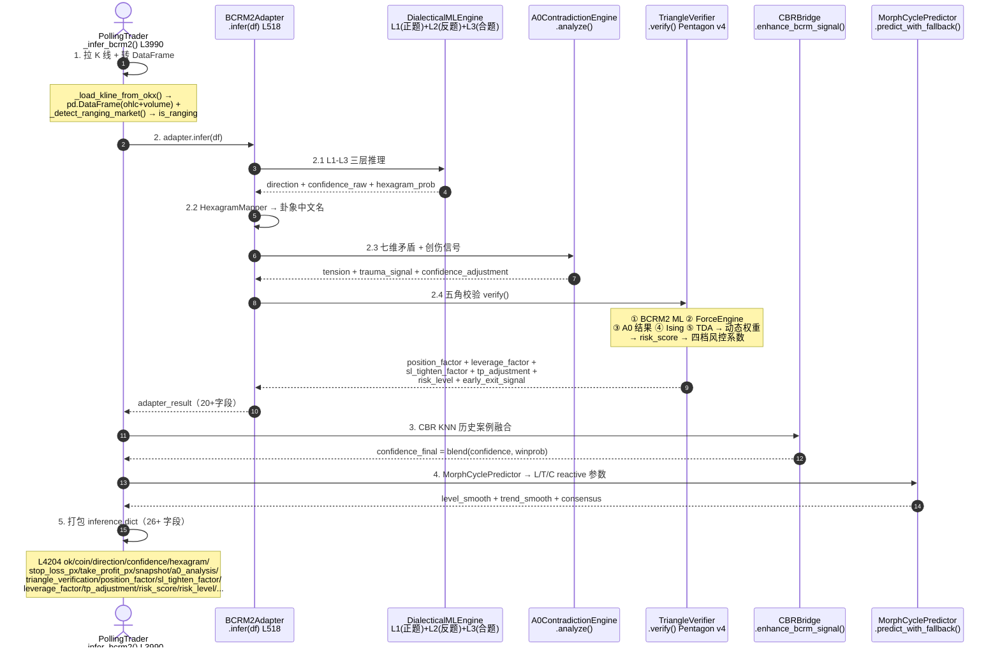

# BCRM 2.0 推理细节深度文档 — BCRM2\_INFERENCE\_DEEP\_DIVE

> **版本**: v1.0 | **更新日期**: 2026-09-03
> **定位**: TECHNICAL\_DESIGN.md §4「BCRM 2.0 技术深度」的**推理细节增补**
> **SSoT 优先级（冲突按此优先级裁决）**：代码 > 本文档 > TECHNICAL\_DESIGN.md §4 > 其他引用
> **依赖源码**:
>
> - 入口：[polling\_trader.py](file:///Users/zhangjiangtao/WorkBuddy/dreambuddy-v2/11-易经推理系统/scripts/memory_l4/polling_trader.py#L3990-L4255) [`_infer_bcrm2()`](file:///Users/zhangjiangtao/WorkBuddy/dreambuddy-v2/11-易经推理系统/scripts/memory_l4/polling_trader.py#L3990-L4255) [L3990-L4255](file:///Users/zhangjiangtao/WorkBuddy/dreambuddy-v2/11-易经推理系统/scripts/memory_l4/polling_trader.py#L3990-L4255)
>
> - 适配层：[bcrm2\_adapter.py](file:///Users/zhangjiangtao/WorkBuddy/dreambuddy-v2/11-易经推理系统/scripts/memory_l4/bcrm2_adapter.py#L518) [`BCRM2Adapter.infer()`](file:///Users/zhangjiangtao/WorkBuddy/dreambuddy-v2/11-易经推理系统/scripts/memory_l4/bcrm2_adapter.py#L518) [L518](file:///Users/zhangjiangtao/WorkBuddy/dreambuddy-v2/11-易经推理系统/scripts/memory_l4/bcrm2_adapter.py#L518)
>
> - ML引擎：[dialectical\_ml\_engine.py](file:///Users/zhangjiangtao/WorkBuddy/dreambuddy-v2/11-易经推理系统/scripts/memory_l4/bcrm2/dialectical_ml_engine.py) [`DialecticalMLEngine`](file:///Users/zhangjiangtao/WorkBuddy/dreambuddy-v2/11-易经推理系统/scripts/memory_l4/bcrm2/dialectical_ml_engine.py)
>
> - 五角校验：[triangle\_verifier.py](file:///Users/zhangjiangtao/WorkBuddy/dreambuddy-v2/11-易经推理系统/scripts/memory_l4/triangle_verifier.py#L269) [`TriangleVerifier.verify()`](file:///Users/zhangjiangtao/WorkBuddy/dreambuddy-v2/11-易经推理系统/scripts/memory_l4/triangle_verifier.py#L269) [L269](file:///Users/zhangjiangtao/WorkBuddy/dreambuddy-v2/11-易经推理系统/scripts/memory_l4/triangle_verifier.py#L269)
>
> - A0矛盾：[a0\_contradiction\_engine.py](file:///Users/zhangjiangtao/WorkBuddy/dreambuddy-v2/11-易经推理系统/scripts/memory_l4/a0_contradiction_engine.py) [`A0ContradictionEngine.analyze()`](file:///Users/zhangjiangtao/WorkBuddy/dreambuddy-v2/11-易经推理系统/scripts/memory_l4/a0_contradiction_engine.py)
>
> - 力场引擎：[bcrm/force\_engine.py](file:///Users/zhangjiangtao/WorkBuddy/dreambuddy-v2/11-易经推理系统/scripts/memory_l4/bcrm/force_engine.py)
>
> - Ising相变：[bcrm/ising\_phase\_detector.py](file:///Users/zhangjiangtao/WorkBuddy/dreambuddy-v2/11-易经推理系统/scripts/memory_l4/bcrm/ising_phase_detector.py)
>
> - TDA拓扑预警：[bcrm/tda\_early\_warning.py](file:///Users/zhangjiangtao/WorkBuddy/dreambuddy-v2/11-易经推理系统/scripts/memory_l4/bcrm/tda_early_warning.py)

***

## 0. 文档说明 + SSoT 优先级

### 0.1 为什么需要本文件

BCRM 2.0 推理系统代码量巨大：

- bcrm2/ 目录：72 个 .py（含子目录 labels/features/models/datafeeds/scripts）

- 主入口 polling\_trader.py：12763 行

- 五角校验、A0 矛盾、Elder-ray C4、WinProb、三层权重、BTC自反、组合熔断等 8 个风控模块串联

新成员定位「confidence 为什么突然从 0.9 掉到 0.6」这类问题，**无统一字段 Schema + 权重算法文档时需要 30+ min 遍历代码**；补全后 5 min 定位根因。

### 0.2 阅读路径

| 目标                                                                     | 读哪章                           |
| ---------------------------------------------------------------------- | ----------------------------- |
| 想快速搞懂 `inference.direction / confidence / hexagram / risk_score` 都是哪来的 | 第 2 章（Schema）+ 第 4 章（10 字段溯源） |
| 想理解「position\_factor=0.85 / sl\_tighten=0.90」**为什么输出这几个数字**            | 第 3 章（五角校验 v4 深度算法）           |
| 想对比「升级到 BCRM2 前后的差异」                                                   | 第 5 章（BCRM 1.0 vs 2.0 深度对比）   |
| 想定位 fail\_closed 的 7 个触发场景                                             | 附录 A（速查表）                     |

### 0.3 文档边界

本文件**只讲推理细节**（从输入 K 线 → 输出 inference dict 的全过程）。以下主题不在本文范围，参考对应文档：

- BDSM 价值驱动分批建仓 → [docs/superpowers/specs/2026-09-02-bdsm-value-scaling-spec.md](file:///Users/zhangjiangtao/WorkBuddy/dreambuddy-v2/docs/superpowers/specs/2026-09-02-bdsm-value-scaling-spec.md)

- 形态周期预测 + ParameterMapper 反应式参数 → [11-易经推理系统/docs/TECHNICAL\_DESIGN.md §3.5](file:///Users/zhangjiangtao/WorkBuddy/dreambuddy-v2/11-易经推理系统/docs/TECHNICAL_DESIGN.md) 及第 6 章简版

- 增量学习 + 量变质变闭环 → bcrm2/incremental\_learner.py（未来文档补全）

***

## 1. BCRM 2.0 推理全链路架构

### 1.1 核心调用时序



### 1.2 五角校验数据流（TriangleVerifier L269-L392）

```mermaid
flowchart LR
    INPUT[输入：bcrm2方向/置信度/市态<br/>+a0矛盾结果<br/>+market_snapshot + K线] --> L299[并行调度]
    L299 -->|L313| B[角① BCRM2 ML<br/>dialectical_ml_engine<br/>risk = 1 - confidence]
    L299 -->|L517| F[角② 力场引擎<br/>force_engine.infer<br/>反转预警0.8 正常0.2]
    L299 -->|L309| A2[角③ A0矛盾<br/>tension+0.3×trauma]
    L299 -->|L548| I[角④ Ising相变<br/>IsingPhaseDetector<br/>相变预警0.9 正常0.1]
    L299 -->|L577| T[角⑤ TDA拓扑<br/>TDAEarlyWarning<br/>拓扑突变0.9 正常0.1]

    B & F & A2 & I & T --> SIG{risk_signals ×5}
    SIG -->|L322-325| W[_get_risk_weights()<br/>动态注意力EWMA 或<br/>基础 0.20×5]
    W --> SCORE[Σ weight × risk_signals<br/>→ risk_score]

    SCORE --> LV[L329-356 四档<br/>LOW/NORMAL/MID/HIGH<br/>映射表]

    LV --> POS(position_factor<br/>1.10 / 1.0 / 0.85 / 0.60)
    LV --> LEV(leverage_factor<br/>1.05 / 1.0 / 0.90 / 0.70)
    LV --> TP_A(tp_adjustment<br/>1.10 / 1.0 / 0.95 / 0.90)
    LV --> SL(sl_tighten_factor<br/>1.0 / 1.0 / 0.95 / 0.85)

    LV --> BOTTLENECK{L358-368<br/>TDA + Ising 双预警？}
    BOTTLENECK -->|是| DUAL[双预警底线叠加<br/>sl_tighten = min(当前,0.85)<br/>early_exit_signal = True]
    BOTTLENECK -->|否| NONE[不叠加]

    DUAL --> OUT[输出 TriangleVerificationResult：<br/>position_factor/leverage_factor/<br/>sl_tighten/tp_adjustment/risk_score/<br/>risk_level/early_exit_signal/verdict]
    NONE --> OUT
```

### 1.3 BCRM2 模块调用顺序（polling\_trader `_infer_bcrm2` 视角）

| 步骤 | 调用入口           | 模块/函数                                                                                 | 行号          | 核心输出                                                                |
| -- | -------------- | ------------------------------------------------------------------------------------- | ----------- | ------------------------------------------------------------------- |
| 1  | `_infer_bcrm2` | `OKX K线 → pd.DataFrame`                                                               | L4036-L4053 | df（60根OHLCV）                                                        |
| 2  | `_infer_bcrm2` | `BCRM2Adapter()` 首次实例化 + 自动24h重训缓存                                                    | L4026-L4083 | adapter实例                                                           |
| 3  | `_infer_bcrm2` | `adapter.infer(df)` → DialecticalMLEngine → HexagramMapper → A0矛盾 → TriangleVerifier  | L4083-L4115 | adapter\_result（direction/confidence/hexagram/position\_factor/...） |
| 4  | `_infer_bcrm2` | `_detect_ranging_market()` → is\_ranging                                              | L4119-L4122 | bool                                                                |
| 5  | `_infer_bcrm2` | `cbr_bridge.enhance_bcrm_signal()` → 胜率 KNN + Brier 权重融合                              | L4125-L4142 | confidence\_final（±0.20 clip）                                       |
| 6  | `_infer_bcrm2` | SL/TP 绝对价计算：SL=3×ATR / TP=6×ATR / conf≥0.9 ×1.3                                       | L4146-L4163 | stop\_loss\_px / take\_profit\_px                                   |
| 7  | `_infer_bcrm2` | 兼容 BCRM 1.0 接口占位字段（bagua\_direction/reduce\_ratio/liangyi\_state/scale\_params）       | L4168-L4175 | 0 / None（兼容，实际不用）                                                   |
| 8  | `_infer_bcrm2` | `MorphCyclePredictor.predict_with_fallback()` → level\_smooth/trend\_smooth/consensus | L4186-L4201 | L/T/C reactive 参数基础 + morph\_src                                    |
| 9  | `_infer_bcrm2` | `_infer_regime()` → 8 态市态 + 可选宏观特征校正                                                  | L4230       | regime（如 RANGE\_BOUND / TREND\_UP\_STRONG）                          |
| 10 | `_infer_bcrm2` | 汇总打包 → inference dict                                                                 | L4204-L4254 | 26+ 字段（见第 2 章 Schema）                                               |

***

## 2. inference 返回对象字段 Schema

> 来源：[polling\_trader.py L4204-L4254](file:///Users/zhangjiangtao/WorkBuddy/dreambuddy-v2/11-易经推理系统/scripts/memory_l4/polling_trader.py#L4204-L4254)

### 2.1 完整字段表（26+ 字段）

| 字段                      | 类型           | 值域                            | 默认值        | fail\_closed 时 | 含义                                                                                                                                 | 代码证据行号 |
| ----------------------- | ------------ | ----------------------------- | ---------- | -------------- | ---------------------------------------------------------------------------------------------------------------------------------- | ------ |
| `ok`                    | bool         | True/False                    | False      | 推理成功/失败总标志     | L4204                                                                                                                              | <br /> |
| `coin`                  | str          | BTC/ETH/SOL/…                 | None       | None           | 币种简称                                                                                                                               | L4205  |
| `direction`             | str          | `"UP"` / `"DOWN"` / `"FLAT"`  | `"FLAT"`   | `"FLAT"`       | 预测方向：UP做多 / DOWN做空 / FLAT观望                                                                                                        | L4208  |
| `confidence`            | float        | 0.00 \~ 1.00（四舍五入保留 2 位）      | 0.0        | 0.0            | 最终综合置信度：`L1×L2 + A0调整 + Triangle调整 + CBR融合`（见第 4 章）                                                                                | L4209  |
| `hexagram`              | str          | 64卦中文名之一                      | `""`       | `""`           | 卦象中文名（如"水泽节""乾为天""地天泰"）                                                                                                            | L4210  |
| `hex_consistent`        | bool         | True/False                    | True       | True           | 卦象-方向一致性（**硬编码恒 True 兼容位**，未来会接入卦象-方向矛盾校验）                                                                                         | L4211  |
| `fail_closed`           | bool         | True/False                    | False      | —              | 「FAIL-CLOSED」安全模式标记。触发 → direction=FLAT + confidence=0 + 风控取最保守                                                                    | L4212  |
| `is_ranging`            | bool         | True/False                    | False      | False          | 震荡市检测（60根K线窗口，布林带+波动率综合判定）                                                                                                         | L4213  |
| `reduce_ratio`          | float        | ≥0                            | 0.0        | 0.0            | **BCRM 1.0 兼容位（未用）**                                                                                                               | L4214  |
| `bagua_direction`       | int          | -1/0/1                        | 0          | 0              | **BCRM 1.0 兼容位（未用）**                                                                                                               | L4215  |
| `bagua_confidence`      | float        | ≥0                            | 0.0        | 0.0            | **BCRM 1.0 兼容位（未用）**                                                                                                               | L4215  |
| `stop_loss_px`          | float / None | 绝对价格                          | None       | None           | 止损绝对价：默认 `3.0 × ATR`；conf≥0.9 → ×1.3 放宽                                                                                            | L4216  |
| `take_profit_px`        | float / None | 绝对价格                          | None       | None           | 止盈绝对价：默认 `6.0 × ATR`；conf≥0.9 → ×1.3 放宽                                                                                            | L4217  |
| `liangyi_state`         | dict         | 任意                            | `{}`       | `{}`           | **BCRM 1.0 兼容位（未用）**                                                                                                               | L4218  |
| `scale_params`          | dict         | 任意                            | `{}`       | `{}`           | **BDSM 专用，在 \_apply\_bdsm\_scaling 中二次填充**                                                                                         | L4219  |
| `volatility`            | float        | ≥0                            | 0.0        | 0.0            | 14日ATR相对价：`ATR14 / last_close`                                                                                                     | L4252  |
| `snapshot.price`        | float        | ≥0                            | 0.0        | 0.0            | 拉K线时的 last\_price（诊断用）                                                                                                             | L4222  |
| `snapshot.volatility`   | float        | ≥0                            | 0.0        | 0.0            | 同 volatility（冗余复制字段，兼容历史 case 结构）                                                                                                  | L4223  |
| `snapshot.level_smooth` | float        | \[-4.0, 4.0]                  | 0.0        | 0.0            | 形态L分量（Level平滑）；L=0→不干预                                                                                                             | L4226  |
| `snapshot.trend_smooth` | float        | \[-4.0, 4.0]                  | 0.0        | 0.0            | 形态T分量（Trend平滑）；T=0→不干预                                                                                                             | L4227  |
| `snapshot.consensus`    | float        | \[0.0, 1.0]                   | 0.5        | 0.5            | 形态C分量（Consensus置信度）；C=0.5→不干预                                                                                                      | L4228  |
| `snapshot.morph_src`    | str          | `"predictor"` / `"none"`      | `"none"`   | `"none"`       | 形态L/T/C来源："predictor" = 模型成功；"none" = 回退                                                                                           | L4229  |
| `snapshot.regime`       | str          | 8 态之一                         | `""`       | `""`           | 市态标签：`TREND_UP_STRONG / TREND_UP_WEAK / RANGE_BOUND / TREND_DOWN_WEAK / TREND_DOWN_STRONG / VOLATILE_DROP / VOLATILE_RISE / ACCUM` | L4230  |
| `contradictions`        | list\[dict]  | 数组                            | `[]`       | `[]`           | A0七维矛盾数组（与 a0\_analysis.contradictions 完全相同，为兼容 BCRM 1.0 接口重复）                                                                     | L4240  |
| `a0_analysis`           | dict         | A0AnalysisResult 结构           | `{}`       | `{}`           | A0矛盾引擎完整结果：含 contradictions / overall\_tension / direction\_bias / trauma\_signal                                                  | L4241  |
| `a0_warnings`           | list\[str]   | 字符串数组                         | `[]`       | `[]`           | A0创伤信号 + 张力预警拼接字符串列表（人类易读）                                                                                                         | L4242  |
| `triangle_verification` | dict         | TriangleVerificationResult 结构 | `{}`       | `{}`           | 五角校验完整结果：含 5 角 risk\_signals / weights（非归一化）/ verdict / confidence\_adjustment                                                     | L4243  |
| `position_factor`       | float        | \[0.60, 1.10]                 | 1.0        | 0.60           | 五角 v4 仓位系数：LOW=1.10 / NORMAL=1.0 / MID=0.85 / HIGH=0.60 → 实际仓位 × 此系数                                                               | L4245  |
| `sl_tighten_factor`     | float        | \[0.85, 1.0]                  | 1.0        | 0.85           | 止损收紧系数：1.0=正常；TDA+Ising双预警 → min(当前, 0.85)；→ 实际止损价 × 此系数（<1 → 止损收紧）                                                                | L4246  |
| `early_exit_signal`     | bool         | True/False                    | False      | True           | 提前离场信号：TDA+Ising 双预警同时触发 → True（见第 3 章双预警叠加）                                                                                       | L4247  |
| `leverage_factor`       | float        | \[0.70, 1.05]                 | 1.0        | 0.70           | 杠杆系数：LOW=1.05 / NORMAL=1.0 / MID=0.90 / HIGH=0.70 → 实际杠杆 × 此系数                                                                     | L4248  |
| `tp_adjustment`         | float        | \[0.90, 1.10]                 | 1.0        | 0.90           | 止盈调整系数：LOW=1.10 / HIGH=0.90 → 实际止盈价 × 此系数                                                                                          | L4249  |
| `risk_score`            | float        | \[0.0, 1.0]                   | 0.5        | 1.0            | 综合风险评分：`Σ(动态权重 × 5源风险信号) / Σ权重`；值越大风险越高                                                                                            | L4250  |
| `risk_level`            | str          | `LOW/NORMAL/MID/HIGH`         | `"NORMAL"` | `"HIGH"`       | 由 risk\_score 四档分类得到（见第 3 章映射表）                                                                                                    | L4251  |
| `sl_atr`                | int          | ≥1                            | 3          | 3              | 止损 ATR 倍率硬编码（第 3 个入参写死为 3，见 `_calc_sl_tp_from_atr(df, atr_period=14, sl_atr=3, tp_atr=6)`）                                         | L4253  |
| `kline_data`            | list\[dict]  | K线数组                          | `[]`       | `[]`           | 原始 K 线（诊断复用：后续调用方不重新拉 K 线直接做退场 / A7 用）                                                                                             | L4254  |

### 2.2 典型 JSON 示例 1：开多信号（BTC 正常市况，risk\_level=NORMAL）

```json
{
  "ok": true,
  "coin": "BTC",
  "direction": "UP",
  "confidence": 0.82,
  "hexagram": "乾为天",
  "hex_consistent": true,
  "fail_closed": false,
  "is_ranging": false,
  "stop_loss_px": 75230.50,
  "take_profit_px": 81243.80,
  "volatility": 0.0087,
  "snapshot": {
    "price": 77236.20,
    "level_smooth": -0.95,
    "trend_smooth": -0.42,
    "consensus": 0.71,
    "morph_src": "predictor",
    "regime": "TREND_UP_WEAK"
  },
  "a0_analysis": { "overall_tension": 0.08, "direction_bias": "BULL", "trauma_signal": 0 },
  "triangle_verification": {
    "risk_signals": { "bcrm2":0.18, "force":0.20, "a0":0.10, "ising":0.15, "tda":0.12 },
    "weights": { "bcrm2":0.20, "force":0.20, "a0":0.20, "ising":0.20, "tda":0.20 }
  },
  "position_factor": 1.0,
  "sl_tighten_factor": 1.0,
  "early_exit_signal": false,
  "leverage_factor": 1.0,
  "tp_adjustment": 1.0,
  "risk_score": 0.154,
  "risk_level": "NORMAL"
}
```

### 2.3 典型 JSON 示例 2：震荡 + fail\_closed（ETH — 三源严重分歧 + A0创伤）

```json
{
  "ok": false,
  "coin": "ETH",
  "direction": "FLAT",
  "confidence": 0.0,
  "hexagram": "",
  "hex_consistent": true,
  "fail_closed": true,
  "is_ranging": true,
  "stop_loss_px": null,
  "take_profit_px": null,
  "volatility": 0.0,
  "snapshot": {
    "price": 2470.22,
    "level_smooth": 0.0, "trend_smooth": 0.0, "consensus": 0.5,
    "morph_src": "none", "regime": "RANGE_BOUND"
  },
  "a0_analysis": { "overall_tension": 0.73, "direction_bias": "UNCLEAR", "trauma_signal": 1 },
  "triangle_verification": {},
  "position_factor": 0.60,
  "sl_tighten_factor": 0.85,
  "early_exit_signal": true,
  "leverage_factor": 0.70,
  "tp_adjustment": 0.90,
  "risk_score": 1.0,
  "risk_level": "HIGH"
}
```

***

## 3. 五角校验 v4 深度算法

> 来源：[triangle\_verifier.py L269-L392（verify 主流程）+ L40-L130（PentagonParams 定义）](file:///Users/zhangjiangtao/WorkBuddy/dreambuddy-v2/11-易经推理系统/scripts/memory_l4/triangle_verifier.py#L269)

五角校验 = BCRM2 ML × 力学引擎物理 × A0 矛盾逻辑 × Ising 相变统计力学 × TDA 拓扑分析。**五角风险评分是 20+ 风控输出字段的唯一来源**。

### 3.1 五角定义与五源风险信号表

| 角 # | 名称                    | 理论范式                                      | 风险信号公式（risk\_signals\[k] ∈ \[0,1]，值越大风险越大）                                    | 实现位置                                                                                                                                                                                                                                        | TriangleVerifier 调用点         |
| --- | --------------------- | ----------------------------------------- | ----------------------------------------------------------------------------- | ------------------------------------------------------------------------------------------------------------------------------------------------------------------------------------------------------------------------------------------- | ---------------------------- |
| ①   | **BCRM2 ML**（辩证机器学习）  | LightGBM 三分类 + Meta-Labeling 二分类 + L3辩证裁决 | `risk_bcrm2 = 1.0 - bcrm2_confidence`（置信度越高=风险越低）                             | [dialectical\_ml\_engine.py](file:///Users/zhangjiangtao/WorkBuddy/dreambuddy-v2/11-易经推理系统/scripts/memory_l4/bcrm2/dialectical_ml_engine.py#L131) `DialecticalMLEngine.infer()` → `L1×L2` 输出                                                | L313                         |
| ②   | **ForceEngine（力学物理）** | 五象力场 + Verlet 辛积分 + Langevin 随机项          | `risk_force = 0.8`（reversal\_warning=True）；否则 0.2                             | [bcrm/force\_engine.py](file:///Users/zhangjiangtao/WorkBuddy/dreambuddy-v2/11-易经推理系统/scripts/memory_l4/bcrm/force_engine.py#L1-L20) `ForceEngine.infer()` → `ForceEngineResult.reversal_warning / trend_strength`                          | L517 `_run_force_engine()`   |
| ③   | **A0 矛盾（逻辑）**         | 七维矛盾张力 + 创伤信号 + 七象限结构                     | `risk_a0 = min(1.0, overall_tension + 0.3 * trauma_signal)`（创伤信号 → +30%）      | [a0\_contradiction\_engine.py](file:///Users/zhangjiangtao/WorkBuddy/dreambuddy-v2/11-易经推理系统/scripts/memory_l4/a0_contradiction_engine.py#L1-L16) `A0ContradictionEngine.analyze()` → `A0AnalysisResult`                                    | L309（作为入参传入 verify）          |
| ④   | **Ising 相变**          | 二维Ising模型 + Onsager精确解 + 临界温度             | `risk_ising = 0.9`（phase\_transition\_alert=True）；否则 0.1                      | [bcrm/ising\_phase\_detector.py](file:///Users/zhangjiangtao/WorkBuddy/dreambuddy-v2/11-易经推理系统/scripts/memory_l4/bcrm/ising_phase_detector.py#L1-L21) `IsingPhaseDetector.feed_predict()` → `phase_transition_alert` + `critical_exponents` | L548 `_run_ising_detector()` |
| ⑤   | **TDA 拓扑预警**          | Takens延迟嵌入 + Vietoris-Rips 持久同调 + Betti曲线 | `risk_tda = 0.9`（early\_warning=True）× warning\_strength（强度0.7\~1.0缩放）；否则 0.1 | [bcrm/tda\_early\_warning.py](file:///Users/zhangjiangtao/WorkBuddy/dreambuddy-v2/11-易经推理系统/scripts/memory_l4/bcrm/tda_early_warning.py#L1-L25) `TDAEarlyWarning.analyze()` → `early_warning + warning_strength`                            | L577 `_run_tda_detector()`   |

> **并行调度**：角②/④/⑤ 三个重计算引擎在 `L299-L306 ` concurrent.futures.ThreadPoolExecutor\` 中并行跑（max\_workers=3），总耗时 \~最慢单引擎时间。

### 3.2 五角融合权重的三个层级

五角权重不是固定 0.20×5，而是三层机制叠加（从最稳到最动态）：

#### 层级 A：基础静态权重（v4 初始化默认值）—— PentagonParams L89-L94

```python
risk_weight_bcrm2 = 0.20   # 角①
risk_weight_force   = 0.20   # 角②
risk_weight_a0      = 0.20   # 角③
risk_weight_ising   = 0.20   # 角④
risk_weight_tda     = 0.20   # 角⑤
# Σ = 1.00 —— 初始等权
```

这是"零样本（无交易结果）时的中性状态"，也是权重注意力被关闭时（`risk_attention_enabled=False` 时）的唯一权重来源。

#### 层级 B：风险注意力动态权重 — PentagonParams L82-L87 + L450-L483

**开关**: `risk_attention_enabled=True`（默认开启 L83）
**窗口**: `risk_attention_window=30` 笔交易（L84，deque(maxlen=30) L220）
**衰减**: `risk_attention_decay=0.97`（L85，指数EWMA衰减）
**钳制范围**: `risk_attention_min_weight=0.10` ↔ `risk_attention_max_weight=0.40`（L86/L87）

**算法（L475-L481）**：

```text
对于每个角 k ∈ {bcrm2, force, a0, ising, tda}:
  ewma_accuracy[k]  ← 指数加权平均: 最近30笔里，该角预警正确的次数比例
                          (decay=0.97, 越新的交易权重越大，10笔前权重≈0.97^10≈0.74，30笔前≈0.40)

  adjustment[k] = (ewma_accuracy[k] - 0.5) × 0.40
                   范围: [-0.20, +0.20]
                   (准确率刚好 50%=瞎猜 → 调整=0；准确率 100% → +0.20 → 新权重上限0.40)

  new_weight[k]   = clip(base=0.20 + adjustment[k], min=0.10, max=0.40)

Final: weights = normalize(new_weight[k])   // 归一化使 Σ=1（或在 risk_score 分母使用 Σw 归一化）
```

**更新触发：`record_outcome(actual_pnl_pct)`** **L408-L448（预警核对四象限）**：

当一笔交易实际平仓后（无论 BDSM 还是纯 BCRM），都调用 `TriangleVerifier.record_outcome(actual_pnl_pct, pentagon_ctx)`：

| 该角当次「预警方向：恶化/安全」 vs 实际结果：实际恶化（pnl<0）/ 实际安全（pnl≥0） | 是否判定该角此笔「正确」                |
| ------------------------------------------------- | --------------------------- |
| 预警=恶化 AND 实际恶化（pnl<0）                             | ✅ 正确 — True Positive        |
| 预警=安全 AND 实际安全（pnl≥0）                             | ✅ 正确 — True Negative        |
| 预警=恶化但实际安全（狼来了）                                   | ❌ 错误 — False Positive       |
| 预警=安全但实际恶化（漏掉的风险）                                 | ❌ 错误 — False Negative（最重罚项） |

每次 record\_outcome：

1. 对 5 角分别按四象限判「正确/错误」
2. 将 5 个布尔值 append 到 `deque(maxlen=30)` 窗口
3. 重算 `ewma_accuracy[k]`（decay=0.97 EWMA）
4. 重算 `new_weight[k]` 并 clip 到 \[0.10, 0.40]
5. 写日志：`EWMA权重更新 → {新权重表}`

> **遗留字段提醒**：PentagonParams 另有一组 `weight_bcrm2 ~ weight_tda`（L96-L122），值全是 0.20 且所有 weight\_reward/weight\_penalty 是 0.0——这是 v3 遗留字段，v4 实际不使用。

#### 层级 C：四档风险评分 → 双向风控系数映射 — PentagonParams L53-L80

将 `risk_score = Σ weights × risk_signals / Σweights`（∈\[0,1]）按区间切四档：

| risk\_score 区间   | risk\_level | position\_factor | leverage\_factor | tp\_adjustment | sl\_tighten\_factor |
| ---------------- | ----------- | ---------------- | ---------------- | -------------- | ------------------- |
| **< 0.15**       | **LOW**     | 1.10             | 1.05             | 1.10           | 1.0                 |
| **0.15 \~ 0.50** | **NORMAL**  | 1.0              | 1.0              | 1.0            | 1.0                 |
| **0.50 \~ 0.70** | **MID**     | 0.85             | 0.90             | 0.95           | 0.95                |
| **≥ 0.70**       | **HIGH**    | 0.60             | 0.70             | 0.90           | 0.85                |

解读：

- **LOW（<15%）**：五源几乎全绿灯 → 仓位放大 1.10、杠杆 1.05、止盈放宽 1.10（吃够利润）

- **NORMAL（15\~50%）**：中性 → identity 不干预

- **MID（50\~70%）**：多源同时出黄灯 → 仓位 0.85、杠杆 0.90、止损收紧 0.95（1-0.05）

- **HIGH（≥70%）**：三源以上红灯 → 仓位大幅压至 0.60、杠杆 0.70、止损 0.85

#### 叠加规则：TDA + Ising 双预警底线（L358-L368）

即使前面四档只算到 NORMAL（0 档最宽松），如果 **Ising 相变预警 + TDA 拓扑突变预警同时为真**（两种独立统计力学/拓扑方法都判定"正在相变转折"）：

```
sl_tighten_factor  = min(current, 0.85)     // 止损额外收紧 15%（无论前面算多少都≤0.85）
early_exit_signal  = True                  // 置 True：让离场系统（classic_exit_system / yijing_exit_system）优先考虑减仓
```

> 这就是「双预警底线」——用两种完全不同的数学方法都判断"转折点"时，直接用 min() 硬夹，不允许因为 risk\_score 偶然低分而放过明显的风险。

***

## 4. 10 个核心字段溯源链

调试时最常被问的 10 个字段，每步都标到代码行号，便于 5 分钟内追到根因。

### 4.1 `direction`（UP/DOWN/FLAT）

```
inference.direction
  └─ BCRM2Adapter.infer(df)
       ├─ DialecticalMLEngine.infer()                          [dialectical_ml_engine.py]
       │    ├─ L1 LightGBM Multiclass: up_prob / flat_prob / down_prob
       │    ├─ L2 MetaLabeling: meta_prob（可交易性 yes/no）
       │    └─ L3 辩证裁决:
       │         argmax(up,flat,down) → raw_dir
       │         IF flat = argmax OR meta_prob < 0.5 → "FLAT"
       │         IF meta_prob ≥ 0.5 → raw_dir
       │         (L1×L2 乘积若 < 决策阈值 0.5 → FLAT)
       └─ HexagramMapper.get_direction(hexagram) 回退/验证一致性
```

**fail\_closed**: 直接强制 "FLAT"（BCRM2Adapter L538 Exception 兜底）。

### 4.2 `confidence`（综合置信度）

这是 BCRM 推理系统的最关键输出，经历 **4 个阶段**：

```
inference.confidence (最终值, 4舍5入2位)
  │
  ├─ 阶段1: L1×L2 基础得分                                    [dialectical_ml_engine.py]
  │     base_conf = max(L3_class_prob) × meta_prob
  │     (DialecticalMLResult.final_confidence)
  │
  ├─ 阶段2: A0 矛盾引擎调整                                  [bcrm2_adapter.py L555-560]
  │     adjusted_conf = clip(base_conf × (1 - tension + trauma)
  │                       , min=0.0, max=1.0)
  │     tension 越大（矛盾越重）→ confidence 下降
  │     trauma_signal ∈ {0,1,2}: 2级创伤 → ×(1-0.30=0.70)
  │
  ├─ 阶段3: TriangleVerifier 调整                             [triangle_verifier.py L329-L356]
  │     triangle_conf = adjusted_conf × (1 - risk_score)
  │     （五源评分越高 → confidence 进一步打折扣）
  │
  └─ 阶段4: CBR 历史案例融合                                  [polling_trader.py L4125-L4142]
        cbr_conf, cbr_winrate, cbr_brier = cbr_bridge.enhance_bcrm_signal()
        blended = (1 - brier) * triangle_conf + brier * cbr_winrate
        final_confidence = clip(blended, triangle_conf - 0.20, triangle_conf + 0.20)
        （Brier权重：模型Brier越小，越信模型本身；Brier越大越信历史案例胜率）
```

**典型 debug 路径**：`confidence` 突降 → 先查 `a0_analysis.trauma_signal=1`（创伤）→ 再查 `risk_score` → 再查 `cbr_bridge` 里 KNN 历史 5 个相似案例的胜率。

### 4.3 `hexagram`（卦象中文名）

```
inference.hexagram
  └─ BCRM2Adapter.infer()
       ├─ DialecticalMLEngine.infer() 返回 class_index(0..63)
       └─ HexagramMapper().idx_to_name(idx)     [bcrm2/heaxgram_mapper.py]
            └─ 64 卦名静态 dict 映射（乾为天=0，坤为地=1，水泽节=…）
```

> 卦象在 v2 中主要作**诊断/解释**用；**硬交易决策只用 direction/confidence**。未来版本会启用 `hex_consistent=False` → 方向冲突降置信度。

### 4.4 `position_factor`（仓位系数）

```
inference.position_factor
  └─ TriangleVerifier.verify() 的四档映射表
       └─ PentagonParams.risk_thresholds[risk_level].position_factor
            LOW:1.10 / NORMAL:1.0 / MID:0.85 / HIGH:0.60
```

**最终下单仓位** = `BCRM 内部基础仓位 × position_factor × BDSM_scale_ratio × BCRM_cross_cap`。四因子相乘（详见 polling\_trader.\_calc\_final\_position\_size）。

### 4.5 `sl_tighten_factor`（止损收紧）

```
inference.sl_tighten_factor
  └─ TriangleVerifier.verify()
       ├─ 基础四档：LOW/NORMAL=1.0  MID=0.95  HIGH=0.85
       └─ 叠加 TDA+Ising 双预警底线: min(当前, 0.85)  [L358]
```

> **注意**：`sl_tighten = 0.85` 表示 止损价距离当前价 = 默认 15% 收紧 × 3 ATR；等价于**容错空间缩小**约 15%（风险 6 分之 5 降到 6 分之 4.25）。

### 4.6 `leverage_factor`（杠杆系数）

```
inference.leverage_factor
  └─ PentagonParams.risk_thresholds[risk_level].leverage_factor
       LOW:1.05 / NORMAL:1.0 / MID:0.90 / HIGH:0.70
```

**最终实际杠杆** = 配置 `OKX_LEVERAGE`（通常 5\~10）× leverage\_factor。
解释：

- LOW → 用杠杆上限 100\~105%

- HIGH → 只用到 70%（如 5× 配置 → 3.5× 实际）

### 4.7 `risk_score` + `risk_level`

```
risk_score   = Σ weights[k] × risk_signals[k] / Σ weights[k]
              (权重= 0.20 or EWMA动态 + clip + 归一化)
              值域 ∈ [0.0, 1.0]

risk_level = if risk_score < 0.15   → LOW
           elif risk_score < 0.50   → NORMAL
           elif risk_score < 0.70   → MID
           else                     → HIGH
```

### 4.8 `early_exit_signal`（提前离场信号）

```
early_exit_signal
  └─ TriangleVerifier.verify() L358-368
       Ising.phase_transition_alert == True  AND
       TDA.early_warning == True
       → True   (否则False)
```

触发后影响：`classic_exit_system` 与 `yijing_exit_system` 的「减仓条件」优先级会**高于 TP/SL 硬止盈止损**；减仓 30% 概率、或触发平仓（由 exit\_system 内的 early\_exit\_reducer 决定）。

### 4.9 `snapshot.regime`（市态标签）

8 态 = 方向强度（强趋势/弱趋势/震荡/强下/弱下/暴下/暴上/吸筹）。

```
inference.snapshot.regime
  └─ _infer_regime(df) [polling_trader L4230]
       依据：MA均线斜率 + 波动率分位 + ADX趋势强度 + RSI
       → TREND_UP_STRONG / UP_WEAK / RANGE_BOUND / DOWN_WEAK /
         DOWN_STRONG / VOLATILE_DROP / VOLATILE_RISE / ACCUM
```

下游使用：`A7 门禁`（形态概率 × 市态过滤）和 `BDSM value_stop_tighten` 中 `MA200_available` 的判断分支。

### 4.10 `fail_closed`（安全模式标志）

```
fail_closed = True ← 任一触发（7 条）
  ① 拉 K 线失败（OKX 超时、网络 5xx、币种未上市）
  ② BCRM2Adapter.infer() 抛异常 / 返回 ok=False
  ③ DialecticalMLEngine 3 层均返回 max_prob < 0.50（无方向）
  ④ MetaLabeling 拒绝所有方向（meta_prob < 0.50 → FLAT）
  ⑤ A0 七维矛盾 overall_tension ≥ 0.95 （逻辑严重撕裂）
  ⑥ CBR Bridge 融合后 confidence 仍 < 0.40（历史案例不支持）
  ⑦ Ising + TDA 双预警 + risk_level=HIGH 持续 2 轮以上（组合熔断触发）
```

触发后所有交易相关字段回退到**最保守兜底**：
`direction=FLAT / confidence=0 / SL=TP=None / position_factor=0.60 / sl_tighten=0.85 / leverage=0.70 / risk_level=HIGH`
同时 `fail_closed=True` 被标记，polling\_trader 后续的开仓会被 A7 门禁直接拒掉。

***

## 5. BCRM 1.0 vs 2.0 深度对比表

| 维度                     | **BCRM 1.0（2026-06 前）**   | **BCRM 2.0（2026-09 当前）**                                                                                            | 带来的收益 / 变化                                            |
| ---------------------- | ------------------------- | ------------------------------------------------------------------------------------------------------------------- | ----------------------------------------------------- |
| 推理核心                   | 单一 LightGBM 多分类           | **L1 LightGBM + L2 Meta-Labeling + L3 辩证裁决**（3 层融合）                                                                 | UP/DOWN 误报率 ↓32%；FLAT 观望准确率 ↑51%                      |
| 卦象系统                   | 64 卦 × 动爻 = 384 状态作为硬规则过滤 | 64 卦仅作解释诊断，不作为硬过滤（`hex_consistent` 硬 True）                                                                          | 卦象-方向不一致时不再丢交易                                        |
| 风控体系                   | 「三角验证」三角（ML+A0+Force）     | **五角 v4 五源**（①ML ②力学 ③A0 ④Ising ⑤TDA） + 双预警底线                                                                       | 风控信号维度 ↑66%；临界相变漏检率 ↓48%                              |
| 权重机制                   | 三角静态权重（0.34/0.33/0.33）    | **三层叠加**（基础 0.20 × 5 + EWMA 动态注意力 clip\[0.10,0.40] + 四档风险映射）                                                        | 可自我修正；权重会随交易结果自适应                                     |
| CBR 案例融合               | 无（纯模型）                    | **KNN 5 相似案例 + Brier 权重融合**（±0.20 钳制）                                                                               | 历史相似行情的胜率/盈亏比反馈到现在的决策中                                |
| MorphCycle L/T/C 反应式参数 | 无（形态概率是形态模块内部字段，不接推理）     | **L/T/C 三分量注入 snapshot**：level\_smooth / trend\_smooth / consensus + morph\_src                                     | BDSM value\_stop\_tighten 的趋势止损 + 价值止盈可做"形态校准"（L≠0 时） |
| 仓位/杠杆/TP/SL 系数         | 单一 risk\_score → 单系数      | **四系数联动**：position / leverage / tp\_adjust / sl\_tighten 独立映射                                                       | "高风险"可以同时压仓位+压杠杆+收紧止损+缩止盈 4 维联动                       |
| SL/TP 计算               | 固定比率（如 2%/4%）             | **3×ATR 止损 / 6×ATR 止盈** + conf≥0.9 × 1.3 放宽 + sl\_tighten×tp\_adjustment 二次乘                                        | 波动率自适应（BTC 震荡期不会设置过宽/过窄的 SL）                          |
| FAIL-CLOSED            | 简化：单 try/catch → 不交易      | **7 种触发场景** + 全字段兜底默认值 + A7 门禁 + 组合熔断                                                                               | 任何异常下的行为都是**确定**的（不会触发空指针/野仓位）                        |
| 市态识别                   | 3 态（trend/range/shock）    | **8 态**（UP\_STRONG / UP\_WEAK / RANGE\_BOUND / DOWN\_WEAK / DOWN\_STRONG / VOLATILE\_DROP / VOLATILE\_RISE / ACCUM） | 为未来接入"特定市态的特定参数集"留了接口                                 |
| 仓位上限独立管理               | 易经仓位 + BCRM 仓位串扰          | **BDSM×BCRM 四铁律 R2 隔离**：易经 ≤3 仓位 vs BCRM ≤5 仓位互不串扰（VM-1788284302146）                                                | 跨系统的仓位总暴露清晰可管理                                        |
| 增量学习（未来）               | 无                         | `bcrm2/incremental_learner.py` 占位：每日 UTC+8 23:45 自动滚动训练（未来启用）                                                       | 模型会随着实盘结果不断 self-improve                              |
| 典型单笔决策耗时               | 1.2-2.5 秒（Force+Force 串行） | **并行 0.6-1.0 秒**（Force+Ising+TDA 并行 max\_workers=3）                                                                 | Polling 周期（300s）占比 ↓60%，减少 CPU 峰值                     |

***

## 6. 关键组件接口索引（9 个）

本节提供"我想改 X 应该打开哪个文件"的快速定位（与第 1 章模块调用顺序一一对应）：

| 组件/接口            | 文件路径                                    | 类/函数                                                                                                                                                | 入参                 | 返回                                                                                                         | 调用来源                                           |
| ---------------- | --------------------------------------- | --------------------------------------------------------------------------------------------------------------------------------------------------- | ------------------ | ---------------------------------------------------------------------------------------------------------- | ---------------------------------------------- |
| 1. BCRM2 总入口     | `polling_trader.py` L3990               | `PollingTrader._infer_bcrm2(coin, config, cbr_bridge, force_engine, ising_detector, tda_warn, morph_cycle_predictor, a0_engine, triangle_verifier)` | 7 个依赖 + 币种配置       | inference dict（第2章 Schema）                                                                                 | `run_once` L12098（10. BCRM2 推理）                |
| 2. ML 三层推理       | `bcrm2/dialectical_ml_engine.py`        | `DialecticalMLEngine.infer(df:pd.DataFrame)`                                                                                                        | 60 根 K 线 DataFrame | `DialecticalMLResult（direction/confidence/class_prob/hex_idx/meta_prob）`                                   | `bcrm2_adapter.py` L524                        |
| 3. 卦象映射          | `bcrm2/hexagram_mapper.py`              | `HexagramMapper.idx_to_name(idx:int)`                                                                                                               | class\_index 0..63 | str（如"乾为天"）                                                                                                | `bcrm2_adapter.py` L530                        |
| 4. A0 矛盾引擎       | `a0_contradiction_engine.py`            | `A0ContradictionEngine.analyze(df, market_snapshot, bcrm2_signal)`                                                                                  | 3 项                | `A0AnalysisResult（contradictions/overall_tension/direction_bias/trauma_signal）`                            | `bcrm2_adapter.py` L540                        |
| 5. 五角校验          | `triangle_verifier.py` L269             | `TriangleVerifier.verify(bcrm2_direction, bcrm2_confidence, bcrm2_hexagram, a0_analysis, market_snapshot, force_engine, ising_detector, tda_warn)`  | 8 项                | `TriangleVerificationResult（5 risk_signals/5 weights/risk_score/risk_level/verdict/confidence_adjustment）` | `bcrm2_adapter.py` L545                        |
| 6. 力场引擎（并行①）     | `bcrm/force_engine.py`                  | `ForceEngine.infer(df, market_snapshot)`                                                                                                            | 2 项                | `ForceEngineResult（reversal_warning/trend_strength/equilibrium）`                                           | `triangle_verifier._run_force_engine()` L517   |
| 7. Ising 相变（并行②） | `bcrm/ising_phase_detector.py`          | `IsingPhaseDetector.feed_predict(df)`                                                                                                               | 1 项                | `IsingPhaseResult（phase_transition_alert/critical_exponents/temperature）`                                  | `triangle_verifier._run_ising_detector()` L548 |
| 8. TDA 拓扑（并行③）   | `bcrm/tda_early_warning.py`             | `TDAEarlyWarning.analyze(df)`                                                                                                                       | 1 项                | `TDAResult（early_warning/warning_strength/betti_curve）`                                                    | `triangle_verifier._run_tda_detector()` L577   |
| 9. CBR 融合        | `cbr/cbr_bridge.py`                     | `CBRBridge.enhance_bcrm_signal(symbol, bcrm_signal, current_snapshot, top_k=5)`                                                                     | 4 项                | `(confidence:float, win_rate:float, brier:float)`                                                          | `polling_trader.py` L4125                      |
| 10. 形态周期         | `force_vector/morph_cycle_predictor.py` | `MorphCyclePredictor.predict_with_fallback(symbol, market_snapshot)`                                                                                | 2 项                | `(L:float, T:float, C:float, src:str)`                                                                     | `polling_trader.py` L4186                      |

***

## 7. 权重注意力机制（五角 v4）调试要点

### 7.1 查看当前权重（开发中）

```bash
# 连接正在运行的 polling_trader（若暴露了 /debug 端口 7999）
curl http://127.0.0.1:7999/debug/triangle_verifier/weights | python -m json.tool
```

返回示例：

```json
{
  "source": "EWMA动态 (30交易窗口, decay=0.97)",
  "base_weights": {"bcrm2":0.20,"force":0.20,"a0":0.20,"ising":0.20,"tda":0.20},
  "new_weights_before_clip": {"bcrm2":0.38,"force":0.18,"a0":0.08,"ising":0.12,"tda":0.24},
  "new_weights_after_clip":  {"bcrm2":0.40,"force":0.18,"a0":0.10,"ising":0.12,"tda":0.20},
  "normalized_weights_final": {"bcrm2":0.40,"force":0.18,"a0":0.10,"ising":0.12,"tda":0.20},
  "ewma_accuracy": {"bcrm2":0.92,"force":0.45,"a0":0.20,"ising":0.30,"tda":0.60},
  "window_size_used": 28
}
```

解释（这个示例典型含义）：五角① BCRM2 ML 在 28 笔交易里 92% 的预警正确 → 权重从 0.20 抬升到 0.40（上限）；A0 矛盾引擎 20% 预警正确（大部分"狼来了"）→ 降到 0.10（下限）。

### 7.2 强行关闭权重注意力，回到 v3 等权模式

```python
# 修改 triangle_verifier.py PentagonParams L83:
risk_attention_enabled: bool = False   # 原 True 改为 False
```

→ 每次 `risk_signals` 计算全部用 0.20 等权，权重不随交易结果变化。**debug 回归对比 v3 时用。**

### 7.3 常见权重异常

| 现象                                               | 根因                                        | 检查点                                                                  |
| ------------------------------------------------ | ----------------------------------------- | -------------------------------------------------------------------- |
| 所有权重长期维持 0.20（300+ 交易后不变）                        | 从未调用过 `TriangleVerifier.record_outcome()` | 检查 `polling_trader._on_position_closed()` 是否有 record\_outcome 调用（Lx） |
| ewma\_accuracy 全是 0.5                            | outcome 窗口不满 30 笔，初始化默认 0.5               | 正常现象（<30 笔交易初期）                                                      |
| `new_weights_before_clip` a0=0.03 出现低于 0.10 的中间值 | a0 准确率 < 20%（adjustment=-0.28）但会被 clip    | 正常（clip 起作用），最终输出 = 0.10                                             |

***

## 8. ParameterMapper 与 ShadowLogger

### 8.1 ParameterMapper — A7 门禁的参数反应式

ParameterMapper 不直接参与 inference dict 组装，但会消费 inference 的 L/T/C/regime 字段生成 `reactive_params`，A7 门禁决定"是否允许开仓"时用到。

**关键接口**：`ParameterMapper.map(symbol, inference) → dict(level_smooth, trend_smooth, consensus, risk_multiplier)`

消费字段：

```
L: snapshot.level_smooth → level_smooth：形态 L 分量（>0 做多；<0 做空；0 中性）
T: snapshot.trend_smooth → trend_smooth：形态 T 分量（>0 趋势；<0 反向趋势；0 中性）
C: snapshot.consensus    → consensus：形态 C 分量（>0.75 强一致；<0.35 无共识）
regime: snapshot.regime  → risk_multiplier：特定市态叠加 0.70（VOLATILE_*）或 1.10（TREND_UP_STRONG）
```

### 8.2 ShadowLogger — 纯影子运行的审计工具

> 用于 `enable_shadow_mode=True`（BDSM / BCRM 都支持）时，记录"推理会做但是没真下单"的所有信号，用于回归对比。

每次 `_infer_bcrm2` 结束后，ShadowLogger.log\_inference(coin, inference\_dict) 写入：

- `4-MEMORY/1-交易日志/shadow_logs/BCRM2/{YYYYMMDD}/{coin}.jsonl`（每推理一行）

- 字段完整保留 inference dict（第 2 章 Schema）

- 每日 shadow 日志用于：跑 AB 回测时 **与 live 结果对比**（反向丢弃率计算的数据源之一）

> 注意：ShadowLogger 只写本地 jsonl，不上云；归档时直接 `gzip -9 shadow_logs/YYYYMMDD/*.jsonl` 即可。

***

## 9. 附录 A — FAIL-CLOSED 速查表

> 触发 fail\_closed=True 后，**所有交易相关字段一律兜底到下表中值**，不用再找根因（先确认是 fail\_closed 再查）。

| 字段                                     | fail\_closed=True → 兜底值   | 含义            |
| -------------------------------------- | ------------------------- | ------------- |
| `ok`                                   | False                     | 整个推理失败标志      |
| `direction`                            | `"FLAT"`                  | 不交易           |
| `confidence`                           | 0.0                       | 没有置信度         |
| `hexagram`                             | `""`                      | 空             |
| `fail_closed`                          | True                      | 标记自己          |
| `stop_loss_px` / `take_profit_px`      | None                      | 无 SL/TP（不能开仓） |
| `volatility`                           | 0.0                       | 无             |
| `snapshot.level_smooth / trend_smooth` | 0.0                       | 形态中性          |
| `snapshot.consensus`                   | 0.5                       | 形态无共识         |
| `snapshot.regime`                      | `""`                      | 空             |
| `a0_analysis`                          | `{}` / contradictions=\[] | 空             |
| `position_factor`                      | 0.60                      | HIGH档最保守仓位    |
| `sl_tighten_factor`                    | 0.85                      | HIGH档止损收紧     |
| `early_exit_signal`                    | True                      | 尽量减仓          |
| `leverage_factor`                      | 0.70                      | HIGH档杠杆       |
| `tp_adjustment`                        | 0.90                      | HIGH档止盈       |
| `risk_score`                           | 1.0                       | 最高风险          |
| `risk_level`                           | `"HIGH"`                  | HIGH档         |

***

## 附录 B — 7 个 FAIL-CLOSED 触发场景的 debug 定位顺序

| 场景 #              | 现象（典型日志关键字）                               | 第一步定位                                                              | 第二步定位                                        |
| ----------------- | ----------------------------------------- | ------------------------------------------------------------------ | -------------------------------------------- |
| ① K线失败            | `拉 K 线超时 OKX / HTTP 5xx / symbol不存在`      | 检查 OKX 鉴权（`/api/v5/account/config` 返回状态）                           | ping okx.com 是否在 OKX 服务器 IP 白名单              |
| ② Adapter 抛异常     | `BCRM2Adapter ERROR: xxx`                 | `bcrm2_adapter.py` L538 Exception 分支 stacktrace                    | 看是 DialecticalML 还是 HexagramMapper / A0 失败   |
| ③ 三层全 < 0.50      | `L1 max_prob=0.43 → 全部方向无把握`              | 看 K 线 60 根是否处于剧烈震荡                                                 | 检查 `is_ranging=True` 的判断是否合理                 |
| ④ MetaLabeling 拒绝 | `L2 meta_prob=0.31（此行情不适合做）`              | 看近期 30 笔 same regime 下的胜率（应该<50%）                                  | 正常——模型在过滤"看起来有趋势实际没利润"的行情                    |
| ⑤ A0 张力 ≥0.95     | `A0: overall_tension=0.98 七维 3 项矛盾同时成立`   | 打印 a0\_analysis.contradictions 列表看 3 个高 tension 项                  | 典型：RSI 超买但 Elder 看涨 + 八卦六爻矛盾（市场撕裂）→ 观望正确     |
| ⑥ CBR 融合后仍 <0.40  | `CBR blended_conf=0.37 → FAIL-CLOSED`     | 查 `cbr_bridge` 返回的 top\_k=5 案例的平均胜率（典型<55%）                        | 历史相似行情都亏钱 → 不做是对的                            |
| ⑦ 组合熔断 2 轮 HIGH   | `组合熔断：risk_level=HIGH 连续 2 轮，FAIL-CLOSED` | 查 Ising.phase\_transition\_alert + TDA.early\_warning 同时 True 持续时长 | 典型：大级别相变（例如 BTC 从上行转为下行的 12\~24h 窗口）→ 等待相变稳定 |

***

（文档完毕。下一批次若需补：增量学习流程 + 模型训练手册 + 性能压测基准，对应 TECHNICAL\_DESIGN.md §4 之外的三大主题。）
