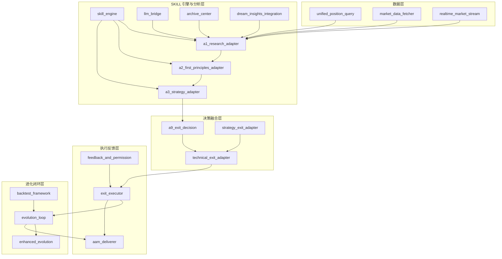

# 统一 AI 调控系统 — 技术设计文档

> **定位：** 子系统技术架构设计，对齐 [DOC_STANDARD.md](../../0-系统文档管理/1-规范体系/DOC_STANDARD.md) §3.2
> **版本：** v2.0 | **更新日期：** 2026-07-31
> **系统类型：** 跨系统宏观战略离场决策层（统一 AI 离场评估系统）
> **关联文档：** [ENGINEERING_INDEX.md](./ENGINEERING_INDEX.md) v2.0、[14-V15经典马丁策略/docs/TECHNICAL_DESIGN.md](../../14-V15经典马丁策略/docs/TECHNICAL_DESIGN.md)
>
> **文档债务修复声明：** v2.0 修复 DD-004 范围错位。v1.0 仅覆盖"离场评估子模块"（持仓聚合 + A1/A2/A3 + A9 四态），未覆盖执行反馈、进化闭环、回测验证、技术融合、产物投递等全链路。v2.0 基于实际代码重写，覆盖 `core/` 全部 19 个核心 Python 文件，对齐 ENGINEERING_INDEX v2.0 的完整文件清单。

---

## 目录

- [1. 概述](#1-概述)
- [2. 架构设计](#2-架构设计)
- [3. 核心算法](#3-核心算法)
- [4. 数据流](#4-数据流)
- [5. 接口设计](#5-接口设计)
- [6. 状态管理](#6-状态管理)
- [7. 配置管理](#7-配置管理)
- [8. 错误处理](#8-错误处理)
- [9. 扩展性设计](#9-扩展性设计)
- [变更记录](#变更记录)

---

## 1. 概述

### 1.1 系统定位

16-调控系统是 DreamBuddy-V2 的**跨系统宏观战略离场决策层**。现有 6 个独立交易系统（Agent A / Agent B / Agent C / V15 马丁 / 易经推理 / 三屏趋势）各自独立产生信号并执行下单，离场逻辑分散且自成体系，缺少一个"周线/日线级别的深度战略判断 + 跨系统统一视角"。

本系统聚合所有交易系统的持仓数据，执行宏观战略分析（A1 调研 / A2 第一性原理 / A3 战略合成），与各系统技术离场（ClassicExitSystem）融合，输出四态离场建议（CLOSE / REDUCE / HOLD / RAISE_TP），并通过执行反馈与进化闭环形成"越用越聪明"的调控能力。

**核心原则：建议制，不替代各系统自主离场逻辑。** 宏观离场是"增强"而非"替代"策略原生离场机制。

### 1.2 设计目标

| 目标 | 描述 |
|------|------|
| **统一视角** | 建立跨 6 个交易系统的持仓全局视图与战略评估 |
| **宏观赋能** | 将 A1/A2/A3 深度战略分析注入离场决策 |
| **四态输出** | 统一输出 CLOSE / REDUCE / HOLD / RAISE_TP 四种行为建议 |
| **技术融合** | 宏观离场与 ClassicExitSystem 技术离场融合（P0 一票否决 / 同向强化 / 矛盾降级） |
| **建议制 + 权限分级** | 5 级权限体系（NOTIFY → ADVISE → AUTO_REDUCE → AUTO_CLOSE → FULL_AUTO） |
| **进化闭环** | 记录决策 → 追踪结果 → 分析准确性 → 参数调优 → 回测验证 → 采纳/回滚 |
| **可追溯** | 每次评估有完整分析过程记录，L4 TradeEvent 跨系统统一交易记录 |

### 1.3 业务边界

| 职责 | 归属 |
|------|------|
| 聚合 6 个交易系统持仓数据 | 本模块（`unified_position_query.py`） |
| 宏观战略分析（A1/A2/A3） | 本模块（`a1/a2/a3_adapter.py` + `skill_engine.py`） |
| 四态离场决策与技术融合 | 本模块（`a9_exit_decision.py` + `technical_exit_adapter.py`） |
| 策略离场设计原则与合理性检查 | 本模块（`strategy_exit_adapter.py`） |
| 离场执行（dry_run/实盘）与权限控制 | 本模块（`exit_executor.py` + `feedback_and_permission.py`） |
| 进化闭环与回测验证 | 本模块（`evolution_loop.py` + `enhanced_evolution.py` + `backtest_framework.py`） |
| 产物投递与归档 | 本模块（`aam_deliverer.py` + `archive_center.py`） |
| 各系统自身技术离场逻辑（L1-L3/ClassicExitSystem） | 各交易系统 |
| 开仓决策 | 各交易系统 |
| 高频实时监控（小时级以下） | A6 情报监控 |

---

## 2. 架构设计

### 2.1 分层架构

系统采用五层架构，自上而下覆盖"数据 → 分析 → 决策 → 执行 → 进化"全链路：

```
┌─────────────────────────────────────────────────────────────────────────┐
│                    调度层（TRAE Work 08:00 / 20:00）                       │
│  scripts/auto_exit_system.py · phase2/3_exit_evaluator.py                │
└─────────────────────────────┬───────────────────────────────────────────┘
                              │
                              ▼
┌─────────────────────────────────────────────────────────────────────────┐
│  L1 数据层                                                                 │
│  unified_position_query.py（6 系统持仓聚合 + 降级容错 + 缓存）             │
│  market_data_fetcher.py（Hyperliquid→CoinGecko→估算 三源降级 + 60s 缓存） │
│  realtime_market_stream.py（Hyperliquid WS 全市场 ticker + 自动重连单例） │
└─────────────────────────────┬───────────────────────────────────────────┘
                              │
                              ▼
┌─────────────────────────────────────────────────────────────────────────┐
│  L2 SKILL 引擎与分析适配层                                                 │
│  skill_engine.py（注册/执行/降级 + @register_skill 装饰器）                │
│  llm_bridge.py（DeepSeek/OpenAI 多 Provider + 规则引擎降级 + 60s 缓存）   │
│  a1_research_adapter.py（A1 调研 v1.7.0）                                 │
│  a2_first_principles_adapter.py（A2 第一性原理 v2.6.1）                   │
│  a3_strategy_adapter.py（A3 战略合成 v2.7.0）                             │
│  archive_center.py（历史案例检索 + 加权相似度匹配）                        │
│  dream_insights_integration.py（做梦产物解析 + A1 交叉验证）               │
└─────────────────────────────┬───────────────────────────────────────────┘
                              │
                              ▼
┌─────────────────────────────────────────────────────────────────────────┐
│  L3 离场决策与融合层                                                       │
│  a9_exit_decision.py（A9 四层决策链 v2.2.0 → 四态输出）                    │
│  technical_exit_adapter.py（P0 一票否决 + 宏观/技术融合）                  │
│  strategy_exit_adapter.py（6 策略离场设计原则 + 合理性检查 + 专属权重）    │
└─────────────────────────────┬───────────────────────────────────────────┘
                              │
                              ▼
┌─────────────────────────────────────────────────────────────────────────┐
│  L4 执行与反馈层                                                           │
│  exit_executor.py（dry_run 默认 + 权限检查 + L4 TradeEvent 注册）          │
│  feedback_and_permission.py（5 级权限 + 采纳/拒绝记录 + 审计）             │
│  aam_deliverer.py（双通道投递：秘书邮箱 + 前端产物中心 + index.json）     │
└─────────────────────────────┬───────────────────────────────────────────┘
                              │
                              ▼
┌─────────────────────────────────────────────────────────────────────────┐
│  L5 进化闭环层                                                             │
│  evolution_loop.py（7 步闭环：记录→追踪→分析→调优→反馈→回测→采纳/回滚）   │
│  enhanced_evolution.py（三层进化：A8 理论验证 + 做梦部 + 数据驱动          │
│                        + ECE 校准 + gap_score + Walk-Forward + 7 天观察） │
│  backtest_framework.py（随机漫步模拟 + 三策略对比 + 绩效指标）             │
└─────────────────────────────────────────────────────────────────────────┘
                              │
                              ▼
                    artifacts/ 产物目录
  exit-evaluations/ · execution_logs/ · backtests/ · evolution/ · tests/
```

### 2.2 模块关系



**依赖关系要点**：
- `skill_engine.py` 是分析层枢纽，A1/A2/A3/A9/技术适配器均通过 `@register_skill` 注册并由 `SkillEngine.execute()` 统一调度
- `strategy_exit_adapter.py` 被 `technical_exit_adapter.py`（融合层）与 `evolution_loop.py`/`enhanced_evolution.py`（进化层）共同依赖，提供策略专属权重与门槛
- `exit_executor.py` 执行结果回流到 `evolution_loop.record_outcome()`，形成闭环
- `backtest_framework.py` 既独立运行三策略对比，也为进化层提供 `validate_evolution_adjustment()` 参数验证

### 2.3 与现有系统的关系

| 现有系统 | 关系 | 集成方式 |
|---|---|---|
| Agent A/B | 持仓数据源 | Hyperliquid REST API + 本地 memory |
| Agent C | 持仓数据源 | 共用 B 账户 + memory.json |
| V15 马丁 | 持仓数据源 + 执行通道 | OKX state.json + API；执行器复用 V15 lib/okx_client |
| 易经推理 | 持仓数据源 + L4 案例库 | open_positions/*.json；执行器注册 TradeEvent 到 11-易经推理系统 |
| 三屏趋势 | 持仓数据源 | ml_trade_service HTTP API（过渡期） |
| ClassicExitSystem (10-经典指标系统) | 技术离场 SSOT | technical_exit_adapter 内置简化版技术分析（完整集成需导入对应模块） |
| A6 情报监控 | 同级互补 | A6 做小时级监控，本系统做天级战略评估 |
| AAM 产物管理 | 输出通道 | aam_deliverer 复用双通道投递规范 |

---

## 3. 核心算法

### 3.1 A9 四态离场决策算法（`a9_exit_decision.py`）

A9 离场决策基于 A1/A2/A3 宏观战略分析，对每个持仓执行四层递进式决策链，输出四态建议。

**四层决策链公式**：

```
Layer 1 (战略一致性):
    alignment_score = position_direction_num × strategy_num    # ∈ {-1, 0, +1}
    lr_alignment     = position_direction_num × lr_num          # 阻力最小路径对齐
    trend_strength   = fp.trend_analysis.trend_strength / 10.0
    base_score       = alignment_score×0.5 + lr_alignment×0.3 + trend_strength×lr_alignment×0.2

Layer 2 (置信度加权):
    confidence_weight = 0.5 + path_confidence × 0.5            # path_confidence ∈ [0,1]
    weighted_score    = base_score × confidence_weight

Layer 3 (市场状态修正):
    regime_bonus =
        +0.15 × lr_alignment     if regime ∈ {TREND_STRONG, BREAKOUT_PENDING}
        -0.20 × lr_alignment     if regime ∈ {TREND_EXHAUSTION, FALSE_BREAKOUT_RISK}
        -0.30                    if regime == EXTREME
        0.0                      otherwise

Layer 4 (最终合成):
    final_score = weighted_score + regime_bonus
```

**得分到四态映射**：

| final_score 区间 | 建议动作 | 紧急度 |
|---|---|---|
| ≤ -0.55 | CLOSE | CRITICAL |
| (-0.55, -0.30] | CLOSE | HIGH |
| (-0.30, -0.10] | REDUCE | MEDIUM |
| (-0.10, 0.10] | HOLD | LOW |
| (0.10, 0.30] | RAISE_TP（需趋势加速 + 盈利）/ HOLD | LOW/MEDIUM |
| > 0.30 | RAISE_TP（需盈利） | LOW/MEDIUM |

**伪代码**：

```python
def a9_exit_decision_handler(inputs, engine):
    positions = inputs["positions"]
    a1, a2, a3, market = inputs["a1_result"], inputs["a2_result"], inputs["a3_result"], inputs["market"]
    evaluations = []
    for pos in positions:
        # Layer 1: 战略方向一致性
        pos_num = +1 if pos.direction == "LONG" else (-1 if "SHORT" else 0)
        strat_num = map_strategy_to_num(a3.directive_bias)        # LONG类→+1, SHORT类→-1
        alignment = pos_num * strat_num
        lr_num = {"UP":1, "DOWN":-1, "NEUTRAL":0}[a2.least_resistance_path]
        lr_alignment = pos_num * lr_num
        trend_strength = a2.trend_strength / 10.0
        base_score = alignment*0.5 + lr_alignment*0.3 + trend_strength*lr_alignment*0.2

        # Layer 2: 置信度加权
        conf_weight = 0.5 + a2.path_confidence * 0.5
        weighted_score = base_score * conf_weight

        # Layer 3: 市场状态修正
        regime_bonus = calc_regime_bonus(a2.regime, lr_alignment)

        # Layer 4: 合成 + 四态映射
        final_score = weighted_score + regime_bonus
        action, urgency = score_to_action(final_score, direction, trend_phase, pnl)

        # RAISE_TP 时计算新止盈价；REDUCE 时计算减仓比例
        params = calc_action_params(action, market_state, path_confidence)
        evaluations.append({position, recommended_action, reason, urgency, confidence,
                            scoring, parameters, layers})
    return {exit_evaluations, overall_summary, decision_layers}
```

### 3.2 宏观+技术融合算法（`technical_exit_adapter.py`）

融合宏观离场（A9）与技术离场（ClassicExitSystem 简化版），采用三层融合架构。核心思想：宏观离场是"增强"而非"替代"，P0 安全硬退出不可被轻易覆盖。

**融合三层架构**：

```
第1层：策略合理性检查（strategy_exit_adapter.evaluate_exit_rationality）
  - 检查宏观建议是否符合该策略离场设计原则
  - 马丁策略浮亏加仓属设计本身 → 不干预（adjusted_action = HOLD, conf ≤ 0.3）
  - 按策略权重加权置信度：weighted_conf = macro_conf×macro_weight + tech_conf×tech_weight
  - 减仓比例受 max_macro_reduce_fraction 限制

第2层：P0 硬退出（技术一票否决）
  - if P0_triggered:
      if strategy.allow_macro_override_p0 AND adjusted_conf ≥ 0.9 AND macro ∈ {HOLD, RAISE_TP}:
          fusion_mode = "macro_overrides_p0"   # 极少触发
      else:
          fusion_mode = "technical_p0_veto"    # 技术硬退出，直接执行

第3层：宏观+技术融合（无 P0 时）
  - 同向（CLOSE/REDUCE 同组 或 HOLD/RAISE_TP 同组）→ mutual_confirm_strengthen（置信 +0.1，上限 0.95）
  - 双方均 HOLD → mutual_confirm_hold
  - 反向 → 按强度(macro_strength vs tech_strength)主导方降级执行
      macro_strength = action_rank×urgency_rank×confidence
      主导方动作降一级（CLOSE→REDUCE, REDUCE→HOLD），置信 -0.2
  - 强度相等 → contradict_hold（观望，置信 0.4）
```

**融合模式枚举**：`technical_p0_veto` / `macro_overrides_p0` / `mutual_confirm_hold` / `mutual_confirm_strengthen` / `macro_primary_tech_contradict` / `tech_primary_macro_contradict` / `contradict_hold`

**技术离场信号（P0/P1）计算**：

```python
def calc_simple_technical_signals(position, market_data, market_state):
    pnl_eff = unrealized_pnl_pct × leverage
    # P0 硬退出（一票否决）
    if pnl_eff <= -8.0 × leverage:           p0 = CLOSE/CRITICAL  # 最大亏损
    if pnl_eff <= -(100 - 3×leverage):       p0 = CLOSE/CRITICAL  # 强平风险
    if hold_hours > 168:                     p0 = CLOSE/HIGH      # 最大持仓时间
    # P1 技术离场
    if pnl_eff <= -2×atr_pct × leverage:     p1 = CLOSE/HIGH      # ATR 止损
    if pnl_eff >= 3×atr_pct × leverage:      p1 = REDUCE/MEDIUM   # ATR 止盈
    if LONG and rsi >= 75:                   p1 = REDUCE/MEDIUM   # RSI 超买
    if SHORT and rsi <= 25:                  p1 = REDUCE/MEDIUM   # RSI 超卖
    return TechnicalExitSignal(action, urgency, confidence, p0_triggered, p1_triggered)
```

### 3.3 策略离场设计原则（`strategy_exit_adapter.py`）

为 6 个交易系统分别定义离场设计哲学、原生机制、宏观干预边界与专属权重。核心：宏观离场是"增强"而非"替代"。

**6 策略离场设计矩阵**：

| 策略 | 哲学 | 宏观影响级别 | 技术/宏观权重 | 平仓门槛 | allow_override_p0 | 最大减仓 |
|------|------|------------|--------------|---------|-------------------|---------|
| v15_martin | MARTINGALE | MINIMAL | 0.8 / 0.2 | 0.85 | False | 0.3 |
| screen_trend | TREND_FOLLOWING | SUPPLEMENTARY | 0.7 / 0.3 | 0.75 | False | 0.5 |
| yijing_bcrm | SENTIMENT | IMPORTANT | 0.5 / 0.5 | 0.70 | False | 0.5 |
| agent_a | TREND_FOLLOWING | IMPORTANT | 0.4 / 0.6 | 0.70 | False | 0.6 |
| agent_b | TREND_FOLLOWING | DOMINANT | 0.4 / 0.6 | 0.65 | False | 0.7 |
| agent_c | TREND_FOLLOWING | DOMINANT | 0.4 / 0.6 | 0.65 | False | 0.7 |

**合理性检查伪代码**（`evaluate_exit_rationality`）：

```python
def evaluate_exit_rationality(strategy_id, position, macro, technical):
    design = get_strategy_exit_design(strategy_id)
    # 1. 马丁策略特殊检查：浮亏加仓属设计本身，不干预
    if design.philosophy == MARTINGALE:
        if pnl < 0 and addon < 3 and action in {close, reduce}:
            return is_rational=False, adjusted=hold, conf≤0.3
        if addon > 0 and hold_hours < 12:  # 黄金窗口期
            return is_rational=False, adjusted=hold, conf≤0.2
    # 2. P0 硬退出检查（除非 allow_macro_override_p0 且 conf≥0.9）
    if technical.p0_triggered and not design.allow_macro_override_p0:
        return adjusted=close, conf=1.0  # 强制执行
    # 3. 按策略权重加权置信度
    weighted_conf = macro_conf×design.macro_weight + tech_conf×design.tech_weight
    # 4. 减仓比例限制
    if action == reduce: reduce_frac = min(reduce_frac, design.max_macro_reduce_fraction)
    return {is_rational, adjusted_action, adjusted_confidence, reasons}
```

### 3.4 增强进化闭环算法（`enhanced_evolution.py`）

集成项目多个进化系统，采用**三层进化来源 + 三层验证机制**。

**三层进化来源**：

- **Layer 1 — A8 理论实践验证**（内部自我批评）：检查四类矛盾
  - `C_A8_001` 过度保守：观察比例 > 50%（≥5 条决策）→ 降低门槛 -0.05
  - `C_A8_002` 策略失败：准确率 < 40%（≥5 条）→ 提高门槛 +0.05
  - `C_A8_003` P0 频繁：P0 触发率 > 30%（≥3 条）→ 风控预警
  - `C_A8_004` 置信度虚高：ECE > 0.15 且过度自信 → 提高门槛 +0.03

- **Layer 2 — 做梦部潜意识分析**（外部视角反思）：
  - 凝缩检测：单一 fusion_mode 占比 > 60% → 模式过于单一
  - 强迫性重复检测：同类错误动作占比 > 50% → 提高门槛 +0.03
  - 投射检测：ECE > 0.1 → 置信度校准问题
  - 反事实推演：错误决策反向做的潜在收益

- **Layer 3 — 数据驱动调优**（历史准确性自适应）：
  - 准确率 > 75% → 降低门槛 -0.03（增加输出）
  - 准确率 < 40% → 提高门槛 +0.03（更保守）
  - 中间区间 → 按技术/宏观命中率微调权重

**三层验证机制**：回测验证 + Walk-Forward 滚动前向 + 7 天观察期再采纳

**ECE 置信度校准**（参考三屏趋势系统 calibration.py）：

```
ECE = Σ_bin (n_bin / N) × |avg_acc_bin - avg_conf_bin|     # 10 个分箱
判定: overconfident  if avg_conf > avg_acc + 0.1
      underconfident if avg_conf < avg_acc - 0.1
```

**知行差距分析**（参考 DreamOS GapAnalyzer）：

```
gap_score = 1 - (intent_acc×0.2 + plan_completion×0.2 + direction_acc×0.35 + conf_calibration×0.25)
```

**完整进化周期伪代码**：

```python
def run_full_evolution_cycle(strategy_ids, min_samples=5, run_backtest=True):
    for sid in strategy_ids:
        # Layer 1: A8 理论实践验证
        a8 = run_a8_inspection(sid)              # 生成 C_A8_* 矛盾报告 + 进化提议
        # Layer 2: 做梦部潜意识分析
        dream = run_dream_analysis(sid)          # 凝缩/重复/投射/反事实 + 进化提议
        # Layer 3: 数据驱动调优
        dd = propose_data_driven_adjustment(sid)  # 基于准确率调整门槛/权重
    if run_backtest:
        # 三层验证：回测 + Walk-Forward + 观察期
        for proposal in pool if status == PROPOSED:
            backtest_result = simulate_backtest(proposal)
            if improvement > 0.5:
                proposal.status = BACKTEST_PASSED → ADOPTED
                apply_proposal(proposal)          # 写入 evolution_params.json
            else:
                proposal.status = REJECTED
    return report
```

**进化提议状态机**：

```
PROPOSED → BACKTESTING → BACKTEST_PASSED → WALK_FORWARD → OBSERVATION
                                                          ↓
                                              ADOPTED ← (7天观察通过)
                                              REJECTED ← (观察未通过)
                                              ROLLED_BACK ← (回滚)
```

### 3.5 基础进化闭环算法（`evolution_loop.py`）

7 步闭环，与增强版互补（增强版是其超集）：

```python
# ① 记录决策 → ② 追踪结果 → ③ 分析准确性 → ④ 参数调优
# ⑤ 反馈决策 → ⑥ 回测验证 → ⑦ 采纳/回滚 → ①

def propose_adjustment(strategy_id, min_samples=5):
    accuracy = analyze_accuracy(strategy_id).by_strategy[strategy_id].accuracy
    if total < min_samples: return None
    step = 0.03
    if accuracy > 0.75:    # 降低门槛
        after = before - step (close/reduce/observe 各 -0.03)
    elif accuracy < 0.40:  # 提高门槛
        after = before + step
    else:                  # 微调技术/宏观权重
        if tech_hit_rate > macro_hit_rate: tech_weight += step
        else: macro_weight += step
    return EvolutionAdjustment(before, after, trigger)

def adopt_adjustment(adjustment, backtest_validated):
    apply(adjustment.after)        # 写入 evolution_params.json
    history.append(adjustment)     # 记录到 evolution_history.json
    adjustment.status = ADOPTED if backtest_validated else PROPOSED

def rollback_adjustment(adjustment_id):
    restore(before)                # 回滚到调整前参数
    adjustment.status = ROLLED_BACK
```

### 3.6 回测框架算法（`backtest_framework.py`）

**模拟 K 线生成**（几何布朗运动 + 波动率聚集）：

```python
def generate_simulated_bars(start_price, num_bars, volatility_pct, drift_pct, seed):
    for i in range(num_bars):
        vol_cluster = vol_cluster×0.7 + abs(prev_return)×0.3   # GARCH 式聚集
        current_vol = vol_factor × (0.8 + vol_cluster×15)
        ret = gauss(drift_factor, current_vol)
        close = price × (1 + ret)
        # 生成 OHLCV
```

**三策略对比矩阵**：

| 策略 | 入场 | 离场 | 说明 |
|------|------|------|------|
| baseline | 随机入场 | 纯技术（ATR止损/止盈 + RSI + 最大持仓） | 技术离场基准 |
| macro_enhanced | 随机入场 | 宏观+技术融合（P0否决 + 同向强化 + 矛盾降级） | 宏观赋能离场 |
| hold | 随机入场 | 持有到结束 | 买入持有基准 |

**绩效指标**：胜率、盈亏比（profit_factor）、总收益率、最大回撤、夏普比率（年化 `× √24`）、平均持仓 K 线数。

**进化参数验证**（`validate_evolution_adjustment`）：用调优前后参数分别回测，采纳标准：收益改善 > 0.5% 且回撤恶化 < 2% 且胜率下降 < 5%。

---

## 4. 数据流

### 4.1 主数据流（离场评估 + 执行 + 进化）

```
输入层:
  各交易系统持仓 ──→ unified_position_query ──→ UnifiedPositions（6系统聚合）
  市场行情      ──→ market_data_fetcher / realtime_market_stream ──→ MarketSnapshot
  历史记忆      ──→ archive_center ──→ 相似案例 + 经验教训
  做梦产物      ──→ dream_insights_integration ──→ 梦境洞察
         │
         ▼
处理层（SKILL 编排）:
  SkillEngine.execute("dream-strategy-research") ──→ A1 调研报告
       │   (LLM 可选增强 via llm_bridge)
       ▼
  SkillEngine.execute("dream-first-principles") ──→ A2 第一性原理
       │
       ▼
  SkillEngine.execute("dream-strategy-designer") ──→ A3 战略指令
       │
       ▼
  SkillEngine.execute("dream-exit-skill-v2") ──→ A9 四态离场建议（逐持仓）
       │
       ▼
  fuse_macro_technical(A9结果, 技术信号, 策略设计) ──→ 融合决策
       │   (策略合理性检查 + P0否决 + 同向/反向融合)
       ▼
  exit_executor.execute_evaluations(融合结果)
       │   (权限检查 → dry_run/实盘 → L4 TradeEvent 注册)
       ▼
  evolution_loop.record_decision() ──→ decision_log.jsonl
       │
       ▼
输出层:
  ┌── exit-evaluations/*.json + *.md          （评估产物，AAM 双通道投递）
  ├── execution_logs/exit_execution_*.json    （执行日志）
  ├── feedback/feedback_*.json                （采纳/拒绝反馈）
  └── evolution/                              （进化闭环数据）
        ├── decision_log.jsonl                （决策记录，结果回填）
        ├── evolution_params.json             （进化后参数）
        ├── evolution_pool.json               （进化提议池）
        ├── evolution_history.json            （调优历史）
        ├── a8_inspection_log.json            （A8 检查日志）
        └── dream_journal.json                （做梦分析日志）
```

### 4.2 数据结构

| 结构 | 关键字段 | 说明 |
|------|---------|------|
| `UnifiedPositions` | `timestamp`, `total_positions`, `system_status`, `systems`, `all_positions` | 持仓全景图，单 Position 含 13 标准字段 + meta |
| `Position` | `system`, `symbol`, `direction`, `size`, `entry_price`, `unrealized_pnl`, `leverage`, `meta` | 统一持仓模型 |
| `SkillResult` | `skill_name`, `skill_version`, `status`, `data`, `error`, `fallback_used` | SKILL 统一返回结构 |
| `StrategicAssessment` | `a1_research`, `a2_first_principles`, `a3_strategy` | A1/A2/A3 输出聚合 |
| `ExitEvaluation` | `position`, `recommended_action`, `reason`, `urgency`, `confidence`, `scoring`, `layers` | 单持仓四态评估 |
| `TechnicalExitSignal` | `action`, `urgency`, `confidence`, `source_layers{p0_triggered, p1_triggered}` | 技术离场信号 |
| `FusedDecision` | `recommended_action`, `fusion_mode`, `macro_input`, `technical_input`, `strategy_context`, `rationality_check` | 融合决策结果 |
| `DecisionRecord` | `evaluation_id`, `fused_action`, `fused_confidence`, `final_recommendation`, `outcome` | 决策记录（JSONL） |
| `StrategyEvolutionParams` | `confidence_threshold_close/reduce/observe`, `technical/macro_signal_weight`, `accuracy_rate` | 可进化参数 |
| `EvolutionProposal` | `proposal_id`, `source_layer`, `before_params`, `after_params`, `status`, `backtest_result` | 进化提议 |
| `ExitExecution` | `execution_id`, `mode`, `allowed`, `status`, `executed_size`, `actual_pnl` | 执行记录 |

---

## 5. 接口设计

### 5.1 内部接口（SKILL 引擎 API）

| 函数 | 签名 | 说明 |
|------|------|------|
| `SkillEngine.register()` | `register(skill_name, handler, skill_path, version)` | 类方法，注册 SKILL 处理器 |
| `SkillEngine.execute()` | `execute(skill_name, inputs) -> SkillResult` | 执行指定 SKILL，异常自动降级 |
| `register_skill` | `@register_skill(name, path, version)` | 装饰器，声明式注册 |
| `SkillEngine.load_skill_md()` | `load_skill_md(skill_name) -> Optional[str]` | 加载 SKILL.md 内容 |
| `SkillEngine.parse_phases()` | `parse_phases(skill_md) -> List[SkillPhase]` | 解析阶段结构 |
| `fetch_all_positions()` | `fetch_all_positions() -> UnifiedPositions` | 统一持仓查询入口 |
| `get_position_summary()` | `get_position_summary() -> PositionSummary` | 持仓快速摘要 |
| `fetch_market_data()` | `fetch_market_data(positions, extra_symbols) -> Dict` | 市场数据获取（60s 缓存） |
| `fuse_macro_technical()` | `fuse_macro_technical(macro_eval, tech_signal, position, strategy_id) -> Dict` | 宏观+技术融合 |
| `evaluate_exit_rationality()` | `evaluate_exit_rationality(strategy_id, position, macro, tech) -> Dict` | 策略合理性检查 |
| `get_strategy_exit_design()` | `get_strategy_exit_design(strategy_id) -> StrategyExitDesign` | 获取策略离场设计 |

### 5.2 SKILL 注册清单（对外接口）

通过 `@register_skill` 注册到 `SkillEngine` 的 5 个 SKILL：

| SKILL 名称 | handler | SKILL.md 路径 | 版本 |
|-----------|---------|--------------|------|
| `dream-strategy-research` | `a1_research_handler` | `6-TRADING/skills/dream-strategy-research/SKILL.md` | 1.7.0 |
| `dream-first-principles` | `a2_first_principles_handler` | `6-TRADING/skills/dream-first-principles/SKILL.md` | 2.6.1 |
| `dream-strategy-designer` | `a3_strategy_designer_handler` | `6-TRADING/skills/dream-strategy-designer/SKILL.md` | 2.7.0 |
| `dream-exit-skill-v2` | `a9_exit_decision_handler` | `6-TRADING/skills/dream-exit-skill-v2/SKILL.md` | 2.2.0 |
| `technical-exit-adapter` | `technical_exit_handler` | `10-经典指标系统/classic_exit_system.py` | 1.0.0 |

**对外主入口**：`a9_exit_decision_handler(inputs, engine)` — 接收 `{positions, a1_result, a2_result, a3_result, market}`，返回 `{exit_evaluations, overall_summary, decision_layers}`。

### 5.3 执行与进化接口

| 函数 | 说明 |
|------|------|
| `ExitExecutor.execute_evaluations(fused_evaluations)` | 执行一批离场评估（权限检查 + dry_run/实盘 + L4 注册） |
| `can_auto_execute(system, action, urgency)` | 判断是否可自动执行（5 级权限 + 紧急度阈值） |
| `record_feedback(evaluation_id, ...)` | 记录建议采纳/拒绝反馈 |
| `EvolutionLoop.record_decision(evaluation)` | 记录决策到 decision_log.jsonl |
| `EvolutionLoop.record_outcome(decision_id, outcome, pnl)` | 回填决策结果 |
| `EnhancedEvolutionLoop.run_full_evolution_cycle(strategy_ids)` | 执行完整三层进化周期 |
| `run_backtest(bars, strategy, ...)` | 运行回测 |
| `validate_evolution_adjustment(strategy_id, before, after)` | 验证参数调优效果 |
| `deliver_exit_evaluation(md, json, evaluation_id)` | AAM 双通道投递 |

---

## 6. 状态管理

### 6.1 状态文件

| 文件 | 作用 | 格式 | 维护者 |
|------|------|------|--------|
| `core/governance/index.json` | 治理节点索引（审计报告等） | JSON | governance 目录 |
| `artifacts/evolution/decision_log.jsonl` | 决策记录（每次评估完整快照 + 结果回填） | JSONL（追加） | evolution_loop / enhanced_evolution |
| `artifacts/evolution/evolution_params.json` | 各策略可进化参数（门槛/权重/统计） | JSON | evolution_loop / enhanced_evolution |
| `artifacts/evolution/evolution_history.json` | 调优历史（采纳/回滚记录） | JSON | evolution_loop / enhanced_evolution |
| `artifacts/evolution/evolution_pool.json` | 进化提议池（PROPOSED→ADOPTED/REJECTED） | JSON | enhanced_evolution |
| `artifacts/evolution/a8_inspection_log.json` | A8 理论验证检查日志 | JSON（追加） | enhanced_evolution.run_a8_inspection |
| `artifacts/evolution/dream_journal.json` | 做梦部潜意识分析日志 | JSON（追加） | enhanced_evolution.run_dream_analysis |
| `artifacts/execution_logs/exit_execution_*.json` | 离场执行日志（含 L4 注册结果） | JSON | exit_executor |
| `artifacts/feedback/feedback_*.json` | 建议采纳/拒绝反馈记录 | JSON | feedback_and_permission |
| `config/permission_config.json` | 5 级权限配置（位于 16-调控系统/config/） | JSON | feedback_and_permission |
| `core/config/artifact-hub.config.json` | AAM 产物中心配置 | JSON | aam_deliverer |
| `core/meta/artifact_hub.sqlite` | 产物中心元数据库 | SQLite | aam_deliverer |
| `core/intent-specs/spec_task_*.json/md` | 任务意图规格（历史） | JSON+MD | 工具脚本 |

### 6.2 状态机

**离场执行状态机**（`exit_executor.py`）：

```
PENDING → EXECUTING → SUCCESS   (执行成功，注册 L4 TradeEvent)
                   → FAILED     (执行失败，记录 error_message)
         → REJECTED             (权限不足或仓位过小)
         → SKIPPED              (HOLD/RAISE_TP 无需执行，或达单周期上限)
```

**进化提议状态机**（`enhanced_evolution.py`）：

```
PROPOSED → BACKTESTING → BACKTEST_PASSED → WALK_FORWARD → OBSERVATION
   ↓                                                          ↓
REJECTED (回测未通过)                              ADOPTED (观察期通过，应用参数)
                                                  REJECTED (观察期未通过)
                                                  ROLLED_BACK (回滚到 before)
```

**决策结果状态**：`PENDING`（待回填）→ `CORRECT` / `INCORRECT` / `PARTIAL`（平仓后回填）

**权限等级**（从低到高）：`NOTIFY(0)` → `ADVISE(1)` → `AUTO_REDUCE(2)` → `AUTO_CLOSE(3)` → `FULL_AUTO(4)`

---

## 7. 配置管理

| 配置项 | 默认值 | 说明 | 来源 |
|--------|--------|------|------|
| `EXIT_MODE` | `dry_run` | 执行模式：dry_run / simulated / real | 环境变量 |
| `MAX_EXECUTIONS` | `5` | 单周期最大执行数（防批量砸盘） | 环境变量 |
| `MIN_POSITION_USDT` | `1.0` | 最小执行仓位（USDT） | 环境变量 |
| `DEEPSEEK_API_KEY` | — | DeepSeek LLM 密钥 | .env / 环境变量 |
| `OPENAI_API_KEY` | — | OpenAI LLM 密钥 | .env / 环境变量 |
| `CACHE_TTL`（市场数据） | `60`s | market_data_fetcher 缓存 | 代码常量 |
| `CACHE_TTL`（LLM） | `60`s | llm_bridge 调用缓存 | 代码常量 |
| `observation_days` | `7` | 进化提议观察期天数 | enhanced_evolution 代码常量 |
| `n_bins`（ECE） | `10` | 置信度校准分箱数 | enhanced_evolution 代码常量 |
| `max_reconnect_attempts` | `10` | WS 最大重连次数 | realtime_market_stream 代码常量 |
| `update_interval`（REST 轮询） | `10`s | WS 降级时 REST 轮询间隔 | realtime_market_stream 代码常量 |

**各系统默认权限**（`feedback_and_permission.py`）：

| 系统 | 权限等级 | 自动执行阈值 | 最大自动减仓 |
|------|---------|------------|------------|
| agent_a / agent_b / agent_c | ADVISE | CRITICAL | 30% |
| v15_martin | NOTIFY | CRITICAL | 0% |
| yijing_bcrm | ADVISE | HIGH | 50% |
| screen_trend | NOTIFY | CRITICAL | 0% |

---

## 8. 错误处理

### 8.1 异常场景

| 场景 | 处理策略 | 实现位置 |
|------|----------|---------|
| 单交易系统持仓查询失败 | 降级容错，标记 error，不影响整体 | unified_position_query |
| Hyperliquid API 不可用 | CoinGecko → 本地估算三源降级 | market_data_fetcher |
| WebSocket 断线 | 自动重连（最多 10 次），降级到 REST 轮询 | realtime_market_stream |
| LLM 调用失败 / 无密钥 | 降级到规则引擎（`_generate_fallback_response`） | llm_bridge |
| SKILL handler 异常 | SkillResult.status=error，fallback_used=True | skill_engine.execute |
| ClassicExitSystem 不可用 | 内置简化版技术分析（P0/P1） | technical_exit_adapter |
| OKX 客户端初始化失败 | 执行记录 status=FAILED，error_message 记录 | exit_executor |
| L4 TradeEvent 注册异常 | 捕获异常，打印日志，不影响执行结果 | exit_executor |
| 进化回测数据不足 | 返回默认案例，标注"暂无决策记录" | enhanced_evolution |
| 决策记录 JSON 解析失败 | 跳过该行，继续解析 | evolution_loop |

### 8.2 降级机制

```
主流程                              降级流程
─────────────────────────────────────────────────────
LLM 增强分析     ──失败──→  规则引擎降级（结构化 JSON 输出）
Hyperliquid WS   ──断线──→  REST 轮询（10s 间隔）
Hyperliquid REST ──失败──→  CoinGecko → 本地价格估算
ClassicExitSystem──缺失──→  内置简化技术分析（P0/P1）
实盘执行         ──失败──→  dry_run 模拟执行（默认）
完整 A1/A2/A3    ──异常──→  SkillResult.fallback_used=True
```

**安全设计要点**：
- `exit_executor` 默认 `dry_run`，需显式设置 `EXIT_MODE` 才能实盘
- 每笔执行都经 `can_auto_execute()` 权限检查
- 最大执行数量限制防批量砸盘
- P0 硬退出不可被宏观轻易覆盖（除非 `allow_macro_override_p0=True` 且置信度 ≥ 0.9）

---

## 9. 扩展性设计

### 9.1 如何添加新 SKILL

1. 在 `6-TRADING/skills/<new-skill>/SKILL.md` 定义方法论与输出契约
2. 在 `core/` 新建 `<new>_adapter.py`，实现 handler 函数
3. 用 `@register_skill("new-skill-name", "path/to/SKILL.md", "1.0.0")` 装饰器注册
4. handler 签名：`def handler(inputs: Dict, engine) -> Dict`，输出字段与 SKILL.md 对齐
5. 调用方无需修改：`SkillEngine.execute("new-skill-name", inputs)` 即可

**架构优势**：Adapter 模式，每个 SKILL 独立演进；输出格式与 SKILL 规范对齐，未来切换到 LLM 驱动零成本迁移。

### 9.2 如何添加新离场策略

1. 在 `strategy_exit_adapter.py` 的 `STRATEGY_EXIT_DESIGNS` 字典中新增 `StrategyExitDesign`
2. 定义：哲学（`ExitDesignPhilosophy`）、原生离场机制、宏观影响级别、技术/宏观权重、置信度门槛、`allow_macro_override_p0`、`max_macro_reduce_fraction`、合理性检查项
3. 在 `unified_position_query.py` 中接入该系统的持仓查询
4. 在 `feedback_and_permission.py` 的 `DEFAULT_SYSTEM_PERMISSIONS` 中配置默认权限
5. 进化系统自动适配：`evolution_loop` / `enhanced_evolution` 会在首次决策时从策略设计初始化进化参数

### 9.3 如何扩展进化来源

1. 在 `enhanced_evolution.py` 的 `EvolutionLayer` 枚举新增来源（如 `GITHUB_PEER_REVIEW`）
2. 实现新的 `run_<source>_analysis(strategy_id)` 方法，返回矛盾报告 + 进化提议
3. 在 `run_full_evolution_cycle()` 中调用新方法
4. 进化提议自动进入 pool，经回测验证 + 观察期后采纳

### 9.4 模块文件索引（19 个核心文件全覆盖）

| # | 文件 | 层 | 职责 |
|---|------|---|------|
| 1 | `unified_position_query.py` | L1 数据 | 6 系统持仓聚合 + 降级容错 + 缓存 |
| 2 | `market_data_fetcher.py` | L1 数据 | 多源市场数据 + 60s 缓存 |
| 3 | `realtime_market_stream.py` | L1 数据 | Hyperliquid WS 实时流 + 自动重连单例 |
| 4 | `skill_engine.py` | L2 引擎 | SKILL 注册/执行/降级框架 |
| 5 | `llm_bridge.py` | L2 引擎 | 多 Provider LLM + 规则引擎降级 |
| 6 | `a1_research_adapter.py` | L2 分析 | A1 调研 v1.7.0 |
| 7 | `a2_first_principles_adapter.py` | L2 分析 | A2 第一性原理 v2.6.1 |
| 8 | `a3_strategy_adapter.py` | L2 分析 | A3 战略合成 v2.7.0 |
| 9 | `archive_center.py` | L2 分析 | 历史案例检索 + 加权相似度 |
| 10 | `dream_insights_integration.py` | L2 分析 | 做梦产物解析 + A1 交叉验证 |
| 11 | `a9_exit_decision.py` | L3 决策 | A9 四层决策链 v2.2.0 → 四态 |
| 12 | `technical_exit_adapter.py` | L3 决策 | P0 否决 + 宏观/技术融合 |
| 13 | `strategy_exit_adapter.py` | L3 决策 | 6 策略离场设计 + 合理性检查 |
| 14 | `exit_executor.py` | L4 执行 | dry_run/实盘 + 权限 + L4 注册 |
| 15 | `feedback_and_permission.py` | L4 执行 | 5 级权限 + 反馈 + 审计 |
| 16 | `aam_deliverer.py` | L4 执行 | 双通道投递 + index.json |
| 17 | `evolution_loop.py` | L5 进化 | 7 步基础闭环 |
| 18 | `enhanced_evolution.py` | L5 进化 | 三层进化 + ECE + gap_score + Walk-Forward |
| 19 | `backtest_framework.py` | L5 进化 | 随机漫步模拟 + 三策略对比 |

> 包入口 `core/__init__.py` 导出 `fetch_all_positions` / `get_position_summary` / `SkillEngine` / `SkillResult` / `register_skill`。

> **关于 A8**：任务描述中提及的 `a8_design_check.py` 在实际代码中不存在。A8 理论实践验证能力内嵌于 `enhanced_evolution.py` 的 `run_a8_inspection()` 方法，检查 C_A8_001 ~ C_A8_004 四类矛盾。本设计文档基于实际代码描述。

---

## 变更记录

| 版本 | 日期 | 变更内容 |
|------|------|----------|
| v0.1 | 2026-07-12 | 初始版本，Phase 0 完成后撰写 |
| v1.0 | 2026-07-12 | Phase 2 SKILL 引擎集成，覆盖离场评估子模块（持仓聚合 + A1/A2/A3 + A9 四态） |
| v2.0 | 2026-07-31 | **修复 DD-004 范围错位**：重写为覆盖完整调控系统的技术设计。新增覆盖 13 个此前未覆盖的核心文件（technical_exit_adapter / strategy_exit_adapter / exit_executor / feedback_and_permission / aam_deliverer / evolution_loop / enhanced_evolution / backtest_framework / llm_bridge / market_data_fetcher / realtime_market_stream / archive_center / dream_insights_integration）。补充分层架构（5 层）、宏观+技术融合算法（三层）、6 策略离场设计矩阵、增强进化闭环（三层进化 + 三层验证 + ECE + gap_score）、状态机（执行/进化提议）、5 级权限体系、AAM 双通道投递、降级机制、扩展性设计。核心算法均含伪代码。对齐 ENGINEERING_INDEX v2.0 全部 19 个核心文件。 |

---

**文档版本**: v2.0
**最后更新**: 2026-07-31
**前一版本**: v1.0（2026-07-12，仅覆盖离场评估子模块）
**对齐状态**: 已对齐 `core/` 实际代码结构（19 个核心 Python 文件 + `__init__.py`），关闭 DD-004
