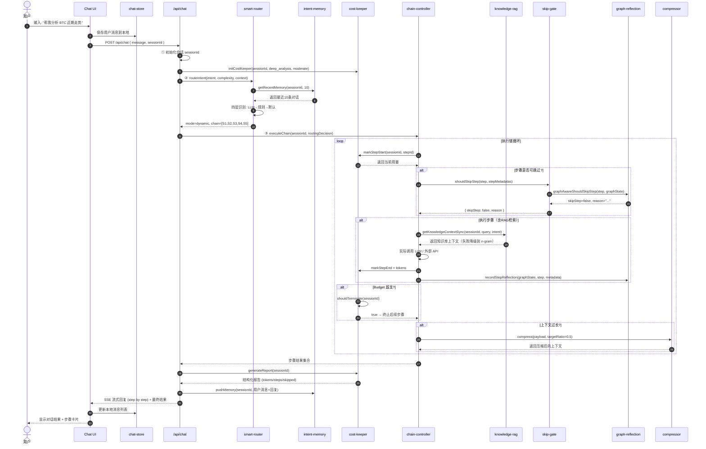
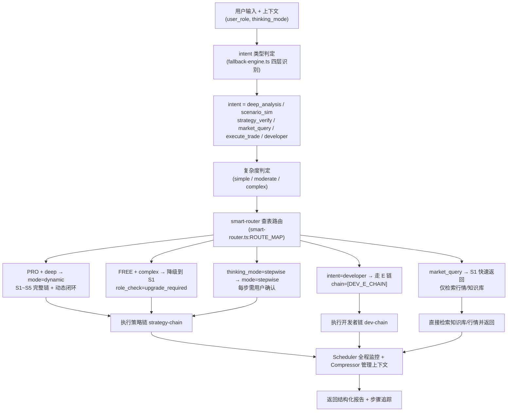
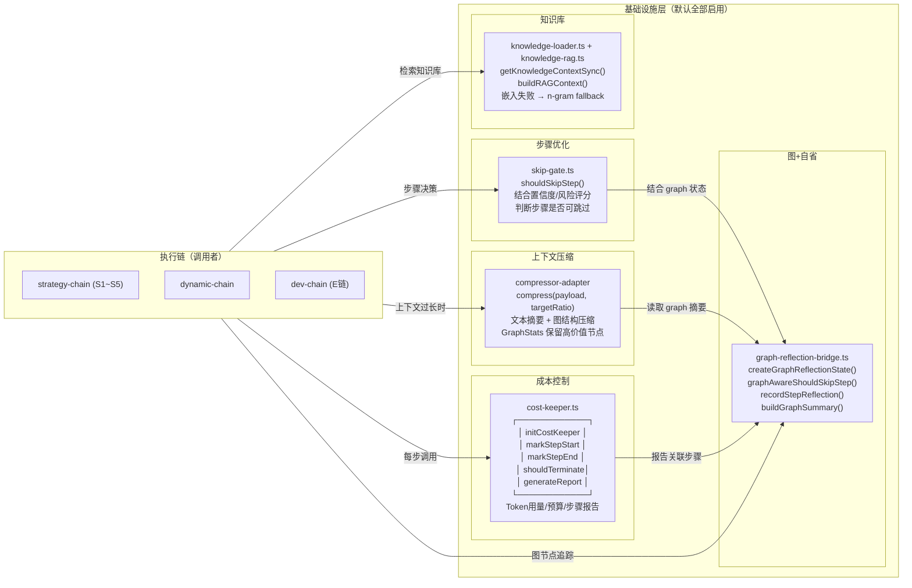
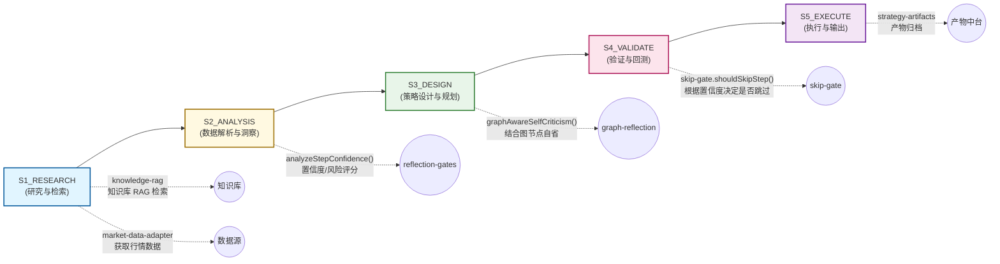

# Dream Universal Gateway — 主前端架构图 v1.0

> 版本: v1.0 | 日期: 2026-06-20 | 适用: 主前端运营快速参考
> 说明: 本文件使用 Mermaid 格式，VS Code / GitHub / GitLab / 系统内 architecture 页面均可直接渲染

---

## 一、五层架构总览

```mermaid
flowchart TB
    subgraph L1["L1 · 用户交互层 UI Layer"]
        direction LR
        A1["💬 Chat 对话界面\n/chat"]
        A2["📊 Dashboard 仪表盘\n/dashboard"]
        A3["📋 Notebook 笔记本\n/notebook"]
        A4["🏛️ Board 审批流\n/board"]
        A5["🚀 Ops 运维\n/ops"]
        A6["🔐 Login/Register\n/login /register"]
    end

    subgraph L2["L2 · 状态管理层 State Layer"]
        direction LR
        B1["auth-store\n用户登录态"]
        B2["chat-store\n对话消息"]
        B3["notebook-store\n笔记本步骤"]
        B4["session-store\nSession ID"]
        B5["credits-store\n积分余额"]
        B6["config-store\n系统配置"]
    end

    subgraph L3["L3 · API 网关层 API Gateway"]
        direction LR
        C1["/api/chat\n主对话接口"]
        C2["/api/intent/analyze\n意图分析"]
        C3["/api/market/*\n行情数据"]
        C4["/api/config/*\n配置管理"]
        C5["/api/notebook/*\n笔记本同步"]
        C6["/api/board/*\n审批流接口"]
        C7["/api/user/*\n用户体系"]
        C8["/api/monitor/*\n监控事件流"]
    end

    subgraph L4["L4 · 意图路由层 Intent Routing"]
        direction LR
        D1["smart-router.ts\n意图 → 链映射"]
        D2["fallback-engine.ts\n四层识别:追问→LLM→规则→默认"]
        D3["intent-memory.ts\nRingBuffer 记忆库"]
    end

    subgraph L5["L5 · 执行链层 Execution Chain"]
        direction LR
        E1["strategy-chain\nS1~S5 策略链"]
        E2["dynamic-chain\n动态闭环链"]
        E3["dev-chain\n开发者E链"]
    end

    subgraph L6["L6 · 基础设施层 Infrastructure"]
        direction LR
        F1["scheduler/cost-keeper\nToken 成本控制"]
        F2["scheduler/skip-gate\n步骤智能跳过"]
        F3["compressor-adapter\n上下文压缩"]
        F4["graph-reflection-bridge\n图+自省融合"]
        F5["knowledge-loader + knowledge-rag\n知识库 RAG"]
        F6["market-data-adapter\n行情数据适配"]
    end

    L1 --> L2 --> L3 --> L4 --> L5 --> L6
```



---

## 二、核心数据流 — 一次用户消息的处理旅程



---

## 三、意图路由决策树



---

## 四、基础设施协作关系（重点）



---

## 五、S 系列步骤链详解



---

## 六、Feature Flag 与启用状态

| 基础设施模块 | 默认状态 | 环境变量 | 说明 |
|--------------|---------|---------|------|
| scheduler/cost-keeper | ✅ 启用 | `USE_SCHEDULER` | 仅当 `=false` 或 `=0` 时禁用 |
| scheduler/skip-gate | ✅ 启用 | `USE_SCHEDULER` | 与 cost-keeper 联动 |
| compressor-adapter | ✅ 启用 | `USE_SCHEDULER` | 与 cost-keeper 联动，targetRatio 默认 0.5 |
| graph-reflection-bridge | ✅ 启用 | `ENABLE_DYNAMIC_CHAIN` | 图结构 + 自省融合，增强步骤决策 |
| knowledge-loader + RAG | ✅ 启用 | 无条件 | 知识库上下文注入，失败自动降级 n-gram |
| intent-memory | ✅ 启用 | 无条件 | RingBuffer 1000 条，辅助路由决策 |

---

## 七、关键文件索引（Code Reference）

### 7.1 用户层
| 文件 | 职责 |
|------|------|
| [src/app/chat](file:///Users/zhangjiangtao/WorkBuddy/dreambuddy-v2/3-FRONTEND/dream-universal-gateway/src/app/chat) | 主对话界面 |
| [src/app/dashboard/page.tsx](file:///Users/zhangjiangtao/WorkBuddy/dreambuddy-v2/3-FRONTEND/dream-universal-gateway/src/app/dashboard/page.tsx) | 仪表盘主页面 |
| [src/app/notebook](file:///Users/zhangjiangtao/WorkBuddy/dreambuddy-v2/3-FRONTEND/dream-universal-gateway/src/app/notebook) | 笔记本（步骤执行状态） |
| [src/app/board](file:///Users/zhangjiangtao/WorkBuddy/dreambuddy-v2/3-FRONTEND/dream-universal-gateway/src/app/board) | 审批流 |
| [src/app/page.tsx](file:///Users/zhangjiangtao/WorkBuddy/dreambuddy-v2/3-FRONTEND/dream-universal-gateway/src/app/page.tsx) | 首页路由 |

### 7.2 API 层
| 文件 | 职责 |
|------|------|
| [src/app/api/chat/route.ts](file:///Users/zhangjiangtao/WorkBuddy/dreambuddy-v2/3-FRONTEND/dream-universal-gateway/src/app/api/chat/route.ts) | 主对话处理入口（初始化 scheduler + 路由 + 执行链） |
| [src/app/api/intent/analyze/route.ts](file:///Users/zhangjiangtao/WorkBuddy/dreambuddy-v2/3-FRONTEND/dream-universal-gateway/src/app/api/intent/analyze/route.ts) | 独立意图分析接口 |
| [src/app/api/market/*](file:///Users/zhangjiangtao/WorkBuddy/dreambuddy-v2/3-FRONTEND/dream-universal-gateway/src/app/api/market) | 行情/运营数据接口 |
| [src/app/api/config/*](file:///Users/zhangjiangtao/WorkBuddy/dreambuddy-v2/3-FRONTEND/dream-universal-gateway/src/app/api/config) | API 配置 / 策略设置 / 交易参数 |
| [src/app/api/notebook/*](file:///Users/zhangjiangtao/WorkBuddy/dreambuddy-v2/3-FRONTEND/dream-universal-gateway/src/app/api/notebook) | 笔记本状态同步 |
| [src/app/api/user/*](file:///Users/zhangjiangtao/WorkBuddy/dreambuddy-v2/3-FRONTEND/dream-universal-gateway/src/app/api/user) | 用户体系（签到/余额/登录） |

### 7.3 意图路由层
| 文件 | 职责 |
|------|------|
| [src/lib/intent/smart-router.ts](file:///Users/zhangjiangtao/WorkBuddy/dreambuddy-v2/3-FRONTEND/dream-universal-gateway/src/lib/intent/smart-router.ts) | 核心路由逻辑：intent → chain + mode + credits |
| [src/lib/intent/fallback-engine.ts](file:///Users/zhangjiangtao/WorkBuddy/dreambuddy-v2/3-FRONTEND/dream-universal-gateway/src/lib/intent/fallback-engine.ts) | 四层识别（追问→LLM→规则→默认） |
| [src/lib/intent/intent-memory.ts](file:///Users/zhangjiangtao/WorkBuddy/dreambuddy-v2/3-FRONTEND/dream-universal-gateway/src/lib/intent/intent-memory.ts) | RingBuffer 记忆库（1000 条） |

### 7.4 执行链层
| 文件 | 职责 |
|------|------|
| [src/lib/strategy/chain-controller.ts](file:///Users/zhangjiangtao/WorkBuddy/dreambuddy-v2/3-FRONTEND/dream-universal-gateway/src/lib/strategy/chain-controller.ts) | S1~S5 策略链执行器 |
| [src/lib/dynamic-chain/runner.ts](file:///Users/zhangjiangtao/WorkBuddy/dreambuddy-v2/3-FRONTEND/dream-universal-gateway/src/lib/dynamic-chain/runner.ts) | 动态闭环链（plan-execute-reflect） |
| [src/lib/dynamic-chain/graph-planner.ts](file:///Users/zhangjiangtao/WorkBuddy/dreambuddy-v2/3-FRONTEND/dream-universal-gateway/src/lib/dynamic-chain/graph-planner.ts) | 动态链步骤规划（权威源：S 系列步骤定义） |
| [src/lib/dev-chain/index.ts](file:///Users/zhangjiangtao/WorkBuddy/dreambuddy-v2/3-FRONTEND/dream-universal-gateway/src/lib/dev-chain/index.ts) | 开发者 E 链 |
| [src/lib/strategy/steps/](file:///Users/zhangjiangtao/WorkBuddy/dreambuddy-v2/3-FRONTEND/dream-universal-gateway/src/lib/strategy/steps) | S1~S5 每步具体实现 |

### 7.5 基础设施层
| 文件 | 职责 |
|------|------|
| [src/lib/scheduler/cost-keeper.ts](file:///Users/zhangjiangtao/WorkBuddy/dreambuddy-v2/3-FRONTEND/dream-universal-gateway/src/lib/scheduler/cost-keeper.ts) | Token 用量追踪、预算控制、终止判断、报告生成 |
| [src/lib/scheduler/skip-gate.ts](file:///Users/zhangjiangtao/WorkBuddy/dreambuddy-v2/3-FRONTEND/dream-universal-gateway/src/lib/scheduler/skip-gate.ts) | 步骤跳过判断（结合置信度/风险评分） |
| [src/lib/compressor-adapter/index.ts](file:///Users/zhangjiangtao/WorkBuddy/dreambuddy-v2/3-FRONTEND/dream-universal-gateway/src/lib/compressor-adapter/index.ts) | 上下文压缩统一入口（文本摘要 + 图结构） |
| [src/lib/graph-reflection-bridge.ts](file:///Users/zhangjiangtao/WorkBuddy/dreambuddy-v2/3-FRONTEND/dream-universal-gateway/src/lib/graph-reflection-bridge.ts) | 图结构状态管理 + 自省融合（增强 skip 判断 / 压缩 / 反思） |
| [src/lib/knowledge-loader.ts](file:///Users/zhangjiangtao/WorkBuddy/dreambuddy-v2/3-FRONTEND/dream-universal-gateway/src/lib/knowledge-loader.ts) | 知识库加载与上下文注入 |
| [src/lib/knowledge-rag.ts](file:///Users/zhangjiangtao/WorkBuddy/dreambuddy-v2/3-FRONTEND/dream-universal-gateway/src/lib/knowledge-rag.ts) | RAG 核心（嵌入 / 检索 / 上下文构建 / n-gram 降级） |
| [src/lib/reflection-gates.ts](file:///Users/zhangjiangtao/WorkBuddy/dreambuddy-v2/3-FRONTEND/dream-universal-gateway/src/lib/reflection-gates.ts) | 置信度/风险评分 + skip gate 判断 |

### 7.6 状态管理
| 文件 | 职责 |
|------|------|
| [src/stores/chat-store.ts](file:///Users/zhangjiangtao/WorkBuddy/dreambuddy-v2/3-FRONTEND/dream-universal-gateway/src/stores/chat-store.ts) | 对话消息列表 + 状态 |
| [src/stores/auth-store.ts](file:///Users/zhangjiangtao/WorkBuddy/dreambuddy-v2/3-FRONTEND/dream-universal-gateway/src/stores/auth-store.ts) | 用户登录态 + JWT |
| [src/stores/notebook-store.ts](file:///Users/zhangjiangtao/WorkBuddy/dreambuddy-v2/3-FRONTEND/dream-universal-gateway/src/stores/notebook-store.ts) | 笔记本步骤状态 |
| [src/stores/credits-store.ts](file:///Users/zhangjiangtao/WorkBuddy/dreambuddy-v2/3-FRONTEND/dream-universal-gateway/src/stores/credits-store.ts) | 积分余额 |

---

## 八、运维快速参考

### 8.1 常见故障排查路径

| 现象 | 排查路径 | 关键日志 / 指标 |
|------|---------|-----------------|
| 对话无回复 | UI → chat-store → /api/chat → smart-router → chain-controller | `[CostKeeper]`, `[Intent]`, SSE stream |
| 回复质量低 | RAG 知识库是否完整？ → graph-reflection 置信度？ → compressor 是否过度压缩？ | GraphReport confidence, RAG chunks loaded |
| 对话被截断 | cost-keeper Budget 是否超限？ → 检查 moderate/complex 预算配置 | `[CostKeeper] ⚠ BUDGET EXCEEDED` |
| 某步骤被跳过 | skip-gate 判断逻辑 → graph-reflection 节点置信度 → 检查 S1/S2 stepMetadatas | `shouldSkipStep()` return value |
| 知识库检索空结果 | knowledge-loader 是否加载成功？ → RAG 嵌入 API key 是否配置？ → n-gram fallback 是否触发 | `loadAllKnowledge()`, `[RAG] Embedding failed` |

### 8.2 环境变量速查

```bash
# 基础设施开关（默认已启用，无需配置）
USE_SCHEDULER="true"                    # cost-keeper + skip-gate + compressor 总开关
ENABLE_DYNAMIC_CHAIN="true"             # dynamic-chain + graph-reflection 闭环

# RAG 配置（必填项，缺失时自动降级到 n-gram）
DEEPSEEK_API_KEY="your-api-key-here"    # RAG 嵌入 / 对话模型

# 数据库
DATABASE_URL="postgresql://..."         # PostgreSQL (Prisma)

# 认证
AUTH_SECRET="your-secret"               # Auth.js v5
```

### 8.3 性能瓶颈优先级

| 优先级 | 瓶颈点 | 监控指标 | 优化方向 |
|--------|--------|---------|---------|
| P0 | LLM 调用（S1~S5 每步） | totalTokens / stepLatency | cost-keeper 预算控制 + skip-gate 跳步优化 |
| P1 | RAG 检索（每次 S1） | embeddingLatency / chunksLoaded | 知识库缓存 + 更高效的嵌入模型 |
| P2 | Compressor（上下文 >200 条时触发） | compressRatio / originalTokens | 调整 targetRatio，减少不必要的压缩 |
| P3 | graph-reflection 节点追踪 | graphState.size / nodesProcessed | 惰性更新节点状态，避免高频计算 |

---

## 九、测试与验证

| 测试文件 | 覆盖范围 | 运行方式 |
|---------|---------|---------|
| [tests/infrastructure-integration-test.ts](file:///Users/zhangjiangtao/WorkBuddy/dreambuddy-v2/3-FRONTEND/dream-universal-gateway/tests/infrastructure-integration-test.ts) | 5 大基础设施独立正确性 + 协作顺畅度 | `pnpm tsx tests/infrastructure-integration-test.ts` |
| [tests/smart-router-v2-stress-test.ts](file:///Users/zhangjiangtao/WorkBuddy/dreambuddy-v2/3-FRONTEND/dream-universal-gateway/tests/smart-router-v2-stress-test.ts) | smart-router 各种 intent × role × thinking_mode 组合 | `pnpm tsx tests/smart-router-v2-stress-test.ts` |
| [tests/integration-three-systems.ts](file:///Users/zhangjiangtao/WorkBuddy/dreambuddy-v2/3-FRONTEND/dream-universal-gateway/tests/integration-three-systems.ts) | 主前端 + 审批 + 产品中台三系统联动 | `pnpm tsx tests/integration-three-systems.ts` |

> 核心测试已通过：infrastructure-integration-test = 41/41 ✅

---

*本文档为运营快速参考，详细设计请查阅 [docs/ARCHITECTURE.md](file:///Users/zhangjiangtao/WorkBuddy/dreambuddy-v2/3-FRONTEND/dream-universal-gateway/docs/ARCHITECTURE.md)*
