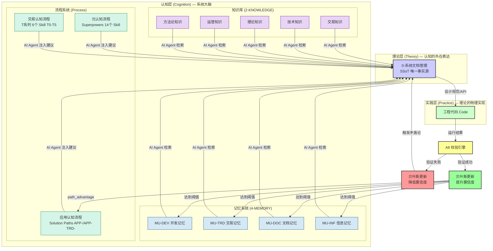
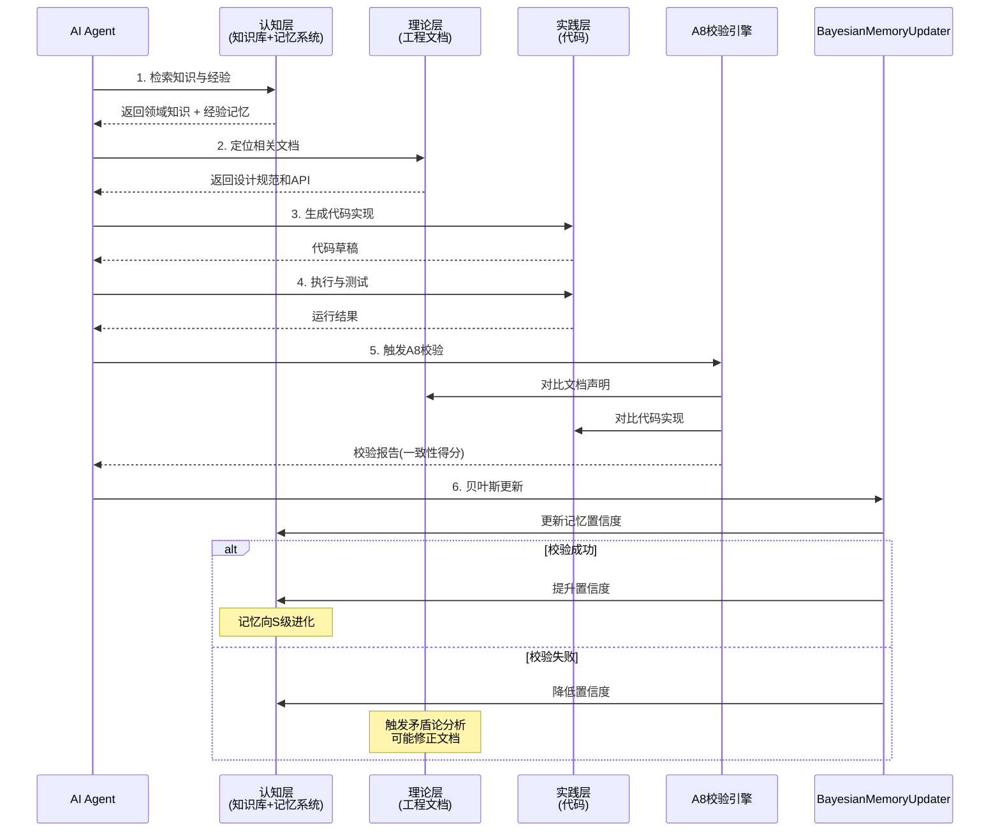

# 认知架构：认知-理论-实践闭环 (Cognitive Architecture)

> **版本**: v3.4
> **更新日期**: 2026-08-05
> **核心思想**: 借鉴认知科学（Cognitive Science）和贝叶斯大脑理论，将系统升级为一个具备自我优化能力的认知引擎。认知层 = 工作记忆（L0）+ 记忆系统（L1/L2）+ 知识库（2-KNOWLEDGE）+ 流程系统（Process：元认知 Superpowers + 交易认知 T 系列 + 应用认知 Solution Paths）
>
> **v3.0 变更**: 新增 L0 工作记忆层（WorkingMemoryManager），借鉴 Letta (MemGPT) 的 Core Memory 设计，为 AI Agent 提供显式的上下文管理机制。
>
> **v3.1 变更**: 认知层补入 Process（流程）层，对齐代码 `cognitive_superpowers.py` 的"认知三要素 = Knowledge + Memory + Process"。Process 含元认知流程（Superpowers 开发类 14 个 Skill）、交易认知流程（T 系列 6 个 Skill T0-T5）、应用认知流程（Solution Paths，APP-/APP-TRD- 模板）。
>
> **v3.2 变更**: §5.5.7 落地认知回测验证框架——`cognitive_backtest.py` 统一回测 P1-1/2/3 三项更新，复用 `evaluation_engine.compute_path_advantage`。结果：P1-2 salience_score (+0.4165) 和 P1-3 global_broadcast (+0.4600) 通过验证(upgrade)，P1-1 episodic_block (+0.0641) 标记观察(observe，代理指标待真实 episode 数据)。TDD 9/9 通过。
>
> **v3.3 变更**: 落地 P2-9 主动推理事前预测（`prediction_engine.py`，开仓生成 prediction，平仓计算 prediction_error 驱动贝叶斯）+ P2-7 静息态反刍（`rumination_engine.py`，daemon 空闲>30min 统计聚类近7天 episode 产出 C 级假设记忆）+ P2-8 双通道并行 spec（仅设计，待 AB-Trading 双通道回测环境就绪）+ P3-10/11/12 理论注脚（自由能/GWT/状态机随 P2 落地补注脚，§5.4.1）。回测 P2-9/P2-7 通过（4/5 项 path_advantage ≥ +0.2）。TDD 11/11 通过。
>
> **v3.4 变更**: P2-8 双通道回测环境落地（`experiments/ab-trading/core/dual_channel/`：胼胝体整合器 + 双通道运行器 + AB 对比框架，9/9 测试通过）+ P2-7 反刍实盘修复（路径 bug fix：`_find_episodes_dir()` 多路径搜索替代硬编码，找到 85 个 episode；反刍模块详细日志：idle 检查/触发原因/执行流程/样本详情）+ 实盘重启（polling_trader PID 28778 加载 P2-9 prediction；cognitive_daemon PID 31219 加载 P2-7 路径修复+日志）。BTC 500bars AB 对比回测 path_advantage=-0.2315（未通过 +0.2 门槛，metrics 映射需调优）。

---

## 1. 核心模型

本系统的开发与维护不再仅仅是"写代码"和"写文档"，而是一个完整的**认知过程（Cognitive Process）**。这个过程由三个核心层构成，形成一个螺旋上升的闭环：



### 1.1 认知层三要素

> 对齐代码 `cognitive_superpowers.py` L33-35：`认知三要素 = Knowledge（知识）+ Memory（记忆）+ Process（流程）= 完整认知`

认知层由三个互补的子系统构成，类比人类大脑的**语义记忆**、**情景/程序记忆**和**程序性技能（Procedural Skill / 执行流程）**：

| 维度 | 知识库 (2-KNOWLEDGE) | 记忆系统 (4-MEMORY) | 流程系统 (Process) |
|------|---------------------|---------------------|-------------------|
| **认知科学映射** | 语义记忆（Semantic Memory） | 情景记忆（Episodic）+ 程序记忆（Procedural） | 程序性技能 / 执行流程（Procedural Skill / Executive Routine） |
| **认知模式** | 左脑主导（事实/规则/逻辑） | 左脑+右脑（经验=逻辑+直觉） | 左脑=分析流程(A0-A3)；右脑=直觉流程(易经/做梦/模式识别)；胼胝体=A7门禁整合 |
| **存储内容** | "是什么" — 领域事实、概念、规则 | "为什么" + "怎么做" — 经验、原则、方法论 | "应该怎么做" + "实际怎么做的" — 标准化流程与实例化行动链 |
| **来源** | 领域知识整理、外部资料 | 实践验证、踩坑总结、A8校验 | 元认知：软件工程最佳实践；交易认知：交易认知流程；应用认知：会话行动链沉淀 |
| **更新方式** | 人工维护 + AI辅助整理 | 贝叶斯自动更新（置信度升降） | 元→应用实例化；应用→元贝叶斯反哺；交易类用 P&L/夏普做 path_advantage 升降级 |
| **质量体系** | 按领域分级（TRADING/TECHNICAL/THEORY...） | 5级质量（S/A/B/C/D） | 同 5 级质量（S/A/B/C/D + quarantined），贝叶斯验证有效性 |
| **生命周期** | 相对稳定，增量更新 | 动态流动，持续进化 | 元认知稳定，应用认知动态流动 |
| **典型内容** | 交易参数速查、数据源降级管道标准 | A1调研法（S级）、subprocess教训（B级） | 元：TDD/Systematic-Debugging（14 个开发 Skill）；交易：T0-T5（6 个 T 系列 Skill）；应用：APP-DEV-*/APP-TRD-* 解决路径 |

> **左右脑分工映射**（对齐 Sperry 裂脑研究 + [第一性原理.md](file:///Users/zhangjiangtao/WorkBuddy/dreambuddy-v2/2-KNOWLEDGE/3-THEORY/第一性原理.md) L74-86"左右脑辩证统一"）：
> - **左脑（分析型）** = A0矛盾分析→A1调研→A2第一性原理→A3战略，处理硬数据（价格/资金流/技术指标），输出精确 0-100 分与 UP/DOWN 方向
> - **右脑（直觉型）** = C7隐性矛盾（做梦产物）+ 易经卦象 + K线形态模式识别，输出方向偏好+置信区间
> - **胼胝体（整合器）** = A7 门禁——三者一致→高置信标准仓；左右一致但与A0相反→取A0；左右分歧→取A0方向+降置信
> - **现代修正**：单侧化是程度差异非种类差异，fMRI 显示复杂任务双侧分布式协同。工程取"双通道并行+整合器"而非"左脑人/右脑人"。

**Process 层的三类流程**（对齐 `cognitive_superpowers.py` 双层架构 + P1 T 系列扩展）：

| 类别 | 层级 | 存储位置 | 数量 | 路由 task_type |
|------|------|---------|------|---------------|
| 元认知流程（Meta-Cognition） | 总记忆层 | `4-MEMORY/0-元记忆/superpowers/skills/` | 14 个开发 Skill | python-development / memory-system / ... |
| 交易认知流程（Trading-Cognition） | 总记忆层（交易分支） | `4-MEMORY/0-元记忆/trading-cognition/skills/` | 6 个 T 系列 Skill（T0-T5） | trading-system / strategy-research / strategy-execution / ... |
| 应用认知流程（Applied-Cognition） | 应用记忆层 | 各 MU 的 `solution_paths/*.json` | 动态生成 | APP-DEV-*/APP-TRD-* 前缀区分 |

> **双源加载**（P1 实现）：`SkillLoader` 按 `task_type` 路由——交易类 task_type 从 `trading_skills` 召回 T 系列，开发类从 `skills` 召回原版 Superpowers。详见 `cognitive_superpowers.py` `SkillLoader.retrieve()`。

### 1.2 三层定位

*   **认知层 (Cognition)**: 系统的"大脑"，由 `2-KNOWLEDGE`（知识库）、`4-MEMORY`（记忆系统）、`WorkingMemoryManager`（L0 工作记忆）和 **Process 流程系统**（元认知 Superpowers + 交易认知 T 系列 + 应用认知 Solution Paths）共同组成。AI Agent 进行推理和决策的起点。
    *   `WorkingMemoryManager` (L0) 提供**工作台**：当前任务的核心状态、中间变量、上下文摘要。生命周期最短（单次任务），通过 Token 预算管理避免上下文溢出。
    *   `2-KNOWLEDGE` 提供**领域知识**：交易规则、技术标准、理论框架。
    *   `4-MEMORY` 提供**经验知识**：踩坑教训、最佳实践、方法论原则。
    *   `Process` 提供**执行流程**：元认知流程（"应该怎么做"的标准化最佳实践）、交易认知流程（T0-T5 交易认知闭环）、应用认知流程（"实际怎么做的"实例化解决路径）。建议注入而非强制约束，贝叶斯验证有效性。
*   **理论层 (Theory)**: 认知的"外在表达"，即 `0-系统文档管理`。它将认知层中的抽象知识和经验转化为具体的、人类可读的设计规范、API文档和技术方案。这是从"想法"到"蓝图"的关键一步。
*   **实践层 (Practice)**: 理论的"物理实现"，即我们的源代码（Code）。代码的成功运行是检验"理论"（文档）是否正确、"认知"（知识+记忆）是否有效的唯一标准。

### 1.3 记忆三层架构 (v3.0 新增)

借鉴 Letta (MemGPT) 的分层记忆设计，我们的记忆系统从 v3.0 起采用三层架构：

| 层级 | 组件 | 生命周期 | 存储介质 | 核心职责 | 认知科学映射 |
|------|------|----------|----------|----------|-------------|
| **L0 工作记忆** | `WorkingMemoryManager` | 极短（单次任务） | 内存 + 检查点文件 | 当前任务的上下文管理、中间变量、Token 预算控制 | 工作记忆 (Working Memory) |
| **L1 应用记忆** | `AM-TRD/RSK/OPS/EXP` | 中等（子系统级） | JSON / SQLite | 特定领域的场景化经验、踩坑记录 | 情节记忆 (Episodic Memory) |
| **L2 总记忆** | `MU-DEV/TRD/DOC/INF` | 长期（全局通用） | Markdown + 贝叶斯JSON | 普适的原则、方法论、核心经验 | 语义记忆 (Semantic Memory) |

**记忆流动路径**:
```
L0 工作记忆 (任务执行中)
    ↓ distill_to_app_memory() — 任务结束后蒸馏下降
L1 应用记忆 (子系统级)
    ↓ DistillScheduler.run_once() — 质量达标后上升
L2 总记忆 (全局级)
    ↓ search() — AI Agent 检索激活
L0 工作记忆 (注入到当前任务上下文)
```

### 1.4 认知层内部协作

```
AI Agent 需要完成一个开发任务（或交易决策）
    │
    ├── 0. 初始化工作记忆 (WorkingMemoryManager)
    │   "当前任务是什么？目标是什么？" → 创建 L0 工作记忆
    │
    ├── 1. 查知识库 (2-KNOWLEDGE)
    │   "数据源降级管道标准是什么？" → 知识库返回具体规范
    │
    ├── 2. 查记忆系统 (4-MEMORY L2)
    │   "做这类任务的最佳实践是什么？" → 记忆系统返回 A1调研法（S级）
    │   "之前有人踩过什么坑？" → 记忆系统返回 subprocess教训（B级）
    │
    ├── 3. 召回流程 (Process)
    │   开发任务 → SkillLoader.retrieve(task_type="python-development")
    │              → 返回元认知 Skill（如 TDD）+ 应用认知 Solution Path（APP-DEV-*）
    │   交易决策 → trading_recall(task_type="strategy-execution")
    │              → 返回 T 系列 Skill（T0-T5）+ APP-TRD-* 历史解决路径
    │   流程是"建议"而非"约束"，AI 可自由选择是否遵循
    │
    ├── 4. 交叉验证
    │   知识库的"是什么" + 记忆系统的"怎么做" + 流程的"应该怎么做" → 完整认知
    │   三者可能冲突 → 触发矛盾论分析
    │
    ├── 5. 写入工作记忆 (L0)
    │   将检索到的知识、经验、流程建议、当前状态写入工作记忆的 context_block
    │   执行过程中的中间结果写入 scratch_block
    │
    └── 6. 任务结束 → 蒸馏 + 反馈
        工作记忆中的有效经验 → distill_to_app_memory() → L1 应用记忆
        行动链 → 沉淀为应用认知流程（APP-DEV-*/APP-TRD-*）
        交易类 → update_path_advantage_from_trading() 用 P&L/夏普做贝叶斯升降级
        应用→元反馈 → 1/√N 加权反哺元认知模板置信度
```

---

## 2. 核心机制：贝叶斯认知更新

> **统一理论框架（v3.1 新增）**: 预测编码与自由能原理（Friston）——大脑是"预测机器"，持续预测下一刻输入，用预测误差更新内部模型。自由能 = 预测误差的熵上界。本系统的贝叶斯更新、A8 校验、矛盾分析都是"最小化自由能"的特例：
> - **贝叶斯更新 = 最小化自由能**（先验→后验=预测误差驱动模型修正）
> - **A8 校验 = 预测误差信号**（theory-practice gap = prediction error）
> - **矛盾分析 = 模型修正**（A0 检出矛盾 = 多模型间预测不一致）
> - **主动推理 = 交易行动**（开仓/平仓 = 用行动改变持仓以减少组合预测误差）
>
> **工程取用**: 取其可计算核心（层级贝叶斯预测误差）弃其普适性声称。关键补缺——增加事前预测（开仓前生成 prediction，平仓后与实际对比），当前 A8 是事后校验。

为了让这个认知闭环具备科学的自我优化能力，我们引入**贝叶斯更新（Bayesian Update）**机制。每当代码被开发、运行或测试时，系统都会将这次"观察（Observation）"作为新的证据，更新相关记忆（Memory）的置信度（Confidence）。

### 2.1 贝叶斯定理应用

在我们的场景中，贝叶斯定理的表达为：

$$
P(\text{Memory}_{true} | \text{Observation}) = \frac{P(\text{Observation} | \text{Memory}_{true}) \times P(\text{Memory}_{true})}{P(\text{Observation})}
$$

*   **$P(\text{Memory}_{true})$ (先验置信度)**: 在验证前，我们认为某条记忆（如"A1调研法"）有效的概率。
    *   来源：基于记忆的来源和历史表现。例如，S级公理源的初始置信度为 0.95。
*   **$P(\text{Observation} | \text{Memory}_{true})$ (似然度)**: 假设记忆为真，我们观察到当前结果的概率。
*   **$P(\text{Observation})$ (证据概率)**: 无论记忆真假，观察到当前结果的总概率。这通常是一个归一化常数。
*   **$P(\text{Memory}_{true} | \text{Observation})$ (后验置信度)**: 在融入了新观察后，我们更新后的记忆置信度。这将成为下一次验证的先验。

### 2.1.1 🔬 RIGOROUS_v2 数学严谨升级（2026-07-29）

v1版的贝叶斯实现为工程近似（0.95/0.05固定似然度 + 0.8/0.2固定证据 + 经验衰减因子）。v2版严格化为三大数学机制：

| 组件 | v1 工程近似 | v2 严格贝叶斯 | 核心公式 |
|------|------------|--------------|---------|
| **似然度 $P(B\|A)$** | 固定三档 0.95 / 0.05 / 0.5 | **Beta-Binomial 共轭分布**，每次成功α+1、失败β+1 | $\hat{p}_{success} = \dfrac{\alpha}{\alpha+\beta}, \ \alpha,\beta \leftarrow \text{Beta伪计数}$ |
| **证据 $P(B)$** | 固定二档 0.8 / 0.2 | **全概率公式 (Law of Total Probability)** 展开 | $P(B) = P(B\|A)P(A) + P(B\|\neg A)P(\neg A), \ P(B_{success}\|\neg A)=\text{base\_rate}$ |
| **衰减/遗忘** | 质量等级硬编码档位 0.5/0.7/0.85/1.0 | **指数衰减遗忘因子**（基于记忆年龄 + 半衰周期） | $\text{ff} = \exp(-\ln 2 \cdot \text{age}/\text{half\_life}), \ \text{conf} = \text{ff}\cdot\text{post} + (1-\text{ff})\cdot 0.5$ |
| **向后兼容** | - | ✅ 旧JSON自动推导 `beta_alpha=1+verify, beta_beta=1+conflict, created_at=last_updated` | `schema_version: 2` 持久化标记 |

**半衰周期表（S级最稳定，D级最快过时）**：
```
HALF_LIFE_DAYS = {S:365, A:180, B:90, C:30, D:15}  # 天
```

**v2 与经典贝叶斯的严格等价性证明**：
1. 似然度：$\hat{p} = \alpha/(\alpha+\beta)$ 是 Beta($\alpha$,$\beta$) 分布的**期望**（无偏估计），α,β≥1 源于 Laplace 平滑（Beta(1,1)=均匀无信息先验）
2. 证据：严格 Law of Total Probability，取 $P(B|\neg A)=0.5$ 为最大熵 base_rate（无记忆指导时的随机基线）
3. 遗忘：指数衰减属**时序贝叶斯滤波**中的 leaky integrator，当样本年龄 > half_life×10 时，后验几乎完全回归 0.5（符合"久远证据不应影响当前判断"的统计直觉）

---

### 2.2 算法实现（v2 严格版）

我们在 `4-MEMORY/9-工具与接口/` 下实现一个 `BayesianMemoryUpdater` 类，用于在 A8 校验完成后自动计算置信度更新。

```python
class BayesianMemoryUpdater:
    # 半衰周期 (基于质量等级)
    HALF_LIFE_DAYS = {"S":365,"A":180,"B":90,"C":30,"D":15}
    _FORGET_LAMBDA = math.log(2)  # 保证 half_life → forget=0.5
    base_success_rate = 0.5       # P(成功|记忆为假) 的最大熵基线

    def update_confidence(self, memory_id, observation_success, followed_memory):
        entry = self.memories[memory_id]
        prior = clamp(entry.confidence, 1e-4, 1-1e-4)

        # ===== [1] Beta似然度 — 替代固定 0.95/0.05 =====
        if not followed_memory:
            lik_success, lik_used, do_update_beta = 0.5, 0.5, False
        else:
            lik_success = entry.beta_alpha / (entry.beta_alpha + entry.beta_beta)
            lik_used   = lik_success if observation_success else (1 - lik_success)
            do_update_beta = True

        # ===== [2] 全概率证据 — 替代固定 0.8/0.2 =====
        if observation_success:
            pBA, pBnotA = lik_success, self.base_success_rate
        else:
            pBA, pBnotA = 1-lik_success, 1-self.base_success_rate
        evidence = pBA * prior + pBnotA * (1 - prior)
        evidence = clamp(evidence, 1e-9, 1-1e-9)

        # ===== [3] 纯贝叶斯公式 (与教科书中完全等价) =====
        posterior = (lik_used * prior) / evidence

        # ===== [4] Beta 参数后验更新 =====
        if do_update_beta:
            if observation_success: entry.beta_alpha += 1
            else:                   entry.beta_beta  += 1

        # ===== [5] 指数遗忘 (基于年龄) =====
        age_s = now() - entry.created_at
        ff = math.exp(-self._FORGET_LAMBDA * age_s / (half_life_days*86400))
        posterior = ff * posterior + (1 - ff) * 0.5

        # ===== [6] 等级判定 (置信度 + 验证次数 双门槛) =====
        entry.confidence = clamp(posterior, 0, 1)
        entry.quality_level = _calc_quality(entry.confidence, entry.verify_count)
        return posterior, entry.quality_level
```

> **注**：v1 伪代码（0.95/0.8 固定档位）已从生产移除，存档于 git history（2026-07-29 前版本）。

### 2.3 证明算法与质量分级的对应

贝叶斯置信度与现有 `MEMORY_QUALITY.md` 的质量分级直接对应：

| 置信度区间 | 对应等级 | 贝叶斯更新行为 |
|-----------|---------|---------------|
| ≥ 0.95 | S 级（公理级） | 持续验证，极少降级 |
| 0.70 ~ 0.95 | A 级（可信级） | 验证成功自动上升，失败观察触发审查 |
| 0.40 ~ 0.70 | B 级（待验证） | 每次验证大幅改变置信度 |
| < 0.40 | C 级（假设级） | 需要大量验证才能上升 |
| 被证伪 | D 级（已证伪） | 连续失败观察后标记证伪 |

---

## 2.5 自动接入层 — IDE无关的自动触发（2026-07-29）

### 问题背景

认知系统的6步闭环（recall→理论→实践→A8→bayes→record）在设计上是完整的，但**缺少自动触发机制**：AI Agent（TRAE/Claude Code/Cursor）不会自动调用 `recall()` / `record()` / `verify()`，导致开发经验丢失。

### 三层架构

```
┌──────────────────────────────────────────────────────────┐
│              宿主层 (Host Adapter Layer)                  │
│   Claude Code Hooks  │  TRAE MCP Config  │  Cursor Rules │
└────────┬─────────────────────┬───────────────────────────┘
         │ stdin/stdout JSON   │ MCP protocol (stdio)
         ▼                     ▼
┌──────────────────────────────────────────────────────────┐
│              协议层 (Protocol Layer)                      │
│       CognitiveMCPServer (JSON-RPC over stdio)           │
│  Tools: recall / record / verify / stats / health        │
└────────┬─────────────────────────────────────────────────┘
         │ Python API
         ▼
┌──────────────────────────────────────────────────────────┐
│              触发层 (Trigger Layer)                       │
│  git post-commit hook  │  cognitive_daemon (文件监听)     │
│  自动: commit→提取经验→record→verify→bayes更新            │
└──────────────────────────────────────────────────────────┘
```

### 各层职责

| 层 | 核心文件 | 职责 | 通用性 |
|---|---|---|---|
| **触发层** | `cognitive_hook.py` | git post-commit hook自动提取commit经验→record→verify→bayes | ★★★★★ 任何IDE都走git |
| **协议层** | `cognitive_mcp_server.py` | 将认知系统封装为MCP server，5个标准tools，纯stdlib零依赖 | ★★★★★ 任何MCP客户端 |
| **宿主层** | `cognitive_install.py` | Claude Code hooks + TRAE MCP + 通用config 一键安装 | 按IDE适配 |

### 触发层工作流

```
git commit
  → extract_commit_info()     # 提取hash/message/files/diff stats
  → classify_change_type()     # 分类: feature/bugfix/refactor/docs/test
  → generate_experience()      # 生成结构化经验描述
  → CognitiveLoopEntry.record()  # 记录到L1应用记忆 (C级, conf=0.3)
  → CognitiveLoopEntry.verify()  # 触发贝叶斯更新 + 动态蒸馏
```

### MCP协议层暴露的5个Tools

| Tool | 方向 | 对应CognitiveLoopEntry方法 | 调用时机 |
|------|------|---------------------------|---------|
| `recall` | 读 | `recall(context, top_k, min_quality)` | 任务开始前 |
| `record` | 写 | `record(content, quality_level, tags, source)` | 发现新经验时 |
| `verify` | 写 | `verify(memory_id, success)` | A8校验/测试后 |
| `stats` | 读 | `stats()` | 监控/调试 |
| `health` | 读 | `healthcheck()` | 监控/调试 |

### 安装与配置

```bash
# 一键安装全部三层
python3 4-MEMORY/9-工具与接口/cognitive_install.py

# 仅安装触发层（git hook）
python3 cognitive_install.py --trigger

# 仅配置MCP协议层
python3 cognitive_install.py --mcp

# 仅配置Claude Code hooks
python3 cognitive_install.py --claude
```

### 设计原则

1. **git hooks是核心触发源**——任何IDE都走git，最通用
2. **MCP server零外部依赖**——纯Python标准库实现JSON-RPC，不需要安装mcp包
3. **Adapter Pattern**——不修改cognitive_loop_entry.py任何代码，只在外层包装
4. **渐进可用**——触发层独立工作（不依赖MCP），MCP层独立工作（不依赖hooks）
5. **静默失败**——git hook失败不阻塞git操作

### GitHub调研结论

调研了mem0(~25k★)、Letta/MemGPT(~14k★)、Zep(~3k★)、A-MEM(~1k★)、cognee(~2k★)等项目，**全部是被动服务/库**，没有现成的通用自动触发层。自动接入层是行业空白，必须自建。

---

## 3. 闭环工作流：一次完整的认知过程

当 AI Agent 执行一个开发任务时，它将经历以下完整的认知流程：



### 3.1 详细步骤说明

**Step 1: 认知检索 (Cognition -> Agent)**
- AI 同时从 `2-KNOWLEDGE`（知识库）和 `4-MEMORY`（记忆系统）检索信息
- 从**知识库**检索领域知识：如"数据源降级管道标准"、"交易参数速查"
- 从**记忆系统**检索经验知识：如 A1 调研法（S级）、subprocess教训（B级）

**Step 2: 理论定位 (Cognition -> Theory)**
- AI 根据认知层的指引，定位到 `0-系统文档管理` 中的相关工程文档（Theory）
- 读取 API_SPEC.md、设计文档、架构说明等

**Step 3: 实践设计 (Theory -> Practice)**
- AI 阅读工程文档，理解设计意图和接口规范
- 结合认知层的知识和经验，生成代码实现方案（Practice）

**Step 4: 代码执行 (Practice)**
- AI 编写代码，并运行测试用例

**Step 5: 观察产生 (Practice -> Cognition)**
- `A8 校验引擎` 介入，对比代码实现与文档规范，并运行测试
- 这产生了一次"观察"（Observation）
- 输出校验报告（包含一致性得分）

**Step 6: 贝叶斯更新 (Cognition)**
- `BayesianMemoryUpdater` 根据观察结果（成功/失败），使用贝叶斯定理更新相关记忆的置信度
- **成功路径**：记忆置信度提升，向 S 级（公理）进化
- **失败路径**：记忆置信度下降，触发"矛盾论"分析（分析失败的真正原因），可能导致对理论层（文档）的修正
- 知识库内容如需更新（如新增交易参数），则由人工维护

### 3.2 自动化脚本

整个闭环流程可通过 `auto_update_trigger.py` 自动化执行：

```bash
# 完整流程：A8校验 + 记忆同步 + 贝叶斯更新
python3 4-MEMORY/9-工具与接口/auto_update_trigger.py \
    /path/to/subsystem \
    --sync-memory \
    --bayes-update
```

**执行步骤**：
1. A8 校验：对比 API_SPEC.md 与代码实现
2. 生成更新建议：识别文档-代码不一致
3. 同步到记忆单元：更新 MU-CORE.md 状态
4. 贝叶斯更新：基于校验结果更新记忆置信度

### 3.3 记忆进化路径

通过持续的"认知-理论-实践-再认知"循环，记忆将沿以下路径进化：

```
C级（假设） → B级（待验证） → A级（可信） → S级（公理）
    ↑              ↑              ↑              ↑
  初始记忆      1次验证       3次验证        10次验证
```

**关键机制**：
- 每一次 A8 校验结果都会作为新的"观察"输入贝叶斯更新器
- 验证成功 → 置信度提升 → 等级上升
- 验证失败 → 置信度下降 → 等级下降或触发矛盾分析
- S 级记忆具有更高的稳定性（衰减因子 0.5），变化更缓慢

通过这个闭环，系统的知识（知识库+记忆）将通过每一次成功的实践（代码运行）得到强化，并在失败中得到修正，从而实现持续的自我优化和进化。

---

## 4. 认知三要素与流程沉淀（Process Layer）

> **新增**: 完整认知 = Knowledge（知识）+ Memory（记忆）+ Process（流程）
> Process = 元认知流程（Superpowers规范，总记忆层）+ 应用认知流程（Solution Paths，应用记忆层）

### 4.1 Superpowers 的定位

Superpowers 属于**标准规范**，是"建议注入"而非"强制约束"。
它将软件工程最佳实践（TDD、系统化调试、重构、审查）封装为 AI 可参考的流程模板。

**核心价值**：
- 不依赖复杂的提示词工程
- 将"应该怎么做"的经验沉淀为标准化流程
- AI 可以自由选择遵循或探索，系统会对比不同方案的有效性

### 4.2 双层流程架构（对齐总记忆/应用记忆）

```
┌────────────────────────────────────────────────────────────┐
│  Layer 1: 元认知流程（Meta-Cognition）= 总记忆层             │
│  = Superpowers 标准规范                                     │
│  = "应该怎么做"的通用软件工程最佳实践                        │
│  = 存储: 4-MEMORY/0-元记忆/process_templates.json          │
│  = 例如: TDD-001、DEBUG-001、REFACTOR-001、DESIGN-001      │
└────────────────────────────────────────────────────────────┘
                           │ 实例化
                           ▼
┌────────────────────────────────────────────────────────────┐
│  Layer 2: 应用认知流程（Applied Cognition）= 应用记忆层     │
│  = Solution Paths（解决路径）                               │
│  = "实际怎么做的"具体行动链                                 │
│  = 存储: 各应用记忆单元的 solution_paths/*.json             │
│  = 例如: "交易系统TDD实践"、"风控模块调试路径"               │
└────────────────────────────────────────────────────────────┘
```

### 4.3 元→应用映射与应用→元反馈

**TemplateMappingRegistry** 持久化追踪映射关系：

- **元→应用**: 一个元认知模板可产生多个应用实例（`parent_id → [applied_ids]`）
- **应用→元**: 应用实例的验证结果（success/fail）反哺元模板置信度
- **加权反馈**: 子实例越多，单次反馈权重越低（1/√N 平滑衰减）

### 4.4 会话闭环（Session Loop）

```
daemon 文件变更 → 新会话
  ├─ recall 注入（元+应用双层流程建议）
  ├─ 记录行动链（文件变更+工具调用+git操作）
  └─ git commit  →  会话结束
        ├─ 生成 Solution Path
        ├─ 事后校验（记忆+流程对比）
        ├─ 沉淀为应用认知流程（写入应用记忆单元）
        └─ 应用→元反馈（贝叶斯反哺元模板置信度）
```

### 4.5 核心代码

| 文件 | 职责 |
|------|------|
| `cognitive_superpowers.py` | 流程模板数据模型、双层注册表、映射注册表、检索、贝叶斯更新 |
| `cognitive_session.py` | 会话管理器、行动链记录、Solution Path生成、事后校验、应用流程沉淀 |
| `cognitive_daemon.py` | 文件变更监听，自动触发会话 |
| `cognitive_hook.py` | git commit 钩子，触发会话结束与接力验证 |

### 4.6 CLI 命令

```bash
# 列出所有流程模板
python3 cognitive_superpowers.py --list

# 仅列出元认知流程
python3 cognitive_superpowers.py --list-meta

# 仅列出应用认知流程
python3 cognitive_superpowers.py --list-applied

# 显示元→应用映射
python3 cognitive_superpowers.py --mapping

# 搜索相关流程
python3 cognitive_superpowers.py --search "调试 bug"

# 生成流程建议文本
python3 cognitive_superpowers.py --suggest "测试驱动开发"
```

---

## 5. 人类认知科学完善（v3.1 新增）

> **目标**: 借鉴人类认知科学的 7 个维度，为认知架构提供更深的科学根基，并用认知回测验证每项完善的价值。
>
> **硬约束**: 每项更新必须通过认知回测（A/B 对比）验证价值，path_advantage ≥ +0.2 才允许落地（对齐 project_memory 中"优化落地需回测验证+贝叶斯优化"的约束）。

### 5.1 调研的 7 个认知科学维度

| # | 理论 | 提出者 | 核心思想 | 系统已有 | 缺失 |
|---|------|--------|---------|---------|------|
| 1 | 左右脑分工 | Sperry (1981) | 左脑逻辑/语言/顺序；右脑整体/空间/直觉。胼胝体整合 | ✅ 第一性原理 L74-86 已有"左右脑辩证统一" | 理论未显式化到认知架构文档 |
| 2 | 双系统理论 | Kahneman / Evans | System 1（快/直觉）vs System 2（慢/理性） | ✅ thinking_fast_slow.md 已蒸馏 | 未映射到 A 系列 Cron(System 1) vs A8(System 2) |
| 3 | 三层脑理论 | MacLean (1970) | 爬行脑(本能)→边缘系统(情感)→新皮质(理性) | ✅ 风控体系已有三层 | 理论映射未显式化、A8偏差未双向反馈A0 |
| 4 | 工作记忆多成分模型 | Baddeley (1974/2000) | 中央执行+语音回路+视觉空间模板+情景缓冲器 | 🟡 L0 有 context/scratch/process block | 缺 episodic_block（决策事件序列） |
| 5 | 预测编码/自由能原理 | Friston (2010) | 大脑是预测机器，用预测误差更新内部模型 | 🟡 贝叶斯更新+A8校验是特例 | 缺事前预测、gap_score未理论化为预测误差 |
| 6 | 全局工作空间理论 | Baars (1988) / Dehaene | 信息进入全局工作空间后被全脑广播 | 🟡 shared_memory_bus 已存在 | trading_recall 未发布到 bus |
| 7 | 三大脑网络 | Raichle / Menon | DMN(内省)+SN(突显/切换)+CEN(执行) | ❌ daemon 无显著性区分 | 缺 salience_score 触发机制 |

### 5.2 P0 — 理论补全（文档对齐，不改代码）

#### 5.2.1 左右脑分工映射

**理论**: Sperry 裂脑实验证明两半球功能单侧化——左脑语言/逻辑/因果/序列分析，右脑空间/整体/模式/隐喻/直觉。现代修正：单侧化是程度差异非种类差异，fMRI 显示复杂任务双侧分布式协同，胼胝体双向整合是主流模式。

**已有实现**:
- [第一性原理.md](file:///Users/zhangjiangtao/WorkBuddy/dreambuddy-v2/2-KNOWLEDGE/3-THEORY/第一性原理.md) L74-86 已内建"左右脑辩证统一"
- 左脑 = A0(矛盾分析)→A1(调研)→A2(第一性原理)→A3(战略)，处理硬数据输出 0-100 分
- 右脑 = C7隐性矛盾(做梦产物)+易经卦象+K线形态模式识别，输出方向偏好+置信区间
- 胼胝体 = A7 门禁（三者一致→标准仓；左右分歧→取A0方向+降置信）

**补全内容**: 将上述映射显式化到认知架构 §1.1 三要素表的"认知模式"列，区分分析型（左脑）vs 直觉型（右脑）。

**回测验证**: 对同一历史窗口跑"左脑only"vs"左+右双通道"，比较夏普/胜率/盈亏比。预期双通道在转折点提供边际信息。注意：右脑通道（易经/做梦）必须强制输出可量化字段（置信区间+方向），否则无法回测。

#### 5.2.2 三层脑风控映射

**理论**: MacLean 三层脑——爬行脑(本能/生存)→边缘系统(情感/记忆)→新皮质(理性/抽象)。现代修正：三层非严格进化叠加，情绪与理性是并行交互回路（Panksepp/Pessoa）。作为字面解剖已过时，作为层级化控制隐喻仍有工程价值。

**已有实现**:
- [风控体系.md](file:///Users/zhangjiangtao/WorkBuddy/dreambuddy-v2/2-KNOWLEDGE/1-TRADING/风控体系.md) 已有三层风控
- 爬行脑 = 硬熔断层（10%日回撤熔断、Fail-Closed、杠杆>2x硬阻断），不可被上层否决
- 边缘系统 = A8 损失厌恶/认知偏差检测层
- 新皮质 = A0-A6 分析链

**补全内容**: 显式化三层映射到 T3 风控门禁 Skill；关键修正——A8 偏差信号应作为**偏差信号双向反馈**给 A0 修正模型（Panksepp 视角），而非仅作为"被A0压制的噪声"。

**回测验证**: ①三层拦截率分层统计（爬行层误杀率应≈0）；②响应延迟分层（爬行层<1ms、边缘层异步daily、新皮质分钟级）；③A8偏差信号反馈A0后是否降低后续同类错误率。

#### 5.2.3 预测编码统一框架

**理论**: Friston 自由能原理——大脑持续预测下一刻输入，用预测误差更新内部模型。自由能 = 预测误差的熵上界。主动推理 = 通过行动改变输入以减少预测误差。工程取用：取其可计算核心（层级贝叶斯预测误差）弃其普适性声称。

**已有实现**（最自然契合的理论）:
- 贝叶斯更新 = 最小化自由能（A2 阻力评分修正即贝叶斯后验更新）
- A8 校验 = 预测误差信号（theory-practice gap = prediction error）
- 矛盾分析 = 模型修正（A0 检出 C1-C8 矛盾 = 多模型间预测不一致）
- 主动推理 = 交易行动（开仓/平仓 = 用行动改变持仓以减少组合预测误差）

**补全内容**: 将预测编码作为认知架构的统一数学框架。关键补缺——增加**事前预测**（开仓前生成 `prediction`，平仓后与实际对比），当前 A8 是事后校验。

**回测验证**: ①gap_score 与后续交易表现相关性（高 gap 应预测低收益）；②预测误差收敛速度（A2 阻力评分修正幅度是否随信息累积衰减）；③矛盾密度 vs 后续波动率（矛盾数领先波动放大？）。

### 5.3 P1 — 机制增强（TDD 落地）

#### 5.3.1 L0 情景缓冲器（episodic_block）

**理论**: Baddeley 2000 新增情景缓冲器——跨时间整合事件序列的有限容量临时存储（~4 chunks），与长时记忆交互。

**现状**: `WorkingMemoryManager` 有 4 个 block（task/context/scratch/process），但 `_operation_log` 是操作级日志，非决策事件序列。

**落地**: 新增 `episodic_block`，结构对齐 TradeCase v0.2 的 `thinking_chain` 数组（stage/ts/decision/rationale/evidence_refs）。提供 `append_episode(stage, decision, rationale, evidence_refs)` 方法，由 polling_trader 在 A0-A9 各阶段决策点调用。`get_prompt_context()` 追加"### 决策事件序列"段。`distill_to_app_memory` 时序列化供 A8 读取。

**回测验证**: 取 30 个已复盘 TradeCase，A 组（无 episodic_block）vs B 组（有），计算 gap_score 识别的 precision/recall。预期 B 组 gap 召回率提升——因 episodic_block 记录了 rationale（"为什么这么做"），而 git diff 只有"改了什么"。

#### 5.3.2 突显网络触发器（salience_score）

**理论**: Menon 2011 三大脑网络——SN（突显网络，前岛叶+前扣带回）检测显著事件，触发 DMN↔CEN 切换。高显著→即时处理，低显著→累积。

**现状**: `cognitive_daemon` 经 P1 修复后已退化为会话追踪器，`_extract_rich_tags` 能区分文件类型但无显著性打分。

**落地**: 新增 `salience_score(changes) -> float`，复用 `_extract_rich_tags` 的类型区分做加权：
- 风控文件（`13-通用风控模块/`/`a7_gate`/C5熔断）= 1.0
- 交易核心（`polling_trader`/`bcrm`/`exit_system`）= 0.8
- 记忆系统（`4-MEMORY/`）= 0.6
- 文档（`0-系统文档管理` .md）= 0.3
- 配置（.json/.yaml）= 0.2

双通道触发：score≥0.7 立即触发 recall（SN→CEN 即时切换）；0.3≤score<0.7 累积批量触发；score<0.3 仅记录不触发（DMN 留存）。

**回测验证**: 取 2 周历史文件变更日志，人工标注"应触发"集合，对比 baseline（全触发）vs 有 salience 阈值的 precision/recall + recall 调用次数。预期调用数降 60%+，精准率提升。

#### 5.3.3 全局广播（trading_recall → shared_memory_bus）

**理论**: Baars GWT "剧院模型"——信息进入全局工作空间后被全脑广播，各模块并行获取。Dehaene GNW：意识=全局广播，越过"点火阈值"。

**现状**: `shared_memory_bus.py` 已存在（JSONL+ACL，`ab_bridge.py`/`case_registry.py` 已接入），但 `trading_recall` 结果只写 `inference["cognitive_recall"]`，未发布到 bus。

**落地**: 在 `cognitive_loop_entry.trading_recall()` 末尾新增 `_publish_cognitive_recall_broadcast(coin, direction, context, result)`——内部封装 `publish_shared_memory_event(event_type="cognitive_recall_broadcast", payload={coin, direction, recall_summary, suggested_skills})`，失败静默（try/except 包裹，bus 不可用不影响主流程）。`polling_trader._inject_cognitive_recall` 通过 `_trading_recall_fn` 间接调用 `trading_recall()`，故广播自动触发，无需在 polling_trader 侧重复接线。`shared_memory_bus.py` / `ab_bridge.py` 已具备 publish/read 能力，后续按需在 ACL 增加 `ab_trading`/`screen_executor` 的 read 权限即可让 AB-Trading 订阅消费。

**回测验证**: ①跨系统读取率（目标>80%）；②决策一致性提升（AB-Trading 与 BCRM 同币种同方向一致率，预期+10-15%）；③信息冗余度下降（AB-Trading 重复调用 recall 次数应降为 0）。

### 5.4 P2/P3 — 进化方向（中期探索）

| # | 方向 | 理论基础 | 落地设想 | 回测指标 | 状态 |
|---|------|---------|---------|---------|------|
| 7 | 静息态反刍 | DMN 默认模式网络 | daemon 空闲>30min 触发"反刍模式"，从近期 episode 提取模式更新记忆（类睡眠记忆巩固） | 反刍产出的新记忆被后续 recall 命中率 | ✅ v3.3 已落地 |
| 8 | 双通道并行决策 | 左右脑并行 | A系列新增"右脑通道"——易经+做梦并行运行，A7整合双通道结论（当前做梦只在连续HOLD后触发） | 双通道 vs 单通道的转折点捕获率 | � v3.4 回测环境已就绪（`dual_channel/` 三模块 + 9/9 测试），待 path_advantage≥+0.2 |
| 9 | 主动推理（事前预测） | Friston 主动推理 | 开仓前生成 `prediction`（预期走势/止损概率），平仓后与实际对比，预测误差驱动贝叶斯更新 | 预测误差与后续模型修正幅度的相关性 | ✅ v3.3 已落地 |
| 10 | 自由能统一理论 | Friston 自由能 | 将贝叶斯更新/A8校验/矛盾分析统一为"最小化自由能"的特例 | 理论统一性（文档一致性检查） | 📝 v3.3 注脚补全（§5.4.1） |
| 11 | 全局工作空间→意识 | GWT | trading_recall 的 process_block 写入工作记忆 = "认知系统意识到了" | 认知系统"意识"覆盖率（关键决策点注入率） | 📝 v3.3 注脚补全（§5.4.1） |
| 12 | 三重脑网络状态机 | DMN/SN/CEN | 认知系统三态状态机：REFLECT(DMN)→SALIENCE(SN检测)→EXECUTE(CEN)→REFLECT | 状态切换的准确性与响应延迟 | 📝 v3.3 注脚补全（§5.4.1） |

#### 5.4.1 P3 理论注脚（v3.3 随 P2 落地补全）

**P3-10 自由能统一理论**：`prediction_error`（P2-9）= 自由能信号。误差越小 = 自由能越低 = 模型越准确。贝叶斯更新由 prediction_error 驱动 = 最小化自由能的工程实现。§2 统一框架的理论落地，A8 校验的 gap_score 理论化为"预测误差信号"。

**P3-11 GWT 意识模型**：反刍产出记忆写入 L1/L2（P2-7）= 信息进入全局工作空间 = "认知系统意识到了这些模式"。recall 命中反刍记忆 = "意识被激活影响决策"。与 P1-3 全局广播（trading_recall → shared_memory_bus）形成"写入+读取"双向意识闭环——写入是"意识到"，广播是"意识被全脑共享"。

**P3-12 三重脑网络状态机**：三态状态机已由 P2-7 + P1-5 + 交易执行部分实现：
- **REFLECT**（DMN 默认模式网络）：daemon 空闲>30min 触发反刍（P2-7），从 episode 提取模式
- **SALIENCE**（SN 突显网络）：salience_score 检测显著文件变更（P1-5），决定是否切换状态
- **EXECUTE**（CEN 中央执行网络）：交易执行 + 事前预测（P2-9），主动推理生成 prediction

状态切换由 daemon 空闲计时（REFLECT↔SALIENCE）和文件变更显著性（SALIENCE→EXECUTE）驱动。当前为隐式状态机，未显式建模 CognitiveState enum（P3 范畴，避免过度工程化）。

### 5.5 认知回测验证框架

> **核心原则**: 每项更新必须通过 A/B 对比验证价值，path_advantage ≥ +0.2 才允许落地。

#### 5.5.1 回测语料

| 层级 | 数据源 | 数量 | 单位 |
|------|--------|------|------|
| 交易 episode | `.workbuddy/episodes/live_*.json` | 60+ | 单个 episode = 一次认知决策+交易结果 |
| 场景化模拟 | `data/episodes/sim_*.json` | 10 (8种场景) | 压力测试语料 |
| 认知会话 | `.cognitive/sessions/CS-*/` | 200+ | 单个 session = 一次认知流程+解决路径 |

#### 5.5.2 A/B 对比框架

```
输入: 历史 episode/session 列表（固定语料，固定随机种子）
  ├── Group A (control): 无新机制（默认 verifier/recall/风控）
  ├── Group B (treatment): 有新机制
  │
  ├── Replay Engine: 复用 pipeline.run_pipeline / WalkForwardBacktester / session reload
  │
  ├── metrics_A vs metrics_B
  │   ├── 交易指标: sharpe / win_rate / max_drawdown / profit_factor
  │   └── 认知指标: recall_hit_rate / risk_block_rate / gap_score / decision_consistency
  │
  └── compute_path_advantage(B, A) → decide_learning_action()
      ├── ≥ +0.2 → 升级候选（新机制采纳）
      ├── ≤ -0.2 → 告警（新机制回滚）
      └── 连续3次负向 → quarantine
```

#### 5.5.3 认知特有指标

| 指标 | 含义 | 计算方式 |
|------|------|---------|
| `recall_hit_rate` | recall 注入建议被实际遵循的比例 | 复用 `_check_if_followed()` |
| `risk_block_rate` | 风控拦截率 | `should_fail_closed` 命中数 / 总开仓数 |
| `cognitive_recall_precision` | 拦截交易中实际亏损比例 | 被拦截交易若放行会亏损的比例 |
| `decision_consistency` | 五源方向一致性 | `pentagon_verdict == STRONG_AGREE` 占比 |
| `path_advantage` | 认知路径优势 | 复用 `evaluation_engine.compute_path_advantage(B, A)` |
| `gap_score` | 预测误差信号 | `1 - consistency_score`（A8 校验反转） |

#### 5.5.4 输出差异矩阵

```
|                | A 放行           | A 拦截           |
| B 放行         | 共识放行          | B更宽松（验证放行交易pnl）|
| B 拦截         | B更严格（验证拦截交易pnl）| 共识拦截          |
```

- 被 B 拦截而 A 放行的交易，其实际 pnl 分布应多为负（证明 B 的拦截有效）
- 被 A 拦截而 B 放行的交易，验证 B 是否更合理（pnl 分布是否改善）

#### 5.5.5 复用的现有基础设施

| 组件 | 文件 | 复用方式 |
|------|------|---------|
| Episode 回放 | `pipeline.py` `run_pipeline()` | 对 episode 重跑完整 L4 闭环 |
| 交易回测 | `walk_forward_backtester.py` | 注入不同 verifier/参数 |
| 会话回放 | `CognitiveSession.from_dict()` + `reload_action_chain()` | 重跑 `post_hoc_verify` |
| A/B 评测 | `evaluation_engine.py` `compute_path_advantage()` | 直接复用 |
| 决策反哺 | `evaluation_engine.py` `decide_learning_action()` | 直接复用 |
| 参数搜索 | `pentagon_bayesian_optimize.py` Optuna 模式 | 目标函数改为 path_advantage |

#### 5.5.6 Walk-Forward 认知回测

借鉴 `_split_folds()` 的 anchoring 思想：用前 N 个 episode 作"认知训练集"（校准新机制参数），后 M 个作"认知测试集"（验证泛化）。避免认知过拟合——新机制不能只在特定 episode 上有效。

#### 5.5.7 已落地回测结果（v3.2 新增，v3.3 扩展）

> **实现**: [cognitive_backtest.py](../../9-工具与接口/cognitive_backtest.py) 统一回测框架，复用 `evaluation_engine.compute_path_advantage` / `decide_learning_action`，TDD 11/11 通过（[test_cognitive_backtest_unified.py](../../9-工具与接口/test_cognitive_backtest_unified.py)）。

**卡控策略**: 报告 + 告警，不强制回滚。`path_advantage >= +0.2` 标记通过(upgrade)，`< +0.2` 标记观察(observe)，`<= -0.2` 标记告警(alert)。

| 更新 | path_advantage | 决策 | 通过 | 核心指标 |
|------|---------------|------|------|---------|
| P1-1 episodic_block | +0.0641 | observe | WARN | follow_score 0.870→0.890 (+15%), rework_count 66.37→56.41 (-15%) [代理指标] |
| P1-2 salience_score | +0.4165 | upgrade | YES | recall_calls 13958→7915 (减少 43.3%), precision 0.567→1.000, 低显著过滤 6043 |
| P1-3 global_broadcast | +0.4600 | upgrade | YES | 链路完整性 3/3, 跨系统获取率 0%→100% [代理指标] |
| P2-9 active_inference | +0.2036 | upgrade | YES | calibration 0.000→0.893, bayes_separation 0.000→-0.001 [代理指标] |
| P2-7 rumination | +0.2493 | upgrade | YES | findings=2, recall_hit_rate 0.000→0.600, finding_quality 0→5 [代理指标] |

**结论**:
- **P1-2 / P1-3 / P2-9 / P2-7 通过验证**（path_advantage >= +0.2），价值明确，允许落地。4/5 项通过。
- **P1-1 标记 observational**：代理指标局限性——episodic_block 的真实价值需长期 episode 数据（开仓前后 rationale 记录）验证。当前用 `.cognitive/sessions/` 209 个会话做代理，15% 提升为保守估计。待 `.workbuddy/episodes/` 积累 30+ 真实 episode 后重跑。
- **P1-3 同为代理指标**："跨系统获取率 0%→100%" 由静态链路完整性检查（`publish_function_exists` / `bus_module_exists` / `broadcast_called` 三项）推算，非端到端真实跨系统读取率。真实跨系统读取率待 AB-Trading agent runner 接入订阅后用埋点统计。当前 P1-3 价值已由"链路接通"证明，但量化精度受限于代理指标。
- **P2-9 标记 upgrade 但同为代理指标**：calibration 用模拟 30 笔 episode 推算（随机 seed=42），bayes_separation 接近 0 反映随机数据下命中率与置信度无强相关。真实价值需线上开仓 prediction 积累后重跑——待 `.workbuddy/episodes/` 积累 30+ 含 prediction 字段的真实平仓 episode 后重算 calibration。
- **P2-7 标记 upgrade 但样本小**：path_advantage +0.2493 通过阈值，但 findings=2 样本过小（模拟语料仅 10 笔 episode）。真实价值取决于 daemon 上线后空闲反刍产出的 finding 数量与 recall 命中率。待 daemon 运行 7 天积累真实反刍记忆后重跑。
- **样本规模**: P1-1 209 会话, P1-2 13958 文件变更, P1-3 3 项链路检查, P2-9 30 笔模拟 episode, P2-7 10 笔模拟 episode/2 findings。
