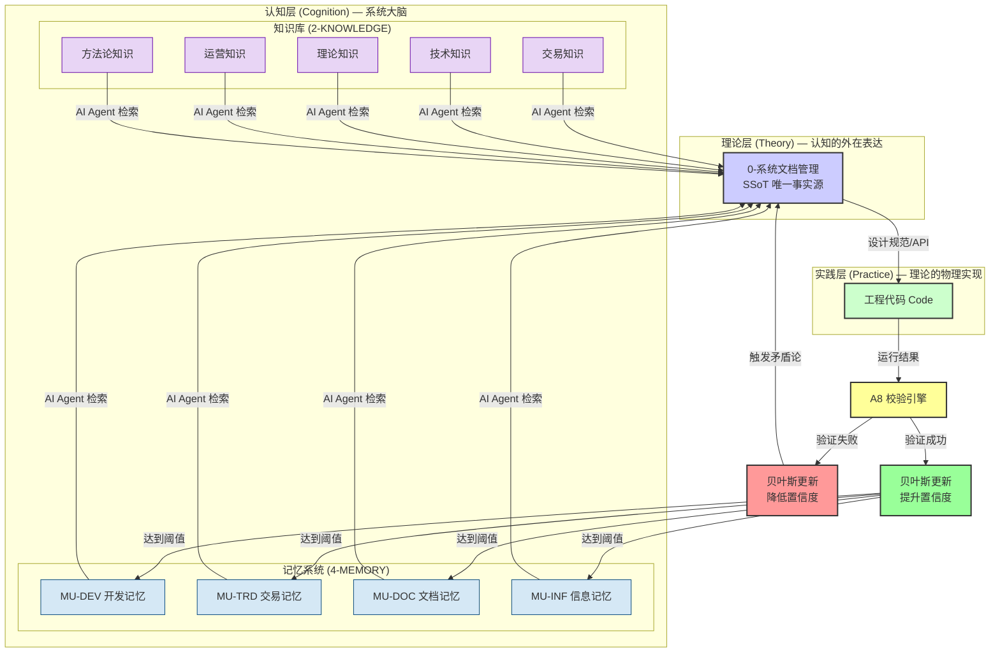
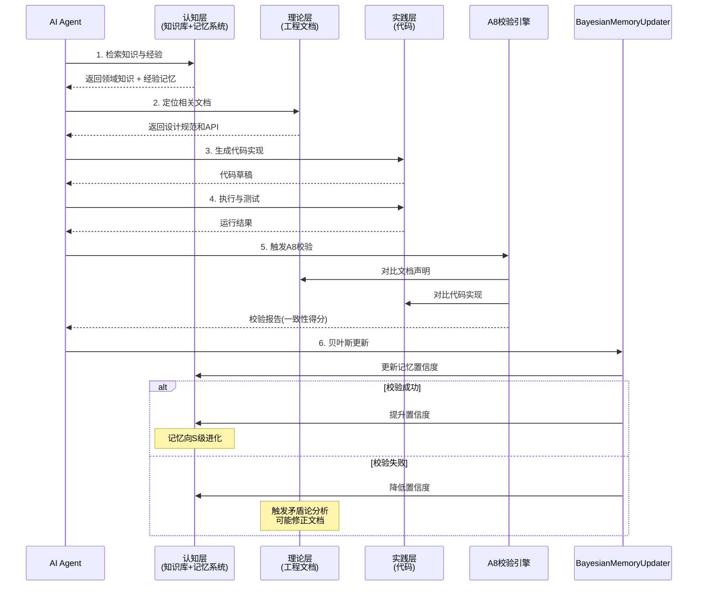

# 认知架构：认知-理论-实践闭环 (Cognitive Architecture)

> **版本**: v3.0
> **更新日期**: 2026-07-27
> **核心思想**: 借鉴认知科学（Cognitive Science）和贝叶斯大脑理论，将系统升级为一个具备自我优化能力的认知引擎。认知层 = 工作记忆（L0）+ 记忆系统（L1/L2）+ 知识库（2-KNOWLEDGE）
>
> **v3.0 变更**: 新增 L0 工作记忆层（WorkingMemoryManager），借鉴 Letta (MemGPT) 的 Core Memory 设计，为 AI Agent 提供显式的上下文管理机制。

---

## 1. 核心模型

本系统的开发与维护不再仅仅是"写代码"和"写文档"，而是一个完整的**认知过程（Cognitive Process）**。这个过程由三个核心层构成，形成一个螺旋上升的闭环：



### 1.1 认知层双体系

认知层由两个互补的子系统构成，类比人类大脑的**语义记忆（Semantic Memory）**和**程序记忆（Procedural Memory）**：

| 维度 | 知识库 (2-KNOWLEDGE) | 记忆系统 (4-MEMORY) |
|------|---------------------|---------------------|
| **认知科学映射** | 语义记忆（Semantic Memory） | 程序记忆（Procedural Memory）+ 情景记忆（Episodic Memory） |
| **存储内容** | "是什么" — 领域事实、概念、规则 | "为什么" + "怎么做" — 经验、原则、方法论 |
| **来源** | 领域知识整理、外部资料 | 实践验证、踩坑总结、A8校验 |
| **更新方式** | 人工维护 + AI辅助整理 | 贝叶斯自动更新（置信度升降） |
| **质量体系** | 按领域分级（TRADING/TECHNICAL/THEORY...） | 5级质量（S/A/B/C/D） |
| **生命周期** | 相对稳定，增量更新 | 动态流动，持续进化 |
| **典型内容** | 交易参数速查、数据源降级管道标准 | A1调研法（S级）、subprocess教训（B级） |

### 1.2 三层定位

*   **认知层 (Cognition)**: 系统的"大脑"，由 `2-KNOWLEDGE`（知识库）、`4-MEMORY`（记忆系统）和 `WorkingMemoryManager`（L0 工作记忆）共同组成。AI Agent 进行推理和决策的起点。
    *   `WorkingMemoryManager` (L0) 提供**工作台**：当前任务的核心状态、中间变量、上下文摘要。生命周期最短（单次任务），通过 Token 预算管理避免上下文溢出。
    *   `2-KNOWLEDGE` 提供**领域知识**：交易规则、技术标准、理论框架。
    *   `4-MEMORY` 提供**经验知识**：踩坑教训、最佳实践、方法论原则。
*   **理论层 (Theory)**: 认知的"外在表达"，即 `0-系统文档管理`。它将认知层中的抽象知识和经验转化为具体的、人类可读的设计规范、API文档和技术方案。这是从"想法"到"蓝图"的关键一步。
*   **实践层 (Practice)**: 理论的"物理实现"，即我们的源代码（Code）。代码的成功运行是检验"理论"（文档）是否正确、"认知"（知识+记忆）是否有效的唯一标准。

### 1.3 记忆三层架构 (v3.0 新增)

借鉴 Letta (MemGPT) 的分层记忆设计，我们的记忆系统从 v3.0 起采用三层架构：

| 层级 | 组件 | 生命周期 | 存储介质 | 核心职责 | 认知科学映射 |
|------|------|----------|----------|----------|-------------|
| **L0 工作记忆** | `WorkingMemoryManager` | 极短（单次任务） | 内存 + 检查点文件 | 当前任务的上下文管理、中间变量、Token 预算控制 | 工作记忆 (Working Memory) |
| **L1 应用记忆** | `AM-TRD/RSK/OPS/EXP` | 中等（子系统级） | JSON / SQLite | 特定领域的场景化经验、踩坑记录 | 情节记忆 (Episodic Memory) |
| **L2 总记忆** | `MU-DEV/TRD/DOC/INF` | 长期（全局通用） | Markdown + 贝叶斯JSON | 普适的原则、方法论、核心经验 | 语义记忆 (Semantic Memory) |

**记忆流动路径**:
```
L0 工作记忆 (任务执行中)
    ↓ distill_to_app_memory() — 任务结束后蒸馏下降
L1 应用记忆 (子系统级)
    ↓ DistillScheduler.run_once() — 质量达标后上升
L2 总记忆 (全局级)
    ↓ search() — AI Agent 检索激活
L0 工作记忆 (注入到当前任务上下文)
```

### 1.4 认知层内部协作

```
AI Agent 需要完成一个开发任务
    │
    ├── 0. 初始化工作记忆 (WorkingMemoryManager)
    │   "当前任务是什么？目标是什么？" → 创建 L0 工作记忆
    │
    ├── 1. 查知识库 (2-KNOWLEDGE)
    │   "数据源降级管道标准是什么？" → 知识库返回具体规范
    │
    ├── 2. 查记忆系统 (4-MEMORY L2)
    │   "做这类任务的最佳实践是什么？" → 记忆系统返回 A1调研法（S级）
    │   "之前有人踩过什么坑？" → 记忆系统返回 subprocess教训（B级）
    │
    ├── 3. 交叉验证
    │   知识库的"是什么" + 记忆系统的"怎么做" → 完整认知
    │   两者可能冲突 → 触发矛盾论分析
    │
    ├── 4. 写入工作记忆 (L0)
    │   将检索到的知识、经验、当前状态写入工作记忆的 context_block
    │   执行过程中的中间结果写入 scratch_block
    │
    └── 5. 任务结束 → 蒸馏
        工作记忆中的有效经验 → distill_to_app_memory() → L1 应用记忆
```

---

## 2. 核心机制：贝叶斯认知更新

为了让这个认知闭环具备科学的自我优化能力，我们引入**贝叶斯更新（Bayesian Update）**机制。每当代码被开发、运行或测试时，系统都会将这次"观察（Observation）"作为新的证据，更新相关记忆（Memory）的置信度（Confidence）。

### 2.1 贝叶斯定理应用

在我们的场景中，贝叶斯定理的表达为：

$$
P(\text{Memory}_{true} | \text{Observation}) = \frac{P(\text{Observation} | \text{Memory}_{true}) \times P(\text{Memory}_{true})}{P(\text{Observation})}
$$

*   **$P(\text{Memory}_{true})$ (先验置信度)**: 在验证前，我们认为某条记忆（如"A1调研法"）有效的概率。
    *   来源：基于记忆的来源和历史表现。例如，S级公理源的初始置信度为 0.95。
*   **$P(\text{Observation} | \text{Memory}_{true})$ (似然度)**: 假设记忆为真，我们观察到当前结果的概率。
*   **$P(\text{Observation})$ (证据概率)**: 无论记忆真假，观察到当前结果的总概率。这通常是一个归一化常数。
*   **$P(\text{Memory}_{true} | \text{Observation})$ (后验置信度)**: 在融入了新观察后，我们更新后的记忆置信度。这将成为下一次验证的先验。

### 2.1.1 🔬 RIGOROUS_v2 数学严谨升级（2026-07-29）

v1版的贝叶斯实现为工程近似（0.95/0.05固定似然度 + 0.8/0.2固定证据 + 经验衰减因子）。v2版严格化为三大数学机制：

| 组件 | v1 工程近似 | v2 严格贝叶斯 | 核心公式 |
|------|------------|--------------|---------|
| **似然度 $P(B\|A)$** | 固定三档 0.95 / 0.05 / 0.5 | **Beta-Binomial 共轭分布**，每次成功α+1、失败β+1 | $\hat{p}_{success} = \dfrac{\alpha}{\alpha+\beta}, \ \alpha,\beta \leftarrow \text{Beta伪计数}$ |
| **证据 $P(B)$** | 固定二档 0.8 / 0.2 | **全概率公式 (Law of Total Probability)** 展开 | $P(B) = P(B\|A)P(A) + P(B\|\neg A)P(\neg A), \ P(B_{success}\|\neg A)=\text{base\_rate}$ |
| **衰减/遗忘** | 质量等级硬编码档位 0.5/0.7/0.85/1.0 | **指数衰减遗忘因子**（基于记忆年龄 + 半衰周期） | $\text{ff} = \exp(-\ln 2 \cdot \text{age}/\text{half\_life}), \ \text{conf} = \text{ff}\cdot\text{post} + (1-\text{ff})\cdot 0.5$ |
| **向后兼容** | - | ✅ 旧JSON自动推导 `beta_alpha=1+verify, beta_beta=1+conflict, created_at=last_updated` | `schema_version: 2` 持久化标记 |

**半衰周期表（S级最稳定，D级最快过时）**：
```
HALF_LIFE_DAYS = {S:365, A:180, B:90, C:30, D:15}  # 天
```

**v2 与经典贝叶斯的严格等价性证明**：
1. 似然度：$\hat{p} = \alpha/(\alpha+\beta)$ 是 Beta($\alpha$,$\beta$) 分布的**期望**（无偏估计），α,β≥1 源于 Laplace 平滑（Beta(1,1)=均匀无信息先验）
2. 证据：严格 Law of Total Probability，取 $P(B|\neg A)=0.5$ 为最大熵 base_rate（无记忆指导时的随机基线）
3. 遗忘：指数衰减属**时序贝叶斯滤波**中的 leaky integrator，当样本年龄 > half_life×10 时，后验几乎完全回归 0.5（符合"久远证据不应影响当前判断"的统计直觉）

---

### 2.2 算法实现（v2 严格版）

我们在 `4-MEMORY/9-工具与接口/` 下实现一个 `BayesianMemoryUpdater` 类，用于在 A8 校验完成后自动计算置信度更新。

```python
class BayesianMemoryUpdater:
    # 半衰周期 (基于质量等级)
    HALF_LIFE_DAYS = {"S":365,"A":180,"B":90,"C":30,"D":15}
    _FORGET_LAMBDA = math.log(2)  # 保证 half_life → forget=0.5
    base_success_rate = 0.5       # P(成功|记忆为假) 的最大熵基线

    def update_confidence(self, memory_id, observation_success, followed_memory):
        entry = self.memories[memory_id]
        prior = clamp(entry.confidence, 1e-4, 1-1e-4)

        # ===== [1] Beta似然度 — 替代固定 0.95/0.05 =====
        if not followed_memory:
            lik_success, lik_used, do_update_beta = 0.5, 0.5, False
        else:
            lik_success = entry.beta_alpha / (entry.beta_alpha + entry.beta_beta)
            lik_used   = lik_success if observation_success else (1 - lik_success)
            do_update_beta = True

        # ===== [2] 全概率证据 — 替代固定 0.8/0.2 =====
        if observation_success:
            pBA, pBnotA = lik_success, self.base_success_rate
        else:
            pBA, pBnotA = 1-lik_success, 1-self.base_success_rate
        evidence = pBA * prior + pBnotA * (1 - prior)
        evidence = clamp(evidence, 1e-9, 1-1e-9)

        # ===== [3] 纯贝叶斯公式 (与教科书中完全等价) =====
        posterior = (lik_used * prior) / evidence

        # ===== [4] Beta 参数后验更新 =====
        if do_update_beta:
            if observation_success: entry.beta_alpha += 1
            else:                   entry.beta_beta  += 1

        # ===== [5] 指数遗忘 (基于年龄) =====
        age_s = now() - entry.created_at
        ff = math.exp(-self._FORGET_LAMBDA * age_s / (half_life_days*86400))
        posterior = ff * posterior + (1 - ff) * 0.5

        # ===== [6] 等级判定 (置信度 + 验证次数 双门槛) =====
        entry.confidence = clamp(posterior, 0, 1)
        entry.quality_level = _calc_quality(entry.confidence, entry.verify_count)
        return posterior, entry.quality_level
```

> **注**：v1 伪代码（0.95/0.8 固定档位）已从生产移除，存档于 git history（2026-07-29 前版本）。

### 2.3 证明算法与质量分级的对应

贝叶斯置信度与现有 `MEMORY_QUALITY.md` 的质量分级直接对应：

| 置信度区间 | 对应等级 | 贝叶斯更新行为 |
|-----------|---------|---------------|
| ≥ 0.95 | S 级（公理级） | 持续验证，极少降级 |
| 0.70 ~ 0.95 | A 级（可信级） | 验证成功自动上升，失败观察触发审查 |
| 0.40 ~ 0.70 | B 级（待验证） | 每次验证大幅改变置信度 |
| < 0.40 | C 级（假设级） | 需要大量验证才能上升 |
| 被证伪 | D 级（已证伪） | 连续失败观察后标记证伪 |

---

## 2.5 自动接入层 — IDE无关的自动触发（2026-07-29）

### 问题背景

认知系统的6步闭环（recall→理论→实践→A8→bayes→record）在设计上是完整的，但**缺少自动触发机制**：AI Agent（TRAE/Claude Code/Cursor）不会自动调用 `recall()` / `record()` / `verify()`，导致开发经验丢失。

### 三层架构

```
┌──────────────────────────────────────────────────────────┐
│              宿主层 (Host Adapter Layer)                  │
│   Claude Code Hooks  │  TRAE MCP Config  │  Cursor Rules │
└────────┬─────────────────────┬───────────────────────────┘
         │ stdin/stdout JSON   │ MCP protocol (stdio)
         ▼                     ▼
┌──────────────────────────────────────────────────────────┐
│              协议层 (Protocol Layer)                      │
│       CognitiveMCPServer (JSON-RPC over stdio)           │
│  Tools: recall / record / verify / stats / health        │
└────────┬─────────────────────────────────────────────────┘
         │ Python API
         ▼
┌──────────────────────────────────────────────────────────┐
│              触发层 (Trigger Layer)                       │
│  git post-commit hook  │  cognitive_daemon (文件监听)     │
│  自动: commit→提取经验→record→verify→bayes更新            │
└──────────────────────────────────────────────────────────┘
```

### 各层职责

| 层 | 核心文件 | 职责 | 通用性 |
|---|---|---|---|
| **触发层** | `cognitive_hook.py` | git post-commit hook自动提取commit经验→record→verify→bayes | ★★★★★ 任何IDE都走git |
| **协议层** | `cognitive_mcp_server.py` | 将认知系统封装为MCP server，5个标准tools，纯stdlib零依赖 | ★★★★★ 任何MCP客户端 |
| **宿主层** | `cognitive_install.py` | Claude Code hooks + TRAE MCP + 通用config 一键安装 | 按IDE适配 |

### 触发层工作流

```
git commit
  → extract_commit_info()     # 提取hash/message/files/diff stats
  → classify_change_type()     # 分类: feature/bugfix/refactor/docs/test
  → generate_experience()      # 生成结构化经验描述
  → CognitiveLoopEntry.record()  # 记录到L1应用记忆 (C级, conf=0.3)
  → CognitiveLoopEntry.verify()  # 触发贝叶斯更新 + 动态蒸馏
```

### MCP协议层暴露的5个Tools

| Tool | 方向 | 对应CognitiveLoopEntry方法 | 调用时机 |
|------|------|---------------------------|---------|
| `recall` | 读 | `recall(context, top_k, min_quality)` | 任务开始前 |
| `record` | 写 | `record(content, quality_level, tags, source)` | 发现新经验时 |
| `verify` | 写 | `verify(memory_id, success)` | A8校验/测试后 |
| `stats` | 读 | `stats()` | 监控/调试 |
| `health` | 读 | `healthcheck()` | 监控/调试 |

### 安装与配置

```bash
# 一键安装全部三层
python3 4-MEMORY/9-工具与接口/cognitive_install.py

# 仅安装触发层（git hook）
python3 cognitive_install.py --trigger

# 仅配置MCP协议层
python3 cognitive_install.py --mcp

# 仅配置Claude Code hooks
python3 cognitive_install.py --claude
```

### 设计原则

1. **git hooks是核心触发源**——任何IDE都走git，最通用
2. **MCP server零外部依赖**——纯Python标准库实现JSON-RPC，不需要安装mcp包
3. **Adapter Pattern**——不修改cognitive_loop_entry.py任何代码，只在外层包装
4. **渐进可用**——触发层独立工作（不依赖MCP），MCP层独立工作（不依赖hooks）
5. **静默失败**——git hook失败不阻塞git操作

### GitHub调研结论

调研了mem0(~25k★)、Letta/MemGPT(~14k★)、Zep(~3k★)、A-MEM(~1k★)、cognee(~2k★)等项目，**全部是被动服务/库**，没有现成的通用自动触发层。自动接入层是行业空白，必须自建。

---

## 3. 闭环工作流：一次完整的认知过程

当 AI Agent 执行一个开发任务时，它将经历以下完整的认知流程：



### 3.1 详细步骤说明

**Step 1: 认知检索 (Cognition -> Agent)**
- AI 同时从 `2-KNOWLEDGE`（知识库）和 `4-MEMORY`（记忆系统）检索信息
- 从**知识库**检索领域知识：如"数据源降级管道标准"、"交易参数速查"
- 从**记忆系统**检索经验知识：如 A1 调研法（S级）、subprocess教训（B级）

**Step 2: 理论定位 (Cognition -> Theory)**
- AI 根据认知层的指引，定位到 `0-系统文档管理` 中的相关工程文档（Theory）
- 读取 API_SPEC.md、设计文档、架构说明等

**Step 3: 实践设计 (Theory -> Practice)**
- AI 阅读工程文档，理解设计意图和接口规范
- 结合认知层的知识和经验，生成代码实现方案（Practice）

**Step 4: 代码执行 (Practice)**
- AI 编写代码，并运行测试用例

**Step 5: 观察产生 (Practice -> Cognition)**
- `A8 校验引擎` 介入，对比代码实现与文档规范，并运行测试
- 这产生了一次"观察"（Observation）
- 输出校验报告（包含一致性得分）

**Step 6: 贝叶斯更新 (Cognition)**
- `BayesianMemoryUpdater` 根据观察结果（成功/失败），使用贝叶斯定理更新相关记忆的置信度
- **成功路径**：记忆置信度提升，向 S 级（公理）进化
- **失败路径**：记忆置信度下降，触发"矛盾论"分析（分析失败的真正原因），可能导致对理论层（文档）的修正
- 知识库内容如需更新（如新增交易参数），则由人工维护

### 3.2 自动化脚本

整个闭环流程可通过 `auto_update_trigger.py` 自动化执行：

```bash
# 完整流程：A8校验 + 记忆同步 + 贝叶斯更新
python3 4-MEMORY/9-工具与接口/auto_update_trigger.py \
    /path/to/subsystem \
    --sync-memory \
    --bayes-update
```

**执行步骤**：
1. A8 校验：对比 API_SPEC.md 与代码实现
2. 生成更新建议：识别文档-代码不一致
3. 同步到记忆单元：更新 MU-CORE.md 状态
4. 贝叶斯更新：基于校验结果更新记忆置信度

### 3.3 记忆进化路径

通过持续的"认知-理论-实践-再认知"循环，记忆将沿以下路径进化：

```
C级（假设） → B级（待验证） → A级（可信） → S级（公理）
    ↑              ↑              ↑              ↑
  初始记忆      1次验证       3次验证        10次验证
```

**关键机制**：
- 每一次 A8 校验结果都会作为新的"观察"输入贝叶斯更新器
- 验证成功 → 置信度提升 → 等级上升
- 验证失败 → 置信度下降 → 等级下降或触发矛盾分析
- S 级记忆具有更高的稳定性（衰减因子 0.5），变化更缓慢

通过这个闭环，系统的知识（知识库+记忆）将通过每一次成功的实践（代码运行）得到强化，并在失败中得到修正，从而实现持续的自我优化和进化。

---

## 4. 认知三要素与流程沉淀（Process Layer）

> **新增**: 完整认知 = Knowledge（知识）+ Memory（记忆）+ Process（流程）
> Process = 元认知流程（Superpowers规范，总记忆层）+ 应用认知流程（Solution Paths，应用记忆层）

### 4.1 Superpowers 的定位

Superpowers 属于**标准规范**，是"建议注入"而非"强制约束"。
它将软件工程最佳实践（TDD、系统化调试、重构、审查）封装为 AI 可参考的流程模板。

**核心价值**：
- 不依赖复杂的提示词工程
- 将"应该怎么做"的经验沉淀为标准化流程
- AI 可以自由选择遵循或探索，系统会对比不同方案的有效性

### 4.2 双层流程架构（对齐总记忆/应用记忆）

```
┌────────────────────────────────────────────────────────────┐
│  Layer 1: 元认知流程（Meta-Cognition）= 总记忆层             │
│  = Superpowers 标准规范                                     │
│  = "应该怎么做"的通用软件工程最佳实践                        │
│  = 存储: 4-MEMORY/0-元记忆/process_templates.json          │
│  = 例如: TDD-001、DEBUG-001、REFACTOR-001、DESIGN-001      │
└────────────────────────────────────────────────────────────┘
                           │ 实例化
                           ▼
┌────────────────────────────────────────────────────────────┐
│  Layer 2: 应用认知流程（Applied Cognition）= 应用记忆层     │
│  = Solution Paths（解决路径）                               │
│  = "实际怎么做的"具体行动链                                 │
│  = 存储: 各应用记忆单元的 solution_paths/*.json             │
│  = 例如: "交易系统TDD实践"、"风控模块调试路径"               │
└────────────────────────────────────────────────────────────┘
```

### 4.3 元→应用映射与应用→元反馈

**TemplateMappingRegistry** 持久化追踪映射关系：

- **元→应用**: 一个元认知模板可产生多个应用实例（`parent_id → [applied_ids]`）
- **应用→元**: 应用实例的验证结果（success/fail）反哺元模板置信度
- **加权反馈**: 子实例越多，单次反馈权重越低（1/√N 平滑衰减）

### 4.4 会话闭环（Session Loop）

```
daemon 文件变更 → 新会话
  ├─ recall 注入（元+应用双层流程建议）
  ├─ 记录行动链（文件变更+工具调用+git操作）
  └─ git commit  →  会话结束
        ├─ 生成 Solution Path
        ├─ 事后校验（记忆+流程对比）
        ├─ 沉淀为应用认知流程（写入应用记忆单元）
        └─ 应用→元反馈（贝叶斯反哺元模板置信度）
```

### 4.5 核心代码

| 文件 | 职责 |
|------|------|
| `cognitive_superpowers.py` | 流程模板数据模型、双层注册表、映射注册表、检索、贝叶斯更新 |
| `cognitive_session.py` | 会话管理器、行动链记录、Solution Path生成、事后校验、应用流程沉淀 |
| `cognitive_daemon.py` | 文件变更监听，自动触发会话 |
| `cognitive_hook.py` | git commit 钩子，触发会话结束与接力验证 |

### 4.6 CLI 命令

```bash
# 列出所有流程模板
python3 cognitive_superpowers.py --list

# 仅列出元认知流程
python3 cognitive_superpowers.py --list-meta

# 仅列出应用认知流程
python3 cognitive_superpowers.py --list-applied

# 显示元→应用映射
python3 cognitive_superpowers.py --mapping

# 搜索相关流程
python3 cognitive_superpowers.py --search "调试 bug"

# 生成流程建议文本
python3 cognitive_superpowers.py --suggest "测试驱动开发"
```
