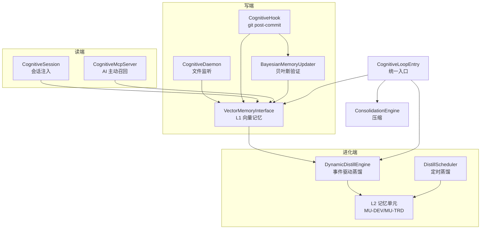

# 认知系统技术设计文档

> **版本**: v1.0 | **更新日期**: 2026-07-31
> **定位**: 认知系统（Cognitive System）子系统级技术设计，覆盖 daemon / git hook / session / MCP server 四组件
> **历史**: 初始版本，关闭 DD-018（认知系统无独立 TECHNICAL_DESIGN）
> **关联**: [MEMORY_INTERFACE_SPEC.md](../../6-应用记忆索引/MEMORY_INTERFACE_SPEC.md) · [MEMORY_QUALITY.md](../../0-元记忆/MEMORY_QUALITY.md) · [APP_MEMORY_REGISTRY.md](../../6-应用记忆索引/APP_MEMORY_REGISTRY.md)

---

## 1. 系统定位

### 1.1 核心使命

认知系统是 DreamBuddy-v2 的"经验沉淀与复用"引擎，目标是让系统**越用越聪明**：

- **写端**：自动捕获开发与交易过程中的决策经验，沉淀为结构化记忆
- **读端**：在 AI 开始新任务前，主动召回相关历史经验注入上下文
- **进化端**：通过贝叶斯验证与蒸馏，将低置信假设升级为可信经验

### 1.2 与记忆系统的关系

认知系统是 4-MEMORY 的执行层，不独立于记忆系统：

```
4-MEMORY（设计层）
├── 0-元记忆/        ← 质量标准、生命周期规范
├── 1~4-记忆单元/    ← L2 总记忆（蒸馏产物落地点）
├── 6-应用记忆索引/  ← AM 注册表、路由表、接口 SPEC
└── 9-工具与接口/    ← 认知系统（本文件，执行层）
```

### 1.3 设计原则

| 原则 | 说明 |
|------|------|
| 被动更新 | 应用记忆由各子系统主动维护，总记忆被动感知更新 |
| 质量分级 | 所有记忆标注 S/A/B/C/D 等级，低质量不蒸馏 |
| 贝叶斯验证 | 经验通过验证更新置信度，逐步升级或降级 |
| 闭环对称 | 开发闭环（dev↔memory）与交易闭环（trade↔memory）对称 |

---

## 2. 架构设计

### 2.1 四组件架构



### 2.2 闭环数据流

完整闭环包含五个阶段：

| 阶段 | 触发 | 组件 | 产出 |
|------|------|------|------|
| 1. 捕获 | 文件变更 / git commit | daemon / hook | L1 记忆（C 级） |
| 2. 注入 | 会话开始 / AI 主动 | session / mcp | 上下文记忆 |
| 3. 验证 | git commit 接力 / A8 校验 | hook / auto_update_trigger | 置信度更新 |
| 4. 蒸馏 | 质量升级到 B+ / 定时 | distill_engine / scheduler | L2 记忆 |
| 5. 压缩 | 容量≥80% | consolidation_engine | 压缩记忆 |

### 2.3 分层架构

| 层 | 组件 | 职责 |
|----|------|------|
| L1 存储层 | `vector_memory_interface.py` | SQLite + 哈希向量化语义检索 |
| L1 读写层 | `cognitive_loop_entry.py` | 统一 recall/record/verify/distill 接口 |
| L1 蒸馏层 | `dynamic_distill_engine.py` · `distill_scheduler.py` | L1→L2 蒸馏（事件驱动 + 定时） |
| L1 治理层 | `bayesian_memory_updater.py` · `consolidation_engine.py` · `memory_version_control.py` | 置信度更新、压缩、版本控制 |
| 触发层 | `cognitive_daemon.py` · `cognitive_hook.py` | 文件监听、git hook |
| 交互层 | `cognitive_session.py` · `cognitive_mcp_server.py` | 会话注入、MCP 工具暴露 |

---

## 3. 核心组件设计

### 3.1 CognitiveDaemon — 文件监听守护进程

**文件**: `cognitive_daemon.py` · **类**: `CognitiveDaemon`

| 属性 | 值 |
|------|-----|
| 监听范围 | 项目根目录（排除 `.git/`, `node_modules/`, `__pycache__/`, `.workbuddy/` 等） |
| 轮询间隔 | 5 秒（mtime 轮询） |
| 防抖窗口 | 10 秒（合并短时间多次变更） |
| 初始快照 | 启动时扫描全部文件 mtime 作为基线 |
| 记录策略 | 变更文件→`record(content, quality="C", confidence=0.1)` |
| 日志重定向 | `--log-file <path>`（默认 `<root>/logs/cognitive_daemon.log`），verbose 输出写入文件而非 stdout |

**噪声排除规则**（P1 修复 2026-08-01）：

daemon 在 `is_code_file()` 中维护两层排除集，防止自动产物污染 action_chain：

| 排除类型 | 规则 | 说明 |
|---------|------|------|
| `EXCLUDE_DIRS` | `.workbuddy`, `.git`, `node_modules`, `__pycache__`, `.venv`, `venv`, `dist`, `build`, `.pytest_cache` | 精确匹配路径任一部分，全目录排除 |
| `EXCLUDE_FILES` | `heartbeat.json`, `.*_time.json`, `.DS_Store`, `Thumbs.db`, `*.pyc`, `*.pyo` | 文件名模式匹配，任何位置都排除 |

> 体检发现 action_chain Top 噪声源为 `.workbuddy/memory_l4/guardian/heartbeat.json`（高频心跳）和 `.trade_time.json`（自动时间戳），P1 修复后这些文件不再触发 session 行动记录。

**日志重定向**（P2a 修复 2026-08-01）：

```python
# _TeeStream 同时写入文件和原始 stdout/stderr
class _TeeStream:
    def __init__(self, file_stream, orig_stream): ...
    def write(self, data):
        self._file.write(data); self._orig.write(data)

# --log-file CLI 参数 → _setup_log_redirect
def _setup_log_redirect(log_path, verbose):
    # 默认路径: <project_root>/logs/cognitive_daemon.log
    # verbose=False 时不重定向（保持 stdout）
    sys.stdout = _TeeStream(f, sys.stdout)
    sys.stderr = _TeeStream(f, sys.stderr)
```

**核心流程**：

```python
def run(self):
    snapshot = self._initial_snapshot()       # 初始 mtime 基线
    while not self._stop_event.is_set():
        changes = self._scan_changes(snapshot) # 检测 mtime 变更
        if changes:
            self._debounce(changes, 8s)        # 防抖合并
            self._flush_changes(changes)       # 通知 session + record
        sleep(5)

def _flush_changes(self, changes):
    # 1. 通知 session manager（行动链追踪）
    self.session_mgr.on_file_change(changes)
    # 2. 降噪过滤后 record 到 L1
    filtered = self._noise_filter(changes)
    for change in filtered:
        self.loop.record(content=..., quality="C", confidence=0.1, source="cognitive-daemon")
```

**已修复**（2026-07-31 P1-1）：daemon 不再 record 未 commit 变更到 L1，退化为会话追踪器（仅通知 session manager 记录行动链）。record 职责交给 git hook。详见 §6。

### 3.2 CognitiveHook — git hook 触发层

**文件**: `cognitive_hook.py` · **入口**: `--post-commit`

| 触发源 | 动作 |
|--------|------|
| `.git/hooks/post-commit` | commit 后提取 commit message → 分类 → record |
| 接力 verify | 对 daemon 近期记录执行 verify（success/fail） |
| 通知 session | 结束当前开发会话 |

**commit 分类**：

```python
def classify_commit(message: str) -> str:
    # feat → "feature", fix → "bugfix", refactor → "refactor"
    # docs → "documentation", test → "testing", 其他 → "misc"
```

**已修复**（2026-07-31 P1-3）：已移除 `.claude/settings.json` 的 PostToolUse hook（原在 Write|Edit 后调用 `--post-commit` 导致重复 record 同一 HEAD）。`.git/hooks/post-commit` 已覆盖 commit 事件。

### 3.3 CognitiveSession — 会话管理器

**文件**: `cognitive_session.py` · **类**: `CognitiveSessionManager`

| 职责 | 说明 |
|------|------|
| 会话生命周期 | 开始→活跃→结束 |
| 行动链追踪 | 记录会话内的文件变更序列 |
| 上下文注入 | 会话开始时 recall 相关记忆注入 AI 上下文 |
| 解决路径 | 会话结束后生成 SolutionPath（步骤序列） |
| 事后校验 | 通过 A8 引擎校验解决路径有效性 |

**会话注入流程**：

```python
def start_session(self, context: str):
    session = self._create_session(context)
    # recall 相关记忆
    recalled = self.loop.recall(context, top_k=5, min_quality="C")
    session.recalled_memory_ids = [m["memory_id"] for m in recalled]
    self._inject_recall(recalled)  # 注入 AI 上下文
    return session
```

**已修复**（2026-07-31）：注入阈值已从 `min_quality="B"` 降为 `"C"`，确保 recall 有结果返回。详见 §6。

**Suggestions 定时刷新**（P3 修复 2026-08-01）：

会话开始时 `_inject_recall` 生成 `suggestions.md`，但此前**从不刷新**——长会话（数百动作）中建议一直停留在最初内容。P3 引入 `SuggestionsRefresher`，集成到 `on_file_change` 中：

| 触发条件 | 阈值 | 说明 |
|---------|------|------|
| TTL 过期 | 15 分钟 | suggestions.md 的 mtime 距今 > 900s |
| 动作计数 | ≥ 5 个新动作 | 自上次刷新以来的 action_chain 增量 |

```python
# cognitive_session.py on_file_change 中的集成点
if len(sess.action_chain) % 5 == 0:
    refresher = self._refresher or SuggestionsRefresher()
    actions_since_last = len(sess.action_chain) - meta.get("actions_at_last_refresh", 0)
    refresher.refresh_if_needed(self, actions_since_last=actions_since_last)
```

**刷新行为**：
1. 调用 `manager._inject_recall(session, evolved=False)` 重写 suggestions.md
2. 在文件首行后插入 `🔄 刷新第 N 次 | <时间> | 触发: <原因>` 标记
3. 持久化 `suggestions_meta.json`（refresh_count / actions_at_last_refresh / last_refresh_ts）
4. NOOP 安全：不满足刷新条件时不修改任何文件

### 3.4 CognitiveMcpServer — MCP 工具服务

**文件**: `cognitive_mcp_server.py` · **协议**: stdio JSON-RPC

暴露给 AI 的 MCP 工具：

| 工具 | 入参 | 作用 |
|------|------|------|
| `recall` | `query, top_k=5, min_quality` | 召回相关记忆 |
| `record` | `content, quality_level, confidence, tags, source` | 记录新记忆 |
| `verify` | `memory_id, success` | 验证记忆（贝叶斯更新） |
| `stats` | — | 返回记忆统计 |
| `health` | — | 返回系统健康状态 |

**已知问题**：
- TRAE 下无 SessionStart hook，AI 不会自动 recall
- ~~recall 工具 schema default `min_quality="B"` 与代码 default `"C"` 不一致~~ **已修复**（2026-07-31）：schema 与代码统一为 `"C"`
- AI 调用记录：record 5 次，recall **0 次**

### 3.5 CognitiveLoopEntry — 统一入口

**文件**: `cognitive_loop_entry.py` · **类**: `CognitiveLoopEntry`

封装 L1 存储 + 蒸馏 + 压缩 + 版本控制的统一入口：

| 方法 | 对应规范接口 | 说明 |
|------|------------|------|
| `recall(context, top_k, min_quality)` | search 变体 | 按上下文语义检索 |
| `search(query, top_k, tags)` | search | 关键词搜索 |
| `record(content, ...)` | add 变体 | 记录记忆 |
| `verify(memory_id, success)` | 独有 | 验证+贝叶斯更新 |
| `upgrade(memory_id, new_quality, new_confidence)` | update 变体 | 手动升级 |
| `distill(memory_id, ...)` | 独有 | 手动蒸馏 |
| `stats()` | stats | 聚合三层统计 |
| `healthcheck()` | healthcheck | 聚合三层健康 |
| `consolidate(force)` | 独有 | 压缩 |
| `vc_commit/log/diff/rollback` | 独有 | 版本控制 |

**置信度→质量等级转换**（`_confidence_to_quality`）：

```python
def _confidence_to_quality(self, confidence, verify_count):
    if confidence >= 0.95 and verify_count >= 10: return "S"
    if confidence >= 0.70 and verify_count >= 3:  return "A"
    if confidence >= 0.40 and verify_count >= 1:  return "B"
    if confidence >= 0.20:                        return "C"
    return "D"
```

### 3.6 VectorMemoryInterface — L1 向量记忆存储

**文件**: `vector_memory_interface.py` · **类**: `VectorMemoryInterface`

| 属性 | 值 |
|------|-----|
| 存储引擎 | SQLite（`4-MEMORY/data/cognitive_memory.db`），支持 sqlite-vec 扩展（auto/numpy 回退） |
| 向量化 | 哈希向量化（SimHash 风格，无外部 embedding 依赖） |
| 检索方式 | 余弦相似度 + 关键词匹配融合 |
| 数据表 | `memories`（记忆主表）· `distill_stats`（蒸馏统计）· `vec_memories`（虚拟表，仅 sqlite_vec 引擎） |

**字段模型**：

| 字段 | 类型 | 说明 |
|------|------|------|
| `memory_id` | TEXT PK | 全局唯一 ID |
| `content` | TEXT | 记忆内容 |
| `quality_level` | TEXT | S/A/B/C/D |
| `confidence` | REAL | 置信度 |
| `verify_count` | INTEGER | 验证次数 |
| `tags` | TEXT (JSON) | 标签列表 |
| `memory_type` | TEXT | 记忆类型 |
| `source` | TEXT | 来源 |
| `vector` | BLOB | 哈希向量 |
| `created_at` / `updated_at` | TEXT | 时间戳 |

**vec0 扩展三层保护**（P4a 修复 2026-08-01）：

macOS 系统 Python 的 sqlite3 模块通常未编译 `enable_load_extension`，导致旧 DB 中的 `vec_memories` 虚拟表无法访问，抛 `no such module: vec0`。P4a 实现三层防御：

| 层次 | 机制 | 位置 | 效果 |
|------|------|------|------|
| 加载层 | `_try_sqlite_vec()` 检查 `hasattr(db, 'enable_load_extension')`，尝试 sqlite_vec.load() + pysqlite3 备用 | `_try_sqlite_vec()` | 不支持时干净返回 None，不抛异常 |
| 初始化层 | `_init_schema()` 用 `sqlite_master` 安全查询检测遗留 `vec_memories`，标记 `_has_legacy_vec_memories` | `_init_schema()` | 记录遗留状态，打印 warning |
| 访问层 | engine=numpy 时永不执行包含 `vec_memories` 的 SQL | `_search_numpy()` / `delete()` | 彻底避免 vec0 报错 |

**引擎选择**：`engine="auto"` → 尝试 sqlite_vec → 失败则 numpy fallback（正确性不受影响，仅性能差异）

**Solution Paths 重建**（P4b 修复 2026-08-01）：

P2b 清理后 SP 活跃目录归零。`rebuild_solution_paths_from_memories()` 从 memories 表按以下规则重建：

```
筛选: quality >= B AND verify_count >= 1 AND confidence >= 0.4
排序: S > A > B → verify_count 多 > 少 → confidence 高 > 低
限量: max_templates=30（避免目录过大）
输出: APP-<memory_id>.json（含 rebuilt_from_memory_id + rebuild_version 标记）
```

> 真实数据：从 252 条 memories 中筛选出 10 条（1S + 5A + 4B），写入 10 个 APP-*.json，B+ 占比 100%。

### 3.7 DynamicDistillEngine — 事件驱动蒸馏

**文件**: `dynamic_distill_engine.py` · **类**: `DynamicDistillEngine`

| 配置 | 值 | 位置 |
|------|-----|------|
| `MIN_DISTILL_QUALITY` | `"B"` | 第 144 行 |
| `QUALITY_ORDER` | `S:4, A:3, B:2, C:1, D:0` | 第 141 行 |
| 蒸馏冷却 | 默认 1 小时 | 防止重复蒸馏 |

**触发入口**：

| 事件 | 方法 | 触发条件 |
|------|------|---------|
| 置信度变更 | `on_confidence_changed()` | 质量等级提升且 ≥ B |
| A8 校验通过 | `on_a8_verified()` | A8 校验标记成功 |
| 手动触发 | `manual_distill()` | 显式调用 |

**蒸馏判断**（`_should_distill`）：
1. 质量等级 ≥ B（`MIN_DISTILL_QUALITY`）
2. 质量升级可突破冷却期
3. 同级需置信度提升 ≥ 0.05
4. 路由映射存在（`MEMORY_ROUTING`）

**蒸馏执行**（`_execute_distill`）：
1. 路由到对应总记忆单元（MU-xxx）
2. 通过 `BayesianMemoryUpdater` 写入 L2
3. 持久化统计到 SQLite（`_persist_stats`）

### 3.8 DistillScheduler — 定时蒸馏调度器

**文件**: `distill_scheduler.py` · **类**: `DistillScheduler`

| 配置 | 值 |
|------|-----|
| 调度间隔 | 3600 秒（1 小时） |
| 质量阈值 | `S: {10 verifies, 0.95}, A: {3, 0.70}, B: {1, 0.40}` |

**流程**：

```python
def run_daemon(self):
    while not self._stop:
        self.run_once()    # 遍历所有 AM 执行蒸馏
        sleep(3600)

def run_once(self):
    for am_id in self.registered_ams:
        interface = self._load_am_interface(am_id)  # importlib 动态加载
        candidates = interface.distill_candidates(min_quality="B")
        for candidate in candidates:
            self.distill_to_global(candidate, am_id)
```

### 3.9 BayesianMemoryUpdater — 贝叶斯置信度更新

**文件**: `bayesian_memory_updater.py` · **类**: `BayesianMemoryUpdater`

| 配置 | 值 | 位置 |
|------|-----|------|
| `QUALITY_THRESHOLDS` | `S:0.95, A:0.70, B:0.40, C:0.00` | 第 92-97 行 |
| `VERIFY_THRESHOLDS` | `S:10, A:3, B:1, C:0` | 第 98-103 行 |
| `HALF_LIFE_DAYS` | `S:365, A:180, B:90, C:30, D:15` | 第 107-113 行 |
| 验证成功 | confidence +0.1 | cognitive_loop_entry.py 第 222 行 |
| 验证失败 | confidence -0.15 | cognitive_loop_entry.py 第 225 行 |

**贝叶斯更新公式**：

```python
# 后验 = 先验 × 似然 / 边缘概率
# 简化为增量更新：
def update(self, memory_id, success: bool):
    memory = self.get(memory_id)
    if success:
        memory.confidence = min(1.0, memory.confidence + 0.1)
    else:
        memory.confidence = max(0.0, memory.confidence - 0.15)
    memory.verify_count += 1
    # 指数遗忘衰减
    memory.confidence *= self._decay_factor(memory.last_verified, memory.quality_level)
    # 重算质量等级
    memory.quality_level = self._confidence_to_quality(memory.confidence, memory.verify_count)
```

### 3.10 ConsolidationEngine — 压缩引擎

**文件**: `consolidation_engine.py` · **类**: `ConsolidationEngine`

| 触发条件 | 动作 |
|---------|------|
| Tier0/1 容量 ≥ 80% | 自动压缩低价值记忆 |
| `consolidate(force=True)` | 强制压缩 |

**压缩策略**：
- 同主题记忆合并（保留最高质量版本）
- 低质量（D 级）记忆归档
- 保留 `compressed_content` 完整内容（不做激进截断）

**历史 C 级噪声清理**（P2b 修复 2026-08-01）：

`cleanup_legacy_c_noise()` 清理 P1 降噪修复之前 daemon 注入的 C 级低置信度噪声记忆：

| 通道 | 匹配条件 | 操作 | 可逆性 |
|------|---------|------|--------|
| SQLite | `source='cognitive-daemon' AND quality_level='C' AND verify_count=0 AND confidence<=0.2` | `UPDATE SET quality_level='archived'`（保留记录可审计，不再被 min_quality=C 召回） | 1 条 SQL 回滚 |
| solution_paths | `quality_level IN ('C', 'quarantined')` | `shutil.move` 到 `_archived/` 子目录 | `mv _archived/*.json ./` |

> 真实数据：SQLite 187 条 → archived；solution_paths 47 个（46C + 1Q）→ `_archived/`。零误伤（B+ 级全部保留）。
> 默认 `dry_run=True`（仅统计不修改），确认后设 `dry_run=False` 执行。

### 3.11 其他组件

| 组件 | 文件 | 职责 |
|------|------|------|
| `MemoryVersionControl` | `memory_version_control.py` | MemOS 风格版本控制（commit/log/diff/rollback） |
| `WorkingMemoryManager` | `working_memory_manager.py` | 工作记忆（短期会话级） |
| `AutoUpdateTrigger` | `auto_update_trigger.py` | A8 校验 + 文档同步 + 贝叶斯更新触发 |
| `A8CheckEngine` | `a8_check_engine.py` | A8 理论实践校验引擎 |
| `CognitiveSuperpowers` | `cognitive_superpowers.py` | 过程模板（Claude Code superpowers 集成） |
| `CognitiveInstall` | `cognitive_install.py` | 安装脚本（hook 注册、launchd 配置） |

---

## 4. 数据模型

### 4.1 三层记忆架构

| 层 | 存储 | 内容 | 生命周期 |
|----|------|------|---------|
| L0 | `CORE.md` | 核心记忆（≤8000 字符），会话自动注入 | 永久 |
| L1 | `cognitive_memory.db` | 向量记忆（原始经验） | 蒸馏后归档 |
| L2 | `MU-xxx/bayesian_memories.json` | 蒸馏产物（贝叶斯验证后） | 长期 |

### 4.2 L1→L2 蒸馏路由

| 来源应用记忆 | 蒸馏目标 | 说明 |
|------------|---------|------|
| AM-TRD-001 | MU-TRD | 交易经验→交易记忆单元 |
| AM-RSK-001 | MU-TRD | 风控经验→交易记忆单元 |
| AM-OPS-001 | MU-DEV | 运维经验→开发记忆单元 |
| AM-EXP-001 | MU-TRD | 实验经验→交易记忆单元 |

### 4.3 质量流转

```
add(C级,conf=0.0) → verify(success)×N → conf≥0.40,verify≥1 → B级
                                              ↓
                                    distill_candidates(min=B)
                                              ↓
                                    蒸馏到 L2 (MU-xxx)
                                              ↓
                                    verify(success)×3 → A级
                                              ↓
                                    verify(success)×10 + 3个月 → S级
```

---

## 5. 部署与运维

### 5.1 启动方式

```bash
# 方式 1: launchd 自启（推荐，当前未加载）
launchctl load 4-MEMORY/9-工具与接口/com.dreambuddy.cognitive-daemon.plist

# 方式 2: 手动启动（推荐，带日志重定向）
cd 4-MEMORY/9-工具与接口
python3 cognitive_daemon.py \
    --watch /Users/zhangjiangtao/WorkBuddy/dreambuddy-v2 \
    --interval 5 --verbose \
    --log-file logs/cognitive_daemon.log

# 方式 3: 统一启动脚本
bash 4-MEMORY/9-工具与接口/start_all_services.sh
```

### 5.2 配置文件

| 配置 | 路径 | 说明 |
|------|------|------|
| 认知配置 | `.cognitive/config.json` | trigger/protocol/host 三层配置 |
| launchd | `com.dreambuddy.cognitive-daemon.plist` | RunAtLoad + KeepAlive |
| PID | `.cognitive_daemon.pid` | 守护进程存活标识 |
| 日志 | `<root>/logs/cognitive_daemon.log` | daemon 运行日志（P2a：--log-file 重定向，TeeStream 同时写文件和 stdout） |
| 蒸馏日志 | `4-MEMORY/9-工具与接口/distill_logs/` | 蒸馏事件 jsonl |
| 噪声归档 | `solution_paths/_archived/` | P2b 归档的 C 级/quarantined 模板（可移回恢复） |
| 刷新元数据 | `.cognitive/sessions/<id>/suggestions_meta.json` | P3 Suggestions 刷新计数与时间戳 |

### 5.3 CLI 工具

```bash
# 统一入口 CLI
python cognitive_loop_entry.py recall --context "查询上下文"
python cognitive_loop_entry.py record --content "记忆内容" --quality C
python cognitive_loop_entry.py verify --memory-id <id> --success
python cognitive_loop_entry.py distill --memory-id <id>
python cognitive_loop_entry.py stats
python cognitive_loop_entry.py healthcheck

# 蒸馏调度器
python distill_scheduler.py run-once    # 执行一次
python distill_scheduler.py daemon      # 守护进程模式

# MCP server
python cognitive_mcp_server.py           # stdio JSON-RPC
python cognitive_mcp_server.py --recall-context "上下文"
```

---

## 6. 已知问题与改进路线

### 6.1 闭环断点诊断

当前认知系统"在运转但未起作用"，核心原因是**读端完全断裂**：

```
daemon record(噪声,C级) → L1(98.6%噪声)
                                    ↓ recall 阈值=B
git hook(极少触发) → record(B/C级) → recall 返回空(B级<1.4%)
                                    ↓ TRAE 无 SessionStart
session 注入(min=B) → 返回空 → AI 上下文无记忆
                                    ↓ AI 不主动调用
MCP recall(0次) → 闭环断裂 → 蒸馏跳过(C级不达标) → L2 仅34条全C级
```

### 6.2 根因清单

| 优先级 | 根因 | 代码位置 | 影响 | 状态 |
|--------|------|---------|------|------|
| **P0** | TRAE 下完全缺失 SessionStart 注入 | `.trae/mcp.json`（无 hooks 段） | AI 每次开会话"失忆" | 🟡 代码就绪，待用户手动添加 hooks 配置 |
| **P0** | AI 从不主动调用 MCP recall | `cognitive_mcp_server.py` 第 58-82 行 | 记忆只写不读 | ✅ 已修复（CLAUDE.md 硬约束 + MCP 工具描述强化） |
| **P1** | daemon 灌入 ~2088 条噪声 | `cognitive_daemon.py` 第 533-539 行（conf=0.1） | L1 被 98.4% 噪声淹没 | ✅ 已修复（daemon 退化为会话追踪器，不再 record 未 commit 变更） |
| **P1** | recall 阈值过严 | `cognitive_session.py` 第 463 行 / `cognitive_mcp_server.py` 第 388 行（min=B） | recall 永远返回空 | ✅ 已修复（B→C + 空上下文退化） |
| **P1** | PostToolUse 重复 record | `.claude/settings.json` 第 11-21 行 | 同一 commit 反复 record | ✅ 已修复（移除 PostToolUse hook，git hook 已覆盖 commit） |
| **P1** | action_chain 噪声文件（heartbeat/.trade_time/.workbuddy） | `cognitive_daemon.py` `EXCLUDE_DIRS`/`EXCLUDE_FILES` | action_chain 被高频自动产物污染 | ✅ 已修复（P1 噪声排除规则，2026-08-01） |
| **P2** | 贝叶斯升级路径过窄 | `cognitive_loop_entry.py` 第 222-225 行 | daemon 记录永久 C 级 | 待修复 |
| **P2** | launchd 未加载 | `com.dreambuddy.cognitive-daemon.plist` | 重启后停摆 | 待修复 |
| **P2a** | daemon verbose 输出污染 stdout | `cognitive_daemon.py` | 日志不可观测 | ✅ 已修复（--log-file + _TeeStream 重定向，2026-08-01） |
| **P2b** | 历史 187 条 C 级噪声记忆 + 47 个 C 级 SP 模板 | SQLite memories 表 / solution_paths/ | 记忆库信噪比低（81% 噪声） | ✅ 已修复（cleanup_legacy_c_noise：archived + _archived/，可逆，2026-08-01） |
| **P3** | MCP recall schema 默认值不一致 | `cognitive_mcp_server.py` 第 77 行 vs 第 183 行 | 误导调用方 | ✅ 已修复（统一为 "C"） |
| **P3** | suggestions.md 从不刷新 | `cognitive_session.py` `on_file_change` | 长会话建议过期 | ✅ 已修复（SuggestionsRefresher TTL+动作数双触发，2026-08-01） |
| **P4a** | SQLite vec0 模块缺失报错 | `vector_memory_interface.py` `_init_schema` | search() 抛 no such module: vec0 | ✅ 已修复（三层保护 + numpy fallback，2026-08-01） |
| **P4b** | SP 活跃目录清零（P2b 清理后） | `solution_paths/` | recall 无高价值 SP 模板可匹配 | ✅ 已修复（rebuild_solution_paths_from_memories 重建 10 条 B+，2026-08-01） |

### 6.3 改进路线（按优先级）

**P0 — 打通读端（最高收益）**：

1. ✅ **TRAE SessionStart 注入**（代码就绪）：`cognitive_mcp_server.py --recall-context` 已支持空上下文退化（检索最近更新记忆）+ 阈值降为 C。**待用户手动操作**：在 `.trae/mcp.json` 添加 `hooks.SessionStart` 配置（AI 无权限修改此受保护文件），配置内容见 §6.5。同时 CLAUDE.md 已强化硬约束作为兜底。
2. ✅ **强制 AI 主动 recall**：CLAUDE.md 全部 recall 示例 `min_quality` 改为 `"C"`，措辞升级为"硬约束·不可跳过"；MCP recall 工具 description 同步强化。
3. ✅ **recall 阈值降级**：`cognitive_session.py` 第 463 行、`cognitive_mcp_server.py` schema default 和 `--recall-context` 分支的 `min_quality` 全部从 `"B"` 降为 `"C"`。验证：空上下文 recall 成功返回 5 条记忆（含 S/A/B/C 级）。

**P1 — 治理写端噪声**：

4. ✅ **daemon 降噪**：`cognitive_daemon.py` `_flush_changes` 移除 `trigger_change_record` 调用，保留 session manager 通知。daemon 退化为会话追踪器，record 职责交给 git hook（commit 时一次性记录有语义的经验）。`trigger_change_record` 函数保留供 `--scan-once` CLI 测试。
5. ✅ **移除 PostToolUse hook**：删除 `.claude/settings.json` 的 `PostToolUse` 配置（原在 Write|Edit 后调用 `--post-commit`，但无新 commit 导致重复 record 同一 HEAD）。`.git/hooks/post-commit` 已覆盖 commit 事件。
6. ✅ **action_chain 噪声排除**（P1 2026-08-01）：`EXCLUDE_DIRS` 添加 `.workbuddy`；`EXCLUDE_FILES` 添加 `heartbeat.json`、`.*_time.json`。体检 Top 噪声源全部消除。

**P2 — 闭合贝叶斯循环与噪声清理**：

7. ✅ **daemon 日志重定向**（P2a 2026-08-01）：`--log-file` CLI 参数 + `_TeeStream` 双写（文件+stdout）+ `_default_log_path()` 默认路径 `<root>/logs/cognitive_daemon.log`。verbose 输出不再污染 stdout。
8. ✅ **历史 C 级噪声清理**（P2b 2026-08-01）：`cleanup_legacy_c_noise()` 双通道清理（SQLite 187 条 → archived；SP 47 个 → `_archived/`），默认 dry_run=True，零误伤，可逆。
9. **加宽升级路径**：提高 daemon 接力 verify 的置信度增益，或降低 B 级门槛。 ← 待修复
10. **加载 launchd**：`launchctl load` plist 文件，日志路径改为项目内 `logs/` 持久化。 ← 待修复

**P3 — Suggestions 动态刷新**：

11. ✅ **SuggestionsRefresher 双触发**（P3 2026-08-01）：TTL(15min) OR 动作数(≥5) 任一触发即刷新 suggestions.md。集成到 `cognitive_session.py` `on_file_change`（每 5 个动作检查一次）。刷新计数持久化到 `suggestions_meta.json`。

**P4 — SQLite 兼容性与 SP 重建**：

12. ✅ **vec0 三层保护**（P4a 2026-08-01）：加载层(`_try_sqlite_vec` + pysqlite3 备用) → 初始化层(`sqlite_master` 安全检测遗留 vec_memories) → 访问层(numpy 引擎永不访问虚拟表)。彻底消除 `no such module: vec0` 报错。
13. ✅ **SP 活跃目录重建**（P4b 2026-08-01）：`rebuild_solution_paths_from_memories()` 从 memories 表按 B+/verify≥1/conf≥0.4 筛选 → 排序 → 写入 APP-*.json。真实数据：0→10 条（1S+5A+4B）。

### 6.5 TRAE SessionStart hooks 配置（需用户手动添加）

`.trae/mcp.json` 为受保护文件，AI 无权限修改。用户需手动添加以下 `hooks` 段：

```json
{
  "mcpServers": { ... },
  "hooks": {
    "SessionStart": [
      {
        "hooks": [
          {
            "type": "command",
            "command": "python3 \"/Users/zhangjiangtao/WorkBuddy/dreambuddy-v2/4-MEMORY/9-工具与接口/cognitive_mcp_server.py\" --recall-context \"\" 2>/dev/null || true"
          }
        ]
      }
    ]
  }
}
```

> 若 TRAE 不支持 hooks 格式，CLAUDE.md 的硬约束已作为兜底（强制 AI 主动调用 recall 工具）。

### 6.4 接口对齐

认知系统 `VectorMemoryInterface` 需对齐 [MEMORY_INTERFACE_SPEC.md](../../6-应用记忆索引/MEMORY_INTERFACE_SPEC.md)：

| 待对齐项 | 当前 | 目标 |
|---------|------|------|
| `update_quality` | 仅更新质量 | 重命名为 `update`，支持通用字段 |
| `search_similar` | 命名差异 | 重命名为 `search_similar_cases` |
| `distill_candidates` | 缺失 | 补充实现 |
| `run_distill_from_review` | 缺失 | 补充实现 |
| `search` 参数 | 分散参数 | 统一为 `filters: Dict` |
| `add` 入参 | 展开参数 | 统一为 `memory_entry: Dict` |

### 6.6 交易认知流程重构（T 系列 + 交易产物沉淀）

将原 A 系列 10 个 Skill 重构为 6 个通用 T 系列 Skill（T0-T5），并实现交易执行产物的独立沉淀与贝叶斯升降级。

**P0 — 边界修复**：

14. ✅ **task_type 路由修复**（P0 2026-08-05）：`cognitive_session.py` 的 `EVOLVE_CATEGORY_GROUPS` 补充 4 个交易细粒度 task_type（`strategy-research`/`strategy-backtest`/`strategy-execution`/`strategy-governance`），全部归入 `trading` 大类。交易文件变更（如 `experiments/ab-trading/`）正确识别为交易类而非开发类。

**P1 — T 系列 SKILL 编写**：

15. ✅ **双源 SkillLoader**（P1 2026-08-05）：`cognitive_superpowers.py` 新增 `TRADING_SKILLS_ROOT`、`_load_trading_skills()`，从 `4-MEMORY/0-元记忆/trading-cognition/skills/` 加载 6 个 T 系列 Skill。`retrieve()` 按 `task_type` 路由：交易类召回 T 系列，开发类召回原 14 个开发 Skill。
16. ✅ **T0-T5 Skill 定义**（P1 2026-08-05）：
    - T0 市场认知（合并 A0+A1+A2）：7 维矛盾分析 + 创伤检测
    - T1 战略合成（精简自 A3）：三情景推演 + 历史模式匹配
    - T2 交易执行（合并 A4+A5+A9）：验证→执行→离场三阶段
    - T3 风控门禁（精简自 A7+A4）：事前门禁 + 事中熔断 + 事后归因
    - T4 情报雷达（精简自 A6）：三屏 MA 趋势 + 宏观共振 + 分级响应
    - T5 元认知复盘（精简自 A8）：纸上谈兵检测 + 四步复盘闭环

**P2 — 交易执行产物沉淀**：

17. ✅ **APP-TRD-*.json 产物沉淀**（P2-a 2026-08-05）：`cognitive_session.py` `_deposit_applied_template` 为交易类 task_type 生成 `APP-TRD-` 前缀的 applied_id（区别于开发类 `APP-`）。`cognitive_superpowers.py` `resolve_unit_for_task` 将 8 个交易 task_type 路由到 `MU-TRD`（交易记忆单元），确保交易产物沉淀到 `2-交易记忆单元/solution_paths/`。
18. ✅ **path_advantage 用 P&L/夏普做客观贝叶斯升级**（P2-b 2026-08-05）：`cognitive_superpowers.py` 新增 `update_path_advantage_from_trading()`，基于交易客观指标计算 path_advantage：

    ```
    pnl_score    = clip(pnl_pct / 10.0, -1, 1)         # ±10% P&L 即满分
    sharpe_score = clip(sharpe_ratio / 2.0, -1, 1)      # ±2.0 夏普即满分
    dd_score     = clip((15.0 - max_drawdown_pct) / 15.0, -1, 1)  # ≤15%回撤为正
    win_score    = clip((win_rate - 0.5) / 0.3, -1, 1)  # 50%胜率为中性

    path_advantage = pnl_score*0.4 + sharpe_score*0.3 + dd_score*0.2 + win_score*0.1
    ```

    升降级规则复用 `update_path_advantage`（≥0.2 正向，≤-0.2 负向）：连续 2 次正向 C→B，连续 4 次正向 B→A，连续 3 次负向→quarantined。客观指标存入 `metadata["outcome_metrics"]` 供追溯。

    **调用方**：交易系统在每笔交易平仓后，用实际 P&L/夏普/回撤/胜率调用此方法，驱动交易策略模板的贝叶斯升降级——优于开发类的主观 path_advantage 评分。

**P3 — 反向召回接入（A 系列 Cron 执行前注入认知召回）**：

19. ✅ **trading_recall() 编程式召回 API**（P3-a 2026-08-05）：`cognitive_loop_entry.py` 新增模块级函数 `trading_recall(context, task_type, top_k_mem, top_meta, top_applied)`，封装 memories + processes/meta + processes/applied 三段召回，与 MCP recall 工具返回格式一致。设计原则：**建议而非约束**（召回结果不阻断交易决策）、**失败安全**（认知系统不可用时返回 `ok=False` 空结果，不抛异常）、**边界清晰**（认知系统提供 API，交易系统调用，无反向依赖）。

20. ✅ **A 系列 Cron 执行前注入**（P3-a 2026-08-05）：`polling_trader.py` 在 A7 门禁检查前注入认知召回：
    - `__init__` 新增认知召回桥接初始化（动态 import `trading_recall`，路径 `4-MEMORY/9-工具与接口`）
    - `_inject_cognitive_recall(coin, inference)` 方法：从 inference 提取关键字段（币种/方向/置信度/卦象/震荡/波动率/矛盾预警）组装上下文，调用 `trading_recall(task_type="strategy-execution")`，结果写入 `inference["cognitive_recall"]`
    - `_summarize_cognitive_recall(inference)` 静态方法：提取召回摘要（mem_count + meta_skills + applied_count），写入开仓事件存档供平仓后 L4 回溯

    **注入点**：`run_once()` 第一阶段循环中，A7 门禁检查前（L2557）。认知召回作为**上下文增强**注入 inference，A7 门禁可选读取但不强制——保持门禁职责单一。

    **数据流**：
    ```
    polling_trader.run_once()
      → _fetch_and_infer(coin)  → inference dict
      → _inject_cognitive_recall(coin, inference)  → inference["cognitive_recall"]
      → A7 门禁检查（可选读取 cognitive_recall）
      → _execute_trade(inference)
        → _record_opening_event(inference)  → event["cognitive_recall"] 摘要存档
    ```

---

## 7. 测试体系

| 测试文件 | 测试内容 |
|---------|---------|
| `test_cognitive_daemon.py` | daemon 文件监听、防抖、噪声排除(P1)、日志重定向(P2a) — 9 tests |
| `tests/test_p2b_memory_cleanup.py` | 历史 C 级噪声清理(P2b)：SQLite 边界、SP 边界、dry_run 安全 — 3 tests |
| `tests/test_p3_suggestions_refresh.py` | Suggestions 刷新(P3)：TTL 过期、动作阈值、NOOP 安全、刷新标记 — 5 tests |
| `tests/test_p4_vec0_and_sp_rebuild.py` | vec0 保护(P4a) + SP 重建(P4b)：引擎选择、质量过滤、噪声跳过 — 4 tests |
| `test_cognitive_session.py` | 会话生命周期与注入 |
| `test_cognitive_superpowers.py` | 过程模板 + T 系列双源加载(P1) + 交易 task_type 路由(P2) + path_advantage 交易客观指标(P2) + trading_recall 编程式 API(P3) + 认知召回摘要(P3) — 16 tests |
| `test_relay_verify.py` | git hook 接力验证 |
| `test_rigorous_bayesian.py` | 贝叶斯更新严格性 |
| `test_auto_access.py` | MCP 协议层自动访问（initialize/tools/list/tools/call recall/record/stats）— 12 tests，mock 修复对齐 _get_cle 单例 |
| `stress_test_cognitive_noise_filter.py` | 噪声过滤压力测试 |

> **TDD 覆盖**：P1~P4 共 21 项测试全部通过（2026-08-01 验证）；交易认知流程 P0~P3 共 13 项测试通过 + test_auto_access mock 修复 3 项，全量 148/148（2026-08-05 验证）。

---

## 8. 变更记录

| 日期 | 版本 | 变更 |
|------|------|------|
| 2026-07-31 | v1.0 | 初始版本，关闭 DD-018；覆盖四组件架构、闭环数据流、核心算法、数据模型、已知问题诊断与改进路线 |
| 2026-07-31 | v1.1 | 实施 P0-2 + P1-2 + P3 修复：recall 阈值 B→C、CLAUDE.md 硬约束强化、MCP 工具描述强化、空上下文退化逻辑、schema 默认值统一；P0-1 代码就绪待用户配置 hooks |
| 2026-08-01 | v1.2 | P1 噪声排除（.workbuddy/heartbeat/.*_time.json）+ P2a 日志重定向（--log-file + _TeeStream）+ P2b 历史 C 级清理（187 SQL archived + 47 SP → _archived/）+ P3 SuggestionsRefresher 双触发（TTL 15min + 动作≥5）+ P4a vec0 三层保护 + P4b SP 重建（10 条 B+）+ TDD 21/21 |
| 2026-08-05 | v1.3 | §6.6 交易认知流程重构：P0 边界修复（4 个交易 task_type 归 trading 大类）+ P1 T 系列双源 SkillLoader（6 个 T0-T5 Skill，按 task_type 路由）+ P2 交易产物沉淀（APP-TRD- 前缀 + MU-TRD 路由 + update_path_advantage_from_trading 用 P&L/夏普/回撤/胜率做客观贝叶斯升降级）+ TDD 5/5 P2 测试通过，全量 141/144（3 个 test_auto_access 既有失败非本次引入） |
| 2026-08-05 | v1.4 | §6.6 P3 反向召回接入：trading_recall() 编程式 API（memories+meta+applied 三段，失败安全）+ polling_trader A7 门禁前注入认知召回（_inject_cognitive_recall + _summarize_cognitive_recall 开仓事件存档）+ TDD 4/4 P3 测试通过，全量 145/148 |
| 2026-08-05 | v1.5 | 修复 test_auto_access.py 3 个历史失败（根因：mock CognitiveLoopEntry 类未拦截 _get_cle 单例；修复：改 patch _get_cle 函数 + stats 断言对齐真实嵌套结构 stats["memory"]["total"]）+ cognitive_daemon 重启（PID 6039，加载 P3 代码）+ 全量 148/148 零失败 |
| 2026-08-05 | v1.6 | [COGNITIVE_ARCHITECTURE.md](../../0-元记忆/COGNITIVE_ARCHITECTURE.md) v3.0→v3.1：§1 认知层补入 Process 流程层（对齐认知三要素）+ §5 新增人类认知科学完善（7 维度调研：左右脑/双系统/三层脑/工作记忆/预测编码/全局工作空间/三大脑网络，12 项完善建议 P0-P3，认知回测验证框架：A/B 对比+6 个认知指标+输出差异矩阵+Walk-Forward 认知回测，复用 evaluation_engine+pipeline+WalkForwardBacktester）|
| 2026-08-05 | v1.7 | 落地认知回测验证框架 §5.5.7：新增 [cognitive_backtest.py](../cognitive_backtest.py) 统一回测 P1-1(episodic_block)/P1-2(salience_score)/P1-3(global_broadcast) 三项更新，复用 `evaluation_engine.compute_path_advantage`/`decide_learning_action`，输出 BacktestResult + path_advantage + 决策(upgrade/alert/quarantine/observe)。结果：P1-2 +0.4165 upgrade、P1-3 +0.4600 upgrade、P1-1 +0.0641 observe(代理指标待真实 episode 数据)。TDD 9/9 通过（[test_cognitive_backtest_unified.py](../test_cognitive_backtest_unified.py)）。卡控策略：报告+告警不强制回滚。|

---

**文档版本**: v1.7
**最后更新**: 2026-08-05
**关联债务**: DD-018（已关闭）· [MEMORY_INTERFACE_SPEC.md](../../6-应用记忆索引/MEMORY_INTERFACE_SPEC.md) · [APP_MEMORY_REGISTRY.md](../../6-应用记忆索引/APP_MEMORY_REGISTRY.md) · [COGNITIVE_ARCHITECTURE.md](../../0-元记忆/COGNITIVE_ARCHITECTURE.md)
