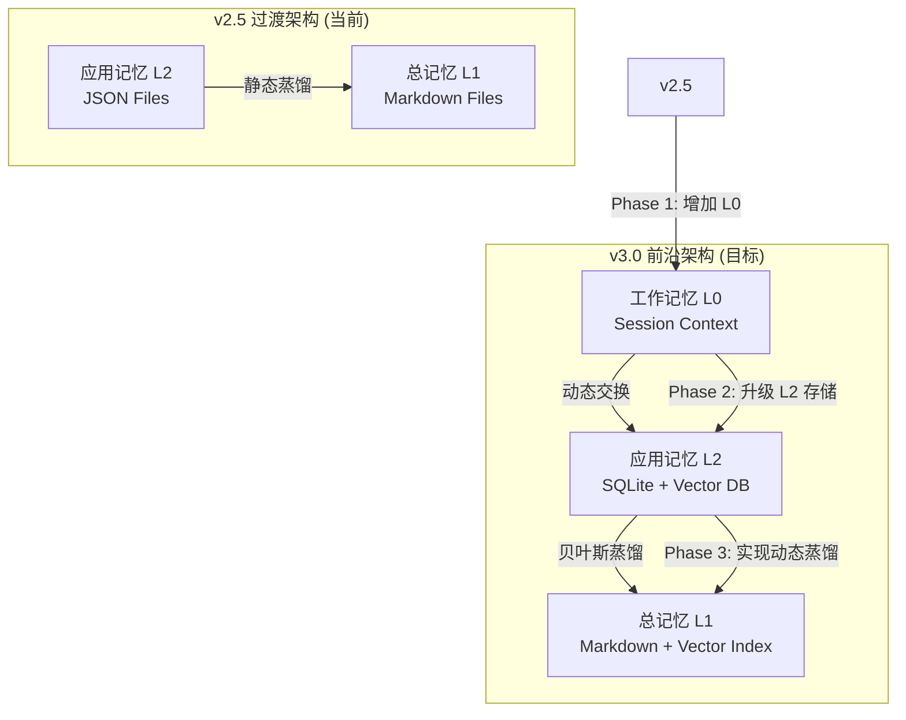

# AI 记忆管理架构评估与优化建议

**日期**: 2026-07-27
**目标**: 构建前沿的 AI 自我进化管理系统
**核心基准**: 认知-理论-实践闭环架构

---

## 一、 前沿 AI 记忆管理系统调研

为了确保我们的架构具备前沿性，我们调研了 GitHub 上最具代表性的 AI Agent 记忆管理框架。

### 1.1 核心标杆项目

| 项目名 | Stars | 核心理念 | 记忆分层 | 存储机制 | 亮点 |
|--------|-------|----------|----------|----------|------|
| **Letta (原 MemGPT)** | 15.4K | 操作系统虚拟内存 | L1: Core Memory<br>L2: Recall Memory | 内存/文件 | **无限上下文**: 通过分页/交换机制突破 Token 限制 |
| **Mem0** | 14.2K | 通用记忆中间件 | User Memory<br>Agent Memory | 向量数据库 | **开箱即用**: 作为 LLM 与数据库的桥梁，支持跨应用共享 |
| **Zep** | 12.7K | 高性能对话记忆 | Short-term<br>Long-term | 图数据库/向量库 | **实体图谱**: 存储用户/Agent 交互的实体关系，支持精确推理 |
| **MemOS** | 4.1K | 操作系统级记忆 | Memory File System<br>Memory Database | 文件系统 | **Git 版本控制**: 记忆可追溯、可回滚、可分叉 |

### 1.2 核心架构对比

#### A. Letta (MemGPT)：上下文管理的王者
*   **分层模型**:
    *   **Core Memory (L1)**: 始终保持在 System Prompt 中，存储 Agent 的核心指令、身份和当前任务的关键状态（如同 CPU 缓存）。
    *   **Recall Memory (L2)**: 存储在数据库中，通过函数调用（`core_memory_append` 等）进行检索和更新（如同硬盘）。
*   **核心机制**: **Token 预算管理 (Token Budget Management)**。当上下文接近上限时，自动触发总结或转移。
*   **启示**: 我们的架构 **缺乏明确的“工作记忆”层**。我们需要一个类似 Core Memory 的组件来管理当前任务的中间状态，而不仅仅是依赖 LLM 的 Context Window。

#### B. Zep / Mem0：结构化存储的典范
*   **存储模型**:
    *   Zep 使用 **Graph Database** 存储实体（Entity）和关系（Relation），例如 `"用户A" 喜欢 "策略B"`。
    *   Mem0 使用 **Vector Database** 存储语义嵌入，支持 `"用户喜欢的交易策略"` 这样的模糊查询。
*   **核心机制**: **Entity Extraction & Summarization**。自动从对话中提取事实（Facts）并更新图谱。
*   **启示**: 我们的应用记忆（L2） **需要更强大的存储后端**。目前的 JSON 文件难以支持复杂的语义检索和关系推理，应引入向量数据库（如 Chroma, FAISS）或图数据库。

#### C. 我们的架构 (DreamBuddy v2)：认知闭环的先驱
*   **分层模型**:
    *   **L1: 总记忆** (MU-DEV/TRD/DOC/INF): 存储经过验证的、普适的原则、方法论和经验（如同**知识库**）。
    *   **L2: 应用记忆** (AM-TRD/RSK/OPS/EXP): 存储特定子系统的、场景化的实践和教训（如同**工作笔记**）。
*   **核心机制**: **贝叶斯置信度更新 (Bayesian Confidence Update)**。通过 A8 校验引擎的“观察”结果，动态更新记忆的 S/A/B/C/D 质量等级。
*   **亮点**: **闭环控制**。我们的架构不仅存储记忆，还通过 A8 校验和贝叶斯更新形成了一个“生成-验证-更新”的闭环，这在业界是**独一无二**的。其他框架（如 Letta）主要关注存储和检索，很少涉及记忆质量的自动迭代。

---

## 二、 架构评估：优势与不足

### 2.1 核心优势（我们的护城河）

1.  **贝叶斯自我进化机制**: 这是我们最核心的竞争力。通过引入贝叶斯定理，系统能够**自动评估记忆的有效性**。当代码运行结果（A8校验）与记忆预测一致时，置信度提升；否则下降。这使得系统具备了**真正的机器学习**能力，而不仅仅是存储历史信息。
2.  **理论-实践双向绑定**: 通过 `A8 校验引擎`，我们强制将“理论”（文档）与“实践”（代码）绑定。文档必须反映代码，代码必须符合文档，这种强约束保证了系统的**一致性和可维护性**。
3.  **清晰的权责分离**: 我们严格区分了“知识库”（是什么）和“记忆系统”（为什么/怎么做），以及“总记忆”（全局）和“应用记忆”（局部），这种分层避免了记忆的混乱。

### 2.2 存在不足（优化空间）

1.  **缺少“工作记忆”层 (Working Memory)**:
    *   **现状**: 目前我们的“短期记忆”完全依赖于 LLM 的 Context Window。当任务复杂时，历史信息会被截断，导致“遗忘”。
    *   **目标**: 增加一个显式的“工作记忆”层，作为当前任务的“工作台”，存储关键中间变量和阶段性结论。这对应 Letta 的 Core Memory。
2.  **存储后端过于简单**:
    *   **现状**: 应用记忆（L2）主要使用 JSON 文件存储，检索效率低，无法进行语义搜索。
    *   **目标**: 引入 **SQLite + Vector Embedding**。SQLite 存储结构化数据，向量数据库（如 SQLite-vss, Chroma）存储语义嵌入，支持 `search("交易止损的最佳实践")` 这样的查询。
3.  **蒸馏机制静态化**:
    *   **现状**: 记忆从 L2 上升到 L1 的蒸馏过程需要手动触发或定时执行。
    *   **目标**: 实现**动态蒸馏**。当应用记忆的置信度（Confidence）自动达到阈值时，自动触发蒸馏过程。

---

## 三、 架构优化建议：打造前沿系统

基于以上分析，我们提出以下架构升级计划：

### 3.1 升级路径图 (Roadmap)



### 3.2 具体优化措施

#### 优化 1: 增加 "工作记忆 L0" 层
*   **定位**: AI Agent 的“大脑工作台”，存储当前会话/任务的临时上下文。
*   **实现**:
    *   创建 `5-工作记忆/` 目录。
    *   实现 `WorkingMemoryManager` 类，管理当前任务的核心状态（如：当前分析的币种、使用的策略、上一步的结论）。
    *   在 `COGNITIVE_ARCHITECTURE.md` 中更新认知层模型。
*   **接口示例**:
    ```python
    wm = WorkingMemoryManager(task_id="T-001")
    wm.set("current_symbol", "BTC")
    wm.set("analysis_conclusion", "多头趋势确立")
    context = wm.get_context()  # 返回注入到 System Prompt 的字符串
    ```

#### 优化 2: 升级 "应用记忆 L2" 存储
*   **定位**: 从 JSON 文件升级到 **SQLite + 向量数据库**。
*   **实现**:
    *   使用 SQLite 存储记忆的元数据（ID、时间戳、质量等级、标签）。
    *   使用 SQLite 的 `sqlite-vec` 扩展或 Chroma 存储记忆内容的 Embedding。
    *   实现 `VectorMemoryInterface`，支持语义搜索。
*   **接口示例**:
    ```python
    vm = VectorMemoryInterface(storage_path="11-易经推理系统/memory")
    vm.add_memory(content="BTC在周线突破后通常有3天的惯性", tags=["BTC", "突破", "趋势"])
    results = vm.search("突破后的惯性", top_k=5)  # 返回语义相似的记忆
    ```

#### 优化 3: 实现 "动态蒸馏" 机制
*   **定位**: 当应用记忆的质量等级达到 S/A 时，自动上升为总记忆。
*   **实现**:
    *   在 `BayesianMemoryUpdater` 中增加 `auto_distill` 触发钩子。
    *   当 `update_confidence` 函数将记忆等级更新为 "A" 或 "S" 时，自动调用 `DistillScheduler.distill_to_global`。
    *   移除手动触发的 `run_once` 方法，改为完全事件驱动。

### 3.3 最终态架构 (Final State)

*   **L0 工作记忆 (Working Memory)**:
    *   **生命周期**: 短（单次会话/任务）。
    *   **存储**: 内存、临时文件。
    *   **内容**: 当前任务的核心状态、中间变量、上下文摘要。
*   **L1 应用记忆 (Application Memory)**:
    *   **生命周期**: 中（特定领域/子系统）。
    *   **存储**: SQLite + 向量数据库。
    *   **内容**: 特定领域的场景化经验、踩坑记录、临时解决方案。
    *   **管理**: 被动更新（子系统调用时）。
*   **L2 总记忆 (Global Memory)**:
    *   **生命周期**: 长（全局通用）。
    *   **存储**: Markdown + 向量索引。
    *   **内容**: 普适的原则、方法论、核心经验（如 A1 调研法）。
    *   **管理**: 主动蒸馏（从 L1 上升而来）。

---

## 四、 结论与行动项

### 4.1 结论
我们当前的“认知-理论-实践”闭环架构在**理念上是前沿的**，特别是“贝叶斯自我进化”机制是业界独有的。但在**工程实现**上，我们需要向 Letta 和 Zep 学习，增加“工作记忆”层和“向量存储”能力，以构建真正具备工业级强度的 AI 管理系统。

### 4.2 行动项 (Action Items)

| 优先级 | 任务 | 目标 |
|--------|------|------|
| **P0** | **实现 L0 工作记忆** | 为 AI Agent 提供显式的、可控的上下文管理机制。 |
| **P1** | **调研 SQLite-VSS** | 评估使用 SQLite 向量扩展的可行性，降低引入新依赖的复杂度。 |
| **P2** | **升级核心接口** | 修改 `BayesianMemoryUpdater` 实现动态蒸馏钩子。 |
| **P3** | **编写架构白皮书** | 基于本次评估，输出一份正式的架构设计文档，指导未来开发。 |

---

**评估人**: Dream Architect
**下一步**: 启动 P0 任务，开发 `WorkingMemoryManager`。