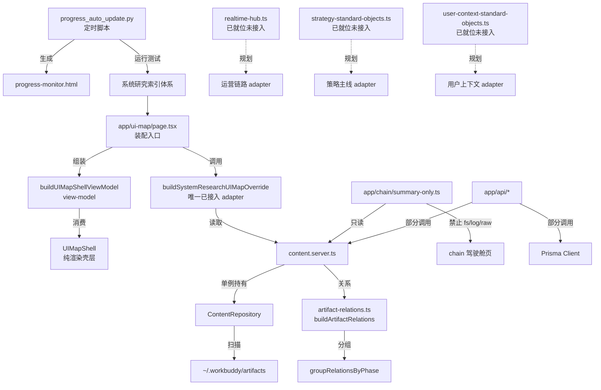

# 产物中台 — 技术设计文档

> **版本**: v1.0 | **更新日期**: 2026-08-02
> **定位**: 7-产物中台 技术设计文档，定义产物管理与投递中台的分层架构、核心算法、数据流、接口与扩展机制
> **关联**: [ENGINEERING_INDEX.md](./ENGINEERING_INDEX.md) · [FAQ.md](./FAQ.md)
> **遵循规范**: [DOC_STANDARD.md](../../0-系统文档管理/1-规范体系/DOC_STANDARD.md) §3.2

---

## 1. 概述

### 1.1 系统定位

7-产物中台是 DreamBuddy-V2 的**产物管理与投递中台**总容器，承担三类职责：

- **产物管理**：统一索引、组织、检索系统研究沉淀的产物（artifact），构建产物间关系链路与阶段分组。
- **进度更新**：通过定时脚本自动检测 Git 状态、运行测试套件、生成监控页面并维护 HTTP 服务自愈。
- **投递路由**：以 `ui-map` 独立中台首页为统一出口，将产物数据装配为 view-model，投递至纯渲染壳层。

中台采用"总容器 + 实现工程"的双层结构：

- `7-产物中台/` 为总容器与治理文档沉淀区。
- `7-产物中台/系统研究索引体系/` 为已归位并可运行的 Next.js 实现工程（`dream-product-hub` v0.2.0，dev 端口 3456），承载 `ui-map` 真实实现入口、产物数据源、运营实时数据源、推荐引擎与后台能力。
- `ui-map/`、`用户上下文索引系统/`、`策略主线/`、`系统研究链路/`、`系统运营链路/` 为模块预留目录（仅含 `.gitkeep`），真实实现集中在 `系统研究索引体系/app/ui-map/` 与 `系统研究索引体系/lib/`。

### 1.2 设计目标

- **单一真相源**：产物索引与关系统一由 `content.server.ts` 经 `ContentRepository` 提供，避免多处读取造成不一致。
- **双入口降级**：view-model 支持真实 override 与 fixture 双入口，真实数据缺失时自动回退，保证中台首页始终可渲染。
- **壳层与数据分离**：`UIMapShell` 仅消费 view-model，不直接访问文件系统或日志，保证渲染层纯净。
- **敏感信息不透出**：用户配置、执行状态等敏感数据不进入中台首页，仅展示聚合统计与覆盖率。
- **自愈与可观测**：进度更新脚本具备备份、HTTP 服务自愈、失败详情提取与控制台报告，支持 crontab 定时运行。

### 1.3 业务边界

| 职责 | 归属 |
|---|---|
| 产物索引、关系、阶段分组 | 本模块（`lib/content.server.ts`、`lib/content.repository.ts`） |
| ui-map 中台首页装配与渲染 | 本模块（`app/ui-map/`） |
| A 系列三环驾驶舱 summary-only 聚合 | 本模块（`app/chain/summary-only.ts`） |
| 推荐引擎触发与策略库查询 | 本模块（`app/api/recommendation-engine/`） |
| 运营实时事件总线（内存） | 本模块（`lib/realtime-hub.ts`） |
| 进度监控页生成与 HTTP 自愈 | 本模块（`progress_auto_update.py`） |
| 交易执行、行情数据生产 | 其他模块（本中台只读消费产物） |
| 用户配置敏感数据存储 | 其他模块（本中台仅展示脱敏聚合） |

### 1.4 实现状态总览

> 本节如实标注已实现与规划中模块，避免文档与代码不一致。

| 模块 | 状态 | 说明 |
|---|---|---|
| 系统研究索引体系（Next.js 工程） | ✅ 已实现 | 完整可运行工程，含 app/lib/components/prisma/scripts |
| 产物索引数据源（content.server / repository） | ✅ 已实现 | 7 个导出函数，单例 + mtime 缓存 |
| 产物关系与阶段分组（artifact-relations） | ✅ 已实现 | `buildArtifactRelations` / `groupRelationsByPhase` |
| ui-map 壳层与 view-model | ✅ 已实现 | `UIMapShell` + `buildUIMapShellViewModel`，仅接受 `systemResearch` override |
| 系统研究索引 adapter | ✅ 已实现并接入 | `buildSystemResearchUIMapOverride` 已在 `page.tsx` 装配 |
| 研究链路 adapter | ⚠️ 规划中 | `buildResearchChainUIMapOverride` 仅在压力测试脚本引用，未实现 |
| 运营链路 adapter | ⚠️ 规划中 | `buildOperationsUIMapOverride` 未实现；数据源 `realtime-hub.ts` 已就位 |
| 策略主线 adapter | ⚠️ 规划中 | `buildStrategyUIMapOverride` 未实现；标准对象 `strategy-standard-objects.ts` 已就位 |
| 用户上下文索引 adapter | ⚠️ 规划中 | `buildUserContextUIMapOverride` 未实现；标准对象 `user-context-standard-objects.ts` 已就位 |
| A 系列三环驾驶舱（chain） | ✅ 已实现 | `summary-only.ts` 聚合，禁止 fs/log/raw 读取 |
| 推荐引擎 API | ✅ 已实现 | trigger / current-strategy / library / backtests / internal/strategy |
| 后台管理 API | ✅ 已实现 | admin/* 路由集 |
| 进度自动更新脚本 | ✅ 已实现 | `progress_auto_update.py`，6 个 Task 检测 |
| `ui-map/` 预留目录 | ⚠️ 占位 | 仅 `.gitkeep` |
| `用户上下文索引系统/` 预留目录 | ⚠️ 占位 | 仅 `.gitkeep` |
| `策略主线/` 预留目录 | ⚠️ 占位 | 仅 `.gitkeep` |
| `系统研究链路/` 预留目录 | ⚠️ 占位 | 仅 `.gitkeep` |
| `系统运营链路/` 预留目录 | ⚠️ 占位 | 仅 `.gitkeep` |

---

## 2. 架构设计

### 2.1 分层架构

```
┌──────────────────────────────────────────────────────────────┐
│                   7-产物中台（总容器）                          │
│  ┌────────────┐  ┌──────────────┐  ┌──────────────────────┐  │
│  │ docs/ 治理  │  │ progress_auto │  │ 预留模块目录（占位）   │  │
│  │ ENGINEERING │  │ _update.py    │  │ ui-map/ 策略主线/    │  │
│  │ FAQ spec    │  │ 进度更新脚本   │  │ 研究链路/ 运营链路/   │  │
│  └────────────┘  └──────────────┘  └──────────────────────┘  │
└──────────────────────────────────────────────────────────────┘
                              │
                              ▼
┌──────────────────────────────────────────────────────────────┐
│            系统研究索引体系（Next.js 实现工程）                  │
│  ┌──────────────────────────────────────────────────────┐    │
│  │  入口层  app/ui-map/  app/chain/  app/admin/  app/api │    │
│  │  page.tsx → UIMapShell → view-model                   │    │
│  └──────────────────────────────────────────────────────┘    │
│                              │                                │
│  ┌──────────────────────────────────────────────────────┐    │
│  │  核心层  lib/（数据源、adapter、标准对象、关系构建）       │    │
│  │  content.server │ content.repository │ artifact-rel   │    │
│  │  ui-map-real-data │ realtime-hub │ dream-agent-gateway│    │
│  │  strategy-standard │ user-context-standard            │    │
│  └──────────────────────────────────────────────────────┘    │
│                              │                                │
│  ┌──────────────────────────────────────────────────────┐    │
│  │  工具层  prisma/  scripts/  components/                │    │
│  │  schema.prisma │ recommendation-engine │ pagefind     │    │
│  └──────────────────────────────────────────────────────┘    │
│                              │                                │
│  ┌──────────────────────────────────────────────────────┐    │
│  │  数据底座                                               │    │
│  │  ~/.workbuddy/artifacts（产物文件树）                   │    │
│  │  SQLite（prisma）│ 实时事件流（内存 EventEmitter）       │    │
│  └──────────────────────────────────────────────────────┘    │
└──────────────────────────────────────────────────────────────┘
```

### 2.2 模块关系



### 2.3 分层职责

| 层级 | 目录 / 文件 | 职责 |
|---|---|---|
| 渲染壳层 | `app/ui-map/UIMapShell.tsx`、`UIMapClient.tsx`、`UIMapModuleCard.tsx` | 纯渲染，消费 view-model，不访问数据源 |
| 装配入口 | `app/ui-map/page.tsx` | 服务端装配，调用 `buildSystemResearchUIMapOverride`，组装 view-model |
| view-model 层 | `app/ui-map/ui-map-shell-view-model.ts` | view-model 生成，支持 override / fixture 双入口与降级 |
| 场景 fixture | `app/ui-map/ui-map-scenarios.ts` | 降级模式数据，真实 override 为 null 时保底 |
| adapter 层 | `lib/ui-map-real-data.ts` | 真实数据 adapter（当前仅 `buildSystemResearchUIMapOverride`） |
| 数据源层 | `lib/content.server.ts`、`lib/content.repository.ts`、`lib/artifact-relations.ts` | 产物索引、关系构建、阶段分组 |
| 标准对象层 | `lib/strategy-standard-objects.ts`、`lib/user-context-standard-objects.ts` | 策略与用户上下文的视图契约（已就位，未接入 ui-map） |
| 实时数据层 | `lib/realtime-hub.ts`、`lib/realtime-sse.ts` | 运营事件总线（已就位，未接入 ui-map） |
| chain 聚合层 | `app/chain/summary-only.ts` | A 系列三环驾驶舱 summary-only 聚合，禁止 fs/log/raw |
| API 层 | `app/api/*` | 对外 HTTP 接口（产物统计、缓存刷新、推荐引擎、后台管理） |
| 进度更新层 | `progress_auto_update.py` | Git 状态检测、测试运行、监控页生成、HTTP 自愈 |

---

## 3. 核心算法

### 3.1 产物索引构建与缓存失效（ContentRepository）

`ContentRepository` 基于产物文件树构建规范索引，采用 **mtime 戳双级缓存**：索引文件 mtime + 源文件 mtime。

**伪代码：**

```python
# content.repository.ts ensureFreshIndex 伪代码
def ensure_fresh_index():
    index_mtime = compute_index_mtime()       # 取所有 category/index.json 的最大 mtime
    if cache is None or cache.index_mtime != index_mtime:
        cache = scan_index()                  # 全量重建
        cache.stamp = { index_mtime, source_mtimes }
        detail_cache.clear()
        return cache

    # index_mtime 未变，再逐文件比对源文件 mtime
    next_mtimes = get_source_mtimes(cache)
    if any(source mtime changed):
        cache = scan_index()
        cache.stamp = { index_mtime, next_mtimes }
        detail_cache.clear()
    return cache
```

**单例持有伪代码（content.server.ts）：**

```python
singleton_root = ""
singleton_repo = None

def get_repository():
    root = resolve_artifacts_root()  # 优先环境变量，回退默认路径
    if singleton_repo is None or singleton_root != root:
        singleton_root = root
        singleton_repo = ContentRepository(root)
    return singleton_repo

def invalidate_cache():
    singleton_root = ""
    singleton_repo = None
```

**产物 root 解析优先级：**

```
环境变量 WORKBUDDY_ARTIFACTS_ROOT
    ↓ 覆盖
默认路径 ~/.workbuddy/artifacts
```

### 3.2 产物关系构建与阶段分组

`buildArtifactRelations` 从规范索引筛选含 `chainPhase` 的产物，生成关系记录；`groupRelationsByPhase` 按阶段分组并按日期倒序限量。

**伪代码：**

```python
def build_artifact_relations(index):
    return [
        {
            artifactId, chainPhase, feedHref: detailUrl,
            chainHref: f"/chain?phase={chainPhase}&artifact={artifactId}",
            nodeId: chainPhase, title, date
        }
        for item in index if item.chainPhase
    ]

def group_relations_by_phase(relations, limit_per_phase=3):
    grouped = {}
    for r in relations:
        grouped.setdefault(r.chainPhase, []).append(r)
    for phase in grouped:
        grouped[phase] = sorted(by date desc)[:limit_per_phase]
    return grouped
```

### 3.3 chain 驾驶舱活跃环推断（buildChainSummaryPayload）

`summary-only.ts` 基于产物索引推断当前活跃的三环（execution / intelligence / governance）。

**映射表：**

```
A1~A5, A9 → execution（执行环）
A6        → intelligence（情报环）
A0, A7, A8 → governance（治理环）
```

**推断伪代码：**

```python
def infer_active_loop(today_counts):
    if has_today_in("intelligence"): return "intelligence"
    if has_today_in("governance"):   return "governance"
    if has_today_in("execution"):    return "execution"
    # 无今日产物时，按各环产物总数降序取最高
    return max_loop_by_total_count()
```

**约束：** summary-only 严禁读取原始交易日志、原始产物内容、仓位/订单/PnL 等敏感字段，仅暴露阶段计数、最新时间戳、标题（限量）。

### 3.4 ui-map adapter 容错

`buildSystemResearchUIMapOverride` 采用"异常即降级"策略，整体 try/catch，任意异常或无数据返回 `null`。

**伪代码：**

```typescript
export function buildSystemResearchUIMapOverride(): Override | null {
  try {
    const artifactsData = getArtifactsData();
    if (!artifactsData.total) return null;          // 无数据降级
    const relations = getArtifactRelations();
    const groupedByPhase = getChainPhaseArtifacts();
    return {
      description: `已接入真实系统研究数据：${total} 个产物...`,
      bullets: [ /* 聚合统计 */ ],
    };
  } catch {
    return null;                                    // 异常降级
  }
}
```

> ⚠️ 当前 `lib/ui-map-real-data.ts` 仅实现此一个 adapter。研究链路 / 运营链路 / 策略主线 / 用户上下文四个 adapter 为规划中，未实现。

### 3.5 进度更新主流程（progress_auto_update.py）

**主流程伪代码：**

```python
def main():
    git_state = detect_git_state()              # git log / status / diff HEAD~1
    test_results = run_all_tests()              # tsx --test + HTTP 探测
    tasks = detect_task_completion(test_results)  # 6 个 Task 三证据判定
    backup_old_page()                           # 备份并保留最近 5 份
    html = render_html(git_state, tasks, test_results)
    write_html(html)
    server_status = ensure_http_server()        # 端口探测 + 僵尸清理 + 重启验证
    print_report(git_state, tasks, test_results, server_status)
```

**Task 完成度三证据判定：**

| Task | 名称 | 判定依据 |
|---|---|---|
| task1 | 壳层 view-model 与基础语义 | scenarios / view-model / test 文件齐备且测试通过 |
| task2 | 页面组件与路由入口 | UIMapModuleCard / UIMapShell / UIMapClient / page / page.test 齐备且通过 |
| task3 | 来源层语义增强 | view-model 与 shell 含 sourceLayer / 业务来源层 |
| task4 | 主线层与双索引语义 | view-model 与 shell 含 mainlineLayer / 策略主线 / indexFoundation |
| task5 | 导航入口与 ui-map 导航项 | page.tsx 含入口、Header.tsx 含导航、navigation.test.ts 存在 |
| task6 | 压力测试脚本与自动测试文档 | ui-map-pressure-check.mjs 存在且文档含自动测试章节 |

**测试结果四模式解析：** 优先本地 `node_modules/.bin/tsx`，失败回退 `npx tsx`；通过四模式解析 TAP 输出（`# tests`/`# pass` 行、`X passed` 形式、`ok`/`not ok` 行、Unicode `ℹ` 符号）。

---

## 4. 数据流

### 4.1 产物索引主数据流

```
~/.workbuddy/artifacts（产物文件树，category/index.json + 产物源文件）
    ↓ ContentRepository.scanIndex() 扫描
CanonicalArtifactIndex[]（规范索引）
    ↓ getArtifactsIndex() / getArtifactsData()
    ↓ buildArtifactRelations() → getArtifactRelations()
    ↓ groupRelationsByPhase() → getChainPhaseArtifacts()
    ↓ buildSystemResearchUIMapOverride()（唯一已接入 adapter）
    ↓ buildUIMapShellViewModel(scenario, { systemResearch: override })
    ↓ UIMapShell 渲染
中台首页
```

### 4.2 chain 驾驶舱数据流

```
content.server.ts（规范索引）
    ↓ buildChainSummaryPayload()（summary-only，只读）
    ↓ 阶段计数 + 今日计数 + 活跃环推断
    ↓ ChainMindmap 渲染
chain 驾驶舱页（禁止 fs/log/raw）
```

### 4.3 运营实时数据流（已就位，未接入 ui-map）

```
运营事件源
    ↓ realtime-hub.ts publish(channel, payload)
    ↓ 内存 EventEmitter + history（每通道保留最近 20 条）
    ↓ getRecentEvents(channel) / subscribe(channel, listener)
    ↓ realtime-sse.ts 编码为 text/event-stream
    ↓ /api/realtime/stream?channel=xxx
前端 SSE 消费
```

> 注：`realtime-hub.ts` 数据源已就位并被 `dream-agent-gateway.ts` 用于发布 Dream Agent 事件，但 `buildOperationsUIMapOverride` adapter 未实现，尚未接入 ui-map 装配。

### 4.4 推荐引擎数据流

```
/api/recommendation-engine/trigger（POST）
    ↓ spawn python3 scripts/recommendation-engine/engine.py --baseline v9 [--force]
    ↓ 引擎生成候选策略 → 回测 → 写入 Prisma（strategies / strategy_backtest_records）
/api/recommendation-engine/current-strategy（GET）
    ↓ Prisma 查询 APPROVED/APPLIED 的 RECOMMENDED 策略
/api/recommendation-engine/library（GET）
    ↓ Prisma 查询 isInLibrary 策略库
/api/recommendation-engine/backtests（GET）
    ↓ Prisma 分页查询回测历史
```

### 4.5 进度更新数据流

```
crontab 定时触发（建议 */30 * * * *）
    ↓ detect_git_state()（git log / status / diff）
    ↓ run_all_tests()（tsx --test + HTTP 探测）
    ↓ detect_task_completion()（文件 + 内容 + 测试 三证据）
    ↓ backup_old_page() → render_html() → write_html()
    ↓ ensure_http_server()（端口探测 + 僵尸清理 + 重启验证）
    ↓ print_report()（控制台报告 + 下次运行时间）
```

---

## 5. 接口设计

### 5.1 内部接口 — 产物数据源（lib/content.server.ts）

| 函数 | 签名 | 说明 |
|---|---|---|
| `getArtifactsIndex` | `() => CanonicalArtifactIndex[]` | 全量产物规范索引 |
| `getArtifactsData` | `() => ArtifactsData` | 产物统计聚合（含 by_department / by_type / by_status / by_chain_phase / by_a_phase） |
| `getArtifactBySlug` | `(slug: string) => ArtifactDetailPayload \| null` | 按 `category/artifactId` slug 查详情 |
| `getArtifactRelations` | `() => ArtifactRelation[]` | 产物关系列表 |
| `getChainPhaseArtifacts` | `(limitPerPhase?: number) => ChainPhaseArtifacts` | 阶段分组，默认每阶段 3 条 |
| `getAllSlugs` | `() => string[]` | 全量 slug 列表（`category/artifactId`） |
| `invalidateCache` | `() => void` | 重置单例仓库，强制下次重建 |

### 5.2 内部接口 — ContentRepository（lib/content.repository.ts）

| 方法 | 签名 | 说明 |
|---|---|---|
| `getArtifactsIndex` | `() => CanonicalArtifactIndex[]` | 返回规范索引（带 mtime 缓存） |
| `getArtifactDetailBySlug` | `(slug: string) => ArtifactDetailPayload \| null` | 按详情缓存读取，支持 markdown/json |
| `getArtifactsData` | `() => ArtifactsData` | 聚合统计，version="3.0" |

### 5.3 内部接口 — 关系构建（lib/artifact-relations.ts）

| 函数 | 签名 | 说明 |
|---|---|---|
| `buildArtifactRelations` | `(index: CanonicalArtifactIndex[]) => ArtifactRelation[]` | 构建产物关系 |
| `groupRelationsByPhase` | `(relations: ArtifactRelation[], limitPerPhase?) => ChainPhaseArtifacts` | 按阶段分组并限量 |

### 5.4 内部接口 — ui-map adapter 与 view-model

| 函数 | 签名 | 状态 | 说明 |
|---|---|---|---|
| `buildSystemResearchUIMapOverride` | `() => UIMapSystemResearchOverride \| null` | ✅ 已实现 | 系统研究索引 override，已接入 page.tsx |
| `buildResearchChainUIMapOverride` | — | ⚠️ 规划中 | 研究链路 override |
| `buildOperationsUIMapOverride` | — | ⚠️ 规划中 | 运营链路 override |
| `buildStrategyUIMapOverride` | — | ⚠️ 规划中 | 策略主线 override |
| `buildUserContextUIMapOverride` | — | ⚠️ 规划中 | 用户上下文 override |
| `buildUIMapShellViewModel` | `(scenario, overrides?: UIMapShellOverrides) => UIMapShellViewModel` | ✅ 已实现 | view-model 生成，`UIMapShellOverrides` 当前仅含 `systemResearch` 字段 |

**契约约定：** 所有 adapter 统一约定"成功返回 override 对象，失败或无数据返回 `null`"，由 view-model 层降级到 fixture。

### 5.5 内部接口 — 标准对象（已就位，未接入 ui-map）

| 函数 | 文件 | 签名 | 说明 |
|---|---|---|---|
| `parseStrategyArtifact` | `strategy-standard-objects.ts` | `(artifact) => StrategySettingResult \| null` | 从产物解析策略设置 |
| `buildStrategyFullView` | `strategy-standard-objects.ts` | `(artifact) => StrategyFullView \| null` | 构建策略完整视图（含设置/任务/执行/结果） |
| `buildUserContextSummary` | `user-context-standard-objects.ts` | `(artifactsData, contextType?) => UserContextFullView` | 构建用户上下文摘要（脱敏） |

### 5.6 内部接口 — 实时数据与网关

| 函数 | 文件 | 签名 | 说明 |
|---|---|---|---|
| `createRealtimeHub` | `realtime-hub.ts` | `(options?) => { publish, subscribe, getRecentEvents }` | 创建事件总线实例 |
| `getRealtimeHub` | `realtime-hub.ts` | `() => RealtimeHub` | 单例获取事件总线 |
| `invokeDreamAgent` | `dream-agent-gateway.ts` | `(input: DreamAgentInvokeInput) => Promise<DreamAgentInvokeSuccess>` | 调用 Dream Agent 后端，发布实时事件 |
| `buildChainSummaryPayload` | `app/chain/summary-only.ts` | `() => ChainSummaryPayload` | chain 驾驶舱 summary-only 聚合 |

### 5.7 对外接口 — HTTP API 路由（app/api/）

> Next.js Route Handlers，`export const dynamic = "force-dynamic"` 强制动态渲染。

| 路由 | 方法 | 说明 |
|---|---|---|
| `/api/stats` | GET | 产物统计（total / departments / by_department / by_type / by_status） |
| `/api/refresh` | POST | 手动刷新产物缓存（`invalidateCache` 后重扫） |
| `/api/refresh` | GET | 查询缓存状态与统计 |
| `/api/recommendation-engine/trigger` | POST | 手动触发推荐引擎（spawn `engine.py`，支持 `force` / `baseline` 参数，5 分钟超时） |
| `/api/recommendation-engine/current-strategy` | GET | 当前推荐策略（APPROVED/APPLIED 的 RECOMMENDED 策略，含回测记录） |
| `/api/recommendation-engine/library` | GET | 策略库（`isInLibrary` 策略，支持 `includeArchived` 参数） |
| `/api/recommendation-engine/backtests` | GET | 回测历史（分页，支持 `page` / `pageSize` / `strategyId` / `baselineVersion`） |
| `/api/recommendation-engine/internal/strategy` | — | 内部策略接口 |
| `/api/dream-agent/invoke` | POST | 调用 Dream Agent（转发至 `DREAM_AGENT_API_BASE`，发布实时事件） |
| `/api/realtime/stream` | GET | 实时事件 SSE 流（`channel` 参数：dream-agent / meeting / system） |
| `/api/meeting/stream` | GET | 会议辩论 SSE 流（按脚本推进，发送 conclusion） |
| `/api/admin/stats/overview` | GET | 后台业务数据总览（`getBusinessDataView`） |
| `/api/admin/api-configs` | GET/POST | API 配置管理 |
| `/api/admin/channels` | GET/POST | 通信渠道管理 |
| `/api/admin/credits` | GET/POST | 积分管理 |
| `/api/admin/executions` | GET | 执行记录 |
| `/api/admin/orders` | GET | 订单管理 |
| `/api/admin/strategies` | GET/POST | 策略管理 |
| `/api/admin/strategies/[id]` | GET/PATCH | 单策略详情 |
| `/api/admin/tasks` | GET/POST | 任务管理 |
| `/api/admin/trading-params` | GET/PATCH | 交易参数 |
| `/api/admin/users` | GET | 用户列表 |
| `/api/admin/users/[uid]` | GET/PATCH | 单用户详情 |

### 5.8 对外接口 — 进度更新脚本（CLI）

```
python3 progress_auto_update.py
```

- **输入**：无命令行参数，配置硬编码于脚本顶部。
- **输出**：控制台执行报告 + `progress-monitor.html` 页面 + HTTP 服务（端口 62932）。
- **定时**：建议 crontab `*/30 * * * *`，日志重定向至 `progress-task.log`。

**脚本主要函数：**

| 函数 | 说明 |
|---|---|
| `run_cmd(cmd, cwd?, timeout?)` | 执行 shell 命令，超时返回 returncode=-1 |
| `file_exists(p)` / `file_contains(p, pattern)` | 文件存在性 / 内容正则匹配 |
| `detect_git_state()` | 检测 git log / status / diff HEAD~1 |
| `detect_task_completion(test_results)` | 6 个 Task 三证据判定 |
| `run_node_test(name, test_path)` | 运行单个 node:test 并四模式解析 |
| `run_all_tests()` | 聚合测试结果 + HTTP 探测 |
| `backup_old_page()` | 备份并保留最近 5 份 |
| `render_html(git_state, tasks, test_results)` | 生成监控页 HTML |
| `ensure_http_server()` | 端口探测 + 僵尸清理 + 重启验证 |
| `print_report(...)` | 控制台执行报告 |
| `main()` | 主流程编排 |

---

## 6. 状态管理

### 6.1 状态文件

| 文件 / 变量 | 作用 | 格式 |
|---|---|---|
| `~/.workbuddy/artifacts/<category>/index.json` | 产物分类索引 | JSON |
| `~/.workbuddy/artifacts/<category>/<artifact>.md` | 产物源文件 | Markdown + frontmatter |
| `progress-monitor.html` | 最新监控页面（覆盖写入） | HTML |
| `.monitor-backups/progress-monitor.html.bak.{stamp}` | 历史备份（最多 5 份） | HTML |
| `http-server.log` | HTTP 服务器日志（追加写入） | 文本 |
| Prisma SQLite (`DATABASE_URL`) | 用户/策略/订单/积分等业务数据 | SQLite |

### 6.2 产物仓库单例状态机

```
[空] --getRepository()--> [已加载(root)]
[已加载(root)] --root 变化--> [重建] --> [已加载(newRoot)]
[已加载(root)] --invalidateCache()--> [空]
[已加载(root)] --index.json mtime 变化--> [全量重建]
[已加载(root)] --源文件 mtime 变化--> [全量重建 + detail_cache 清空]
```

### 6.3 实时事件总线状态

`realtime-hub.ts` 以单例方式持有 `EventEmitter`，每通道保留最近 20 条历史事件：

```
[publish(channel, payload)] --> [写入 history + emit]
[subscribe(channel, listener)] --> [注册监听，返回 unsubscribe]
[getRecentEvents(channel)] --> [返回 history 副本]
```

### 6.4 view-model 装配状态

view-model 装配为**无状态过程**，每次请求重新装配，不持有跨请求状态。降级状态由 adapter 返回值决定：

- `override != null`：真实数据生效。
- `override == null`：降级到 `scenarios` fixture。

### 6.5 进度更新备份状态机

```
[写入新页] --backup_old_page()--> [复制为 .bak.{stamp}]
[备份超过 5 份] --> [按时间倒序删除多余备份]
```

---

## 7. 配置管理

### 7.1 环境变量

| 配置项 | 默认值 | 说明 |
|---|---|---|
| `WORKBUDDY_ARTIFACTS_ROOT` | `~/.workbuddy/artifacts` | 产物文件树根路径 |
| `DATABASE_URL` | — | Prisma SQLite 数据库连接串（必填） |
| `DREAM_AGENT_API_BASE` | `http://127.0.0.1:5001` | Dream Agent 后端地址 |
| `NEXT_PUBLIC_STATIC_EXPORT` | — | 设为 `true` 启用静态导出（Pagefind 全文检索） |
| `HOME` | 用户主目录 | 默认产物 root 依赖 |

### 7.2 Next.js 配置（next.config.js）

| 配置项 | 默认值 | 说明 |
|---|---|---|
| `output` | `undefined`（动态） | 静态导出模式下设为 `'export'` |
| `distDir` | `.next` | 静态导出时设为 `out` |
| `images.unoptimized` | `false` | 静态导出时设为 `true` |

### 7.3 工程脚本配置（package.json）

| 脚本 | 命令 | 说明 |
|---|---|---|
| `dev` | `next dev -p 3456` | 开发服务器（端口 3456） |
| `build` | `next build` | 生产构建 |
| `start` | `next start -p 3456` | 生产启动 |
| `test` | `node --test lib/**/*.test.ts app/**/*.test.ts` | 单元测试 |
| `build:static` | `NEXT_PUBLIC_STATIC_EXPORT=true next build` | 静态导出 |
| `postbuild` | `node scripts/run-pagefind.js` | 构建后生成搜索索引 |
| `pagefind` | `npx pagefind --source ./out --bundle-path ./out/_pagefind` | Pagefind 索引 |

### 7.4 进度更新脚本配置（progress_auto_update.py）

| 配置项 | 默认值 | 说明 |
|---|---|---|
| `PORT` | `62932` | HTTP 服务端口 |
| `SERVER_URL` | `http://127.0.0.1:62932` | HTTP 服务地址 |
| `MAX_BACKUPS` | `5` | 监控页最大备份份数 |
| `MONITOR_HTML` | `7-产物中台/progress-monitor.html` | 监控页输出路径 |
| `BACKUP_DIR` | `7-产物中台/.monitor-backups` | 备份目录 |
| `TEST_FILES` | 4 个测试文件 | 测试套件清单 |
| 测试超时 | `180s` | 单个测试文件运行超时 |
| 命令超时 | `120s` | 通用 shell 命令超时 |
| HTTP 探测超时 | `2s` | 端口连接探测超时 |
| HTTP 重启重试 | `8` 次 | 启动后探测重试次数 |

**路径解析约定（脚本内）：**

```
SCRIPT_DIR       = 7-产物中台/
PROJECT_ROOT     = dreambuddy-v2/
SYSTEM_RESEARCH  = 7-产物中台/系统研究索引体系/
UI_MAP_APP_DIR   = 系统研究索引体系/app/ui-map/
LIB_DIR          = 系统研究索引体系/lib/
DOCS_DIR         = 7-产物中台/docs/
SCRIPTS_DIR      = 系统研究索引体系/scripts/
```

### 7.5 测试运行器配置

- 优先使用 `系统研究索引体系/node_modules/.bin/tsx`。
- 回退到 `npx tsx --test`。
- 工作目录固定为 `系统研究索引体系/`。

---

## 8. 错误处理

### 8.1 adapter 层容错

所有真实数据 adapter 采用"异常即降级"策略，整体 `try/catch` 包裹，任意异常返回 `null`：

```typescript
export function buildXxxUIMapOverride(): Override | null {
  try {
    if (!data.total) return null;   // 无数据降级
    return { /* override */ };
  } catch {
    return null;                    // 异常降级，不抛出
  }
}
```

**策略：** adapter 永不向调用方抛出异常，保证单个模块故障不影响其他模块与首页整体渲染。

### 8.2 summary-only 层容错

`buildChainSummaryPayload` 整体 `try/catch`，异常时返回空但类型完备的 fallback（10 个 A 阶段计数为 0，`activeLoop` 回退为 `execution`），保证 UI 骨架状态。

### 8.3 进度更新脚本容错

| 场景 | 处理策略 |
|---|---|
| 命令超时 | `subprocess.TimeoutExpired` 捕获，返回 returncode=-1 的占位结果 |
| 测试文件缺失 | `exists=False`，结果归零，不影响其他测试 |
| TAP 解析失败 | 四模式兜底，最终 exit_code==0 且无解析结果时计 1 通过 |
| HTTP 端口占用 | `lsof -ti:{PORT} \| xargs kill -9` 清理僵尸进程后重启 |
| HTTP 启动失败 | 8 次重试探测，仍失败则标记 `verified=False`，报告提示检查 |
| 备份删除失败 | `try/except` 忽略，不影响主流程 |
| 主流程异常 | 顶层 `try/except` 捕获，打印 traceback，exit(1) |
| 用户中断 | `KeyboardInterrupt` 捕获，exit(130) |

### 8.4 API 路由容错

| 场景 | 处理策略 |
|---|---|
| 产物数据源异常 | `console.error` + 返回 `{ total: 0, error: '...' }`，HTTP 500 |
| Prisma 查询异常 | `console.error` + 返回 `{ success: false, error }`，HTTP 500 |
| 推荐引擎脚本不存在 | 返回 `{ success: false, error, hint }`，HTTP 404 |
| 推荐引擎超时 | 5 分钟超时 `proc.kill()`，返回 HTTP 504 |
| Dream Agent 后端不可达 | 抛出异常，发布 `request.failed` 事件，HTTP 502 |
| 实时 SSE 通道非法 | 返回 `{ error: 'Invalid channel' }`，HTTP 400 |

### 8.5 渲染层约束

- `app/chain/summary-only.ts` 严格禁止 fs / log / raw content 读取，违反约束由测试保障（`summary-only.test.ts`）。
- `UIMapShell` 不直接访问数据源，仅消费 view-model，避免渲染层引入副作用。

---

## 9. 扩展性设计

### 9.1 新增 ui-map 模块 adapter

若需在中台首页新增一个模块的真实数据接入（如将规划中的 4 个 adapter 落地）：

1. 在 `lib/ui-map-real-data.ts` 新增 `buildXxxUIMapOverride` adapter，遵循"成功返回 override / 失败返回 null"契约。
2. 在 `app/ui-map/ui-map-shell-view-model.ts` 中扩展 `UIMapShellOverrides` 接口（当前仅含 `systemResearch`），新增对应 override 类型与模块 key。
3. 在 `ui-map-scenarios.ts` 中补充对应 fixture 作为降级数据。
4. 在 `app/ui-map/page.tsx` 装配入口调用新 adapter 并传入 `buildUIMapShellViewModel`。
5. 在 `UIMapShell.tsx` / `UIMapModuleCard.tsx` 中新增卡片渲染。
6. 在 `ui-map-real-data.test.ts` 中补充测试。

> 当前 `UIMapShellOverrides` 仅含 `systemResearch` 字段，新增模块必须先扩展此接口。

### 9.2 新增产物统计维度

若需新增产物统计维度（如按时间、按标签）：

1. 在 `ContentRepository.getArtifactsData()` 返回结构的 `statistics` 中补充维度。
2. 在对应 adapter 中读取新字段并写入 override。
3. 在 view-model 与壳层中新增展示位。

### 9.3 新增进度检测 Task

若需在监控页新增一个 Task 检测项：

1. 在 `detect_task_completion()` 中新增 `tasks["taskN"]` 字典项。
2. 定义文件存在性 / 内容匹配 / 测试通过三类证据。
3. 组合 `completed` 判定条件与 `evidence` 文案。
4. `render_html()` 会自动遍历 `task1` ~ `task6` 渲染卡片，如需扩展编号需同步更新遍历列表。

### 9.4 新增对外 API 路由

若需新增 HTTP 接口：

1. 在 `app/api/<path>/route.ts` 新建文件，导出 `GET` / `POST` 等 Next.js Route Handler。
2. 添加 `export const dynamic = "force-dynamic"`。
3. 产物相关接口调用 `lib/content.server.ts`；业务数据接口调用 `lib/prisma-data-hub.ts` 或 Prisma Client。
4. 统一 `try/catch` 容错，返回 `{ success, error }` 结构。
5. 实时流接口使用 `lib/realtime-sse.ts` 编码 SSE。

### 9.5 替换数据源

若需替换某一模块的数据源（如运营链路改为读取数据库）：

1. 新建数据源读取函数，保持返回结构不变。
2. 在对应 adapter 内部替换调用，外部契约（返回 override 或 null）不变。
3. view-model 与壳层无需改动，保证契约稳定。

### 9.6 标准对象契约扩展

策略主线与用户上下文索引的标准对象已就位，扩展视图字段时：

1. 在 `strategy-standard-objects.ts` 或 `user-context-standard-objects.ts` 中扩展视图类型。
2. 在 `buildStrategyFullView` / `buildUserContextSummary` 中填充新字段，注意敏感信息（用户配置、执行状态）不透出。
3. 待 adapter 接入后，壳层按需展示新字段。

---

## 10. 测试体系

### 10.1 测试文件清单

| 测试文件 | 位置 | 覆盖范围 |
|---|---|---|
| `ui-map-shell-view-model.test.ts` | `app/ui-map/` | 壳层 view-model（14 个测试） |
| `page.test.ts` | `app/ui-map/` | 页面入口与路由 |
| `navigation.test.ts` | `app/ui-map/` | 导航项覆盖 |
| `ui-map-real-data.test.ts` | `lib/` | 真实数据注入与降级（18 个测试） |
| `content.server.test.ts` | `lib/` | 产物数据源 |
| `content.repository.test.ts` | `lib/` | 内容仓库 |
| `artifact-relations.test.ts` | `lib/` | 产物关系构建 |
| `realtime-hub.test.ts` / `realtime-sse.test.ts` | `lib/` | 运营实时数据 |
| `dream-agent-gateway.test.ts` | `lib/` | Dream Agent 网关 |
| `org-data.test.ts` | `lib/` | 组织数据 |
| `prisma-data-hub.test.ts` | `lib/` | Prisma 数据中台 |
| `workspace-path-alignment.test.mjs` | `lib/` | 工作区路径对齐 |
| `chain-relations.test.ts` / `summary-only.test.ts` | `app/chain/` | 链路关系与 summary-only 约束 |

### 10.2 压力测试脚本

| 脚本 | 位置 | 说明 |
|---|---|---|
| `ui-map-pressure-check.mjs` | `scripts/` | ui-map 压力检查 |
| `ui-map-real-data-pressure.mjs` | `scripts/` | 真实数据压力（含规划 adapter 引用） |
| `product-hub-stress-test.py` | `scripts/` | 中台压力测试 |
| `stress_test.py` | `scripts/recommendation-engine/` | 推荐引擎压力测试 |

---

## 11. 目录结构

```
7-产物中台/
├── docs/                              # 治理文档与 spec/plan 沉淀区
│   ├── ENGINEERING_INDEX.md           # 工程索引
│   ├── FAQ.md                         # FAQ
│   ├── TECHNICAL_DESIGN.md            # 本文档
│   ├── archive/                       # 归档提示
│   └── superpowers/                   # 正式 spec / plan / contracts
│       ├── specs/  plans/  contracts/  templates/
├── 系统研究索引体系/                   # 可运行的 Next.js 实现工程
│   ├── app/
│   │   ├── ui-map/                    # 中台首页装配与渲染（真实入口）
│   │   ├── chain/                     # A 系列三环驾驶舱（summary-only）
│   │   ├── admin/                     # 后台管理页面
│   │   ├── api/                       # API 路由
│   │   ├── org/                       # 组织树
│   │   ├── meeting/                   # 会议
│   │   └── recommendation-engine/     # 推荐引擎页面
│   ├── components/                    # 通用组件
│   ├── lib/                           # 数据源与 adapter 层
│   ├── prisma/                        # 数据库 schema
│   ├── scripts/                       # 压力测试与维护脚本
│   ├── next.config.js  package.json  tsconfig.json
│   └── tailwind.config.ts  postcss.config.js
├── ui-map/                            # 预留目录（仅 .gitkeep）
├── 用户上下文索引系统/                 # 预留目录（仅 .gitkeep）
├── 策略主线/                          # 预留目录（仅 .gitkeep）
├── 系统研究链路/                      # 预留目录（仅 .gitkeep）
├── 系统运营链路/                      # 预留目录（仅 .gitkeep）
├── progress_auto_update.py            # 进度自动更新脚本
├── progress-monitor.html              # 监控页面（自动生成）
└── .monitor-backups/                  # 监控页历史备份
```

---

## 变更记录

| 版本 | 日期 | 变更内容 |
|---|---|---|
| v1.0 | 2026-08-02 | 初始版本：补建技术设计文档，对齐代码实现，标注 4 个 adapter 为规划中，补全 API 路由与标准对象契约 |

---

**文档版本**: v1.0
**最后更新**: 2026-08-02
**遵循规范**: [DOC_STANDARD.md](../../0-系统文档管理/1-规范体系/DOC_STANDARD.md)
